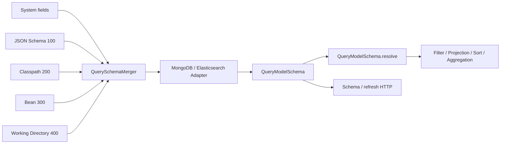

# Query Model Schema

## What the Schema Solves

Query Model Schema is the runtime query-capability contract for `QueryModel.SNAPSHOT` and `QueryModel.EVENT_STREAM`. It resolves logical request fields to backend bindings and records value types, cardinality, temporal semantics, dynamic children, projection paths, and the capabilities available for each operation. The public entry point is `QueryModelSchema.resolve(...)`; it rewrites and validates filters, projections, sorting, and [aggregation queries](./aggregation-query.md), rather than assuming that a property is queryable merely because it exists in a DTO. `QuerySchemaResolver` is an internal algorithm, not an application entry point.

It differs from [general JSON Schema](../advanced/schema.md): JSON Schema describes serialization shape and can contribute to OpenAPI generation, while Query Model Schema must also be resolved by the selected MongoDB or Elasticsearch adapter against actual storage facts before an operation is proven available.

## Source Priority and Merging

The runtime source chain is below. A larger number means a higher priority:



- `System` supplies model-specific fields for Snapshot and EventStream. Extensions must remain under the Snapshot `state` root or the EventStream `body.body` root; a field leaf already set by System cannot be overwritten.
- `JsonQuerySchemaSource (100)` infers Snapshot fields from the aggregate state's JSON shape and EventStream `body.body.*` fields from domain-event payloads.
- `ClasspathQuerySchemaSource (200)` reads `META-INF/wow/query-schema/{context}.{aggregate}.{model}.json`; `WorkingDirectoryQuerySchemaSource (400)` reads `config/wow/query-schema/{context}.{aggregate}.{model}.json`. The model segment is lowercase: `snapshot` or `event_stream`; the dot is the reserved Wow named-aggregate delimiter. Each source falls back to `wow-query-schema/{context}/{aggregate}/{model}.json` only when its new path has no resource. Source priorities, classpath merging, and refresh behavior are unchanged.
- `BeanQuerySchemaSource (300)` merges `QuerySchemaRegistration` entries for the current context.

`QuerySchemaMerger` processes priorities from low to high. A later, higher-priority source overrides only leaves that it explicitly sets; unset leaves keep their lower-priority values. Different values for the same leaf at the same priority raise a Schema conflict instead of depending on load order. Refresh reloads sources and backend facts for the current process and replaces its cache; it does not change indexes, mappings, validators, or historical data.

## Backend Adaptation

The [MongoDB](../extensions/mongo.md) adapter maps logical fields through a `FieldConverter` and reads collection indexes plus an optional `$jsonSchema` validator to prove storage types. An Element-scope candidate first comes from a logical declaration with `MANY` + `OBJECT`. When the validator supplies physical type constraints for that field, the adapter uses array/object types to confirm or reject the candidate. Without a validator or a field type constraint, it retains the logical candidate without physical-type proof. The adapter publishes model-level full-text capabilities only when a suitable text index exists.

The [Elasticsearch](../extensions/elasticsearch.md) adapter reads the target mapping and separately accounts for field types, multi-fields, nested mappings, doc values, aliases, and runtime fields. Full text may bind to a text path, while exact matching, sorting, or TERMS aggregation may bind to a keyword multi-field. An object array receives Element scope only when the corresponding nested mapping supports it.

The adapters share public capability names but do not produce identical physical paths, full-text behavior, array scopes, or temporal capabilities. A custom filter converter makes the built-in Query Model Schema unavailable. The capability contract exists again only if the caller also supplies a Provider/adapter implementation consistent with that converter.

## QueryField and Projection

Filter, Projection, Sort, Aggregation, and Schema metadata use `QueryField` for valid logical field paths. Valid fields still serialize as ordinary JSON strings:

```kotlin
val projection = Projection(
    include = listOf(QueryField("state.customer")),
)
val sort = Sort(QueryField("state.createdAt"), Sort.Direction.DESC)
```

Each Projection QueryField selects that node and all of its descendants. Runtime admission preserves the original Projection; the Backend then uses the same Query Model Schema to compile its storage-side projection. MongoDB projects the node directly. Elasticsearch may emit `path` and `path.*` in its local source filter, but that wildcard form never enters a public Query, Schema metadata, or the resolved public query.

Cursor preparation is also Schema behavior. `QueryModelSchema.resolve(ICursorQuery)` first appends the model-specific unique sort and then resolves and validates the complete sort: Snapshot appends `aggregateId`, while EventStream appends the stream-record `id`. The Backend therefore receives stable ordering in its `ResolvedQuery` and does not add a unique field itself.

## Field Capabilities

There are eleven built-in capabilities:

| Capability | Purpose |
|---|---|
| `PRESENCE` | Test existence, absence, null, or empty values, and provide the default physical projection path |
| `EXACT_MATCH` | Exact-value operations such as `EQ`, `NE`, `IN`, `NOT_IN`, and collection contains-all |
| `LITERAL_MATCH` | Literal string operations such as `CONTAINS`, `STARTS_WITH`, and `ENDS_WITH` |
| `RANGE` | Comparisons, `BETWEEN`, and relative-time ranges |
| `FULL_TEXT_TERMS` | Full-text terms search |
| `FULL_TEXT_PHRASE` | Full-text phrase search |
| `SORT` | Field sorting |
| `ELEMENT_SCOPE` | Establish an independent array/nested-object scope for `elementMatch` and aggregation Elements |
| `AGGREGATE_TERMS` | TERMS grouping and `ANY` display values |
| `AGGREGATE_NUMERIC` | Numeric histograms, numeric metrics, and numeric expressions |
| `AGGREGATE_TEMPORAL` | Date histograms and temporal buckets |

Fields also carry `valueTypes`, `cardinality`, `semanticType`, `dynamicChildren`, and `masked`. Even when a capability exists, a value-type, collection-cardinality, or current Element-scope mismatch can still resolve as `INCOMPATIBLE`.

## Field-Masking Metadata

At runtime, `JsonQuerySchemaSource` compiles domain-field annotations into in-memory rules that flow through Schema merging and backend adapters. Public Schema exposes only `masked: Boolean`; it does not serialize strategies, parameters, or executable rules. See [Field Masking](./masking.md) for built-in annotations, custom `@Masking(strategy)`, member inheritance, result behavior, and the fail-closed contract.

## COMPATIBLE and STRICT

Every resolution has one compatibility level:

- `EXACT`: the field and required capability have a proven physical binding;
- `COMPATIBLE`: no exact binding was found, but compatible mode may preserve the original path, for example for an undeclared field or an accepted dynamic child;
- `INCOMPATIBLE`: the field is known but lacks the required capability, or its value type, cardinality, or Element scope violates the contract.

`QuerySchemaValidationMode.COMPATIBLE` accepts both `EXACT` and `COMPATIBLE` and rejects `INCOMPATIBLE`. `QuerySchemaValidationMode.STRICT` accepts only `EXACT`. The mode controls whether a resolution is accepted; it never creates an index or mapping for the backend.

On every subscription, a managed Gateway calls the Provider once and obtains one Schema before constructing `QueryContext`. The Context exposes non-null Schema from the beginning of the Filter chain, and Filter, Resolver, `ResolvedQuery`, Backend compiler, and Mask share that instance. Only the Gateway applies the validation mode; the Backend neither reads the Provider nor resolves the query again.

## Phase 0 Breaking Changes

- **Source and binary:** `LogicalField` is replaced by `QueryField`, `Projection.include/exclude` now use `List<QueryField>`, and `Sort.field` uses `QueryField`. There is no type alias, compatibility class, or legacy constructor; downstream code must migrate and recompile.
- **Wire semantics:** valid QueryField values keep their string JSON shape, but public Projection and Sort no longer accept backend patterns such as `state.*`. An EventStream projection that selects `body.body` or any descendant must include and must not exclude `body.bodyType`.
- **OpenAPI:** the component identity changes from `wow.api.query.LogicalField` to `wow.api.query.QueryField`; Projection items and Sort.field reference the new component, with no legacy component or ref.

## System Tags and Fallback

When a Schema source or backend fact is unavailable, only `COMPATIBLE` mode can fall back to the unchanged path for a filter that does not reference system `tags`. A filter that resolves to root system `tags` or `tags.*`, directly or through logical composition, search, relative time, or an Element predicate, still propagates `QuerySchemaUnavailableException` and remains fail-closed; a business field named `tags` inside an element is not the root system tag field. `STRICT` never uses this fallback.

Fallback therefore does not mean "all fields are queryable when Schema is disabled." It preserves the original request without proving capability and does not relax system-tag queries. A field that resolves as `INCOMPATIBLE`, a source conflict, or an ordinary validation failure does not trigger the unavailable fallback either. This `COMPATIBLE` unavailable fallback applies only to direct `QueryModelSchemaProvider.resolve(...)` request resolution. A managed Gateway must obtain Schema before it creates the Context, so unavailable Schema fails `single`, `list`, `paged`, `cursor`, `count`, and `aggregate` closed; neither Filters nor the Backend execute. Count performs no result masking but still requires Schema for managed request admission. See [Data Access Control](../data-access.md) for the authorization semantics of system tags.

## HTTP and the OpenAPI Extension

Snapshot and EventStream both publish unscoped Schema and refresh HTTP routes:

| Model | Read the current Schema | Refresh the current-process cache |
|---|---|---|
| Snapshot | `GET /{aggregate}/snapshot/schema` | `POST /{aggregate}/snapshot/schema/refresh` |
| EventStream | `GET /{aggregate}/event/schema` | `POST /{aggregate}/event/schema/refresh` |

These four model-level routes have no tenant, owner, or aggregate-ID variants. Their response is public `QueryModelSchemaMetadata`, including model capabilities and field capabilities. Use the generated [OpenAPI](../open-api.md) as the source of truth for concrete paths and operation IDs.

`x-wow-query-fields` is a static OpenAPI extension on aggregate-specific Snapshot query request-body components. It combines Snapshot system fields with fields inferred by `JsonQuerySchemaSource` so generators can discover candidate logical fields. It is not a JSON request property, contains no backend physical binding, and does not prove runtime capability. EventStream requests have no corresponding extension, and there is currently no EventStream API Client or client-side field discovery. The Snapshot API Client likewise does not read runtime Schema in place of server validation. See [API Client](./query-api-client.md) for the client boundary.

## Provider and Storage Routing

`SnapshotSchemaHandlerFunction` reads `QueryModelSchemaProvider` from the routed Backend created by `SnapshotQueryBackendFactory`; the EventStream handler likewise uses `EventStreamQueryBackendFactory`. Schema reads, refreshes, and queries therefore select the same Backend route for the same `NamedAggregate`. A handler must not bypass the routing Factory to assemble Schema from another store. An unavailable Provider raises `QuerySchemaUnavailableException` explicitly. See [Query Backend](./query-backend.md) for Factory and Gateway responsibilities.

## Troubleshooting an Unqueryable Field

1. Call `GET .../schema` for the correct model and verify that the field exists with the capability required by the operation. Snapshot `state.*` and EventStream `body.body.*` are not interchangeable.
2. Inspect the `100/200/300/400` source chain. Verify the extension root, same-priority conflicts, and unexpected higher-priority leaf overrides.
3. Inspect actual backend facts: MongoDB indexes and validators, or Elasticsearch mappings, multi-fields, nested mappings, doc values, and runtime fields. Do not extrapolate from the other backend.
4. Distinguish `INCOMPATIBLE`, Schema conflict, Schema unavailable, and request-DTO errors, and verify whether the current mode is `COMPATIBLE` or `STRICT`.
5. After changing declarations or mappings, refresh the current-process view. Refresh cannot repair a mapping or historical document that still violates the required capability.
6. With a custom converter, verify that the routed Backend still supplies a `QueryModelSchemaProvider` consistent with the converter.
