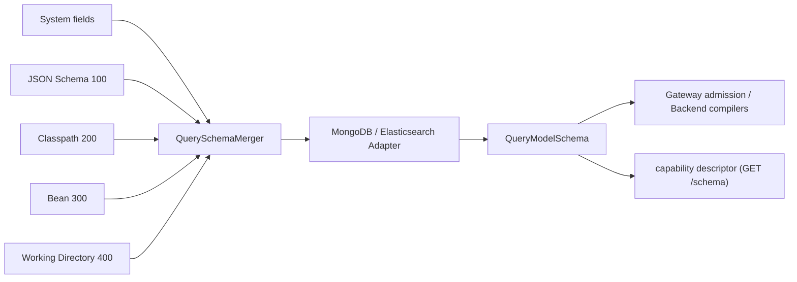

# Query Model Schema

## What the Schema provides

`QueryModelSchema` publishes immutable facts: one shared `LogicalQuerySchema` value tree and backend bindings indexed by `QueryPathTemplate`. The Schema neither executes queries, makes authorization decisions, nor rewrites requests. The Gateway validates logical input; the Backend consumes bindings to compile native expressions.

## Recursive value tree

`QueryValueSchema.kind` distinguishes `SCALAR`, `OBJECT`, `ARRAY`, `NULL`, `UNION`, and `UNKNOWN`:

- OBJECT has named `properties` and a typed Map default in `additionalProperties`. A named property overrides that default.
- ARRAY keeps its member definition in `items`; container valueTypes and temporal semantics do not copy member facts.
- UNION preserves `alternatives`. UNKNOWN preserves uncertainty and cannot justify operand capabilities.
- Values may carry title, description, enumValues, nullable, required, and semanticType. Executable masking rules remain in memory; the capability descriptor exposes only a field's `sensitivity`.

For example, a `Map<String, List<Address>>` declaration:

```kotlin
querySchemaRegistration(Order::class, QueryModel.SNAPSHOT) {
    field("state.addresses") {
        values {
            items {
                property("city") { types(QueryValueType.STRING) }
            }
        }
    }
}
```

`state.addresses.home` is an object array; use relative `city` inside elementMatch. `state.addresses.home.city.extra` is unknown and never falls back to a physical path. Equality, membership, and range operations on primitive arrays use one direct items layer, without flattening a second anonymous array. Scalars, containers, and Map values retain separate definitions.

## Field Aliases and Deprecation

Rename a field without breaking callers with `@QueryAlias` (from `me.ahoo.wow.api.query.annotation`), and mark a field kept only for old callers with Kotlin's `@Deprecated`:

```kotlin
data class OrderState(
    @field:QueryAlias("state.customer")
    val buyer: Buyer,
    @Deprecated("Use state.buyer.")
    val customerName: String,
)
```

- An alias is a full logical path. Filters, sorts, projections and aggregations may use it, or a path below it (`state.customer.name`); admission replaces it with the canonical path before anything else sees the query.
- Results and projections only contain canonical names. Sort uniqueness, sensitivity and cursors are decided by the canonical name, so an alias can never bypass a field's protection.
- An alias that names an existing field, is claimed by two fields, or sits under a map key fails schema compilation.
- The capability descriptor lists each field once, by its canonical path, with its `aliases`; a deprecated field stays queryable and carries `deprecated` (`{ "message": … }`).

## Source Priority and Merging

The runtime source chain is below. A larger number means a higher priority:



- `System` supplies model-specific fields for Snapshot and EventStream. Extensions must remain under the Snapshot `state` root or the EventStream `body.body` root; a field leaf already set by System cannot be overwritten.
- `InferredQuerySchemaSource (100)` infers Snapshot fields from the aggregate state's JSON shape and EventStream `body.body.*` fields from domain-event payloads, one variant per event type tagged with its `bodyType`. Type inference is a `QueryModelSource` bean: the default `JsonQueryModelSource` (wow-schema) reports only raw facts of the serialized JSON (paths, types, nullability, enums, format hints, member annotations); what they mean for queries is decided in wow-query. Standard time types are temporal automatically; `@QueryTemporal(unit = TimeUnit.SECONDS)` declares an integer epoch timestamp and `@QueryTemporal(pattern = "yyyy-MM-dd")` a formatted string time; `@QueryDecimal` and `@QueryMoney` declare [decimal and money precision](#decimal-money) (all from `me.ahoo.wow.api.query.annotation`). `@Sensitive` is described in [Field Masking](./masking.md).
- `ClasspathQuerySchemaSource (200)` reads `META-INF/wow/query-schema/{context}.{aggregate}.{model}.json`; `WorkingDirectoryQuerySchemaSource (400)` reads `config/wow/query-schema/{context}.{aggregate}.{model}.json`. The model segment is lowercase: `snapshot` or `event_stream`; the dot is the reserved Wow named-aggregate delimiter. The former `wow-query-schema/{context}/{aggregate}/{model}.json` location is no longer read.
- `BeanQuerySchemaSource (300)` merges `QuerySchemaRegistration` entries for the current context.

### Declaration files and code registration

A declaration only supplements what inference cannot know — mostly values behind `Map`, `JsonNode` or `Any` — in the capability descriptor's vocabulary:

```json
{
  "fields": {
    "state.status": { "types": ["STRING"], "enum": [{ "value": "PAID", "description": "Paid" }, { "value": "SHIPPED" }] },
    "state.placedOn": { "types": ["STRING"], "semantic": { "type": "TEMPORAL_FORMATTED", "pattern": "yyyy-MM-dd" } },
    "state.attributes": { "kind": "OBJECT", "values": { "kind": "ARRAY", "items": { "types": ["STRING"], "nullable": false } } }
  }
}
```

| Key | Meaning |
|---|---|
| `kind` | `SCALAR`, `OBJECT` or `ARRAY`; implied by `types`, `properties`/`values` or `items` when omitted. Unions, `null` and unknown values are inferred, never declared |
| `types` | Scalar types: `STRING`, `INTEGER`, `DECIMAL`, `BOOLEAN` |
| `nullable` | Whether JSON `null` occurs |
| `enum` | The declared values, each `{ "value": …, "description"?: … }`; descriptions reach the descriptor's `enum` |
| `semantic` | One semantic type: a time encoding, `TEMPORAL_EPOCH` (`timeUnit`), `TEMPORAL_DATE`, `TEMPORAL_FORMATTED` (`pattern`); or a numeric format, `DECIMAL` (`scale`), `MONEY` (`currency` or `currencyField`, `scale`), see [below](#decimal-money) |
| `description` | What the field means |
| `properties`, `items`, `values` | Named properties of an object, the element of an array, the value of every key of a map |

Any other key is rejected. Sensitivity, aliases and deprecation are only declared on the domain field (`@Sensitive`, `@QueryAlias`, `@Deprecated`); display names belong to view definitions. `querySchemaRegistration { field(...) { … } }` uses the same vocabulary: `kind`, `types`, `nullable`, `enumValue(value, description)`, `semantic`/`temporalEpoch`/`temporalFormatted`, `description`, `property`, `items`, `values`.

`QuerySchemaMerger` processes priorities from low to high. A later, higher-priority source overrides only leaves that it explicitly sets; unset leaves keep their lower-priority values. Different values for the same leaf at the same priority raise a Schema conflict instead of depending on load order. Refresh reloads sources and backend facts for the current process and replaces its cache; it does not change indexes, mappings, validators, or historical data.


### Decimal and money precision {#decimal-money}

A numeric field can declare how it is meant to be read, so the view engine and agents format and total it correctly. It is display and totalling semantics, not a storage rule: it changes no query and adds no capability.

- `DECIMAL(scale)`: a fixed-point decimal with `scale` fraction digits.
- `MONEY`: an amount in exactly one of a fixed ISO 4217 `currency` (such as `CNY`) or the currency held by a sibling string property `currencyField`. With a fixed currency, `scale` defaults to the currency's standard fraction digits (2 for `CNY`, 0 for `JPY`; currencies without one, such as `XAU`, must give it); with `currencyField` it is required.

```kotlin
data class OrderState(
    @field:QueryDecimal(scale = 4) val exchangeRate: BigDecimal,
    @field:QueryMoney(currency = "CNY") val total: BigDecimal,
    @field:QueryMoney(currencyField = "currency", scale = 2) val paid: BigDecimal,
    val currency: String,
)
```

In a declaration file: `"semantic": { "type": "DECIMAL", "scale": 2 }` or `"semantic": { "type": "MONEY", "currency": "CNY" }`. Precision is never inferred: a `BigDecimal` does not tell it, and a wrong guess is worse than none.

Building the Schema rejects a wrong declaration as a Schema conflict instead of ignoring it: the field must be numeric; `currencyField` must be a single-valued string property of the same object (for a field inside an element, the same element); exactly one of `currency` and `currencyField` is given; and a field has one semantic type, so it cannot also be temporal. The descriptor publishes the format in the field's `semantic`, with the resolved `scale`, e.g. `{ "type": "MONEY", "currency": "CNY", "scale": 2 }`.

## Native bindings and capabilities

`QueryPathTemplate` explicitly distinguishes Property, Item, and Key. `QueryValueBindings` stores per-capability `QueryFieldBindingTemplate(physicalPath, storageTypes)`, plus projectionPath and responsePath. A concrete `schema.field(QueryField(...))` returns the value, complete element ancestry, and concrete bindings. A fixed key's native constraints cannot be bypassed by a Map default.

The MongoDB adapter reads indexes and optional validator facts, retaining array/items/additionalProperties and composed type evidence separately. Missing native facts may use trusted declarations and known codecs; known conflicts are rejected. Temporal.Date has no EQ/RANGE capability, and temporal aggregation also needs native date-type evidence. Elasticsearch uses mapping, nested, multi-field, doc values, alias, and runtime facts. Neither adapter guesses native paths from caller input.

| Capability | Purpose |
| --- | --- |
| PRESENCE | Existence, absence, null, empty collections |
| EXACT_MATCH / LITERAL_MATCH / RANGE | Exact values, literal strings, range comparisons |
| FULL_TEXT_TERMS / FULL_TEXT_PHRASE | Supported model or field full-text searches |
| SORT / CURSOR_SORT | Ordinary sorting / independent cursor sorting |
| ELEMENT_SCOPE | Enter a proven object-array element scope |
| AGGREGATE_TERMS / AGGREGATE_NUMERIC / AGGREGATE_TEMPORAL | Terms, numeric, and temporal aggregation |

Numeric `EXACT_MATCH`/`RANGE` compares at native storage precision, not arbitrary-precision source equality; see [numeric comparisons](./filter-expression.md). `AGGREGATE_NUMERIC` does not automatically expand arrays: direct fields and arithmetic leaves follow the [numeric contribution contract](./aggregation-query.md#numeric-contributions). Logical declarations and runtime output must obey that numeric model. Precision remains a Backend native fact; no public precision or scalingFactor field is added.

Masking does not remove native capability facts. Public cursor and aggregation admission separately reject protected values and their native aliases. Public metadata supports discovery, not a replacement for final request validation.

## Strict admission and revalidation

Unknown fields or suffixes, missing capabilities, incompatible values, and incomplete element scopes fail closed. There is no configurable permissive field fallback. Public queries retain logical paths; `validateQuery(query, schema)` returns that same input without producing a physical Query.

Each Gateway subscription uses one Schema version: preparation, admission and response masking read it, and the `AdmittedQuery` carries it to the Backend, whose compilers consume the resolved fields. Provider failures are not cached as successful values and never bypass validation. Revalidation (every `wow.query.schema.revalidate-interval`, or on demand through the `wowQuerySchema` actuator endpoint) publishes a new version; a subscription already running keeps its own. Direct Backend callers obtain an `AdmittedQuery` via `QueryAdmission`; see [Query Backend](./query-backend.md).

## HTTP and OpenAPI

`GET snapshot/schema` and `GET event/schema` return the model's capability descriptor for the HTTP entry: how this model can be queried over HTTP. Storage facts (indexes, mappings, validators) change outside deployments, so each instance reloads every query schema every `wow.query.schema.revalidate-interval` (default `5m`, `0s` disables); a schema that fails to compile keeps its previous version and the failure is logged. With Spring Boot Actuator, the `wowQuerySchema` endpoint lists this instance's schema versions (read) and revalidates now, optionally for one `aggregate` (write). There is no HTTP refresh route. The descriptor publishes conclusions, not storage facts:

- `fields`: one entry per logical path (element fields use their full path and name their element in `scope`), with its `types`, `kind`, `semantic`, `enum`, `sensitivity`, `deprecated`, `aliases`, the `filter.operators` it admits, `sort` (`paged`, `cursor`) and `aggregate` (groups, functions, `distinctCount`, `percentile`, `any`, `inMetricFilter`, …);
- `record`: identity, paging modes, default deletion scope, root operators and full-text search (`search.modes` for a model-wide `SEARCH`, `search.fields` for record-level fields);
- `limits`: effective limits of the HTTP entry (budget and protocol limits, whichever is smaller; `null` is unlimited) and `defaultListSize`;
- `analysis`: the metric types, `approximate` (those this backend estimates: `PERCENTILE` on MongoDB; `DISTINCT_COUNT` and `PERCENTILE` on Elasticsearch), `dateUnits` for `DATE_HISTOGRAM`, `dateParts` for `DATE_PART`, `dateDiffUnits` for `DATE_DIFF` (empty when expressions are not allowed), having, sort and dense support;
- `elements` (each with `search`: the fields a `SEARCH` inside `ELEMENT_MATCH` on it may name, and the modes all of them accept; absent when storage can search none), `dynamic` (map keys as `{key}`, one entry per pattern, array items implicit as for fields) and `constraints` (e.g. `CURSOR_UNIQUE_SORT`, and `COUNT_REQUIRES_FILTER` / `STARTS_WITH_REQUIRES_PREFIX` when expensive operators are off, and `PARALLEL_ARRAY_SORT` with the array-valued sort fields of which a sort may name at most one when the storage, such as MongoDB, cannot sort by two independent arrays; on Elasticsearch, `NULL_OR_EMPTY_AS_MISSING` with the fields whose stored `null` or empty array presence operators read as missing, and `ARRAY_EQUALITY`: `EQ` / `NE` take only a scalar operand there, and an array operand is rejected with that code).
- `variants` (EventStream only): the `body` element's event types, keyed by the discriminator `bodyType`, each with its description and its payload `fields` relative to the element (`body.amount`). A condition on one event's field goes inside an `ELEMENT_MATCH` on `body` together with `bodyType`, so both apply to the same event.

Everything listed is admitted when used on its own; anything unlisted is rejected. Values, scopes and policies can still reject a query at run time, with a `bindingErrors` code. The descriptor never contains physical paths, storage types or Mask strategies. `version` is a hash of its content and doubles as the ETag: send `If-None-Match` to get 304 while it is unchanged. A browser on another origin can read the `ETag` header only when the server lists it in `Access-Control-Expose-Headers`; Wow does not own the CORS configuration, so add it there (for example `exposedHeaders("ETag")` in a Spring `CorsConfiguration`). A client that reads `version` from the body needs no header.

`x-wow-query-fields` remains a static candidate-field extension on Snapshot request-body components. It is not a request field or proof of runtime capability. The [API Client](./query-api-client.md) does not replace server-side runtime Schema discovery or validation.
