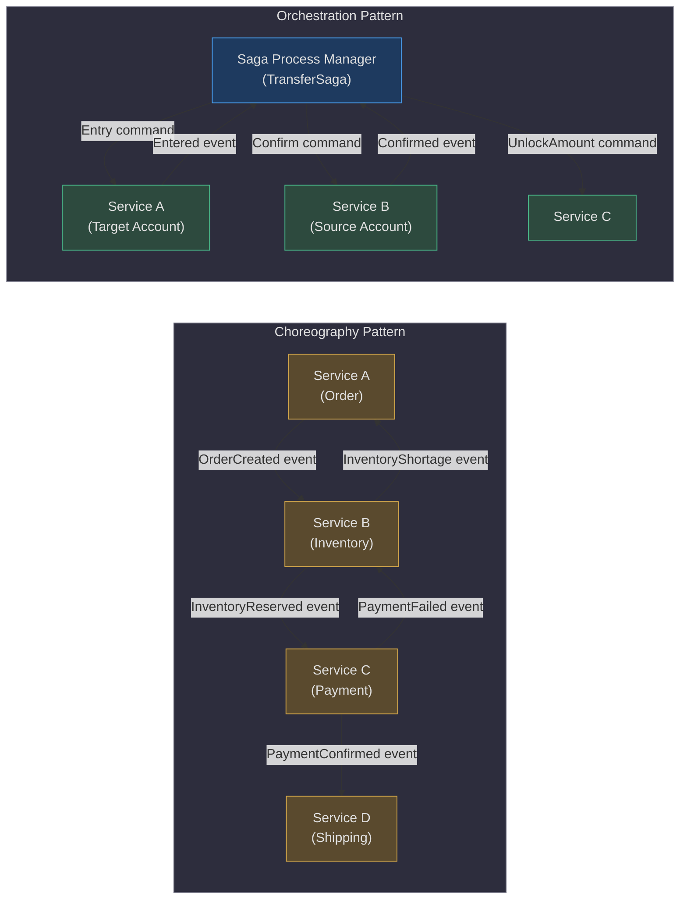
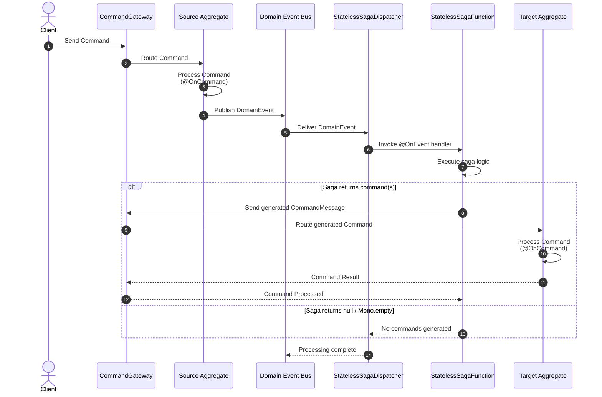
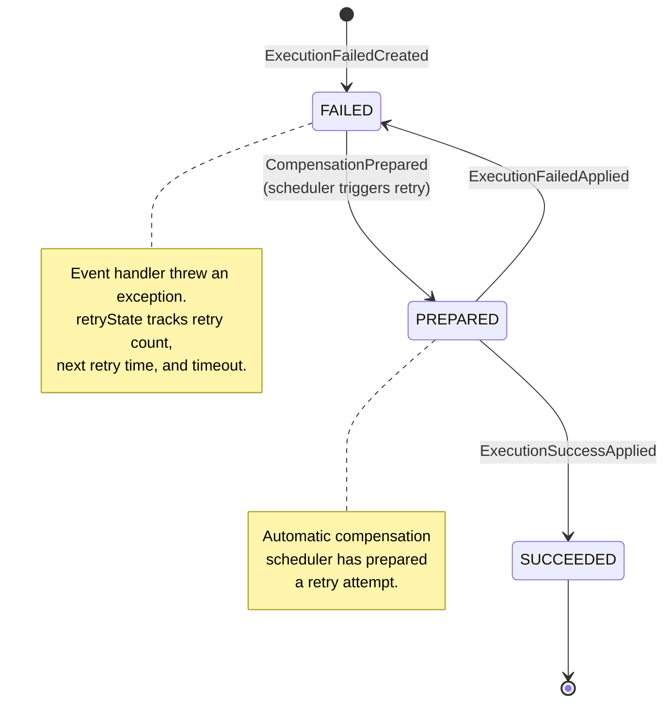
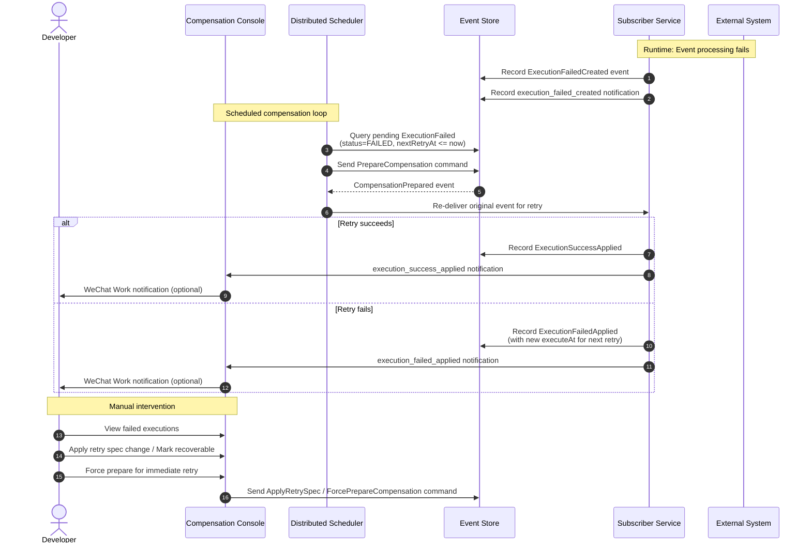

# Distributed Transactions (Saga)

In a microservice architecture, a single business operation can span multiple services — each with its own database. Traditional ACID transactions cannot cross service boundaries. The Saga pattern solves this by breaking a distributed transaction into a sequence of local transactions, each with a compensating action to undo its effect if a later step fails.

The Wow framework provides a **stateless Saga** implementation based on the **Orchestration pattern**. It has been validated in real production environments for over three years. Stateless sagas are simpler, faster, and sufficient for the vast majority of use cases.

## At-a-Glance

| Component | Responsibility | Key File | Source |
|---|---|---|---|
| `@StatelessSaga` | Marks a class as a saga process manager; triggers auto-discovery | `wow-api/src/main/kotlin/me/ahoo/wow/api/annotation/StatelessSaga.kt` | [StatelessSaga.kt:65-69](https://github.com/Ahoo-Wang/Wow/blob/main/wow-api/src/main/kotlin/me/ahoo/wow/api/annotation/StatelessSaga.kt#L65-L69) |
| `@OnEvent` | Marks a function as a domain event handler | `wow-api/src/main/kotlin/me/ahoo/wow/api/annotation/OnEvent.kt` | [OnEvent.kt:62-79](https://github.com/Ahoo-Wang/Wow/blob/main/wow-api/src/main/kotlin/me/ahoo/wow/api/annotation/OnEvent.kt#L62-L79) |
| `@OnStateEvent` | Marks a function as a state-aware event handler | `wow-api/src/main/kotlin/me/ahoo/wow/api/annotation/OnStateEvent.kt` | [OnStateEvent.kt:66-81](https://github.com/Ahoo-Wang/Wow/blob/main/wow-api/src/main/kotlin/me/ahoo/wow/api/annotation/OnStateEvent.kt#L66-L81) |
| `@Retry` | Configures retry behavior with exponential backoff | `wow-api/src/main/kotlin/me/ahoo/wow/api/annotation/Retry.kt` | [Retry.kt:73-100](https://github.com/Ahoo-Wang/Wow/blob/main/wow-api/src/main/kotlin/me/ahoo/wow/api/annotation/Retry.kt#L73-L100) |
| `StatelessSagaFunction` | Wraps a saga handler; converts event results into commands sent via `CommandGateway` | `wow-core/src/main/kotlin/me/ahoo/wow/saga/stateless/StatelessSagaFunction.kt` | [StatelessSagaFunction.kt:42-109](https://github.com/Ahoo-Wang/Wow/blob/main/wow-core/src/main/kotlin/me/ahoo/wow/saga/stateless/StatelessSagaFunction.kt#L42-L109) |
| `StatelessSagaDispatcher` | Event dispatcher that routes domain events to registered saga functions | `wow-core/src/main/kotlin/me/ahoo/wow/saga/stateless/StatelessSagaDispatcher.kt` | [StatelessSagaDispatcher.kt:36-56](https://github.com/Ahoo-Wang/Wow/blob/main/wow-core/src/main/kotlin/me/ahoo/wow/saga/stateless/StatelessSagaDispatcher.kt#L36-L56) |
| `StatelessSagaHandler` | Applies filter chains to domain event exchanges; logs and resumes on errors | `wow-core/src/main/kotlin/me/ahoo/wow/saga/stateless/StatelessSagaHandler.kt` | [StatelessSagaHandler.kt:36-43](https://github.com/Ahoo-Wang/Wow/blob/main/wow-core/src/main/kotlin/me/ahoo/wow/saga/stateless/StatelessSagaHandler.kt#L36-L43) |
| `StatelessSagaFunctionRegistrar` | Registers saga functions by parsing `@StatelessSaga` metadata | `wow-core/src/main/kotlin/me/ahoo/wow/saga/stateless/StatelessSagaFunctionRegistrar.kt` | [StatelessSagaFunctionRegistrar.kt:34-55](https://github.com/Ahoo-Wang/Wow/blob/main/wow-core/src/main/kotlin/me/ahoo/wow/saga/stateless/StatelessSagaFunctionRegistrar.kt#L34-L55) |
| `ExecutionFailed` | Aggregate root that tracks and retries failed execution events | `compensation/wow-compensation-domain/src/main/kotlin/me/ahoo/wow/compensation/domain/ExecutionFailed.kt` | [ExecutionFailed.kt:37-138](https://github.com/Ahoo-Wang/Wow/blob/main/compensation/wow-compensation-domain/src/main/kotlin/me/ahoo/wow/compensation/domain/ExecutionFailed.kt#L37-L138) |
| `SagaSpec` | Testing DSL for saga unit tests with Given-When-Expect pattern | `test/wow-test/src/main/kotlin/me/ahoo/wow/test/SagaSpec.kt` | [SagaSpec.kt:69-106](https://github.com/Ahoo-Wang/Wow/blob/main/test/wow-test/src/main/kotlin/me/ahoo/wow/test/SagaSpec.kt#L69-L106) |

## Orchestration vs. Choreography

The Saga pattern has two primary implementation styles: **orchestration** (centralized process manager) and **choreography** (decentralized event exchange). The Wow framework implements orchestration, but it is critical to understand both.



<!-- Sources: wow-api/src/main/kotlin/me/ahoo/wow/api/annotation/StatelessSaga.kt:65-69 (orchestration annotation), wow-api/src/main/kotlin/me/ahoo/wow/api/annotation/OnEvent.kt:62-79 (event handler annotation) -->

The key difference: **orchestration** introduces a central coordinator that knows the entire workflow. In Wow, this is a class annotated with `@StatelessSaga`. It listens to domain events and emits commands in response. **Choreography** distributes the workflow logic across participants, who observe each other's events directly.

## How Stateless Sagas Work

A stateless saga in Wow subscribes to domain events published by aggregates. When an event arrives, the saga method executes and can return commands that are automatically sent to the command bus. The framework handles all the plumbing — event routing, command construction, message propagation, and error handling.



<!-- Sources: wow-core/src/main/kotlin/me/ahoo/wow/saga/stateless/StatelessSagaFunction.kt:42-109 (saga function wraps delegate, sends commands via gateway), wow-core/src/main/kotlin/me/ahoo/wow/saga/stateless/StatelessSagaDispatcher.kt:36-56 (dispatcher routes events to saga functions), wow-core/src/main/kotlin/me/ahoo/wow/saga/stateless/StatelessSagaHandler.kt:36-43 (handler applies filter chain with error handling) -->

### The Internal Pipeline

1. **Metadata Parsing** (`StatelessSagaMetadataParser`): At registration time, the framework scans classes annotated with `@StatelessSaga` and identifies methods annotated with `@OnEvent` / `@OnStateEvent` as event handlers. See [StatelessSagaMetadataParser.kt:30-32](https://github.com/Ahoo-Wang/Wow/blob/main/wow-core/src/main/kotlin/me/ahoo/wow/saga/annotation/StatelessSagaMetadataParser.kt#L30-L32).

2. **Function Registration** (`StatelessSagaFunctionRegistrar`): Each handler is wrapped in a `StatelessSagaFunction` that adds command-gateway capabilities. The registrar parses saga metadata and creates `StatelessSagaFunction` instances. See [StatelessSagaFunctionRegistrar.kt:48-54](https://github.com/Ahoo-Wang/Wow/blob/main/wow-core/src/main/kotlin/me/ahoo/wow/saga/stateless/StatelessSagaFunctionRegistrar.kt#L48-L54).

3. **Event Dispatch** (`StatelessSagaDispatcher`): When a domain event is published, the dispatcher matches it to registered saga functions and invokes the handler chain. See [StatelessSagaDispatcher.kt:36-56](https://github.com/Ahoo-Wang/Wow/blob/main/wow-core/src/main/kotlin/me/ahoo/wow/saga/stateless/StatelessSagaDispatcher.kt#L36-L56).

4. **Command Generation** (`StatelessSagaFunction`): The saga logic runs and returns a result. If the result is a command body, a `CommandBuilder`, or a `CommandMessage`, the framework constructs a proper command message — propagating tenant ID, request ID, and tracing context from the originating event. The command is sent via `CommandGateway`. See [StatelessSagaFunction.kt:57-68](https://github.com/Ahoo-Wang/Wow/blob/main/wow-core/src/main/kotlin/me/ahoo/wow/saga/stateless/StatelessSagaFunction.kt#L57-L68).

5. **Command Stream** (`CommandStream`): Each domain event can produce 0..N commands. The commands are collected into a `DefaultCommandStream`, stored in the event exchange attributes under the key `__COMMAND_STREAM__`. See [CommandStream.kt:22-31](https://github.com/Ahoo-Wang/Wow/blob/main/wow-core/src/main/kotlin/me/ahoo/wow/saga/stateless/CommandStream.kt#L22-L31) and [ExchangeCommandStream.kt:17-38](https://github.com/Ahoo-Wang/Wow/blob/main/wow-core/src/main/kotlin/me/ahoo/wow/saga/stateless/ExchangeCommandStream.kt#L17-L38).

## Defining a Saga

A saga class is marked with `@StatelessSaga` and contains event handler methods. The return type of each handler determines what happens next:

| Handler Return Type | Behavior |
|---|---|
| `null` | No command is generated |
| Command body (e.g., `Entry`) | Body is wrapped into a `CommandMessage` and sent to the command bus |
| `CommandBuilder` | Builder is used to construct a `CommandMessage` (allows custom aggregate ID, tenant ID, etc.) |
| `CommandMessage<*>` | The pre-built command message is sent directly |
| `Iterable` of any of the above | Each element is processed as above (up to N commands per event) |
| `Mono<Void>` / `Mono.empty()` | Reactive no-op — no command generated |

### Example: Bank Transfer Saga (Java)

The transfer saga orchestrates a two-step process: (1) deposit the transfer amount into the target account, and (2) confirm the transfer on the source account. If the deposit fails, it unlocks the source account's funds.

<!-- Source: example/transfer/example-transfer-domain/src/main/java/me/ahoo/wow/example/transfer/domain/TransferSaga.java:20-34 -->

```java
@StatelessSaga
public class TransferSaga {

    Entry onEvent(Prepared prepared, AggregateId aggregateId) {
        return new Entry(prepared.to(), aggregateId.getId(), prepared.amount());
    }

    Confirm onEvent(AmountEntered amountEntered) {
        return new Confirm(amountEntered.sourceId(), amountEntered.amount());
    }

    UnlockAmount onEvent(EntryFailed entryFailed) {
        return new UnlockAmount(entryFailed.sourceId(), entryFailed.amount());
    }
}
```

**How it works:** When the source account publishes a `Prepared` event (money has been locked), the saga generates an `Entry` command for the target account (deposit). If the target account responds with `AmountEntered`, the saga confirms the source account transfer with a `Confirm` command. If the deposit fails (`EntryFailed`), the saga compensates by sending an `UnlockAmount` command to release the locked funds.

### Example: Cart Cleanup Saga with Retry (Kotlin)

This saga removes items from the shopping cart after an order is created — but only if the order was placed from the cart. It uses `@Retry` for resilience and `@OnEvent` for explicit handler naming.

<!-- Source: example/example-domain/src/main/kotlin/me/ahoo/wow/example/domain/cart/CartSaga.kt:25-43 -->

```kotlin
@StatelessSaga
class CartSaga {

    @Retry(maxRetries = 5, minBackoff = 60, executionTimeout = 10)
    @OnEvent
    fun onOrderCreated(event: DomainEvent<OrderCreated>): CommandBuilder? {
        val orderCreated = event.body
        if (!orderCreated.fromCart) {
            return null
        }
        return RemoveCartItem(
            productIds = orderCreated.items.map { it.productId }.toSet(),
        ).commandBuilder()
            .aggregateId(event.ownerId)
    }
}
```

**Key patterns demonstrated:**
- **Conditional command generation**: Returns `null` when the order is not from the cart — no command is sent.
- **`DomainEvent<T>` parameter**: Grants access to event metadata (`ownerId`, `aggregateId`, `tenantId`) alongside the event body.
- **`CommandBuilder` return**: Allows fine-grained control over the target aggregate ID (here, the cart owner's ID).
- **`@Retry` annotation**: Configures up to 5 retries with 60-second initial backoff and 10-second execution timeout.

## Event Compensation

Saga handlers can fail due to transient network issues, downstream service unavailability, or unexpected exceptions. The Wow framework provides a built-in **event compensation** mechanism that tracks failed executions and retries them automatically with exponential backoff.

### Compensation State Machine

Each failed execution is tracked as an `ExecutionFailed` aggregate that transitions through these states:



<!-- Sources: compensation/wow-compensation-domain/src/main/kotlin/me/ahoo/wow/compensation/domain/ExecutionFailedState.kt:35-100 (state sourcing handlers), compensation/wow-compensation-domain/src/main/kotlin/me/ahoo/wow/compensation/domain/ExecutionFailed.kt:37-138 (aggregate command handlers) -->

The state transitions are implemented as `@OnCommand` handlers on the `ExecutionFailed` aggregate. Each handler validates preconditions — for example, re-preparing is only allowed when `canRetry()` returns true, and applying a failure result is only allowed when the status is `PREPARED`. See [ExecutionFailed.kt:61-65](https://github.com/Ahoo-Wang/Wow/blob/main/compensation/wow-compensation-domain/src/main/kotlin/me/ahoo/wow/compensation/domain/ExecutionFailed.kt#L61-L65) for precondition checks.

### Exponential Backoff Retry Strategy

The `NextRetryAtCalculator` computes the next retry time using exponential backoff. The formula is:

```
nextRetryAt = currentTime + (minBackoff * 2^retries * 1000) milliseconds
```

Each retry has a `timeoutAt` calculated as `currentTime + executionTimeout * 1000` milliseconds. Exceeding this timeout marks the retry as failed. See [NextRetryAtCalculator.kt:20-44](https://github.com/Ahoo-Wang/Wow/blob/main/compensation/wow-compensation-domain/src/main/kotlin/me/ahoo/wow/compensation/domain/NextRetryAtCalculator.kt#L20-L44).

### Event Compensation Dashboard

The Wow framework ships a full-featured compensation console — itself built on the Wow framework. The console provides a visual dashboard, automated distributed scheduling, and WeChat Work notifications.



<!-- Sources: compensation/wow-compensation-domain/src/main/kotlin/me/ahoo/wow/compensation/domain/ExecutionFailed.kt:37-138 (aggregate command handlers for all compensation states), compensation/wow-compensation-domain/src/main/kotlin/me/ahoo/wow/compensation/domain/ExecutionFailedState.kt:35-100 (state transitions) -->

The compensation dashboard allows developers to:
- Query failed executions by status (FAILED, PREPARED, SUCCEEDED)
- Manually trigger retries via **Force Prepare**
- Modify retry parameters (max retries, backoff, timeout) via **Apply Retry Spec**
- Mark executions as recoverable / unrecoverable
- Clear executions that are no longer needed
- Use the OpenAPI interface for programmatic integration

## Configuration

### Saga Configuration

Sagas share the event processing infrastructure. The primary configuration is through annotations:

| Setting | Annotation / Property | Default | Description | Source |
|---|---|---|---|---|
| Saga discovery | `@StatelessSaga` | N/A | Auto-discovered by `StatelessSagaFunctionRegistrar` | [StatelessSagaFunctionRegistrar.kt:34-55](https://github.com/Ahoo-Wang/Wow/blob/main/wow-core/src/main/kotlin/me/ahoo/wow/saga/stateless/StatelessSagaFunctionRegistrar.kt#L34-L55) |
| Event handler | `@OnEvent` | Method name `onEvent` | Responds to domain events | [OnEvent.kt:62-79](https://github.com/Ahoo-Wang/Wow/blob/main/wow-api/src/main/kotlin/me/ahoo/wow/api/annotation/OnEvent.kt#L62-L79) |
| State-aware handler | `@OnStateEvent` | Method name `onStateEvent` | Responds to state change events | [OnStateEvent.kt:66-81](https://github.com/Ahoo-Wang/Wow/blob/main/wow-api/src/main/kotlin/me/ahoo/wow/api/annotation/OnStateEvent.kt#L66-L81) |
| Dispatcher parallelism | `MessageParallelism.DEFAULT_PARALLELISM` | Framework default | Parallel message processing threads | [StatelessSagaDispatcher.kt:41](https://github.com/Ahoo-Wang/Wow/blob/main/wow-core/src/main/kotlin/me/ahoo/wow/saga/stateless/StatelessSagaDispatcher.kt#L41) |

### Retry Configuration

The `@Retry` annotation provides fine-grained control over compensation behavior on a per-handler basis:

| Setting | Property | Default | Description |
|---|---|---|---|
| Enable / disable | `enabled` | `true` | Set `@Retry(enabled = false)` to opt out of compensation for a specific handler |
| Max retries | `maxRetries` | `10` | Maximum number of retry attempts before giving up |
| Min backoff | `minBackoff` | `180` seconds | Initial backoff duration; grows exponentially (`minBackoff * 2^retries`) |
| Execution timeout | `executionTimeout` | `120` seconds | Maximum time allowed per execution attempt |
| Recoverable exceptions | `recoverable` | `[]` (empty) | Exception types that should trigger retries |
| Unrecoverable exceptions | `unrecoverable` | `[]` (empty) | Exception types that should fail immediately without retry |

See [Retry.kt:73-100](https://github.com/Ahoo-Wang/Wow/blob/main/wow-api/src/main/kotlin/me/ahoo/wow/api/annotation/Retry.kt#L73-L100) for the annotation definition.

### Compensation Configuration

Compensation is enabled by default. To disable globally:

```yaml
wow:
  compensation:
    enabled: false
```

For dashboard notifications (WeChat Work):

```yaml
wow:
  compensation:
    host: https://your-dashboard.example.com
    webhook:
      weixin:
        url: https://qyapi.weixin.qq.com/cgi-bin/webhook/send?key=YOUR_KEY
        events:
          - execution_failed_created
          - execution_failed_applied
          - execution_success_applied
```

## Unit Testing

The Wow framework provides two approaches for testing sagas: the **`SagaSpec`** base class (JUnit 5 `@TestFactory`) and the **`SagaVerifier`** fluent API.

### SagaSpec (Recommended)

`SagaSpec<T>` is a test base class that generates dynamic JUnit 5 tests from a DSL specification. It uses the Given-When-Expect pattern:

1. **Given**: Define the domain event (the input)
2. **When**: Call `whenEvent(event)` to invoke the saga
3. **Expect**: Assert on the resulting commands using `expectCommandType`, `expectCommandBody`, `expectNoCommand`, etc.

<!-- Source: test/wow-test/src/main/kotlin/me/ahoo/wow/test/SagaSpec.kt:69-106 -->

```kotlin
class TransferSagaSpec : SagaSpec<TransferSaga>({
    on {
        val prepared = Prepared("to", 1)
        whenEvent(prepared) {
            expectNoError()
            expectCommandType(Entry::class)
            expectCommandBody<Entry> {
                id.assert().isEqualTo(prepared.to)
                amount.assert().isEqualTo(prepared.amount)
            }
        }
    }
    on {
        val amountEntered = AmountEntered("sourceId", 1)
        whenEvent(amountEntered) {
            expectNoError()
            expectCommandType(Confirm::class)
            expectCommandBody<Confirm> {
                id.assert().isEqualTo(amountEntered.sourceId)
                amount.assert().isEqualTo(amountEntered.amount)
            }
        }
    }
    on {
        val entryFailed = EntryFailed("sourceId", 1)
        whenEvent(entryFailed) {
            expectCommandType(UnlockAmount::class)
            expectCommandBody<UnlockAmount> {
                id.assert().isEqualTo(entryFailed.sourceId)
                amount.assert().isEqualTo(entryFailed.amount)
            }
        }
    }
})
```

**Testing conditional command generation.** The saga can return `null` when conditions are not met — assert this with `expectNoCommand()`:

<!-- Source: example/example-domain/src/test/kotlin/me/ahoo/wow/example/domain/cart/CartSagaSpec.kt:26-76 -->

```kotlin
class CartSagaSpec : SagaSpec<CartSaga>({
    on {
        val ownerId = generateGlobalId()
        whenEvent(
            event = mockk<OrderCreated> {
                every { items } returns listOf(orderItem)
                every { fromCart } returns true
            },
            ownerId = ownerId
        ) {
            expectCommandType(RemoveCartItem::class)
            expectCommand<RemoveCartItem> {
                aggregateId.id.assert().isEqualTo(ownerId)
                body.productIds.assert().hasSize(1)
            }
        }
    }
    on {
        name("NotFromCart")
        whenEvent(
            event = mockk<OrderCreated> {
                every { fromCart } returns false
            },
            ownerId = generateGlobalId()
        ) {
            expectNoCommand()
        }
    }
})
```

### SagaVerifier (Fluent API)

For programmatic testing, `SagaVerifier` provides a fluent builder:

```kotlin
SagaVerifier.sagaVerifier<OrderSaga>()
    .whenEvent(mockOrderCreatedEvent)
    .expectNoCommand()
    .verify()
```

The verifier pre-configures an in-memory command bus, test validator, and no-op idempotency checker for isolated testing. See [SagaVerifier.kt:59-182](https://github.com/Ahoo-Wang/Wow/blob/main/test/wow-test/src/main/kotlin/me/ahoo/wow/test/SagaVerifier.kt#L59-L182).

### Available Test Assertions

| Assertion | Description |
|---|---|
| `expectNoError()` | Verifies no exception was thrown during saga execution |
| `expectCommandType(T::class)` | Verifies at least one command of the given type was generated |
| `expectCommandBody<T>(block)` | Accesses the command body for detailed field-level assertions |
| `expectCommand<T>(block)` | Accesses the full `CommandMessage` (includes `aggregateId`, headers) |
| `expectNoCommand()` | Verifies the saga returned `null` (no command generated) |
| `name("Description")` | Assigns a human-readable name to the test scenario |

## Orchestration vs. Choreography: Comparison

| Aspect | Orchestration (Wow) | Choreography |
|---|---|---|
| **Control** | Centralized in a saga process manager | Distributed across participants |
| **Visibility** | Single class shows the entire workflow | Logic scattered across multiple services |
| **Coupling** | Saga depends on participants; participants are unaware of saga | Participants depend on each other's events |
| **Circular dependencies** | Impossible — saga unilaterally depends on participants | Risk of circular event chains |
| **Testing** | Easy — saga tested in isolation with `SagaSpec` | Requires all participants running |
| **Adding steps** | Add handler methods to the saga class | Modify multiple services |
| **Complexity** | Saga class grows with workflow complexity | Each service's logic grows independently |
| **Maintenance cost** | One extra component (the saga) | No extra component, but harder to reason about |
| **Implementation in Wow** | `@StatelessSaga` + `@OnEvent` methods | N/A (Wow uses orchestration) |

## Wait Plan Integration

The command gateway's chain wait plan, created with `CommandWait.chain(...)`, enables clients to wait for the **entire saga chain** to complete before receiving a response. This is especially powerful for end-to-end request-reply semantics in distributed operations.

For example, a client initiating a bank transfer can wait until both the saga has processed the `Prepared` event (waiting for `SAGA_HANDLED` at the saga processor) and the resulting target account command has been fully processed (waiting for `SNAPSHOT` on the tail).

```http
POST /account/sourceId/prepare
Command-Wait-Stage: SAGA_HANDLED
Command-Wait-Tail-Stage: SNAPSHOT
Command-Wait-Tail-Processor: TransferSaga
```

This guarantees that when the HTTP response returns, the entire distributed transfer workflow — source account lock, saga coordination, target account deposit, and snapshot — has completed. See the [Command Gateway](command-gateway.md) page for full details.

## Related Pages

| Page | Description |
|---|---|
| [Event Compensation](event-compensation.md) | Full compensation lifecycle, dashboard UI, deployment, and OpenAPI |
| [Command Gateway](command-gateway.md) | Command sending, wait plans, and `CommandWait.chain(...)` for saga-aware waiting |
| [Event Processor](event-processor.md) | General event processing for non-saga use cases |
| [Modeling](modeling.md) | Domain modeling with aggregates, commands, and events |
| [Test Suite](test-suite.md) | Testing DSL including `AggregateSpec` and `SagaSpec` |
