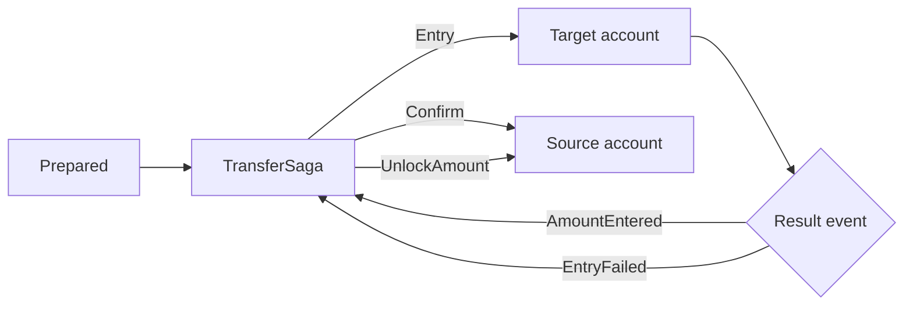
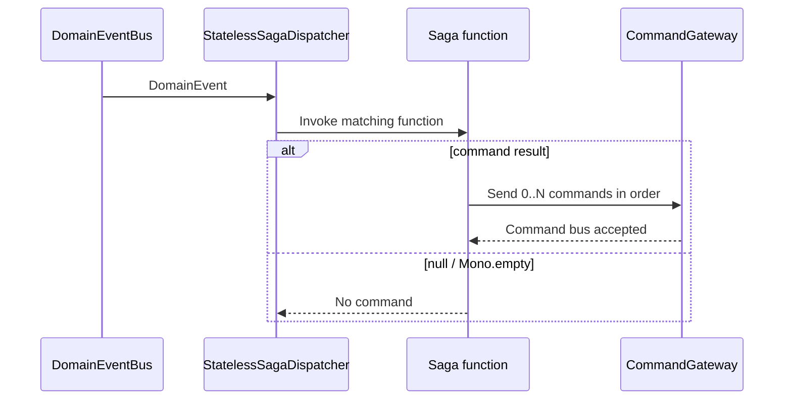
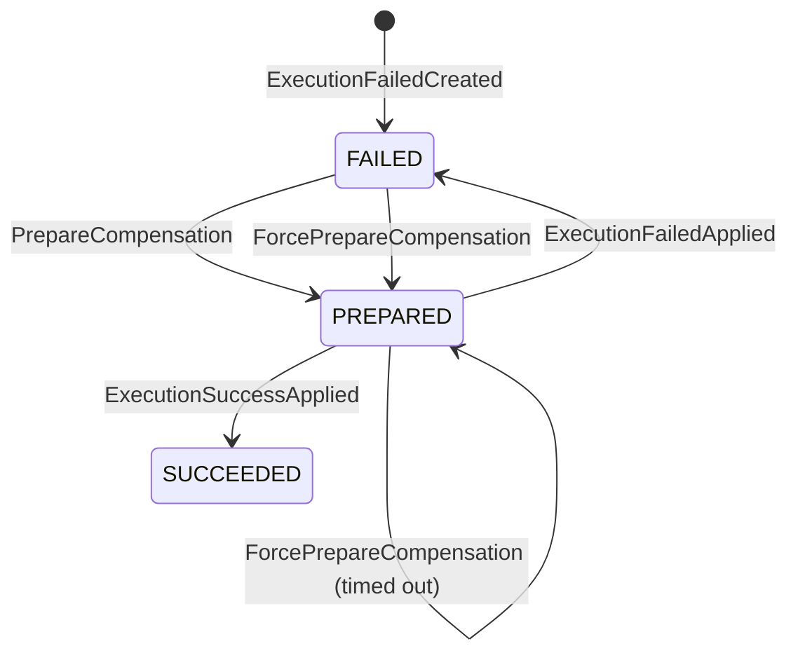

# Distributed Transactions (Saga)

Wow's `@StatelessSaga` is a **stateless orchestrator**: it receives domain or state events and generates commands for the next step. Each target aggregate still handles its command in its own local transaction; a saga does not create a cross-service ACID transaction.

:::warning Boundary
Commands such as `UnlockAmount` are explicit **business compensation**. They do not roll back a database or remove committed domain events. Re-delivery after an event-handler failure belongs to [event compensation](event-compensation.md), which is a separate recovery mechanism.
:::

## At-a-Glance

| Capability | Purpose | Current contract |
| --- | --- | --- |
| [`@StatelessSaga`](https://github.com/Ahoo-Wang/Wow/blob/main/wow-api/src/main/kotlin/me/ahoo/wow/api/annotation/StatelessSaga.kt) | Registers a stateless process orchestrator | The processor stores no workflow-instance state |
| [`@OnEvent`](https://github.com/Ahoo-Wang/Wow/blob/main/wow-api/src/main/kotlin/me/ahoo/wow/api/annotation/OnEvent.kt) / [`@OnStateEvent`](https://github.com/Ahoo-Wang/Wow/blob/main/wow-api/src/main/kotlin/me/ahoo/wow/api/annotation/OnStateEvent.kt) | Declares domain-event or state-event functions | The `onEvent` / `onStateEvent` naming conventions also work |
| [`StatelessSagaFunction`](https://github.com/Ahoo-Wang/Wow/blob/main/wow-core/src/main/kotlin/me/ahoo/wow/saga/stateless/StatelessSagaFunction.kt) result | Generates 0..N commands | Supports command bodies, `CommandBuilder`, `CommandMessage`, `Iterable`, and reactive results |
| [`@Retry`](https://github.com/Ahoo-Wang/Wow/blob/main/wow-api/src/main/kotlin/me/ahoo/wow/api/annotation/Retry.kt) | Describes durable compensation policy for failure records | It does not define saga steps or the immediate runtime retry count |
| [`SagaSpec`](https://github.com/Ahoo-Wang/Wow/blob/main/test/wow-test/src/main/kotlin/me/ahoo/wow/test/SagaSpec.kt) | Verifies an isolated event-to-command mapping | Covers normal, ignored, and business-compensation branches |

## Orchestration vs. Choreography

Orchestration keeps the cross-aggregate flow in a saga. Choreography lets each participant subscribe to other participants' events. Wow provides the former: participant aggregates own their commands and events, while the saga decides which command follows an event.


```mermaid
flowchart LR
    P[Prepared] --> S[TransferSaga]
    S -->|Entry| T[Target account]
    T --> E{Result event}
    E -->|AmountEntered| S
    S -->|Confirm| O[Source account]
    E -->|EntryFailed| S
    S -->|UnlockAmount| O
```

`EntryFailed -> UnlockAmount` is a business-defined reverse action. The original `Prepared` and `EntryFailed` events remain even after it succeeds.

## How Stateless Sagas Work


```mermaid
sequenceDiagram
    participant Bus as DomainEventBus
    participant Dispatcher as StatelessSagaDispatcher
    participant Saga as Saga function
    participant Gateway as CommandGateway
    Bus->>Dispatcher: DomainEvent
    Dispatcher->>Saga: Invoke matching function
    alt command result
        Saga->>Gateway: Send 0..N commands in order
        Gateway-->>Saga: Command bus accepted
    else null / Mono.empty
        Saga-->>Dispatcher: No command
    end
```

Saga handling completes when the handler finishes and `CommandGateway.send` completes for the generated commands. It does not mean that target commands have run, much less that the whole business workflow has completed.

### The Internal Pipeline

1. [`StatelessSagaMetadataParser`](https://github.com/Ahoo-Wang/Wow/blob/main/wow-core/src/main/kotlin/me/ahoo/wow/saga/annotation/StatelessSagaMetadataParser.kt) parses metadata, and [`StatelessSagaFunctionRegistrar`](https://github.com/Ahoo-Wang/Wow/blob/main/wow-core/src/main/kotlin/me/ahoo/wow/saga/stateless/StatelessSagaFunctionRegistrar.kt) registers event functions.
2. [`StatelessSagaDispatcher`](https://github.com/Ahoo-Wang/Wow/blob/main/wow-core/src/main/kotlin/me/ahoo/wow/saga/stateless/StatelessSagaDispatcher.kt) creates an event exchange for each matching function, then [`StatelessSagaHandler`](https://github.com/Ahoo-Wang/Wow/blob/main/wow-core/src/main/kotlin/me/ahoo/wow/saga/stateless/StatelessSagaHandler.kt) runs the filter chain.
3. [`StatelessSagaFunction`](https://github.com/Ahoo-Wang/Wow/blob/main/wow-core/src/main/kotlin/me/ahoo/wow/saga/stateless/StatelessSagaFunction.kt) converts and sends results in order. It records them as a [`CommandStream`](https://github.com/Ahoo-Wang/Wow/blob/main/wow-core/src/main/kotlin/me/ahoo/wow/saga/stateless/CommandStream.kt) associated with the exchange through [`ExchangeCommandStream`](https://github.com/Ahoo-Wang/Wow/blob/main/wow-core/src/main/kotlin/me/ahoo/wow/saga/stateless/ExchangeCommandStream.kt).
4. Without an explicit request ID, a generated command uses `${domainEvent.id}-${index}`; an explicit request ID is preserved, as covered by the [request-ID test](https://github.com/Ahoo-Wang/Wow/blob/main/wow-core/src/test/kotlin/me/ahoo/wow/saga/stateless/StatelessSagaFunctionRequestIdTest.kt).
5. If the function or command send fails, the error first passes through [`RetryableFilter`](https://github.com/Ahoo-Wang/Wow/blob/main/wow-core/src/main/kotlin/me/ahoo/wow/messaging/handler/RetryableFilter.kt). Only a still-failing execution reaches the enabled [event-compensation filter](https://github.com/Ahoo-Wang/Wow/blob/main/compensation/wow-compensation-core/src/main/kotlin/me/ahoo/wow/compensation/core/CompensationFilter.kt).

The deterministic request ID lets a replay of the same event and command order cooperate with command-gateway idempotency checks. It does not replace idempotency for side effects outside the aggregate, and replay code must not casually reorder generated commands.

## Defining a Saga

A handler may return a command body, a `CommandBuilder`, a prebuilt `CommandMessage`, an `Iterable` of those values, or an empty result. Use `CommandBuilder` to select a target aggregate ID; the framework fills missing propagation information.

| Return value | Result |
| --- | --- |
| `null` / `Mono.empty()` | Sends no command |
| Command body | Converts it to a `CommandMessage` and sends it |
| `CommandBuilder` | Creates a command with the builder's target and custom fields |
| `CommandMessage<*>` | Preserves the command and propagates the upstream header |
| `Iterable<*>` | Converts and sends multiple commands in order |

### Example: Bank Transfer Saga (Java)

```java
@StatelessSaga
public class TransferSaga {

    Entry onEvent(Prepared prepared, AggregateId aggregateId) {
        return new Entry(prepared.to(), aggregateId.getId(), prepared.amount());
    }

    Confirm onEvent(AmountEntered amountEntered) {
        return new Confirm(amountEntered.sourceId(), amountEntered.amount());
    }

    UnlockAmount onEvent(EntryFailed entryFailed) {
        return new UnlockAmount(entryFailed.sourceId(), entryFailed.amount());
    }
}
```

The normal path is `Prepared -> Entry -> AmountEntered -> Confirm`; the failure path is `EntryFailed -> UnlockAmount`. [`TransferSaga`](https://github.com/Ahoo-Wang/Wow/blob/main/example/transfer/example-transfer-domain/src/main/java/me/ahoo/wow/example/transfer/domain/TransferSaga.java) implements these branches, and [`TransferSagaSpec`](https://github.com/Ahoo-Wang/Wow/blob/main/example/transfer/example-transfer-domain/src/test/kotlin/me/ahoo/wow/example/transfer/domain/TransferSagaSpec.kt) verifies them.

### Example: Cart Cleanup Saga with Retry (Kotlin)

```kotlin
@StatelessSaga
class CartSaga {

    @Retry(maxRetries = 5, minBackoff = 60, executionTimeout = 10)
    @OnEvent
    fun onOrderCreated(event: DomainEvent<OrderCreated>): CommandBuilder? {
        val orderCreated = event.body
        if (!orderCreated.fromCart) {
            return null
        }
        return RemoveCartItem(
            productIds = orderCreated.items.map { it.productId }.toSet(),
        ).commandBuilder()
            .aggregateId(event.ownerId)
    }
}
```

For an order created from a cart, [`CartSaga`](https://github.com/Ahoo-Wang/Wow/blob/main/example/example-domain/src/main/kotlin/me/ahoo/wow/example/domain/cart/CartSaga.kt) sends `RemoveCartItem` to the cart identified by `event.ownerId`; another order returns `null`. [`CartSagaSpec`](https://github.com/Ahoo-Wang/Wow/blob/main/example/example-domain/src/test/kotlin/me/ahoo/wow/example/domain/cart/CartSagaSpec.kt) verifies both paths. Here, `@Retry` supplies durable compensation parameters for a failure record; it does not change the branch.

## Event Compensation

Saga orchestration and event compensation can be combined, but their responsibilities differ:

| Path | Saga / handler behavior | Recovery behavior |
| --- | --- | --- |
| Normal | The event generates a next command or explicitly generates none | No failure record is created |
| Retryable failure | A recoverable error first uses in-memory immediate retry | A still-failing execution creates `ExecutionFailed`; the scheduler later replays the target function |
| Unrecoverable failure | The record is classified `UNRECOVERABLE` | Automatic scheduling excludes it pending operator review |
| Idempotent replay | The same event generates stable command request IDs by default | Handlers and external systems must still make repeated execution safe |
| Operator-driven | An operator inspects the error and side effects | Recoverability, retry spec, or function may be changed before prepare or force prepare |

Event compensation replays the original event to the matching target function. It is not a saga generating an automatic reverse command, and it is not a database rollback. See [Event Compensation](event-compensation.md) for the full lifecycle.

### Compensation State Machine


```mermaid
stateDiagram-v2
    [*] --> FAILED: ExecutionFailedCreated
    FAILED --> PREPARED: PrepareCompensation
    FAILED --> PREPARED: ForcePrepareCompensation
    PREPARED --> PREPARED: PrepareCompensation (timed out)
    PREPARED --> PREPARED: ForcePrepareCompensation (timed out)
    PREPARED --> SUCCEEDED: ExecutionSuccessApplied
    PREPARED --> FAILED: ExecutionFailedApplied
```

The real guards live in [`IExecutionFailedState`](https://github.com/Ahoo-Wang/Wow/blob/main/compensation/wow-compensation-api/src/main/kotlin/me/ahoo/wow/compensation/api/IExecutionFailedState.kt). Normal `PrepareCompensation` accepts only `FAILED` or timed-out `PREPARED` while `retries < maxRetries`; it rejects `SUCCEEDED`, a non-timed-out `PREPARED`, and a record at the limit. `ForcePrepareCompensation` accepts `FAILED` or timed-out `PREPARED` and may bypass the limit, but still rejects `SUCCEEDED` and non-timed-out `PREPARED`. Either repeated prepare increments `retries`, emits another `CompensationPrepared`, and stays `PREPARED`; see [`ExecutionFailed`](https://github.com/Ahoo-Wang/Wow/blob/main/compensation/wow-compensation-domain/src/main/kotlin/me/ahoo/wow/compensation/domain/ExecutionFailed.kt) and [`ExecutionFailedSpec`](https://github.com/Ahoo-Wang/Wow/blob/main/compensation/wow-compensation-domain/src/test/kotlin/me/ahoo/wow/compensation/domain/ExecutionFailedSpec.kt).

### Exponential Backoff Retry Strategy

Durable compensation uses a seconds-based `RetrySpec`:

```text
nextRetryAt = retryAt + minBackoff * 2^retries * 1000
timeoutAt   = retryAt + executionTimeout * 1000
```

A new failure record starts with `retries = 0`; preparing compensation increments it. [`NextRetryAtCalculator`](https://github.com/Ahoo-Wang/Wow/blob/main/compensation/wow-compensation-domain/src/main/kotlin/me/ahoo/wow/compensation/domain/NextRetryAtCalculator.kt) requires non-negative `maxRetries`, `minBackoff`, and `executionTimeout`, and rejects retry specs whose backoff arithmetic overflows.

### Event Compensation Dashboard

The current dashboard groups records into **To Retry, Executing, Next Retry, Non Retryable, Succeeded, and Unrecoverable**. Its details view shows the error, source-event and aggregate identity, target function, recoverability, retry progress, and event-stream history. Operators can:

- run `Prepare compensation` or the confirmed `Force prepare` action;
- edit `maxRetries`, `minBackoff`, and `executionTimeout`;
- change recoverability among `RECOVERABLE`, `UNKNOWN`, and `UNRECOVERABLE`;
- change the `EVENT` / `STATE_EVENT` target function;
- filter exactly by execution, event, aggregate, and processor fields.

The dashboard cannot decide whether replay is safe for the business. The current UI exposes no delete or recover action; the generated OpenAPI client does contain default aggregate delete and recover endpoints, which is a separate capability. Verify category conditions in [`RetryConditions`](https://github.com/Ahoo-Wang/Wow/blob/main/compensation/dashboard/src/features/Failed/RetryConditions.ts), and action constraints in [`Actions`](https://github.com/Ahoo-Wang/Wow/blob/main/compensation/dashboard/src/features/Failed/Actions.tsx) and its [tests](https://github.com/Ahoo-Wang/Wow/blob/main/compensation/dashboard/src/features/Failed/__tests__/Actions.test.tsx).

## Configuration

### Saga Configuration

Sagas use the existing event infrastructure and need no separate workflow store:

| Configuration point | Purpose |
| --- | --- |
| `@StatelessSaga` | Registers the saga class |
| `@OnEvent` | Explicitly declares a domain-event function |
| `@OnStateEvent` | Explicitly declares an event function that needs aggregate state |
| `CommandBuilder.aggregateId(...)` | Selects the target aggregate ID |
| `@Retry(...)` | Supplies durable compensation policy for function failures |

### Retry Configuration

Keep the two retry layers separate:

| Layer | Default behavior | Source |
| --- | --- | --- |
| Immediate retry | Retries only runtime-classified `RECOVERABLE` errors 3 times with a 2-second minimum backoff | `RetryableFilter` |
| Durable compensation | Up to 10 retries, 180-second first backoff, and 120-second attempt timeout | `@Retry` or the compensation server's default `RetrySpec` |

[`@Retry`](https://github.com/Ahoo-Wang/Wow/blob/main/wow-api/src/main/kotlin/me/ahoo/wow/api/annotation/Retry.kt) `recoverable = [...]` / `unrecoverable = [...]` classifies the durable failure record. `@Retry(enabled = false)` prevents a failure in that function from creating or updating a compensation record. It does not rewrite the immediate `RetryableFilter` strategy.

### Compensation Configuration

After the subscriber includes the compensation core module, Spring Boot Starter enables the compensation filters by default:

```kotlin
implementation("me.ahoo.wow:wow-compensation-core")
```

```yaml
wow:
  compensation:
    enabled: false # Disable only when durable failure recovery is intentionally not required
```

The compensation server persists `ExecutionFailed`, queries snapshots, and runs the scheduler. A subscriber loads the original event and re-delivers it to its local target function. Both sides need routable messaging and consistent model metadata.

## Unit Testing

Saga tests should directly verify the event-to-command mapping without starting a message broker or compensation server.

### SagaSpec (Recommended)

```kotlin
class CartSagaSpec : SagaSpec<CartSaga>({
    on {
        whenEvent(orderCreatedFromCart, ownerId = ownerId) {
            expectCommandType(RemoveCartItem::class)
            expectCommand<RemoveCartItem> {
                aggregateId.id.assert().isEqualTo(ownerId)
            }
        }
    }
    on {
        name("NotFromCart")
        whenEvent(orderCreatedNotFromCart, ownerId = ownerId) {
            expectNoCommand()
        }
    }
})
```

The repository's [`CartSagaSpec`](https://github.com/Ahoo-Wang/Wow/blob/main/example/example-domain/src/test/kotlin/me/ahoo/wow/example/domain/cart/CartSagaSpec.kt) covers the normal and no-command paths. [`TransferSagaSpec`](https://github.com/Ahoo-Wang/Wow/blob/main/example/transfer/example-transfer-domain/src/test/kotlin/me/ahoo/wow/example/transfer/domain/TransferSagaSpec.kt) covers normal follow-up commands and the business-compensation command.

### SagaVerifier (Fluent API)

Use the fluent verifier when assembling a scenario inside an ordinary test method:

```kotlin
SagaVerifier.sagaVerifier<OrderSaga>()
    .whenEvent(orderCreated)
    .expectNoCommand()
    .verify()
```

[`SagaVerifier`](https://github.com/Ahoo-Wang/Wow/blob/main/test/wow-test/src/main/kotlin/me/ahoo/wow/test/SagaVerifier.kt) uses a test command bus and a no-op idempotency checker. It verifies saga mapping, not production message deduplication or idempotency of external side effects.

### Available Test Assertions

| Assertion | Verifies |
| --- | --- |
| `expectNoError()` | Saga invocation raised no error |
| `expectCommandType(T::class)` | A command of the requested type was generated |
| `expectCommandBody<T> { ... }` | The command body |
| `expectCommand<T> { ... }` | The full command, aggregate ID, and headers |
| `expectNoCommand()` | No command was generated |

## Orchestration vs. Choreography: Comparison

| Aspect | Wow orchestration | Choreography |
| --- | --- | --- |
| Flow location | Centralized in `@StatelessSaga` | Distributed among participant handlers |
| Participant coupling | Saga depends on participant commands and events | Participants depend on one another's events |
| Visibility | One saga shows the main branches | Requires cross-service tracing |
| Testing | Isolated with `SagaSpec` | Usually combines several participants |
| Wow support | Built in | Not exposed as the saga API |

## Wait Plan Integration

`SAGA_HANDLED` means the saga processed the event and crossed the send boundary for generated commands. If a client must also wait for a downstream command stage, configure `CommandWait.chain(...)`, the tail stage, and the tail processor for the actual path.

A wait plan proves only that its configured processing signals arrived. It does not automatically prove that all business participants completed, and it does not turn the distributed workflow into a database transaction. See [Command Gateway](command-gateway.md) for wait stages and chain waits.

## Related Pages

| Page | Content |
| --- | --- |
| [Event Compensation](event-compensation.md) | Immediate retry, durable failure records, scheduling, and operator actions |
| [Command Gateway](command-gateway.md) | Command sending, idempotency checks, and wait plans |
| [Event Processor](event-processor.md) | Non-saga event functions |
| [Modeling](modeling.md) | Aggregates, commands, and domain events |
| [Test Suite](test-suite.md) | `AggregateSpec` and `SagaSpec` test DSLs |
