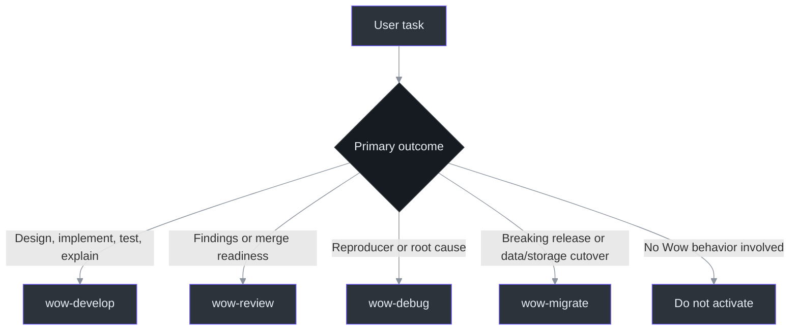
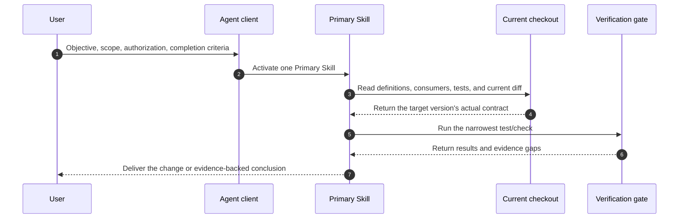

# Agent Skills

Wow Agent Skills package framework-specific workflows, architectural invariants, safety boundaries, and completion evidence into four reusable skills. They do not copy the API documentation: annotation parameters, configuration defaults, DSL methods, and generated contracts must be re-established from the current checkout or the pinned target tag. [`skills/README.md`](https://github.com/Ahoo-Wang/Wow/blob/main/skills/README.md)

| Entry | Purpose |
|---|---|
| [Wow `skills/`](https://github.com/Ahoo-Wang/Wow/tree/main/skills) | Skill content, references, assets, evals, and source plugin metadata |
| [Ahoo Skills site](https://skills.ahoo.me/) | Plugin catalogue, installation commands, and distribution documentation |
| [Ahoo-Wang/skills](https://github.com/Ahoo-Wang/skills) | Aggregated marketplace for Codex and Claude Code |
| [Agent Skills specification](https://agentskills.io/) | `SKILL.md` format and progressive-disclosure model |

The Wow repository owns the content. Ahoo Skills Hub periodically synchronizes, validates, and generates the `ahoo-wow-skills` plugin. Do not edit generated copies in the aggregation repository. [`skills/README.md`](https://github.com/Ahoo-Wang/Wow/blob/main/skills/README.md#distribution)

## Four primary skills

The client selects one Primary Skill from the user's **primary outcome**, not from the component names mentioned in the request. That Skill owns the task through completion without switching to another Wow Skill. [`skills/README.md`](https://github.com/Ahoo-Wang/Wow/blob/main/skills/README.md#selection-order)

| Skill | Use it when | Complete lifecycle |
|---|---|---|
| `wow-develop` | Designing, implementing, testing, refactoring, or explaining Wow behavior/APIs | Read-only: Frame → Discover → Model → Prove facts → Verify → Report; authorized change: Frame → Discover → Model → Prove RED → Change → Verify → Report |
| `wow-review` | Producing findings, readiness evidence, or completing review-and-fix | Scope → Context → Findings → Authorized fix → Post-fix review |
| `wow-debug` | Reproducing and locating an observed failure, or completing diagnose-and-fix | Capture → Reproduce → Locate → Hypothesize → Test → Fix/Conclude |
| `wow-migrate` | Breaking release migration, or storage/data-format cutover from any starting version | Baseline → Target → Matrix, then only explicitly authorized adapt/data/validate/cutover stages |

Source entries: [`wow-develop`](https://github.com/Ahoo-Wang/Wow/blob/main/skills/wow-develop/SKILL.md#develop-wow-applications), [`wow-review`](https://github.com/Ahoo-Wang/Wow/blob/main/skills/wow-review/SKILL.md#review-wow-changes), [`wow-debug`](https://github.com/Ahoo-Wang/Wow/blob/main/skills/wow-debug/SKILL.md#debug-wow-failures), and [`wow-migrate`](https://github.com/Ahoo-Wang/Wow/blob/main/skills/wow-migrate/SKILL.md#migrate-wow-across-breaking-boundaries).



### Selection order

1. If a cross-major or same-major source/config breaking change, or storage/data cutover and rollback from any version, is primary, use `wow-migrate`.
2. If there is an observed failure, hang, incorrect state, or reproducer and the goal is root cause, use `wow-debug`.
3. If the goal is findings, approval evidence, or merge readiness, use `wow-review`.
4. If the goal is designing, changing, testing, or explaining Wow, use `wow-develop`.
5. Do not activate for unrelated Kotlin/Gradle, dashboard, or documentation-only work.

Keep review-and-fix inside `wow-review` and diagnose-and-fix inside `wow-debug`. This preserves authorization, evidence, and diff baselines throughout the task.

## Progressive loading

Each `SKILL.md` contains only the core procedure and selection rules. Domain material loads on demand from the [development reference table](https://github.com/Ahoo-Wang/Wow/blob/main/skills/wow-develop/SKILL.md#load-one-domain-reference-first).

| Task | First reference |
|---|---|
| Aggregate, command, event, sourcing | `aggregate-sourcing.md` |
| Saga, Projection, EventProcessor | `saga-processors.md` |
| CommandGateway, waits, HTTP command routes | `command-delivery.md` |
| Query DSL and read models | `query-read-model.md` |
| Starter, storage, and buses | `starter-storage.md` |
| Runtime lifecycle | `runtime-lifecycle.md` |
| PrepareKey uniqueness and reservation | `prepare-key.md` |
| Test level and completion evidence | `verification-evidence.md` |

References contain stable decisions, source-discovery methods, and verification boundaries. Discover complete annotation parameters, test DSL APIs, configuration keys, defaults, and backend lists from the target version. [`skills/README.md`](https://github.com/Ahoo-Wang/Wow/blob/main/skills/README.md#content-model)

## Installation

### Codex

```bash
codex plugin marketplace add Ahoo-Wang/skills --ref main
codex plugin add ahoo-wow-skills@ahoo-skills
```

### Claude Code

```text
/plugin marketplace add https://github.com/Ahoo-Wang/skills
/plugin install ahoo-wow-skills
```

Treat the [Ahoo Skills site](https://skills.ahoo.me/) as the source for current installation commands and publication state. After an update, use the client's refresh mechanism or a new task to confirm that all four Skills are discoverable.

This four-Skill architecture is intentionally breaking: legacy names and compatibility aliases are not distributed. Existing installations must refresh or reinstall the plugin after publication.

## Usage

Provide at least the objective, scope, authorization mode, and completion evidence:

| Information | Example |
|---|---|
| Objective | "Add cancellation behavior and tests to `Order`" |
| Scope | "Only change `example-domain`; preserve public API compatibility" |
| Mode | "Review only; do not edit" or "Diagnose and fix" |
| Verification | "Run `:example-domain:test` and report the exact result" |



## Validation and maintenance

Maintainers run:

```bash
python3 -S scripts/validate_wow_skills.py
python3 -S -m unittest scripts/test_validate_wow_skills.py
```

The lightweight validator uses only the Python standard library. It checks Skill metadata, `openai.yaml`, the explicit plugin list, local resource existence and path containment, plus IDs and Skill references in activation/behavior JSONL. [`skills/README.md`](https://github.com/Ahoo-Wang/Wow/blob/main/skills/README.md#validation)

Structural validation does not prove natural-language activation or behavior. Activation and behavior cases are test data for a standard Agent eval tool or human forward evaluation: give a fresh task only the prompt and required fixture, keep expectations hidden from the Agent, then score the real diff, command results, and final evidence. The repository does not maintain a dedicated eval runner, and installed Skills do not depend on these maintenance scripts.

## Related pages

| Page | Relationship |
|---|---|
| [Getting Started](./getting-started.md) | Build a runnable Wow application |
| [Aggregate Modeling](./modeling.md) | Aggregate background for `wow-develop` |
| [Test Suite](./test-suite.md) | Current Aggregate/Saga testing APIs |
| [Troubleshooting](./troubleshooting.md) | Runtime and configuration context for `wow-debug` |
| [Migrate Wow v6 to v8](./migration/v6-to-v8.md) | Framework migration topic for `wow-migrate` |
