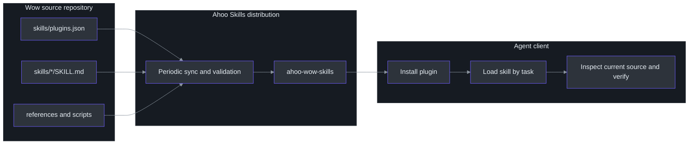
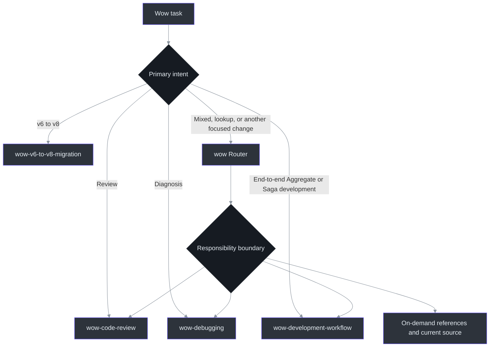
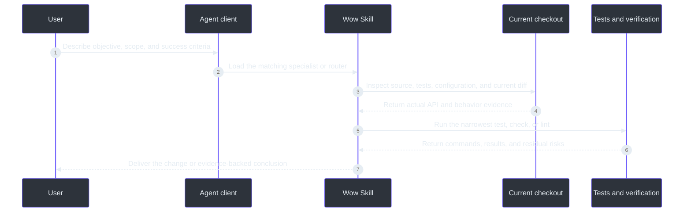

# Agent Skills

Wow Agent Skills package the framework's development method, review rules, debugging paths, and migration gates as reusable agent workflows. They do not replace source code, tests, or this documentation. Instead, they help compatible clients select the right workflow, inspect the current checkout, and leave reproducible verification evidence when handling Wow tasks. [`skills/README.md`](https://github.com/Ahoo-Wang/Wow/blob/main/skills/README.md#L1-L13)

| Entry point | Purpose | Source |
|---|---|---|
| This repository's `skills/` | Source files and maintenance rules for Wow Skills | [`skills/README.md`](https://github.com/Ahoo-Wang/Wow/blob/main/skills/README.md#L1-L15) |
| `ahoo-wow-skills` | Distribution plugin containing all non-workspace skills from this repository | [`skills/plugins.json`](https://github.com/Ahoo-Wang/Wow/blob/main/skills/plugins.json#L1-L13) |
| [Ahoo Skills site](https://skills.ahoo.me/) | Plugin catalogue, installation commands, and distribution model | [skills.ahoo.me](https://skills.ahoo.me/) |
| [Ahoo-Wang/skills](https://github.com/Ahoo-Wang/skills) | Plugin marketplace and aggregation repository for Codex and Claude Code | [GitHub repository](https://github.com/Ahoo-Wang/skills) |

## Architecture and distribution

| Layer | Responsibility | Source |
|---|---|---|
| Source | The Wow repository owns skill content, references, scripts, and source plugin metadata | [`skills/README.md`](https://github.com/Ahoo-Wang/Wow/blob/main/skills/README.md#L7-L15) |
| Distribution | Ahoo Skills periodically synchronizes source repositories and generates one focused plugin per project | [Ahoo Skills](https://skills.ahoo.me/) |
| Client | Codex, Claude Code, or another compatible client installs the plugin and loads the matching skill | [`skills/README.md`](https://github.com/Ahoo-Wang/Wow/blob/main/skills/README.md#L1-L5) |
| Evidence | The skill sends the agent back to source, tests, configuration, and executable verification in the current checkout | [`wow/SKILL.md`](https://github.com/Ahoo-Wang/Wow/blob/main/skills/wow/SKILL.md#L21-L34) |


<!-- Sources: skills/README.md:1-15, skills/plugins.json:1-13, skills/wow/SKILL.md:21-34, https://skills.ahoo.me/ -->

Two boundaries matter here: the **Wow repository is the content source**, while `Ahoo-Wang/skills` is the **distribution entry point**. The aggregation repository synchronizes upstream content and generates the marketplace manifests required by Codex and Claude Code. Update `skills/` in Wow first instead of editing a generated plugin copy. [`skills/README.md`](https://github.com/Ahoo-Wang/Wow/blob/main/skills/README.md#L114-L120) [Ahoo Skills distribution](https://skills.ahoo.me/)

## Skill components

The current `ahoo-wow-skills` plugin uses `include: ["*"]` to package the repository's non-workspace skills. [`skills/plugins.json`](https://github.com/Ahoo-Wang/Wow/blob/main/skills/plugins.json#L5-L13)

| Skill | Use it when | Core boundary | Source |
|---|---|---|---|
| `wow` | The task is mixed, asks a focused framework question, or implements Gateway, Query DSL, configuration, Projection, or similar behavior | Acts as a router to a specialist or an on-demand reference; always checks current source before editing | [`wow/SKILL.md`](https://github.com/Ahoo-Wang/Wow/blob/main/skills/wow/SKILL.md#L15-L55) |
| `wow-development-workflow` | Adding, completing, or restructuring Aggregate or Saga behavior | Aligns, discovers, models, proves, implements, reviews, and verifies; Projection work is outside this workflow | [`wow-development-workflow/SKILL.md`](https://github.com/Ahoo-Wang/Wow/blob/main/skills/wow-development-workflow/SKILL.md#L6-L38) |
| `wow-code-review` | Reviewing a PR, diff, pre-merge change, or Wow semantics | Read-only by default; prioritizes Event Sourcing, CQRS, routing, concurrency, and test contracts | [`wow-code-review/SKILL.md`](https://github.com/Ahoo-Wang/Wow/blob/main/skills/wow-code-review/SKILL.md#L6-L33) |
| `wow-debugging` | A command is unhandled, state is wrong, a Saga does not trigger, a wait hangs, or a query or configuration behaves incorrectly | Read-only by default; reproduces and locates the failing stage before testing one hypothesis | [`wow-debugging/SKILL.md`](https://github.com/Ahoo-Wang/Wow/blob/main/skills/wow-debugging/SKILL.md#L6-L16) |
| `wow-v6-to-v8-migration` | Auditing, planning, implementing, or verifying an existing Wow v6 application's move to a pinned Wow v8 release | Covers platform, source, data, runtime, release, and rollback gates; not for first-time adoption or routine upgrades that already start on v8 | [`wow-v6-to-v8-migration/SKILL.md`](https://github.com/Ahoo-Wang/Wow/blob/main/skills/wow-v6-to-v8-migration/SKILL.md#L1-L31) |

`wow/references/` supplies focused, on-demand material for modeling, annotations, testing, Command Gateway, Query DSL, configuration, and PrepareKey. Detailed facts stay in references so the router remains small. [`skills/README.md`](https://github.com/Ahoo-Wang/Wow/blob/main/skills/README.md#L67-L88) [`wow/SKILL.md`](https://github.com/Ahoo-Wang/Wow/blob/main/skills/wow/SKILL.md#L85-L95)

## Task routing

| Example task | Preferred skill | Source |
|---|---|---|
| "Add order cancellation behavior and tests" | `wow-development-workflow` | [`skills/README.md`](https://github.com/Ahoo-Wang/Wow/blob/main/skills/README.md#L96-L108) |
| "Review the Wow changes on this branch" | `wow-code-review` | [`wow-code-review/SKILL.md`](https://github.com/Ahoo-Wang/Wow/blob/main/skills/wow-code-review/SKILL.md#L27-L43) |
| "Why does this command not reach its handler?" | `wow-debugging` | [`wow-debugging/SKILL.md`](https://github.com/Ahoo-Wang/Wow/blob/main/skills/wow-debugging/SKILL.md#L29-L49) |
| "Migrate this existing application from Wow v6 to v8" | `wow-v6-to-v8-migration` | [`wow-v6-to-v8-migration/SKILL.md`](https://github.com/Ahoo-Wang/Wow/blob/main/skills/wow-v6-to-v8-migration/SKILL.md#L21-L31) |
| "Look up `@CommandRoute` and change WebFlux routing" | `wow` | [`wow/SKILL.md`](https://github.com/Ahoo-Wang/Wow/blob/main/skills/wow/SKILL.md#L36-L55) |


<!-- Sources: skills/README.md:16-45, skills/README.md:96-112, skills/wow/SKILL.md:36-55, skills/wow-code-review/SKILL.md:27-43, skills/wow-debugging/SKILL.md:14-27, skills/wow-v6-to-v8-migration/SKILL.md:21-35 -->

Routing protects responsibility boundaries rather than adding ceremony. For example, reviews and diagnoses remain read-only until the user explicitly authorizes a fix or another state-changing action. [`wow-code-review/SKILL.md`](https://github.com/Ahoo-Wang/Wow/blob/main/skills/wow-code-review/SKILL.md#L10-L25) [`wow-debugging/SKILL.md`](https://github.com/Ahoo-Wang/Wow/blob/main/skills/wow-debugging/SKILL.md#L10-L12)

## Installation

The marketplace distributes Wow Skills as the focused `ahoo-wow-skills` plugin, so you do not need to install skill packages for unrelated projects. [`skills/plugins.json`](https://github.com/Ahoo-Wang/Wow/blob/main/skills/plugins.json#L3-L39)

### Codex

```bash
codex plugin marketplace add Ahoo-Wang/skills --ref main
codex plugin add ahoo-wow-skills@ahoo-skills
```

### Claude Code

```text
/plugin marketplace add https://github.com/Ahoo-Wang/skills
/plugin install ahoo-wow-skills
```

Treat the [Ahoo Skills site](https://skills.ahoo.me/) and [Ahoo-Wang/skills](https://github.com/Ahoo-Wang/skills) as the current source for installation commands and distributable plugins. Client versions can differ in plugin discovery and refresh behavior; after installation, use the client's plugin list or a new task to confirm that `ahoo-wow-skills` is available.

## Usage flow

After installation, describe the objective, scope, and success criteria. You can explicitly name a skill if the client does not match one automatically. Either way, the skill instructs the agent to re-read relevant source and tests in the current checkout instead of treating examples inside the skill as the framework API truth. [`wow/SKILL.md`](https://github.com/Ahoo-Wang/Wow/blob/main/skills/wow/SKILL.md#L21-L34)


<!-- Sources: skills/wow/SKILL.md:21-55, skills/wow-development-workflow/SKILL.md:26-38, skills/wow-development-workflow/SKILL.md:217-229, skills/wow-code-review/SKILL.md:27-33, skills/wow-debugging/SKILL.md:29-74 -->

Include at least the following information in a request:

| Information | Example | Why it matters | Source |
|---|---|---|---|
| Objective | "Add cancellation to `Order`" | Defines the business result and deliverable | [`wow-development-workflow/SKILL.md`](https://github.com/Ahoo-Wang/Wow/blob/main/skills/wow-development-workflow/SKILL.md#L83-L97) |
| Scope | "Only change `example-domain`; preserve public API compatibility" | Prevents cross-module or breaking expansion | [`wow-development-workflow/SKILL.md`](https://github.com/Ahoo-Wang/Wow/blob/main/skills/wow-development-workflow/SKILL.md#L89-L97) |
| Mode | "Review only; do not edit" or "Diagnose and fix" | Separates read-only evidence gathering from authorized implementation | [`wow-code-review/SKILL.md`](https://github.com/Ahoo-Wang/Wow/blob/main/skills/wow-code-review/SKILL.md#L10-L25) |
| Verification | "Run `:example-domain:test`" | Makes the completion criterion reproducible | [`wow-development-workflow/SKILL.md`](https://github.com/Ahoo-Wang/Wow/blob/main/skills/wow-development-workflow/SKILL.md#L217-L229) |

## Constraints and maintenance

| Principle | Meaning | Source |
|---|---|---|
| Source first | A skill is navigation and workflow, not a substitute for the current API | [`wow/SKILL.md`](https://github.com/Ahoo-Wang/Wow/blob/main/skills/wow/SKILL.md#L21-L34) |
| Test-backed | Aggregate and Saga behavior use their matching Spec or Verifier; behavior changes follow RED→GREEN→REFACTOR | [`wow-development-workflow/SKILL.md`](https://github.com/Ahoo-Wang/Wow/blob/main/skills/wow-development-workflow/SKILL.md#L14-L24) |
| Read-only by default | Review and diagnosis do not authorize edits, replies, approvals, merges, or fixes | [`wow-code-review/SKILL.md`](https://github.com/Ahoo-Wang/Wow/blob/main/skills/wow-code-review/SKILL.md#L10-L18), [`wow-debugging/SKILL.md`](https://github.com/Ahoo-Wang/Wow/blob/main/skills/wow-debugging/SKILL.md#L10-L12) |
| Migration is a system change | A v6→v8 migration cannot treat dependency resolution, compilation, or startup as proof of data, runtime, release, and rollback safety | [`wow-v6-to-v8-migration/SKILL.md`](https://github.com/Ahoo-Wang/Wow/blob/main/skills/wow-v6-to-v8-migration/SKILL.md#L6-L31) |
| Upstream ownership | Maintain and validate Wow Skills in this repository, then let the aggregation repository synchronize them | [`skills/README.md`](https://github.com/Ahoo-Wang/Wow/blob/main/skills/README.md#L114-L150) |

## References

- [Ahoo Skills site](https://skills.ahoo.me/)
- [Ahoo-Wang/skills aggregation repository](https://github.com/Ahoo-Wang/skills)
- [Wow `skills/` source directory](https://github.com/Ahoo-Wang/Wow/tree/main/skills)
- [Agent Skills specification](https://agentskills.io/)

## Related pages

| Page | Relationship |
|---|---|
| [Getting Started](./getting-started.md) | Build a runnable Wow application before using skills to guide iteration |
| [Aggregate Modeling](./modeling.md) | Core model used by `wow` and the development workflow |
| [Test Suite](./test-suite.md) | Test DSL used to prove Aggregate and Saga behavior |
| [Troubleshooting](./troubleshooting.md) | Runtime and configuration diagnosis used with `wow-debugging` |
| [Migrate Wow v6 to v8](./migration/v6-to-v8.md) | Framework migration detail used by `wow-v6-to-v8-migration` |
