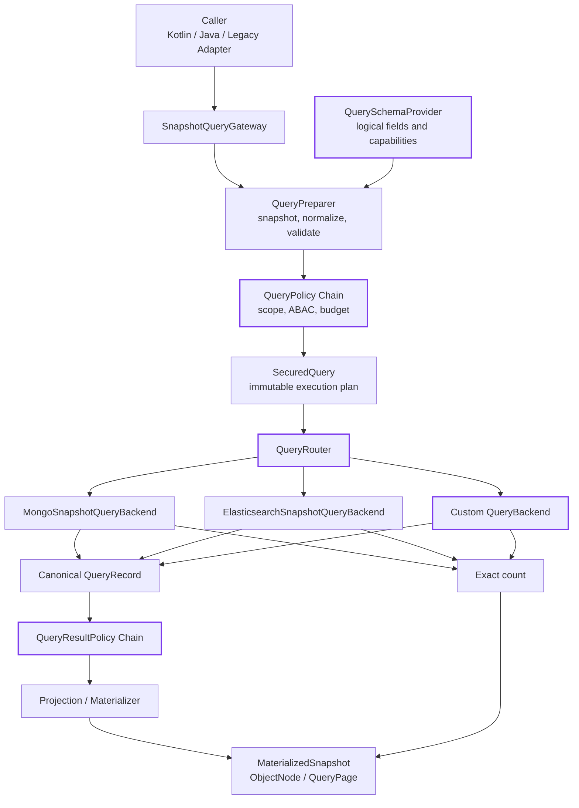
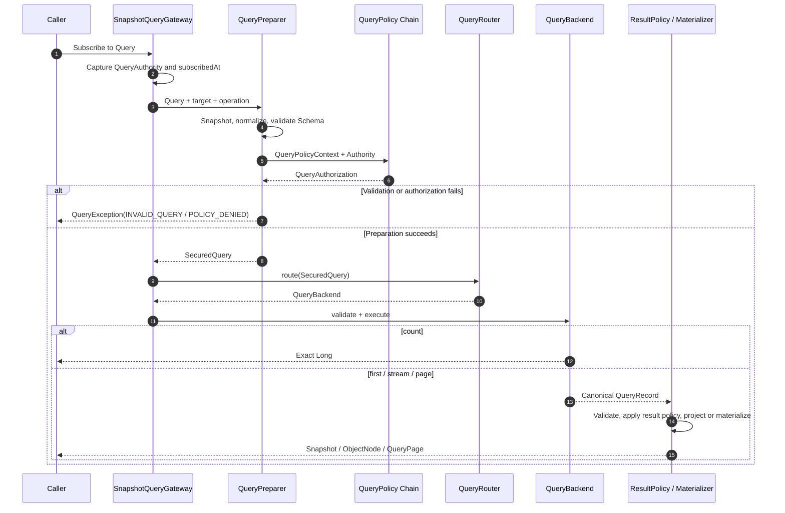

# Snapshot Query Gateway

`SnapshotQueryGateway<S>` is the backend-neutral snapshot query entry point. Spring Boot registers one Gateway for
each aggregate state type and selects MongoDB or Elasticsearch through `wow.eventsourcing.storage-routing`. Every query
passes schema validation, authorization, resource budgets, and routing before backend access. Backend records are then
validated, transformed by result policies, and materialized.

## Scope and prerequisites

The Snapshot Query Gateway reads the **current snapshot of one aggregate type**. Continue to use a
[projection](./projection.md) for cross-aggregate joins, analytical wide tables, or read models with an independent
lifecycle. The Gateway is an in-process Kotlin/Java API; it does not generate a second HTTP route set. Existing WebFlux
snapshot query endpoints continue to reach the same Gateway pipeline through the compatibility adapter.

Auto-configuration requires:

1. `wow.eventsourcing.snapshot.enabled=true`;
2. the aggregate is discovered by Wow metadata scanning;
3. at least one query-capable MongoDB or Elasticsearch `QueryBackend` exists;
4. when snapshots are the current-state read model, use `snapshot.strategy=all` and wait for the command `SNAPSHOT`
   stage before requiring read-after-write visibility.

Spring can inject the Gateway by state generic type:

```kotlin
@Service
class OrderQueries(
    private val gateway: SnapshotQueryGateway<OrderState>
)
```

An application configured only with Redis or in-memory snapshots does not gain dynamic query support automatically.
In a mixed-storage application, querying an aggregate routed to a non-queryable backend returns `BACKEND_NOT_READY`.

## Architecture



Purple borders identify public extension points. The gateway compiles the caller's `Query` into a `SecuredQuery`; a
backend can execute only that immutable plan after schema, authorization, and budget constraints have been applied.
Backends return canonical records, so result policy, projection, and typed materialization stay independent of MongoDB
BSON and Elasticsearch DSL.

## Basic usage

```kotlin
class OrderQueries(
    private val gateway: SnapshotQueryGateway<OrderState>
) {
    fun paidOrders(tenantId: String): Mono<QueryPage<ObjectNode>> =
        gateway.pageRecords(page = 1, size = 50) {
            filter { field("state.status") eq "PAID" }
            projection { include("aggregateId", "state.status", "eventTime") }
            sort { desc("eventTime") }
            scope { tenantId(tenantId) }
            budget {
                timeout(Duration.ofSeconds(3))
                maxRecords(50)
            }
        }.contextWrite(
            QueryContexts.withAuthority(QueryAuthority(tenantId = tenantId))
        )
}
```

- `first`, `stream`, and `page` return complete typed snapshots and do not accept field projections.
- `firstRecord`, `streamRecords`, and `pageRecords` return `ObjectNode` values and support include or exclude projections.
- `count` returns an exact count; partial shard results are rejected.
- `QueryScope` may only narrow `QueryAuthority`; it cannot widen tenant, owner, or space access.
- Reading deleted snapshots requires the `query:snapshot:deletion` permission.

## API quick reference

| Method | Result | Projection | Empty result | Primary use |
|---|---|---|---|---|
| `first(query)` | `Mono<MaterializedSnapshot<S>>` | `All` only | `Mono.empty()` | First typed snapshot |
| `firstRecord(query)` | `Mono<ObjectNode>` | Supported | `Mono.empty()` | First dynamic record |
| `stream(query[, limit])` | `Flux<MaterializedSnapshot<S>>` | `All` only | Empty Flux | Typed streaming |
| `streamRecords(query[, limit])` | `Flux<ObjectNode>` | Supported | Empty Flux | Dynamic streaming or export |
| `page(query, page, size)` | `Mono<QueryPage<MaterializedSnapshot<S>>>` | `All` only | `items=[]`, `total=0` | Typed page |
| `pageRecords(query, page, size)` | `Mono<QueryPage<ObjectNode>>` | Supported | `items=[]`, `total=0` | Dynamic page |
| `count(filter, scope, budget)` | `Mono<Long>` | N/A | `0` | Exact count |

Pages are one-based. `limit`, page, and size must be positive; page size is also constrained by
`QueryLimits.maxPageSize`. Without an explicit sort, backends do not promise a stable business order. Reproducible pages
and batch processing should sort explicitly and use `aggregateId` as the final tie-breaker.

## Query DSL

The Gateway DSL builds filter, projection, sort, scope, and budget independently. Every single-value setting may only
be declared once, preventing implicit replacement or accumulation across blocks.

```kotlin
gateway.streamRecords(limit = 100) {
    filter {
        and(
            field("state.status") eq "PAID",
            field("state.total") gte 100
        )
    }
    projection { exclude("state.secret") }
    sort {
        desc("eventTime")
        asc("aggregateId")
    }
    budget {
        timeout(Duration.ofSeconds(5))
        maxRecords(100)
    }
}
```

`budget` also accepts a `QueryBudget` directly; the DSL form is equivalent to:

```kotlin
budget(QueryBudget(timeout = Duration.ofSeconds(5), maxRecords = 100))
```

## Query model

`Query` is an immutable request value. Collections and JSON literals are snapshotted on subscription so callers cannot
mutate an asynchronously executing query.

| Property | Default | Meaning |
|---|---|---|
| `filter` | `MatchAll` | Logical expression tree |
| `projection` | `QueryProjection.All` | Include or exclude projection for dynamic records |
| `sort` | Empty list | Ordered sort fields |
| `scope` | `QueryScope()` | Tenant, owner, space, and deletion scope |
| `budget` | `QueryBudget()` | Per-call timeout and maximum emitted records |

Expression depth is limited to 128 and node count to 10000. Unknown fields, type mismatches, invalid literals, empty
logical expressions, and repeated DSL settings return `INVALID_QUERY` before backend access.

### Logical and field operators

```kotlin
filter {
    and(
        field("state.status") eq "PAID",
        or(
            field("state.total") between (100 to 500),
            field("state.customerLevel") inside listOf("VIP", "SVIP")
        ),
        nor(field("state.cancelled").isTrue())
    )
}
```

| DSL | `PredicateOperator` | Value count | Typical fields |
|---|---|---:|---|
| `eq` / `ne` | `EQ` / `NE` | 1 | Scalars |
| `gt` / `lt` / `gte` / `lte` | Same name | 1 | Numbers and time |
| `between(a to b)` | `BETWEEN` | 2 | Numbers and time, inclusive bounds |
| `inside(values)` / `notInside(values)` | `IN` / `NOT_IN` | At least 1 | Scalars or scalar collections |
| `contains(value)` | `CONTAINS` | 1 | Strings |
| `containsAll(values)` | `CONTAINS_ALL` | At least 1 | Scalar collections |
| `startsWith` / `endsWith` | Same name | 1 | Strings |
| `isNull()` / `isNotNull()` | `IS_NULL` / `IS_NOT_NULL` | 0 | Nullable scalars |
| `isTrue()` / `isFalse()` | `IS_TRUE` / `IS_FALSE` | 0 | Boolean |
| `exists()` | `EXISTS` | 0 | Presence-capable fields |
| `isEmpty()` | `IS_EMPTY` | 0 | Collections |
| `field(path) search text` | `SearchExpression` | 1 | Full-text strings |

The table describes the portable schema model. A backend can still reject semantics it cannot implement safely. For
example, Elasticsearch rejects selected null/missing presence operations; see [Backend constraints](#backend-constraints).

### Full-text search

Single-field and multi-field full-text queries are written as:

```kotlin
filter { field("state.name") search "wireless headset" }

filter {
    search(
        "wireless headset",
        "state.name",
        "state.description"
    )
}
```

Full-text `search` is different from `contains`: `search` uses the backend text index and analyzer, while `contains`
performs a field pattern match. Callers declare logical fields, never a MongoDB text-index name or an Elasticsearch
`.keyword` subfield.

### Object arrays

`elementMatch` requires the **same array element** to satisfy its inner expression. Inner fields use paths relative to
the array element:

```kotlin
filter {
    elementMatch("state.orders") {
        and(
            field("status") eq "PAID",
            elementMatch("lines") {
                and(
                    field("sku") eq "SKU-1",
                    field("quantity") gte 2
                )
            }
        )
    }
}
```

MongoDB compiles this to nested `$elemMatch`; Elasticsearch requires `state.orders` and inner object arrays to use
`nested` mappings.

## Projection, sort, and pagination

Projection is available only on `*Record` methods. Include and exclude are mutually exclusive models:

```kotlin
gateway.firstRecord {
    projection { include("aggregateId", "version", "state.status") }
}

gateway.firstRecord {
    projection { exclude("state.secret") }
}
```

Selecting a parent includes or excludes all known descendants. Typed snapshots require complete state, so a projection
on `first`, `stream`, or `page` returns `INVALID_QUERY`. Records pass structural validation and every
`QueryResultPolicy` before projection, so projection cannot bypass masking.

A page performs both an item query and an exact total. Do not walk deep result sets by incrementing page: MongoDB pays
for large `skip` values and Elasticsearch enforces `maxResultWindow`. Bulk reads should use a stream with stable sort,
an explicit limit, timeout, and maxRecords.

## Schema and logical fields

`JacksonQuerySchemaProvider` derives a schema from the aggregate state's Jackson serialization model and adds snapshot
envelope fields:

| Field group | Examples | Meaning |
|---|---|---|
| Identity | `contextName`, `aggregateName`, `aggregateId`, `tenantId` | Queryable and sortable system fields |
| Version and operator | `version`, `eventId`, `operator`, `firstOperator` | System fields |
| Time | `firstEventTime`, `eventTime`, `snapshotTime` | System `TIME` fields |
| Lifecycle | `deleted`, `ownerId`, `spaceId` | Protected by scope and system policy |
| State | `state.status`, `state.items.sku` | Derived from the state type |
| Dynamic structures | `tags`, maps, recursive objects | Opaque by default, not portable query fields |

A logical field is a dot-separated path whose segments start with a letter or underscore, for example
`state.order-items.sku`. During PREPARATION the Gateway validates the field's value kind, nullability, collection kind,
queryable, sortable, projectable, elementMatch, operators, and fullText metadata.

- `Instant` and `Date` derive as `TIME`; other `Temporal` types are serialized strings without string-pattern or full-text operations.
- `ByteArray` uses Base64 literals.
- Maps, recursive objects, and dynamic JSON are opaque by default. Supply an explicit `QuerySchemaProvider` to expose inner paths.
- Schema describes logical capability; MongoDB and Elasticsearch still verify the real physical index semantics.

Decorate the default schema when customizing it. Canonical envelope fields cannot be removed or changed:

```kotlin
@Bean
fun querySchemaProvider(objectMapper: ObjectMapper): QuerySchemaProvider {
    val delegate = JacksonQuerySchemaProvider(objectMapper)
    return QuerySchemaProvider { metadata ->
        val schema = delegate.getSchema(metadata)
        val path = LogicalField("state.description")
        QuerySchema(
            schema.fields + (path to schema.fields.getValue(path).copy(fullText = false))
        )
    }
}
```

## Authorization boundary

:::warning
The Gateway does not authenticate callers. Without `QueryAuthority`, the default system policy cannot infer a tenant,
owner, or space; that mode is only suitable for trusted, in-process single-tenant use. External entry points must inject
an authenticated authority or install a custom `QueryPolicy` that denies anonymous calls. A
`filter { field("tenantId") ... }` expression is not an isolation boundary.
:::

Every `QueryPolicy` runs: any `DENY` rejects the query, field access is intersected, and the smallest budget wins.
Every `QueryResultPolicy` runs before projection and materialization and cannot change snapshot identity fields such as
context, aggregate, version, or tenancy. Policies and result transformations must remain non-blocking.

### QueryAuthority and scope

| Authority field | System-policy behavior |
|---|---|
| `subjectId` | Available to custom policies; does not create a filter automatically |
| `tenantId` | Adds mandatory `tenantId == authority.tenantId` |
| `ownerId` | Adds mandatory `ownerId == authority.ownerId` |
| `spaceIds` | `null` is unrestricted, an empty set denies every space, and a non-empty set is an allowlist |
| `permissions` | Controls privileged operations such as deleted/ALL access |

Scope is an additional caller-requested narrowing. With `spaceIds=null`, one space may be selected as an additional
narrowing. With an allowlist, a space outside `spaceIds` immediately
returns `POLICY_DENIED`. `DeletionScope.DEFAULT` and `ACTIVE` both return active snapshots only; `DELETED` and `ALL`
require `query:snapshot:deletion`.

### Custom authorization policy

The system policy always participates in the merge. Application policies can deny anonymous calls, add mandatory
filters, restrict fields, and tighten budgets:

```kotlin
@Bean
fun authenticatedQueryPolicy() = QueryPolicy { context ->
    if (context.authority.subjectId == null) {
        Mono.just(QueryAuthorization(decision = QueryDecision.DENY))
    } else {
        Mono.just(
            QueryAuthorization(
                decision = QueryDecision.ABSTAIN,
                maximumBudget = QueryBudget(
                    timeout = Duration.ofSeconds(3),
                    maxRecords = 1_000
                )
            )
        )
    }
}
```

Composition is fail-closed: `DENY` wins, field sets are intersected, mandatory filters are ANDed, the smallest budget
wins, and every requested capability needs an explicit `GRANT`.

### Result policy

Result policies can mask fields or transform state according to authority. They cannot change envelope identity or
return data that violates the schema:

```kotlin
@Bean
fun secretMaskingPolicy() = QueryResultPolicy { _, record ->
    (record["state"] as ObjectNode).remove("secret")
    record
}
```

## Resource bounds

The default `QueryLimits.maximumBudget` has no timeout or record cap to preserve legacy
`IListQuery.limit == 0` unlimited streams. Production applications must supply explicit bounds. If an application still
depends on unlimited legacy streams, migrate those calls to bounded pages or an explicit limit before enabling
`maxRecords`.

```kotlin
@Bean
fun queryLimits() = QueryLimits(
    maxPageSize = 200,
    maximumBudget = QueryBudget(
        timeout = Duration.ofSeconds(5),
        maxRecords = 10_000
    )
)
```

If a stream fails after emitting records, it terminates with `INCOMPLETE_RESULT`. Discard the partial stream and restart
the query; never treat it as a successful truncated result.

The effective budget is the minimum of the request, every policy, and global limits. Timeout starts at subscription and
covers preparation, policy, and backend execution. `maxRecords` limits emitted records; it does not cap the business total returned
by count. A requested limit or page size already above maxRecords returns `BUDGET_EXCEEDED` before backend access.

## Backend constraints

| Capability | MongoDB | Elasticsearch |
|---|---|---|
| Exact query/sort | Uses BSON field semantics | Fields need strict exact semantics; text fields need one keyword subfield or explicit `exactSubfields` |
| Full text | Requested fields must exactly match the collection text-index field set | Fields must be indexed text; only standard-analyzer semantics are currently accepted |
| Object arrays | Uses `$elemMatch` | The corresponding field must be mapped as `nested` |
| Pagination | Default page size is at most 1000; offset cannot exceed `Int.MAX_VALUE` | `from + size` is at most 10000 by default; streams use PIT plus `search_after` |
| Presence semantics | Distinguishes null and missing values | Rejects `NE`, `NOT_IN`, `IS_NULL`, `IS_NOT_NULL`, `EXISTS`, `IS_EMPTY`, `EQ null`, and `IN` containing null |

Gateway callers use logical fields such as `state.code`, never physical fields such as `.keyword`. If an Elasticsearch
mapping cannot prove the requested semantics, the backend returns `BACKEND_NOT_READY` instead of widening the query.

### Storage routing

The default snapshot store and per-aggregate routes also select the Gateway query backend. This example keeps MongoDB
as the default and routes only order snapshots to Elasticsearch:

```yaml
wow:
  context-name: order-service
  eventsourcing:
    snapshot:
      enabled: true
      strategy: all
      storage: mongo
    storage-routing:
      aggregates:
        order:
          snapshot:
            storage: elasticsearch
```

Changing a route does not migrate historical snapshots. Follow the
[Snapshot Query Gateway migration and production gates](./migration/snapshot-query-gateway.md) for target-index creation, rebuilding,
reconciliation, and rollback.

### Elasticsearch backend options

Provide a custom backend bean to select exact subfields or tune PIT behavior. Auto-configuration then backs off from
its backend of the same type:

```kotlin
@Bean
fun elasticsearchSnapshotQueryBackend(
    client: ReactiveElasticsearchClient
) = ElasticsearchSnapshotQueryBackend(
    client,
    ElasticsearchQueryBackendOptions(
        exactSubfields = mapOf(LogicalField("state.code") to "raw"),
        pitPageSize = 500,
        pitKeepAlive = "2m",
        maxResultWindow = 10_000,
        mappingCacheTtl = Duration.ofSeconds(30)
    )
)
```

An `exactSubfields` value is relative to its text field. The real mapping must still pass exact-semantics and doc-values
validation; this option does not create or modify mappings. The backend caches mapping/settings by resolved index for 30
seconds by default. Metadata transport errors return `BACKEND_FAILURE`; only absent or incompatible mappings return
`BACKEND_NOT_READY`.

## Extending capabilities

Extend the narrowest responsibility that owns the behavior. Do not bypass preparation or leak storage syntax into the
public query model:

| Extension point | Use it for | Invariant |
|---|---|---|
| `QuerySchemaProvider` | Logical-field capabilities, full-text, or array metadata | Preserve the canonical envelope; do not expose physical paths such as `.keyword` |
| `QueryPolicy` | ABAC, mandatory filters, field access, budgets, and capability grants | Stay non-blocking; `DENY` wins; scope may only narrow authority |
| `QueryRouter` | Route an authorized query to a backend by aggregate | Select only; do not rewrite `SecuredQuery` |
| `QueryBackend` | Integrate another snapshot store or query engine | Execute only `SecuredQuery`; fail closed; return canonical records |
| `QueryResultPolicy` | Mask or transform state for the current authority | Runs before projection; protected envelope identity is immutable |

### 1. Extend logical-field capabilities

Decorate the default `JacksonQuerySchemaProvider` and override only fields whose behavior differs from inference. The
[Schema and logical fields](#schema-and-logical-fields) example disables full-text support on one field; the same pattern
can expose explicit children of an otherwise opaque structure. Schema remains a backend-neutral contract; physical
mapping stays in backend configuration.

### 2. Extend authorization and result processing

Use a [custom authorization policy](#custom-authorization-policy) for mandatory filters, field allowlists, budgets, or
capability decisions, and a [result policy](#result-policy) for pre-projection masking. The policy chains merge all Spring
beans automatically, so no parallel gateway implementation is needed. A result policy must not turn a cross-tenant
record into a current-tenant record.

### 3. Extend routing

Declare a `QueryRouter` bean to replace the default storage router. It receives the prepared `SecuredQuery`:

```kotlin
@Bean
fun queryRouter(
    mongo: MongoSnapshotQueryBackend,
    analytics: AnalyticsSnapshotQueryBackend
) = QueryRouter { query ->
    if (query.target.aggregateName == "order") analytics else mongo
}
```

The router only selects a backend. Query translation, fallback, or retry behavior belongs to that backend and must retain
the public error-code semantics.

### 4. Extend the storage backend

A new query engine implements `QueryBackend`; it does not need to copy the gateway:

```kotlin
class AnalyticsSnapshotQueryBackend : QueryBackend {
    override val id: String = "analytics"

    override fun validate(query: SecuredQuery) {
        // Reject unsupported expressions, capabilities, or mappings before I/O.
    }

    override fun stream(query: SecuredQuery): Flux<ObjectNode> = TODO()

    override fun page(query: SecuredQuery): Mono<QueryPage<ObjectNode>> = TODO()

    override fun count(query: SecuredQuery): Mono<Long> = TODO()
}
```

The implementation must:

1. map unsupported exact semantics to `UNSUPPORTED_QUERY` or `BACKEND_NOT_READY`, never a wider result;
2. return the complete canonical envelope from `stream` and `page`; projection and materialization belong to the gateway;
3. return exact `page.total` and `count` values, never a successful approximation or partial-shard result;
4. remain non-blocking, honor cancellation, deadline, and `maxRecords`, and report partial-stream failure as `INCOMPLETE_RESULT`;
5. run the same contract cases for filter, sort, page, count, null/missing, nested, full-text, and error mapping.

Register the backend as a Spring bean and select it from a custom `QueryRouter`. Replace
`SnapshotQueryGatewayFactory` only when a custom clock, zone, or uniform gateway construction policy is required; schema,
policy, router, and backend extensions cover normal integrations.

## Compatibility layer

Existing `SnapshotQueryService`, `Condition`, and Query DSL calls remain available. Spring factories send legacy calls
through the same authorization, budget, routing, and result-validation pipeline, while the selected backend's original
converter compiles conditions to preserve historical MongoDB/Elasticsearch semantics. Dynamic legacy projection paths
run after result policies, while legacy sort paths remain backend-validated and compiled. A projection that mixes include
and exclude fields returns `INVALID_QUERY`; migrate it to one projection mode.

`LegacyConditionExpression` and `QueryProjection.Legacy` are in-process compatibility details, not public subtypes of
the new Query JSON protocol. New business code should not construct them or mix backend RAW statements into a portable
Query.

## Execution stages and errors



`QueryException` exposes only stable `code` and `stage` values. Public errors do not contain the filter, authority, or
raw backend exception messages.

| Error code | Common stage | Meaning and action |
|---|---|---|
| `INVALID_QUERY` | `PREPARATION` | Invalid field, literal, projection, page, or expression; fix the request, do not retry |
| `POLICY_DENIED` | `POLICY` | Authority, scope, field, or capability denied; do not retry |
| `POLICY_FAILURE` | `POLICY` | A custom policy failed or returned an empty Mono; fix the policy |
| `UNSUPPORTED_QUERY` | `ROUTING` / `BACKEND` | Selected backend cannot implement the semantics safely; rewrite or select another backend |
| `BACKEND_NOT_READY` | `ROUTING` / `BACKEND` | Route, collection/index, text index, or mapping is not ready; stop cutover and repair it |
| `DEADLINE_EXCEEDED` | `POLICY` / `BACKEND` | Absolute deadline exceeded; narrow the query or adjust a tested budget |
| `BUDGET_EXCEEDED` | `PREPARATION` / `BACKEND` | Limit, page, or stream exceeded maxRecords |
| `RESULT_INVALID` | `BACKEND` / `RESULT_POLICY` | Backend result or result policy violated canonical schema; treat as a data incident |
| `MATERIALIZATION_FAILED` | `MATERIALIZATION` | Complete state could not deserialize into the aggregate state type |
| `BACKEND_FAILURE` | `BACKEND` | Backend request, shard, or PIT failure; use bounded retries only after checking health |
| `INCOMPLETE_RESULT` | `BACKEND` | Stream failed after emitting records; discard the complete partial result and restart |

## Testing

Applications should retain at least three kinds of checks:

1. DSL/schema tests proving invalid fields, projections, budgets, and scopes fail before routing;
2. authorization negative tests for cross-tenant, unauthorized space, deleted/ALL, and sensitive fields;
3. real-backend integration tests for representative filter, sort, page, count, nested, and full-text semantics on both
   MongoDB and Elasticsearch where they are supported.

```kotlin
gateway.firstRecord {
    filter { field("aggregateId") eq "order-1" }
    projection { include("aggregateId", "state.status") }
}.test()
    .assertNext { record ->
        record["aggregateId"].asString().assert().isEqualTo("order-1")
        record["state"]["status"].asString().assert().isEqualTo("PAID")
    }
    .verifyComplete()
```

A mock backend proves the Gateway pipeline, not real mapping, analyzer, null/missing, nested-array, or pagination
semantics. Complete real-data reconciliation and fault drills from the
[migration and production gates](./migration/snapshot-query-gateway.md) before rollout.

## Troubleshooting

### No `SnapshotQueryGateway<S>` bean

Verify snapshots are enabled, aggregate metadata is registered, and a MongoDB/Elasticsearch query backend exists.
Redis, in-memory, or a custom `SnapshotStore` alone does not create a `QueryBackend`.

### `POLICY_DENIED`

Verify `QueryContexts.withAuthority(...)` is applied to the Reactor chain before subscription. Then check requested
scope, deletion permission, custom field access, and capability decisions.

### `BACKEND_NOT_READY`

For MongoDB, inspect the real collection and text-index field set. For Elasticsearch, inspect mapping and settings on
the real index/alias rather than only the template; check exact keyword, doc values, standard analyzer, and nested mapping.

### `MATERIALIZATION_FAILED`

Typed methods need complete state compatible with the current Jackson state model. Inspect the canonical record with
`firstRecord`, then verify historical fields, nullable/default values, and state-type upgrades. Do not materialize a
projected, incomplete state as a typed snapshot.

### `INCOMPLETE_RESULT`

This is not normal page completion. Emitted records are only a prefix and must be discarded. Repair the backend or
budget, then restart the complete query from the beginning.

## Related topics

- [Query Service](./query.md): legacy `Condition` and Query DSL operators.
- [Data Access Control](./data-access.md): tenant, owner, space, and ABAC boundaries.
- [Snapshot Query Gateway Migration and Production Gates](./migration/snapshot-query-gateway.md): existing indices, snapshot rebuilding,
  reconciliation, canary, and rollback.
