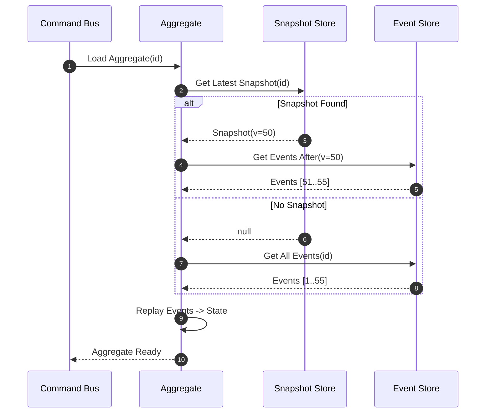
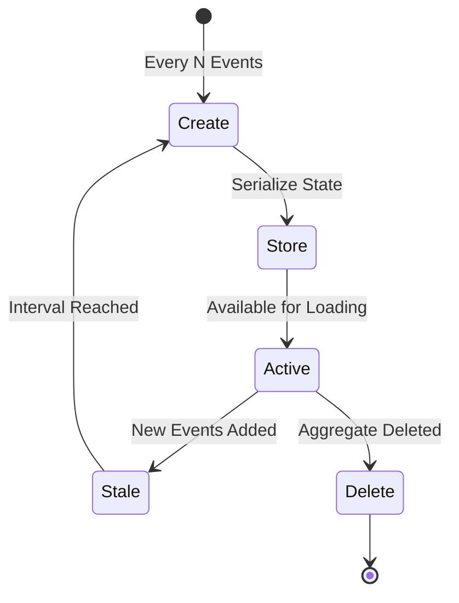

# Snapshot

Snapshot is an important optimization mechanism in event sourcing architecture that improves performance by saving checkpoints of aggregate root state to reduce the number of event replays.

## Snapshot Mechanism

In event sourcing, the state of an aggregate root is reconstructed by replaying all historical events. As the number of events increases, replaying all events becomes slower and slower. The snapshot mechanism solves this problem by periodically saving the current state of the aggregate root.

```kotlin
interface Snapshot<S : Any> : ReadOnlyStateAggregate<S>, SnapshotTimeCapable

data class SimpleSnapshot<S : Any>(
    override val delegate: ReadOnlyStateAggregate<S>,
    override val snapshotTime: Long = System.currentTimeMillis()
) : Snapshot<S>
```

## Snapshot Loading Flow

When loading an aggregate, the snapshot store is consulted first. If a snapshot exists, only events after the snapshot version need to be replayed.



<!-- Sources: wow-core/src/main/kotlin/me/ahoo/wow/event/snapshot/, wow-api/src/main/kotlin/me/ahoo/wow/api/event/snapshot/ -->

## Snapshot Strategies

Snapshot strategies determine when to create snapshots. The Wow framework provides multiple built-in strategies:

### Version Offset Strategy (VersionOffset)

Creates a snapshot when the difference between the aggregate root version and the last snapshot version reaches a specified threshold.

```kotlin
class VersionOffsetSnapshotStrategy(
    private val snapshotStore: SnapshotStore,
    private val versionOffset: Int = 5
) : SnapshotStrategy
```

### All Strategy (All)

Creates a snapshot for every state event.

```kotlin
class SimpleSnapshotStrategy(
    private val snapshotStore: SnapshotStore
) : SnapshotStrategy
```

### No Operation Strategy (NoOp)

Does not create any snapshots.

```kotlin
object NoOp : SnapshotStrategy {
    override fun <S : Any> shouldSnapshot(stateEvent: StateEvent<S>): Boolean = false
}
```

## Snapshot Lifecycle



<!-- Sources: wow-core/src/main/kotlin/me/ahoo/wow/event/snapshot/SnapshotHandler.kt -->

## Snapshot Store

The snapshot store is responsible for storing and retrieving snapshots. Batch aggregate ID scanning belongs to `EventStore.scanAggregateId(...)`, not to the snapshot store.

```kotlin
interface SnapshotStore : Named {
    fun <S : Any> load(aggregateId: AggregateId): Mono<Snapshot<S>>
    fun <S : Any> save(snapshot: Snapshot<S>): Mono<Void>
    fun getVersion(aggregateId: AggregateId): Mono<Int>
}
```

### In-Memory Implementation

```kotlin
class InMemorySnapshotStore : SnapshotStore {
    private val aggregateIdMapSnapshot = ConcurrentHashMap<AggregateId, String>()

    override fun <S : Any> load(aggregateId: AggregateId): Mono<Snapshot<S>> =
        Mono.fromCallable {
            aggregateIdMapSnapshot[aggregateId]?.toObject<Snapshot<S>>()
        }

    override fun <S : Any> save(snapshot: Snapshot<S>): Mono<Void> =
        Mono.fromRunnable {
            aggregateIdMapSnapshot[snapshot.aggregateId] = snapshot.toJsonString()
        }
}
```

### Supported Backends

| Backend | Module | Status |
|---------|--------|--------|
| MongoDB | `wow-mongo` | Production-ready |
| Redis | `wow-redis` | Production-ready |

## Snapshot Processing Flow

1. **State Event Publishing**: When aggregate root state changes, publish state events
2. **Strategy Evaluation**: Snapshot strategy evaluates whether a snapshot needs to be created
3. **Snapshot Creation**: If needed, create a snapshot of the current state
4. **Snapshot Storage**: Save the snapshot to the snapshot store

## Configuration

```yaml
wow:
  eventsourcing:
    snapshot:
      enabled: true  # Whether to enable snapshots
      strategy: all  # Snapshot strategy (all, version_offset)
      version-offset: 5  # Version offset (only valid for version_offset strategy)
```

| Property | Default | Description |
|----------|---------|-------------|
| `wow.snapshot.enabled` | `false` | Enable snapshot store |
| `wow.snapshot.interval` | `100` | Events before new snapshot |
| `wow.snapshot.store.type` | Event store backend | Snapshot storage backend |

## Aggregate Loading Optimization

Snapshots greatly optimize aggregate root loading performance:

```kotlin
class EventSourcingOrderRepository(
    private val eventStore: EventStore,
    private val snapshotStore: SnapshotStore
) : OrderRepository {

    override fun load(orderId: String): Mono<OrderState> {
        val aggregateId = AggregateId("order", orderId)

        return snapshotStore.load<OrderState>(aggregateId)
            .flatMap { snapshot ->
                // Only replay events after the snapshot version
                eventStore.load(aggregateId, snapshot.version + 1)
                    .collectList()
                    .map { eventStreams ->
                        val state = snapshot.state
                        eventStreams.forEach { stream ->
                            stream.events.forEach { event ->
                                state.apply(event)
                            }
                        }
                        state
                    }
            }
            .switchIfEmpty(
                // No snapshot, load all events
                eventStore.load(aggregateId)
                    .collectList()
                    .map { eventStreams ->
                        val state = OrderState(orderId)
                        eventStreams.forEach { stream ->
                            stream.events.forEach { event ->
                                state.apply(event)
                            }
                        }
                        state
                    }
            )
    }
}
```

## Performance Impact

- **Snapshots Enabled**: Aggregate loading time is proportional to snapshot interval, not total event count
- **Snapshots Disabled**: Every load requires replaying all historical events
- **Storage Cost**: Requires additional storage space to save snapshot data

With a snapshot interval of 50, an aggregate with 1000 events replays at most 49 events instead of all 1000 -- a ~95% reduction.

## Best Practices

1. **Choose Appropriate Snapshot Strategy**: Select appropriate snapshot frequency based on business scenarios
2. **Monitor Snapshot Effectiveness**: Regularly check if snapshots significantly improve loading performance
3. **Snapshot Cleanup**: Regularly clean up expired snapshots to save storage space
4. **Snapshot Consistency**: Ensure snapshot version consistency with event streams
