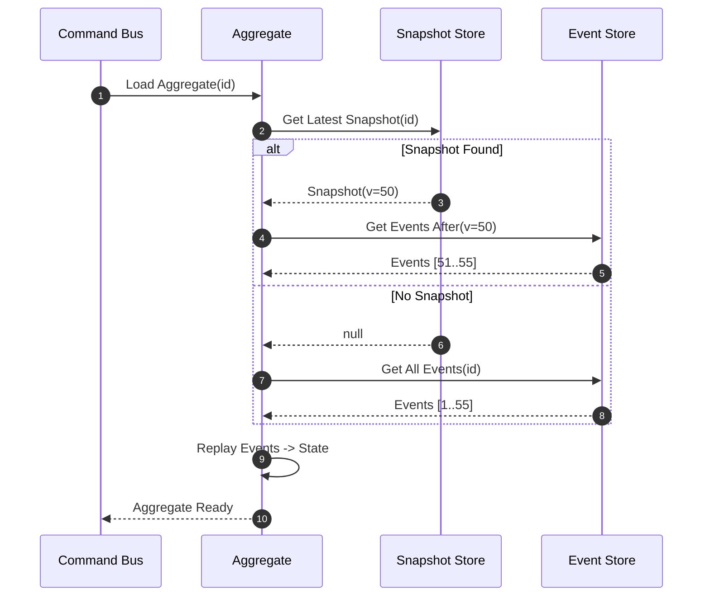
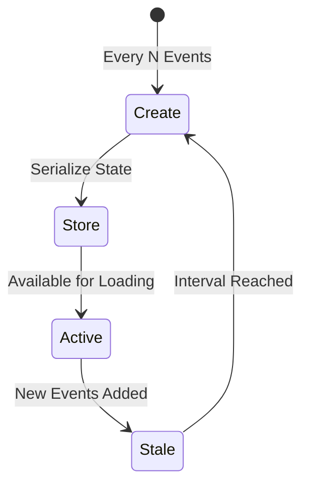
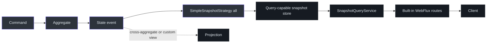

# Snapshot

Snapshots save aggregate-state checkpoints to reduce event replay. With the recommended `all` strategy, the same data also serves as the default materialized current-state query store through `SnapshotQueryService` and Wow's built-in query routes.

Every Snapshot query entry point uses the single `QueryGateway`. Put mandatory tenant/owner/space/ABAC conditions in `QueryPolicy` and masking in `ResultPolicy`; see [Query Filter migration](./migration/query-filter-to-query-policy.md).

## Snapshot Mechanism

In event sourcing, the state of an aggregate root is reconstructed by replaying all historical events. As the number of events increases, replaying all events becomes slower and slower. The snapshot mechanism solves this problem by periodically saving the current state of the aggregate root.

```kotlin
interface Snapshot<S : Any> : ReadOnlyStateAggregate<S>, SnapshotTimeCapable

data class SimpleSnapshot<S : Any>(
    override val delegate: ReadOnlyStateAggregate<S>,
    override val snapshotTime: Long = System.currentTimeMillis()
) : Snapshot<S>
```

## Snapshot Loading Flow

When loading an aggregate, the snapshot store is consulted first. If a snapshot exists, only events after the snapshot version need to be replayed.


```mermaid
sequenceDiagram
    autonumber
    participant CB as Command Bus
    participant AG as Aggregate
    participant SS as Snapshot Store
    participant ES as Event Store

    CB->>AG: Load Aggregate(id)
    AG->>SS: Get Latest Snapshot(id)
    alt Snapshot Found
        SS-->>AG: Snapshot(v=50)
        AG->>ES: Get Events After(v=50)
        ES-->>AG: Events [51..55]
    else No Snapshot
        SS-->>AG: null
        AG->>ES: Get All Events(id)
        ES-->>AG: Events [1..55]
    end
    AG->>AG: Replay Events -> State
    AG-->>CB: Aggregate Ready
```

<!-- Sources: wow-core/src/main/kotlin/me/ahoo/wow/eventsourcing/snapshot/, wow-api/src/main/kotlin/me/ahoo/wow/api/modeling/ -->

## Snapshot Strategies

Snapshot strategies react to each state event and decide whether to persist a new
snapshot. The strategy contract is reactive and processes one `StateEventExchange`
at a time instead of returning a boolean predicate:

```kotlin
interface SnapshotStrategy {
    fun onEvent(stateEventExchange: StateEventExchange<*>): Mono<Void>
}
```

The Wow framework provides the following built-in strategies:

### Version Offset Strategy (VersionOffset)

Creates a snapshot when the difference between the aggregate root version and the
last snapshot version reaches the configured threshold. The strategy reads the
stored version via `SnapshotStore.getVersion()` and only saves when the offset is
met, so snapshot frequency is independent of concurrent state events.

```kotlin
class VersionOffsetSnapshotStrategy(
    private val versionOffset: Int = DEFAULT_VERSION_OFFSET, // 5
    private val snapshotStore: SnapshotStore
) : SnapshotStrategy
```

### All Strategy (All)

Saves a snapshot for every state event.

```kotlin
class SimpleSnapshotStrategy(
    private val snapshotStore: SnapshotStore
) : SnapshotStrategy
```

### No Operation Strategy (NoOp)

Does not create any snapshots. `NoOp` is nested inside the `SnapshotStrategy` interface as a companion object:

```kotlin
interface SnapshotStrategy {
    // ...
    companion object NoOp : SnapshotStrategy {
        override fun onEvent(stateEventExchange: StateEventExchange<*>): Mono<Void> = Mono.empty()
    }
}
```

## Snapshot Lifecycle


```mermaid
stateDiagram-v2
    [*] --> Create: Every N Events
    Create --> Store: Serialize State
    Store --> Active: Available for Loading
    Active --> Stale: New Events Added
    Stale --> Create: Interval Reached
```

<!-- Sources: wow-core/src/main/kotlin/me/ahoo/wow/eventsourcing/snapshot/SnapshotMaterializer.kt, wow-core/src/main/kotlin/me/ahoo/wow/eventsourcing/snapshot/dispatcher/SnapshotHandler.kt -->

## Snapshot Store

The snapshot store is responsible for storing and retrieving snapshots. Batch aggregate ID scanning belongs to `EventStore.scanAggregateId(...)`, not to the snapshot store.

```kotlin
interface SnapshotStore : Named, AutoCloseable {
    fun <S : Any> load(aggregateId: AggregateId): Mono<Snapshot<S>>
    fun <S : Any> save(snapshot: Snapshot<S>): Mono<Void>
    fun getVersion(aggregateId: AggregateId): Mono<Int>
}
```

`SnapshotStore` extends `AutoCloseable`. The default `close()` is a no-op, but
storage-backed implementations (and batching wrappers) release workers and flush
partial windows on close; Spring closes configured beans through their normal
lifecycle.

`SnapshotStore.save()` atomically maintains the latest snapshot for each aggregate.
A candidate whose aggregate version is greater than or equal to the stored version
replaces the complete stored snapshot; only a lower-version candidate is a no-op.
Allowing equal-version replacement lets snapshot regeneration repair state without
changing the aggregate version. Storage implementations must enforce the comparison
in the same atomic operation as the write to prevent out-of-order state events from
regressing the snapshot.

### In-Memory Implementation

```kotlin
class InMemorySnapshotStore : SnapshotStore {
    private val snapshots = ConcurrentHashMap<AggregateId, ObjectNode>()

    override fun <S : Any> load(aggregateId: AggregateId): Mono<Snapshot<S>> =
        Mono.defer {
            Mono.justOrEmpty(snapshots[aggregateId]?.toObject<Snapshot<S>>())
        }

    override fun <S : Any> save(snapshot: Snapshot<S>): Mono<Void> =
        Mono.fromRunnable {
            val candidate = snapshot.toJsonNode<ObjectNode>()
            val candidateVersion = candidate[MessageRecords.VERSION].asInt()
            snapshots.compute(snapshot.aggregateId) { _, stored ->
                if (
                    stored == null ||
                    candidateVersion >= stored[MessageRecords.VERSION].asInt()
                ) {
                    candidate
                } else {
                    stored
                }
            }
        }
}
```

### Supported Backends

| Backend | Module | Snapshot storage | Dynamic snapshot query |
|---------|--------|------------------|------------------------|
| In-memory | `wow-core` | Development/testing | No built-in query factory |
| MongoDB | `wow-mongo` | Production-ready | Yes |
| Redis | `wow-redis` | Production-ready | No built-in query factory |
| Elasticsearch | `wow-elasticsearch` | Production-ready | Yes |

## Snapshot Processing Flow

1. **State Event Publishing**: When aggregate root state changes, publish state events
2. **Strategy Evaluation**: Snapshot strategy evaluates whether a snapshot needs to be created
3. **Snapshot Creation**: If needed, create a snapshot of the current state
4. **Snapshot Storage**: Save the snapshot to the snapshot store

## Configuration

```yaml
wow:
  eventsourcing:
    snapshot:
      enabled: true  # Whether to enable snapshots
      strategy: all  # Snapshot strategy (all, version_offset)
      storage: mongo  # Snapshot storage backend (mongo, redis, elasticsearch, in_memory)
```

| Property | Default | Description |
|----------|---------|-------------|
| `wow.eventsourcing.snapshot.enabled` | `true` | Enable latest snapshots |
| `wow.eventsourcing.snapshot.strategy` | `all` | Snapshot strategy (`all` or `version_offset`) |
| `wow.eventsourcing.snapshot.version-offset` | `5` | Version offset threshold (only used by `version_offset`) |
| `wow.eventsourcing.snapshot.storage` | `mongo` | Snapshot storage backend (shared `StorageType` enum) |

## Snapshots as the Default Read Model

Use `strategy: all` by default. `SimpleSnapshotStrategy` materializes the state produced by every state event, making the snapshot store a real-time current-state query store after the `SNAPSHOT` stage completes, as well as an aggregate-loading checkpoint. For standard queries over one aggregate type, this removes the need to write a projection that duplicates aggregate state.

| Strategy | Stored state | Query consequence | Recommendation |
|---|---|---|---|
| `all` | Every processed state event updates the latest snapshot | Queries read the latest materialized aggregate state after snapshot processing completes | Recommended |
| `version_offset` | A snapshot is written only after the version gap reaches `version-offset` | Snapshot queries can lag behind the aggregate | Use only when staleness is accepted or another read model serves current queries |


```mermaid
flowchart LR
    Command[Command] --> Aggregate[Aggregate]
    Aggregate --> Event[State event]
    Event --> Strategy[SimpleSnapshotStrategy all]
    Strategy --> Store[Query-capable snapshot store]
    Store --> Service[SnapshotQueryService]
    Service --> Routes[Built-in WebFlux routes]
    Routes --> Client[Client]
    Event -. cross-aggregate or custom view .-> Projection[Projection]

    classDef primary fill:#2d333b,stroke:#6d5dfc,color:#e6edf3
    classDef secondary fill:#161b22,stroke:#30363d,color:#e6edf3
    class Command,Aggregate,Event,Strategy primary
    class Store,Service,Routes,Client,Projection secondary
```

<!-- Sources: wow-core/src/main/kotlin/me/ahoo/wow/eventsourcing/snapshot/SimpleSnapshotStrategy.kt:19-38, wow-query/src/main/kotlin/me/ahoo/wow/query/snapshot/SnapshotQueryService.kt:30-61, wow-openapi/src/main/kotlin/me/ahoo/wow/openapi/contributor/aggregate/snapshot/SnapshotRouteContributor.kt:59-281, wow-spring-boot-starter/src/main/kotlin/me/ahoo/wow/spring/boot/starter/webflux/route/QueryRouteModule.kt:34-79 -->

When WebFlux support is enabled, Wow generates standard snapshot query endpoints for each aggregate:

| Query shape | Route suffix | Result |
|---|---|---|
| Count | `/snapshot/count` | Number of matching snapshots |
| List | `/snapshot/list` and `/snapshot/list/state` | Bounded snapshot or state list |
| Paged | `/snapshot/paged` and `/snapshot/paged/state` | Paged snapshots or states |
| Single | `/snapshot/single` and `/snapshot/single/state` | One snapshot or state |

These routes are backed by the same `SnapshotQueryService` contract used by the Query DSL, and Spring registers a typed `<aggregate>.SnapshotQueryService` bean for each aggregate. Applications therefore do not need to hand-write query API endpoints for these standard shapes ([SnapshotQueryService.kt:30-61](https://github.com/Ahoo-Wang/Wow/blob/main/wow-query/src/main/kotlin/me/ahoo/wow/query/snapshot/SnapshotQueryService.kt#L30-L61), [SnapshotQueryServiceRegistrar.kt:28-61](https://github.com/Ahoo-Wang/Wow/blob/main/wow-spring/src/main/kotlin/me/ahoo/wow/spring/query/SnapshotQueryServiceRegistrar.kt#L28-L61), [SnapshotRouteContributor.kt:59-281](https://github.com/Ahoo-Wang/Wow/blob/main/wow-openapi/src/main/kotlin/me/ahoo/wow/openapi/contributor/aggregate/snapshot/SnapshotRouteContributor.kt#L59-L281)).

:::warning Query capability and consistency boundaries
A query-capable backend is required. MongoDB and Elasticsearch provide `SnapshotQueryServiceFactory`; a custom backend must provide the matching binding. Redis and in-memory snapshot stores support persistence and loading but do not by themselves provide dynamic snapshot queries. Keep tenant/owner filtering, authorization, and indexes explicit. Snapshot processing consumes state events asynchronously. With `strategy: all` and the query service bound to the same backend, a caller that requires read-after-write visibility must wait for the `SNAPSHOT` command stage. The stage only proves snapshot processing completed; `version_offset` can complete without writing when its threshold is not met. The event stream remains the source of truth.
:::

Continue to use a projection when the read model joins multiple aggregates, needs a denormalized schema that differs from aggregate state, feeds analytics, or synchronizes an external system.

## Aggregate Loading Optimization

Aggregate loading should reuse the framework's `StateAggregateRepository` instead of
manually composing `SnapshotStore`, `EventStore`, and event replay in application code:

```kotlin
val aggregateId = namedAggregate.aggregateId(id = orderId, tenantId = tenantId)
val aggregate: Mono<StateAggregate<OrderState>> =
    stateAggregateRepository.load(aggregateId)
```

When the latest version is requested, `EventSourcingStateAggregateRepository` first tries the
snapshot. It then reads `EventStore` from `stateAggregate.expectedNextVersion` and applies each
incremental stream through `stateAggregate.onSourcing(eventStream)`. Historical-version queries
do not use the latest snapshot.

## Performance Impact

- **`all` Strategy**: Once snapshot processing completes, the latest snapshot already contains the state produced by the latest state event
- **`version_offset` Strategy**: Aggregate loading replays only events after the last snapshot, bounded by the configured offset
- **Snapshots Disabled**: Every load requires replaying all historical events
- **Storage Cost**: Requires additional storage space to save snapshot data

For example, explicitly choosing `strategy: version_offset` with `version-offset: 50` limits aggregate loading to at most 49 replayed events, but the same lag also applies to direct snapshot queries. The recommended `all` strategy favors a current query store over reducing snapshot writes.

## Best Practices

1. **Prefer `all`**: Use the latest snapshot as the default current-state read model.
2. **Reuse the query service and routes**: Do not duplicate aggregate state in a projection or write a controller for standard single/list/paged/count queries.
3. **Select a query-capable backend**: Use MongoDB, Elasticsearch, or a custom `SnapshotQueryServiceFactory` when dynamic queries are required.
4. **Design query safety and performance**: Verify authorization, tenant/owner filters, indexes, and query plans with production-like data.
5. **Define read-after-write behavior**: With `all` and the same query-capable backend, wait for `SNAPSHOT` when the response must be visible through snapshot queries.
6. **Treat `version_offset` as an explicit trade-off**: Use it only after accepting query staleness or providing another current-state read model.

`SnapshotStore` currently has no generic deletion API. Physical cleanup, when required, must be
designed and verified for the selected backend rather than treated as a Wow lifecycle capability.

## Related Topics

- [Production Best Practices](./best-practices.md) — Apply snapshots as the default query store in a complete production checklist
- [Query Service](./query.md) — Build filters and use the generated snapshot query endpoints
- [Projection](./projection.md) — Build cross-aggregate or purpose-specific read models
