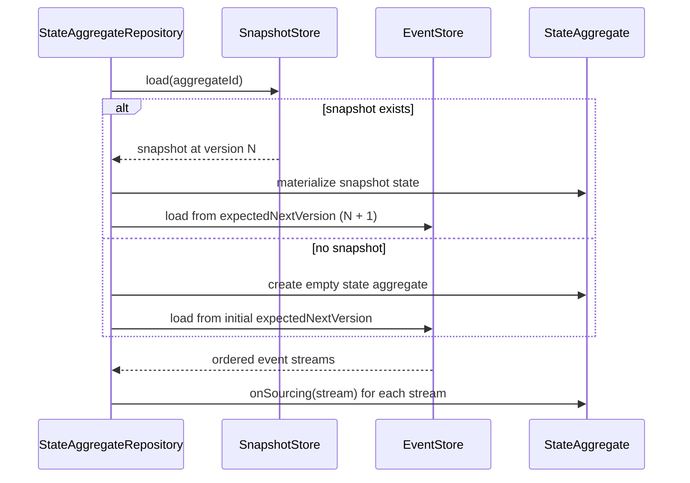
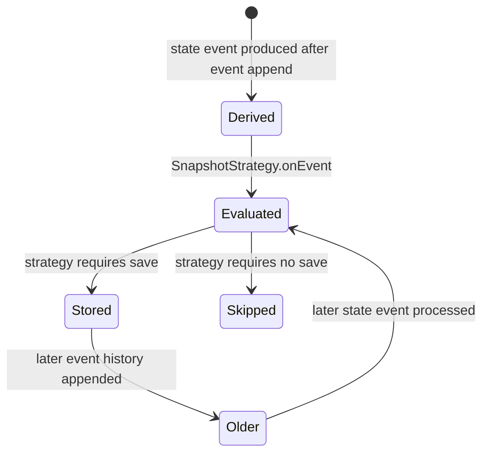
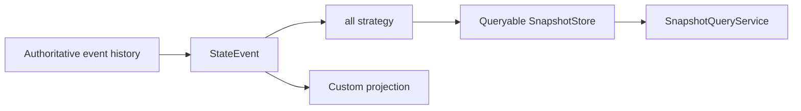

# Snapshot

A snapshot is a versioned copy of aggregate state derived from event history. It can accelerate current-state restoration and, with a query-capable backend, serve standard current-state queries. It is not the authoritative business history.

For the running `CreateOrder` example, `PROCESSED` proves `OrderCreated` was appended. The later `SNAPSHOT` stage proves the snapshot dispatcher completed the configured strategy for the resulting state event.

## Snapshot Mechanism

```kotlin
interface Snapshot<S : Any> :
    ReadOnlyStateAggregate<S>,
    SnapshotTimeCapable

data class SimpleSnapshot<S : Any>(
    override val delegate: ReadOnlyStateAggregate<S>,
    override val snapshotTime: Long = System.currentTimeMillis(),
) : Snapshot<S>
```

The snapshot contains state and aggregate metadata at a known version. The event store still owns the events that explain how that state was reached.

## Snapshot Loading Flow

`EventSourcingStateAggregateRepository` uses snapshots only for a latest-version load:


```mermaid
sequenceDiagram
    participant R as StateAggregateRepository
    participant S as SnapshotStore
    participant E as EventStore
    participant A as StateAggregate

    R->>S: load(aggregateId)
    alt snapshot exists
        S-->>R: snapshot at version N
        R->>A: materialize snapshot state
        R->>E: load from expectedNextVersion (N + 1)
    else no snapshot
        R->>A: create empty state aggregate
        R->>E: load from initial expectedNextVersion
    end
    E-->>R: ordered event streams
    R->>A: onSourcing(stream) for each stream
```

Historical version/time loads start from an empty aggregate and replay authoritative events; they do not apply a latest snapshot from after the requested point.

## Snapshot Strategies

`SnapshotStrategy.onEvent(StateEventExchange<*>)` is a reactive processing contract. Completion means that the selected strategy has finished for the state event; the strategy decides whether a write was required.

### Version Offset Strategy (VersionOffset)

`VersionOffsetSnapshotStrategy` reads the stored snapshot version and saves only when:

```text
stateEvent.version - storedSnapshotVersion >= versionOffset
```

The default offset is 5. When the threshold is not reached, the strategy completes successfully without calling `SnapshotStore.save`. Therefore `stage: SNAPSHOT` under this strategy does not by itself prove that this command wrote a new snapshot.

### All Strategy (All)

`SimpleSnapshotStrategy` creates `SimpleSnapshot(stateEvent)` and calls `SnapshotStore.save` for every state event. With this strategy, successful `SNAPSHOT` completion includes the save operation for that state event.

This is the straightforward choice when snapshot queries are the application's standard current-state read path.

### No Operation Strategy (NoOp)

`SnapshotStrategy.NoOp` returns `Mono.empty()` and writes nothing. It is useful when snapshots are disabled or intentionally not part of the runtime. Do not wait for snapshot-backed visibility when using a no-op strategy.

## Snapshot Lifecycle


```mermaid
stateDiagram-v2
    [*] --> Derived: state event produced after event append
    Derived --> Evaluated: SnapshotStrategy.onEvent
    Evaluated --> Stored: strategy requires save
    Evaluated --> Skipped: strategy requires no save
    Stored --> Older: later event history appended
    Older --> Evaluated: later state event processed
```

A snapshot can lag or be rebuilt without changing event history. If a snapshot is missing, aggregate restoration falls back to replay.

## Snapshot Store

```kotlin
interface SnapshotStore : Named, AutoCloseable {
    fun <S : Any> load(aggregateId: AggregateId): Mono<Snapshot<S>>
    fun <S : Any> save(snapshot: Snapshot<S>): Mono<Void>
    fun getVersion(aggregateId: AggregateId): Mono<Int>
}
```

`save` must keep each aggregate's stored version monotonically non-decreasing. A candidate with a higher or equal version replaces the stored value; a lower version is ignored. Compare-and-write must be atomic per aggregate in the storage implementation.

This contract protects against out-of-order state-event processing. It does not define backend transactions, indexes, durability, or query consistency beyond what the chosen implementation proves.

### In-Memory Implementation

`InMemorySnapshotStore` is suitable for tests and a single process. It is volatile. Its behavior is useful for contract tests but is not evidence for a production backend's durability or concurrency implementation.

### Supported Backends

| Module | Snapshot save/load | Dynamic snapshot query |
|---|---:|---:|
| `wow-core` in-memory | yes | no built-in query factory |
| `wow-mongo` | yes | provided by module |
| `wow-redis` | yes | no built-in query factory |
| `wow-elasticsearch` | yes | provided by module |

Verify selected-module tests and configuration before relying on query, atomic save, or operational behavior.

## Snapshot Processing Flow

After an event stream has been appended and command processing completes:

1. the resulting aggregate state is carried by a `StateEvent`;
2. `SnapshotDispatcher` routes the exchange;
3. `SnapshotFunctionFilter` calls the configured `SnapshotStrategy`;
4. the strategy saves or deliberately skips;
5. `SnapshotNotifierFilter` emits `SNAPSHOT` after the filter chain completes.

A snapshot failure is a downstream failure after authoritative event append. Recovery should retry/rebuild the snapshot path from events; it should not fabricate or edit event history to match a failed cache.

## Configuration

```yaml
wow:
  eventsourcing:
    snapshot:
      enabled: true
      strategy: all
      version-offset: 5
      storage: mongo
```

Choose `version_offset` only when reduced snapshot writes justify additional replay and possible query staleness.

## Snapshots as the Default Read Model

With `strategy: all` and a query-capable store, the latest snapshot is a natural current-state read model for one aggregate type. Generated snapshot query services/routes can cover single, list, paged, and count use cases without copying the same aggregate state into another projection.


```mermaid
flowchart LR
    EventHistory[Authoritative event history] --> StateEvent
    StateEvent --> Strategy[all strategy]
    Strategy --> SnapshotStore[Queryable SnapshotStore]
    SnapshotStore --> Query[SnapshotQueryService]
    StateEvent --> Projection[Custom projection]
```

Use a projection when the read model joins aggregates, has a different lifecycle/schema, supports analytics, or feeds another system.

::: warning Consistency boundary
For `all`, waiting for `SNAPSHOT` is the command-level evidence that snapshot strategy/save completed. It still does not prove client cache refresh, replica visibility, authorization correctness, or an unrelated projection. For `version_offset`, the same stage may complete without a new write.
:::

## Aggregate Loading Optimization

Application code should depend on `StateAggregateRepository`:

```kotlin
val aggregate: Mono<StateAggregate<OrderState>> =
    stateAggregateRepository.load(aggregateId)
```

The repository owns snapshot selection, fallback, and event replay from `expectedNextVersion`. Duplicating that composition in application code creates a second recovery algorithm and risks using a stale/future checkpoint incorrectly.

## Performance Impact

| Strategy | Writes | Latest-load replay | Snapshot-query freshness |
|---|---|---|---|
| `all` | every state event | normally events after the latest state event | current after successful `SNAPSHOT` and backend visibility |
| `version_offset` | only at threshold | at most the configured gap under sequential processing | can lag by the same gap |
| no-op/disabled | none | full event history | unavailable from snapshots |

Measure with real aggregate history and selected backend. Snapshot serialization, writes, query indexes, and restore replay all contribute to cost.

## Best Practices

1. Keep event history as the recovery authority.
2. Prefer `all` when standard current-state snapshot queries matter.
3. Wait for `SNAPSHOT` only when that is the response's actual visibility requirement.
4. Interpret `SNAPSHOT` together with the configured strategy.
5. Test monotonic atomic save behavior in the selected backend.
6. Rebuild missing/corrupt snapshots from events; do not edit history to repair a cache.
7. Use projections only for read models that differ materially from aggregate state.

`SnapshotStore` has no generic delete API. Cleanup and retention are backend-specific operational work.

## Related Topics

- [Event Store](./eventstore) — authoritative history and aggregate restoration
- [Command Gateway](./command-gateway) — `PROCESSED` and `SNAPSHOT` wait semantics
- [Query](./query) — querying supported snapshot stores
- [Projection](./projection) — custom derived read models
