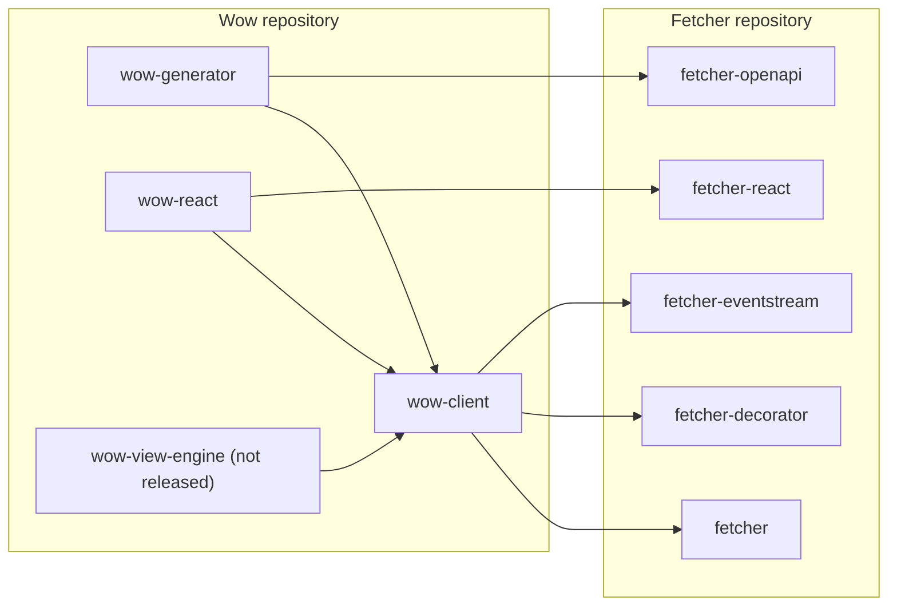

# TypeScript Client

This page answers: **which Wow TypeScript package does a browser or Node application need, and what does it depend on?**

The Wow repository ships the TypeScript side of the Wow HTTP contract. The packages live under [`typescript/`](https://github.com/Ahoo-Wang/Wow/tree/main/typescript) and build on [Fetcher](https://fetcher.ahoo.me/), a general-purpose HTTP client that keeps its own repository and documentation.

## Packages

| Package | Use it to | Status |
|---|---|---|
| `@ahoo-wang/wow-client` | Send commands, read snapshots and event streams, and build filters, pagination, and aggregations | Released with Wow 9.2.0 |
| `@ahoo-wang/wow-generator` | Generate typed models, command clients, and query clients from a Wow OpenAPI document | Released with Wow 9.2.0; CLI `wow-generator` |
| `@ahoo-wang/wow-react` | Drive Wow single, list, paged, count, and stream queries from React components | Released with Wow 9.2.0 |
| `@ahoo-wang/wow-view-engine` | Let users filter, analyse by dimensions and metrics, chart, and save views over Wow data | Not released yet |

Wow 9.2.0 is the first release of the three; until it is out they are not yet on npm, and `pnpm add` answers `E404`. See [Compatibility and Versions](./compatibility.md) for the release status, the supported servers and runtimes, and what CI verifies.

The first three came from the Fetcher repository, where they were `@ahoo-wang/fetcher-wow`, `@ahoo-wang/fetcher-generator`, and the Wow hooks of `@ahoo-wang/fetcher-react`. If a project still uses those names, start with the [migration guide](./migration.md).

## Dependencies

Dependencies point one way: Wow packages depend on Fetcher packages, never the reverse. Every dependency on another package is a peer dependency, so the application installs and owns each version.



| Peer | Range |
|---|---|
| `@ahoo-wang/fetcher`, `fetcher-decorator`, `fetcher-eventstream`, `fetcher-openapi` | `^5.1 \|\| ^6` |
| `@ahoo-wang/fetcher-react` (for `wow-react`) | `^5.1.3 \|\| ^6` |
| `@ahoo-wang/wow-client` (for the other Wow packages) | Same minor version, `~x.y.z` |

## Versions

The TypeScript packages share one version with the Kotlin modules and are released from the same tag: `@ahoo-wang/wow-client` 9.2.0 is released together with Wow 9.2.0. Use one version for all Wow packages of an application, preferably the version of the service it calls. Breaking changes ship only in an `x.Y.0` release and are listed under "Breaking" in the [release notes](https://github.com/Ahoo-Wang/Wow/releases).

Supported servers are Wow 8.11 and later through the `filter` API, and Wow 8.10 through `@ahoo-wang/wow-client/legacy` (the deprecated `Condition` API). CI runs the client against a server built from the same commit and smoke-tests it against Wow 8.11.5; for Wow 8.10.8 it only type-checks the generated code. Both 8.x lines and `/legacy` are removed in v10. The [compatibility matrix](./compatibility.md) has the details, along with Node.js (22.12 or later), React (19.3 or later) and TypeScript.

## Install

```sh
pnpm add @ahoo-wang/fetcher @ahoo-wang/fetcher-decorator @ahoo-wang/fetcher-eventstream @ahoo-wang/wow-client
pnpm add -D @ahoo-wang/wow-generator @ahoo-wang/fetcher-openapi typescript
```

Add `react` (19.3 or later), `@ahoo-wang/fetcher-react`, and `@ahoo-wang/wow-react` for the React hooks. Each reference page lists the exact install command for its package.

## Continue by task

| Task | Read first | Then read |
|---|---|---|
| Call a Wow service from TypeScript for the first time | [Quick Start](./quick-start.md) | [wow-generator reference](../../reference/typescript/wow-generator/) and [Wow discovery](../../reference/typescript/wow-generator/wow-discovery.md) |
| Sign requests with the user's token, fill tenant and owner | [Authentication and Interceptors](./authentication.md) | [Identity and attribution](../../reference/typescript/wow-client/identity-and-attribution.md) |
| Handle failed commands, queries and streams | [Error Handling](./error-handling.md) | [Errors reference](../../reference/typescript/wow-client/errors-and-utilities.md) |
| Send a command and read state without generated code | [Commands and Queries](./commands-and-queries.md) | [wow-client reference](../../reference/typescript/wow-client/) |
| Generate a client from an OpenAPI document that is not from Wow | [Generate a Client from Any OpenAPI Document](./generated-client.md) | [Generated output](../../reference/typescript/wow-generator/generated-output.md) |
| Keep generated code in step with the service | [Regenerate in CI](./regenerate-in-ci.md) | [Generator CLI](../../reference/typescript/wow-generator/cli.md) |
| Run on a server, in Node.js or with Next.js | [SSR and Node.js](./ssr-and-node.md) | [Compatibility and Versions](./compatibility.md) |
| Show query results in React | [wow-react query hooks](../../reference/typescript/wow-react/) | [Snapshot queries](../../reference/typescript/wow-client/snapshot-queries.md) |
| Evaluate saved data views | [View Engine](./view-engine.md) | [wow-view-engine reference](../../reference/typescript/wow-view-engine/) |
| Move off the Fetcher package names | [Migration from Fetcher packages](./migration.md) | The reference page of each package |
| Find why something fails | [Troubleshooting](./troubleshooting.md) | [Error Handling](./error-handling.md) |

The server side of these contracts is described in [Commands](../command/), [Query](../query.md), and [Open API](../open-api.md). The generic Fetcher topics, including interceptor internals, cancellation, and server-sent events, stay at [fetcher.ahoo.me](https://fetcher.ahoo.me/).

## Try it in Storybook

The [Storybook](/storybook/) runs the query hooks and the view engine against in-memory fixtures, so every example below works without a server. The Storybook is written in Chinese only: story titles and scenario notes included.

| Example | What it shows |
|---|---|
| [Wow query hooks](/storybook/?path=/docs/react-hooks-wow-queries--docs) | Single, list, paged, count, and streaming queries through the `wow-react` hooks |
| [View engine home](/storybook/?path=/docs/view-engine-首页--docs) | A host application's landing page built from an embedded dashboard |
| [Record workbench](/storybook/?path=/docs/view-engine-数据视图-record-工作台--docs) | Filtering, sorting, columns, paging, and saved record views |
| [Analysis workbench](/storybook/?path=/docs/view-engine-分析视图-分析工作台--docs) | Dimensions, metrics, charts, and tables with totals |
| [Dashboard](/storybook/?path=/docs/view-engine-仪表盘视图-dashboard--docs) | Panels, global filters, and click-through between boards |
