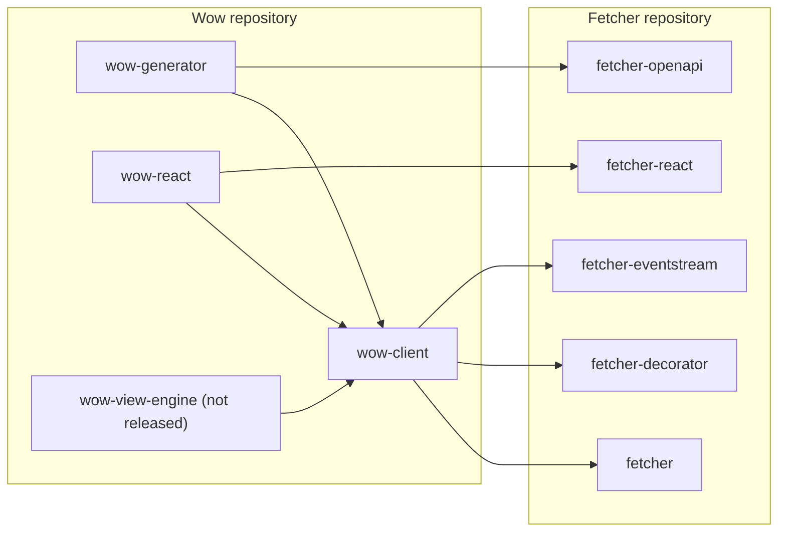

# TypeScript Client

This page answers: **which Wow TypeScript package does a browser or Node application need, and what does it depend on?**

The Wow repository ships the TypeScript side of the Wow HTTP contract. The packages live under [`typescript/`](https://github.com/Ahoo-Wang/Wow/tree/main/typescript) and build on [Fetcher](https://fetcher.ahoo.me/), a general-purpose HTTP client that keeps its own repository and documentation.

## Packages

| Package | Use it to | Status |
|---|---|---|
| `@ahoo-wang/wow-client` | Send commands, read snapshots and event streams, and build filters, pagination, and aggregations | Published |
| `@ahoo-wang/wow-generator` | Generate typed models, command clients, and query clients from a Wow OpenAPI document | Published; CLI `wow-generator` |
| `@ahoo-wang/wow-react` | Drive Wow single, list, paged, count, and stream queries from React components | Published |
| `@ahoo-wang/wow-view-engine` | Let users filter, group, chart, and save views over Wow data | Not released yet |

The first three came from the Fetcher repository, where they were `@ahoo-wang/fetcher-wow`, `@ahoo-wang/fetcher-generator`, and the Wow hooks of `@ahoo-wang/fetcher-react`. If a project still uses those names, start with the [migration guide](./migration.md).

## Dependencies

Dependencies point one way: Wow packages depend on Fetcher packages, never the reverse. Every dependency on another package is a peer dependency, so the application installs and owns each version.



| Peer | Range |
|---|---|
| `@ahoo-wang/fetcher`, `fetcher-decorator`, `fetcher-eventstream`, `fetcher-openapi` | `^5.1 \|\| ^6` |
| `@ahoo-wang/fetcher-react` (for `wow-react`) | `^5.1.3 \|\| ^6` |
| `@ahoo-wang/wow-client` (for the other Wow packages) | Same minor version, `~x.y.z` |

## Versions

The TypeScript packages share one version with the Kotlin modules: for example, `@ahoo-wang/wow-client` 9.2.3 is released together with Wow 9.2.3, from the same tag. Pick the client version that matches the Wow server you call, and upgrade the Wow packages together. Breaking changes ship only in an `x.Y.0` release and are listed under "Breaking" in the [release notes](https://github.com/Ahoo-Wang/Wow/releases).

Throughout Wow 9.x the client and the generator still work against Wow 8.x servers: 8.11 and later with `FilterExpression`, 8.10 through the deprecated `Condition` API, which lives on the `@ahoo-wang/wow-client/legacy` subpath. Both are removed in v10.

## Install

```sh
pnpm add @ahoo-wang/fetcher @ahoo-wang/fetcher-decorator @ahoo-wang/fetcher-eventstream @ahoo-wang/wow-client
pnpm add -D @ahoo-wang/wow-generator @ahoo-wang/fetcher-openapi typescript
```

Add `react`, `@ahoo-wang/fetcher-react`, and `@ahoo-wang/wow-react` for the React hooks. Each reference page lists the exact install command for its package.

## Continue by task

| Task | Read first | Then read |
|---|---|---|
| Send a command and read state by hand | [Commands and Queries](./commands-and-queries.md) | [wow-client reference](../../reference/typescript/wow-client/) |
| Generate clients from the server's OpenAPI document | [Generate a Client](./generated-client.md) | [wow-generator reference](../../reference/typescript/wow-generator/) and [Wow discovery](../../reference/typescript/wow-generator/wow-discovery.md) |
| Show query results in React | [wow-react query hooks](../../reference/typescript/wow-react/) | [Snapshot queries](../../reference/typescript/wow-client/snapshot-queries.md) |
| Evaluate saved data views | [View Engine](./view-engine.md) | [wow-view-engine reference](../../reference/typescript/wow-view-engine/) |
| Move off the Fetcher package names | [Migration from Fetcher packages](./migration.md) | The reference page of each package |

The server side of these contracts is described in [Commands](../command/), [Query](../query.md), and [Open API](../open-api.md). The generic Fetcher topics, including interceptors, cancellation, and server-sent events, stay at [fetcher.ahoo.me](https://fetcher.ahoo.me/).

## Try it in Storybook

The [Storybook](/storybook/) runs the query hooks and the view engine against in-memory fixtures, so every example below works without a server. The view engine's scenario notes are written in Chinese.

| Example | What it shows |
|---|---|
| [Wow query hooks](/storybook/?path=/docs/react-hooks-wow-queries--docs) | Single, list, paged, count, and streaming queries through the `wow-react` hooks |
| [View engine home](/storybook/?path=/docs/view-engine-首页--docs) | A host application's landing page built from an embedded dashboard |
| [Record workbench](/storybook/?path=/docs/view-engine-数据视图-record-工作台--docs) | Filtering, sorting, columns, paging, and saved record views |
| [Analysis workbench](/storybook/?path=/docs/view-engine-分析视图-分析工作台--docs) | Groupings, metrics, charts, and tables with totals |
| [Dashboard](/storybook/?path=/docs/view-engine-仪表盘视图-dashboard--docs) | Panels, global filters, and click-through between boards |
