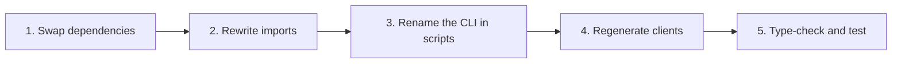

# Migrate from Fetcher Packages

This page answers: **what must change in an application that uses `@ahoo-wang/fetcher-wow`, `@ahoo-wang/fetcher-generator`, or the Wow hooks of `@ahoo-wang/fetcher-react`?**

The Wow TypeScript packages moved from the [Fetcher repository](https://github.com/Ahoo-Wang/fetcher) into the Wow repository so that the Kotlin contract, the TypeScript client, and the generator change in one pull request and release together. What changed is package names, the CLI name, peer ranges and the version line; the deprecated `Condition` API moved to the `@ahoo-wang/wow-client/legacy` subpath; and the first `wow-client` release changes a set of APIs — errors, command headers, the cancellation parameter, aggregation builders — listed in [API changes in the first release](#api-changes-in-the-first-release).

## What changed

| Before | After | Notes |
|---|---|---|
| `@ahoo-wang/fetcher-wow` | `@ahoo-wang/wow-client` | See [API changes](#api-changes-in-the-first-release); in addition the deprecated `Condition` API (the `Condition` builders, `Operator`, the `Condition`-based query types and factories) and the `en_US` / `zh_CN` operator locales moved to `@ahoo-wang/wow-client/legacy`; the `/query/locale/en_US` and `/query/locale/zh_CN` subpaths are gone |
| `@ahoo-wang/fetcher-generator` | `@ahoo-wang/wow-generator` | CLI renamed to `wow-generator`; `fetcher-generator` stays as an alias until v10 |
| Wow hooks of `@ahoo-wang/fetcher-react` | `@ahoo-wang/wow-react` | `useSingleQuery`, `useListQuery`, `usePagedQuery`, `useCountQuery`, `useListStreamQuery` and their `useFetcher*` variants |
| Fetcher 5.x version line | Wow version line | `wow-client` 9.x.y is released with Wow 9.x.y |
| `@ahoo-wang/fetcher-view-engine` (never published) | `@ahoo-wang/wow-view-engine` | Not released yet; see [View Engine](./view-engine.md) |

The core Fetcher packages keep their names and their documentation at [fetcher.ahoo.me](https://fetcher.ahoo.me/): `fetcher`, `fetcher-decorator`, `fetcher-eventstream`, `fetcher-openapi`, `fetcher-react`, and `fetcher-cosec`. `@ahoo-wang/fetcher-viewer` and the `dataMonitor` hooks of `fetcher-react` did not move; they stay on Fetcher 5.x.

## Steps



### 1. Swap dependencies

Upgrade the Fetcher peers first: `@ahoo-wang/fetcher-react` must be 5.1.3 or later, because `wow-react` imports only its `/core` and `/fetcher` subpaths. Then replace the moved packages:

```sh
pnpm remove @ahoo-wang/fetcher-wow @ahoo-wang/fetcher-generator
pnpm add @ahoo-wang/wow-client
pnpm add -D @ahoo-wang/wow-generator
# only when the application uses the Wow query hooks
pnpm add @ahoo-wang/wow-react
```

| Package | Peer | Range |
|---|---|---|
| `wow-client` | `fetcher`, `fetcher-decorator`, `fetcher-eventstream` | `^5.1 \|\| ^6` |
| `wow-generator` | `fetcher`, `fetcher-decorator`, `fetcher-eventstream`, `fetcher-openapi` | `^5.1 \|\| ^6` |
| `wow-generator`, `wow-react` | `wow-client` | `~x.y.z`, the same minor version |
| `wow-react` | `fetcher-react` | `^5.1.3 \|\| ^6` |
| `wow-react` | `fetcher`, `fetcher-eventstream`, `react` | As declared by the package |

With `fetcher-react` 5.1.3 or later, its peer dependency on `fetcher-wow` is optional, so removing `fetcher-wow` leaves a single copy of the Wow types in the dependency graph. Keep `fetcher-wow` installed only if another dependency still requires it, and do not import Wow types from both packages in one application: the two sets of types are not interchangeable.

### 2. Rewrite imports

Replace the module specifiers, then apply the [API changes](#api-changes-in-the-first-release) below. Import the deprecated `Condition` API and the operator locales from `@ahoo-wang/wow-client/legacy`; everything else comes from the root entry.

```ts
// Before
import { CommandClient, filter, pagedQuery } from '@ahoo-wang/fetcher-wow';
import { zh_CN } from '@ahoo-wang/fetcher-wow/query/locale/zh_CN';
import { usePagedQuery, useFetcher } from '@ahoo-wang/fetcher-react';

// After
import { CommandClient, filter, pagedQuery } from '@ahoo-wang/wow-client';
import { zh_CN } from '@ahoo-wang/wow-client/legacy';
import { usePagedQuery } from '@ahoo-wang/wow-react';
import { useFetcher } from '@ahoo-wang/fetcher-react';
```

Only the five Wow query hooks and their `useFetcher*` variants move to `wow-react`. Every other hook, such as `useFetcher`, `useQuery`, and `useFetcherQuery`, stays in `@ahoo-wang/fetcher-react`. A search for `fetcher-wow` and for the ten hook names finds every line to change.

Moving the `Condition` API to `/legacy` also changes what the root entry's `singleQuery`, `listQuery`, and `pagedQuery` build: they take `filter` instead of `condition`, and `filter` defaults to `filter.matchAll()`. A call that passes `condition` needs the factory of the same name from `/legacy`, or a rewrite with `filter.*`.

#### API changes in the first release

The first `@ahoo-wang/wow-client` release also takes the chance to fix APIs that `fetcher-wow` could not change. Type checking finds every call site below, except the stream behaviour in the last row.

| `@ahoo-wang/fetcher-wow` | `@ahoo-wang/wow-client` |
|---|---|
| `ErrorCodes.isSucceeded(code)` / `ErrorCodes.isError(code)` | Removed: compare `code === ErrorCodes.SUCCEEDED`. `ErrorCodes` is a frozen `as const` object instead of a class, with the query schema and batch codes added; `SUCCEEDED_MESSAGE` and `NOT_FOUND_MESSAGE` are gone. `ErrorInfo.errorCode` is typed `ErrorCode` (Wow's codes, or any other string). |
| Reading a failed request's error body by hand | `await toWowError(error)` returns a `WowError` (`errorCode`, `errorMsg`, `bindingErrors`, `status`), or `undefined` when Wow did not answer; `isErrorInfo(value)` is the type guard. See [errors](../../reference/typescript/wow-client/errors-and-utilities.md). |
| `CommandHeaders` / `WowHeaders` classes | Frozen `as const` objects; `CommandHeaders.WAIT_STAGE` and the other members read the same, but each value is now a literal type. |
| `CommandRequestHeaders` with every header required and `string` | Every header optional and typed: wait stages are `CommandStage` names, `Command-Aggregate-Version` and `Command-Wait-Timeout` are integer strings, `Command-Local-First` is `'true'` or `'false'`. Build them with `commandHeaders({ … })` and `waitStrategy({ … })`, which also cover the wait chain (`tail`). |
| `new CommandClient<C>(metadata)` | `new CommandClient(metadata)`; the body type moves to the call: `send<C>(request)`, `sendAndWaitStream<C>(request)`. |
| Last query parameter `abortController?: AbortController` | `abort?: AbortController \| AbortSignal` on every query and load method, so `AbortSignal.timeout(ms)` or a data library's `signal` can be passed. Calls that pass a controller still compile; a class that implements `QueryApi` or `SnapshotQueryApi` must update its signatures. `attributes` is `Record<string, unknown>`. |
| `terms(field, alias, missingKey?)` | `terms(field, alias, { missingKey })` |
| `histogram(field, { interval, alias })` | `histogram(field, alias, { interval })` |
| `dateHistogram(field, { unit, alias, timeZone?, dense? })` | `dateHistogram(field, alias, { unit, timeZone?, dense? })` |
| `count(alias, predicate?)`, `any(field, alias, predicate?)`, `sum`/`avg`/`min`/`max`/`stddev`/`variance`/`distinctCount(expression, alias, predicate?)` | The metric filter moves into an options object: `count(alias, { filter })`, `sum(expression, alias, { filter })`, … |
| `percentile(expression, percentile, alias, predicate?)` | `percentile(expression, alias, { percentile, filter? })` |
| `QueryClientFactory#createOwnerLoadStateAggregateClient` | `createLoadOwnerStateAggregateClient` |
| `createQueryApiMetadata`, `SnapshotQueryEndpointPaths`, `EventStreamQueryEndpointPaths`, `LoadStateAggregateEndpointPaths`, `LoadOwnerStateAggregateEndpointPaths` | Removed from the public API: build clients through `QueryClientFactory` and call their methods. |
| `getPropertyValue`, `requireElementScopedFilter`, `effectiveSort`, `DEFAULT_OWNER_ID` | Removed. Read nested values with your own helper or a utility library; use `''` for an empty owner id. |
| `MediumMaterializedSnapshot` / `SmallMaterializedSnapshot` with `contextName` and `aggregateName` | Those two fields are gone; the server never sent them. |
| A stream whose server fails midway yields the error as one more data event | `listStream`, `listStateStream`, `aggregateStream` and `sendAndWaitStream` error with a `WowError`, so a `for await` throws. Code that inspected `event.event` for an error name should catch instead. |

New, not breaking: the `@ahoo-wang/wow-client/dsl` entry (the query DSL without HTTP code), `EventStreamQueryClient.load` / `loadStream` for a version range, `WowMetadataClient`, and `aggregation.query()` with `AGGREGATION_LIMITS`.

#### Wow 8.10 servers

Wow 8.11 and later accept `FilterExpression`. A Wow 8.10 server understands only the `Condition` model, so an application that calls one builds its queries with `@ahoo-wang/wow-client/legacy` and imports everything else from the root entry; the query clients accept both kinds of query:

```ts
import type { SnapshotQueryClient } from '@ahoo-wang/wow-client';
import { and, eq, listQuery, ownerId } from '@ahoo-wang/wow-client/legacy';

declare const snapshots: SnapshotQueryClient<unknown>;

const carts = await snapshots.listState(
  listQuery({ condition: and(ownerId('u-42'), eq('state.status', 'ACTIVE')) }),
);
```

`SnapshotQueryClient.getById` and `getStateById` send a `FilterExpression`, so they need Wow 8.11 or later; against 8.10, call `single` or `singleState` with a `/legacy` query built from `aggregateId(id)`.

### 3. Rename the CLI in scripts

```json
{
  "scripts": {
    "generate": "wow-generator generate -i ./openapi.json -o ./src/generated -t ./tsconfig.json"
  }
}
```

The `fetcher-generator` command still works as an alias of `wow-generator` until v10, so an unchanged script keeps running after step 1. The existing options are unchanged.

Rename the optional configuration file from `fetcher-generator.config.json` to `wow-generator.config.json`. Until v10 the old name is still read when the new one is absent, with a deprecation warning. The ownership manifest is now `.wow-generator.json`: the first regeneration reads an existing `.fetcher-generator.json`, so stale files are still cleaned up, and replaces it; commit the new manifest.

A configuration that cannot be read or parsed, or has an option of the wrong shape, now fails the run with exit code 3 instead of being ignored, and an http(s) input that answers with a non-2xx status fails with exit code 2. A script that checks the exit code sees the failure; see [CLI exit codes](../../reference/typescript/wow-generator/cli.md#failures-and-exit-codes).

### 4. Regenerate clients

Generated code imports its Wow types from `@ahoo-wang/wow-client` instead of `@ahoo-wang/fetcher-wow`. Code generated by `fetcher-generator` therefore does not compile once `fetcher-wow` is removed. Run the generator again against the same OpenAPI document:

```sh
pnpm exec wow-generator generate -i ./openapi.json -o ./src/generated -t ./tsconfig.json
```

Review the diff. Besides the import specifier, the 9.x generator changes generated code in these expected ways:

- The query types: a `ListQuery` or `PagedQuery` schema that carries `filter` (Wow 8.11 and later) now maps to `FilterListQuery` or `FilterPagedQuery` from `@ahoo-wang/wow-client`, and the `Condition`, `ConditionOptions`, and `Operator` schemas, like the `ListQuery` and `PagedQuery` schemas of Wow 8.10, map to types imported from `@ahoo-wang/wow-client/legacy`.
- Every file starts with `// Code generated by wow-generator. DO NOT EDIT.`, uses single quotes, and imports relative modules with `.js` extensions.
- A method is named after the last segment of its operationId (`example.cart.add_cart_item` → `addCartItem`), no longer after the shortest suffix not yet taken. A method whose name changes can keep its old one through `apiClients[tag].methodNames` in the [configuration](../../reference/typescript/wow-generator/configuration.md).
- Command clients merge the `apiMetadata` passed to the constructor over their defaults, so `new CartCommandClient({ fetcher })` keeps the bounded-context base path. Code that reached a service directly without that prefix passes `basePath: ''` now.
- A query client factory's `aggregateName` is the aggregate's route segment, and its fields type is `` `${CartAggregatedFields}` ``. A query annotated as `ListQuery` or `FilterListQuery` names the fields: `` ListQuery<`${CartAggregatedFields}`> ``.
- In a document that is not from Wow, API clients keep `tenantId` and `ownerId` path parameters; only Wow documents leave them to the interceptor by default.
- API client methods take query and header parameters and the request body as typed positional parameters before `httpRequest`, required ones first. A call that passed them in `httpRequest` (`urlParams.query`, `headers`, `body`) passes them as arguments now; `httpRequest` stays for anything else.

Treat any other difference as a generator change and review it like a contract change. Regenerate instead of rewriting the imports inside generated files by hand: generation owns those files, see [generated output and regeneration](../../reference/typescript/wow-generator/generated-output.md).

### 5. Type-check and test

```sh
pnpm exec tsc --noEmit
pnpm test
```

A remaining `@ahoo-wang/fetcher-wow` import fails type checking once the package is removed. Run the application's integration tests against a real Wow server as well: type checking does not prove that routes and command stages behave as before.

## Versions from now on

- The Wow TypeScript packages follow Wow releases. Choose the version that matches the Wow server, and upgrade `wow-client`, `wow-generator`, and `wow-react` together; they declare each other with `~x.y.z`.
- Breaking changes ship only in an `x.Y.0` release, and the release notes list each one with its migration.
- Throughout Wow 9.x, the client and the generator still work against Wow 8.x servers (8.11 and later with `FilterExpression`, 8.10 through `@ahoo-wang/wow-client/legacy`), the `fetcher-generator` alias and the `fetcher-generator.config.json` fallback work, and the deprecated `Condition` API is available from `/legacy`. All of them are removed in v10; switch to `FilterExpression` and the `filter.*` builders before then, see [filters](../../reference/typescript/wow-client/filters.md).
- New features land only in the Wow packages. Fetcher keeps a 5.x branch for fixes, and `fetcher-wow` and `fetcher-generator` are planned to be deprecated on npm when Fetcher 6.0 is released.

## Checklist

| Check | Done when |
|---|---|
| Dependencies | `fetcher-wow` and `fetcher-generator` are gone from `package.json`, and `fetcher-react` is 5.1.3 or later where it is used |
| Imports | No source file imports `@ahoo-wang/fetcher-wow`, the `Condition` API and the operator locales come from `@ahoo-wang/wow-client/legacy`, and the Wow query hooks come from `@ahoo-wang/wow-react` |
| Changed APIs | No call to `ErrorCodes.isSucceeded`/`isError`, `getPropertyValue`, `createQueryApiMetadata`, the `*EndpointPaths` constants or `createOwnerLoadStateAggregateClient`; aggregation builders take `(target, alias, options)`; command headers are built with `commandHeaders()`/`waitStrategy()`; failed calls are read with `toWowError`, and stream consumers catch `WowError` |
| Generated code | Regenerated with `wow-generator`, and the generated files import `@ahoo-wang/wow-client` |
| Versions | `wow-client`, `wow-generator`, and `wow-react` share one minor version that matches the Wow server |
| Verification | Type checking and the integration tests against a real Wow server pass |
