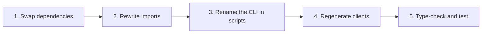

# Migrate from Fetcher Packages

This page answers: **what must change in an application that uses `@ahoo-wang/fetcher-wow`, `@ahoo-wang/fetcher-generator`, or the Wow hooks of `@ahoo-wang/fetcher-react`?**

The Wow TypeScript packages moved from the [Fetcher repository](https://github.com/Ahoo-Wang/fetcher) into the Wow repository so that the Kotlin contract, the TypeScript client, and the generator change in one pull request and release together. What changed is package names, the CLI name, peer ranges and the version line; the deprecated `Condition` API moved to the `@ahoo-wang/wow-client/legacy` subpath; and the first `wow-client` release changes a set of APIs — errors, command headers, the cancellation parameter, aggregation builders — listed in [API changes in the first release](#api-changes-in-the-first-release).

## What changed

| Before | After | Notes |
|---|---|---|
| `@ahoo-wang/fetcher-wow` | `@ahoo-wang/wow-client` | See [API changes](#api-changes-in-the-first-release); in addition the deprecated `Condition` API (the `Condition` builders, `Operator`, the `Condition`-based query types and factories) and the `en_US` / `zh_CN` operator locales moved to `@ahoo-wang/wow-client/legacy`; the `/query/locale/en_US` and `/query/locale/zh_CN` subpaths are gone |
| `@ahoo-wang/fetcher-generator` | `@ahoo-wang/wow-generator` | CLI renamed to `wow-generator`; `fetcher-generator` stays as an alias until v10 |
| Wow hooks of `@ahoo-wang/fetcher-react` | `@ahoo-wang/wow-react` | `useSingleQuery`, `useListQuery`, `usePagedQuery`, `useCountQuery`, `useListStreamQuery` and their `useFetcher*` variants |
| Fetcher 5.x version line | Wow version line | `wow-client` 9.x.y is released with Wow 9.x.y |
| `@ahoo-wang/fetcher-view-engine` (never published) | `@ahoo-wang/wow-view-engine` | Not released yet; see [View Engine](./view-engine.md) |

The core Fetcher packages keep their names and their documentation at [fetcher.ahoo.me](https://fetcher.ahoo.me/): `fetcher`, `fetcher-decorator`, `fetcher-eventstream`, `fetcher-openapi`, `fetcher-react`, and `fetcher-cosec`. `@ahoo-wang/fetcher-viewer` and the `dataMonitor` hooks of `fetcher-react` did not move; they stay on Fetcher 5.x.

## Steps



### 1. Swap dependencies

Upgrade the peers first: `wow-react` requires React 19.3 or later (`react` `^19.3.0`); React 18 is not supported. It no longer needs `@ahoo-wang/fetcher-react`: keep that package only for its other hooks, 5.1.5 or later, whose peer dependency on `fetcher-wow` is optional. Then replace the moved packages:

```sh
pnpm remove @ahoo-wang/fetcher-wow @ahoo-wang/fetcher-generator
pnpm add @ahoo-wang/wow-client
pnpm add -D @ahoo-wang/wow-generator
# only when the application uses the Wow query hooks
pnpm add react react-dom @ahoo-wang/wow-react
```

| Package | Peer | Range |
|---|---|---|
| `wow-client` | `fetcher`, `fetcher-decorator`, `fetcher-eventstream` | `^5.1.5` |
| `wow-generator` | `fetcher`, `fetcher-decorator`, `fetcher-eventstream`, `fetcher-openapi` | `^5.1.5` |
| `wow-generator`, `wow-react` | `wow-client` | `~x.y.z`, the same minor version |
| `wow-react` | `fetcher`, `fetcher-eventstream` | `^5.1.5` |
| `wow-react` | `react` | `^19.3.0`; React 18 is not supported |

Where the application still uses `fetcher-react`, 5.1.3 or later makes its peer dependency on `fetcher-wow` optional, so removing `fetcher-wow` leaves a single copy of the Wow types in the dependency graph. Keep `fetcher-wow` installed only if another dependency still requires it, and do not import Wow types from both packages in one application: the two sets of types are not interchangeable.

### 2. Rewrite imports

Replace the module specifiers, then apply the [API changes](#api-changes-in-the-first-release) below. Import the deprecated `Condition` API and the operator locales from `@ahoo-wang/wow-client/legacy`; everything else comes from the root entry.

<!-- typecheck: skip — a before/after comparison; the Before half imports the removed fetcher-wow -->

```ts
// Before
import { CommandClient, filter, pagedQuery } from '@ahoo-wang/fetcher-wow';
import { zh_CN } from '@ahoo-wang/fetcher-wow/query/locale/zh_CN';
import { usePagedQuery, useFetcher } from '@ahoo-wang/fetcher-react';

// After
import { CommandClient, filter, pagedQuery } from '@ahoo-wang/wow-client';
import { zh_CN } from '@ahoo-wang/wow-client/legacy';
import { usePagedQuery } from '@ahoo-wang/wow-react';
import { useFetcher } from '@ahoo-wang/fetcher-react';
```

Only the five Wow query hooks and their `useFetcher*` variants move to `wow-react`. Every other hook, such as `useFetcher`, `useQuery`, and `useFetcherQuery`, stays in `@ahoo-wang/fetcher-react`. A search for `fetcher-wow` and for the ten hook names finds every line to change.

The two list-stream hooks changed shape. `useListStreamQuery` and `useFetcherListStreamQuery` no longer put a `ReadableStream` in `result` for the component to read: they read it themselves and return the rows as `items`, with `done` once the stream has ended, and cancel it on a newer query, `abort()`, `reset()` and unmount. Delete the effect that called `getReader()` and render `items`. `useFetcherListStreamQuery` now sends `Accept: text/event-stream`, without which a Wow server answers JSON, and no longer takes `resultExtractor`; an error event in the stream sets `error` to a `WowError`.

The hooks' option and return types are now declared by `wow-react` itself, instead of extending the `UseQueryOptions`, `UseQueryReturn` and `UseFetcherQueryOptions` of `fetcher-react`. Type checking finds every call site below.

| Wow hooks of `@ahoo-wang/fetcher-react` | `@ahoo-wang/wow-react` |
|---|---|
| `status` is fetcher-react's `PromiseStatus` enum, compared with `PromiseStatus.SUCCESS` | `status` is `QueryStatus`, the string union `'idle' \| 'loading' \| 'success' \| 'error'`: compare it with, and assign, string literals |
| `E` defaults to `FetcherError`, or `FetcherError \| WowError` for the list streams | `E` defaults to `Error`, since a custom `execute` can reject with anything. Code that reads `error.exchange` passes `FetcherError` as `E` or narrows with `instanceof FetcherError` |
| Options `initialStatus`, `propagateError` and `onAbort`, and `resultExtractor` on the `useFetcher*` request hooks | Removed. Read a failure from `error` or `onError`; for another extraction, use the `use*Query` hook with your own `execute` |
| `attributes` is `Record<string, any> \| Map<string, any>` | `Record<string, unknown>`, which the wow-client query methods take |
| Option and return types imported from `@ahoo-wang/fetcher-react` to type props, tests or stories | `QueryHookOptions`, `QueryHookReturn`, `QueryStatus` and `QueryExecutor` from `@ahoo-wang/wow-react` |

The hooks also run on `wow-react`'s own request state machine instead of fetcher-react's. Type checking does not find these changes; review code that relies on the old behaviour.

| Wow hooks of `@ahoo-wang/fetcher-react` | `@ahoo-wang/wow-react` |
|---|---|
| A failed request and `abort()` clear `result` | Both keep the last result, so a failed refresh does not blank the screen; `reset()` clears it. A component that kept its own copy of the last good result can drop it |
| `reset()` leaves the request in flight, and its late answer still lands as `result` or `error` and runs `onSuccess` or `onError` | `reset()` aborts the request; nothing of it arrives |
| A new `url` on a `useFetcher*` hook waits for the next run | A new `url` runs the query again |
| A new `fetcher` instance runs the request hooks again, so `new Fetcher()` written in render requests without end; the stream hook waits for the next run | Every `useFetcher*` hook runs again when the Fetcher's name, or its `baseURL` when it has none, changes; a `new Fetcher({ baseURL })` written in render sends one request |
| A `fetcher` name that is not registered throws while rendering a request hook | The request fails, and `error` says so |
| A hook that runs its query on mount renders its first frame, on the server too, as `idle` | As `loading`, on the server and the client alike, so a skeleton shows from the first frame |

Moving the `Condition` API to `/legacy` also changes what the root entry's `singleQuery`, `listQuery`, and `pagedQuery` build: they take `filter` instead of `condition`, and `filter` defaults to `filter.matchAll()`. The root entry's `listQuery` also has no default `limit`: `@ahoo-wang/fetcher-wow`'s `listQuery`, like `/legacy`'s, sends `limit: 10` when none is given, while the root entry sends none and leaves the size to the server. Wow 9.1.5 and later then return up to their default list size (100); Wow 8.12 to 9.1.3 reject the query with HTTP 400, and Wow 8.11 returns every match. A call that relied on the old default passes `limit: 10`; see [list queries without a limit](./compatibility.md#list-queries-without-a-limit). A call that passes `condition` needs the factory of the same name from `/legacy`, or a rewrite with `filter.*`.

#### API changes in the first release

The first `@ahoo-wang/wow-client` release also takes the chance to fix APIs that `fetcher-wow` could not change. Type checking finds every call site below, except the stream behaviour in the last row.

| `@ahoo-wang/fetcher-wow` | `@ahoo-wang/wow-client` |
|---|---|
| `ErrorCodes.isSucceeded(code)` / `ErrorCodes.isError(code)` | Removed: compare `code === ErrorCodes.SUCCEEDED`. `ErrorCodes` is a frozen `as const` object instead of a class, with the query schema and batch codes added; `SUCCEEDED_MESSAGE` and `NOT_FOUND_MESSAGE` are gone. `ErrorInfo.errorCode` is typed `ErrorCode` (Wow's codes, or any other string). |
| `DEFAULT_PROJECTION`, `defaultProjection()` | Removed: `projection()` with no argument, or no `projection` at all, returns every field. |
| `LogicalField` | `QueryField`, the same type under its current name. |
| `ReadableDomainEventStream` | `ReadableStream<DomainEventStream>`, which is what it stood for. |
| `QueryEventStreamResultExtractor` / `CommandResultEventStreamResultExtractor` | Removed from the public API; take the endpoint presets, which carry the extractor together with the `Accept: text/event-stream` header: `@post(path, QUERY_STREAM_ENDPOINT)` / `@post(path, COMMAND_STREAM_ENDPOINT)` (or `@api('…', COMMAND_STREAM_ENDPOINT)` for a whole class) instead of `@post(path, { headers: { Accept: 'text/event-stream' }, resultExtractor: QueryEventStreamResultExtractor })`. Code that needs only the extractor reads `QUERY_STREAM_ENDPOINT.resultExtractor` / `COMMAND_STREAM_ENDPOINT.resultExtractor`. |
| Reading a failed request's error body by hand | `await toWowError(error)` returns a `WowError` (`errorCode`, `errorMsg`, `bindingErrors`, `status`), or `undefined` when Wow did not answer; `isErrorInfo(value)` is the type guard. See [errors](../../reference/typescript/wow-client/errors-and-utilities.md). |
| `CommandHeaders` / `WowHeaders` classes | Frozen `as const` objects; `CommandHeaders.WAIT_STAGE` and the other members read the same, but each value is now a literal type. |
| `SnapshotMetadataFields` / `DomainEventStreamMetadataFields` classes | Frozen `as const` objects; `SnapshotMetadataFields.STATE` and the other members read the same, each value a literal type (`'body.name'`, not `string`). They can no longer be constructed or used with `instanceof`. |
| `any` in the defaults: `DynamicDocument` is `Record<string, any>`, `CommandResult.result` is `Record<string, any>`, `DomainEventStream`, `StateEvent`, `EventStreamQueryClient` and `QueryClientFactory` default their body (and state) type to `any` | `unknown`: narrow a value before reading it, or name the type (`DomainEventStream<CartEvent>`). `aggregate<Row>` and `aggregateStream<Row>` take any object type as `Row`, interfaces included; a helper of your own that constrains `Row extends DynamicDocument` should constrain it `Row extends object`. |
| `CommandRequestHeaders` with every header required and `string` | Every header optional and typed: wait stages are `CommandStage` names, `Command-Aggregate-Version` and `Command-Wait-Timeout` are integer strings, `Command-Local-First` is `'true'` or `'false'`. Build them with `commandHeaders({ … })` and `waitStrategy({ … })`, which also cover the wait chain (`tail`). |
| `new CommandClient<C>(metadata)` | `new CommandClient(metadata)`; the body type moves to the call: `send<C>(request)`, `sendAndWaitStream<C>(request)`. |
| Last query parameter `abortController?: AbortController` | `abort?: AbortController \| AbortSignal` on every query and load method, so `AbortSignal.timeout(ms)` or a data library's `signal` can be passed. Calls that pass a controller still compile; a class that implements `QueryApi` or `SnapshotQueryApi` must update its signatures. `attributes` is `Record<string, unknown>`. |
| `terms(field, alias, missingKey?)` | `terms(field, alias, { missingKey })` |
| `histogram(field, { interval, alias })` | `histogram(field, alias, { interval })` |
| `dateHistogram(field, { unit, alias, timeZone?, dense? })` | `dateHistogram(field, alias, { unit, timeZone?, dense? })` |
| `count(alias, predicate?)`, `any(field, alias, predicate?)`, `sum`/`avg`/`min`/`max`/`stddev`/`variance`/`distinctCount(expression, alias, predicate?)` | The metric filter moves into an options object: `count(alias, { filter })`, `sum(expression, alias, { filter })`, … |
| `percentile(expression, percentile, alias, predicate?)` | `percentile(expression, alias, { percentile, filter? })` |
| `QueryClientFactory#createOwnerLoadStateAggregateClient` | `createLoadOwnerStateAggregateClient` |
| `createQueryApiMetadata`, `SnapshotQueryEndpointPaths`, `EventStreamQueryEndpointPaths`, `LoadStateAggregateEndpointPaths`, `LoadOwnerStateAggregateEndpointPaths` | Removed from the public API: build clients through `QueryClientFactory` and call their methods. |
| `getPropertyValue`, `requireElementScopedFilter`, `effectiveSort`, `DEFAULT_OWNER_ID` | Removed. Read nested values with your own helper or a utility library; use `''` for an empty owner id. |
| `MediumMaterializedSnapshot` / `SmallMaterializedSnapshot` with `contextName` and `aggregateName` | Those two fields are gone; the server never sent them. |
| A stream whose server fails midway yields the error as one more data event | `listStream`, `listStateStream`, `aggregateStream` and `sendAndWaitStream` error with a `WowError`, so a `for await` throws. Code that inspected `event.event` for an error name should catch instead. |
| `listStream`, `listStateStream`, `aggregateStream`, `loadStream` and `sendAndWaitStream` resolve to a `ReadableStream<JsonServerSentEvent<T>>`; code reads `event.data` | They resolve to a `ReadableStream<T>` of the rows (`ReadableStream<CommandResult>` for `sendAndWaitStream`, still named `CommandResultEventStream`). Write `for await (const row of stream)` and drop `.data`; a command result's stage is its own `stage`. `event`, `id` and `retry` are gone: Wow gave them no meaning. wow-react's `ListStreamExecutor` follows. Generated clients for custom `text/event-stream` endpoints still return fetcher's `JsonServerSentEventStream`. |

New, not breaking: the `@ahoo-wang/wow-client/dsl` entry (the query DSL without HTTP code), `EventStreamQueryClient.load` / `loadStream` for a version range, `WowMetadataClient`, and `aggregation.query()` with `AGGREGATION_LIMITS`.

#### Wow 8.10 servers

Wow 8.11 and later accept `FilterExpression`. A Wow 8.10 server understands only the `Condition` model, so an application that calls one builds its queries with `@ahoo-wang/wow-client/legacy` and imports everything else from the root entry; the query clients accept both kinds of query:

```ts
import type { SnapshotQueryClient } from '@ahoo-wang/wow-client';
import { and, eq, listQuery, ownerId } from '@ahoo-wang/wow-client/legacy';

declare const snapshots: SnapshotQueryClient<unknown>;

const carts = await snapshots.listState(
  listQuery({ condition: and(ownerId('u-42'), eq('state.status', 'ACTIVE')) }),
);
```

`SnapshotQueryClient.getById` and `getStateById` send a `FilterExpression`, so they need Wow 8.11 or later; against 8.10, call `single` or `singleState` with a `/legacy` query built from `aggregateId(id)`.

### 3. Rename the CLI in scripts

```json
{
  "scripts": {
    "generate": "wow-generator generate -i ./openapi.json -o ./src/generated -t ./tsconfig.json"
  }
}
```

The `fetcher-generator` command still works as an alias of `wow-generator` until v10, so an unchanged script keeps running after step 1. The existing options are unchanged.

Rename the optional configuration file from `fetcher-generator.config.json` to `wow-generator.config.json`. Until v10 the old name is still read when the new one is absent, with a deprecation warning. The ownership manifest is now `.wow-generator.json`: the first regeneration reads an existing `.fetcher-generator.json`, so stale files are still cleaned up, and replaces it; commit the new manifest.

A configuration that cannot be read or parsed, or has an option of the wrong shape, now fails the run with exit code 3 instead of being ignored, and an http(s) input that answers with a non-2xx status fails with exit code 2. A script that checks the exit code sees the failure; see [CLI exit codes](../../reference/typescript/wow-generator/cli.md#failures-and-exit-codes).

### 4. Regenerate clients

Generated code imports its Wow types from `@ahoo-wang/wow-client` instead of `@ahoo-wang/fetcher-wow`. Code generated by `fetcher-generator` therefore does not compile once `fetcher-wow` is removed. Run the generator again against the same OpenAPI document:

```sh
pnpm exec wow-generator generate -i ./openapi.json -o ./src/generated -t ./tsconfig.json
```

Review the diff. Besides the import specifier, the 9.x generator changes generated code in these expected ways:

- The query types: a `ListQuery` or `PagedQuery` schema that carries `filter` (Wow 8.11 and later) now maps to `FilterListQuery` or `FilterPagedQuery` from `@ahoo-wang/wow-client`, and the `Condition`, `ConditionOptions`, and `Operator` schemas, like the `ListQuery` and `PagedQuery` schemas of Wow 8.10, map to types imported from `@ahoo-wang/wow-client/legacy`.
- Every file starts with `// Code generated by wow-generator. DO NOT EDIT.`, uses single quotes, and imports relative modules with `.js` extensions.
- A method is named after the last segment of its operationId (`example.cart.add_cart_item` → `addCartItem`), no longer after the shortest suffix not yet taken. A method whose name changes can keep its old one through `apiClients[tag].methodNames` in the [configuration](../../reference/typescript/wow-generator/configuration.md).
- Command clients merge the `apiMetadata` passed to the constructor over their defaults, so `new CartCommandClient({ fetcher })` keeps the bounded-context base path. Code that reached a service directly without that prefix passes `basePath: ''` now.
- A query client factory's `aggregateName` is the aggregate's route segment, and its fields type is `` `${CartAggregatedFields}` ``. A query annotated as `ListQuery` or `FilterListQuery` names the fields: `` ListQuery<`${CartAggregatedFields}`> ``.
- In a document that is not from Wow, API clients keep `tenantId` and `ownerId` path parameters; only Wow documents leave them to the interceptor by default.
- API client methods take query and header parameters and the request body as typed positional parameters before `httpRequest`, required ones first. A call that passed them in `httpRequest` (`urlParams.query`, `headers`, `body`) passes them as arguments now; `httpRequest` stays for anything else.
- The stream command client (`CartStreamCommandClient`) is `@api('', COMMAND_STREAM_ENDPOINT)`, imported from `@ahoo-wang/wow-client`, instead of spelling out `JsonEventStreamResultExtractor`. Its type is unchanged, but when the server sends an error event, such as a command that fails validation, the stream now errors with a `WowError` instead of yielding the `ErrorInfo` as one more command result: a `for await` throws. Code that inspected `event.event` for an error name should catch instead.
- Type names keep the acronyms of the schema name. Each part that starts with an upper-case letter and holds no separator is kept as written: `MCPListTools` stays `MCPListTools` instead of becoming `McplistTools`, `OpenAIFile` instead of `OpenAifile`, `RealtimeSessionCreateRequestGA` instead of `RealtimeSessionCreateRequestGa`. A part with a separator or a lower-case start is still pascal-cased (`order_item` → `OrderItem`). Documents from Wow servers are not affected; in other documents, update the imports the compiler reports. Method names, enum members and endpoint constants are unchanged.
- The generated `index.ts` files export only the files the run generates. Hand-written `.ts` files kept in the output directory used to be re-exported when the tsconfig passed with `-t` included the output directory; they no longer are, whatever `include` covers. Import such a file from its own module, or better, keep it outside the output directory.
- Generated command type names no longer repeat `Command`. A command whose body is already named `…Command` gets no alias: `MountedCommandCommand` and `MockVariableCommandCommand` are gone, and its methods take `CommandRequest<CommandBody<MountedCommand>>`. Code that named the old alias names the body model, `MountedCommand`, or `CommandBody<MountedCommand>`. Other commands keep theirs (`AddCartItemCommand`).
- API client files are camelCase, like every other generated file: `CartApiClient.ts` → `cartApiClient.ts`. The classes keep their names, and code that imports from the generated `index.ts` is unaffected; an import of the file itself (`./generated/example/CartApiClient.js`) changes its path. Regenerating removes the old file, also where the file system ignores case; on macOS and Windows, commit it as a rename (`git mv`), since git there may not notice a change of case alone.
- **Reorder the arguments of methods with more than one path variable.** Path variables are positional parameters in the order the path holds them, no longer in the order the document lists them, which can be alphabetical, as in the Wow example server's document: for `/cart/{id}/{customerId}/{mockEnum}`, `mockVariableCommand(customerId, id, mockEnum, …)` becomes `mockVariableCommand(id, customerId, mockEnum, …)`. Path variables of the same type still compile in the old order and send the request to the wrong resource, so the compiler does not find these calls: search for every call of a method whose route has two or more variables. Methods with one path variable are unaffected.

Treat any other difference as a generator change and review it like a contract change. Regenerate instead of rewriting the imports inside generated files by hand: generation owns those files, see [generated output and regeneration](../../reference/typescript/wow-generator/generated-output.md).

### 5. Type-check and test

```sh
pnpm exec tsc --noEmit
pnpm test
```

A remaining `@ahoo-wang/fetcher-wow` import fails type checking once the package is removed. Run the application's integration tests against a real Wow server as well: type checking does not prove that routes and command stages behave as before.

## Versions from now on

- The Wow TypeScript packages follow Wow releases. Choose the version that matches the Wow server, and upgrade `wow-client`, `wow-generator`, and `wow-react` together; they declare each other with `~x.y.z`.
- Breaking changes ship only in an `x.Y.0` release, and the release notes list each one with its migration.
- The first release of the Wow packages is 9.2.0; until it is published they are not yet on npm, and an application stays on `fetcher-wow` and `fetcher-generator` 5.x.
- Throughout Wow 9.x, the client and the generator still work against Wow 8.x servers (8.11 and later with `FilterExpression`, 8.10 through `@ahoo-wang/wow-client/legacy`; see the [compatibility matrix](./compatibility.md) for what CI verifies against each), the `fetcher-generator` alias and the `fetcher-generator.config.json` fallback work, and the deprecated `Condition` API is available from `/legacy`. All of them are removed in v10; switch to `FilterExpression` and the `filter.*` builders before then, see [filters](../../reference/typescript/wow-client/filters.md).
- New features land only in the Wow packages. Fetcher keeps a 5.x branch for fixes, and `fetcher-wow` and `fetcher-generator` are planned to be deprecated on npm when Fetcher 6.0 is released.

## Checklist

| Check | Done when |
|---|---|
| Dependencies | `fetcher-wow` and `fetcher-generator` are gone from `package.json`; `fetcher-react`, if the application still uses it for other hooks, is 5.1.5 or later |
| Imports | No source file imports `@ahoo-wang/fetcher-wow`, the `Condition` API and the operator locales come from `@ahoo-wang/wow-client/legacy`, and the Wow query hooks come from `@ahoo-wang/wow-react` |
| Changed APIs | No call to `ErrorCodes.isSucceeded`/`isError`, `getPropertyValue`, `createQueryApiMetadata`, the `*EndpointPaths` constants or `createOwnerLoadStateAggregateClient`; aggregation builders take `(target, alias, options)`; command headers are built with `commandHeaders()`/`waitStrategy()`; failed calls are read with `toWowError`, and stream consumers catch `WowError`; the Wow hooks' `status` is compared with string literals, and their options pass no `initialStatus`, `propagateError`, `onAbort` or `resultExtractor` |
| Generated code | Regenerated with `wow-generator`, and the generated files import `@ahoo-wang/wow-client` |
| Versions | `wow-client`, `wow-generator`, and `wow-react` share one minor version that matches the Wow server |
| Verification | Type checking and the integration tests against a real Wow server pass |
