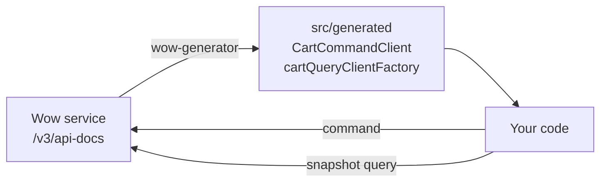

# Quick Start: Call a Wow Service

This page answers: **how does a TypeScript application call a Wow service, from nothing to a command sent and its state read back?**

The path is always the same: the service publishes its OpenAPI document, `wow-generator` turns it into typed clients for each aggregate, and the application calls those clients through a [Fetcher](https://fetcher.ahoo.me/) that it configures once. The steps below use the repository's example service (bounded context `example`, aggregate `cart`); substitute your own service's URL and aggregate names.

<!-- typecheck-generated: typescript/integration-test/src/generated -->



::: tip Not on npm yet
The Wow TypeScript packages are released with Wow **9.2.0**. Until that release, the install commands below fail with `E404`; see [Compatibility and Versions](./compatibility.md#release-status).
:::

## 1. Prerequisites

- Node.js **22.12** or later, and TypeScript **6** or later; CI type-checks the packages on TypeScript 6.0 and the latest 7.x, as [Compatibility and Versions](./compatibility.md#runtimes-and-peers) lists, and compiles this page with 6.0.
- A Wow service, **8.11 or later**, whose OpenAPI document you can reach. Wow 8.10 works through a legacy entry; see [Compatibility and Versions](./compatibility.md).
- To follow along with the example service, start it from a clone of the Wow repository as described in its [agent instructions](https://github.com/Ahoo-Wang/Wow/blob/main/AGENTS.md) (`./gradlew :example-server:run`). It listens on `http://localhost:8080`. Snapshot queries need its MongoDB configuration; with the in-memory default, commands work and queries answer `QuerySchemaUnavailable`.

## 2. Install

```bash
pnpm add @ahoo-wang/fetcher @ahoo-wang/fetcher-decorator \
  @ahoo-wang/fetcher-eventstream @ahoo-wang/wow-client
pnpm add -D @ahoo-wang/wow-generator typescript @types/node
```

A minor release of the Wow packages may contain breaking changes, so keep them on one minor: see [version ranges](./compatibility.md#version-ranges) before installing.

The generated clients are decorator classes, so the project that compiles them needs `experimentalDecorators`. A Node project that runs the compiled output directly can use this `tsconfig.json`, with `"type": "module"` in its `package.json`; a bundler project keeps its own settings and adds the one flag:

<!-- typecheck: file=tsconfig.json -->

```json
{
  "compilerOptions": {
    "target": "ES2022",
    "module": "NodeNext",
    "moduleResolution": "NodeNext",
    "experimentalDecorators": true,
    "types": ["node"],
    "strict": true,
    "skipLibCheck": true,
    "rootDir": "src",
    "outDir": "dist"
  },
  "include": ["src/**/*.ts"]
}
```

The samples below read `process`, so the project installs `@types/node` and names it in `types`: since TypeScript 6 a project no longer picks up every `@types/*` package by itself. CI compiles this page's code with exactly this `tsconfig.json` and checks that the install commands above add every package it imports.

## 3. Generate the clients

Point the generator at the running service:

```bash
pnpm exec wow-generator generate -i http://localhost:8080/v3/api-docs \
  -o src/generated -t tsconfig.json
```

It prints one line, such as `Generated 14 files into src/generated`, and writes one directory per bounded context:

| File | What it holds |
|---|---|
| `src/generated/example/boundedContext.ts` | `EXAMPLE_BOUNDED_CONTEXT_ALIAS = 'example'` |
| `src/generated/example/cart/commandClient.ts` | `CartCommandClient`, one method per command (`addCartItem`, `changeQuantity`, …), and `CartStreamCommandClient`, which streams each stage |
| `src/generated/example/cart/queryClient.ts` | `cartQueryClientFactory`, which creates snapshot, event and state clients typed with `CartState` and the cart's field names |
| `src/generated/example/cart/types.ts` | The command bodies, events and `CartState` |
| `src/generated/.wow-generator.json` | The files this run owns; commit it with the output |

For a build that does not depend on a running service, save the document once (`curl -o openapi/example.json http://localhost:8080/v3/api-docs`), commit it, and generate from the file; [Regenerate in CI](./regenerate-in-ci.md) shows how to keep the two in step. Do not edit generated files: the next run overwrites them.

## 4. Create the clients once

<!-- typecheck: file=cart.ts -->

```ts
// src/cart.ts
import { Fetcher } from '@ahoo-wang/fetcher';
import {
  CartCommandClient,
  cartQueryClientFactory,
} from './generated/index.js';

// One Fetcher per Wow service: its base URL, and later its interceptors.
const exampleService = new Fetcher({
  baseURL: process.env.EXAMPLE_SERVICE_URL ?? 'http://localhost:8080',
});

export function cartClients(ownerId: string) {
  // Cart routes are owner-scoped (`owner/{ownerId}/cart/...`); this fills
  // `{ownerId}` in every path. With CoSec, the token's subject fills it.
  const service = {
    fetcher: exampleService,
    urlParams: { path: { ownerId } },
  };
  return {
    // Called directly rather than through a gateway that routes by bounded
    // context, so clear the `example` prefix the generated clients add.
    commands: new CartCommandClient({ ...service, basePath: '' }),
    snapshots: cartQueryClientFactory.createSnapshotQueryClient({
      ...service,
      contextAlias: '',
    }),
  };
}
```

Three settings decide where a request goes:

- **`fetcher`**: which service. Without it, the clients use Fetcher's default instance, which has no base URL. Passing a `fetcher` keeps every other default of the generated client.
- **The bounded-context prefix**: generated clients start every path with the context alias (`/example/owner/…`), which is how a gateway routes to the service. When the application calls the service itself, clear it with `basePath: ''` for command clients and `contextAlias: ''` for query clients.
- **`{tenantId}` and `{ownerId}`**: path variables of tenant- or owner-scoped aggregates. Give them through `urlParams.path`, as here, or let CoSec fill them from the signed-in user; see [Authentication and Interceptors](./authentication.md).

## 5. Send a command and read its state

```ts
// src/main.ts
import {
  CommandStage,
  commandHeaders,
  filter,
  pagedQuery,
  toWowError,
  waitStrategy,
} from '@ahoo-wang/wow-client';
import { cartClients } from './cart.js';

const ownerId = process.argv[2] ?? crypto.randomUUID();
const { commands, snapshots } = cartClients(ownerId);

try {
  // 1. Send a command and wait until its snapshot is written.
  const result = await commands.addCartItem({
    headers: {
      ...commandHeaders({ requestId: crypto.randomUUID() }),
      ...waitStrategy({ stage: CommandStage.SNAPSHOT, timeoutMs: 10_000 }),
    },
    body: { productId: 'book-1', quantity: 2 },
  });
  console.log(`${result.stage}: cart ${result.aggregateId} v${result.aggregateVersion}`);

  // 2. Read the state it produced.
  const cart = await snapshots.getStateById(result.aggregateId);
  console.log('items:', cart.items);

  // 3. Query snapshots with a filter.
  const page = await snapshots.pagedState(
    pagedQuery({
      filter: filter.elementMatch('state.items', filter.eq('productId', 'book-1')),
      pagination: { index: 1, size: 10 },
    }),
  );
  console.log(`carts holding book-1: ${page.total}`);
} catch (error) {
  // A refused command or query arrives as an exception.
  const wowError = await toWowError(error);
  if (!wowError) throw error;
  console.error(`${wowError.errorCode}: ${wowError.errorMsg}`);
  process.exitCode = 1;
}
```

Compile and run it:

```bash
pnpm exec tsc -p tsconfig.json
node dist/main.js
```

```text
SNAPSHOT: cart 0177e706-99ef-4f45-9e63-68ec369f35ee v1
items: [ { productId: 'book-1', quantity: 2 } ]
carts holding book-1: 1
```

What each step relies on:

- `waitStrategy({ stage: CommandStage.SNAPSHOT })` makes the server answer once the snapshot is written, so the query that follows sees it. Without a wait stage the command resolves when it has been processed. See [completion semantics](../command/completion.md).
- The request id makes a retry safe: send the same `requestId` again when the outcome of a request is unknown, and the server refuses the duplicate instead of applying it twice.
- `getStateById` returns the aggregate's state; `pagedState` returns `{ total, list }` of states, and `pagedQuery` always sends a page size. A list query is different: `listQuery()` sends a `limit` only when you give one. Wow 9.1.5 and later then apply their default list size, while Wow 8.11 to 9.1.3 reject the query with HTTP 400 (`IllegalArgument`), so pass `limit` explicitly against those servers. Filter fields address the stored snapshot, hence `state.items`; a field inside an array is matched through `filter.elementMatch`. The field names are typed from the generated `CartAggregatedFields`, so a misspelt field does not compile.
- A command the server refuses — validation, a failed command handler, a version conflict — rejects with the fetcher's error, and `toWowError` reads Wow's `errorCode`, `errorMsg` and `bindingErrors` from it. Sending `{ productId: '', quantity: 0 }` prints `CommandValidation: …`. [Error Handling](./error-handling.md) covers every case.

## Next steps

| Next | Read |
|---|---|
| Sign requests and fill tenant and owner from the user | [Authentication and Interceptors](./authentication.md) |
| Handle every failure the client can see | [Error Handling](./error-handling.md) |
| Show the query in React | [wow-react query hooks](../../reference/typescript/wow-react/) |
| Keep generated code in step with the service | [Regenerate in CI](./regenerate-in-ci.md) |
| Run on a server or in Next.js | [SSR and Node.js](./ssr-and-node.md) |
| Something does not work | [Troubleshooting](./troubleshooting.md) |

The generated code and its options are described in the [wow-generator reference](../../reference/typescript/wow-generator/) and in [Wow aggregate discovery](../../reference/typescript/wow-generator/wow-discovery.md). To generate a client from an OpenAPI document that does not come from Wow, see [Generate a Client from Any OpenAPI Document](./generated-client.md).
