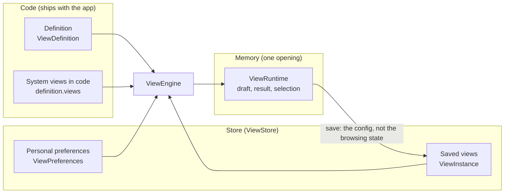

# View Engine Core Concepts

This page answers: **what are the few things the view engine is made of, where does each live, and who may change it?** Read it before the code in [Writing a Definition](./view-engine-definitions.md) and [Getting Started](./view-engine-getting-started.md), and every line there has a place in the model.

The engine rests on three facts: **definitions are code, configs are data, runtime state is transient** ([View Engine](./view-engine.md#three-facts)). Each concept below sits in one of those three.



## At a glance

| Type | Role | Lives in |
|---|---|---|
| `ViewDefinition` | How a dataset **can** be looked at: fields, kinds, operators, and the record and analysis capabilities. Written from the query descriptor with `defineView`, or by hand; never edited at run time | Code |
| `ViewConfig` | **How** one look looks: a `RecordViewConfig`, `AnalysisViewConfig` or `DashboardViewConfig`. It stores intent ("last 7 days"), never compiled values, and never a component name | Data |
| `ViewInstance` | A saved `ViewConfig` plus an id, a title, a scope (`system`, `shared` or `personal`) and an opaque `revision`; a system view the store keeps also carries `stored: true` | Store |
| `ViewPreferences` | One user's habits on one definition: the order of the views, the default view, an analysis's "run on change", the tab a dashboard was last read on | Store |
| `ViewRuntime` | One open view: draft, applied config, result, status and selection, exposed through `subscribe` and `getSnapshot` | Memory |
| `ViewEngine` | Registry of the definitions, the store and the open runtimes; the one entry point for open, save and list commands, shared by the default UI and a UI you compose | Memory |
| `ViewStore` | The persistence port: `WowViewStore` from `@ahoo-wang/wow-view-store` on a Wow server, a backend's own implementation elsewhere | Application |
| `FieldKind` | Operators, validation, compilation to `FilterExpression` and the editor descriptor of one field type | Registry |

## Definitions

A definition says how a dataset **can** be looked at: which fields are listed, what each is called, how it filters, sorts and aggregates, and the system views that ship with it. It is code, so:

- **There is no definition service and no definition version.** Changing a definition is a deployment. A saved view is checked against the current definition when it opens: one that names a field that is gone opens as needing repair, at the place it names, rather than as a blank page.
- **Facts come from the query descriptor; choices are the definition's.** The service publishes a query descriptor per aggregate: which paths there are, what each holds, the values of each enum. `defineView(descriptor, spec)` takes those facts from a descriptor snapshot committed beside the definition, and `spec` holds only the choices. Capabilities such as operators, sorting and aggregation change with the store, so the definition does not freeze them; at run time they are narrowed to what the source's live descriptor grants. How to write one: [Writing a Definition](./view-engine-definitions.md).
- **Two kinds of definition.** A data definition (`kind: 'data'`) is paired with a source (`source`) and holds the dataset's record and analysis views; a dashboard definition (`kind: 'dashboard'`) has no source and is only the catalogue its dashboards belong to, their panels pointing at views of other definitions.

## Views: record and analysis

A view is one way of looking at a data definition; saved, it is a `ViewInstance`. One data definition holds both kinds, told apart in the sidebar by their icons:

| Kind | Answers | Its config holds |
|---|---|---|
| Record view (`record`) | "Which records, in what order": a list that pages | Conditions, sort, page size, footer summaries, columns (order, width, pinned, hidden), the card layout |
| Analysis view (`analysis`) | "Grouped by what, measuring what": a table or chart of an aggregation | Conditions, dimensions (`groups`), metrics (`metrics`), "keep only" (`having`), sort, top N groups, a table and a chart setting each |

Both share one condition tree (`FilterTree`) and send only Wow queries: a record view a paged or cursor query, an analysis view an aggregation query. A record view looks roughly like this (`kind`, `filter`, `refresh` and the like are members of both kinds):

```ts
import type { RecordViewConfig } from '@ahoo-wang/wow-view-engine';

export const PAID_THIS_WEEK: RecordViewConfig = {
  kind: 'record',
  filter: {
    op: 'and',
    children: [
      { field: 'state.status', operator: 'IN', value: ['PAID'] },
      // The intent "this week" is stored, resolved against the calendar on
      // every run.
      {
        field: 'firstEventTime',
        operator: 'BETWEEN',
        value: { type: 'preset', preset: 'thisWeek' },
      },
    ],
  },
  filterMode: 'simple',
  refresh: { interval: null },
  sort: [{ field: 'firstEventTime', direction: 'DESC' }],
  pageSize: 20,
  summaries: [{ field: 'state.totalAmount', fn: 'SUM' }],
  // The table and the card settings are both kept; switching the layout
  // changes this one member.
  layout: 'table',
  table: {
    columns: [
      { field: 'aggregateId' },
      { field: 'state.totalAmount' },
      { field: 'firstEventTime' },
    ],
  },
  card: { title: 'aggregateId', fields: ['state.totalAmount'] },
};
```

The config is an **intent model**, and that settles a few things:

- **The config is saved, not the browsing state.** Selection, page, cursor and results are never saved; reopening restores the config and runs it from the first page.
- **Intent is not compiled before it is stored.** "Last 7 days" is stored as `{ type: 'relative', amount: 7, unit: 'day' }`, not as two instants, so a saved view never goes stale.
- **The config is plain JSON and names no component.** The editor is derived from the field kind, the operator and the value's shape, so renaming or rewriting a UI component touches no saved view.
- **A config comes from a store, so it is not trusted.** It is checked against its definition on every open; members a newer engine wrote and an older one does not know ride through open, edit and save untouched, and a value it does not know is an error rather than a guess.

## Dashboards

A dashboard (a board) puts several views on one page and holds them to a common set of filters. It is a view too, its config a `DashboardViewConfig`, stored under a dashboard definition:

- **Panels** sit on a 24-column grid and may be split into tabs. A data panel shows a saved view (`instanceId`) or an analysis **the board owns** (`owned`, living only in that board); a content panel is a heading, Markdown text, an image or links.
- **The board's filters** are declared by its config, because they cross definitions: date, text, ID, number, boolean and search, each wired to fields of its kind on the panels. A date filter reaches each panel through its definition's `timeField`; a panel declares `ignoresTime` to stay out of it. A board also has a **fixed scope** (`fixed`) its readers cannot change.
- **References are scoped.** A shared dashboard references only shared or system views, or other readers would see a blank panel; a system dashboard references only system views (next section).
- **Embedding**: `/ui`'s `EmbeddedView` and `EmbeddedDashboard` put a saved view or dashboard on a business page, without the workbench.

## System, shared and personal views

Every saved view has a scope (`ViewScope`), answering who configures it, who sees it and who may change it:

| Scope | Configured by | Seen by | What an ordinary user may do |
|---|---|---|---|
| `system` | Developers or operators: a definition's baseline and common views | Every user of the definition | Open it, make it the default, reorder it, save it as their own; not rename, overwrite or delete it |
| `shared` | Business users with the permission to share | Every user of the definition | Overwrite, rename or delete as their permissions say; always save as |
| `personal` | Any user | Its owner only | Everything |

The three values are the legal combinations of two questions: who a view is **for** (its audience: personal or shared) and whether a **user configured** it. A system view is always shared; a personal system view cannot be written down. The model derives the two answers: `audienceOf(scope)` gives the audience (`system` answers `shared`), `isSystemScope(scope)` the origin. A user only ever creates for an audience (`ViewAudience`), and the sidebar groups by audience too: "My views" first, then "Shared views", the system views among the shared ones with a lock at the end of the row.

A view moves between shared and personal **in place** ("Make shared", "Make personal", `ViewStore.changeAudience`): its id stays, so a dashboard showing it keeps showing it. A view a shared dashboard shows cannot be made personal. A system view never changes audience.

### Where system views come from

| Source | Where | Who may change it |
|---|---|---|
| Code | The definition's `views`. The instance id is `system:<definition id>:<view id>` (`systemInstanceId`), the `revision` is always `'code'`, and opening it never reaches the store | Nobody: changing it is a release |
| Configured | The view store server's `wow.view-store.system-views` (or the host's own `SystemViewProvider`), read once at startup | Nobody: read-only, a change needs a restart |
| Stored | Views under the tenant `(platform)` and the owner `(system)` in the view store; their summaries and instances carry `stored: true` | Users the host grants `editSystem`, with no release and no restart |

The three are merged in one list, the ones in code first. **Stored system views are global**: they live under the reserved tenant `(platform)` alone, and every tenant reads them, while a shared view belongs to one tenant. That is why a system dashboard references only system views — a system board pointing at one tenant's shared view would be blank in every other tenant. Publishing, saving as system or saving a system dashboard refuses such a board and names its panels (`dashboard.system.non-system-panels`).

**Who may edit a stored system view** is decided in two places:

- **The buttons follow the host's permissions.** A user whose `ViewPermissions.editSystem` is `true` saves, renames and deletes stored system views as they would a shared view (the `instance(id)` answer still applies). **Its silence means `false`**, unlike every other permission, where silence allows: a system view reaches every user, so only a host that says so opens it. A system view in code or in the server's configuration stays read-only even with `editSystem`.
- **The writes are authorized by the gateway.** The view store server has no setting for it: every write to a system view lands on one literal path, `…/tenant/(platform)/owner/(system)/…`, which the CoSec gateway keeps to administrators. The permissions in the front end only enable buttons; they are not authorization (the rules are in the [wow-view-store reference](../../reference/typescript/wow-view-store/)).

<!-- typecheck-context
declare const isViewAdmin: boolean;
-->

```ts
import { Fetcher } from '@ahoo-wang/fetcher';
import type { ViewPermissions } from '@ahoo-wang/wow-view-engine';
import { WowViewStore } from '@ahoo-wang/wow-view-store';

/** The host answers by the roles it holds at the gateway; this only enables buttons. */
function permissions(): ViewPermissions {
  return {
    createPersonal: true,
    createShared: true,
    reorder: true,
    setDefault: true,
    // Left out, it is false: only the system views' administrators see
    // editing and publishing.
    editSystem: isViewAdmin,
    instance: () => ({ save: true, rename: true, delete: true }),
  };
}

export const store = new WowViewStore({
  fetcher: new Fetcher({ baseURL: '/api' }),
  permissions,
});
```

**Publishing is a copy.** A user with `editSystem` gets one more cell on the view manager's personal and shared rows, "Publish as system view" (`engine.publishAsSystem(id)`): it creates a stored system view from the source view's title and **saved** config, and leaves the source alone; "unpublishing" is deleting that copy. The save-as dialog gains an "Everyone (system view)" audience as well. A view that is already a system view cannot be published again; when the gateway refuses, the screen says that the user has no permission to publish system views and should ask an administrator (`view.publish.forbidden`), not that a write failed.

## Revisions and conflicts

Several people and several tabs changing one view at once is ordinary. The engine takes no locks; two rules keep things consistent:

- **Optimistic revision.** Every saved view carries an opaque `revision`, only ever compared for equality. Every write carries the `revision` it expects; when the store's has moved on, the write is refused as `CONFLICT`, and the `ViewStoreError` carries what the store holds now.
- **Idempotent `requestId`.** Each logical write has one `requestId` in its `WriteContext`; a retry after a timeout reuses it with the same body, the server deduplicates, and a retry never creates a second view.

A write ends one of four ways, and the draft survives every one of them:

| Outcome | The screen offers |
|---|---|
| Success | Nothing; other runtimes that have the same view open move their baseline, their drafts untouched |
| Conflict (`CONFLICT`) | **Reload**: a save conflict drops the draft for theirs; **Overwrite**: replay this intent at their revision; **Save as**: keep the draft as a new view |
| Refused (`FORBIDDEN`, `INVALID`, `NOT_FOUND`) | The reason; after a change, save again as a new write, or dismiss it |
| Unknown (timeout, disconnect, `UNAVAILABLE`) | **Retry**: send again with the same `requestId`; **Give up**: drop the write, keep the draft |

An unknown outcome is neither a failure nor a success: until it is settled, the same target takes no new write, or a first save nobody confirmed, clicked again, would make two views. A runtime has at most one write in flight. Closing a view with an unsaved draft or an unknown write asks first; navigating away never cancels a write in flight.

Preferences carry a `revision` too. When a preference write conflicts, the engine reads the preferences back, keeps this intent and asks the user to confirm it again, rather than quietly retrying with the newest revision.

## The store

`ViewStore` is the one port a backend satisfies: eight methods (list, get, create, save, rename and delete views; read and write preferences), plus an optional `changeAudience` and a synchronous `permissions`. The signatures and rules are in the [wow-view-engine reference](../../reference/typescript/wow-view-engine/#persistence).

- **Only two things are stored.** Saved views (`ViewInstance`) and each user's preferences on each definition (`ViewPreferences`). Definitions are not stored, nor is runtime state.
- **The list order is part of the port.** System views, shared views, personal views, each in order of creation; without preferences the first one opens, so a different store still opens the same default view.
- **So are the limits.** A title is non-blank after trimming and at most 120 characters, and a config's JSON at most 240 KB; the engine refuses one past them before it is sent.
- **Permissions only enable buttons.** `permissions` is fetched by the application beforehand and answers synchronously; authorization, visibility filtering and deduplication are the server's. The list, the preferences and the permissions load separately and none blocks the others: when the store cannot list, the system views in code still open.

| Implementation | Where |
|---|---|
| `MemoryViewStore` | Tests, examples and query-only use; with `localStorageSnapshot(key)` it keeps one browser's views in `localStorage` |
| `WowViewStore` (`@ahoo-wang/wow-view-store`) | A Wow application: views and preferences are two Wow aggregates on the view store server; see the [wow-view-store reference](../../reference/typescript/wow-view-store/) |
| Your own `ViewStore` | A backend that is not Wow: against its own API, mapping its HTTP statuses to `ViewStoreError` codes |

## The full working version

- Storybook's [record workbench](/storybook/?path=/docs/view-engine-组件状态-记录工作台--docs): system views, save as, rename and the view manager, hands-on; [a save conflict](/storybook/?path=/story/view-engine-组件状态-记录工作台--save-conflicted) lays out a real conflict and its three ways out.
- Stored system views: [an administrator edits a stored system view](/storybook/?path=/story/view-engine-组件状态-记录工作台-回归--edit-stored-system-view), [publish as system view](/storybook/?path=/story/view-engine-组件状态-记录工作台-回归--publish-as-system-view), [read-only for everyone else](/storybook/?path=/story/view-engine-组件状态-记录工作台-回归--system-views-read-only-for-others).
- [Dashboards](/storybook/?path=/docs/view-engine-组件状态-仪表盘--docs): panels, filters, tabs and building.
- Source: the port, [`ViewStore.ts`](https://github.com/Ahoo-Wang/Wow/blob/main/typescript/wow-view-engine/src/store/ViewStore.ts); the one reading of the permissions, [`permissions.ts`](https://github.com/Ahoo-Wang/Wow/blob/main/typescript/wow-view-engine/src/runtime/permissions.ts); the view store server's [system views](https://github.com/Ahoo-Wang/Wow/blob/main/view-store/README.md).
- Design documents (in Chinese): [the core model](https://github.com/Ahoo-Wang/Wow/blob/main/typescript/wow-view-engine/docs/design/model.md), [charts, the condition tree and instances](https://github.com/Ahoo-Wang/Wow/blob/main/typescript/wow-view-engine/docs/design/model-shapes.md), [view management and persistence](https://github.com/Ahoo-Wang/Wow/blob/main/typescript/wow-view-engine/docs/design/management.md).

## Next

| Next | Read |
|---|---|
| Write a definition from the descriptor: words, narrowing, system views, boards, a self-check | [Writing a Definition](./view-engine-definitions.md) |
| Wire one business object from zero | [Getting Started with the View Engine](./view-engine-getting-started.md) |
| Entries, the persistence port and the extension points | [wow-view-engine reference](../../reference/typescript/wow-view-engine/) |
