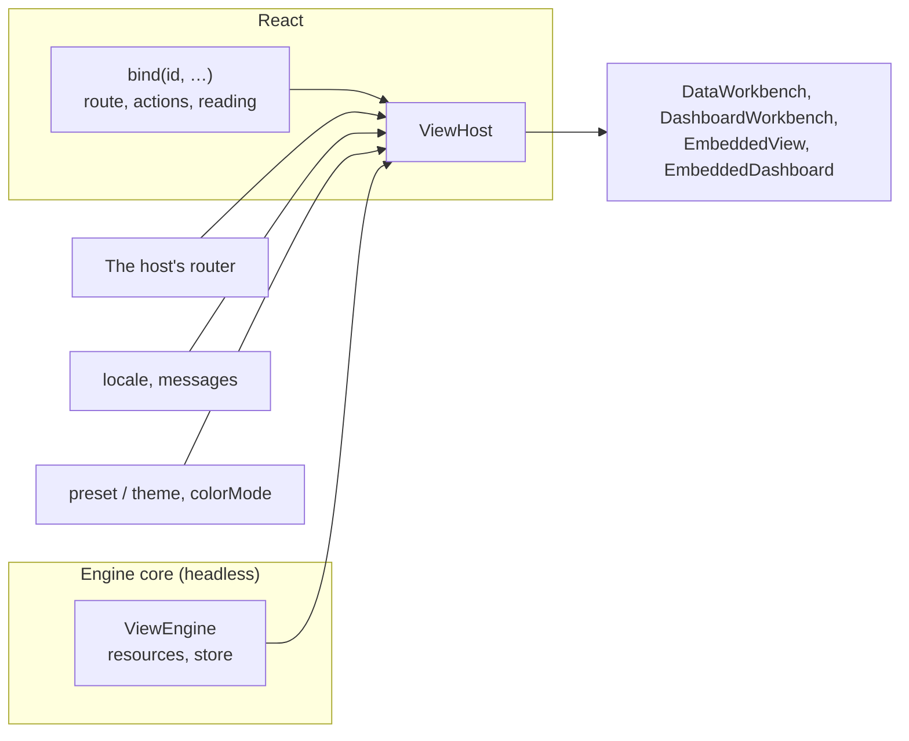

# Fitting the View Engine into a Host

This page answers: **once the definitions are written, what does the host application write around them so the engine does the right thing on every page?**

The [getting started](./view-engine-getting-started.md) wired one business object in from zero. This page takes the wiring behind those steps one piece at a time: why the data is registered on the engine and the behaviour in React, what of the host's each port of `ViewHost` bridges to, which parts of the address the engine keeps for the host, how far an embed goes, and how to test the wiring without a browser.



## One engine, registered in two places

The engine's core is headless: no React, no DOM. So a resource is registered in two places, matched by the definition's id:

| Registered on | What | Why there |
|---|---|---|
| `new ViewEngine({ resources })` | The definition and its source (a board has no source) | Queries, the cache, descriptors and saved views are data and need no screen |
| `ViewHost`'s `bindings` | Where each resource lives in this host, the commands it carries, how a record reads | Routes, commands and readings are behaviour, which belongs on the React side |

<!-- typecheck: file=engine.ts -->
<!-- typecheck-context
import type { DashboardDefinition, DataViewDefinition, ViewSource, ViewStore } from '@ahoo-wang/wow-view-engine';
declare const orders: DataViewDefinition;
declare const overview: DashboardDefinition;
declare function orderSource(): ViewSource;
declare const store: ViewStore;
declare function report(event: unknown): void;
-->

```ts
// src/views/engine.ts
import { ViewEngine } from '@ahoo-wang/wow-view-engine';
import { browserRuntimeEnvironment } from '@ahoo-wang/wow-view-engine/react';

export const engine = new ViewEngine({
  store,
  resources: [
    { definition: orders, source: orderSource() },
    // A board queries nothing of its own: its panels read other resources.
    { definition: overview },
  ],
  // A failed query or save is shown where it happens; this is for your monitoring.
  environment: browserRuntimeEnvironment({ onError: report }),
});
```

- **One engine for the application**, built once at its start — never one per page or per language: pages share its query cache, personal preferences and descriptors, and a language change only redraws.
- Two definitions over one model share a source key (the definition's `source`) and one source.
- Leave `limits` alone: the query queue makes room for a board's panels by itself, and the descriptor supplies the server's budgets. Pass a limit only to go lower.
- Give the source's `Fetcher` a timeout (`new Fetcher({ timeout })`). `@ahoo-wang/fetcher` has none by default and the engine times no query, so a server that takes the connection and never answers leaves a view opening for ever and holds the engine's query slots, starving a board's other panels.
- In a development build without `onIssue`, the engine prints admission findings per resource, each with how to fix it. They belong in the definition's `admit` test ([below](#testing)), not in a handler that swallows them.

How to choose the source and the store: [step 6 of the getting started](./view-engine-getting-started.md) and [Where Views Live](./view-engine-storage.md).

## `ViewHost`: the one layer around the pages

`ViewHost` is made of ports, each a bridge to something the host already has. Your router, your i18n and your theme system stay yours; the engine takes none of them over:

| Prop | Port | What it does |
|---|---|---|
| `engine` | data | The application's engine |
| `router` | router | Your router: `useReactRouter()` from `/react-router`, or the two members of `ViewRouter` written over another ([below](#router-port)) |
| `navigate` | router | Every way off in your own hands; it wins over `router` |
| `locale`, `messages` | language | The language values show in, and the wording merged over what is in force ([below](#messages)) |
| `bindings` | commands | One `bind(id, …)` per resource: its route, actions and reading ([below](#bind)) |
| `theme`, `preset`, `brand` | theme | One of two paths: `theme="host"` follows the host's shadcn theme, or a `preset` wears the engine's ([Theming the View Engine](./view-engine-theming.md)) |
| `colorMode`, `rememberColorMode` | theme | Light or dark: `system` by default, the engine writing `<html>`'s `.dark` and `color-scheme` before the first paint and following the system live; `light` / `dark` start pinned; `host` where the host paints its own mode (as next-themes does) and the engine leaves `<html>` alone. The reader changes it through `useColorMode()`'s `{ mode, setMode }`, kept on this machine under the `localStorage` key `rememberColorMode` names |

<!-- typecheck: file=Host.tsx -->
<!-- typecheck-context
import { engine } from './engine';
import { BINDINGS } from './routes';
declare const ORDER_WORDS: Record<'zh-CN' | 'en', Record<string, string>>;
-->

```tsx
// src/views/Host.tsx
import type { ReactNode } from 'react';
import '@ahoo-wang/wow-view-engine/styles.css';
import '@ahoo-wang/wow-view-engine/themes/porcelain.css';
import { useReactRouter } from '@ahoo-wang/wow-view-engine/react-router';
import { ViewHost, zhCN } from '@ahoo-wang/wow-view-engine/ui';

/** One per language: the engine's own words (English by default), and the definitions' keys. */
const MESSAGES = {
  'zh-CN': { ...zhCN, ...ORDER_WORDS['zh-CN'] },
  en: ORDER_WORDS.en,
};

export function Host({
  locale,
  children,
}: {
  locale: 'zh-CN' | 'en';
  children: ReactNode;
}) {
  return (
    <ViewHost
      engine={engine}
      router={useReactRouter()}
      locale={locale}
      messages={MESSAGES[locale]}
      bindings={BINDINGS}
      preset="porcelain"
      rememberColorMode="my-app.color-mode"
    >
      {children}
    </ViewHost>
  );
}
```

Every surface under `ViewHost` takes only what differs where it stands: `<DataWorkbench definitionId="orders" />`, `<EmbeddedDashboard instanceId="…" />`. A surface's own `engine`, `messages`, `locale`, `onNavigate` or `record` still wins.

Hosts nest: an inner host's `bindings` win over the outer one's by id, and an inner host may name another engine, so a page with two engines is written as easily. Only the outermost host paints `<html>` — the mode, the preset and the brand — and puts it back when it goes.

## `bind`: what each resource does in this host {#bind}

`bind(definitionId, options)` says in one place how a resource behaves in this host. Wherever it shows — a workbench, a record's detail, a board's record panel, an embed, a follow-up's result — it comes along, with nothing to wire again per page:

| Option | What it is |
|---|---|
| `route(instanceId, target?)` | The path of the page that opens this resource. `instanceId` is the view or board to open, `null` a view nobody saved (a follow-up, a board's own analysis), which lands on the page's default |
| `actions` | The commands on its records, declared ([Declared Actions](./view-engine-actions.md)) |
| `reading` | How one record reads in its detail: `title(row)` names it, `sections(context)` adds the host's own regions, `render(context)` replaces the body |
| `slots` | The escape hatch: `row`, `bulk` and `global` draw the host's own markup after the declared actions |

<!-- typecheck: file=routes.ts -->
<!-- typecheck-context
import type { RecordActions } from '@ahoo-wang/wow-view-engine';
declare const orderActions: RecordActions;
-->

```ts
// src/views/routes.ts
import { bind } from '@ahoo-wang/wow-view-engine/ui';

/** A workbench page on `view`, or on its default view (`null`). */
export function withView(path: string, view: string | null): string {
  return view === null ? path : `${path}?${new URLSearchParams({ view })}`;
}

// At module scope: a binding built in render is a new binding every render.
export const BINDINGS = [
  bind('orders', {
    route: view => withView('/orders', view),
    reading: { title: row => `Order ${String(row.key)}` },
    actions: orderActions,
  }),
  bind('overview', { route: board => withView('/boards', board) }),
];
```

Keep the bindings stable: at module scope, or under a `useMemo` over what they close over (the Storybook walk-through passes its command client in that way). A resource with no `route` is not a place: it is left out of the navigation, and a way to it goes nowhere.

## The router port {#router-port}

With a router port, the engine keeps the address and the host syncs nothing:

- **The open view is `?view=`.** A workbench (`DataWorkbench`, `DashboardWorkbench`) given no `instanceId` / `onInstanceChange` opens the address's `?view=` and writes the reader's pick back, a new history entry per view. It **reads only its own definition's views**: two workbenches on one page share one `?view=`, each leaves the other's view alone, and neither writes its own default over the other's.
- **The open record is `?id=`.** A bound resource's record detail follows the address's `?id=` (replacing the current entry, adding none), unless its `reading` holds `open` itself.
- **What is handed over, a board's filters and its tab are the history entry's state.** **Open in the workbench** on a board, a follow-up, a panel's destination: each goes to the route of the resource it leads to, with a `ViewRouteState` — the view handed over (`handOver`), a board's `filters` and `tab`. Several boards on one page each keep their own, and each finds it again after a reload.
- **Elsewhere.** A host path (starting with `/`) goes through the router too; another site opens in a new window.

The parameter names are fixed, `view` and `id`: `route` is the host's function, the engine cannot read back the path it builds, so the two names are the agreement between them. Pass `instanceId` and `onInstanceChange` only where the host keeps the open view somewhere else (a page decided by another parameter of a link as well), the way a controlled `<input>` takes its value.

### React Router

`useReactRouter()` from the `/react-router` entry makes React Router the router port. Call it inside React Router's router component (the getting started uses `BrowserRouter`). React Router is an optional peer (`^7.0.0 || ^8.0.0`) that only this entry imports, so a host that does not use it does not install it.

### A router of your own

Over any other router, write the two members of `ViewRouter`: `location` (`pathname`, `search`, `state`) and `go(path, { state, replace })`. **The contract is the object's identity**: a new `ViewRouter` object when the location moves, the same one while it does not. Everything that reads the address — the open view, the open record, a board's filters and tab — reads it again when, and only when, the object is new: an object changed in place is never seen to move, and one built anew every render is read again every render. `go` is read when it is called, so it may be a new function each time.

Below is the in-memory router of the Storybook walk-through, which keeps the address in memory (the example runs inside Storybook's frame). Over your router library, `location` reads where it is and `go` calls its navigate:

<!-- typecheck: file=memoryRouter.ts -->

```ts
// src/views/memoryRouter.ts
import { useMemo, useState } from 'react';
import type { ViewLocation, ViewRouter } from '@ahoo-wang/wow-view-engine/ui';

export function useMemoryRouter(start: string): ViewRouter {
  const [location, setLocation] = useState<ViewLocation>(() => at(start));
  // A new object only when the location moves: what reads the address reads it again then.
  return useMemo(
    () => ({
      location,
      go: (path, options) => setLocation(at(path, options?.state)),
    }),
    [location],
  );
}

function at(path: string, state: unknown = null): ViewLocation {
  const query = path.indexOf('?');
  return query < 0
    ? { pathname: path, search: '', state }
    : { pathname: path.slice(0, query), search: path.slice(query), state };
}
```

### Every way off in your own hands: `navigate`

`navigate(to)` hands the host every way off, ahead of the router port. Where the target resource has a `route`, `to` comes resolved, `{ kind: 'route', path, state, target }`; a URL and a resource with no route come as they are. Write it only where the host's navigation does one thing more (analytics, a leave guard, a hop to another application).

## Navigation: data, not a shell

The engine draws views and the page is the host's, so there is no page-shell component. `useViewNavigation()` gives the host's shell data instead: each resource bound to a `route`, in the order registered, `{ id, kind, title, path, current, views }`; `views` are its system views (a dashboard definition's system boards), each `{ id, title, path, current }`. The titles are said in the words in force and redraw when the language changes; `current` reads the router port's address. Shared views in the store are not among them: reading them is asynchronous, and they belong in the host's own view list.

<!-- typecheck-context
declare function Header(props: { children: React.ReactNode }): React.ReactNode;
-->

```tsx
import { DataWorkbench, useViewNavigation } from '@ahoo-wang/wow-view-engine/ui';

export function OrdersPage() {
  return <DataWorkbench definitionId="orders" />;
}

export function Places() {
  const places = useViewNavigation();
  return (
    <Header>
      <nav aria-label="Application">
        {places.map(place => (
          <a
            key={place.id}
            href={place.path}
            aria-current={place.current ? 'page' : undefined}
          >
            {place.title}
          </a>
        ))}
      </nav>
    </Header>
  );
}
```

Use the host's own link and sidebar components (a shadcn `Sidebar`, a top bar) in place of `<a>`. The host's own chrome wears the engine's theme with `className="fve-tokens"` ([Your own chrome](./view-engine-theming.md#your-own-chrome-fve-tokens)).

**The page's height is the host's, and it must be a definite height.** A workbench always fills its container with its footer at the bottom, so the container needs a `height`, not a `min-height`. Make the shell the viewport's height, the top bar fixed, and the content area the rest; a page taller than the screen (a board, a form) scrolls inside its own container, never the document:

```css
.app { display: flex; flex-direction: column; height: 100svh; overflow: hidden; } /* bar: flex: none; content: flex: 1; min-height: 0 */
```

With only a `min-height`, the workbench falls back to its 36rem floor (`--fve-workbench-min-height`) and the document scrolls on top of the table. A page that already has its own `<main>` passes `landmark="region"` to the workbench, so the page does not have two.

## Embeds: a decided view inside a business page {#embeds}

A business page that shows what somebody already decided — a customer's orders, a warehouse's board — embeds it: the result and nothing else, no view list, no condition editor, no save. There are two entries, split by resource as the workbenches are: `EmbeddedView` for a record or analysis view, `EmbeddedDashboard` for a board.

**An embed never writes**: not a view, not a board, not a preference. What a reader does on it lasts for that viewing. A page whose readers should build boards embeds `DashboardWorkbench` instead.

<!-- typecheck-context
import type { ViewNavigation } from '@ahoo-wang/wow-view-engine';
declare function go(to: ViewNavigation): void;
-->

```tsx
import { systemInstanceId } from '@ahoo-wang/wow-view-engine';
import {
  EmbeddedDashboard,
  EmbeddedView,
} from '@ahoo-wang/wow-view-engine/ui';

export function CustomerPage({ id, name }: { id: string; name: string }) {
  return (
    <>
      {/* This customer's orders to ship: a system view, narrowed to them. */}
      <EmbeddedView
        instanceId={systemInstanceId('orders', 'to-ship')}
        scopeFilter={{
          op: 'and',
          children: [{ field: 'state.customerId', operator: 'IN', value: [id] }],
        }}
        withTitle
      />
      {/* The customer's board: locked to them; the time is the reader's. */}
      <EmbeddedDashboard
        instanceId="customer-board"
        interaction="interactive"
        filterModes={{ customer: 'locked' }}
        pageValues={{ values: { customer: { items: [{ id, label: name }] } } }}
        onNavigate={go}
      />
    </>
  );
}
```

- **How far a reader may go is one explicit tier**, `interaction`, `static` by default: the result alone, headers that do not sort, no pages, nothing that leads anywhere. `interactive` brings sorting, column widths, pages, a board's filters and cross-filtering, the follow-up menu and **Open in the workbench**. Neither tier saves anything.
- **Switches opt in within the tier**, absent rather than greyed when off: `withTitle`, `withSearch`, `withExport`, `detail` (a read-only record detail), `expandable` (fill the screen), `autoRefresh`, `size` (`content` sizes to what it shows, `fill` fills the container) and more. The whole table is in the package README's [Embedding section](https://github.com/Ahoo-Wang/Wow/blob/main/typescript/wow-view-engine/README.md).
- **A board's filters each take one of three modes** (`filterModes`): `adjustable`, the reader's to set, by default; `locked`, shown as what it holds, with a lock and no control; `hidden`, not shown but still narrowing the panels. Locked and hidden values are the page's (`pageValues`) and never travel through the address: otherwise a reader who edits the address changes the customer.
- Every way off an embed goes through `onNavigate(to)`; without it, those ways do not exist. Under a `ViewHost`, a board embed given neither `initialFilters` nor `onFiltersChange` reads and writes the reader's filters in the history entry.
- **Commands on a board's record panels** come from `bind(…, { actions })` on the definition the panel's view is over, on `EmbeddedDashboard` and `DashboardWorkbench` alike; after a command the whole board is read again. `EmbeddedView` draws no declared actions: its row commands are only the host's own `rowActions`.

**Locking is not a security boundary.** The condition a page locks is put together in the browser and sent with the query; it only keeps the reader from changing it on screen. Anyone who edits the page's script or calls the API directly can ask for another customer. Tenancy, ownership and permission must be enforced by the Wow backend — above all on a page outside your organisation.

## Messages and locale {#messages}

The model carries keys and parameters and no copy, so the words belong to the UI layer. The engine's own words are English by default; `zhCN` is the Chinese catalogue, key for key — hand it over whole, or spread it and change what you like:

- `messages` is merged over the wording in force: the engine's own keys and the definitions' keys (`text(key)`) in one table. A Chinese host passes `{ ...zhCN, ...the definitions' words }`; an English host passes only the definitions' words.
- `locale` is the language values show in: an enum by its option's label, times and dates through `Intl.DateTimeFormat`. Times read in the engine's time zone (`environment.timeZone`).
- Changing `locale` and `messages` only redraws what is open: the same runtimes, nothing reopened, no query run again, no draft made dirty.
- **One engine speaks one language at a time.** The definitions' keys are said in the words of the outermost `ViewHost` that names the engine; an inner `ViewHost` in another language rewords only the engine's own keys, not the definitions'.
- Write a rewording of the engine's own keys with `satisfies MessageOverrides`: a key the engine renames then fails your build instead of quietly falling back to the engine's sentence.

```ts
import { zhCN, type MessageOverrides } from '@ahoo-wang/wow-view-engine/ui';

const wording = {
  'label.filter.apply': '确定',
} satisfies MessageOverrides;

export const ENGINE_WORDS = { ...zhCN, ...wording };
```

An unknown key falls back along its dots and then to the key itself, so a missing word shows rather than rendering blank. The message keys are public surface: a patch release renames and removes none.

## Testing with `/testing` {#testing}

The wiring is worth testing, and it needs no browser. `@ahoo-wang/wow-view-engine/testing` is a headless entry with four things for a host's unit tests:

| Function | What it tests |
|---|---|
| `admit(definitions, descriptors, { text })` | Definitions and boards admitted over the committed descriptors, every key worded; `[]` when all of it holds |
| `resolveNavigation(to, bindingOf)` | What a way off resolves to through the bound `route`, by the engine's own resolution |
| `actionHarness(actions, rows, { now })` | The declared actions read by the engine's rules, without a screen ([Declared Actions](./view-engine-actions.md#harness)) |
| `memorySource(documents, options?)` | A `ViewSource` in memory that filters, sorts, pages, projects and aggregates the way a Wow service over MongoDB does, for page tests and demos |

Test the route table with the engine's own resolution:

<!-- typecheck-context
import { BINDINGS } from './routes';
declare function expect(value: unknown): { toMatchObject(expected: unknown): void };
-->

```ts
import { resolveNavigation } from '@ahoo-wang/wow-view-engine/testing';

const bindingOf = (id: string) =>
  BINDINGS.find(binding => binding.definitionId === id);

const toShip = {
  kind: 'view',
  definitionId: 'orders',
  instanceId: 'system:orders:to-ship',
  scopeFilter: null,
  filter: null,
} as const;
expect(resolveNavigation(toShip, bindingOf)).toMatchObject({
  kind: 'route',
  path: '/orders?view=system%3Aorders%3Ato-ship',
  state: { handOver: toShip },
});
```

`memorySource`'s answers are held to the server's own semantics (the `FilterSemantics` matrix of Wow's TCK and the aggregation cases of the query TCK) by this package's suites, so a test sees the answer production gives, not a canned result. It evaluates filters with `mingo`, an optional peer: a host that imports `/testing` adds it to its own dev dependencies (`pnpm add -D mingo`), and no other entry loads it.

<!-- typecheck-context
import type { DataViewDefinition } from '@ahoo-wang/wow-view-engine';
declare const orders: DataViewDefinition;
-->

```ts
import { MemoryViewStore, ViewEngine } from '@ahoo-wang/wow-view-engine';
import { memorySource } from '@ahoo-wang/wow-view-engine/testing';

// Snapshots as the service returns them: the envelope, `state`, epoch-ms times.
const source = memorySource(
  [
    { aggregateId: 'O-1', firstEventTime: 1_790_000_000_000, state: { status: 'PAID' } },
    { aggregateId: 'O-2', firstEventTime: 1_790_000_060_000, state: { status: 'SHIPPED' } },
  ],
  // The clock BEFORE_NOW and AFTER_NOW compare against: pin it.
  { now: () => Date.parse('2026-09-27T00:00:00Z') },
);

export const testEngine = new ViewEngine({
  resources: [{ definition: orders, source }],
  store: new MemoryViewStore(),
});
```

These tests run in Node. Where the host's Vitest is a browser project, give them a configuration with `environment: 'node'`: how, in the `wow-view-host` skill's [actions.md, "Where the tests run"](https://github.com/Ahoo-Wang/Wow/blob/main/skills/wow-view-host/references/actions.md).

## A real host: the compensation console

The compensation console is the view engine's reference host and does every section above; its wiring is three files:

- [`ConsoleHost.tsx`](https://github.com/Ahoo-Wang/Wow/blob/main/compensation/dashboard/src/features/App/ConsoleHost.tsx): one `ViewHost` — the engine, React Router, the language following the console's own i18n, the `porcelain` preset with Wow's blue as the brand, light or dark kept on this machine.
- [`views/routes.ts`](https://github.com/Ahoo-Wang/Wow/blob/main/compensation/dashboard/src/views/routes.ts): a `bind` for each of three resources, one line of route each; the failed executions also carry their reading and declared commands. A test passes its own command client.
- [`views/engine.ts`](https://github.com/Ahoo-Wang/Wow/blob/main/compensation/dashboard/src/views/engine.ts): the resources and their sources.

Beside them, [`routes.test.ts`](https://github.com/Ahoo-Wang/Wow/blob/main/compensation/dashboard/src/views/routes.test.ts) and [`admit.test.ts`](https://github.com/Ahoo-Wang/Wow/blob/main/compensation/dashboard/src/views/admit.test.ts) are the previous section's two kinds of test as a real host writes them.

## The full working version

- Storybook's [integration walk-through](/storybook/?path=/docs/view-engine-接入导览--docs): `ViewHost`, `bind`, an in-memory router, and navigation drawn from `useViewNavigation`, running at the bottom of the page. The source: [`OrdersHost.tsx`](https://github.com/Ahoo-Wang/Wow/blob/main/typescript/storybook/stories/view-engine/integration/OrdersHost.tsx), [`OrdersPage.tsx`](https://github.com/Ahoo-Wang/Wow/blob/main/typescript/storybook/stories/view-engine/integration/OrdersPage.tsx), [`memoryRouter.ts`](https://github.com/Ahoo-Wang/Wow/blob/main/typescript/storybook/stories/view-engine/integration/memoryRouter.ts), [`ordersEngine.ts`](https://github.com/Ahoo-Wang/Wow/blob/main/typescript/storybook/stories/view-engine/integration/ordersEngine.ts), and [`integration.test.ts`](https://github.com/Ahoo-Wang/Wow/blob/main/typescript/storybook/stories/view-engine/integration/integration.test.ts).
- Embeds: [EmbeddedView](/storybook/?path=/docs/view-engine-组件状态-embeddedview--docs) and [EmbeddedDashboard](/storybook/?path=/docs/view-engine-组件状态-embeddeddashboard--docs), every tier and switch shown one by one. The source: [`EmbeddedView.stories.tsx`](https://github.com/Ahoo-Wang/Wow/blob/main/typescript/storybook/stories/view-engine/EmbeddedView.stories.tsx), [`EmbeddedDashboard.stories.tsx`](https://github.com/Ahoo-Wang/Wow/blob/main/typescript/storybook/stories/view-engine/EmbeddedDashboard.stories.tsx).

## Next

| Next | Read |
|---|---|
| Commands on records: placement, what is asked first, bulk and outcomes | [Declared Actions](./view-engine-actions.md) |
| Wear another look, use a brand colour, follow a shadcn theme | [Theming the View Engine](./view-engine-theming.md) |
| Run under a strict Content Security Policy | [Content Security Policy for the View Engine](./view-engine-csp.md) |
| Where saved views live: in memory, locally, on a Wow server or in a store of your own | [Where Views Live](./view-engine-storage.md) |
