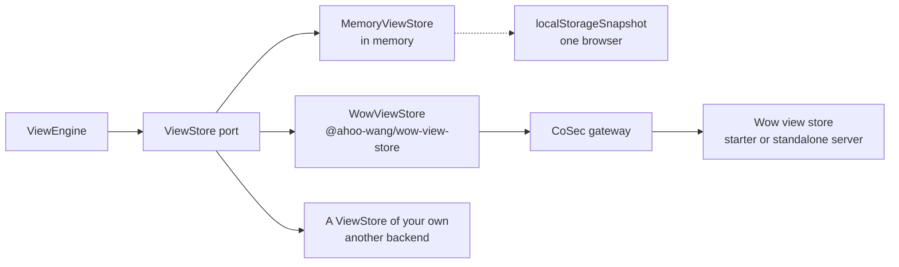

# Where Views Live

This page answers: **where do the views, boards and preferences readers save end up, how does a host choose and wire that, and once it is wired, who decides who may write?**

Definitions, and the system views declared in code, are code: they ship with the front end and never pass through storage. What is stored is what readers make on the page: saved views (`ViewInstance`: the whole config of a record view, an analysis view or a dashboard), and each definition's preferences (the order of the views, the default view, auto-run, the tab last opened). The engine reads and writes them through one port only, `ViewStore`, so changing the storage changes no page.



## Choose by who must see a saved view

| Store | For | Note |
|---|---|---|
| `MemoryViewStore` | Tests, demos, a query-only page | Forgets on reload |
| `new MemoryViewStore({ snapshot: localStorageSnapshot(key) })` | Development, a single-user tool | One browser's views; another tab's write is merged or a `CONFLICT` |
| `WowViewStore` (`@ahoo-wang/wow-view-store`) | Everyone else: personal and shared views kept by a Wow service | The service embeds `wow-view-store-starter`, or the standalone `wow-view-store-server` runs behind the CoSec gateway ([View Store server](../extensions/view-store.md)) |
| Your own `ViewStore` | Views that must live in another backend | Only when the backend is not Wow ([Write a ViewStore of your own](#write-a-viewstore-of-your-own)) |

Whichever you choose, the port keeps two rules, and the engine's conflict handling and retries rest on them (the port's signature is in the [wow-view-engine reference](../../reference/typescript/wow-view-engine/#persistence)):

1. **Optimistic revision.** Every write carries the `revision` it read; a mismatch is refused with `ViewStoreError` (`code: 'CONFLICT'`), carrying what storage holds now. The screen offers reload, overwrite and save as.
2. **Idempotent `requestId`.** One logical write has one `requestId` (`WriteContext`), and a retry after a timeout reuses it; storage answers a repeated `requestId` with the first outcome and does not write twice.

## `MemoryViewStore`

`MemoryViewStore` is the one implementation the view engine ships: a synchronous map behind the port. It keeps the rules honest rather than convenient: a stale `revision` conflicts, a replayed `requestId` answers the first outcome, and the list order (system, shared, personal, each oldest first) and the limits on a title and a config are the server's. Host code that is right on it behaves the same against a real backend.

The constructor takes the initial views and preferences, and `permissions`. Below it is seeded with a **stored** system view (`stored: true`), and only an administrator gets `editSystem`:

<!-- typecheck: file=memoryStore.ts -->
<!-- typecheck-context
import type { RecordViewConfig } from '@ahoo-wang/wow-view-engine';
declare const openOrders: RecordViewConfig;
declare function isAdmin(): boolean;
-->

```ts
import { MemoryViewStore } from '@ahoo-wang/wow-view-engine';

export const memoryStore = new MemoryViewStore({
  instances: [
    {
      id: 'orders-open',
      definitionId: 'orders',
      title: 'To ship',
      scope: 'system',
      // `stored`: a system view the store keeps and can edit; without it,
      // a read-only configured view.
      stored: true,
      revision: '1',
      config: openOrders,
    },
  ],
  permissions: () => ({
    createPersonal: true,
    createShared: true,
    reorder: true,
    setDefault: true,
    // Left out, it is a refusal: system views are read-only by default.
    editSystem: isAdmin(),
    instance: () => ({ save: true, rename: true, delete: true }),
  }),
});
```

- A seeded `scope: 'system'` view without `stored` is a **configured** system view: every write to it is refused as `FORBIDDEN`. One seeded with `stored: true`, or made by `create({ scope: 'system', … })` ("Publish as system view" on the screen), is a **stored** system view: saved, renamed and deleted like a shared view, never moved to another audience.
- Like the server, the store asks no permission of its own; `editSystem` is the host's to grant and the engine's to ask.

## `localStorageSnapshot`: views in the browser, for now

Until a backend keeps the views (development, a single-user tool), `localStorageSnapshot(key)` keeps a `MemoryViewStore` in the browser's `localStorage`, the whole state as one JSON document under `key`. It is one browser's views, not shared ones; to share views with others, they live on a server.

<!-- typecheck: file=devStore.ts -->

```ts
import {
  localStorageSnapshot,
  MemoryViewStore,
} from '@ahoo-wang/wow-view-engine';

export const devStore = new MemoryViewStore({
  snapshot: localStorageSnapshot('my-app:views'),
});
```

- **A write storage refuses fails.** A full quota or blocked storage undoes the write and rejects it with `ViewStoreError` (`UNAVAILABLE`): the environment's `onError` hears a `store` failure, and the screen shows a save that did not land, with a retry.
- **Tabs do not overwrite each other.** The store re-reads the document before every write and checks the write's `revision` against it, instance by instance and per definition's preferences. A write merges into what another tab stored — a board saved in one tab survives a reorder in another — and a write another tab has moved past is a `CONFLICT`, as always. Another tab's change also reloads the store through the `storage` event.
- A missing or unreadable document starts empty rather than breaking the page, and the next write replaces it.

## `WowViewStore`: views on a Wow service

A Wow application keeps its views on Wow's view store: two Wow aggregates (the view and the view preferences), served by a Wow service that embeds `wow-view-store-starter`, or by the standalone `wow-view-store-server`. The front end reaches it with `WowViewStore` from `@ahoo-wang/wow-view-store`; there is no store to write for a Wow backend. How to deploy, configure and secure the server is in [View Store server](../extensions/view-store.md).

### Wire it

`WowViewStore` takes two things: a fetcher, and optionally `permissions`. **It takes no tenant, owner, user or application**: the fetcher's interceptors carry those, as they do for every other Wow request of the host. CoSec's interceptors add the token and `CoSec-App-Id`, and fill the path's `{tenantId}` and `{ownerId}` from the token. "Who is asking" has one source, so the store cannot get it wrong.

<!-- typecheck: file=viewStore.ts -->
<!-- typecheck-context
declare function hasRole(role: string): boolean;
-->

```ts
import { Fetcher } from '@ahoo-wang/fetcher';
import { CoSecConfigurer } from '@ahoo-wang/fetcher-cosec';
import {
  isSystemInstanceId,
  type ViewPermissions,
} from '@ahoo-wang/wow-view-engine';
import { WowViewStore } from '@ahoo-wang/wow-view-store';

// The gateway in front of the view store.
const fetcher = new Fetcher({ baseURL: 'https://api.example.com' });
new CoSecConfigurer({ appId: 'my-app' }).applyTo(fetcher);

/** The same role the gateway checks for writing `owner/(shared)`. */
const SHARED_WRITER = 'view-store:shared-writer';
/** The same role the gateway checks for `tenant/(platform)/owner/(system)`. */
const SYSTEM_VIEW_ADMIN = 'view-store:system-admin';

function permissions(): ViewPermissions {
  const sharedWriter = hasRole(SHARED_WRITER);
  return {
    createPersonal: true,
    createShared: sharedWriter,
    reorder: true,
    setDefault: true,
    // Publish, edit and unpublish stored system views; left out, refused.
    editSystem: hasRole(SYSTEM_VIEW_ADMIN),
    instance: id => {
      // A system view declared in code (`system:`) is always read-only.
      const editable = !isSystemInstanceId(id);
      return {
        save: editable,
        rename: editable,
        delete: editable,
        // Claiming a shared view and sharing a personal one both need it.
        changeAudience: editable && sharedWriter,
      };
    },
  };
}

export const store = new WowViewStore({ fetcher, permissions });
```

Then hand `store` to `new ViewEngine({ store, resources })`, in the place of the `MemoryViewStore` in [Getting Started](./view-engine-getting-started.md#_6-the-engine-and-its-resources).

### The path is the audience

Every route is under `/view-store/tenant/{tenantId}/owner/{ownerId}`, and **the owner segment is the audience**:

| View | Path |
|---|---|
| Personal | The caller's own path, `owner/{ownerId}` (filled from the token by the interceptors) |
| Shared | `owner/(shared)` (`SHARED_OWNER_ID`) |
| Stored system view | `tenant/(platform)/owner/(system)` (`SYSTEM_TENANT_ID`, `SYSTEM_OWNER_ID`), whatever the caller's tenant: they are global |

"Make shared" is `share` on the view's personal path, "Make personal" is `claim` on the caller's own path: the view keeps its id, so a dashboard that shows it keeps showing it. The server isolates by path and the gateway admits by path, so with the audience in the path one gateway rule governs one audience.

### Permissions: buttons only, the gateway decides

`permissions` decides which buttons are enabled, never whether a write succeeds: the server trusts its paths, and the CoSec gateway decides who may use which ([security model](../extensions/view-store.md#security-model)). So a host gives them by **the same role the gateway checks**; otherwise a button is enabled and its write is refused at the gateway, or the other way round.

| Member | Buttons | When left out |
|---|---|---|
| `createPersonal`, `createShared` | Save as a personal view, as a shared view | — (required) |
| `reorder`, `setDefault` | Reorder, set as default | — (required) |
| `instance(id).save`, `rename`, `delete` | Save, rename, delete a view | — (required) |
| `instance(id).changeAudience` | Make shared, make personal; the create permission of the audience it goes to is asked too | allowed |
| `editSystem` | Publish as system view; edit and unpublish stored system views | **refused** |

With no `permissions` at all, everything is allowed but `editSystem`. `editSystem` is the one member whose silence refuses: system views are what every tenant and every reader sees, and a host that has not thought about it should not let everyone change them. It acts on stored system views only: one declared in code (`system:`) or configured on the server stays read-only whatever is granted.

### System views

A definition's list of views merges system views from three sources:

| Source | Where | Who changes it |
|---|---|---|
| Code | The definition's `views`, ids `system:…` | Nobody: shipped with the front end, never sent to the server |
| Configured | The server's `wow.view-store.system-views`, or the host's `SystemViewProvider` | Nobody: a change needs a server restart |
| Stored | View aggregates under `tenant/(platform)/owner/(system)` | Whoever has `editSystem`, through the normal view routes, without a restart |

`WowViewStore` lists and reads stored system views with `stored: true` on the summary and the instance; where the host grants `editSystem`, the lock on the system view says it can be changed. `create({ scope: 'system', … })` publishes one (a copy: the source view stays), `save`, `rename` and `delete` edit and unpublish it; `changeAudience`, and any write to a configured or code system view, is `FORBIDDEN` before anything is sent.

A system view's `revision` is a hash of its content, which the engine uses to tell whether a draft changed, while a write expects the aggregate version. The store remembers the version each read gave, sends that; when it holds a `revision` it has no version for, it reads the view again first, and a `revision` other than the view's is `CONFLICT` with nothing sent.

### A host nobody signs in to

With no token, nothing fills the path's tenant and owner. Such a host adds an interceptor of its own that fills defaults only where the request has none, after CoSec's resource attribution (so a token, if one is ever put in front, still wins), and names its application. With the owner `(shared)` the host has shared views and shared preferences only, so its permissions leave `createPersonal` off and `changeAudience` false:

<!-- typecheck: file=consoleDefaults.ts -->

```ts
import type { FetchExchange, RequestInterceptor } from '@ahoo-wang/fetcher';
import {
  CoSecHeaders,
  RESOURCE_ATTRIBUTION_REQUEST_INTERCEPTOR_ORDER,
} from '@ahoo-wang/fetcher-cosec';
import { SHARED_OWNER_ID } from '@ahoo-wang/wow-view-store';

export class ViewStoreDefaults implements RequestInterceptor {
  readonly name = 'ViewStoreDefaults';
  readonly order = RESOURCE_ATTRIBUTION_REQUEST_INTERCEPTOR_ORDER + 1;

  intercept(exchange: FetchExchange): void {
    const path = exchange.ensureRequestUrlParams().path;
    // Wow's default tenant.
    path.tenantId ??= '(0)';
    path.ownerId ??= SHARED_OWNER_ID;
    exchange.ensureRequestHeaders()[CoSecHeaders.APP_ID] ??= 'my-console';
  }
}
```

The compensation console is such a host: its views live in the view store the compensation service embeds, under the tenant `(0)` and the owner `(shared)` ([`viewStore.ts`](https://github.com/Ahoo-Wang/Wow/blob/main/compensation/dashboard/src/views/viewStore.ts)). Its gateway admits it by network or by a service token, as it admits the rest of that console.

### Writes, retries and creates

- **Writes** send the port's `requestId` as `Command-Request-Id` and the `revision` as `Command-Aggregate-Version`, wait for the snapshot, and answer the view read back.
- **A retry answers the first outcome.** A write refused as a stale version or a repeated request id is looked up by its `requestId` on the replay route first: if the first attempt landed, that is the answer; only when it did not is a stale version `CONFLICT` (carrying the view as it is now), or `NOT_FOUND` when the view is gone.
- **Creating is not idempotent on the server**, which generates the id. The store remembers the request ids of its own last 256 creates and asks the replay route before posting a retry, so a retry from the same store makes no second view; a retry from another tab or after a reload does.
- A list reads at most 1,000 views of each audience (the server's query budget: the oldest 1,000); a view past the cut is still read by its id.

### Errors

Every rejection is the view engine's `ViewStoreError`. The store reads Wow's error code first, and the HTTP status only when no code it knows came back:

| `code` | Typical source | Meaning |
|---|---|---|
| `CONFLICT` | A version conflict (`CommandExpectVersionConflict` and others; without a code, 409 and 412) | Someone wrote first: the error carries the view as it is, and the screen offers reload, overwrite and save as |
| `NOT_FOUND` | `NotFound`, `IllegalAccessDeletedAggregate` (404, 410) | The view was deleted, or belongs to another application (which is not revealed) |
| `FORBIDDEN` | Owner or tenant mismatch, `SystemViewReadOnly` (401, 403) | The path is not the caller's, or the view is read-only |
| `INVALID` | `ViewInvalid`, `ViewAppRequired`, `ViewScopeRequired`, validation (400, 422); a path variable the interceptors never filled (nothing is sent) | The request is wrong as built, and a retry would send it the same |
| `UNAVAILABLE` | A timeout, a 5xx, no answer | The outcome is unknown; a retry with the same `requestId` is safe |
| `UNSUPPORTED` | A server with no view store at all (released before it) | The engine says the server offers no view store, not that the view is gone |

- `detail.code` keeps the server's error code, so a host can tell `ViewAppRequired` from `ViewInvalid`, both `INVALID`; `WowViewStoreErrorCodes` names the view store's own codes.
- An `UNAVAILABLE` the server answered (a 5xx, a timeout it reported, a page that is not JSON) carries `reachable: true`, and the engine says "the server cannot handle it right now" rather than "cannot reach the server".
- When shared dashboards show a view, the server refuses to make it personal, and `boards` carries those boards' titles as stored; the engine says the refusal in its own words.
- The engine handles all of these; do not wrap them.

## Write a ViewStore of your own

**Not for a Wow backend**: `WowViewStore` already handles replays, views that moved audience, system-view versions and error codes, which is where a hand-written store goes wrong. Implement `ViewStore` only when the views must live in another backend:

- Implement `list`, `get`, `create`, `save`, `rename`, `delete`, `getPreferences` and `setPreferences`. `changeAudience` is optional (without it the view manager has no "Make shared" or "Make personal"), and so is `permissions` (without it everything is allowed but `editSystem`).
- Keep the two rules: a stale `revision` throws `CONFLICT` carrying the current instance; a repeated `requestId` answers the first outcome. Preferences never written have the `revision` `'0'` (`emptyPreferences()`).
- Never issue an id starting with `system:`: that namespace belongs to the system views declared in code.
- Authorization, visibility filtering and deduplication are the server's; `permissions` only drives buttons.
- Mapping the backend's failures onto `ViewStoreError` is the store's job; the engine knows these `code`s only:

<!-- typecheck: file=storeErrors.ts -->

```ts
import {
  ViewStoreError,
  type ViewStoreErrorCode,
} from '@ahoo-wang/wow-view-engine';

const BY_STATUS: Record<number, ViewStoreErrorCode> = {
  400: 'INVALID',
  401: 'FORBIDDEN',
  403: 'FORBIDDEN',
  404: 'NOT_FOUND',
  409: 'CONFLICT',
  410: 'NOT_FOUND',
  412: 'CONFLICT',
  422: 'INVALID',
};

/** One failed answer of the backend, as an error the engine reads. */
export function storeError(status: number, message: string): ViewStoreError {
  const code = BY_STATUS[status] ?? 'UNAVAILABLE';
  // The server answered but could not handle it: the engine says "cannot
  // handle it right now" rather than "cannot reach the server".
  return new ViewStoreError(
    code,
    message,
    code === 'UNAVAILABLE' ? { reachable: true } : undefined,
  );
}
```

A `CONFLICT` carries the instance storage holds now (`instance` in the third argument, or `preferences`), so that the screen can offer overwrite and save as.

### Run the conformance suite

The port has a conformance suite, which both `MemoryViewStore` and `WowViewStore` run: lists and reads, who sees what, the writes, stale revisions, system views, replays, preferences, audience changes. It is a test file in the view engine's repository, [`viewStoreConformance.ts`](https://github.com/Ahoo-Wang/Wow/blob/main/typescript/wow-view-engine/test/conformance/viewStoreConformance.ts), and **is not published to npm** (a published entry must not carry a test framework). To use it:

1. Copy the file from the tag of the version you depend on into your tests. It needs `vitest`; the names it imports from the engine's source (`isViewStoreError`, `MAX_VIEW_TITLE_LENGTH`, `MAX_VIEW_CONFIG_BYTES` and some types) are all public exports of `@ahoo-wang/wow-view-engine`'s root entry, so point those relative imports at the package.
2. Call `describeViewStoreConformance` and declare what your store can do; the cases a capability you do not declare would need are skipped by name, not faked.
3. `connect` opens one backend for a test and answers a factory that opens a store per owner: one owner opened twice is two tabs of one user, two owners are two users. Every case works in a definition of its own, so a shared backend needs no reset.

<!-- typecheck: skip — imports the test file copied from the repository and your own store -->

```ts
import { describeViewStoreConformance } from './viewStoreConformance';
import { MyViewStore, openTestBackend } from '../src/myViewStore';

describeViewStoreConformance({
  name: 'MyViewStore',
  capabilities: {
    owners: true, // two owners are two users
    personalViews: true,
    changeAudience: true, // implements the optional changeAudience
    idempotentCreate: true, // a replayed create answers the first view
    systemViews: { definitionId: 'conformance-system' }, // the backend serves at least one read-only system view for it
    storedSystemViews: true, // create({ scope: 'system' }) keeps an editable system view
  },
  connect: async () => {
    const backend = await openTestBackend();
    return ({ owner }) => new MyViewStore({ backend, owner });
  },
});
```

How the repository runs the same cases over `WowViewStore` is [`wowViewStore.conformance.test.ts`](https://github.com/Ahoo-Wang/Wow/blob/main/typescript/integration-test/test/view-store/wowViewStore.conformance.test.ts); over `MemoryViewStore` and `localStorageSnapshot`, [`viewStoreConformance.test.ts`](https://github.com/Ahoo-Wang/Wow/blob/main/typescript/wow-view-engine/test/viewStoreConformance.test.ts).

## The full working version

- In Storybook, an administrator [edits](/storybook/?path=/story/view-engine-组件状态-记录工作台-回归--edit-stored-system-view) and [publishes](/storybook/?path=/story/view-engine-组件状态-记录工作台-回归--publish-as-system-view) a stored system view, which is [read-only for everyone else](/storybook/?path=/story/view-engine-组件状态-记录工作台-回归--system-views-read-only-for-others); in [managing views](/storybook/?path=/story/view-engine-组件状态-记录工作台--manage-views) every button shows only where the store permits it. They all run on `MemoryViewStore`.
- Their store: `systemViewsStore` in [`fixtures.ts`](https://github.com/Ahoo-Wang/Wow/blob/main/typescript/storybook/stories/view-engine/fixtures.ts).
- The implementations: [`MemoryViewStore.ts`](https://github.com/Ahoo-Wang/Wow/blob/main/typescript/wow-view-engine/src/store/MemoryViewStore.ts), [`wowViewStore.ts`](https://github.com/Ahoo-Wang/Wow/blob/main/typescript/wow-view-store/src/wowViewStore.ts).
- A real host: the compensation console's [`viewStore.ts`](https://github.com/Ahoo-Wang/Wow/blob/main/compensation/dashboard/src/views/viewStore.ts).

## Next steps

| Next | Read |
|---|---|
| Deploy, configure and secure the view store server | [View Store server](../extensions/view-store.md) |
| `WowViewStore`'s exports and contract | [wow-view-store reference](../../reference/typescript/wow-view-store/) |
| The `ViewStore` port's signature | [wow-view-engine reference](../../reference/typescript/wow-view-engine/#persistence) |
