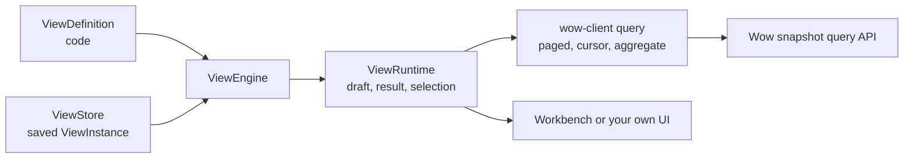

# View Engine

::: warning Not released
`@ahoo-wang/wow-view-engine` has not been published to npm. It is in active development with no compatibility promise: any export may still change shape, and no change carries a compatibility layer. This page describes the target usage so you can evaluate it; do not depend on it in production yet.
:::

The view engine is a data view engine for Wow-based business applications. The application declares in code _how a dataset can be observed_: fields, kinds, operators, available groupings, and metrics. Users decide in the UI _how to observe it this time_: filters, columns, sorting, groupings, charts, and panel composition. The engine compiles that choice into Wow queries, runs them through `@ahoo-wang/wow-client`, renders the result, and saves the views worth keeping so they reopen with one click.

It succeeds `@ahoo-wang/fetcher-viewer`, which stays on Fetcher 5.x and is not documented here.

## The problem it solves

Most pages in a business system are the same page: a list with filters, sorting, and paging, sometimes with a chart. Each business object gets its own copy, and each request such as "add one more filter" or "group this by warehouse" becomes a code change and a release. The data did not change; only the way of observing it did.

| For | What they get |
|---|---|
| Business users | Adjust scope, organization, and presentation within the declared capabilities, save the views that matter, and reopen them with one click |
| Developers | One definition and one query client per business object instead of one page per list, analysis, and overview; filtering, paging, saving, and conflict handling are implemented once |
| The product | Presentation changes within the supported range become configuration; adding a business object adds a definition, never a branch inside the engine |

It is not a database, a permission system, a general low-code page builder, or a BI modeling tool. Data, aggregation capabilities, and authorization come from the Wow services.

## Three facts

The design fixes three facts and derives the rest from them:

| Fact | Consequence |
|---|---|
| Definitions are code | No definition service or definition versions. A definition change is a deploy; saved views are validated when opened |
| Configs are data | Only `ViewInstance` and personal preferences persist. Consistency is an optimistic revision plus an idempotent `requestId` |
| Runtime state is transient | Drafts, results, paging, and selection live in one open `ViewRuntime` and are never persisted |



## Views

| View | What the user does |
|---|---|
| Record | Filter status = pending, sort by creation time, keep only the needed columns, save as "Pending today" |
| Analysis | Group by warehouse, count orders and sum amounts, switch to a bar chart |
| Dashboard | Place several views on one page and constrain them with a global time range |
| Embedded view or dashboard | Show a saved view inside a business page, for example a customer's orders, without the workbench |
| System views | Declare "All", "Pending", and "New this week" in the definition so users open a usable view at once |

## Target usage

The package is not installable yet. Once published, installation will be:

```sh
pnpm add @ahoo-wang/wow-view-engine @ahoo-wang/wow-client
```

`react` and `react-dom` are needed only for the `/react` and `/ui` entries; the root entry runs in Node.

### 1. Declare a definition

```ts
import type { ViewDefinition } from '@ahoo-wang/wow-view-engine';

export const orders: ViewDefinition = {
  id: 'orders',
  title: 'Orders',
  kind: 'data',
  source: 'orders',
  fields: [
    { name: 'id', label: 'Order', kind: 'string', sortable: true },
    {
      name: 'status',
      label: 'Status',
      kind: 'enum',
      options: [
        { value: 'PENDING', label: 'Pending' },
        { value: 'SHIPPED', label: 'Shipped' },
      ],
    },
    { name: 'warehouse', label: 'Warehouse', kind: 'string' },
    { name: 'amount', label: 'Amount', kind: 'number', summary: ['SUM', 'AVG'] },
    { name: 'createdAt', label: 'Created', kind: 'datetime', sortable: true },
  ],
  // The row key must be sortable: every record query ends its sort on it.
  record: { rowKey: 'id', paging: 'paged', layouts: ['table', 'card'] },
};
```

### 2. Create an engine

```ts
import { MemoryViewStore, ViewEngine } from '@ahoo-wang/wow-view-engine';

const engine = new ViewEngine({
  definitions: [orders],
  store: new MemoryViewStore(),
  // Pick<QueryApi, 'paged' | 'cursor' | 'aggregate'> from @ahoo-wang/wow-client
  resolveSource: key => queryClients[key],
});
```

`MemoryViewStore` suits tests and examples. A business application implements the `ViewStore` port against its own backend; see the [reference](../../reference/typescript/wow-view-engine/#persistence).

### 3. Render the workbench, or compose your own UI

```tsx
import '@ahoo-wang/wow-view-engine/styles.css';
import { DataWorkbench } from '@ahoo-wang/wow-view-engine/ui';

export function OrdersPage() {
  return <DataWorkbench engine={engine} definitionId="orders" />;
}
```

A custom layout uses the headless hooks of the `/react` entry, such as `useOpenView`, `useViewRuntime`, `useFilterEditor`, and `useRecordTable`, and renders any markup from them without reaching into engine internals.

The first complete example walks through the Record workbench: filter pending orders, adjust columns and sorting, save a personal view, and reopen it. It is published together with the package.

## Try it in Storybook

Each view runs in [Storybook](/storybook/) against in-memory fixtures, inside a host application shell. Saving, renaming, and deleting write to a fresh in-memory store on every visit. The scenario notes are written in Chinese.

| View | Storybook |
|---|---|
| Record | [Record workbench](/storybook/?path=/docs/view-engine-数据视图-record-工作台--docs) and its [filter editor](/storybook/?path=/docs/view-engine-数据视图-筛选编辑器--docs) |
| Analysis | [Analysis workbench](/storybook/?path=/docs/view-engine-分析视图-分析工作台--docs) |
| Dashboard | [Dashboard](/storybook/?path=/docs/view-engine-仪表盘视图-dashboard--docs) |
| Embedded view or dashboard | [EmbeddedView](/storybook/?path=/docs/view-engine-数据视图-embeddedview--docs) and [EmbeddedDashboard](/storybook/?path=/docs/view-engine-仪表盘视图-embeddeddashboard--docs) |

## Where to read more

- [wow-view-engine reference](../../reference/typescript/wow-view-engine/): entries, concepts, persistence port, and extension points.
- [Design documents](https://github.com/Ahoo-Wang/Wow/tree/main/typescript/wow-view-engine/docs/design): the source of truth while the package is unreleased.
- [Package README](https://github.com/Ahoo-Wang/Wow/blob/main/typescript/wow-view-engine/README.md): the API as it stands today.
