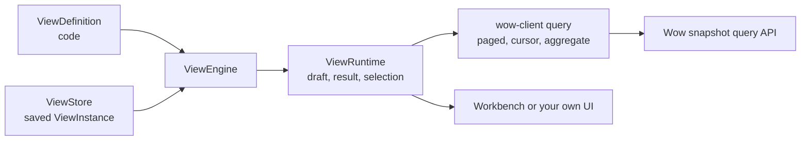

# View Engine

::: info On npm since Wow 9.2.0
`@ahoo-wang/wow-view-engine` is on npm since Wow 9.2.0, released from the same tag and with the same version as Wow. From 9.2.0 on, a patch release never breaks its public surface: the exports of every entry, including the `ViewStore` port a backend implements; the [CSS contract](./view-engine-theming.md#what-is-public); the message keys and issue codes; and the `wow-view-engine` command. A minor release may, and its release notes list every break with the steps to follow; keep the Wow packages on one minor ([version ranges](./compatibility.md#version-ranges)). Views saved in an older form keep opening: the engine migrates stored configs on read.
:::

The view engine is a data view engine for Wow-based business applications. The application declares in code _how a dataset can be observed_: fields, kinds, operators, available dimensions, and metrics. Users decide in the UI _how to observe it this time_: filters, columns, sorting, dimensions and metrics, charts, and panel composition. The engine compiles that choice into Wow queries, runs them through `@ahoo-wang/wow-client`, renders the result, and saves the views worth keeping so they reopen with one click.

It succeeds `@ahoo-wang/fetcher-viewer`, which stays on Fetcher 5.x and is not documented here.

## Where to start

| To | Read |
|---|---|
| Wire one business object from zero: install, the query descriptor, `defineView`, the engine, `ViewHost`, one action, run against the example server | [Getting Started with the View Engine](./view-engine-getting-started.md) |
| Wear a built-in look, use a brand colour, or follow the host's shadcn theme | [Theming the View Engine](./view-engine-theming.md) |
| Keyboard, screen readers and WCAG 2.2 AA conformance | [Accessibility of the View Engine](./view-engine-accessibility.md) |
| Draw your own UI instead of the workbench, with the headless hooks of `/react` (`useOpenView`, `useViewRuntime`, `useFilterEditor`, `useRecordTable`) | [wow-view-engine reference](../../reference/typescript/wow-view-engine/) |
| Keep saved views on a Wow server | [wow-view-store reference](../../reference/typescript/wow-view-store/) |

## The problem it solves

Most pages in a business system are the same page: a list with filters, sorting, and paging, sometimes with a chart. Each business object gets its own copy, and each request such as "add one more filter" or "break this down by warehouse" becomes a code change and a release. The data did not change; only the way of observing it did.

| For | What they get |
|---|---|
| Business users | Adjust scope, organization, and presentation within the declared capabilities, save the views that matter, and reopen them with one click |
| Developers | One definition and one query client per business object instead of one page per list, analysis, and overview; filtering, paging, saving, and conflict handling are implemented once |
| The product | Presentation changes within the supported range become configuration; adding a business object adds a definition, never a branch inside the engine |

It is not a database, a permission system, a general low-code page builder, or a BI modeling tool. Data, aggregation capabilities, and authorization come from the Wow services.

## Three facts

The design fixes three facts and derives the rest from them:

| Fact | Consequence |
|---|---|
| Definitions are code | No definition service or definition versions. A definition change is a deploy; saved views are validated when opened |
| Configs are data | Only `ViewInstance` and personal preferences persist. Consistency is an optimistic revision plus an idempotent `requestId` |
| Runtime state is transient | Drafts, results, paging, and selection live in one open `ViewRuntime` and are never persisted |


```mermaid
flowchart LR
    Definition["ViewDefinition<br>code"] --> Engine["ViewEngine"]
    Store["ViewStore<br>saved ViewInstance"] --> Engine
    Engine --> Runtime["ViewRuntime<br>draft, result, selection"]
    Runtime --> Query["wow-client query<br>paged, cursor, aggregate"]
    Query --> Server["Wow snapshot query API"]
    Runtime --> UI["Workbench or your own UI"]
```

## Views

| View | What the user does |
|---|---|
| Record view | Filter status = pending, sort by creation time, keep only the needed columns, save as "Pending today" |
| Analysis view | Take warehouse as the dimension, count orders and sum amounts as metrics, switch to a bar chart |
| Dashboard | Place several views on one page and constrain them with a global time range |
| Embedded view or dashboard | Show a saved view inside a business page, for example a customer's orders, without the workbench |
| System views | Declare "All", "Pending", and "New this week" in the definition so users open a usable view at once |

## Content Security Policy

The engine runs under a strict Content Security Policy: `script-src 'self'` and `style-src 'self'`, with neither `'unsafe-inline'` nor `'unsafe-eval'`. Three things need allowing:

- **The stylesheet is a file.** Serve `styles.css` (and `themes.css` if you use a preset) from an allowed origin instead of inlining it. Nothing the engine draws carries a `style` attribute in its markup: inline styles are written through the DOM's style object, which no policy blocks, and a chart tooltip's colour swatch is an SVG `fill`. Nothing loads a `data:` image either; the cells a board shows while it is built are drawn in the page.
- **The styles the bundled libraries add carry the page's nonce.** Three libraries add a `<style>` to `<head>` while they work: the drag-and-drop library while a list is dragged (a grabbing cursor, no text selection), the grid's drag library while a dashboard panel is moved or resized (no text selection), and Base UI while a select's list is open (the scrollbar hidden behind its scroll arrows). Publish the response's nonce the way Vite's `html.cspNonce` does, as `<meta property="csp-nonce" nonce="…">` (a `content` attribute is read too), and allow `'nonce-…'` in `style-src`; the engine hands it to all three. Without the meta everything still works, but those few rules are refused and each reports a violation.
- **The PNG export loads a `blob:` image.** The chart's SVG is loaded as an image from a `blob:` URL and drawn onto a canvas, so `img-src` must include `blob:`. Without it the PNG is not made and the toolbar says so. The SVG export needs nothing, and neither export evaluates code or writes an inline script.

```text
Content-Security-Policy: default-src 'self'; script-src 'self'; style-src 'self' 'nonce-<new every response>'; img-src 'self' blob:
```

```html
<meta property="csp-nonce" nonce="<the same nonce>" />
```

Two test runs hold the engine to exactly this policy and fail on a single violation. In Storybook, [`StrictCsp.test.stories.tsx`](https://github.com/Ahoo-Wang/Wow/blob/main/typescript/storybook/stories/view-engine/StrictCsp.test.stories.tsx) walks the record workbench (a column dragged, a summary picked from a select, a column widened, a record's detail opened), every chart type with its tooltip, the SVG, PNG and CSV exports, and a dashboard read, filtered from a chart, built (a panel moved and resized, a tab dragged, an analysis added) and saved; it runs in CI with the other stories. The compensation console runs its end-to-end tests under the same policy ([`e2e/csp.spec.ts`](https://github.com/Ahoo-Wang/Wow/blob/main/compensation/dashboard/e2e/csp.spec.ts)).

## Try it in Storybook

Each view runs in [Storybook](/storybook/) against in-memory fixtures, inside a host application shell. Saving, renaming, and deleting write to a fresh in-memory store on every visit. The Storybook is written in Chinese only.

The [integration walk-through](/storybook/?path=/docs/view-engine-接入导览--docs) in Storybook takes a host through the recommended wiring in five steps — declare a definition, connect the data, mount `ViewHost`, declare the actions, render the page — with the real source files of a working example.

To see what the engine draws first, open the [chart showcase board](/storybook/?path=/docs/view-engine-业务场景-图型全景--docs): one retail dashboard that uses each of the 22 chart types once, every chart titled with the analytical question it answers, on four tabs (trend, mix, spread and relationships, regions and conversion). Pressing a province on the map or the bar chart, or a payment method on the pie, filters the whole board; the docs page's "Show code" holds the board's whole configuration.

| View | Storybook |
|---|---|
| Record view | [Record workbench](/storybook/?path=/docs/view-engine-组件状态-记录工作台--docs) and its [filter editor](/storybook/?path=/docs/view-engine-组件状态-筛选编辑器--docs) |
| Analysis view | [Analysis workbench](/storybook/?path=/docs/view-engine-组件状态-分析工作台--docs) |
| Dashboard | [Dashboard](/storybook/?path=/docs/view-engine-组件状态-仪表盘--docs) |
| Embedded view or dashboard | [EmbeddedView](/storybook/?path=/docs/view-engine-组件状态-embeddedview--docs) and [EmbeddedDashboard](/storybook/?path=/docs/view-engine-组件状态-embeddeddashboard--docs) |
| Themes | [Theme gallery and contrast matrix](/storybook/?path=/docs/view-engine-能力-主题与预设--docs) |

## Where to read more

- [Getting Started with the View Engine](./view-engine-getting-started.md): the example server's sales orders wired in from zero, one file a step.
- [wow-view-engine reference](../../reference/typescript/wow-view-engine/): entries, concepts, persistence port, and extension points.
- [wow-view-store reference](../../reference/typescript/wow-view-store/): `WowViewStore`, the saved views on a Wow server, and the CoSec gateway rules it needs.
- [Theming the View Engine](./view-engine-theming.md): presets, host variables, light, dark and system mode, the shadcn bridge, and the contrast an override owes.
- [Accessibility of the View Engine](./view-engine-accessibility.md): the WCAG 2.2 AA conformance statement, the keyboard and screen-reader walkthroughs, and the known gaps.
- [Design documents](https://github.com/Ahoo-Wang/Wow/tree/main/typescript/wow-view-engine/docs/design): the source of truth for the model.
- [Package README](https://github.com/Ahoo-Wang/Wow/blob/main/typescript/wow-view-engine/README.md): the API as it stands today.
