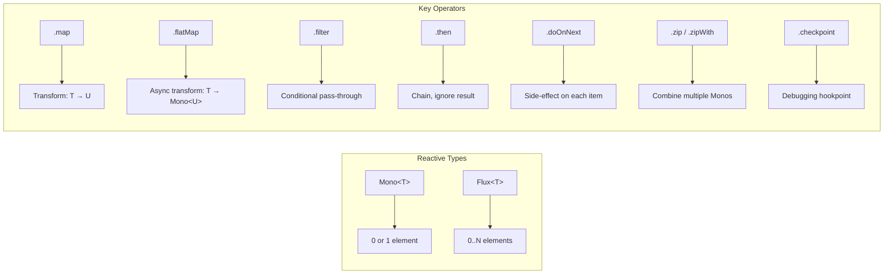
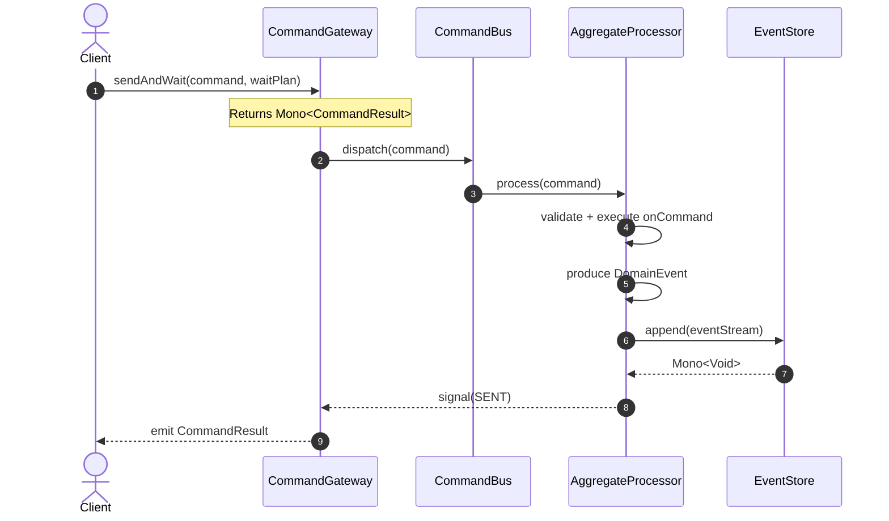
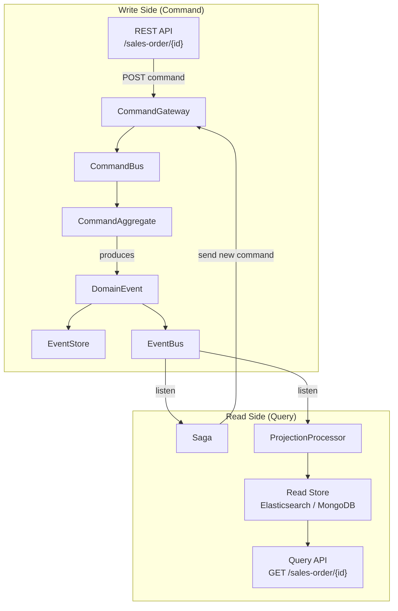
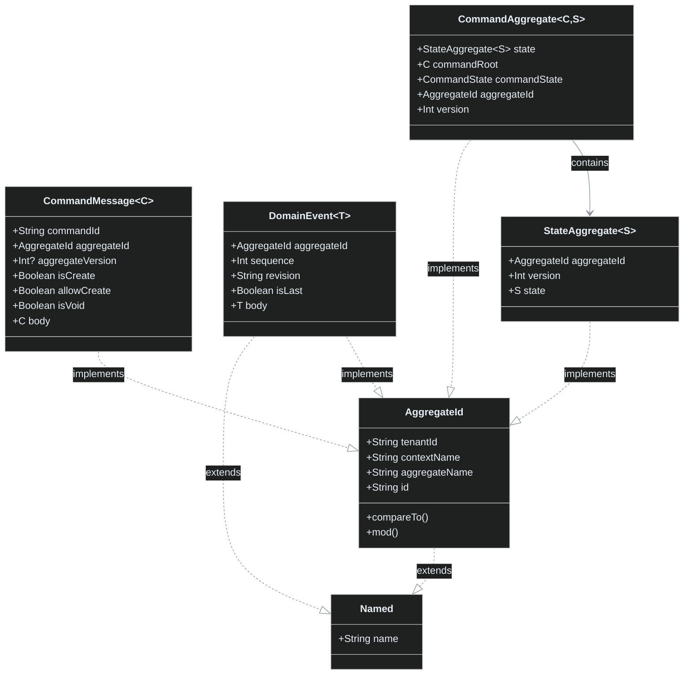
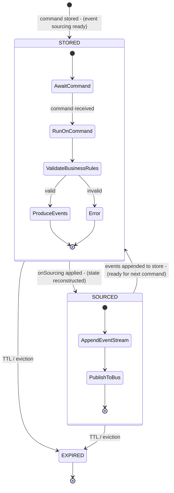
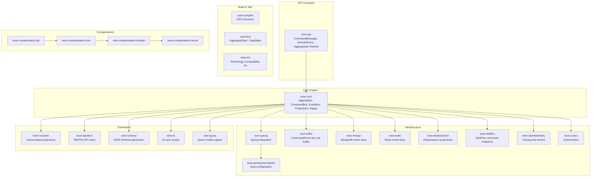
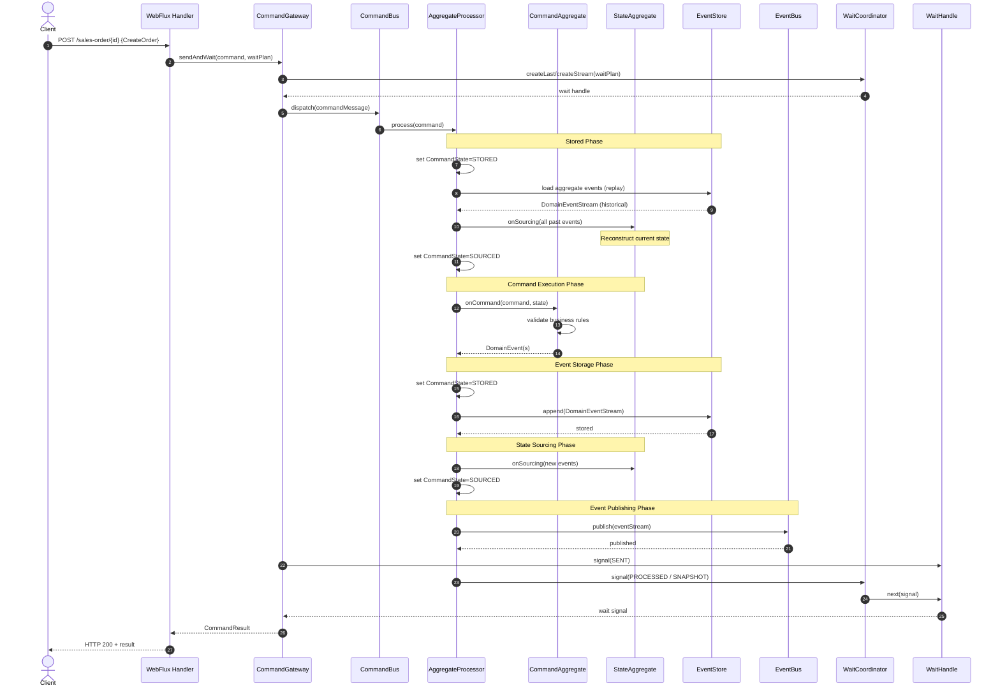
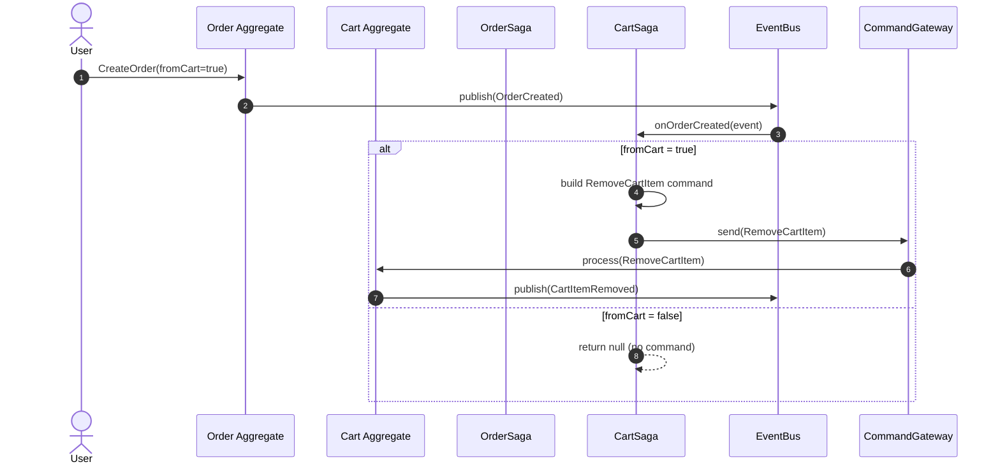
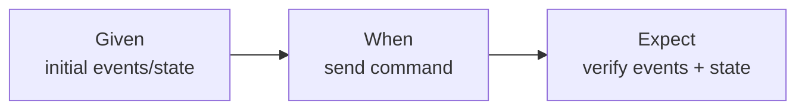

# Contributor Onboarding Guide

Welcome to the Wow Framework. This guide is designed to take you from your first `git clone` to confidently contributing domain logic, core engine features, or infrastructure integrations. It covers the language foundations, architectural patterns, and day-to-day workflows you will use as a contributor.

::: tip Who is this for?
You should already know Java and have some exposure to Spring Boot. If you are new to Kotlin, the first section bridges the gap. If you are new to DDD/Event Sourcing, the second section introduces the concepts within the Wow context.
:::

---

## Part I: Language and Framework Foundations

### Kotlin for Java Developers

Wow is written entirely in Kotlin, but it is designed to interoperate cleanly with Java. The example project at `example/transfer/` is written in Java to demonstrate this. Still, you will write most contributions in Kotlin 2.3 targeting JVM 17.

Here is what matters most coming from Java:

| Kotlin Concept | Java Equivalent | When You Will See It |
|---|---|---|
| `data class` | Lombok `@Data` or Java record | Commands (`AddCartItem`), Events (`OrderCreated`), State classes (`CartState`) |
| `object` | Singleton with `private constructor` | `AggregateVerifier`, `GlobalIdGenerator` |
| `companion object` | `static` members | Loggers, factory methods, constants |
| `val` / `var` | `final` / mutable field | Immutable properties on events; mutable state on aggregates |
| Extension functions | Static utility methods (e.g., `StringUtils`) | `.assert()` on AssertJ, `.commandBuilder()` |
| `when` expression | `switch` statement (exhaustive) | Event type matching |
| `lateinit var` + `private set` | Field initialized post-construction, read-only externally | Aggregate state fields that `onSourcing` populates |
| Null safety (`?.`, `?:`, `!!`) | `Optional` or null checks | Safe navigation on optional fields |
| `sealed class` / `sealed interface` | Enums with data (Java 17+) | `CommandState`, `OrderStatus` |
| `inline` + `reified` | Type tokens / `Class<T>` passing | Testing DSL (`aggregateVerifier<Cart, CartState>()`) |
| Coroutines (`suspend`) | Virtual threads (Loom) / `CompletableFuture` | Alternative to Reactor in command handlers |

**Key file to study:** The Order aggregate demonstrates production Kotlin patterns — `Order.kt` uses extension-function receivers, `Mono` return types, and the `@Name` qualifier for dependency injection.

> [Order.kt:57-217](https://github.com/Ahoo-Wang/Wow/blob/main/example/example-domain/src/main/kotlin/me/ahoo/wow/example/domain/order/Order.kt#L57-L217)

#### Data Classes for Domain Events

Domain events in Wow follow declarative design — they are immutable `data class` records. No setters, no side effects.

<!-- Source: CartItemAdded is defined in example-api module, here shown in CartState sourcing at CartState.kt:28 -->
```kotlin
// Commands and Events are simply data classes
@Serializable
data class CartItemAdded(val added: CartItem)
data class CartItem(val productId: String, val quantity: Int)
```

#### Extension Functions for Testing

Wow replaces AssertJ's `assertThat()` with an extension function `.assert()` from `me.ahoo.test:fluent-assert-core`.

<!-- Source: testing convention from CLAUDE.md:90 and AggregateVerifier.kt examples -->
```kotlin
// NOT this:
assertThat(items).hasSize(1)

// DO this:
items.assert().hasSize(1)
```

---

### Project Reactor: Mono and Flux

All command processing, event publishing, and saga orchestration in Wow runs on [Project Reactor](https://projectreactor.io/). This is the reactive backbone of the framework.



<!-- Sources: CommandGateway.kt:128 (Mono return), Order.kt:110 (Mono<OrderCreated>), CartSaga.kt:33 (Mono-based handler) -->

**Critical rule:** In Wow, every command handler, event handler, and saga method **must** be non-blocking. Never call `Thread.sleep()`, blocking I/O, or `.block()` inside a handler. The framework handles threading for you.



<!-- Sources: CommandGateway.kt:89-92 (send), CommandAggregate.kt:65-82 (CommandState lifecycle), WaitPlan.kt:60-81 (waiting) -->

**Common Mono patterns in Wow:**

<!-- Source: Order.kt:106-138 (Flux chaining with flatMap + then), CartSaga.kt:33-42 (conditional Mono return) -->
```kotlin
// Chaining multiple async validations, then producing an event
Flux.fromIterable(createOrder.items)
    .flatMap(specification::require)
    .then(orderCreated.toMono())

// Conditional saga: return null to skip
fun onOrderCreated(event: DomainEvent<OrderCreated>): CommandBuilder? {
    if (!event.body.fromCart) return null   // null means "no command to send"
    return RemoveCartItem(productIds = ...).commandBuilder().aggregateId(event.ownerId)
}
```

---

### Coroutines and Reactor Interop

Wow supports both Reactor (`Mono`/`Flux`) and Kotlin coroutines (`suspend`) for command and event handlers. The compile-time KSP processor and the runtime framework detect which style you use and adapt accordingly.

The interop layer is provided by the `kotlinx-coroutines-reactor` library, which converts:

| From | To | Conversion |
|---|---|---|
| `Mono<T>` | `suspend fun` → `T` | `mono.awaitSingle()` |
| `Flux<T>` | `Flow<T>` | `flux.asFlow()` |
| `suspend fun` → `T` | `Mono<T>` | `mono { ... }` |
| `Flow<T>` | `Flux<T>` | `flow.asFlux()` |

**You can choose either style** and mix them in the same aggregate.

<!-- Source: Order.kt:70-101 (comments showing coroutine style next to Reactor style) -->
```kotlin
// Reactor style (used in Order.kt)
fun onCommand(command: CommandMessage<CreateOrder>, ...): Mono<OrderCreated> {
    return Flux.fromIterable(createOrder.items)
        .flatMap(specification::require)
        .then(orderCreated.toMono())
}

// Coroutine style (equivalent — listed in Javadoc comment)
suspend fun onCommand(command: CommandMessage<CreateOrder>, ...): OrderCreated {
    createOrder.items.asFlow().collect { specification.require(it).awaitSingle() }
    return orderCreated
}
```

::: tip Which style to use?
- **Coroutines**: When you prefer sequential-looking code, have complex branching logic, or use `Flow` for stream processing.

Both are fully supported. The choice is stylistic.
:::

---

### Spring Boot 4.x Essentials

Wow 8.x requires Spring Boot 4.x and is automatically configured via `wow-spring-boot-starter`. You do not need to write `@Configuration` classes for the Wow engine — it is all auto-configuration.

#### Feature Capabilities

The starter uses Gradle feature variants to declare optional capabilities. Depend on what you need:

<!-- Source: CLAUDE.md:76-77 -->
| Capability | Gradle Dependency | Provides |
|---|---|---|
| `mongo-support` | `wow-mongo` | Event store + snapshot store via MongoDB |
| `redis-support` | `wow-redis` | Event store + snapshot store via Redis |
| `kafka-support` | `wow-kafka` | Command/event bus via Kafka |
| `webflux-support` | `wow-webflux` | REST API endpoints for commands |
| `elasticsearch-support` | `wow-elasticsearch` | Projection storage via Elasticsearch |
| `opentelemetry-support` | `wow-opentelemetry` | Tracing and metrics |
| `openapi-support` | `wow-openapi` | OpenAPI spec generation |
| `cosec-support` | `wow-cosec` | Authorization and access control |
| `mock-support` | `wow-mock` | In-memory implementations for testing |

Source: [CLAUDE.md:76-77](https://github.com/Ahoo-Wang/Wow/blob/main/CLAUDE.md#L76-L77)

#### Auto-Registration via KSP

The `wow-compiler` KSP processor scans your classpath at compile time and generates:
- Command routing metadata (which aggregate handles which command)
- Event handling metadata (which sagas/projections listen to which events)
- OpenAPI route specifications

You do not write controllers. You write domain models. The framework generates the REST layer automatically.

Source: [CLAUDE.md:66](https://github.com/Ahoo-Wang/Wow/blob/main/CLAUDE.md#L66)

#### Reactive + Spring Integration

All Wow beans are reactive. The Spring WebFlux integration in `wow-webflux` registers `HandlerFunction` routes for each command type. Commands arrive via HTTP POST, are deserialized into `CommandMessage<T>`, and are dispatched through the `CommandGateway`.

---

## Part II: Architecture and Domain Model

### The Big Picture: CQRS + Event Sourcing

Wow separates the write side (commands that change state) from the read side (queries that return projections). This is CQRS. Every state change is recorded as an immutable event. The current state is the accumulation of all past events. This is Event Sourcing.



<!-- Sources: CommandGateway.kt:75-178 (CommandGateway interface), DomainEvent.kt:52-95 (DomainEvent interface), CommandAggregate.kt:41-53 (CommandAggregate interface) -->

### DDD Concepts in Wow

Wow implements Domain-Driven Design through a set of cohesive interfaces, annotations, and patterns.

#### Aggregate: The Transaction Boundary

An **Aggregate** is a cluster of domain objects treated as a single unit. In Wow, an aggregate has two parts:

1. **Command Aggregate** (`CommandAggregate<C, S>`): Handles commands, validates business rules, and publishes events. It does **not** store state directly.
2. **State Aggregate** (`StateAggregate<S>`): Holds the current state of the aggregate. It is reconstructed from events via `onSourcing`.



<!-- Sources: CommandMessage.kt:53-126, DomainEvent.kt:52-95, CommandAggregate.kt:41-53, AggregateId.kt:29-57, Named.kt:22-29 -->

#### The Two-Phase Command Handler Pattern

Every aggregate implements a separation of concerns:

| Phase | Annotation | Location | Responsibility | Returns |
|---|---|---|---|---|
| **Command Handling** | `@OnCommand` | Command Aggregate class (e.g., `Order`) | Validate business rules, check state preconditions, produce domain events | `Mono<Event>` or `Event` or `Iterable<Event>` or `suspend fun → Event` |
| **State Sourcing** | `@OnSourcing` | State class (e.g., `OrderState`) | Apply events to mutate state. Must be deterministic and side-effect-free. | `Unit` (void) |

<!-- Sources: OnCommand.kt:19-87, OnSourcing.kt:19-59, Order.kt:106-138 (onCommand), OrderState.kt:82-118 (onSourcing) -->



<!-- Sources: CommandState.kt:65-118 (STORED/SOURCED/EXPIRED enum), CommandAggregate.kt:41-53 (lifecycle binding) -->

**Critical design rule:** The `onSourcing` function does **not** perform business validation. It does **not** call external services. It simply applies the event's data to the state. The `onCommand` function handles all validation. This separation is what makes event sourcing reliable — replaying events always produces the same state.

<!-- Source: OrderState.kt:69-81 (comment: "event sourcing function only modifies state, no side effects") -->

```kotlin
// Command handler: validates, returns events (Order.kt:158-163)
fun onCommand(changeAddress: ChangeAddress): AddressChanged {
    check(OrderStatus.CREATED == state.status) {
        "The current order[${state.id}] status[${state.status}] cannot modify the address"
    }
    return AddressChanged(changeAddress.shippingAddress)
}

// State sourcing: applies event, no validation (OrderState.kt:92-94)
fun onSourcing(addressChanged: AddressChanged) {
    address = addressChanged.shippingAddress
}
```

> [Order.kt:158-163](https://github.com/Ahoo-Wang/Wow/blob/main/example/example-domain/src/main/kotlin/me/ahoo/wow/example/domain/order/Order.kt#L158-L163) and [OrderState.kt:92-94](https://github.com/Ahoo-Wang/Wow/blob/main/example/example-domain/src/main/kotlin/me/ahoo/wow/example/domain/order/OrderState.kt#L92-L94)

#### Entity and Value Object

- **Entity**: An object with a unique identity that persists over time. In Wow, the `AggregateId` is the identity. The state class (`OrderState`) is the entity snapshot.
- **Value Object**: An object defined by its attributes, not by identity. Immutable. Examples: `ShippingAddress`, `OrderItem`, `CartItem`.

<!-- Source: Annotation package — ValueObject.kt, EntityObject.kt -->
Wow does not enforce these via interfaces; they are design patterns applied through `data class` (value objects) and mutable state classes (entities).

---

### The Module Dependency Graph



<!-- Sources: settings.gradle.kts:19-83, CLAUDE.md:48-62, build.gradle.kts:31-51 -->

---

### Command Processing Pipeline

This is the complete lifecycle from when a command enters the system to when the response is returned.



<!-- Sources: CommandGateway.kt:89-159, WaitCoordinator.kt:18-72, WaitHandle.kt:22-223, WaitPlan.kt:20-71, Order.kt:106-138, OrderState.kt:82-118 -->

---

### Saga Orchestration

Sagas coordinate multi-aggregate business processes. A saga listens to domain events and, in response, sends new commands to other aggregates.



<!-- Sources: CartSaga.kt:26-43, OrderSaga.kt:21-43 -->

---

### Wait Plans: Controlling Command Response Timing

The `WaitPlan` interface controls how long the caller waits and what stage of processing triggers the response.

| Wait Plan | Method | Returns When | Use Case |
|---|---|---|---|
| SENT | `sendAndWaitForSent()` | Command accepted by the bus | Fire-and-forget, high throughput |
| PROCESSED | `sendAndWaitForProcessed()` | Aggregate processed, events published | Synchronous request-response, read-your-writes |
| SNAPSHOT | `sendAndWaitForSnapshot()` | State snapshot persisted | Ensuring durability before responding |

<!-- Sources: CommandGateway.kt:127-159, WaitPlan.kt:20-71 -->

> [CommandGateway.kt:127-159](https://github.com/Ahoo-Wang/Wow/blob/main/wow-core/src/main/kotlin/me/ahoo/wow/command/CommandGateway.kt#L127-L159)

Performance benchmarks from the README show the impact:

| Scenario | WaitPlan | Average TPS | Average Response Time |
|---|---|---|---|
| Add to Cart | SENT | 59,625 | 29 ms |
| Add to Cart | PROCESSED | 18,696 | 239 ms |
| Create Order | SENT | 47,838 | 217 ms |
| Create Order | PROCESSED | 18,230 | 268 ms |

Source: [README.md:70-99](https://github.com/Ahoo-Wang/Wow/blob/main/README.md#L70-L99)

---

### Key Classes and Interfaces Reference

| Interface / Class | Module | Role | Source |
|---|---|---|---|
| `Named` | `wow-api` | Base interface for nameable objects | [Named.kt:22](https://github.com/Ahoo-Wang/Wow/blob/main/wow-api/src/main/kotlin/me/ahoo/wow/api/naming/Named.kt#L22) |
| `AggregateId` | `wow-api` | Composite aggregate identifier: tenant + context + name + id | [AggregateId.kt:29](https://github.com/Ahoo-Wang/Wow/blob/main/wow-api/src/main/kotlin/me/ahoo/wow/api/modeling/AggregateId.kt#L29) |
| `CommandMessage<C>` | `wow-api` | Command envelope with aggregate targeting, versioning, idempotency | [CommandMessage.kt:53](https://github.com/Ahoo-Wang/Wow/blob/main/wow-api/src/main/kotlin/me/ahoo/wow/api/command/CommandMessage.kt#L53) |
| `DomainEvent<T>` | `wow-api` | Immutable fact about past state change, carries aggregate identity | [DomainEvent.kt:52](https://github.com/Ahoo-Wang/Wow/blob/main/wow-api/src/main/kotlin/me/ahoo/wow/api/event/DomainEvent.kt#L52) |
| `Message<SOURCE, T>` | `wow-api` | Generic message with header + body, fluent API | [Message.kt:38](https://github.com/Ahoo-Wang/Wow/blob/main/wow-api/src/main/kotlin/me/ahoo/wow/api/messaging/Message.kt#L38) |
| `CommandAggregate<C, S>` | `wow-core` | Runtime aggregate coordinating command ↔ state ↔ events | [CommandAggregate.kt:41](https://github.com/Ahoo-Wang/Wow/blob/main/wow-core/src/main/kotlin/me/ahoo/wow/modeling/command/CommandAggregate.kt#L41) |
| `CommandGateway` | `wow-core` | High-level send API with wait plan support | [CommandGateway.kt:75](https://github.com/Ahoo-Wang/Wow/blob/main/wow-core/src/main/kotlin/me/ahoo/wow/command/CommandGateway.kt#L75) |
| `CommandBus` | `wow-core` | Low-level command dispatch | [CommandBus.kt](https://github.com/Ahoo-Wang/Wow/blob/main/wow-core/src/main/kotlin/me/ahoo/wow/command/CommandBus.kt) |
| `WaitPlan` | `wow-core` | Controls how long to wait for command results | [WaitPlan.kt:60](https://github.com/Ahoo-Wang/Wow/blob/main/wow-core/src/main/kotlin/me/ahoo/wow/command/wait/WaitPlan.kt#L60) |
| `CommandState` | `wow-core` | Aggregate lifecycle state machine: STORED → SOURCED → EXPIRED | [CommandAggregate.kt:65](https://github.com/Ahoo-Wang/Wow/blob/main/wow-core/src/main/kotlin/me/ahoo/wow/modeling/command/CommandAggregate.kt#L65) |
| `AggregateVerifier` | `wow-test` | Entry point for aggregate unit testing (Given-When-Expect) | [AggregateVerifier.kt:57](https://github.com/Ahoo-Wang/Wow/blob/main/test/wow-test/src/main/kotlin/me/ahoo/wow/test/AggregateVerifier.kt#L57) |
| `SagaVerifier` | `wow-test` | Entry point for saga unit testing | [SagaVerifier.kt](https://github.com/Ahoo-Wang/Wow/blob/main/test/wow-test/src/main/kotlin/me/ahoo/wow/test/SagaVerifier.kt) |

### Annotation Reference

Wow uses annotations extensively for declarative design. Here is every annotation you will encounter:

| Annotation | Target | Purpose | Source |
|---|---|---|---|
| `@AggregateRoot` | Class | Marks a class as an aggregate root; optionally mounts commands | [AggregateRoot.kt:66](https://github.com/Ahoo-Wang/Wow/blob/main/wow-api/src/main/kotlin/me/ahoo/wow/api/annotation/AggregateRoot.kt#L66) |
| `@AggregateRoute` | Class | Configures API routing, ownership policy, resource naming | [AggregateRoute.kt:59](https://github.com/Ahoo-Wang/Wow/blob/main/wow-api/src/main/kotlin/me/ahoo/wow/api/annotation/AggregateRoute.kt#L59) |
| `@OnCommand` | Function | Marks a function as a command handler (returns: `Mono<Event>` or `Event`) | [OnCommand.kt:73](https://github.com/Ahoo-Wang/Wow/blob/main/wow-api/src/main/kotlin/me/ahoo/wow/api/annotation/OnCommand.kt#L73) |
| `@OnSourcing` | Function | Marks a function as a state sourcing handler (deterministic, void) | [OnSourcing.kt:59](https://github.com/Ahoo-Wang/Wow/blob/main/wow-api/src/main/kotlin/me/ahoo/wow/api/annotation/OnSourcing.kt#L59) |
| `@OnEvent` | Function | Marks a function as a domain event handler (saga/projection) | [OnEvent.kt:66](https://github.com/Ahoo-Wang/Wow/blob/main/wow-api/src/main/kotlin/me/ahoo/wow/api/annotation/OnEvent.kt#L66) |
| `@StatelessSaga` | Class | Registers a class as a saga (auto-discovered as Spring `@Component`) | [StatelessSaga.kt:69](https://github.com/Ahoo-Wang/Wow/blob/main/wow-api/src/main/kotlin/me/ahoo/wow/api/annotation/StatelessSaga.kt#L69) |
| `@Retry` | Function | Enables retry with backoff on saga/event handlers | [Retry.kt:74](https://github.com/Ahoo-Wang/Wow/blob/main/wow-api/src/main/kotlin/me/ahoo/wow/api/annotation/Retry.kt#L74) |
| `@Name` | Parameter | Qualifies a dependency for injection by name | [Name.kt](https://github.com/Ahoo-Wang/Wow/blob/main/wow-api/src/main/kotlin/me/ahoo/wow/api/annotation/Name.kt) |
| `@AggregateId` | Field | Marks a field as the aggregate's unique identifier | [AggregateId.kt](https://github.com/Ahoo-Wang/Wow/blob/main/wow-api/src/main/kotlin/me/ahoo/wow/api/annotation/AggregateId.kt) |
| `@TenantId` | Field | Marks a field as the tenant identifier for multi-tenancy | [TenantId.kt](https://github.com/Ahoo-Wang/Wow/blob/main/wow-api/src/main/kotlin/me/ahoo/wow/api/annotation/TenantId.kt) |
| `@BoundedContext` | Class | Names the DDD bounded context | [BoundedContext.kt](https://github.com/Ahoo-Wang/Wow/blob/main/wow-api/src/main/kotlin/me/ahoo/wow/api/annotation/BoundedContext.kt) |
| `@ProjectionProcessor` | Class | Registers a class as a projection processor | [ProjectionProcessor.kt](https://github.com/Ahoo-Wang/Wow/blob/main/wow-api/src/main/kotlin/me/ahoo/wow/api/annotation/ProjectionProcessor.kt) |

---

## Part III: Getting Productive

### Build System: Gradle and KSP

Wow uses Gradle 8.x with Kotlin DSL. All commands run from the repository root.

#### Required Toolchain

| Tool | Version | Verified By |
|---|---|---|
| JDK | 17+ | `org.gradle.jvmargs=-Xmx2g` in `gradle.properties` |
| Kotlin | 2.3 | `kotlin.code.style=official` in `gradle.properties` |
| KSP | 2.x | `ksp.useKSP2=true` in `gradle.properties` |

Source: [gradle.properties:1-29](https://github.com/Ahoo-Wang/Wow/blob/main/gradle.properties#L1-L29)

#### Gradle Properties

Key settings in `gradle.properties`:

| Property | Value | Effect |
|---|---|---|
| `org.gradle.caching` | `true` | Build cache enabled |
| `org.gradle.parallel` | `true` | Parallel project execution |
| `org.gradle.jvmargs` | `-Xmx2g` | Max heap for Gradle daemon |
| `ksp.useKSP2` | `true` | Use KSP2 for faster compilation |
| `ksp.incremental` | `true` | Incremental KSP processing |
| `version` | `8.8.1` | Current release version |

Source: [gradle.properties:13-21](https://github.com/Ahoo-Wang/Wow/blob/main/gradle.properties#L13-L21)

#### Build All

```bash
# Build everything except example-server apps
./gradlew build

# Build with stacktrace (useful for CI debugging)
./gradlew clean build --stacktrace
```

#### Module-Specific Builds

<!-- Source: CLAUDE.md:12-18 -->
```bash
# Build and test a specific module
./gradlew wow-core:check

# Test only
./gradlew wow-core:test

# Clean + test + lint (CI pattern)
./gradlew wow-core:clean wow-core:check --stacktrace
```

#### KSP: Kotlin Symbol Processing

The `wow-compiler` module is a KSP processor. When you apply it to a domain project:

```kotlin
// In build.gradle.kts of a domain module
plugins {
    id("com.google.devtools.ksp")
}
dependencies {
    ksp(project(":wow-compiler"))  // or ksp("me.ahoo.wow:wow-compiler:8.8.1")
}
```

Source: [CLAUDE.md:66](https://github.com/Ahoo-Wang/Wow/blob/main/CLAUDE.md#L66)

The processor generates:
- **Command routing metadata**: Maps command types to the aggregates that handle them.
- **Event handling metadata**: Maps event types to the sagas/projections that listen to them.
- **OpenAPI route specs**: Generates API documentation from `@AggregateRoute` annotations.

#### Multi-Module Project Structure

<!-- Source: settings.gradle.kts:16-83 -->
```
Wow/                                (root project)
├── wow-api/                        Pure API contracts — no runtime dependencies
├── wow-core/                       Core engine — aggregates, command bus, projections, sagas
├── wow-compiler/                   KSP processor — compile-time code generation
├── wow-spring/                     Spring Framework integration
├── wow-spring-boot-starter/        Auto-configuration with feature capabilities
├── wow-kafka/                      Kafka command/event bus
├── wow-mongo/                      MongoDB event store
├── wow-redis/                      Redis event store
├── wow-elasticsearch/              Elasticsearch projections
├── wow-webflux/                    Spring WebFlux command endpoint integration
├── wow-opentelemetry/              OpenTelemetry tracing and metrics
├── wow-cosec/                      Authorization (CoSec)
├── wow-query/                      Query model support
├── wow-cocache/                    Cache-based projection caching
├── wow-apiclient/                  RESTful API client
├── wow-schema/                     JSON Schema generation
├── wow-bi/                         BI sync script generator
├── config/detekt/                  Detekt configuration
├── compensation/                   Compensation subsystem
│   ├── wow-compensation-api/       Compensation API
│   ├── wow-compensation-core/      Compensation engine
│   ├── wow-compensation-domain/    Compensation aggregate domain
│   ├── wow-compensation-server/    Compensation server
│   └── dashboard/                  React compensation dashboard
├── test/
│   ├── wow-test/                   Unit testing DSL
│   ├── wow-tck/                    Technology Compatibility Kit
│   ├── wow-mock/                   In-memory mock implementations
│   ├── wow-it/                     Integration tests
│   └── code-coverage-report/       Aggregated coverage report
└── example/
    ├── example-api/                Example shared API (commands, events)
    ├── example-domain/             Example aggregates, sagas, projections
    ├── example-server/             Example Spring Boot application
    └── transfer/                   Transfer example in Java
        ├── example-transfer-api/
        ├── example-transfer-domain/
        └── example-transfer-server/
```

---

### Setting Up Your Development Environment

#### 1. Clone and Initial Build

```bash
git clone https://github.com/Ahoo-Wang/Wow.git
cd Wow
./gradlew build
```

The first build downloads all dependencies and runs the KSP processor, Detekt linter, and tests. Expect it to take a few minutes depending on network speed.

#### 2. IDE Setup

IntelliJ IDEA is the recommended IDE with the following plugins:
- **Kotlin** (bundled with IntelliJ)
- **Detekt** (for inline lint feedback)
- **Gradle** (bundled)

After opening the project, IntelliJ will import the Gradle modules. Enable annotation processing (KSP) in:
`Preferences → Build, Execution, Deployment → Compiler → Annotation Processors → Enable annotation processing`

#### 3. Build Validation

Verify everything works:

```bash
# Lint check
./gradlew detekt

# Run all unit tests
./gradlew test

# Run a specific test
./gradlew wow-core:test --tests "me.ahoo.wow.command.DefaultCommandGatewayTest"

# Run Example domain tests (fast, good for exploring)
./gradlew example-domain:test
```

#### 4. Docker for Integration Tests

Integration tests use Testcontainers, which require Docker running:

```bash
# These tests require Docker:
./gradlew wow-tck:test       # Technology Compatibility Kit
./gradlew wow-it:test        # Integration tests
```

Integration tests spin up actual MongoDB, Kafka, Redis, and Elasticsearch containers. They are slower than unit tests but essential for verifying infrastructure integrations.

---

### Running Tests

#### Unit Tests: Given-When-Expect Pattern

Wow uses a custom testing DSL based on the Given-When-Expect pattern. You write tests that set up initial state (Given), send a command (When), and verify the outcome (Expect).



<!-- Sources: AggregateVerifier.kt:57-265, AggregateSpec.kt, SagaSpec.kt -->

**AggregateSpec** (for testing aggregates):

```kotlin
class CartSpec : AggregateSpec<Cart, CartState>({
    on {
        val ownerId = generateGlobalId()
        val addCartItem = AddCartItem(productId = "productId", quantity = 1)
        givenOwnerId(ownerId)
        whenCommand(addCartItem) {
            expectNoError()
            expectEventType(CartItemAdded::class)
            expectState {
                items.assert().hasSize(1)
            }
            expectStateAggregate {
                ownerId.assert().isEqualTo(ownerId)
            }
        }
    }
})
```

> [CartSpec from README.md:158-212](https://github.com/Ahoo-Wang/Wow/blob/main/README.md#L158-L212)

**AggregateVerifier** (for programmatic aggregate testing):

```kotlin
aggregateVerifier<Cart, CartState>()
    .given(CartItemAdded(CartItem("p1", 1)))
    .whenCommand(RemoveCartItem(productIds = setOf("p1")))
    .expectEventType(CartItemRemoved::class)
    .expectState { items.assert().isEmpty() }
    .verify()
```

> [AggregateVerifier.kt:57-265](https://github.com/Ahoo-Wang/Wow/blob/main/test/wow-test/src/main/kotlin/me/ahoo/wow/test/AggregateVerifier.kt#L57-L265)

**SagaSpec** (for testing sagas):

```kotlin
class CartSagaSpec : SagaSpec<CartSaga>({
    on {
        val orderItem = OrderItem(id = ..., productId = ..., price = ..., quantity = 10)
        whenEvent(
            event = mockk<OrderCreated> {
                every { items } returns listOf(orderItem)
                every { fromCart } returns true
            },
            ownerId = generateGlobalId()
        ) {
            expectCommandType(RemoveCartItem::class)
            expectCommand<RemoveCartItem> {
                aggregateId.id.assert().isEqualTo(ownerId)
                body.productIds.assert().hasSize(1)
            }
        }
    }
})
```

> [CartSagaSpec from README.md:221-272](https://github.com/Ahoo-Wang/Wow/blob/main/README.md#L221-L272)

#### Integration Tests

Integration tests are located in:

| Module | Description | Requires |
|---|---|---|
| `wow-tck` | Technology Compatibility Kit — verifies storage/bus implementations against the API contract | Docker (Testcontainers) |
| `wow-it` | End-to-end integration tests | Docker (Testcontainers) |
| `example-domain` tests | Example domain tests (fast, no Docker needed) | Nothing extra |

<!-- Source: CLAUDE.md:68, build.gradle.kts:45-53 -->

#### Coverage Enforcement

Domain modules (`example-domain`, `wow-compensation-domain`) enforce 80% minimum test coverage via JaCoCo:

<!-- Source: CLAUDE.md:94 -->
```bash
# Verify coverage (enforced on domain modules)
./gradlew jacocoTestCoverageVerification
```

#### Test Retry in CI

In CI environments, failed tests are automatically retried up to 2 times (max 20 failures):

<!-- Source: build.gradle.kts:114-121 -->
```kotlin
retry {
    if (isInCI) {
        maxRetries = 2
        maxFailures = 20
    }
    failOnPassedAfterRetry = true
}
```

---

### Common Workflows

#### Workflow 1: Adding a New Command

1. **Define the command** in your API module (e.g., `wow-api` or a project-specific API module):
   ```kotlin
   @Serializable
   data class ShipOrder(val trackingNumber: String)
   ```
2. **Add an `onCommand` handler** in your aggregate class:
   ```kotlin
   fun onCommand(shipOrder: ServerCommandExchange<ShipOrder>): OrderShipped {
       check(OrderStatus.PAID == state.status) { "..." }
       return OrderShipped
   }
   ```
3. **Add an `onSourcing` handler** in your state class:
   ```kotlin
   fun onSourcing(orderShipped: OrderShipped) {
       status = OrderStatus.SHIPPED
   }
   ```
4. **Write a test** using `AggregateSpec` or `AggregateVerifier`.
5. **Run `./gradlew detekt`** to lint-check.
6. The KSP processor automatically generates the routing metadata. No manual registration required.

> [Order.kt:165-170](https://github.com/Ahoo-Wang/Wow/blob/main/example/example-domain/src/main/kotlin/me/ahoo/wow/example/domain/order/Order.kt#L165-L170) and [OrderState.kt:103-105](https://github.com/Ahoo-Wang/Wow/blob/main/example/example-domain/src/main/kotlin/me/ahoo/wow/example/domain/order/OrderState.kt#L103-L105)

#### Workflow 2: Adding a New Saga

1. **Create a saga class** annotated with `@StatelessSaga`:
   ```kotlin
   @StatelessSaga
   class OrderFulfillmentSaga {
       @OnEvent
       @Retry(maxRetries = 5, minBackoff = 60)
       fun onOrderPaid(event: DomainEvent<OrderPaid>): CommandBuilder? {
           return ShipOrder(trackingNumber = "...").commandBuilder()
               .aggregateId(event.aggregateId)
       }
   }
   ```
2. **Write a test** using `SagaSpec`.
3. The KSP processor auto-discovers the `@StatelessSaga` annotation (which extends `@Component`) and registers the event listeners.

> [CartSaga.kt:26-43](https://github.com/Ahoo-Wang/Wow/blob/main/example/example-domain/src/main/kotlin/me/ahoo/wow/example/domain/cart/CartSaga.kt#L26-L43)

#### Workflow 3: Fixing a Bug

1. **Reproduce the bug** with a failing test using `AggregateSpec` / `AggregateVerifier`.
2. **Fix** the `onCommand` or `onSourcing` handler.
3. **Verify** the test passes.
4. **Run lint:** `./gradlew detekt`
5. **Run the full test suite for the affected module:** `./gradlew <module>:check`

#### Workflow 4: Updating the Wow Compiler (KSP)

When you change `wow-compiler`:
1. Make your changes in `wow-compiler/src/main/kotlin/...`.
2. Build: `./gradlew wow-compiler:build`
3. Test with a consumer: `./gradlew example-domain:clean example-domain:test`
4. Verify generated code in `example-domain/build/generated/ksp/`.

---

### Debugging Tips

#### Reactor Debugging

Reactor stacks can be hard to read. Use `.checkpoint()` to add named hookpoints:

```kotlin
return eventStore.append(eventStream)
    .checkpoint("Append DomainEventStream[${eventStream.id}] CommandId:[${eventStream.commandId}]")
    .thenReturn(CommandState.STORED)
```

> [CommandAggregate.kt:78-80](https://github.com/Ahoo-Wang/Wow/blob/main/wow-core/src/main/kotlin/me/ahoo/wow/modeling/command/CommandAggregate.kt#L78-L80)

Enable Reactor debug mode for full stack traces (adds overhead, use only in development):

```bash
# JVM argument:
-Dreactor.trace.operatorStacktrace=true
```

#### KSP Debugging

Enable KSP logging in `gradle.properties`:

```properties
ksp.incremental.log=true
```

Check generated files at `build/generated/ksp/` after compilation.

#### Logback Configuration

The project provides a default Logback config at `config/logback.xml`. Set log levels per package:

```xml
<logger name="me.ahoo.wow" level="DEBUG"/>
<logger name="reactor" level="INFO"/>
```

Source: [build.gradle.kts:113](https://github.com/Ahoo-Wang/Wow/blob/main/build.gradle.kts#L113)

#### Event Store Inspection

When debugging event sourcing, you can inspect the in-memory event store during tests:

```kotlin
val eventStore = InMemoryEventStore()
aggregateVerifier<Cart, CartState>(eventStore = eventStore)
    .given(CartItemAdded(...))
    .whenCommand(RemoveCartItem(...))
    .verify()

// Inspect stored events
val allEvents = eventStore.load(aggregateId).collectList().block()
allEvents!!.forEach { println("Event: ${it.body}") }
```

#### Common Pitfalls

| Problem | Symptom | Solution |
|---|---|---|
| Blocking call inside handler | Thread starvation, slow responses | Convert blocking calls to reactive: `Mono.fromCallable { ... }.subscribeOn(Schedulers.boundedElastic())` |
| Missing KSP processing | `Unresolved reference` to generated classes | Run `./gradlew clean build` to regenerate |
| Version conflict on aggregate | `AggregateVersionConflictException` | Check `aggregateVersion` field on command; ensure no concurrent modifications |
| Saga not triggering | Event published but saga handler not called | Verify `@StatelessSaga` is present; check KSP generation; verify event type matches the handler parameter |
| InMemoryEventStore not persisting across tests | State not as expected | Each test creates a fresh `InMemoryEventStore`; use `given()` to pre-populate |

---

## Glossary of Terms

| Term | Definition | Key Source |
|---|---|---|
| **Aggregate** | A cluster of domain objects treated as a single transactional unit. In Wow, split into `CommandAggregate` (handles commands) and `StateAggregate` (holds state). | [CommandAggregate.kt:41-53](https://github.com/Ahoo-Wang/Wow/blob/main/wow-core/src/main/kotlin/me/ahoo/wow/modeling/command/CommandAggregate.kt#L41-L53) |
| **AggregateId** | Composite identifier: `tenantId` + `contextName` + `aggregateName` + `id`. Supports multi-tenancy, sharding, and comparison. | [AggregateId.kt:29-57](https://github.com/Ahoo-Wang/Wow/blob/main/wow-api/src/main/kotlin/me/ahoo/wow/api/modeling/AggregateId.kt#L29-L57) |
| **Aggregate Root** | The entry point to an aggregate. Annotated with `@AggregateRoot`. All external references go through it. | [AggregateRoot.kt:66](https://github.com/Ahoo-Wang/Wow/blob/main/wow-api/src/main/kotlin/me/ahoo/wow/api/annotation/AggregateRoot.kt#L66) |
| **Bounded Context** | A DDD term for a boundary within which a domain model is consistent. In Wow, defined by the `@BoundedContext` annotation and the `contextName` in `AggregateId`. | [AggregateId.kt:29](https://github.com/Ahoo-Wang/Wow/blob/main/wow-api/src/main/kotlin/me/ahoo/wow/api/modeling/AggregateId.kt#L29) |
| **Command** | A request to change the state of an aggregate. Represented by `CommandMessage<C>`. Commands are imperative: "Do this." | [CommandMessage.kt:53](https://github.com/Ahoo-Wang/Wow/blob/main/wow-api/src/main/kotlin/me/ahoo/wow/api/command/CommandMessage.kt#L53) |
| **Command Bus** | Low-level dispatch mechanism for commands. Transports commands to the appropriate aggregate processor. | [CommandBus.kt](https://github.com/Ahoo-Wang/Wow/blob/main/wow-core/src/main/kotlin/me/ahoo/wow/command/CommandBus.kt) |
| **Command Gateway** | High-level API for sending commands with wait plan support. Returns `Mono<CommandResult>`. | [CommandGateway.kt:75](https://github.com/Ahoo-Wang/Wow/blob/main/wow-core/src/main/kotlin/me/ahoo/wow/command/CommandGateway.kt#L75) |
| **CQRS** | Command Query Responsibility Segregation. Commands (writes) are separated from queries (reads). Different models, different stores. | [CLAUDE.md:7](https://github.com/Ahoo-Wang/Wow/blob/main/CLAUDE.md#L7) |
| **Domain Event** | An immutable fact about something that happened. Represented by `DomainEvent<T>`. Events are declarative: "This happened." | [DomainEvent.kt:52](https://github.com/Ahoo-Wang/Wow/blob/main/wow-api/src/main/kotlin/me/ahoo/wow/api/event/DomainEvent.kt#L52) |
| **Event Sourcing** | Storing state as a sequence of events. Current state = replay all events. Enables audit trail, temporal queries, and event-driven architectures. | [DomainEvent.kt:22-51](https://github.com/Ahoo-Wang/Wow/blob/main/wow-api/src/main/kotlin/me/ahoo/wow/api/event/DomainEvent.kt#L22-L51) |
| **KSP** | Kotlin Symbol Processing. Compile-time code generator. `wow-compiler` generates routing metadata, event handler registrations, and OpenAPI specs. | [CLAUDE.md:66](https://github.com/Ahoo-Wang/Wow/blob/main/CLAUDE.md#L66) |
| **Projection** | A read model built from domain events. Updated asynchronously by projection processors. Stored in Elasticsearch or MongoDB for querying. | [wow-elasticsearch, wow-mongo in settings.gradle.kts](https://github.com/Ahoo-Wang/Wow/blob/main/settings.gradle.kts#L30-L31) |
| **Saga** | A long-running business process that coordinates multiple aggregates. Listens to events and sends commands. Can be stateless (`@StatelessSaga`) or stateful. | [StatelessSaga.kt:69](https://github.com/Ahoo-Wang/Wow/blob/main/wow-api/src/main/kotlin/me/ahoo/wow/api/annotation/StatelessSaga.kt#L69) |
| **Snapshot** | A point-in-time capture of aggregate state. Avoids replaying all events from the beginning. Automatically managed by the framework. | [CLAUDE.md:68](https://github.com/Ahoo-Wang/Wow/blob/main/CLAUDE.md#L68) |
| **State Sourcing** | The process of applying domain events to reconstruct aggregate state. Functions annotated with `@OnSourcing`. Must be deterministic. | [OnSourcing.kt:59](https://github.com/Ahoo-Wang/Wow/blob/main/wow-api/src/main/kotlin/me/ahoo/wow/api/annotation/OnSourcing.kt#L59) |
| **Wait Plan** | Controls when a command caller receives a response: SENT (accepted), PROCESSED (executed), or SNAPSHOT (persisted). | [WaitPlan.kt:60](https://github.com/Ahoo-Wang/Wow/blob/main/wow-core/src/main/kotlin/me/ahoo/wow/command/wait/WaitPlan.kt#L60) |
| **Compensation** | The process of recovering from failures in distributed sagas. Wow includes a compensation engine and a React dashboard for monitoring. | [compensation/ in settings.gradle.kts](https://github.com/Ahoo-Wang/Wow/blob/main/settings.gradle.kts#L56-L63) |

---

## Code Conventions Summary

### Mandatory Rules

| Rule | Details | Source |
|---|---|---|
| **Copyright header** | Apache 2.0 license header on all source files | [CLAUDE.md:107](https://github.com/Ahoo-Wang/Wow/blob/main/CLAUDE.md#L107) |
| **Reactive non-blocking** | All command/event paths must be non-blocking. Use `Mono`/`Flux` or `suspend`. | [CLAUDE.md:102](https://github.com/Ahoo-Wang/Wow/blob/main/CLAUDE.md#L102) |
| **Extension assert** | Use `.assert()` extension (from `me.ahoo.test:fluent-assert-core`), not AssertJ's `assertThat()` | [CLAUDE.md:90](https://github.com/Ahoo-Wang/Wow/blob/main/CLAUDE.md#L90) |
| **JUnit 5 (Jupiter)** | Tests use JUnit Jupiter API. `JUnitPlatform` runner. | [build.gradle.kts:107-108](https://github.com/Ahoo-Wang/Wow/blob/main/build.gradle.kts#L107-L108) |
| **MockK for mocking** | Use `io.mockk:mockk` for Kotlin-native mocking. | [build.gradle.kts:129](https://github.com/Ahoo-Wang/Wow/blob/main/build.gradle.kts#L129) |
| **Package naming** | All packages under `me.ahoo.wow`. | [CLAUDE.md:7](https://github.com/Ahoo-Wang/Wow/blob/main/CLAUDE.md#L7) |
| **Serialization** | Jackson (`tools.jackson` for framework internals, `fasterxml` for Spring compatibility) | [CLAUDE.md:103](https://github.com/Ahoo-Wang/Wow/blob/main/CLAUDE.md#L103) |
| **Logging** | `kotlin-logging` + SLF4J + Logback. Logger via `LoggerFactory.getLogger(MyClass::class.java)`. | [CLAUDE.md:105](https://github.com/Ahoo-Wang/Wow/blob/main/CLAUDE.md#L105) |

### Optional Annotations (Convention over Configuration)

Wow follows convention-over-configuration. Many annotations are optional. The framework infers behavior from method signatures when annotations are absent:

| Convention | Default Behavior |
|---|---|
| `@AggregateId` on field `id` | If a state class has a constructor parameter named `id`, it is automatically treated as the aggregate ID |
| `@OnCommand` on method `onCommand` | Methods named `onCommand` are automatically detected as command handlers |
| `@OnSourcing` on method `onSourcing` | Methods named `onSourcing` are automatically detected as state sourcing handlers |
| `@OnEvent` on method `onEvent` | Methods named `onEvent` are automatically detected as event handlers |

<!-- Sources: OnCommand.kt:19, OnSourcing.kt:17, OnEvent.kt:18, AggregateId.kt annotation -->

### Detekt Configuration

The project uses Detekt for static analysis with a relaxed ruleset. Many rules are disabled:

<!-- Source: config/detekt/detekt.yml:1-49 -->
- Max line length: 300 characters
- `ReturnCount`, `MagicNumber`, `WildcardImport` — all disabled
- `UnusedPrivateMember` — disabled
- `SwallowedException` — disabled

```bash
# Run lint
./gradlew detekt

# Auto-fix where possible
./gradlew detekt --auto-correct
```

---

## Key File Reference

Use this table to navigate the codebase quickly.

| File / Directory | Description |
|---|---|
| [`CLAUDE.md`](https://github.com/Ahoo-Wang/Wow/blob/main/CLAUDE.md) | Build commands, architecture overview, code conventions |
| [`README.md`](https://github.com/Ahoo-Wang/Wow/blob/main/README.md) | Project overview, features, performance benchmarks, test examples |
| [`settings.gradle.kts`](https://github.com/Ahoo-Wang/Wow/blob/main/settings.gradle.kts) | Module registration — all subprojects listed here |
| [`build.gradle.kts`](https://github.com/Ahoo-Wang/Wow/blob/main/build.gradle.kts) | Root build: detekt, publishing, testing, toolchains, dependency management |
| [`gradle.properties`](https://github.com/Ahoo-Wang/Wow/blob/main/gradle.properties) | Version (`8.8.1`), Gradle/KSP settings, group/description |
| [`config/detekt/detekt.yml`](https://github.com/Ahoo-Wang/Wow/blob/main/config/detekt/detekt.yml) | Static analysis rule configuration |
| [`wow-api/src/main/kotlin/me/ahoo/wow/api/`](https://github.com/Ahoo-Wang/Wow/tree/main/wow-api/src/main/kotlin/me/ahoo/wow/api) | All API contracts: `CommandMessage`, `DomainEvent`, `AggregateId`, `Named`, annotations |
| [`wow-api/.../annotation/`](https://github.com/Ahoo-Wang/Wow/tree/main/wow-api/src/main/kotlin/me/ahoo/wow/api/annotation) | Annotations: `@AggregateRoot`, `@OnCommand`, `@OnSourcing`, `@StatelessSaga`, `@Retry`, etc. |
| [`wow-core/src/main/kotlin/me/ahoo/wow/command/`](https://github.com/Ahoo-Wang/Wow/tree/main/wow-core/src/main/kotlin/me/ahoo/wow/command) | `CommandGateway`, `CommandBus`, `WaitPlan`, `CommandResult` |
| [`wow-core/.../modeling/command/CommandAggregate.kt`](https://github.com/Ahoo-Wang/Wow/blob/main/wow-core/src/main/kotlin/me/ahoo/wow/modeling/command/CommandAggregate.kt) | `CommandAggregate<C, S>` — the runtime aggregate that processes commands |
| [`wow-core/.../modeling/state/`](https://github.com/Ahoo-Wang/Wow/tree/main/wow-core/src/main/kotlin/me/ahoo/wow/modeling/state) | `StateAggregate<S>` — the state container sourced from events |
| [`test/wow-test/`](https://github.com/Ahoo-Wang/Wow/tree/main/test/wow-test/src/main/kotlin/me/ahoo/wow/test) | `AggregateSpec`, `AggregateVerifier`, `SagaSpec`, `SagaVerifier` |
| [`example/example-domain/`](https://github.com/Ahoo-Wang/Wow/tree/main/example/example-domain/src/main/kotlin/me/ahoo/wow/example/domain) | Example domain: Order, Cart aggregates with sagas and projections |
| [`example/transfer/`](https://github.com/Ahoo-Wang/Wow/tree/main/example/transfer) | Java example: Bank transfer with event sourcing |
| [`compensation/`](https://github.com/Ahoo-Wang/Wow/tree/main/compensation) | Compensation subsystem with React dashboard |

---

## Next Steps

After completing this guide, you should be ready to:

1. **Explore the example domain**: Read through `Order.kt`, `Cart.kt`, `OrderState.kt`, `CartState.kt`, and their tests. These are the best references for how patterns work in practice.
2. **Read the getting started guide**: [Getting Started Guide](../guide/index.md)
3. **Set up a test project**: Use the [Wow Project Template](https://github.com/Ahoo-Wang/wow-project-template) to create a sandbox project.
4. **Pick a good first issue**: Look for issues labeled "good first issue" in the [GitHub Issues](https://github.com/Ahoo-Wang/Wow/issues).
5. **Run the example server**: `./gradlew example-server:bootRun` to see the framework in action.

## Related Pages

| Page | Description |
|---|---|
| [Getting Started Guide](../guide/index.md) | Quick-start tutorial for building a Wow microservice |
| [Configuration Reference](../guide/configuration.md) | Configuration properties and Spring Boot auto-configuration |
| [Architecture Overview](../../README.md) | High-level project architecture from README |

---

::: info Contribution Welcome
If you find errors, missing information, or confusing explanations in this guide, please open an issue or a pull request. The onboarding guide itself is part of the wiki and follows the same contribution workflow as the rest of the project.
:::
