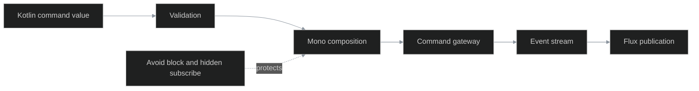
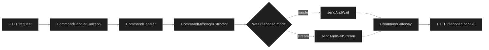
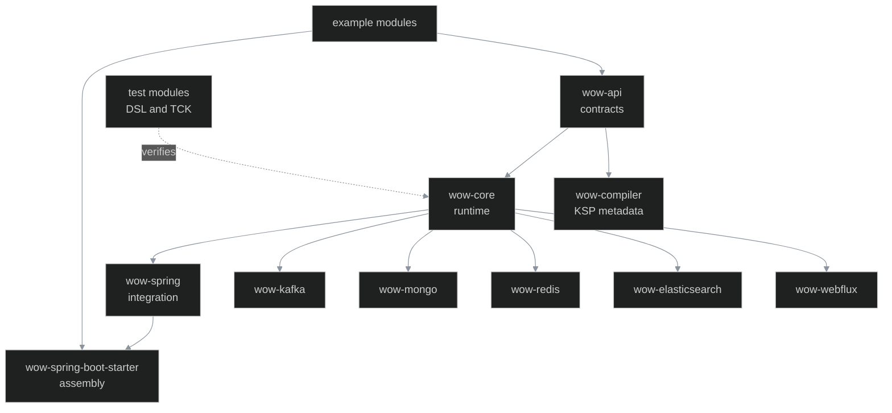
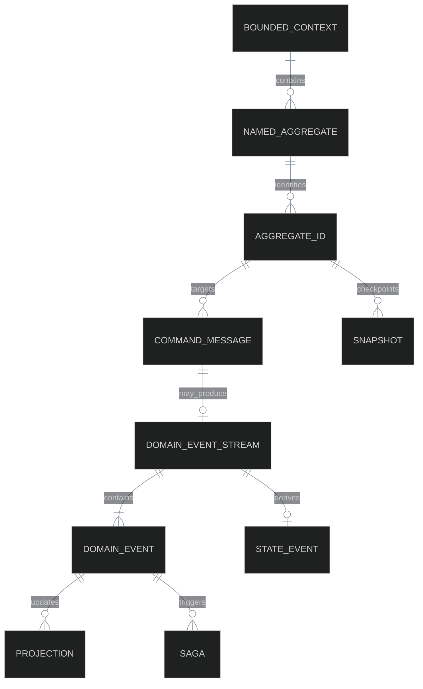
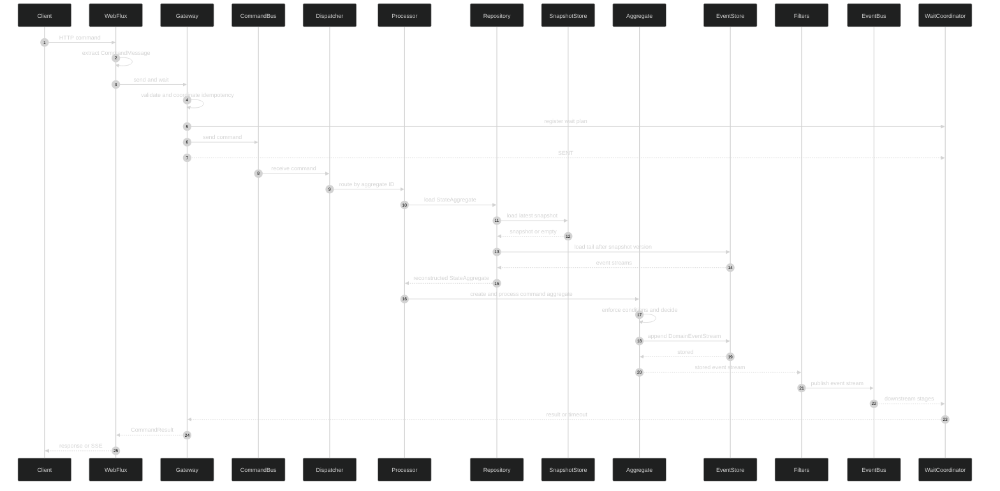
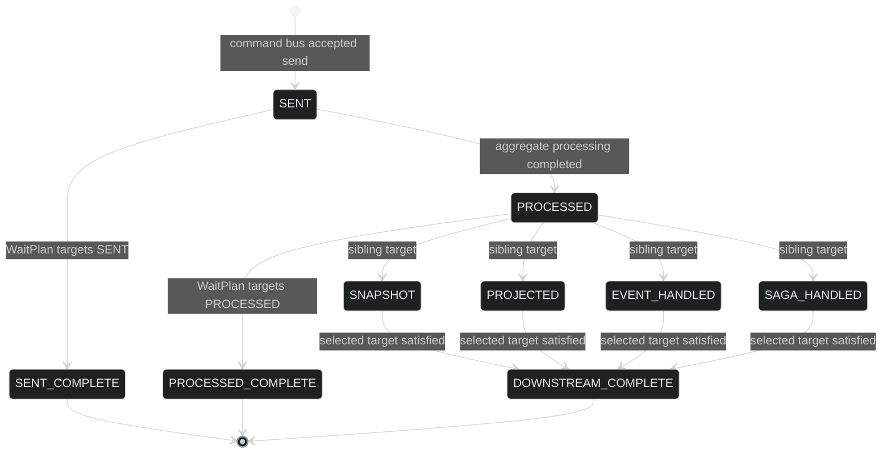
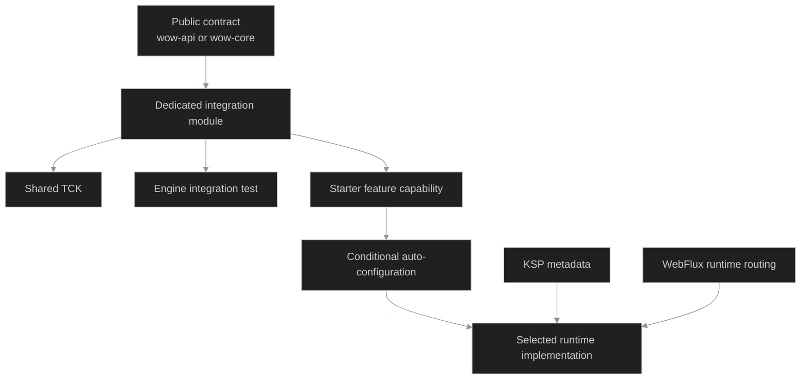
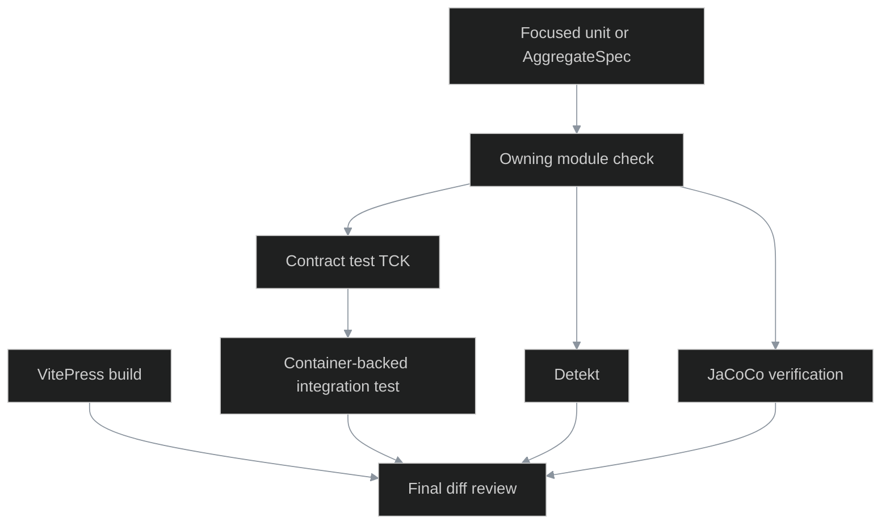
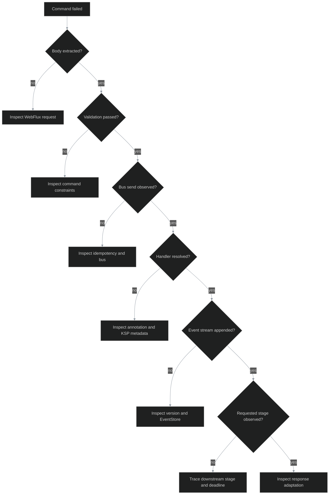

# Contributor Guide

This guide takes you from a clean checkout to a small, tested Wow contribution.

It is written for Kotlin contributors who may be arriving from Java, Python, JavaScript, or another reactive stack.

Every repository-specific claim links to the current `main` branch.

If this guide and the source disagree, trust the source and update the guide in the same change.

## What you will be able to do

After completing the guide, you should be able to:

- identify the module that owns a contract or behavior;
- read a Wow command, event, aggregate, state, and specification as one vertical slice;
- trace a WebFlux command from HTTP input to event persistence and downstream publication;
- choose between local, contract, integration, static-analysis, and documentation checks;
- add a domain behavior without leaking infrastructure into the domain module;
- diagnose common validation, routing, storage, metadata, and timeout failures;
- prepare a focused change that is straightforward to review and revert.

## The current baseline

Use the repository wrapper and toolchain rather than installing arbitrary global versions.

| Component | Repository baseline | Source |
| --- | --- | --- |
| Wow | `8.10.3` | [`gradle.properties`](https://github.com/Ahoo-Wang/Wow/blob/main/gradle.properties#L18-L23) |
| Kotlin | `2.4.10` | [version catalog](https://github.com/Ahoo-Wang/Wow/blob/main/gradle/libs.versions.toml#L23-L35) |
| Spring Boot | `4.1.0` | [version catalog](https://github.com/Ahoo-Wang/Wow/blob/main/gradle/libs.versions.toml#L1-L5) |
| Gradle | `9.6.1` | [wrapper properties](https://github.com/Ahoo-Wang/Wow/blob/main/gradle/wrapper/gradle-wrapper.properties#L1-L9) |
| JVM toolchain | Java `17` | [root build](https://github.com/Ahoo-Wang/Wow/blob/main/build.gradle.kts#L175-L190) |
| JUnit | `6.1.2` | [version catalog](https://github.com/Ahoo-Wang/Wow/blob/main/gradle/libs.versions.toml#L23-L27) |
| KSP | `2.3.10` | [version catalog](https://github.com/Ahoo-Wang/Wow/blob/main/gradle/libs.versions.toml#L31-L35) |

The README also states that Wow 8 targets Spring Boot 4 and Java 17 or later.
Treat the build files above as the more precise source when versions move.
[See the compatibility statement.](https://github.com/Ahoo-Wang/Wow/blob/main/README.md#L41-L49)

## Part I — Foundations

### 1. Kotlin for contributors coming from Python or JavaScript

Kotlin is statically typed, null-aware, expression-oriented, and compiled for the JVM in this repository.

The repository enables the official Kotlin code style and the K2-based KSP pipeline in [`gradle.properties`](https://github.com/Ahoo-Wang/Wow/blob/main/gradle.properties#L18-L23).

Use this concrete translation table when arriving from Python or JavaScript:

| Concern | Python | JavaScript / TypeScript | Kotlin in Wow |
| --- | --- | --- | --- |
| Immutable binding | Convention only, for example `product_id = "p1"` | `const productId = "p1"` | `val productId = "p1"` |
| Mutable binding | `quantity = quantity + 1` | `let quantity = 1` | `var quantity = 1` |
| Value-shaped message | `@dataclass class AddItem: ...` | `type AddItem = { ... }` | `data class AddCartItem(...)` |
| Nullable value | `str \| None` | `string \| null` | `String?`; `String` excludes `null` |
| Closed result cases | `match` plus class convention | discriminated union | `sealed interface` plus exhaustive `when` |
| Read-only collection boundary | `Sequence[T]` by convention | `ReadonlyArray<T>` | `List<T>` is read-only at the interface |
| One asynchronous value | coroutine / `Awaitable[T]` | `Promise<T>` | Reactor `Mono<T>` |
| Many asynchronous values | async iterator | async iterator / stream | Reactor `Flux<T>` |
| Dependency declaration | `pyproject.toml` | `package.json` | `build.gradle.kts` plus centralized `gradle/libs.versions.toml` |
| Reproducible build entry | project-specific Python tool | package-manager lockfile and scripts | checked-in `./gradlew` wrapper |

The Kotlin examples below expand the rightmost column. The Python and JavaScript cells are migration cues, not source files to add to this repository.

#### 1.1 Values, variables, and inferred types

Prefer `val` for immutable references.

Use `var` only when the reference must change.

```kotlin
val productId = "product-1"
val initialQuantity: Int = 1
var remainingQuantity = initialQuantity
remainingQuantity -= 1
```

Python and JavaScript infer types dynamically at runtime.

Kotlin usually infers them at compile time.

That distinction means refactoring tools and the compiler can catch many mismatches before a test runs.

#### 1.2 Data classes model value-shaped messages

Wow commands and events are commonly Kotlin data classes.

The real cart example declares an `AddCartItem` command and `CartItemAdded` event in the API module, with Jakarta validation attached to command properties.
[Read the source.](https://github.com/Ahoo-Wang/Wow/blob/main/example/example-api/src/main/kotlin/me/ahoo/wow/example/api/cart/AddCartItem.kt#L1-L26)

```kotlin
data class AddCartItem(
    val productId: String,
    val quantity: Int,
)

data class CartItemAdded(
    val productId: String,
    val quantity: Int,
)
```

The simplified snippet shows the shape.

The repository source remains authoritative for annotations and validation constraints.

#### 1.3 Null is part of the type

`String` does not accept `null`.

`String?` does.

```kotlin
fun normalizeOwnerId(ownerId: String?): String? = ownerId?.trim()?.takeIf { it.isNotEmpty() }
```

Use safe calls, Elvis expressions, and explicit branching.

Avoid `!!` unless an invariant is both local and already proven.

#### 1.4 Functions can return expressions

```kotlin
fun nextQuantity(current: Int, delta: Int): Int = current + delta
```

Aggregate command handlers often return domain events rather than mutating stored infrastructure directly.

The cart aggregate follows that pattern: handlers evaluate state and return `CartItemAdded`, `CartQuantityChanged`, or `CartItemRemoved`.
[Read the aggregate handlers.](https://github.com/Ahoo-Wang/Wow/blob/main/example/example-domain/src/main/kotlin/me/ahoo/wow/example/domain/cart/Cart.kt#L32-L76)

#### 1.5 Classes expose intent through constructors

Constructor injection makes dependencies visible.

The Spring application uses normal component scanning and Spring Boot startup, while framework auto-configuration creates runtime beans conditionally.
[See `ExampleServer`.](https://github.com/Ahoo-Wang/Wow/blob/main/example/example-server/src/main/kotlin/me/ahoo/wow/example/server/ExampleServer.kt#L16-L35)
[See command auto-configuration.](https://github.com/Ahoo-Wang/Wow/blob/main/wow-spring-boot-starter/src/main/kotlin/me/ahoo/wow/spring/boot/starter/command/CommandAutoConfiguration.kt#L38-L100)

```kotlin
class ProductPolicy(
    private val catalog: ProductCatalog,
) {
    fun isKnown(productId: String): Boolean = catalog.contains(productId)
}
```

Keep domain dependencies focused.

Do not inject a database client into an aggregate merely because Spring can provide it.

#### 1.6 Extension functions keep domain tests readable

Kotlin lets a function appear as though it belongs to a receiver type.

Wow tests use extensions such as the FluentAssert `.assert()` style described by the repository conventions.

```kotlin
fun Int.requirePositive(): Int {
    require(this > 0)
    return this
}
```

Extensions do not actually add members to the target class.

Use them to improve a local vocabulary, not to hide surprising control flow.

#### 1.7 Sealed types and exhaustive branches

Use sealed hierarchies when a domain result has a closed set of cases.

```kotlin
sealed interface CartDecision

data class Accepted(val event: Any) : CartDecision

data class Rejected(val reason: String) : CartDecision

fun describe(decision: CartDecision): String = when (decision) {
    is Accepted -> "accepted"
    is Rejected -> decision.reason
}
```

The compiler verifies that the `when` expression covers every known subtype.

#### 1.8 Collections and immutability

Use read-only collection interfaces at boundaries when mutation is not part of the contract.

Write generic types as code, for example `List<CartItem>`.

```kotlin
fun productIds(items: List<CartItem>): Set<String> = items.mapTo(mutableSetOf()) { it.productId }
```

The type being read-only does not prove the underlying object is deeply immutable.

Keep ownership clear and avoid exposing a mutable internal collection.

#### 1.9 Reactor is the default asynchronous vocabulary

Wow runtime paths use Reactor `Mono` and `Flux`.

Do not insert blocking calls into command dispatch, event persistence, projection, saga, or transport flows.

`Mono<T>` represents zero or one asynchronous value.

`Flux<T>` represents zero to many asynchronous values.

```kotlin
fun loadCart(cartId: String): Mono<CartView> = repository.load(cartId)

fun streamEvents(cartId: String): Flux<CartEvent> = eventStore.load(cartId)
```

The types in this conceptual snippet are illustrative.

The real command gateway exposes both `Mono` and `Flux` wait forms and delegates to the command bus.
[Read the gateway contract.](https://github.com/Ahoo-Wang/Wow/blob/main/wow-core/src/main/kotlin/me/ahoo/wow/command/CommandGateway.kt#L63-L173)

#### 1.10 Think in transformations, not subscriptions

Framework code should usually compose operators and return the pipeline.

The edge of the application owns subscription.

```kotlin
fun validateThenSend(command: CommandMessage<*>): Mono<Void> =
    validator.validate(command)
        .then(commandBus.send(command))
```

Do not call `block()` in a reactive runtime path.

Do not call `subscribe()` inside reusable domain or infrastructure code unless that code explicitly owns lifecycle and cancellation.


```mermaid
%%{init: {"theme": "dark", "themeVariables": {"primaryColor": "#2d333b", "primaryBorderColor": "#6d5dfc", "primaryTextColor": "#e6edf3", "lineColor": "#8b949e", "secondaryColor": "#161b22", "tertiaryColor": "#161b22", "clusterBkg": "#161b22", "clusterBorder": "#30363d"}}}%%
flowchart LR
    A["Kotlin command value"] --> B["Validation"]
    B --> C["Mono composition"]
    C --> D["Command gateway"]
    D --> E["Event stream"]
    E --> F["Flux publication"]
    G["Avoid block and hidden subscribe"] -. protects .-> C
```
<!-- Sources:
- [example/example-api/src/main/kotlin/me/ahoo/wow/example/api/cart/AddCartItem.kt:1-26](https://github.com/Ahoo-Wang/Wow/blob/main/example/example-api/src/main/kotlin/me/ahoo/wow/example/api/cart/AddCartItem.kt#L1-L26)
- [wow-core/src/main/kotlin/me/ahoo/wow/command/CommandGateway.kt:63-173](https://github.com/Ahoo-Wang/Wow/blob/main/wow-core/src/main/kotlin/me/ahoo/wow/command/CommandGateway.kt#L63-L173)
- [wow-core/src/main/kotlin/me/ahoo/wow/command/DefaultCommandGateway.kt:79-143](https://github.com/Ahoo-Wang/Wow/blob/main/wow-core/src/main/kotlin/me/ahoo/wow/command/DefaultCommandGateway.kt#L79-L143)
-->

### 2. Spring essentials in Wow

Spring is the assembly mechanism around the runtime.

Domain behavior should remain legible without knowing which auto-configuration created a bean.

For contributors coming from FastAPI or Express, map the responsibilities like this:

| Concern | FastAPI | Express | Spring/Wow |
| --- | --- | --- | --- |
| Application bootstrap | create a `FastAPI` application | create an `express()` application | `@SpringBootApplication` plus `runApplication` |
| Route declaration | path-operation decorator | `app.post(...)` or Router | `RouterSpecs` contracts materialized as WebFlux `RouterFunction` |
| Request pipeline | ASGI middleware and dependencies | middleware chain | WebFlux handler, extractor, policies, then `CommandGateway` |
| Dependency injection | `Depends(...)` | usually explicit wiring or a third-party container | constructor injection plus conditional Spring beans |
| Configuration | settings objects and environment | environment/config library | `application.yaml`, typed properties, and auto-configuration conditions |
| Asynchronous model | coroutine returned by handler | Promise returned by handler | Reactor `Mono`/`Flux`; return the pipeline without blocking |

Unlike a hand-written Express route, a Wow command route is derived from aggregate and command metadata, converted into route contracts, and only then materialized by WebFlux. Keep domain decisions outside that transport pipeline.

#### 2.1 Application bootstrap

The sample server uses `@SpringBootApplication` and starts through `runApplication`.

It explicitly scans the example service namespace and Wow namespace.
[See the complete bootstrap.](https://github.com/Ahoo-Wang/Wow/blob/main/example/example-server/src/main/kotlin/me/ahoo/wow/example/server/ExampleServer.kt#L16-L35)

```kotlin
@SpringBootApplication
class ExampleServer

fun main(args: Array<String>) {
    runApplication<ExampleServer>(*args)
}
```

This snippet teaches the Spring shape.

Copy the real annotations and scan configuration from the source when creating a runnable module.

#### 2.2 Auto-configuration is capability-based

`wow-spring-boot-starter` exposes feature variants for MongoDB, Redis, mocks, Kafka, WebFlux, Elasticsearch, OpenTelemetry, OpenAPI, and CoSec.
[See the declared capabilities.](https://github.com/Ahoo-Wang/Wow/blob/main/wow-spring-boot-starter/build.gradle.kts#L5-L44)

The starter registers its auto-configurations through Spring Boot's imports file.
[See the imports.](https://github.com/Ahoo-Wang/Wow/blob/main/wow-spring-boot-starter/src/main/resources/META-INF/spring/org.springframework.boot.autoconfigure.AutoConfiguration.imports#L1-L31)

Choose the smallest feature set that owns the needed integration.

Adding an infrastructure dependency to the domain module is usually a boundary smell.

#### 2.3 Conditional beans preserve replaceable boundaries

Auto-configuration creates defaults only when properties and classpath capabilities select them.

The command configuration conditionally assembles local bus variants, builder rewriters, validation, and message creation.
[Inspect the command conditions and bean factories.](https://github.com/Ahoo-Wang/Wow/blob/main/wow-spring-boot-starter/src/main/kotlin/me/ahoo/wow/spring/boot/starter/command/CommandAutoConfiguration.kt#L38-L100)

The separate gateway configuration assembles idempotency, wait coordination, stage notifiers, and `DefaultCommandGateway`.
[Inspect gateway assembly.](https://github.com/Ahoo-Wang/Wow/blob/main/wow-spring-boot-starter/src/main/kotlin/me/ahoo/wow/spring/boot/starter/command/CommandGatewayAutoConfiguration.kt#L51-L163)

Before creating another bean:

1. search for the interface;
2. find existing implementations;
3. inspect conditional annotations;
4. check property binding;
5. check the auto-configuration imports file;
6. add a replacement only at the owning integration boundary.

#### 2.4 Configuration is executable behavior

The example server currently selects MongoDB event and snapshot storage while using in-memory buses.
[Read the active example configuration.](https://github.com/Ahoo-Wang/Wow/blob/main/example/example-server/src/main/resources/application.yaml#L73-L99)

Do not infer a production topology from that example.

The file is evidence of the sample's local wiring, not a universal deployment recommendation.

#### 2.5 WebFlux adapts HTTP to the command model

The WebFlux handler reads the request body, rejects an empty body, delegates to the command handler, and writes the response.
[Read `CommandHandlerFunction`.](https://github.com/Ahoo-Wang/Wow/blob/main/wow-webflux/src/main/kotlin/me/ahoo/wow/webflux/route/command/CommandHandlerFunction.kt#L43-L66)

The extractor turns headers, path information, and body content into a `CommandMessage`.
[Read the extractor.](https://github.com/Ahoo-Wang/Wow/blob/main/wow-webflux/src/main/kotlin/me/ahoo/wow/webflux/route/command/extractor/CommandMessageExtractor.kt#L23-L46)

The transport handler chooses a wait policy and either an SSE or single-result response.
[Read the transport handler.](https://github.com/Ahoo-Wang/Wow/blob/main/wow-webflux/src/main/kotlin/me/ahoo/wow/webflux/route/command/CommandHandler.kt#L30-L62)


```mermaid
%%{init: {"theme": "dark", "themeVariables": {"primaryColor": "#2d333b", "primaryBorderColor": "#6d5dfc", "primaryTextColor": "#e6edf3", "lineColor": "#8b949e", "secondaryColor": "#161b22", "tertiaryColor": "#161b22", "clusterBkg": "#161b22", "clusterBorder": "#30363d"}}}%%
flowchart LR
    R["HTTP request"] --> F["CommandHandlerFunction"]
    F --> H["CommandHandler"]
    H --> X["CommandMessageExtractor"]
    X --> W{"Wait response mode"}
    W -->|"single"| M["sendAndWait"]
    W -->|"stream"| S["sendAndWaitStream"]
    M --> G["CommandGateway"]
    S --> G
    G --> O["HTTP response or SSE"]
```
<!-- Sources:
- [wow-webflux/src/main/kotlin/me/ahoo/wow/webflux/route/command/CommandHandlerFunction.kt:43-66](https://github.com/Ahoo-Wang/Wow/blob/main/wow-webflux/src/main/kotlin/me/ahoo/wow/webflux/route/command/CommandHandlerFunction.kt#L43-L66)
- [wow-webflux/src/main/kotlin/me/ahoo/wow/webflux/route/command/extractor/CommandMessageExtractor.kt:23-46](https://github.com/Ahoo-Wang/Wow/blob/main/wow-webflux/src/main/kotlin/me/ahoo/wow/webflux/route/command/extractor/CommandMessageExtractor.kt#L23-L46)
- [wow-webflux/src/main/kotlin/me/ahoo/wow/webflux/route/command/CommandHandler.kt:30-62](https://github.com/Ahoo-Wang/Wow/blob/main/wow-webflux/src/main/kotlin/me/ahoo/wow/webflux/route/command/CommandHandler.kt#L30-L62)
-->

## Part II — Understand the codebase

### 3. What Wow is

Wow provides framework contracts and runtime components for domain-driven design, CQRS, and event sourcing.

The project describes itself as a modern reactive framework with command, event, projection, saga, storage, and integration capabilities.
[Read the project overview and feature list.](https://github.com/Ahoo-Wang/Wow/blob/main/README.md#L51-L84)

The central contributor idea is separation of responsibility:

- API modules define commands, events, and public domain contracts;
- domain modules implement decisions and event-sourced state transitions;
- core modules provide runtime behavior;
- Spring modules assemble runtime components;
- infrastructure modules adapt storage and transports;
- test modules provide DSLs, TCKs, and integration support;
- example modules demonstrate complete vertical slices.

### 4. Repository structure

The authoritative project list lives in [`settings.gradle.kts`](https://github.com/Ahoo-Wang/Wow/blob/main/settings.gradle.kts#L23-L85).

There are four useful groups.

#### 4.1 Framework and integration modules

| Area | Representative modules | Responsibility |
| --- | --- | --- |
| API | `wow-api` | Pure contracts, annotations, command/event types, naming, modeling. |
| Runtime | `wow-core` | Dispatch, event sourcing, buses, projection, saga, lifecycle. |
| Compiler | `wow-compiler` | KSP processors and framework metadata generation. |
| Spring | `wow-spring`, `wow-spring-boot-starter` | Integration primitives and conditional assembly. |
| Query | `wow-query` | Query model support. |
| Storage | `wow-mongo`, `wow-redis`, `wow-elasticsearch` | Event and snapshot persistence adapters; Elasticsearch also supplies event-stream and snapshot queries. |
| Messaging | `wow-kafka` | Distributed command and event bus integration. |
| Projection and cache | `wow-elasticsearch`, `wow-cocache` | Elasticsearch-backed query/projection support and projection caching. |
| Transport | `wow-webflux`, `wow-apiclient` | HTTP command endpoints and API client support. |
| Cross-cutting | `wow-opentelemetry`, `wow-cosec` | Telemetry and authorization. |
| Schema | `wow-openapi`, `wow-schema` | OpenAPI and JSON Schema support. |
| BI | `wow-bi` | BI synchronization script generation. |
| Dependency management | `wow-bom`, `wow-dependencies` | Published version alignment. |

The table summarizes module intent.

Verify exact inclusion and directory mapping in the settings file before editing build logic.

#### 4.2 Test modules

The settings file includes test DSLs, test support, storage and bus TCKs, mocks, benchmarks, integration tests, and aggregate coverage reporting.
[See the test-module declarations.](https://github.com/Ahoo-Wang/Wow/blob/main/settings.gradle.kts#L46-L56)

Use a TCK when several implementations must satisfy the same contract.

Use an integration test when the behavior depends on a real external engine or container.

#### 4.3 Compensation modules

The compensation area has API, domain, core, server, and dashboard projects.
[See the compensation declarations.](https://github.com/Ahoo-Wang/Wow/blob/main/settings.gradle.kts#L58-L66)

Treat it as a product-shaped subsystem with its own boundaries.

Do not use compensation implementation detail as a default core contract without an explicit architecture decision.

#### 4.4 Example modules

The examples include a Kotlin domain/server and a Java transfer domain/server.
[See the example declarations.](https://github.com/Ahoo-Wang/Wow/blob/main/settings.gradle.kts#L68-L85)

The Kotlin cart example is the best first vertical slice because its command, event, aggregate, state, saga, and tests are small and connected.


```mermaid
%%{init: {"theme": "dark", "themeVariables": {"primaryColor": "#2d333b", "primaryBorderColor": "#6d5dfc", "primaryTextColor": "#e6edf3", "lineColor": "#8b949e", "secondaryColor": "#161b22", "tertiaryColor": "#161b22", "clusterBkg": "#161b22", "clusterBorder": "#30363d"}}}%%
graph TB
    API["wow-api<br>contracts"] --> CORE["wow-core<br>runtime"]
    CORE --> SPRING["wow-spring<br>integration"]
    SPRING --> STARTER["wow-spring-boot-starter<br>assembly"]
    CORE --> KAFKA["wow-kafka"]
    CORE --> MONGO["wow-mongo"]
    CORE --> REDIS["wow-redis"]
    CORE --> ES["wow-elasticsearch"]
    CORE --> WEB["wow-webflux"]
    API --> COMPILER["wow-compiler<br>KSP metadata"]
    TEST["test modules<br>DSL and TCK"] -. verifies .-> CORE
    EXAMPLE["example modules"] --> STARTER
    EXAMPLE --> API
```
<!-- Sources:
- [settings.gradle.kts:23-85](https://github.com/Ahoo-Wang/Wow/blob/main/settings.gradle.kts#L23-L85)
- [wow-spring-boot-starter/build.gradle.kts:5-79](https://github.com/Ahoo-Wang/Wow/blob/main/wow-spring-boot-starter/build.gradle.kts#L5-L79)
- [example/example-domain/build.gradle.kts:1-20](https://github.com/Ahoo-Wang/Wow/blob/main/example/example-domain/build.gradle.kts#L1-L20)
-->

### 5. Core concepts

#### 5.1 Bounded context and named aggregate

A bounded context gives names a domain boundary.

`NamedBoundedContext` exposes the bounded-context name.
[Read the contract.](https://github.com/Ahoo-Wang/Wow/blob/main/wow-api/src/main/kotlin/me/ahoo/wow/api/naming/NamedBoundedContext.kt#L15-L36)

`NamedAggregate` identifies an aggregate name within that context.
[Read the contract.](https://github.com/Ahoo-Wang/Wow/blob/main/wow-api/src/main/kotlin/me/ahoo/wow/api/modeling/NamedAggregate.kt#L20-L49)

The example declares a service context in its API and a bounded-context marker in its domain.
[See `ExampleService`.](https://github.com/Ahoo-Wang/Wow/blob/main/example/example-api/src/main/kotlin/me/ahoo/wow/example/api/ExampleService.kt#L22-L40)
[See `ExampleBoundedContext`.](https://github.com/Ahoo-Wang/Wow/blob/main/example/example-domain/src/main/kotlin/me/ahoo/wow/example/domain/ExampleBoundedContext.kt#L19-L21)

#### 5.2 Aggregate identity

`AggregateId` combines the named aggregate, the aggregate `id`, and `tenantId`.

Owner and space are related message and aggregate-state context, but they are not fields of the `AggregateId` contract.

The contract states that an aggregate ID is unique across tenants for the same named aggregate.
[Read the identity contract.](https://github.com/Ahoo-Wang/Wow/blob/main/wow-api/src/main/kotlin/me/ahoo/wow/api/modeling/AggregateId.kt#L18-L45)

Do not treat `tenantId` as a namespace that permits the same `id` to be reused inside one named aggregate.

#### 5.3 Command and command message

A command expresses requested intent.

A `CommandMessage` wraps that intent with identity, routing, headers, aggregate version, and lifecycle flags.
[Read the message contract.](https://github.com/Ahoo-Wang/Wow/blob/main/wow-api/src/main/kotlin/me/ahoo/wow/api/command/CommandMessage.kt#L24-L61)
[Read the targeting and version fields.](https://github.com/Ahoo-Wang/Wow/blob/main/wow-api/src/main/kotlin/me/ahoo/wow/api/command/CommandMessage.kt#L70-L125)

The message can indicate creation, expected aggregate version, and void behavior.

Those fields participate in correctness and should not be dropped by adapters.

#### 5.4 Domain event and event stream

A domain event records a business fact that has happened.

`DomainEvent` carries sequence, revision, command, aggregate, and metadata context.
[Read the event contract.](https://github.com/Ahoo-Wang/Wow/blob/main/wow-api/src/main/kotlin/me/ahoo/wow/api/event/DomainEvent.kt#L21-L50)
[Read sequence and revision fields.](https://github.com/Ahoo-Wang/Wow/blob/main/wow-api/src/main/kotlin/me/ahoo/wow/api/event/DomainEvent.kt#L57-L89)

`DomainEventStream` groups events produced by one command.

Its implementation enforces stream-level invariants, including command identity and aggregate context.
[Read the stream contract and invariants.](https://github.com/Ahoo-Wang/Wow/blob/main/wow-core/src/main/kotlin/me/ahoo/wow/event/DomainEventStream.kt#L31-L115)

#### 5.5 Event store

`EventStore` appends a domain event stream and loads streams for an aggregate.
[Read the storage contract.](https://github.com/Ahoo-Wang/Wow/blob/main/wow-core/src/main/kotlin/me/ahoo/wow/eventsourcing/EventStore.kt#L22-L82)

Optimistic concurrency and duplicate-stream failures belong to this boundary.

Do not convert them into successful writes at an adapter edge.

#### 5.6 State sourcing and snapshots

The state aggregate applies domain events to rebuild state.

The contract advances version even when no sourcing handler is present, so absence of a handler is not equivalent to ignoring event position.
[Read `StateAggregate`.](https://github.com/Ahoo-Wang/Wow/blob/main/wow-core/src/main/kotlin/me/ahoo/wow/modeling/state/StateAggregate.kt#L17-L31)

The repository can load a snapshot and replay later events.
[Read the repository implementation.](https://github.com/Ahoo-Wang/Wow/blob/main/wow-core/src/main/kotlin/me/ahoo/wow/eventsourcing/EventSourcingStateAggregateRepository.kt#L25-L45)

A snapshot captures aggregate state at a version.
[Read the snapshot contract.](https://github.com/Ahoo-Wang/Wow/blob/main/wow-core/src/main/kotlin/me/ahoo/wow/eventsourcing/snapshot/Snapshot.kt#L20-L41)

#### 5.7 State events

A state event is derived after domain event sourcing and can represent the resulting state transition for downstream consumers.
[Read `StateEvent`.](https://github.com/Ahoo-Wang/Wow/blob/main/wow-core/src/main/kotlin/me/ahoo/wow/eventsourcing/state/StateEvent.kt#L23-L100)

The state-event filter creates and publishes state events after processing the event stream.
[Read the filter.](https://github.com/Ahoo-Wang/Wow/blob/main/wow-core/src/main/kotlin/me/ahoo/wow/eventsourcing/state/SendStateEventFilter.kt#L29-L76)

#### 5.8 Projection, event processor, and saga

An event processor reacts to domain events.
[Read the `@EventProcessor` annotation.](https://github.com/Ahoo-Wang/Wow/blob/main/wow-api/src/main/kotlin/me/ahoo/wow/api/annotation/EventProcessor.kt#L19-L58)

A projection processor builds read-side views.
[Read the `@ProjectionProcessor` annotation.](https://github.com/Ahoo-Wang/Wow/blob/main/wow-api/src/main/kotlin/me/ahoo/wow/api/annotation/ProjectionProcessor.kt#L19-L68)

A stateless saga coordinates a reaction without retaining saga state in the annotated type.

The cart example listens for `OrderCreated`. When the order was created from a cart, it emits `RemoveCartItem` for the purchased products and targets the cart through `event.ownerId`.

`@Retry` configures retries around execution of the saga handler. It is not metadata attached to the emitted command.
[Read `CartSaga`.](https://github.com/Ahoo-Wang/Wow/blob/main/example/example-domain/src/main/kotlin/me/ahoo/wow/example/domain/cart/CartSaga.kt#L25-L42)


```mermaid
%%{init: {"theme": "dark", "themeVariables": {"primaryColor": "#2d333b", "primaryBorderColor": "#6d5dfc", "primaryTextColor": "#e6edf3", "lineColor": "#8b949e", "secondaryColor": "#161b22", "tertiaryColor": "#161b22", "clusterBkg": "#161b22", "clusterBorder": "#30363d"}}}%%
erDiagram
    BOUNDED_CONTEXT ||--o{ NAMED_AGGREGATE : contains
    NAMED_AGGREGATE ||--o{ AGGREGATE_ID : identifies
    AGGREGATE_ID ||--o{ COMMAND_MESSAGE : targets
    COMMAND_MESSAGE ||--o| DOMAIN_EVENT_STREAM : may_produce
    DOMAIN_EVENT_STREAM ||--|{ DOMAIN_EVENT : contains
    AGGREGATE_ID ||--o{ SNAPSHOT : checkpoints
    DOMAIN_EVENT_STREAM ||--o| STATE_EVENT : derives
    DOMAIN_EVENT ||--o{ PROJECTION : updates
    DOMAIN_EVENT ||--o{ SAGA : triggers
```
<!-- Sources:
- [wow-api/src/main/kotlin/me/ahoo/wow/api/modeling/AggregateId.kt:18-45](https://github.com/Ahoo-Wang/Wow/blob/main/wow-api/src/main/kotlin/me/ahoo/wow/api/modeling/AggregateId.kt#L18-L45)
- [wow-api/src/main/kotlin/me/ahoo/wow/api/command/CommandMessage.kt:24-125](https://github.com/Ahoo-Wang/Wow/blob/main/wow-api/src/main/kotlin/me/ahoo/wow/api/command/CommandMessage.kt#L24-L125)
- [wow-core/src/main/kotlin/me/ahoo/wow/event/DomainEventStream.kt:31-115](https://github.com/Ahoo-Wang/Wow/blob/main/wow-core/src/main/kotlin/me/ahoo/wow/event/DomainEventStream.kt#L31-L115)
- [wow-core/src/main/kotlin/me/ahoo/wow/eventsourcing/snapshot/Snapshot.kt:20-41](https://github.com/Ahoo-Wang/Wow/blob/main/wow-core/src/main/kotlin/me/ahoo/wow/eventsourcing/snapshot/Snapshot.kt#L20-L41)
- [wow-core/src/main/kotlin/me/ahoo/wow/eventsourcing/state/StateEvent.kt:23-100](https://github.com/Ahoo-Wang/Wow/blob/main/wow-core/src/main/kotlin/me/ahoo/wow/eventsourcing/state/StateEvent.kt#L23-L100)
- [wow-api/src/main/kotlin/me/ahoo/wow/api/annotation/ProjectionProcessor.kt:19-68](https://github.com/Ahoo-Wang/Wow/blob/main/wow-api/src/main/kotlin/me/ahoo/wow/api/annotation/ProjectionProcessor.kt#L19-L68)
- [wow-api/src/main/kotlin/me/ahoo/wow/api/annotation/StatelessSaga.kt:19-62](https://github.com/Ahoo-Wang/Wow/blob/main/wow-api/src/main/kotlin/me/ahoo/wow/api/annotation/StatelessSaga.kt#L19-L62)
-->

### 6. The command lifecycle

The following trace is the most useful runtime map for a contributor.

#### 6.1 HTTP adaptation

`CommandHandlerFunction` reads and validates the presence of a body.

`CommandMessageExtractor` constructs framework metadata from the request.

`CommandHandler` selects a wait plan and response form.

#### 6.2 Gateway validation and idempotency

`DefaultCommandGateway` validates the command and runs idempotency coordination before sending it.
[Read validation, idempotency, and bus dispatch.](https://github.com/Ahoo-Wang/Wow/blob/main/wow-core/src/main/kotlin/me/ahoo/wow/command/DefaultCommandGateway.kt#L79-L143)

Duplicate request identity is a correctness condition, not merely a logging concern.

The gateway rejects a duplicate request ID for the same aggregate.
[Read the duplicate request exception contract.](https://github.com/Ahoo-Wang/Wow/blob/main/wow-core/src/main/kotlin/me/ahoo/wow/command/CommandExceptions.kt#L25-L35)

#### 6.3 Dispatch and aggregate affinity

`CommandDispatcher` receives commands from the bus and selects the named aggregate dispatcher.
[Read the dispatcher.](https://github.com/Ahoo-Wang/Wow/blob/main/wow-core/src/main/kotlin/me/ahoo/wow/modeling/command/dispatcher/CommandDispatcher.kt#L37-L75)

`AggregateCommandDispatcher` routes work by aggregate ID so commands for the same aggregate preserve worker affinity.
[Read aggregate dispatch.](https://github.com/Ahoo-Wang/Wow/blob/main/wow-core/src/main/kotlin/me/ahoo/wow/modeling/command/dispatcher/AggregateCommandDispatcher.kt#L25-L86)

Spring assembly creates the processor, filter chain, handler, and dispatcher.
[Read aggregate auto-configuration.](https://github.com/Ahoo-Wang/Wow/blob/main/wow-spring-boot-starter/src/main/kotlin/me/ahoo/wow/spring/boot/starter/modeling/AggregateAutoConfiguration.kt#L70-L145)

#### 6.4 Decision, sourcing, and append

The processor filter obtains a command aggregate processor and executes the exchange.
[Read the processor filter.](https://github.com/Ahoo-Wang/Wow/blob/main/wow-core/src/main/kotlin/me/ahoo/wow/modeling/command/dispatcher/AggregateProcessorFilter.kt#L26-L49)

`RetryableAggregateProcessor` asks the state repository to load the aggregate. `EventSourcingStateAggregateRepository` first tries the snapshot store, then replays the remaining event streams from the event store before a command aggregate is created.
[Read processor loading.](https://github.com/Ahoo-Wang/Wow/blob/main/wow-core/src/main/kotlin/me/ahoo/wow/modeling/command/RetryableAggregateProcessor.kt#L48-L68)
[Read snapshot-first reconstruction.](https://github.com/Ahoo-Wang/Wow/blob/main/wow-core/src/main/kotlin/me/ahoo/wow/eventsourcing/EventSourcingStateAggregateRepository.kt#L74-L107)

`SimpleCommandAggregate` resolves the command handler, enforces aggregate conditions, invokes domain behavior, sources the returned events, and appends the event stream.
[Read the decision path.](https://github.com/Ahoo-Wang/Wow/blob/main/wow-core/src/main/kotlin/me/ahoo/wow/modeling/command/SimpleCommandAggregate.kt#L64-L132)

The command aggregate records processing states such as stored, sourced, and expired.
[Read the aggregate command-state transitions.](https://github.com/Ahoo-Wang/Wow/blob/main/wow-core/src/main/kotlin/me/ahoo/wow/modeling/command/CommandAggregate.kt#L55-L84)

#### 6.5 Publication and wait completion

After append, the domain-event filter publishes the stream to the domain event bus.
[Read the publication filter.](https://github.com/Ahoo-Wang/Wow/blob/main/wow-core/src/main/kotlin/me/ahoo/wow/modeling/command/dispatcher/SendDomainEventStreamFilter.kt#L25-L46)

The state-event filter publishes the sourced state transition.

The wait coordinator observes requested stages and completes the transport-facing result.

The stage model declares dependencies between `SENT`, `PROCESSED`, `SNAPSHOT`, `PROJECTED`, `EVENT_HANDLED`, and `SAGA_HANDLED`.
[Read the stage dependencies.](https://github.com/Ahoo-Wang/Wow/blob/main/wow-core/src/main/kotlin/me/ahoo/wow/command/wait/CommandStage.kt#L25-L123)

A wait plan can complete directly at `SENT` or `PROCESSED`. `SNAPSHOT`, `PROJECTED`, `EVENT_HANDLED`, and `SAGA_HANDLED` are sibling targets that share the first two prerequisites; they are not a mandatory sequence traversed by every command.

#### 6.6 Deadline and cancellation ownership

Streaming waits use `Flux.using` and single-result waits use `Mono.using` so coordinator resources are released.
[Read streaming wait ownership.](https://github.com/Ahoo-Wang/Wow/blob/main/wow-core/src/main/kotlin/me/ahoo/wow/command/DefaultCommandGateway.kt#L201-L223)
[Read single-result wait ownership.](https://github.com/Ahoo-Wang/Wow/blob/main/wow-core/src/main/kotlin/me/ahoo/wow/command/DefaultCommandGateway.kt#L238-L266)

The gateway propagates the wait plan, sends the command, and emits `SENT` or an error.
[Read wait propagation and send.](https://github.com/Ahoo-Wang/Wow/blob/main/wow-core/src/main/kotlin/me/ahoo/wow/command/DefaultCommandGateway.kt#L282-L301)

Timeout tests verify that wait handles are released and that one absolute deadline bounds the operation.
[Read the timeout tests.](https://github.com/Ahoo-Wang/Wow/blob/main/wow-core/src/test/kotlin/me/ahoo/wow/command/DefaultCommandGatewayTimeoutTest.kt#L45-L125)


```mermaid
%%{init: {"theme": "dark", "themeVariables": {"primaryColor": "#2d333b", "primaryBorderColor": "#6d5dfc", "primaryTextColor": "#e6edf3", "lineColor": "#8b949e", "secondaryColor": "#161b22", "tertiaryColor": "#161b22", "clusterBkg": "#161b22", "clusterBorder": "#30363d"}}}%%
sequenceDiagram
    autonumber
    participant Client
    participant WebFlux
    participant Gateway
    participant CommandBus
    participant Dispatcher
    participant Processor
    participant Repository
    participant SnapshotStore
    participant Aggregate
    participant EventStore
    participant Filters
    participant EventBus
    participant WaitCoordinator
    Client->>WebFlux: HTTP command
    WebFlux->>WebFlux: extract CommandMessage
    WebFlux->>Gateway: send and wait
    Gateway->>Gateway: validate and coordinate idempotency
    Gateway->>WaitCoordinator: register wait plan
    Gateway->>CommandBus: send command
    Gateway-->>WaitCoordinator: SENT
    CommandBus->>Dispatcher: receive command
    Dispatcher->>Processor: route by aggregate ID
    Processor->>Repository: load StateAggregate
    Repository->>SnapshotStore: load latest snapshot
    SnapshotStore-->>Repository: snapshot or empty
    Repository->>EventStore: load tail after snapshot version
    EventStore-->>Repository: event streams
    Repository-->>Processor: reconstructed StateAggregate
    Processor->>Aggregate: create and process command aggregate
    Aggregate->>Aggregate: enforce conditions and decide
    Aggregate->>EventStore: append DomainEventStream
    EventStore-->>Aggregate: stored
    Aggregate-->>Filters: stored event stream
    Filters->>EventBus: publish event stream
    EventBus-->>WaitCoordinator: downstream stages
    WaitCoordinator-->>Gateway: result or timeout
    Gateway-->>WebFlux: CommandResult
    WebFlux-->>Client: response or SSE
```
<!-- Sources:
- [wow-webflux/src/main/kotlin/me/ahoo/wow/webflux/route/command/CommandHandlerFunction.kt:43-66](https://github.com/Ahoo-Wang/Wow/blob/main/wow-webflux/src/main/kotlin/me/ahoo/wow/webflux/route/command/CommandHandlerFunction.kt#L43-L66)
- [wow-core/src/main/kotlin/me/ahoo/wow/command/DefaultCommandGateway.kt:79-143](https://github.com/Ahoo-Wang/Wow/blob/main/wow-core/src/main/kotlin/me/ahoo/wow/command/DefaultCommandGateway.kt#L79-L143)
- [wow-core/src/main/kotlin/me/ahoo/wow/modeling/command/dispatcher/AggregateCommandDispatcher.kt:25-86](https://github.com/Ahoo-Wang/Wow/blob/main/wow-core/src/main/kotlin/me/ahoo/wow/modeling/command/dispatcher/AggregateCommandDispatcher.kt#L25-L86)
- [wow-core/src/main/kotlin/me/ahoo/wow/modeling/command/RetryableAggregateProcessor.kt:48-68](https://github.com/Ahoo-Wang/Wow/blob/main/wow-core/src/main/kotlin/me/ahoo/wow/modeling/command/RetryableAggregateProcessor.kt#L48-L68)
- [wow-core/src/main/kotlin/me/ahoo/wow/eventsourcing/EventSourcingStateAggregateRepository.kt:74-107](https://github.com/Ahoo-Wang/Wow/blob/main/wow-core/src/main/kotlin/me/ahoo/wow/eventsourcing/EventSourcingStateAggregateRepository.kt#L74-L107)
- [wow-core/src/main/kotlin/me/ahoo/wow/modeling/command/SimpleCommandAggregate.kt:64-132](https://github.com/Ahoo-Wang/Wow/blob/main/wow-core/src/main/kotlin/me/ahoo/wow/modeling/command/SimpleCommandAggregate.kt#L64-L132)
- [wow-core/src/main/kotlin/me/ahoo/wow/modeling/command/dispatcher/SendDomainEventStreamFilter.kt:25-46](https://github.com/Ahoo-Wang/Wow/blob/main/wow-core/src/main/kotlin/me/ahoo/wow/modeling/command/dispatcher/SendDomainEventStreamFilter.kt#L25-L46)
-->


```mermaid
%%{init: {"theme": "dark", "themeVariables": {"primaryColor": "#2d333b", "primaryBorderColor": "#6d5dfc", "primaryTextColor": "#e6edf3", "lineColor": "#8b949e", "secondaryColor": "#161b22", "tertiaryColor": "#161b22", "clusterBkg": "#161b22", "clusterBorder": "#30363d"}}}%%
stateDiagram-v2
    [*] --> SENT: command bus accepted send
    SENT --> SENT_COMPLETE: WaitPlan targets SENT
    SENT --> PROCESSED: aggregate processing completed
    PROCESSED --> PROCESSED_COMPLETE: WaitPlan targets PROCESSED
    PROCESSED --> SNAPSHOT: sibling target
    PROCESSED --> PROJECTED: sibling target
    PROCESSED --> EVENT_HANDLED: sibling target
    PROCESSED --> SAGA_HANDLED: sibling target
    SNAPSHOT --> DOWNSTREAM_COMPLETE: selected target satisfied
    PROJECTED --> DOWNSTREAM_COMPLETE: selected target satisfied
    EVENT_HANDLED --> DOWNSTREAM_COMPLETE: selected target satisfied
    SAGA_HANDLED --> DOWNSTREAM_COMPLETE: selected target satisfied
    SENT_COMPLETE --> [*]
    PROCESSED_COMPLETE --> [*]
    DOWNSTREAM_COMPLETE --> [*]
```
<!-- Sources:
- [wow-core/src/main/kotlin/me/ahoo/wow/command/wait/CommandStage.kt:25-123](https://github.com/Ahoo-Wang/Wow/blob/main/wow-core/src/main/kotlin/me/ahoo/wow/command/wait/CommandStage.kt#L25-L123)
- [wow-core/src/main/kotlin/me/ahoo/wow/command/wait/CommandWait.kt:21-120](https://github.com/Ahoo-Wang/Wow/blob/main/wow-core/src/main/kotlin/me/ahoo/wow/command/wait/CommandWait.kt#L21-L120)
- [wow-core/src/main/kotlin/me/ahoo/wow/command/DefaultCommandGateway.kt:282-301](https://github.com/Ahoo-Wang/Wow/blob/main/wow-core/src/main/kotlin/me/ahoo/wow/command/DefaultCommandGateway.kt#L282-L301)
-->

### 7. Key implementation patterns

#### 7.1 API → aggregate → state → specification

This is the default domain-feature path.

1. Define command and event contracts in an API module.
2. Add command handling to the aggregate in the domain module.
3. Add sourcing behavior to the aggregate state.
4. Add an `AggregateSpec` covering accepted and rejected behavior.
5. Run the domain module test and coverage checks.

The cart slice provides all four pieces:

- [example/example-api/src/main/kotlin/me/ahoo/wow/example/api/cart/AddCartItem.kt:1-26](https://github.com/Ahoo-Wang/Wow/blob/main/example/example-api/src/main/kotlin/me/ahoo/wow/example/api/cart/AddCartItem.kt#L1-L26)
- [example/example-domain/src/main/kotlin/me/ahoo/wow/example/domain/cart/Cart.kt:32-76](https://github.com/Ahoo-Wang/Wow/blob/main/example/example-domain/src/main/kotlin/me/ahoo/wow/example/domain/cart/Cart.kt#L32-L76)
- [example/example-domain/src/main/kotlin/me/ahoo/wow/example/domain/cart/CartState.kt:23-46](https://github.com/Ahoo-Wang/Wow/blob/main/example/example-domain/src/main/kotlin/me/ahoo/wow/example/domain/cart/CartState.kt#L23-L46)
- [example/example-domain/src/test/kotlin/me/ahoo/wow/example/domain/cart/CartSpec.kt:28-87](https://github.com/Ahoo-Wang/Wow/blob/main/example/example-domain/src/test/kotlin/me/ahoo/wow/example/domain/cart/CartSpec.kt#L28-L87)

#### 7.2 Annotations declare discovery boundaries

`@AggregateRoot` identifies an aggregate root. Its `commands` property mounts additional command types, including void or rewritten commands, onto that aggregate.
[Read the annotation contract.](https://github.com/Ahoo-Wang/Wow/blob/main/wow-api/src/main/kotlin/me/ahoo/wow/api/annotation/AggregateRoot.kt#L18-L77)

`@OnCommand` marks an aggregate function as a command handler and can declare the event types it returns. It does not define an HTTP path or method.
[Read the annotation contract.](https://github.com/Ahoo-Wang/Wow/blob/main/wow-api/src/main/kotlin/me/ahoo/wow/api/annotation/OnCommand.kt#L19-L86)

`@OnSourcing` marks state transitions driven by events.
[Read the annotation contract.](https://github.com/Ahoo-Wang/Wow/blob/main/wow-api/src/main/kotlin/me/ahoo/wow/api/annotation/OnSourcing.kt#L18-L59)

`@CommandRoute` is the command-class contract for HTTP action, method, prefix, and path dimensions. `@AggregateRoot.commands` controls which extra commands are registered with the aggregate.
[Read command route options.](https://github.com/Ahoo-Wang/Wow/blob/main/wow-api/src/main/kotlin/me/ahoo/wow/api/annotation/CommandRoute.kt#L18-L72)

The remaining responsibilities are separate layers:

1. KSP writes merged bounded-context and aggregate metadata; it does not register a Spring router.
2. `CommandRouteContributor` combines registered commands and `@CommandRoute` metadata into `HttpRouteContract` entries in `RouterSpecs`.
3. WebFlux `RouterFunctionBuilder` materializes those contracts with registered handler factories at runtime.

[See the KSP plugin configuration.](https://github.com/Ahoo-Wang/Wow/blob/main/example/example-domain/build.gradle.kts#L1-L8)
[See the metadata processor.](https://github.com/Ahoo-Wang/Wow/blob/main/wow-compiler/src/main/kotlin/me/ahoo/wow/compiler/metadata/MetadataSymbolProcessor.kt#L61-L104)
[See command route contribution.](https://github.com/Ahoo-Wang/Wow/blob/main/wow-openapi/src/main/kotlin/me/ahoo/wow/openapi/contributor/aggregate/command/CommandRouteContributor.kt#L52-L91)
[See runtime route materialization.](https://github.com/Ahoo-Wang/Wow/blob/main/wow-webflux/src/main/kotlin/me/ahoo/wow/webflux/route/RouterFunctionBuilder.kt#L24-L42)

#### 7.3 Filter chains extend processing without collapsing boundaries

Aggregate auto-configuration collects ordered exchange filters and builds a processing chain.
[Read filter assembly.](https://github.com/Ahoo-Wang/Wow/blob/main/wow-spring-boot-starter/src/main/kotlin/me/ahoo/wow/spring/boot/starter/modeling/AggregateAutoConfiguration.kt#L108-L133)

Use a filter for cross-cutting exchange behavior that truly belongs at that stage.

Do not use a filter to hide domain rules that should be visible in the aggregate.

#### 7.4 TCKs protect replaceable implementations

Storage and bus integrations have contract-test modules declared in the build.
[See the TCK modules.](https://github.com/Ahoo-Wang/Wow/blob/main/settings.gradle.kts#L46-L56)

When adding an implementation:

1. implement the smallest owning contract;
2. reuse the relevant TCK;
3. add adapter-specific integration tests;
4. register capability and conditional configuration in the starter if needed;
5. avoid changing the public contract to accommodate one engine unless the model requires it.

#### 7.5 Capability and auto-configuration form one extension unit

The starter's feature variants declare optional integrations.

The imports file declares auto-configurations.

The implementation module owns the adapter.

The TCK validates the common contract.

Treat those pieces as one extension surface during review.


```mermaid
%%{init: {"theme": "dark", "themeVariables": {"primaryColor": "#2d333b", "primaryBorderColor": "#6d5dfc", "primaryTextColor": "#e6edf3", "lineColor": "#8b949e", "secondaryColor": "#161b22", "tertiaryColor": "#161b22", "clusterBkg": "#161b22", "clusterBorder": "#30363d"}}}%%
flowchart TB
    CONTRACT["Public contract<br>wow-api or wow-core"] --> ADAPTER["Dedicated integration module"]
    ADAPTER --> TCK["Shared TCK"]
    ADAPTER --> INTEGRATION["Engine integration test"]
    ADAPTER --> CAPABILITY["Starter feature capability"]
    CAPABILITY --> AUTOCONFIG["Conditional auto-configuration"]
    AUTOCONFIG --> RUNTIME["Selected runtime implementation"]
    METADATA["KSP metadata"] --> RUNTIME
    WEBFLUX["WebFlux runtime routing"] --> RUNTIME
```
<!-- Sources:
- [settings.gradle.kts:23-56](https://github.com/Ahoo-Wang/Wow/blob/main/settings.gradle.kts#L23-L56)
- [wow-spring-boot-starter/build.gradle.kts:5-79](https://github.com/Ahoo-Wang/Wow/blob/main/wow-spring-boot-starter/build.gradle.kts#L5-L79)
- [wow-spring-boot-starter/src/main/resources/META-INF/spring/org.springframework.boot.autoconfigure.AutoConfiguration.imports:1-31](https://github.com/Ahoo-Wang/Wow/blob/main/wow-spring-boot-starter/src/main/resources/META-INF/spring/org.springframework.boot.autoconfigure.AutoConfiguration.imports#L1-L31)
- [example/example-domain/build.gradle.kts:1-20](https://github.com/Ahoo-Wang/Wow/blob/main/example/example-domain/build.gradle.kts#L1-L20)
- [wow-compiler/src/main/kotlin/me/ahoo/wow/compiler/metadata/MetadataSymbolProcessor.kt:61-104](https://github.com/Ahoo-Wang/Wow/blob/main/wow-compiler/src/main/kotlin/me/ahoo/wow/compiler/metadata/MetadataSymbolProcessor.kt#L61-L104)
-->

## Part III — Make your first contribution

### 8. Prerequisites

The install commands below are macOS/Homebrew examples. On Linux or Windows, use the equivalent official installer while preserving the required version. Every install command should exit with status `0`; then run the verification command and compare the evidence column.

| Tool | Version | Needed for | Install command | Verify command | Expected evidence |
| --- | --- | --- | --- | --- | --- |
| Git | Current supported release | All work | `brew install git` | `git --version` | One line beginning with `git version` |
| JDK | `17` | JVM tests and Dokka | `brew install --cask temurin@17` | `java -version` | Version output containing `17` |
| Gradle Wrapper | `9.6.1` | JVM build | No global install; bootstrap with `./gradlew --version` | `./gradlew --version` | `Gradle 9.6.1` and `Launcher JVM: 17...` |
| Node.js | `24.18.1` in CI | Documentation and dashboard | `brew install node@24` | `node --version` | A `v24...` version; CI uses `v24.18.1` |
| pnpm | `10.34.5` | Documentation and dashboard | `corepack enable && corepack prepare pnpm@10.34.5 --activate` | `pnpm --version` | Exactly `10.34.5` |
| Docker-compatible runtime | Engine capable of running Testcontainers | Integration tests only | `brew install --cask docker` | `docker version` | Both `Client` and `Server` sections after the runtime starts |

CI uses Temurin Java 17 for local tests, and the checked-in wrapper downloads Gradle 9.6.1. You do not need a global Gradle installation.
[See the JVM workflow setup.](https://github.com/Ahoo-Wang/Wow/blob/main/.github/workflows/local-test.yml#L48-L58)
[See the wrapper version.](https://github.com/Ahoo-Wang/Wow/blob/main/gradle/wrapper/gradle-wrapper.properties#L1-L9)

Documentation and dashboard CI use Node `24.18.1` and pnpm `10.34.5`; their package manifests define separate scripts.
[See the documentation workflow.](https://github.com/Ahoo-Wang/Wow/blob/main/.github/workflows/documentation-deploy.yml#L44-L86)
[See documentation scripts.](https://github.com/Ahoo-Wang/Wow/blob/main/documentation/package.json#L6-L32)
[See dashboard CI.](https://github.com/Ahoo-Wang/Wow/blob/main/.github/workflows/dashboard-test.yml#L35-L63)
[See dashboard scripts.](https://github.com/Ahoo-Wang/Wow/blob/main/compensation/dashboard/package.json#L6-L66)

The root build separates local, contract, and container-backed integration source sets and tasks. A passing local test does not prove that an external storage adapter works.
[Read the test-layer definitions.](https://github.com/Ahoo-Wang/Wow/blob/main/build.gradle.kts#L54-L142)

### 9. Verify the checkout

Run commands from the repository root.

#### 9.1 Confirm the wrapper and JVM

```bash
./gradlew --version
```

Expected key lines:

```text
Gradle 9.6.1
Launcher JVM: 17...
```

Patch versions and vendor text can differ.

The repository requires the Java 17 toolchain and pins the wrapper version in source.

#### 9.2 Inspect your worktree

```bash
git status --short
git branch --show-current
```

Expected result: `git status --short` is empty for a clean checkout, or lists only changes you already own; `git branch --show-current` prints the branch you intend to modify.

Do not discard changes you did not create.

Keep your contribution narrow even when the worktree is already dirty.

#### 9.3 Run the cart specification

```bash
./gradlew :example-domain:test \
  --tests 'me.ahoo.wow.example.domain.cart.CartSpec' \
  --stacktrace
```

Expected result:

```text
BUILD SUCCESSFUL
```

The exact duration and task-cache status are machine-dependent.

The specification covers adding and removing items plus deleting and recovering the cart aggregate.
[Read the scenarios.](https://github.com/Ahoo-Wang/Wow/blob/main/example/example-domain/src/test/kotlin/me/ahoo/wow/example/domain/cart/CartSpec.kt#L28-L87)

### 10. Read one complete vertical slice

Before editing, open these files in order.

#### Step 1 — Command and event

Open [`AddCartItem.kt`](https://github.com/Ahoo-Wang/Wow/blob/main/example/example-api/src/main/kotlin/me/ahoo/wow/example/api/cart/AddCartItem.kt#L1-L26).

Observe:

- validation belongs on the public command contract;
- the command names intent;
- the event names a completed fact;
- API types do not import MongoDB, Kafka, or Spring runtime adapters.

#### Step 2 — Aggregate decision

Open [`Cart.kt`](https://github.com/Ahoo-Wang/Wow/blob/main/example/example-domain/src/main/kotlin/me/ahoo/wow/example/domain/cart/Cart.kt#L32-L76).

Observe:

- `@AggregateRoot` declares the aggregate;
- the route identifies how commands target it;
- each command handler checks current state;
- handlers return events;
- the aggregate does not persist itself directly.

#### Step 3 — State transition

Open [`CartState.kt`](https://github.com/Ahoo-Wang/Wow/blob/main/example/example-domain/src/main/kotlin/me/ahoo/wow/example/domain/cart/CartState.kt#L23-L46).

Observe:

- sourcing handlers consume events;
- state changes follow event facts;
- replay uses the same transition logic as live processing.

#### Step 4 — Specification

Open [`CartSpec.kt`](https://github.com/Ahoo-Wang/Wow/blob/main/example/example-domain/src/test/kotlin/me/ahoo/wow/example/domain/cart/CartSpec.kt#L28-L87).

Observe:

- scenarios use the Wow aggregate test DSL;
- commands are the input;
- expected events and state are the primary output;
- deleted and recovered states are explicit behavior.

#### Step 5 — Build boundary

Open [`example-domain/build.gradle.kts`](https://github.com/Ahoo-Wang/Wow/blob/main/example/example-domain/build.gradle.kts#L1-L20).

Observe:

- KSP is applied in the domain module;
- the domain depends on the API and framework;
- tests use Wow test support;
- line coverage has an `0.8` verification rule.

### 11. A safe first task

The walkthrough below is a **teaching proposal**, not behavior currently checked into the repository. It deliberately introduces the new names `SetCartNote` and `CartNoteChanged`; all existing types, DSL calls, module paths, and commands come from the current cart slice.

The proposed feature lets the owner attach a short delivery note to an initialized cart. It is small enough to exercise the complete API → decision → event → sourcing → specification path without changing storage or module boundaries.

#### 11.1 Define the contract and affected files

Behavior statement:

> Given an initialized cart, when `SetCartNote` contains a non-blank note of at most 200 characters, emit `CartNoteChanged` and source the new note into `CartState`.

The complete change owns exactly four files:

| File | Proposed change |
| --- | --- |
| `example/example-api/src/main/kotlin/me/ahoo/wow/example/api/cart/SetCartNote.kt` | Add the command and event contracts. |
| `example/example-domain/src/main/kotlin/me/ahoo/wow/example/domain/cart/Cart.kt` | Add the command decision. |
| `example/example-domain/src/main/kotlin/me/ahoo/wow/example/domain/cart/CartState.kt` | Add the sourced state field and handler. |
| `example/example-domain/src/test/kotlin/me/ahoo/wow/example/domain/cart/CartSpec.kt` | Add red/green behavior coverage. |

Do not add persistence code: the event store persists the new event through the existing runtime path.

#### 11.2 Add the API contract

Create `SetCartNote.kt` with the repository's Apache header and this body:

```kotlin
package me.ahoo.wow.example.api.cart

import jakarta.validation.constraints.NotBlank
import jakarta.validation.constraints.Size
import me.ahoo.wow.api.annotation.CommandRoute
import me.ahoo.wow.api.annotation.Order
import me.ahoo.wow.api.annotation.Summary

@Order(4)
@Summary("设置购物车备注")
@CommandRoute(appendIdPath = CommandRoute.AppendPath.ALWAYS)
data class SetCartNote(
    @field:NotBlank
    @field:Size(max = 200)
    val note: String,
)

@Summary("购物车备注已变更")
data class CartNoteChanged(
    val note: String,
)
```

The command shape follows the existing routed cart commands; validation stays at the API boundary.
[Compare the real `ChangeQuantity` contract.](https://github.com/Ahoo-Wang/Wow/blob/main/example/example-api/src/main/kotlin/me/ahoo/wow/example/api/cart/ChangeQuantity.kt#L1-L21)

#### 11.3 Add a failing specification

Import the two proposed types into `CartSpec`. Inside the existing successful `AddCartItem` branch, add this fork so the cart is already initialized:

```kotlin
fork(name = "Set cart note") {
    val expectedNote = "Leave at reception"
    whenCommand(SetCartNote(note = expectedNote)) {
        expectNoError()
        expectEventType(CartNoteChanged::class)
        expectState {
            note.assert().isEqualTo(expectedNote)
        }
    }
}
```

[Use the existing initialized-cart forks as the exact DSL model.](https://github.com/Ahoo-Wang/Wow/blob/main/example/example-domain/src/test/kotlin/me/ahoo/wow/example/domain/cart/CartSpec.kt#L28-L66)

Run only that specification:

```bash
./gradlew :example-domain:test \
  --tests 'me.ahoo.wow.example.domain.cart.CartSpec' \
  --stacktrace
```

Expected red result: Gradle ends with `BUILD FAILED` because `compileTestKotlin` cannot resolve `CartState.note`. At this red step the test task may not run, so no fresh HTML test report is guaranteed; use the compiler output as the authoritative failure evidence.

#### 11.4 Implement decision and sourcing

Add imports for the proposed types to `Cart.kt`, then add the decision:

```kotlin
@OnCommand
fun onCommand(command: SetCartNote): CartNoteChanged {
    return CartNoteChanged(note = command.note.trim())
}
```

Add imports to `CartState.kt`, a state field, and the sourcing handler:

```kotlin
var note: String? = null
    private set

@OnSourcing
fun onCartNoteChanged(event: CartNoteChanged) {
    note = event.note
}
```

The aggregate returns a fact; only the state sourcing function mutates reconstructed state. That is the same separation used by `CartQuantityChanged` today.
[Compare the current decision.](https://github.com/Ahoo-Wang/Wow/blob/main/example/example-domain/src/main/kotlin/me/ahoo/wow/example/domain/cart/Cart.kt#L69-L76)
[Compare the current sourcing handler.](https://github.com/Ahoo-Wang/Wow/blob/main/example/example-domain/src/main/kotlin/me/ahoo/wow/example/domain/cart/CartState.kt#L37-L46)

#### 11.5 Reach green, inspect scope, and verify coverage

Re-run the narrow test:

```bash
./gradlew :example-domain:test \
  --tests 'me.ahoo.wow.example.domain.cart.CartSpec' \
  --stacktrace
```

Expected green result: `BUILD SUCCESSFUL`; the test report remains under `example/example-domain/build/reports/tests/test/`.

Then verify the owning module and coverage:

```bash
./gradlew :example-domain:check :example-domain:jacocoTestCoverageVerification --stacktrace
```

Expected result: `BUILD SUCCESSFUL`. The module enforces at least `0.8` line coverage.
[Read the coverage rule.](https://github.com/Ahoo-Wang/Wow/blob/main/example/example-domain/build.gradle.kts#L12-L20)

Finally inspect only the intended vertical slice:

```bash
git status --short -- \
  example/example-api/src/main/kotlin/me/ahoo/wow/example/api/cart/SetCartNote.kt \
  example/example-domain/src/main/kotlin/me/ahoo/wow/example/domain/cart/Cart.kt \
  example/example-domain/src/main/kotlin/me/ahoo/wow/example/domain/cart/CartState.kt \
  example/example-domain/src/test/kotlin/me/ahoo/wow/example/domain/cart/CartSpec.kt
git diff -- \
  example/example-domain/src/main/kotlin/me/ahoo/wow/example/domain/cart/Cart.kt \
  example/example-domain/src/main/kotlin/me/ahoo/wow/example/domain/cart/CartState.kt \
  example/example-domain/src/test/kotlin/me/ahoo/wow/example/domain/cart/CartSpec.kt
```

Expected result: status lists the new API file plus the three modified tracked files; the diff contains only the three tracked files, with no generated output or unrelated formatting. The following staging step includes and reviews the new file. CI retries remain CI-only; never add local retries to conceal a deterministic failure.
[Read the retry configuration.](https://github.com/Ahoo-Wang/Wow/blob/main/build.gradle.kts#L175-L229)

### 12. Contributor workflow

The repository requires a focused branch from `main`, conventional commit messages, narrow verification, and a completed pull-request template.
[Read the maintained contribution rules.](https://github.com/Ahoo-Wang/Wow/blob/main/CONTRIBUTING.md#L50-L86)

#### 12.1 Create a focused branch

Start only after preserving or handing off unrelated local changes:

```bash
git switch main
git pull --ff-only
git switch -c feature/cart-note
```

Expected result: `git pull` reports `Already up to date.` or a fast-forward, and the final command reports `Switched to a new branch 'feature/cart-note'`. Recognized prefixes include `fix/`, `bugfix/`, `feature/`, `feat/`, `perf/`, `breaking/`, `chore/`, `build/`, `ci/`, and `docs/`.

Confirm the branch and initial scope:

```bash
git branch --show-current
git status --short
```

Expected result: the first command prints `feature/cart-note`; the second is empty before editing, or lists only changes you intentionally preserved.

#### 12.2 Reproduce, test first, and implement

Read the issue, owning contracts, implementation, tests, build wiring, and completion criteria. Run the narrowest existing test and record the exact behavior before editing.

For behavior changes:

1. add the focused failing test;
2. confirm the failure is the intended gap rather than an environment problem;
3. implement the smallest complete model change;
4. preserve reactive composition and module ownership;
5. avoid public API breaks unless explicitly approved.

#### 12.3 Verify from narrow to broad

Run the narrow test, then the owning module's `check`. Add contract or integration tests when the changed boundary requires them; run Detekt for Kotlin changes and the VitePress build for documentation changes.

Expected result for every green Gradle verification is `BUILD SUCCESSFUL`. For documentation, expect VitePress to finish without dead-link or Mermaid errors and write `documentation/docs/.vitepress/dist/`.

#### 12.4 Stage and commit only the intended files

For the teaching feature above:

```bash
git add \
  example/example-api/src/main/kotlin/me/ahoo/wow/example/api/cart/SetCartNote.kt \
  example/example-domain/src/main/kotlin/me/ahoo/wow/example/domain/cart/Cart.kt \
  example/example-domain/src/main/kotlin/me/ahoo/wow/example/domain/cart/CartState.kt \
  example/example-domain/src/test/kotlin/me/ahoo/wow/example/domain/cart/CartSpec.kt
git diff --cached --check
git diff --cached --stat
```

Expected result: `git diff --cached --check` prints nothing; the stat lists exactly the four intended paths.

Use the repository's conventional style:

```bash
git commit -m 'feat(example): add cart note'
```

Expected result: Git prints a commit summary beginning with `[feature/cart-note`, followed by the new commit ID and changed-file counts. Do not commit generated output, credentials, IDE state, `.gradle/`, or `node_modules/`.

#### 12.5 Push and open the pull request

```bash
git push -u origin feature/cart-note
```

Expected result: Git reports the new remote branch and that the local branch now tracks `origin/feature/cart-note`; GitHub normally also prints a compare or pull-request URL.

Open that URL and complete every section of `.github/PULL_REQUEST_TEMPLATE`: Goal, Changes, Verification, Compatibility and risks, and the checklist. Link the issue when one exists, disclose checks not run, and keep the branch current while addressing review feedback.
[Read the pull-request template.](https://github.com/Ahoo-Wang/Wow/blob/main/.github/PULL_REQUEST_TEMPLATE#L1-L23)


```mermaid
%%{init: {"theme": "dark", "themeVariables": {"primaryColor": "#2d333b", "primaryBorderColor": "#6d5dfc", "primaryTextColor": "#e6edf3", "lineColor": "#8b949e", "secondaryColor": "#161b22", "tertiaryColor": "#161b22", "clusterBkg": "#161b22", "clusterBorder": "#30363d"}}}%%
flowchart LR
    BR["Branch from main<br>focused prefix"] --> O["Orient<br>contracts and owner"]
    O --> R["Reproduce<br>narrow evidence"]
    R --> T["Test first<br>when behavior changes"]
    T --> I["Implement<br>complete vertical slice"]
    I --> N["Narrow verification"]
    N --> W["Broader owning-module checks"]
    W --> D["Inspect and stage<br>exact paths"]
    D --> C["Conventional commit"]
    C --> P["Push and open PR<br>template evidence"]
    P --> V["Review and update branch"]
    N -->|"failure"| R
    W -->|"failure"| R
```
<!-- Sources:
- [build.gradle.kts:54-142](https://github.com/Ahoo-Wang/Wow/blob/main/build.gradle.kts#L54-L142)
- [build.gradle.kts:175-261](https://github.com/Ahoo-Wang/Wow/blob/main/build.gradle.kts#L175-L261)
- [CONTRIBUTING.md:50-86](https://github.com/Ahoo-Wang/Wow/blob/main/CONTRIBUTING.md#L50-L86)
- [.github/PULL_REQUEST_TEMPLATE:1-23](https://github.com/Ahoo-Wang/Wow/blob/main/.github/PULL_REQUEST_TEMPLATE#L1-L23)
-->

### 13. Test and verification layers

#### 13.1 Narrow unit or specification test

Use for one class, aggregate, or scenario.

```bash
./gradlew :wow-core:test \
  --tests 'me.ahoo.wow.command.DefaultCommandGatewayTimeoutTest'
```

Or use the cart command shown earlier.

Expected outcome is `BUILD SUCCESSFUL`.

To run one test method rather than the whole class:

```bash
./gradlew :wow-core:test \
  --tests 'me.ahoo.wow.command.CommandGatewayApiTest.sendAndWaitShouldUseWaitPlan'
```

Expected outcome is `BUILD SUCCESSFUL`, with the HTML report containing only the selected method from `CommandGatewayApiTest`.
[Read the executable test method.](https://github.com/Ahoo-Wang/Wow/blob/main/wow-core/src/test/kotlin/me/ahoo/wow/command/CommandGatewayApiTest.kt#L21-L35)

#### 13.2 Owning-module check

```bash
./gradlew :wow-core:check --stacktrace
```

Expected result: `BUILD SUCCESSFUL`; standard test reports are under `wow-core/build/reports/tests/test/`, and configured contract-test reports are under `wow-core/build/reports/tests/contractTest/`.

The root build wires standard tests and contract tests into module checks where configured.
[Read source-set and task wiring.](https://github.com/Ahoo-Wang/Wow/blob/main/build.gradle.kts#L94-L142)

#### 13.3 All local tests

```bash
./gradlew allLocalTest --stacktrace
```

Expected result: `BUILD SUCCESSFUL`; each participating module writes its standard test report under its own `build/reports/tests/test/` directory.

This task aggregates the standard local-safe test layer.
[Read aggregate task registration.](https://github.com/Ahoo-Wang/Wow/blob/main/build.gradle.kts#L232-L261)

#### 13.4 All contract tests

```bash
./gradlew allContractTest --stacktrace
```

Expected result: `BUILD SUCCESSFUL`; participating modules write reports under `build/reports/tests/contractTest/`.

Use this layer to validate shared behavior across implementations.

#### 13.5 All integration tests

```bash
./gradlew allIntegrationTest --stacktrace
```

Expected result with the required engines available: `BUILD SUCCESSFUL`; participating modules write reports under `build/reports/tests/integrationTest/`. Engine connection failures are environment failures, not a passing verification.

Use a Docker-compatible runtime.

Expect external-engine setup to take longer than local tests.

The integration workflow runs the dedicated aggregate task in CI.
[Read the workflow.](https://github.com/Ahoo-Wang/Wow/blob/main/.github/workflows/integration-test.yml#L14-L77)

#### 13.6 Static analysis

```bash
./gradlew detekt --stacktrace
```

Expected result: `BUILD SUCCESSFUL` with no remaining Detekt violations. Because auto-correction is enabled, the result also includes any source edits shown by a subsequent `git diff`.

The CI workflow runs Detekt separately.
[Read the static-analysis workflow.](https://github.com/Ahoo-Wang/Wow/blob/main/.github/workflows/static-analysis.yml#L14-L53)

The root build enables Detekt auto-correction.
[Read the configuration.](https://github.com/Ahoo-Wang/Wow/blob/main/build.gradle.kts#L144-L158)

Inspect `git diff` after running it because formatting changes may be written.

#### 13.7 Coverage reports

Start with the local-only coverage report; it does not schedule container-backed integration tests:

```bash
./gradlew :code-coverage-report:localCoverageReport
```

Expected result: `BUILD SUCCESSFUL` and XML at `test/code-coverage-report/build/reports/jacoco/localCoverageReport/localCoverageReport.xml`.

For the complete aggregate report, first start a Docker-compatible runtime. This task depends on local, contract, and container-backed integration tests for the configured modules, so it is broader and slower than `localCoverageReport`:

```bash
./gradlew codeCoverageReport
```

Expected result with the required engines available: `BUILD SUCCESSFUL`; the aggregate report is written under `test/code-coverage-report/build/reports/jacoco/codeCoverageReport/`.
[Read report registration, task dependencies, and output paths.](https://github.com/Ahoo-Wang/Wow/blob/main/test/code-coverage-report/build.gradle.kts#L42-L114)

#### 13.8 Benchmark smoke

```bash
./gradlew :wow-benchmarks:benchmarkSmoke
```

Expected result: selected JMH smoke benchmarks print result rows and Gradle ends with `BUILD SUCCESSFUL`.

The smoke workflow checks that selected JMH benchmarks execute.
[Read the workflow.](https://github.com/Ahoo-Wang/Wow/blob/main/.github/workflows/benchmark-smoke.yml#L40-L58)

A smoke result is not a product latency or throughput guarantee.

Use a controlled benchmark design before making performance claims.

#### 13.9 Documentation build

```bash
cd documentation
pnpm install --shamefully-hoist
pnpm run docs:build
```

Expected result: VitePress reports a completed build without dead-link or Mermaid errors, and `documentation/docs/.vitepress/dist/` exists.

The CI workflow runs Dokka first and then builds VitePress.
[Read the exact workflow.](https://github.com/Ahoo-Wang/Wow/blob/main/.github/workflows/documentation-deploy.yml#L44-L86)

The static site output is `documentation/docs/.vitepress/dist/`.

#### 13.10 Dashboard verification

```bash
cd compensation/dashboard
pnpm install --frozen-lockfile
pnpm exec eslint .
pnpm build
pnpm coverage
```

Expected result: ESLint exits without errors, Vite finishes the production build in `compensation/dashboard/dist/`, Vitest reports passing tests, and coverage artifacts appear under `compensation/dashboard/coverage/`.

These commands align with dashboard CI.
[Read the workflow.](https://github.com/Ahoo-Wang/Wow/blob/main/.github/workflows/dashboard-test.yml#L35-L63)

#### 13.11 Final diff checks

```bash
git diff --check
git status --short
git diff --stat
```

Expected result: `git diff --check` prints nothing; `git status --short` and `git diff --stat` list only the intentional change set.

Read the actual diff before committing.

Do not stage generated build output, local IDE state, credentials, or unrelated user changes.


```mermaid
%%{init: {"theme": "dark", "themeVariables": {"primaryColor": "#2d333b", "primaryBorderColor": "#6d5dfc", "primaryTextColor": "#e6edf3", "lineColor": "#8b949e", "secondaryColor": "#161b22", "tertiaryColor": "#161b22", "clusterBkg": "#161b22", "clusterBorder": "#30363d"}}}%%
graph TB
    SPEC["Focused unit or AggregateSpec"] --> CHECK["Owning module check"]
    CHECK --> CONTRACT["Contract test TCK"]
    CONTRACT --> INTEGRATION["Container-backed integration test"]
    CHECK --> STATIC["Detekt"]
    CHECK --> COVERAGE["JaCoCo verification"]
    DOCS["VitePress build"] --> REVIEW["Final diff review"]
    INTEGRATION --> REVIEW
    STATIC --> REVIEW
    COVERAGE --> REVIEW
```
<!-- Sources:
- [build.gradle.kts:54-142](https://github.com/Ahoo-Wang/Wow/blob/main/build.gradle.kts#L54-L142)
- [build.gradle.kts:232-261](https://github.com/Ahoo-Wang/Wow/blob/main/build.gradle.kts#L232-L261)
- [test/code-coverage-report/build.gradle.kts:42-114](https://github.com/Ahoo-Wang/Wow/blob/main/test/code-coverage-report/build.gradle.kts#L42-L114)
- [.github/workflows/documentation-deploy.yml:44-86](https://github.com/Ahoo-Wang/Wow/blob/main/.github/workflows/documentation-deploy.yml#L44-L86)
-->

### 14. Debugging playbook

Use this table to choose the first owned boundary, then follow the detailed evidence and actions below.

| Symptom | Cause | Fix |
| --- | --- | --- |
| HTTP command is rejected before aggregate execution | WebFlux body extraction produced no command body. | Verify content type, body, and command route before inspecting storage. |
| Command stops before bus dispatch | `CommandValidator` or Jakarta validation rejected the command body. | Inspect the exact constraint violation and reproduce it with a narrow gateway or aggregate test. |
| Duplicate request ID exception | The same aggregate ID and request ID were seen by idempotency coordination. | Preserve the request ID for an intentional retry and inspect prior processing; do not disable idempotency. |
| Undefined command handler | No compatible command function was resolved from aggregate metadata. | Check the handler signature and annotation, rebuild KSP output, then inspect metadata discovery. |
| Aggregate lifecycle rejection | The aggregate is uninitialized without create permission, deleted without recovery, or a non-blank owner/space expectation mismatches state. | Inspect lifecycle flags, version, owner, space, and the known event history. |
| Event append conflict | Stream identity or expected aggregate version conflicts with stored history. | Compare versions and command IDs, then reproduce against the relevant EventStore TCK. |
| Wait timeout | The requested stage was not signalled before the gateway's absolute deadline. | Record the last observed stage, inspect its owning consumer, and verify wait-handle cleanup. |
| MongoDB storage bean cannot start | Mongo storage was selected without the required database configuration. | Correct active properties before testing connectivity. |
| Integration test cannot start an engine | The Docker-compatible runtime is unavailable or an external test engine failed to initialize. | Start the runtime, inspect container logs, and rerun only the owning module's integration task. |
| VitePress reports a dead link | Locale, rewrite, or repository-relative path resolution is incorrect. | Correct the link against the active locale and rerun the full documentation build. |
| Detekt leaves source changes | Root Detekt configuration enables auto-correction. | Inspect the diff, keep only intended formatting, and rerun the narrow check. |

#### 14.1 Start with the first owned boundary

For an HTTP command failure, inspect in this order:

1. request body and headers;
2. WebFlux extraction;
3. command validation;
4. idempotency coordination;
5. command-bus send;
6. aggregate dispatcher selection;
7. aggregate state reconstruction;
8. command handler resolution;
9. event-store append;
10. downstream stage notification;
11. wait timeout and cleanup.

This order follows the real processing chain rather than guessing from the final HTTP status.

#### 14.2 Empty request body

Symptom: the WebFlux endpoint rejects the request before the aggregate runs.

Evidence: `CommandHandlerFunction` explicitly detects an empty body.
[Read the branch.](https://github.com/Ahoo-Wang/Wow/blob/main/wow-webflux/src/main/kotlin/me/ahoo/wow/webflux/route/command/CommandHandlerFunction.kt#L54-L65)

Action:

- confirm the request content type;
- confirm a body is actually sent;
- confirm the route points to the expected command endpoint;
- do not debug event storage yet.

#### 14.3 Command validation failure

Symptom: command execution stops before bus dispatch.

Evidence: the gateway validates before sending.
[Read the validation path.](https://github.com/Ahoo-Wang/Wow/blob/main/wow-core/src/main/kotlin/me/ahoo/wow/command/DefaultCommandGateway.kt#L79-L118)

Action:

- inspect Jakarta validation annotations on the command;
- inspect the exact property value;
- reproduce with a narrow gateway or aggregate test;
- distinguish input validation from domain-state rejection.

#### 14.4 Duplicate request ID

Symptom: a `DuplicateRequestIdException` identifies a request ID previously seen for the same aggregate.

Evidence: the gateway checks `aggregateId` and `requestId` together and rejects a duplicate pair.
[Read gateway coordination.](https://github.com/Ahoo-Wang/Wow/blob/main/wow-core/src/main/kotlin/me/ahoo/wow/command/DefaultCommandGateway.kt#L94-L103)
[Read the exception definition.](https://github.com/Ahoo-Wang/Wow/blob/main/wow-core/src/main/kotlin/me/ahoo/wow/command/CommandExceptions.kt#L25-L35)

Action:

- compare command ID and request ID;
- determine whether the client retried intentionally;
- inspect the prior processing associated with that aggregate and request ID;
- do not disable idempotency globally to hide incorrect identifiers.

#### 14.5 Undefined command handler

Symptom: the aggregate cannot resolve a handler for the command type.

Evidence: `SimpleCommandAggregate` resolves and invokes the command handler in the processing path.
[Read the handler resolution branch.](https://github.com/Ahoo-Wang/Wow/blob/main/wow-core/src/main/kotlin/me/ahoo/wow/modeling/command/SimpleCommandAggregate.kt#L119-L132)

Action:

- confirm the handler annotation and command type;
- confirm KSP runs in the domain module;
- rebuild the domain module;
- inspect metadata discovery before changing WebFlux routes.

#### 14.6 Aggregate lifecycle rejection

Symptom: a command is rejected because the aggregate is not initialized, is deleted, or violates ownership or space rules.

Evidence: aggregate preconditions are checked before invoking the handler.
[Read the conditions.](https://github.com/Ahoo-Wang/Wow/blob/main/wow-core/src/main/kotlin/me/ahoo/wow/modeling/command/SimpleCommandAggregate.kt#L91-L121)

Action:

- inspect command create and void flags;
- inspect aggregate version and identity dimensions;
- reproduce from a known event history;
- do not create missing state as a transport workaround.

#### 14.7 Event append conflict

Symptom: the event store rejects a stream due to duplicate or version conflict behavior.

Evidence: the event-store contract owns append and load behavior plus storage exceptions.
[Read the contract.](https://github.com/Ahoo-Wang/Wow/blob/main/wow-core/src/main/kotlin/me/ahoo/wow/eventsourcing/EventStore.kt#L22-L82)

Action:

- compare expected and actual aggregate versions;
- verify stream command identity;
- verify all events in the stream target the same aggregate;
- reproduce against the relevant storage TCK;
- preserve atomic append semantics.

#### 14.8 Wait timeout

Symptom: the command was sent but the requested stage was not observed before the deadline.

Evidence: the gateway owns a bounded wait and resource cleanup.
[Read the resource-scoped waits.](https://github.com/Ahoo-Wang/Wow/blob/main/wow-core/src/main/kotlin/me/ahoo/wow/command/DefaultCommandGateway.kt#L201-L266)
[Read timeout coverage.](https://github.com/Ahoo-Wang/Wow/blob/main/wow-core/src/test/kotlin/me/ahoo/wow/command/DefaultCommandGatewayTimeoutTest.kt#L45-L125)

Action:

- record the requested `CommandStage`;
- determine the last stage actually emitted;
- inspect the owning consumer for the missing stage;
- verify cancellation releases the wait handle;
- do not replace the bounded deadline with an unbounded wait.

#### 14.9 Missing MongoDB database configuration

Symptom: MongoDB event sourcing cannot build its storage bean.

Evidence: Mongo auto-configuration fails explicitly when the required database is absent.
[Read event-store configuration validation.](https://github.com/Ahoo-Wang/Wow/blob/main/wow-spring-boot-starter/src/main/kotlin/me/ahoo/wow/spring/boot/starter/mongo/MongoEventSourcingAutoConfiguration.kt#L134-L143)
[Read related storage validation.](https://github.com/Ahoo-Wang/Wow/blob/main/wow-spring-boot-starter/src/main/kotlin/me/ahoo/wow/spring/boot/starter/mongo/MongoEventSourcingAutoConfiguration.kt#L201-L230)

Action:

- inspect active profiles;
- inspect `wow.event-sourcing.store.storage`;
- inspect the Mongo database property;
- compare with the example server YAML;
- verify connectivity only after binding is correct.

#### 14.10 Integration test cannot start an engine

Symptom: local tests pass but integration tests fail during container or service startup.

Action:

- verify Docker is running;
- identify which module's `integrationTest` failed;
- inspect container logs and mapped ports;
- run that module's integration task alone;
- do not relabel it as a unit-test failure.

The build intentionally separates integration tests from local and contract layers.
[Read the separation.](https://github.com/Ahoo-Wang/Wow/blob/main/build.gradle.kts#L54-L142)

#### 14.11 Documentation dead link

Symptom: VitePress build reports an unresolved internal link.

Action:

- check the locale path;
- check the English rewrite rule;
- use a repository-relative documentation path;
- build both locale trees;
- do not suppress a dead link without proving it is intentionally external.

The VitePress config rewrites English locale paths.
[Read the rewrite configuration.](https://github.com/Ahoo-Wang/Wow/blob/main/documentation/docs/.vitepress/config.mts#L24-L26)

#### 14.12 Detekt changed files

Symptom: static analysis leaves formatting changes in the worktree.

Cause: auto-correction is enabled in the root Detekt configuration.
[Read the setting.](https://github.com/Ahoo-Wang/Wow/blob/main/build.gradle.kts#L144-L158)

Action:

- inspect `git status --short`;
- keep intended formatting changes;
- revert only changes you own and have inspected;
- rerun the narrow check.


```mermaid
%%{init: {"theme": "dark", "themeVariables": {"primaryColor": "#2d333b", "primaryBorderColor": "#6d5dfc", "primaryTextColor": "#e6edf3", "lineColor": "#8b949e", "secondaryColor": "#161b22", "tertiaryColor": "#161b22", "clusterBkg": "#161b22", "clusterBorder": "#30363d"}}}%%
flowchart TD
    START["Command failed"] --> BODY{"Body extracted?"}
    BODY -->|"no"| WEB["Inspect WebFlux request"]
    BODY -->|"yes"| VALID{"Validation passed?"}
    VALID -->|"no"| INPUT["Inspect command constraints"]
    VALID -->|"yes"| SENT{"Bus send observed?"}
    SENT -->|"no"| IDEM["Inspect idempotency and bus"]
    SENT -->|"yes"| HANDLER{"Handler resolved?"}
    HANDLER -->|"no"| META["Inspect annotation and KSP metadata"]
    HANDLER -->|"yes"| APPEND{"Event stream appended?"}
    APPEND -->|"no"| STORE["Inspect version and EventStore"]
    APPEND -->|"yes"| STAGE{"Requested stage observed?"}
    STAGE -->|"no"| WAIT["Trace downstream stage and deadline"]
    STAGE -->|"yes"| TRANSPORT["Inspect response adaptation"]
```
<!-- Sources:
- [wow-webflux/src/main/kotlin/me/ahoo/wow/webflux/route/command/CommandHandlerFunction.kt:43-66](https://github.com/Ahoo-Wang/Wow/blob/main/wow-webflux/src/main/kotlin/me/ahoo/wow/webflux/route/command/CommandHandlerFunction.kt#L43-L66)
- [wow-core/src/main/kotlin/me/ahoo/wow/command/DefaultCommandGateway.kt:79-143](https://github.com/Ahoo-Wang/Wow/blob/main/wow-core/src/main/kotlin/me/ahoo/wow/command/DefaultCommandGateway.kt#L79-L143)
- [wow-core/src/main/kotlin/me/ahoo/wow/modeling/command/SimpleCommandAggregate.kt:64-132](https://github.com/Ahoo-Wang/Wow/blob/main/wow-core/src/main/kotlin/me/ahoo/wow/modeling/command/SimpleCommandAggregate.kt#L64-L132)
- [wow-core/src/main/kotlin/me/ahoo/wow/command/wait/CommandStage.kt:25-123](https://github.com/Ahoo-Wang/Wow/blob/main/wow-core/src/main/kotlin/me/ahoo/wow/command/wait/CommandStage.kt#L25-L123)
-->

### 15. Common pitfalls

#### Pitfall 1 — Editing the wrong module

Putting an API contract in an infrastructure module couples users to an adapter.

Start from the dependency direction and choose the lowest stable owning boundary.

#### Pitfall 2 — Mutating state in the command handler

Event-sourced state must be reproducible from events.

Return an event from the decision and apply it in `@OnSourcing`.

#### Pitfall 3 — Adding a new event without sourcing behavior

The live command might emit the event while replay produces stale state.

Add the sourcing handler and a state assertion in the same change.

#### Pitfall 4 — Treating validation and domain rejection as identical

Input-shape validation belongs at the command boundary.

Rules depending on current aggregate state belong in the aggregate.

#### Pitfall 5 — Blocking a reactive path

`block()` can consume event-loop capacity and break cancellation semantics.

Return the composed `Mono` or `Flux`.

#### Pitfall 6 — Calling `subscribe()` inside a library function

Hidden subscriptions separate work from the caller's cancellation and error handling.

Let the application edge own subscription.

#### Pitfall 7 — Confusing KSP metadata with runtime routing

KSP participates in compilation and metadata generation.

WebFlux endpoints are runtime integration behavior.

Debug each boundary separately.

#### Pitfall 8 — Running only happy-path tests

Aggregate creation, deletion, recovery, duplication, version mismatch, and timeout paths are part of correctness.

Use existing tests as an edge-case inventory.

#### Pitfall 9 — Calling a smoke benchmark a performance guarantee

A JMH smoke task proves that selected benchmarks execute.

It does not establish end-to-end capacity, tail latency, or a production SLA.

#### Pitfall 10 — Assuming example configuration is production policy

The example uses a particular mix of MongoDB storage and in-memory buses.

Treat it as executable sample wiring, not a universal deployment design.

#### Pitfall 11 — Broadening a public API for one adapter

First determine whether the need is general or engine-specific.

Prefer an adapter option over contract pollution when the concern is local.

#### Pitfall 12 — Skipping the TCK

Adapter-specific tests can pass while violating the common contract.

Run the shared TCK and the engine integration test.

#### Pitfall 13 — Ignoring generated metadata drift

Change source annotations and processor inputs first.

Do not hand-edit generated output as the primary fix.

#### Pitfall 14 — Hiding a deterministic failure with retry

CI retry is a bounded resilience mechanism for CI instability.

It is not permission to leave deterministic tests flaky.

#### Pitfall 15 — Reporting unrun checks as passed

List exact commands and outcomes.

State clearly when Docker, Node, credentials, or time prevented a broader check.

## Appendix A — Glossary

The definitions below are contributor-oriented summaries.

Follow the linked contracts for exact semantics.

| Term | Contributor meaning |
| --- | --- |
| Wow | The repository's reactive DDD, CQRS, and event-sourcing framework. |
| DDD | Domain-driven design: model software around domain language and boundaries. |
| CQRS | Separate command intent from query/read concerns. |
| Bounded Context | A boundary within which domain names and rules have a consistent meaning. |
| Named Bounded Context | Wow contract exposing the context name. |
| Aggregate | A consistency boundary that processes commands and protects invariants. |
| Aggregate Root | The command-facing root type of an aggregate. |
| Named Aggregate | Aggregate identity within a bounded context. |
| Aggregate ID | Named aggregate, aggregate `id`, and tenant context used to target an aggregate; the `id` remains unique across tenants within that named aggregate. |
| Tenant ID | Routing and isolation context carried by aggregate identity; it does not create a separate aggregate-ID namespace. |
| Owner ID | Identity dimension representing aggregate ownership. |
| Space ID | Identity dimension representing a logical space. |
| Command | A request to perform domain behavior. |
| Command Message | A command plus routing, identity, headers, version, and lifecycle metadata. |
| Command ID | Identity of command processing and its resulting stream. |
| Request ID | Identity used for request-level coordination and idempotency. |
| Command Gateway | Application-facing facade for sending commands and optionally waiting. |
| Command Bus | Transport contract that delivers command messages to dispatchers. |
| Local Command Bus | In-process command transport. |
| Distributed Command Bus | External transport implementation such as a Kafka-backed bus. |
| Local First | Preference for local processing when the selected route allows it. |
| Command Route | Metadata deciding which aggregate and path receive a command. |
| Command Handler | Aggregate method that evaluates a command and returns event facts. |
| Command Validator | Boundary component that validates a command before dispatch. |
| Command Stage | Named lifecycle milestone used by wait plans. |
| Wait Plan | Requested command stages and deadline behavior. |
| Wait Signal | A notification that a command reached a stage or failed. |
| Wait Coordinator | Resource that registers and completes command waits. |
| SENT | Stage indicating the gateway sent the command. |
| PROCESSED | Stage indicating aggregate command processing completed. |
| SNAPSHOT | Stage associated with snapshot completion. |
| PROJECTED | Stage associated with projection completion. |
| EVENT_HANDLED | Stage associated with event-processor completion. |
| SAGA_HANDLED | Stage associated with saga completion. |
| Domain Event | Immutable business fact emitted by an aggregate decision. |
| Domain Event Stream | Ordered events emitted for one command and aggregate context. |
| Event Store | Append/load contract for domain event streams. |
| Event Sourcing | Reconstruct state by replaying recorded domain events. |
| State Aggregate | Runtime state plus event-sourcing behavior and version. |
| State Sourcing | Applying domain events to evolve aggregate state. |
| `@OnSourcing` | Annotation marking an event-to-state transition handler. |
| Snapshot | Persisted aggregate state at a known version. |
| Snapshot Store | Persistence contract for snapshots. |
| State Event | Downstream message derived from a sourced state transition. |
| State Event Bus | Transport for state events. |
| Projection | Read-side model derived from events. |
| Projection Processor | Event consumer that updates projections. |
| Event Processor | Event consumer that performs a downstream reaction. |
| Saga | Cross-aggregate or cross-context reaction coordinated by events and commands. |
| Stateless Saga | Saga style whose processor type does not retain saga state. |
| Compensation | Recovery or corrective workflow for a failed distributed process. |
| Retry | Declared policy for repeating an eligible operation. |
| Message Bus | Reactive send/receive abstraction for framework messages. |
| Message Subscription | Lifecycle ownership for receiving a message stream. |
| Dispatcher | Component that routes received messages to an owning processor. |
| Command Dispatcher | Dispatcher that selects a named aggregate. |
| Aggregate Command Dispatcher | Dispatcher that preserves aggregate-ID processing affinity. |
| Exchange | Runtime envelope carrying a message and processing context. |
| Filter | One cross-cutting step around exchange processing. |
| Filter Chain | Ordered composition of filters and a terminal processor. |
| Reactor | JVM reactive library used for asynchronous composition. |
| `Mono` | Reactive publisher of zero or one item. |
| `Flux` | Reactive publisher of zero to many items. |
| Backpressure | Consumer demand signaling that bounds reactive production. |
| Cancellation | Signal that downstream no longer needs the operation. |
| KSP | Kotlin Symbol Processing, used during compilation. |
| Wow Compiler | Repository module that processes Wow metadata at compile time. |
| Metadata | Generated or discovered descriptions of commands, aggregates, and handlers. |
| Spring Auto-configuration | Conditional bean assembly based on classpath and properties. |
| Feature Variant | Gradle capability selecting an optional starter integration. |
| Storage Type | Enum selecting MongoDB, Redis, Elasticsearch, in-memory, or delay storage. |
| TCK | Technology Compatibility Kit: reusable contract tests for implementations. |
| Aggregate Spec | Wow DSL test for aggregate commands, events, errors, and state. |
| Saga Spec | DSL test for saga reactions. |
| Given–When–Expect | Scenario structure describing prior facts, command, and outcome. |
| Unit Test | Fast test with no external engine requirement. |
| Contract Test | Shared behavioral test applied to replaceable implementations. |
| Integration Test | Test that exercises real adapter wiring and external infrastructure. |
| Testcontainers | Container-based test support for external engines. |
| JaCoCo | JVM coverage measurement and verification. |
| Detekt | Kotlin static analysis tool used by the repository. |
| Dokka | Kotlin API documentation generator used before site build. |
| VitePress | Static documentation-site generator. |
| OpenAPI | Machine-readable HTTP API description support. |
| WebFlux | Spring reactive web integration used for command endpoints. |
| CoSec | Authorization integration module. |
| CoCache | Projection caching integration module. |
| CosId | ID generation dependency used by Wow. |
| BI | Business-intelligence synchronization support in `wow-bi`. |

Core identity, command, event, and storage definitions are anchored in the following contracts:

- [wow-api/src/main/kotlin/me/ahoo/wow/api/modeling/AggregateId.kt:18-45](https://github.com/Ahoo-Wang/Wow/blob/main/wow-api/src/main/kotlin/me/ahoo/wow/api/modeling/AggregateId.kt#L18-L45)
- [wow-api/src/main/kotlin/me/ahoo/wow/api/command/CommandMessage.kt:24-125](https://github.com/Ahoo-Wang/Wow/blob/main/wow-api/src/main/kotlin/me/ahoo/wow/api/command/CommandMessage.kt#L24-L125)
- [wow-api/src/main/kotlin/me/ahoo/wow/api/event/DomainEvent.kt:21-89](https://github.com/Ahoo-Wang/Wow/blob/main/wow-api/src/main/kotlin/me/ahoo/wow/api/event/DomainEvent.kt#L21-L89)
- [wow-core/src/main/kotlin/me/ahoo/wow/event/DomainEventStream.kt:31-115](https://github.com/Ahoo-Wang/Wow/blob/main/wow-core/src/main/kotlin/me/ahoo/wow/event/DomainEventStream.kt#L31-L115)
- [wow-core/src/main/kotlin/me/ahoo/wow/eventsourcing/EventStore.kt:22-82](https://github.com/Ahoo-Wang/Wow/blob/main/wow-core/src/main/kotlin/me/ahoo/wow/eventsourcing/EventStore.kt#L22-L82)
- [wow-spring-boot-starter/src/main/kotlin/me/ahoo/wow/spring/boot/starter/eventsourcing/StorageType.kt:16-30](https://github.com/Ahoo-Wang/Wow/blob/main/wow-spring-boot-starter/src/main/kotlin/me/ahoo/wow/spring/boot/starter/eventsourcing/StorageType.kt#L16-L30)

## Appendix B — Key file reference

### Build and versions

| Path | Purpose | Why It Matters | Source |
| --- | --- | --- | --- |
| `settings.gradle.kts` | Declares modules and physical directory mappings. | It is the authoritative project graph for choosing Gradle task paths and ownership. | [Source](https://github.com/Ahoo-Wang/Wow/blob/main/settings.gradle.kts#L23-L85) |
| `gradle.properties` | Defines project metadata and Kotlin/KSP build flags. | Version bumps and compiler behavior start here. | [Source](https://github.com/Ahoo-Wang/Wow/blob/main/gradle.properties#L18-L23) |
| `gradle/libs.versions.toml` | Centralizes library and plugin versions. | It prevents dependency versions from drifting across modules. | [Source](https://github.com/Ahoo-Wang/Wow/blob/main/gradle/libs.versions.toml#L1-L35) |
| `gradle/wrapper/gradle-wrapper.properties` | Pins the Gradle distribution. | The wrapper makes local and CI builds use the same Gradle release. | [Source](https://github.com/Ahoo-Wang/Wow/blob/main/gradle/wrapper/gradle-wrapper.properties#L1-L9) |
| `build.gradle.kts` | Assembles test layers, Detekt, toolchains, retries, and aggregate tasks. | Most repository-wide verification behavior is defined here. | [Source](https://github.com/Ahoo-Wang/Wow/blob/main/build.gradle.kts#L54-L261) |
| `wow-spring-boot-starter/build.gradle.kts` | Declares optional Spring feature capabilities. | Adapter additions can change dependency resolution and must align with these variants. | [Source](https://github.com/Ahoo-Wang/Wow/blob/main/wow-spring-boot-starter/build.gradle.kts#L5-L79) |

### Domain example

| Path | Purpose | Why It Matters | Source |
| --- | --- | --- | --- |
| `example/example-api/src/main/kotlin/me/ahoo/wow/example/api/ExampleService.kt` | Declares API-side service and bounded-context naming. | The name anchors discovery and routing across the example slice. | [Source](https://github.com/Ahoo-Wang/Wow/blob/main/example/example-api/src/main/kotlin/me/ahoo/wow/example/api/ExampleService.kt#L22-L40) |
| `example/example-api/src/main/kotlin/me/ahoo/wow/example/api/cart/AddCartItem.kt` | Defines a validated create-capable command and its event. | It is the smallest public-contract model for a new cart behavior. | [Source](https://github.com/Ahoo-Wang/Wow/blob/main/example/example-api/src/main/kotlin/me/ahoo/wow/example/api/cart/AddCartItem.kt#L1-L26) |
| `example/example-api/src/main/kotlin/me/ahoo/wow/example/api/cart/ChangeQuantity.kt` | Defines an update command, route, and event. | It demonstrates explicit aggregate-ID routing for existing state. | [Source](https://github.com/Ahoo-Wang/Wow/blob/main/example/example-api/src/main/kotlin/me/ahoo/wow/example/api/cart/ChangeQuantity.kt#L1-L21) |
| `example/example-api/src/main/kotlin/me/ahoo/wow/example/api/cart/RemoveCartItem.kt` | Defines item-removal intent and fact. | It shows a compact command/event pair without infrastructure coupling. | [Source](https://github.com/Ahoo-Wang/Wow/blob/main/example/example-api/src/main/kotlin/me/ahoo/wow/example/api/cart/RemoveCartItem.kt#L1-L16) |
| `example/example-api/src/main/kotlin/me/ahoo/wow/example/api/cart/CartItem.kt` | Defines the shared cart-item value. | Both command decisions and sourced state depend on this stable API type. | [Source](https://github.com/Ahoo-Wang/Wow/blob/main/example/example-api/src/main/kotlin/me/ahoo/wow/example/api/cart/CartItem.kt#L1-L6) |
| `example/example-domain/src/main/kotlin/me/ahoo/wow/example/domain/cart/Cart.kt` | Implements aggregate command decisions. | It is the owning boundary for invariants and emitted facts. | [Source](https://github.com/Ahoo-Wang/Wow/blob/main/example/example-domain/src/main/kotlin/me/ahoo/wow/example/domain/cart/Cart.kt#L32-L76) |
| `example/example-domain/src/main/kotlin/me/ahoo/wow/example/domain/cart/CartState.kt` | Applies events to reconstruct cart state. | New cart events are incomplete until their sourcing behavior is represented here. | [Source](https://github.com/Ahoo-Wang/Wow/blob/main/example/example-domain/src/main/kotlin/me/ahoo/wow/example/domain/cart/CartState.kt#L23-L46) |
| `example/example-domain/src/main/kotlin/me/ahoo/wow/example/domain/cart/CartSaga.kt` | Maps an order event to a cart command with retry policy. | It demonstrates cross-aggregate reaction without retaining saga state. | [Source](https://github.com/Ahoo-Wang/Wow/blob/main/example/example-domain/src/main/kotlin/me/ahoo/wow/example/domain/cart/CartSaga.kt#L25-L42) |
| `example/example-domain/src/test/kotlin/me/ahoo/wow/example/domain/cart/CartSpec.kt` | Specifies command, event, error, and state scenarios. | It is the primary regression boundary for cart behavior changes. | [Source](https://github.com/Ahoo-Wang/Wow/blob/main/example/example-domain/src/test/kotlin/me/ahoo/wow/example/domain/cart/CartSpec.kt#L28-L87) |
| `example/example-domain/build.gradle.kts` | Configures KSP, test support, and coverage verification. | It defines the build and quality boundary for the domain slice. | [Source](https://github.com/Ahoo-Wang/Wow/blob/main/example/example-domain/build.gradle.kts#L1-L20) |
| `example/example-server/src/main/resources/application.yaml` | Selects executable sample storage and bus configuration. | It shows actual sample wiring while remaining distinct from production policy. | [Source](https://github.com/Ahoo-Wang/Wow/blob/main/example/example-server/src/main/resources/application.yaml#L22-L99) |

### Runtime contracts

| Path | Purpose | Why It Matters | Source |
| --- | --- | --- | --- |
| `wow-api/src/main/kotlin/me/ahoo/wow/api/annotation/AggregateRoot.kt` | Declares aggregate discovery metadata. | It defines which aggregate type and mounted commands enter the model. | [Source](https://github.com/Ahoo-Wang/Wow/blob/main/wow-api/src/main/kotlin/me/ahoo/wow/api/annotation/AggregateRoot.kt#L18-L77) |
| `wow-api/src/main/kotlin/me/ahoo/wow/api/annotation/OnCommand.kt` | Declares command-handler metadata. | Handler discovery and declared return types depend on this contract. | [Source](https://github.com/Ahoo-Wang/Wow/blob/main/wow-api/src/main/kotlin/me/ahoo/wow/api/annotation/OnCommand.kt#L19-L86) |
| `wow-api/src/main/kotlin/me/ahoo/wow/api/annotation/OnSourcing.kt` | Declares event-to-state sourcing metadata. | Replay correctness depends on resolving the intended state transition. | [Source](https://github.com/Ahoo-Wang/Wow/blob/main/wow-api/src/main/kotlin/me/ahoo/wow/api/annotation/OnSourcing.kt#L18-L59) |
| `wow-api/src/main/kotlin/me/ahoo/wow/api/command/CommandMessage.kt` | Defines the command envelope and targeting semantics. | Adapters must preserve its routing, identity, version, and lifecycle fields. | [Source](https://github.com/Ahoo-Wang/Wow/blob/main/wow-api/src/main/kotlin/me/ahoo/wow/api/command/CommandMessage.kt#L24-L125) |
| `wow-api/src/main/kotlin/me/ahoo/wow/api/event/DomainEvent.kt` | Defines persisted domain-event metadata. | Sequence, revision, command, and aggregate context are storage invariants. | [Source](https://github.com/Ahoo-Wang/Wow/blob/main/wow-api/src/main/kotlin/me/ahoo/wow/api/event/DomainEvent.kt#L21-L89) |
| `wow-core/src/main/kotlin/me/ahoo/wow/event/DomainEventStream.kt` | Groups one command's immutable event facts. | The constructor enforces a non-empty body but does not independently verify that every event shares the same context. | [Source](https://github.com/Ahoo-Wang/Wow/blob/main/wow-core/src/main/kotlin/me/ahoo/wow/event/DomainEventStream.kt#L31-L115) |
| `wow-core/src/main/kotlin/me/ahoo/wow/eventsourcing/EventStore.kt` | Defines append and aggregate-history loading. | Every storage adapter must preserve this concurrency and replay boundary. | [Source](https://github.com/Ahoo-Wang/Wow/blob/main/wow-core/src/main/kotlin/me/ahoo/wow/eventsourcing/EventStore.kt#L22-L82) |
| `wow-core/src/main/kotlin/me/ahoo/wow/command/CommandGateway.kt` | Exposes application-facing send and wait APIs. | It is the stable entry contract for command callers. | [Source](https://github.com/Ahoo-Wang/Wow/blob/main/wow-core/src/main/kotlin/me/ahoo/wow/command/CommandGateway.kt#L63-L173) |
| `wow-core/src/main/kotlin/me/ahoo/wow/command/DefaultCommandGateway.kt` | Implements validation, idempotency, waits, deadlines, and bus send. | Request correctness and wait-resource ownership converge here. | [Source](https://github.com/Ahoo-Wang/Wow/blob/main/wow-core/src/main/kotlin/me/ahoo/wow/command/DefaultCommandGateway.kt#L79-L301) |
| `wow-core/src/main/kotlin/me/ahoo/wow/command/wait/CommandStage.kt` | Defines wait stages and their prerequisites. | It prevents downstream stages from being treated as one mandatory sequence. | [Source](https://github.com/Ahoo-Wang/Wow/blob/main/wow-core/src/main/kotlin/me/ahoo/wow/command/wait/CommandStage.kt#L25-L123) |
| `wow-core/src/main/kotlin/me/ahoo/wow/command/wait/CommandWait.kt` | Builds stage and chain wait plans. | Callers use these factories to express the exact completion target. | [Source](https://github.com/Ahoo-Wang/Wow/blob/main/wow-core/src/main/kotlin/me/ahoo/wow/command/wait/CommandWait.kt#L21-L120) |
| `wow-core/src/main/kotlin/me/ahoo/wow/modeling/command/dispatcher/CommandDispatcher.kt` | Selects the named-aggregate dispatcher. | It is the first runtime routing boundary after command-bus receipt. | [Source](https://github.com/Ahoo-Wang/Wow/blob/main/wow-core/src/main/kotlin/me/ahoo/wow/modeling/command/dispatcher/CommandDispatcher.kt#L37-L75) |
| `wow-core/src/main/kotlin/me/ahoo/wow/modeling/command/dispatcher/AggregateCommandDispatcher.kt` | Preserves aggregate-ID worker affinity. | Same-aggregate ordering and cross-aggregate concurrency depend on it. | [Source](https://github.com/Ahoo-Wang/Wow/blob/main/wow-core/src/main/kotlin/me/ahoo/wow/modeling/command/dispatcher/AggregateCommandDispatcher.kt#L25-L86) |
| `wow-core/src/main/kotlin/me/ahoo/wow/modeling/command/SimpleCommandAggregate.kt` | Executes decisions, sources events, and persists the stream. | It is the core aggregate correctness path. | [Source](https://github.com/Ahoo-Wang/Wow/blob/main/wow-core/src/main/kotlin/me/ahoo/wow/modeling/command/SimpleCommandAggregate.kt#L64-L132) |
| `wow-core/src/main/kotlin/me/ahoo/wow/modeling/command/dispatcher/SendDomainEventStreamFilter.kt` | Publishes stored domain-event streams. | Downstream processing must remain ordered after durable append. | [Source](https://github.com/Ahoo-Wang/Wow/blob/main/wow-core/src/main/kotlin/me/ahoo/wow/modeling/command/dispatcher/SendDomainEventStreamFilter.kt#L25-L46) |
| `wow-core/src/main/kotlin/me/ahoo/wow/eventsourcing/state/SendStateEventFilter.kt` | Builds and publishes state events. | Its error boundary determines how downstream state-event lag is exposed. | [Source](https://github.com/Ahoo-Wang/Wow/blob/main/wow-core/src/main/kotlin/me/ahoo/wow/eventsourcing/state/SendStateEventFilter.kt#L29-L76) |

### Spring and transport

| Path | Purpose | Why It Matters | Source |
| --- | --- | --- | --- |
| `wow-spring-boot-starter/src/main/resources/META-INF/spring/org.springframework.boot.autoconfigure.AutoConfiguration.imports` | Registers starter auto-configurations. | A configuration class is inactive until it is reachable through this import surface. | [Source](https://github.com/Ahoo-Wang/Wow/blob/main/wow-spring-boot-starter/src/main/resources/META-INF/spring/org.springframework.boot.autoconfigure.AutoConfiguration.imports#L1-L31) |
| `wow-spring-boot-starter/src/main/kotlin/me/ahoo/wow/spring/boot/starter/command/CommandAutoConfiguration.kt` | Assembles command-side builders, validation, and bus defaults. | It shows which beans are conditional and replaceable. | [Source](https://github.com/Ahoo-Wang/Wow/blob/main/wow-spring-boot-starter/src/main/kotlin/me/ahoo/wow/spring/boot/starter/command/CommandAutoConfiguration.kt#L38-L100) |
| `wow-spring-boot-starter/src/main/kotlin/me/ahoo/wow/spring/boot/starter/command/CommandGatewayAutoConfiguration.kt` | Assembles idempotency, wait coordination, notifiers, and the gateway. | Gateway behavior depends on these collaborating beans, not one standalone class. | [Source](https://github.com/Ahoo-Wang/Wow/blob/main/wow-spring-boot-starter/src/main/kotlin/me/ahoo/wow/spring/boot/starter/command/CommandGatewayAutoConfiguration.kt#L51-L163) |
| `wow-spring-boot-starter/src/main/kotlin/me/ahoo/wow/spring/boot/starter/modeling/AggregateAutoConfiguration.kt` | Assembles aggregate processors, filters, handlers, and dispatchers. | Filter order and selected implementations define the runtime command chain. | [Source](https://github.com/Ahoo-Wang/Wow/blob/main/wow-spring-boot-starter/src/main/kotlin/me/ahoo/wow/spring/boot/starter/modeling/AggregateAutoConfiguration.kt#L70-L145) |
| `wow-spring-boot-starter/src/main/kotlin/me/ahoo/wow/spring/boot/starter/mongo/MongoEventSourcingAutoConfiguration.kt` | Creates conditional Mongo event and snapshot storage bindings. | It owns property validation and backend selection for Mongo event sourcing. | [Source](https://github.com/Ahoo-Wang/Wow/blob/main/wow-spring-boot-starter/src/main/kotlin/me/ahoo/wow/spring/boot/starter/mongo/MongoEventSourcingAutoConfiguration.kt#L54-L143) |
| `wow-webflux/src/main/kotlin/me/ahoo/wow/webflux/route/command/CommandHandlerFunction.kt` | Adapts HTTP bodies and command results. | Empty-body handling and response materialization occur at this transport edge. | [Source](https://github.com/Ahoo-Wang/Wow/blob/main/wow-webflux/src/main/kotlin/me/ahoo/wow/webflux/route/command/CommandHandlerFunction.kt#L43-L66) |
| `wow-webflux/src/main/kotlin/me/ahoo/wow/webflux/route/command/extractor/CommandMessageExtractor.kt` | Extracts HTTP data into command metadata. | Header and path preservation begins here. | [Source](https://github.com/Ahoo-Wang/Wow/blob/main/wow-webflux/src/main/kotlin/me/ahoo/wow/webflux/route/command/extractor/CommandMessageExtractor.kt#L23-L46) |
| `wow-webflux/src/main/kotlin/me/ahoo/wow/webflux/route/command/CommandHandler.kt` | Chooses wait policy and response mode. | It separates single-result and SSE transport semantics. | [Source](https://github.com/Ahoo-Wang/Wow/blob/main/wow-webflux/src/main/kotlin/me/ahoo/wow/webflux/route/command/CommandHandler.kt#L30-L62) |
| `wow-webflux/src/main/kotlin/me/ahoo/wow/webflux/exception/WebFluxErrorStrategy.kt` | Maps runtime failures to transport responses. | Error compatibility and client-visible status behavior converge here. | [Source](https://github.com/Ahoo-Wang/Wow/blob/main/wow-webflux/src/main/kotlin/me/ahoo/wow/webflux/exception/WebFluxErrorStrategy.kt#L55-L83) |

### Verification and CI

| Path | Purpose | Why It Matters | Source |
| --- | --- | --- | --- |
| `.github/workflows/local-test.yml` | Runs the local-safe JVM test layer in CI. | It is the remote reference for ordinary module-test expectations. | [Source](https://github.com/Ahoo-Wang/Wow/blob/main/.github/workflows/local-test.yml#L14-L70) |
| `.github/workflows/contract-test.yml` | Runs shared contract tests in CI. | Adapter compatibility claims should match this layer. | [Source](https://github.com/Ahoo-Wang/Wow/blob/main/.github/workflows/contract-test.yml#L14-L72) |
| `.github/workflows/integration-test.yml` | Runs container-backed integration tests in CI. | It defines the external-engine validation boundary. | [Source](https://github.com/Ahoo-Wang/Wow/blob/main/.github/workflows/integration-test.yml#L14-L77) |
| `.github/workflows/static-analysis.yml` | Runs Detekt in CI. | Kotlin changes must satisfy the same static-analysis configuration locally and remotely. | [Source](https://github.com/Ahoo-Wang/Wow/blob/main/.github/workflows/static-analysis.yml#L14-L53) |
| `.github/workflows/benchmark-smoke.yml` | Runs the PR-safe JMH smoke set. | It verifies benchmark executability without claiming product performance. | [Source](https://github.com/Ahoo-Wang/Wow/blob/main/.github/workflows/benchmark-smoke.yml#L40-L58) |
| `.github/workflows/documentation-deploy.yml` | Generates Dokka and builds VitePress. | Documentation changes must match the deployed pipeline, not only a Markdown preview. | [Source](https://github.com/Ahoo-Wang/Wow/blob/main/.github/workflows/documentation-deploy.yml#L44-L86) |
| `.github/workflows/dashboard-test.yml` | Runs dashboard lint, build, and coverage. | Frontend verification commands should stay aligned with this workflow. | [Source](https://github.com/Ahoo-Wang/Wow/blob/main/.github/workflows/dashboard-test.yml#L35-L63) |
| `.github/PULL_REQUEST_TEMPLATE` | Defines required change, verification, and risk evidence. | Completing it makes review scope and unrun checks explicit. | [Source](https://github.com/Ahoo-Wang/Wow/blob/main/.github/PULL_REQUEST_TEMPLATE#L1-L23) |

## Appendix C — Quick reference

### Choose a command by change type

| Change | First command | Broader command | Expected result |
| --- | --- | --- | --- |
| Cart behavior | `./gradlew :example-domain:test --tests 'me.ahoo.wow.example.domain.cart.CartSpec'` | `./gradlew :example-domain:check` | `BUILD SUCCESSFUL` |
| Core command runtime | `./gradlew :wow-core:test --tests 'me.ahoo.wow.command.DefaultCommandGatewayTimeoutTest'` | `./gradlew :wow-core:check` | `BUILD SUCCESSFUL` |
| Public API contract | `./gradlew :wow-api:check` | `./gradlew allLocalTest` | `BUILD SUCCESSFUL` |
| MongoDB storage contract | `./gradlew :wow-mongo:integrationTest --tests 'me.ahoo.wow.mongo.MongoEventStoreTest'` | `./gradlew :wow-mongo:check :wow-mongo:integrationTest` | `BUILD SUCCESSFUL` with Docker available |
| Spring auto-configuration | `./gradlew :wow-spring-boot-starter:test --tests 'me.ahoo.wow.spring.boot.starter.command.CommandAutoConfigurationTest'` | `./gradlew :wow-spring-boot-starter:check` | `BUILD SUCCESSFUL` |
| WebFlux transport | `./gradlew :wow-webflux:test --tests 'me.ahoo.wow.webflux.route.command.CommandHandlerFunctionTest'` | `./gradlew :wow-webflux:check` | `BUILD SUCCESSFUL` |
| Kotlin formatting | `./gradlew :wow-core:test --tests 'me.ahoo.wow.command.DefaultCommandGatewayTimeoutTest'` | `./gradlew detekt --stacktrace` | `BUILD SUCCESSFUL`; inspect auto-correct diff |
| Documentation | `cd documentation && pnpm run docs:build` | `cd documentation && pnpm run docs:build` | VitePress build plus `docs/.vitepress/dist/` |
| Dashboard | `cd compensation/dashboard && pnpm exec vitest run src/features/Failed/__tests__/ApplyRetrySpec.test.tsx` | `cd compensation/dashboard && pnpm lint && pnpm build && pnpm coverage` | Vitest passes; `dist/` and `coverage/` exist |
| Benchmark code | `./gradlew :wow-benchmarks:test --tests 'me.ahoo.wow.benchmark.infrastructure.StorageBatchTuningOptionsTest'` | `./gradlew :wow-benchmarks:benchmarkSmoke` | Unit test and JMH smoke end with `BUILD SUCCESSFUL` |

### Fast repository map

```text
wow-api                    contracts and annotations
wow-core                   runtime and event sourcing
wow-compiler               KSP metadata processors
wow-spring                 Spring integration primitives
wow-spring-boot-starter    feature capabilities and auto-configuration
wow-query                  query model
wow-kafka                  distributed messaging
wow-mongo                  MongoDB storage
wow-redis                  Redis storage
wow-elasticsearch          Elasticsearch event/snapshot storage and queries
wow-webflux                reactive HTTP command integration
wow-opentelemetry          distributed tracing
wow-cosec                  authorization integration
wow-cocache                projection caching
wow-apiclient              REST client support
wow-openapi                OpenAPI support
wow-schema                 JSON Schema support
wow-bi                     BI synchronization scripts
test                       DSLs, TCKs, mocks, integration, coverage
compensation               compensation product modules and dashboard
example                    Kotlin and Java vertical examples
documentation              VitePress site
```

### Before opening a pull request

- [ ] The requested outcome is explicit.
- [ ] The owning module and public boundary are identified.
- [ ] Behavior changes have focused tests.
- [ ] Event changes include sourcing and replay coverage.
- [ ] Reactive paths contain no new blocking calls.
- [ ] Generated output was not hand-edited as the primary fix.
- [ ] The narrow test passes.
- [ ] The owning module check passes.
- [ ] Required contract or integration tests pass.
- [ ] Detekt was run when applicable and its edits inspected.
- [ ] Documentation builds when documentation changed.
- [ ] `git diff --check` passes.
- [ ] The final diff contains only intended files.
- [ ] Unrun checks and environment constraints are disclosed.
- [ ] No unsupported performance, SLA, retention, or compliance claim was added.

### Final mental model

A command is intent.

The aggregate makes a decision.

The event stream records the decision as facts.

State sourcing makes those facts reproducible.

The event store protects ordered history.

Event processors, projections, and sagas react downstream.

Wait stages connect asynchronous processing back to the caller without erasing the asynchronous boundaries.

Modules and TCKs keep integrations replaceable.

Focused tests make the domain model safe to evolve.

When in doubt, trace the contract, implementation, test, configuration, and CI task as one evidence chain.
