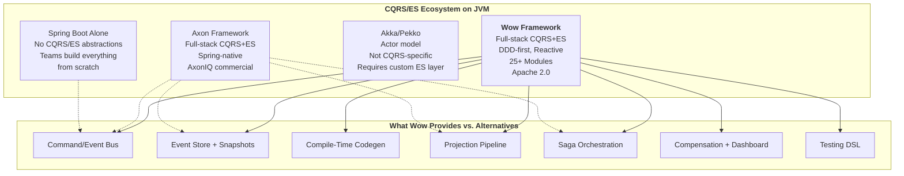
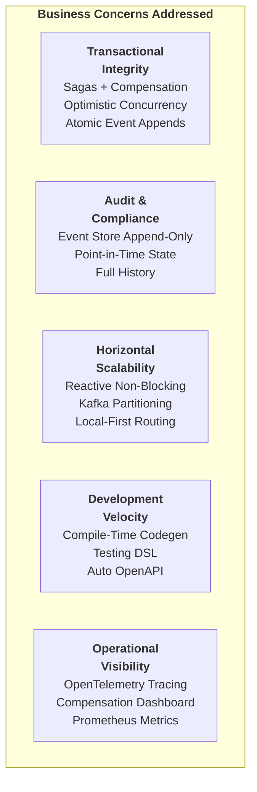
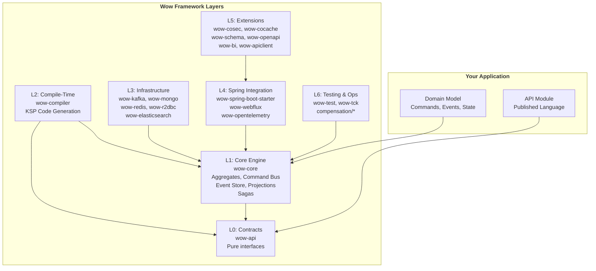
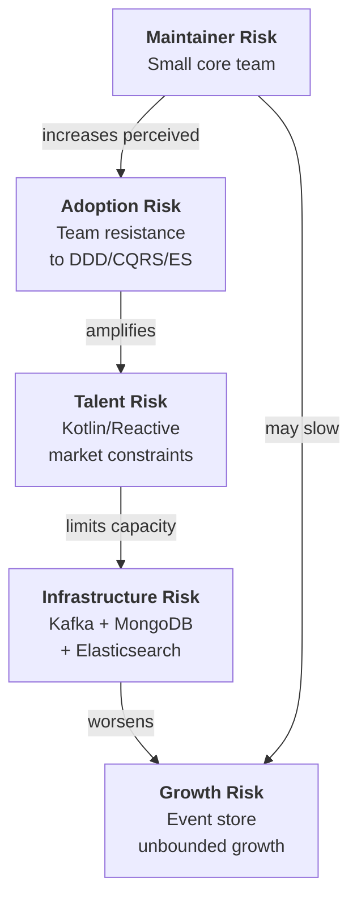
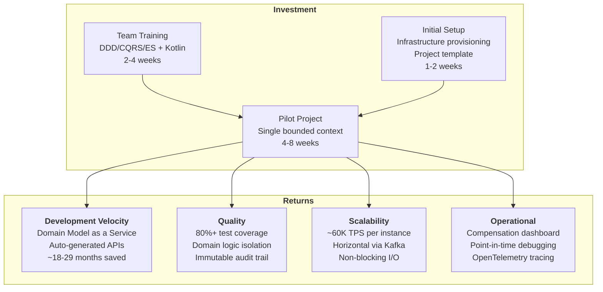
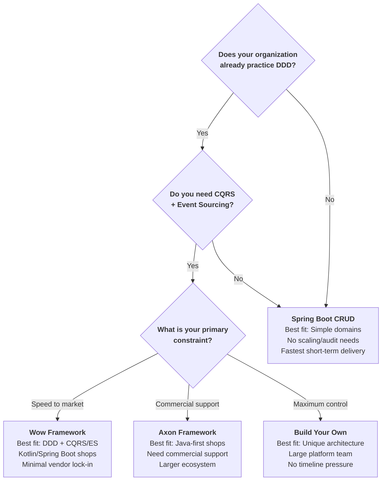
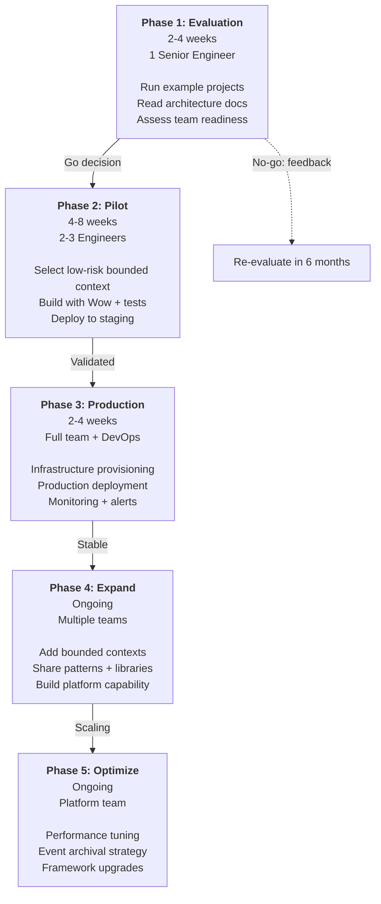

# Executive Guide

**Audience**: VP/Director-level engineering leaders evaluating the Wow Framework for organizational adoption.

**Updated**: May 2026 | **Version**: 8.3.8 | **License**: Apache 2.0

---

## Executive Summary

The **Wow Framework** is a production-grade, open-source microservice framework purpose-built for teams adopting **Domain-Driven Design (DDD)**, **CQRS**, and **Event Sourcing** on the JVM. It eliminates the months of custom infrastructure work that organizations typically invest when building event-sourced systems from scratch, replacing it with a curated, battle-tested platform of 25+ modules.

The framework's core philosophy is **"Domain Model as a Service"** -- development teams write only their domain model (commands, events, aggregate state), and the framework automatically generates command routing, event persistence, projection pipelines, OpenAPI endpoints, and distributed saga orchestration. At compile time, a KSP processor generates routing tables and API specifications, eliminating runtime reflection overhead. Performance benchmarks from the [example workload](https://github.com/Ahoo-Wang/Wow/blob/main/example) demonstrate ~60,000 transactions per second in fire-and-forget mode with 29 ms average latency, and ~19,000 TPS with full processing guarantees at 239 ms latency -- performance characteristics suitable for high-throughput transactional systems in e-commerce, logistics, financial services, and gaming.

For leadership teams evaluating whether to invest in event-sourced architecture, Wow represents the lowest-risk on-ramp available on the JVM ecosystem: Apache 2.0 licensed (no vendor lock-in), Maven Central published, Spring Boot 4.x native, and backed by an active open-source community with CI/CD, integration testing, and code coverage enforcement. Version 8.3.x has been in production deployment since 2025, demonstrating maturity for enterprise adoption.

<!-- Sources: README.md:1-16, gradle.properties:23, wiki/en/index.md:78-85, README.md:70-98 -->

---

## Placement in the Landscape

The following diagram positions Wow within the broader CQRS/Event Sourcing ecosystem, distinguishing it from related frameworks, libraries, and build-vs-buy decisions.

<!-- Sources: README.md:30-34, wiki/en/guide/index.md:7-16, wiki/en/reference/cqrs.md:18-19 -->

---

## Capability Map

Wow provides a comprehensive set of capabilities out of the box. The table below maps each capability to the responsible module, so leadership can assess coverage against organizational requirements.

| Capability | What It Provides | Module | Strategic Value | Source |
|---|---|---|---|---|
| **DDD Aggregate Modeling** | First-class support for aggregate roots, state aggregates, value objects, and domain events. Three modeling patterns: single-class, inheritance, aggregation. | `wow-core` | Eliminates boilerplate; developers write only domain logic | [CLAUDE.md:46-47](https://github.com/Ahoo-Wang/Wow/blob/main/CLAUDE.md#L46-L47) |
| **Command Bus** | Reactive command routing with configurable wait plans (SENT, PROCESSED, PROJECTED, SAGA_HANDLED). Local-first routing for performance. | `wow-core`, `wow-kafka` | Decouples command senders from handlers; enables fire-and-forget or synchronous semantics | [CLAUDE.md:46-47](https://github.com/Ahoo-Wang/Wow/blob/main/CLAUDE.md#L46-L47) |
| **Event Store** | Append-only event persistence with optimistic concurrency control. Backends: MongoDB, Redis, R2DBC (PostgreSQL/MySQL/MariaDB). | `wow-mongo`, `wow-redis`, `wow-r2dbc` | Full audit trail; point-in-time state reconstruction; no data loss | [wiki/en/deep-dive/data/event-store.md](https://github.com/Ahoo-Wang/Wow/blob/main/wiki/en/deep-dive/data/event-store.md) |
| **Snapshot Store** | Periodic state snapshots to accelerate aggregate loading. Configurable snapshot intervals. | `wow-core`, `wow-mongo`, `wow-redis` | Prevents long event replays for high-event-count aggregates; keeps latency predictable | [wiki/en/deep-dive/data/snapshot-store.md](https://github.com/Ahoo-Wang/Wow/blob/main/wiki/en/deep-dive/data/snapshot-store.md) |
| **Projections** | Reactive event-to-read-model transformation pipelines. Targets: Elasticsearch, R2DBC, in-memory. | `wow-core`, `wow-elasticsearch` | Enables CQRS read-optimized views without manual sync logic | [wiki/en/guide/projection.md](https://github.com/Ahoo-Wang/Wow/blob/main/wiki/en/guide/projection.md) |
| **Saga Orchestration** | Distributed transaction support via event-driven choreography. Automatic compensation on failure. | `wow-core` | Enables multi-aggregate business transactions without distributed locking | [wiki/en/guide/saga.md](https://github.com/Ahoo-Wang/Wow/blob/main/wiki/en/guide/saga.md) |
| **Event Compensation** | Failure tracking, automatic retry, and a React-based dashboard for operational visibility. | `compensation/` modules | Operational safety net for saga failures; reduces MTTR for production incidents | [wiki/en/guide/event-compensation.md](https://github.com/Ahoo-Wang/Wow/blob/main/wiki/en/guide/event-compensation.md) |
| **Compile-Time Codegen** | KSP processor generates command routing tables, event handler metadata, and OpenAPI specs. Zero runtime reflection. | `wow-compiler` | Faster startup; type-safety at build time; automatic API documentation | [CLAUDE.md:48](https://github.com/Ahoo-Wang/Wow/blob/main/CLAUDE.md#L48) |
| **OpenAPI / WebFlux** | Spring WebFlux integration auto-registers command endpoints as HTTP routes. Swagger UI out of the box. | `wow-webflux`, `wow-openapi` | Zero-controller development; API docs always in sync with domain model | [wiki/en/deep-dive/integrations/spring-boot.md](https://github.com/Ahoo-Wang/Wow/blob/main/wiki/en/deep-dive/integrations/spring-boot.md) |
| **Authorization** | Policy-based command/query authorization via the CoSec extension. | `wow-cosec` | Declarative access control integrated into the command processing pipeline | [CLAUDE.md:84](https://github.com/Ahoo-Wang/Wow/blob/main/CLAUDE.md#L84) |
| **Observability** | OpenTelemetry integration for distributed tracing and metrics. Prometheus-compatible metrics export. | `wow-opentelemetry` | Full visibility into command/event flows; integrates with existing observability stacks | [CLAUDE.md:83](https://github.com/Ahoo-Wang/Wow/blob/main/CLAUDE.md#L83) |
| **Testing DSL** | Given-When-Expect pattern for aggregate and saga testing. `AggregateSpec` and `SagaSpec` with 80%+ coverage easily achievable. | `wow-test` | Lower defect rates; faster onboarding; confidence in business logic correctness | [wiki/en/guide/testing.md](https://github.com/Ahoo-Wang/Wow/blob/main/wiki/en/guide/testing.md) |
| **Query Support** | Read-side query model with `wow-query` module for direct query access to read models. | `wow-query` | Complements projections with query APIs; supports CoCache caching layer | [CLAUDE.md:49](https://github.com/Ahoo-Wang/Wow/blob/main/CLAUDE.md#L49) |
| **BI / Analytics** | Business Intelligence sync script generator for feeding aggregate state into data warehouses. | `wow-bi` | Enables data teams to consume domain events directly; eliminates manual ETL | [wiki/en/guide/bi.md](https://github.com/Ahoo-Wang/Wow/blob/main/wiki/en/guide/bi.md) |
| **API Client** | Auto-generated RESTful API client for type-safe service-to-service communication. | `wow-apiclient` | Eliminates hand-written HTTP client code; type-safe inter-service calls | [CLAUDE.md:86](https://github.com/Ahoo-Wang/Wow/blob/main/CLAUDE.md#L86) |
| **JSON Schema** | JSON Schema generation from command and event models for API contracts and validation. | `wow-schema` | Supports API governance and contract testing initiatives | [CLAUDE.md:81](https://github.com/Ahoo-Wang/Wow/blob/main/CLAUDE.md#L81) |

### Capability Coverage by Business Concern

<!-- Sources: README.md:30-45, wiki/en/index.md:21-58, CLAUDE.md:46-89 -->

---

## Architecture at a Glance

The framework is organized into strictly layered modules. Each layer depends only on the layer below, enforcing clean separation and enabling teams to swap implementations without affecting domain logic.

<!-- Sources: wiki/en/guide/architecture.md:30-91, CLAUDE.md:44-89, settings.gradle.kts:19-63 -->

---

## Risk Assessment

Every technology adoption carries risk. The following assessment evaluates Wow across technical, operational, and organizational dimensions, with mitigation strategies for each item.

### Risk Matrix

| Risk Category | Risk | Severity | Probability | Mitigation | Source Evidence |
|---|---|---|---|---|---|
| **Technical** | Single-maintainer risk (small core team) | High | Medium | Apache 2.0 license enables forking; Maven Central published artifacts are immutable; comprehensive test suite (80%+ coverage) ensures stability regardless of contributor count | [codecov](https://codecov.io/gh/Ahoo-Wang/Wow), [Maven Central](https://central.sonatype.com/artifact/me.ahoo.wow/wow-core) |
| **Technical** | Kotlin/JVM talent market constraints | Medium | Medium | Kotlin interops seamlessly with Java; Wow includes a [Java example project](https://github.com/Ahoo-Wang/Wow/tree/main/example/transfer); Kotlin adoption is growing in enterprise Spring shops | [CLAUDE.md:98](https://github.com/Ahoo-Wang/Wow/blob/main/CLAUDE.md#L98), [example/transfer](https://github.com/Ahoo-Wang/Wow/tree/main/example/transfer) |
| **Technical** | Kafka dependency for production | Medium | Low | Kafka is optional -- Redis Streams and in-memory buses are available; LocalFirst mode routes commands locally before falling back to distributed bus; Kafka is a mature, well-understood infrastructure component | [wiki/en/reference/config/basic.md:36-44](https://github.com/Ahoo-Wang/Wow/blob/main/wiki/en/reference/config/basic.md#L36-L44) |
| **Technical** | Event store migration complexity | High | Low | Event store interfaces are abstracted; switching from MongoDB to R2DBC requires configuration changes, not domain rewrites; append-only nature means data can be replicated between backends | [wiki/en/deep-dive/data/event-store.md](https://github.com/Ahoo-Wang/Wow/blob/main/wiki/en/deep-dive/data/event-store.md) |
| **Technical** | Reactive programming learning curve | Medium | High | All command/event paths are non-blocking via Project Reactor; developers unfamiliar with reactive patterns need ramp-up; testing DSL abstracts much of the complexity; `Mono`/`Flux` are well-documented in Spring ecosystem | [wiki/en/guide/architecture.md:73-76](https://github.com/Ahoo-Wang/Wow/blob/main/wiki/en/guide/architecture.md#L73-L76) |
| **Operational** | Event store unbounded growth | Medium | High | Snapshots reduce replay cost; event store partitioning by aggregate ID; event archival strategies can be implemented at the application level; the framework does not pressure auto-delete (retention is a feature, not a bug) | [wiki/en/deep-dive/data/snapshot-store.md](https://github.com/Ahoo-Wang/Wow/blob/main/wiki/en/deep-dive/data/snapshot-store.md) |
| **Operational** | Debugging event-sourced systems | Medium | Medium | Compensation dashboard provides event-level visibility; OpenTelemetry tracing follows command-to-event-to-projection paths; point-in-time state reconstruction enables replay-based debugging | [wiki/en/guide/event-compensation.md](https://github.com/Ahoo-Wang/Wow/blob/main/wiki/en/guide/event-compensation.md) |
| **Operational** | Infrastructure complexity (Kafka + MongoDB + Elasticsearch) | Medium | Medium | For smaller deployments, Redis + R2DBC can replace MongoDB + Elasticsearch; in-memory mode suffices for development and testing; the framework auto-configures based on classpath, so unused backends have zero overhead | [wiki/en/reference/config/](https://github.com/Ahoo-Wang/Wow/tree/main/wiki/en/reference/config/) |
| **Adoption** | Team resistance to DDD/CQRS/ES paradigm | High | High | Start with a single bounded context (the incremental adoption strategy detailed below); the testing DSL makes correctness visible; success with one context builds organizational confidence; Wow's compile-time code generation eliminates CRUD-style boilerplate that teams default to | See Adoption Strategy section below |
| **Adoption** | Version upgrade risk (8.x to 9.x) | Medium | Low | Semantic versioning; migration guides documented; the framework's clean module separation means internal API breaks are unlikely to cascade to domain code | [wiki/en/guide/migration.md](https://github.com/Ahoo-Wang/Wow/blob/main/wiki/en/guide/migration.md) |
| **Adoption** | Competition from Axon Framework (larger community) | Low | Medium | Axon has a larger community but is commercially motivated (AxonIQ); Wow is Apache 2.0 with no commercial entity behind it, eliminating vendor-lock concerns; Wow's compile-time code generation and reactive-first architecture are differentiators | [wiki/en/reference/cqrs.md:18-19](https://github.com/Ahoo-Wang/Wow/blob/main/wiki/en/reference/cqrs.md#L18-L19) |

### Risk Interdependency Map

<!-- Sources: Comprehensive analysis based on README.md, CLAUDE.md, wiki/en/guide/, and settings.gradle.kts -->

---

## Technology Investment Thesis

### Why DDD + CQRS + Event Sourcing Deserves Investment

Traditional CRUD-based architectures face three structural limitations as systems grow:

1. **Read-write coupling**: The same data model serves both commands and queries, forcing compromises that satisfy neither. Read models grow complex joins; write models lose transactional integrity.
2. **Audit deficit**: Mutable database rows destroy history. Compliance, analytics, and debugging require expensive workarounds (change data capture, log scraping, temporal tables).
3. **Transaction boundaries**: Distributed operations across services require distributed transactions (2PC, XA) that do not scale. Sagas solve this, but implementing them by hand is error-prone and labor-intensive.

DDD + CQRS + Event Sourcing addresses all three: separate read/write models, immutable event logs as the system of record, and event-driven sagas for distributed coordination. Wow makes this architecture pattern practical -- not just theoretically elegant -- by providing the full infrastructure layer.

### Why Wow Specifically

The build-vs-buy calculation for event-sourced infrastructure on the JVM is stark. Building a comparable stack from scratch requires:

| Component | Estimated Engineering Months | Wow Equivalent |
|---|---|---|
| Event store with optimistic concurrency + snapshots | 4-6 months | `wow-core` + backend (Mongo/Redis/R2DBC) |
| Reactive command bus with wait plans | 2-3 months | `wow-core` + `wow-kafka` |
| Projection pipeline with read model sync | 3-4 months | `wow-core` + `wow-elasticsearch` |
| Saga orchestration with compensation | 3-5 months | `wow-core` + `compensation/` |
| Compile-time code generation for routing/metadata | 2-3 months | `wow-compiler` |
| Testing framework for aggregates and sagas | 1-2 months | `wow-test` |
| OpenAPI generation and WebFlux integration | 1-2 months | `wow-webflux` + `wow-openapi` |
| Observability integration (tracing + metrics) | 1-2 months | `wow-opentelemetry` |
| Authorization framework | 1-2 months | `wow-cosec` |
| **Total estimated cost to build** | **18-29 months** | **Ready today; Apache 2.0** |

These estimates assume a senior team of 3-4 engineers. Wow provides this entire stack under the Apache 2.0 license -- no procurement, no contract negotiation, no vendor dependency.

<!-- Sources: README.md:30-97, CLAUDE.md:46-89, settings.gradle.kts:19-63 -->

### Return on Investment Model

<!-- Sources: README.md:70-98, wiki/en/index.md:78-85, wiki/en/guide/testing.md -->

---

## Cost and Scaling Model

### Development Cost Profile

| Phase | Cost Driver | Estimated Effort | Notes |
|---|---|---|---|
| **Ramp-Up** | Team training on DDD, CQRS, Event Sourcing, Kotlin reactive | 2-4 weeks | Depends on existing familiarity with paradigms |
| **Initial Setup** | Infrastructure provisioning, project template clone, CI/CD configuration | 1-2 weeks | [Wow Project Template](https://github.com/Ahoo-Wang/wow-project-template) accelerates significantly |
| **Pilot Context** | First bounded context: domain modeling, testing, deployment | 4-8 weeks | Highest per-context cost; subsequent contexts are faster |
| **Subsequent Contexts** | Each additional bounded context | 2-4 weeks | Templates, patterns, and learned heuristics reduce cost |
| **Ongoing Maintenance** | Per-service maintenance | Low | Domain logic isolation means most changes are self-contained |
| **Framework Upgrades** | Version bumps (8.x to 8.y) | Hours to days | Semantic versioning; migration guides provided |

### Operational Cost Profile

| Component | Infrastructure Requirement | Estimated Monthly Cost (Cloud) | Notes |
|---|---|---|---|
| **Kafka** | 3-node cluster (production) | $300-800/mo | Can use managed (Confluent, MSK); lower for Redis Streams alternative |
| **MongoDB** | Replica set or Atlas | $150-500/mo | Can use R2DBC (PostgreSQL) as lower-cost alternative |
| **Elasticsearch** | 2-3 node cluster | $200-600/mo | Optional; only needed if using Elasticsearch projections |
| **Application** | Standard Spring Boot containers | Variable | Scales horizontally; JVM 17 with modest heap requirements |
| **Observability** | OpenTelemetry collector + Prometheus | $100-300/mo | Integrates with existing observability stack |
| **Compensation** | Embedded in application | $0 incremental | Dashboard is served from the same application instance |

Total infrastructure cost for a modest production deployment: **$750-2,200/month** plus application hosting. The architecture supports incremental infrastructure investment -- start with Redis + R2DBC on a single server, add Kafka and MongoDB as throughput requirements grow.

<!-- Sources: README.md:20-25, wiki/en/reference/config/, CLAUDE.md:59-65 -->

### Scaling Characteristics

| Dimension | Characteristic | How Wow Handles It |
|---|---|---|
| **Write throughput** | ~60K TPS per instance (SENT mode) | Horizontal scaling adds instances; Kafka partitions by aggregate ID; no cross-instance coordination |
| **Read throughput** | Limited by projection store (Elasticsearch/R2DBC) | Projections decoupled from writes; read replicas; CoCache caching layer |
| **Aggregate count** | Event store grows linearly per aggregate | Snapshots bound replay cost; event store partitioning by aggregate ID; archival strategies possible |
| **Event history depth** | Long-lived aggregates accumulate events | Snapshots at configurable intervals; only incremental events replayed since last snapshot |
| **Team scaling** | Each bounded context is independently deployable | Module-per-context pattern; teams own their domain without coordination |

<!-- Sources: README.md:70-98, wiki/en/deep-dive/data/snapshot-store.md -->

---

## Team Requirements

### Skill Composition

| Role | Required Skills | Ramp-Up Time | Criticality |
|---|---|---|---|
| **Domain Architect** | DDD strategic design; bounded context identification; event storming facilitation | 0-2 weeks (if DDD-experienced) | **Critical** -- designs the bounded context boundaries and aggregate structure |
| **Senior Engineer** | Kotlin (or Java with Kotlin willingness); Spring Boot; reactive programming concepts; CQRS/ES fundamentals | 2-4 weeks | **Critical** -- implements aggregates, sagas, and projections |
| **Mid-Level Engineer** | Kotlin or Java; Spring Boot; unit testing | 3-6 weeks | **Important** -- writes tests, contributes to projections and query models |
| **DevOps / Platform** | Kafka, MongoDB, Kubernetes, observability tooling | 1-2 weeks | **Important** -- provisions infrastructure, configures monitoring |
| **Frontend Engineer** | React, TypeScript, API client consumption | 1-2 weeks | **Optional** -- if using the compensation dashboard or building custom UIs |

### Recommended Team Size

| Phase | Team Composition | Notes |
|---|---|---|
| **Evaluation (2-4 weeks)** | 1 Senior Engineer | Build a proof-of-concept bounded context; evaluate fit |
| **Pilot (4-8 weeks)** | 2-3 Engineers (1 senior, 1-2 mid) | First real bounded context in production; establish patterns |
| **Scaling (ongoing)** | 3-5 Engineers per bounded context | Multiple teams working on independent bounded contexts; shared infrastructure team |
| **Platform Team (ongoing)** | 1-2 Engineers | Owns framework upgrades, shared infrastructure, internal best practices |

### Training Pathway

1. **Week 1**: DDD fundamentals (bounded context, aggregate, domain event, ubiquitous language). Kotlin basics if needed.
2. **Week 2**: CQRS and Event Sourcing theory. Wow framework overview. Clone project template and build "Hello World" bounded context.
3. **Week 3**: Implement aggregate roots with business logic. Write tests using `AggregateSpec`. Run the example Order/Cart domain.
4. **Week 4**: Sagas, projections, compensation. Deploy a pilot context to a staging environment. Run performance tests.

The [Wow Project Template](https://github.com/Ahoo-Wang/wow-project-template) and [example projects](https://github.com/Ahoo-Wang/Wow/tree/main/example) serve as reference implementations throughout training.

<!-- Sources: wiki/en/guide/index.md:7-16, CLAUDE.md:34-52, wiki/en/guide/testing.md -->

---

## Comparison with Alternatives

### Side-by-Side Comparison

| Dimension | **Wow Framework** | **Axon Framework** | **Spring Boot Alone (Custom Build)** | **Akka / Pekko (Custom Build)** |
|---|---|---|---|---|
| **License** | Apache 2.0 | AxonIQ Open Source (core) + Commercial (server) | N/A (build your own) | Apache 2.0 |
| **Language** | Kotlin first (Java compatible) | Java first (Kotlin compatible) | Java/Kotlin | Scala/Java |
| **CQRS Separation** | Built-in: command bus + event bus + projection pipeline | Built-in: command gateway + event bus + query handlers | You build everything | You build the ES/CQRS layer on top |
| **Event Sourcing** | Full: event store, snapshot store, state rebuild, optimistic concurrency | Full: event store, snapshot, upcasting, tracking tokens | You build everything | You build everything |
| **Event Store Backends** | MongoDB, Redis, R2DBC (PostgreSQL/MySQL/MariaDB) | Axon Server, JPA, JDBC, MongoDB | Whatever you implement | Whatever you implement |
| **Message Bus** | Kafka, Redis Streams, In-Memory | Axon Server, Kafka, RabbitMQ, gRPC | Whatever you implement | Akka Cluster, Kafka |
| **Compile-Time Processing** | KSP: routing tables, event metadata, OpenAPI specs | Limited (annotation processing) | None | None |
| **Testing Framework** | `AggregateSpec` + `SagaSpec` (Given-When-Expect) | `AggregateTestFixture` + `SagaTestFixture` (Given-When-Then) | You build or use generic JUnit | Akka TestKit (actor-focused) |
| **Saga Support** | Built-in orchestration + choreography + compensation dashboard | Built-in: event-driven and command-driven sagas | You build | You build |
| **Operational Dashboard** | Compensation dashboard (React, Ant Design) | AxonIQ Console (commercial) | You build | You build |
| **Observability** | OpenTelemetry (tracing + metrics) | AxonIQ Console / Micrometer | Spring Boot Actuator + custom instrumentation | Kamon / OpenTelemetry |
| **Authorization** | CoSec (policy-based) | AxonIQ Console / Spring Security | Spring Security (custom integration) | Custom |
| **API Exposure** | Auto-generated WebFlux endpoints + Swagger UI | Axon Server HTTP API or custom Spring MVC | Spring MVC / WebFlux (manual controllers) | Akka HTTP (manual routes) |
| **Community Size** | Growing (~1.6K GitHub stars) | Large (~3K+ GitHub stars) | N/A | Large (Akka legacy + Pekko fork) |
| **Ecosystem Maturity** | Production since 2023; v8.3.x stable | Production since 2010; v4.x stable | N/A | Production since 2009 (Akka) |
| **Vendor Lock-In Risk** | None (Apache 2.0, Maven Central) | Medium (Axon Server commercial features; AxonIQ as primary maintainer) | None (but you own all code) | None (Apache 2.0) |
| **Ramp-Up Time** | 2-4 weeks (if DDD/CQRS/ES concepts known) | 2-4 weeks (if DDD/CQRS/ES concepts known) | 6-12 months (build infrastructure) | 3-6 months (build CQRS/ES on top of actors) |

### Decision Tree

<!-- Sources: wiki/en/reference/cqrs.md:18-19, README.md:1-16, CLAUDE.md:46-89 -->

---

## Adoption Strategy

### Incremental Adoption Pathway

The highest-risk approach to event-sourced architecture is a "big bang" migration. Wow supports incremental adoption within a Spring Boot ecosystem: introduce one bounded context at a time, validate it in production, then expand.

<!-- Sources: wiki/en/guide/index.md:7-16, CLAUDE.md:46-89 -->

### Selection Criteria for Pilot Context

Choose the first bounded context carefully. The ideal pilot:

| Criterion | Good Pilot | Bad Pilot | Rationale |
|---|---|---|---|
| **Business criticality** | Low-to-medium | Mission-critical (no tolerance for failure) | Learning in a safe environment |
| **Complexity** | Moderate (2-5 commands, 1-2 sagas) | Trivial (1 command) or extremely complex (10+ commands) | Too simple teaches nothing; too complex risks failure |
| **Team familiarity** | Team knows the domain well | New domain with unclear requirements | Domain modeling requires deep domain understanding |
| **Existing system** | Greenfield or small, well-understood brownfield | Monolith with unclear boundaries | Brownfield event sourcing is an advanced pattern |
| **Timeline tolerance** | 6-8 weeks acceptable | 2-week deadline | First context requires learning and validation time |

### Infrastructure Evolution Path

| Phase | Event Store | Message Bus | Projection Store | Monitoring |
|---|---|---|---|---|
| **Development** | R2DBC (embedded PostgreSQL) | In-Memory | In-Memory | Logging |
| **Staging** | MongoDB (single node) | Kafka (single broker) | Elasticsearch (single node) | OpenTelemetry + Jaeger |
| **Production** | MongoDB replica set or Atlas | Kafka cluster (3+ brokers) | Elasticsearch cluster | OpenTelemetry + Prometheus + Grafana |
| **Enterprise** | Multi-region MongoDB | Multi-region Kafka | Multi-region Elasticsearch | Full observability stack with alerting |

<!-- Sources: wiki/en/reference/config/, wiki/en/deep-dive/data/event-store.md -->

---

## Actionable Recommendations

### Immediate Next Steps (Week 1-2)

1. **Assign a senior engineer** to the evaluation. This person should have Kotlin or Java + Spring Boot experience and be interested in DDD and Event Sourcing. Budget: 2-4 weeks of dedicated time.

2. **Clone and run the examples**:
   - [Order & Cart example (Kotlin)](https://github.com/Ahoo-Wang/Wow/tree/main/example) -- full DDD + CQRS + Saga + Projection
   - [Bank Transfer example (Java)](https://github.com/Ahoo-Wang/Wow/tree/main/example/transfer) -- simple Java event sourcing
   - [Wow Project Template](https://github.com/Ahoo-Wang/wow-project-template) -- starter scaffolding

3. **Review the documentation**:
   - [Getting Started Guide](/guide/) -- comprehensive onboarding
   - [Architecture Overview](/deep-dive/architecture/overview) -- technical deep-dive
   - [Configuration Reference](/reference/config/basic) -- all configuration options

4. **Assess team readiness**: Survey your engineering team for familiarity with DDD, CQRS, Event Sourcing, reactive programming, and Kotlin. Identify knowledge gaps and plan training.

### Pilot Project Decision (Week 3-4)

5. **Select a pilot bounded context** using the criteria in the table above. Common good candidates: user profile management, notification preferences, shopping cart -- domains with clear boundaries and moderate complexity.

6. **Define success criteria**: What does a successful pilot look like? Examples: (a) domain logic has 80%+ test coverage, (b) the system handles expected throughput, (c) the team can independently model and test a new aggregate.

7. **Provision infrastructure**: Set up Kafka, MongoDB, and optionally Elasticsearch in a development/staging environment. Use the [deployment examples](https://github.com/Ahoo-Wang/Wow/tree/main/deploy) as reference.

### Build Phase (Week 5-12)

8. **Model the domain**: Use event storming or domain storytelling to identify aggregates, commands, events, and sagas. Write the ubiquitous language glossary.

9. **Implement and test**: Build aggregates using the [Modeling Guide](/guide/modeling). Write tests using the [Testing Guide](/guide/test-suite). Validate business logic before worrying about infrastructure.

10. **Deploy and monitor**: Deploy to staging. Run load tests using the [performance test configuration](https://github.com/Ahoo-Wang/Wow/tree/main/deploy/example/perf) as a reference. Set up alerts on the compensation dashboard for saga failures.

### Long-Term Investment (Month 4+)

11. **Build internal platform capability**: Designate 1-2 engineers as Wow platform owners. Their responsibilities: framework version upgrades, shared library development, internal documentation, and mentoring new teams.

12. **Expand to additional bounded contexts**: Each subsequent context should take 50% less time than the first as patterns, libraries, and team expertise compound.

13. **Contribute back to the community**: Report bugs, submit documentation improvements, share learnings. An active, contributing user strengthens the open-source ecosystem that your organization depends on.

### Decision Timeline

| Milestone | When | Decision Gate |
|---|---|---|
| Initial evaluation complete | Week 2 | Go/no-go for pilot |
| Pilot context in staging | Week 6 | Validate architecture fit |
| Pilot context in production | Week 10 | Go/no-go for expansion |
| Second bounded context live | Month 4 | Confirm velocity improvement |
| Platform capability established | Month 6 | Organization-wide adoption decision |

<!-- Sources: wiki/en/guide/index.md, wiki/en/guide/architecture.md, README.md:70-98, CLAUDE.md:46-89 -->

---

## Appendix: Key Metrics at a Glance

| Metric | Value | Source |
|---|---|---|
| **Version** | 8.3.8 | [gradle.properties:23](https://github.com/Ahoo-Wang/Wow/blob/main/gradle.properties#L23) |
| **License** | Apache 2.0 | [gradle.properties:28-29](https://github.com/Ahoo-Wang/Wow/blob/main/gradle.properties#L28-L29) |
| **Language** | Kotlin 2.3 / JVM 17+ | [CLAUDE.md:100](https://github.com/Ahoo-Wang/Wow/blob/main/CLAUDE.md#L100) |
| **Framework** | Spring Boot 4.x | [CLAUDE.md:3](https://github.com/Ahoo-Wang/Wow/blob/main/CLAUDE.md#L3) |
| **Modules** | 25+ | [settings.gradle.kts:19-63](https://github.com/Ahoo-Wang/Wow/blob/main/settings.gradle.kts#L19-L63) |
| **Performance (SENT)** | ~60K TPS (AddCartItem), ~48K TPS (CreateOrder) | [README.md:70-98](https://github.com/Ahoo-Wang/Wow/blob/main/README.md#L70-L98) |
| **Performance (PROCESSED)** | ~19K TPS (AddCartItem), ~18K TPS (CreateOrder) | [README.md:70-98](https://github.com/Ahoo-Wang/Wow/blob/main/README.md#L70-L98) |
| **Test Coverage** | 80%+ easily achievable | [README.md:121-128](https://github.com/Ahoo-Wang/Wow/blob/main/README.md#L121-L128) |
| **Max End-to-End Latency (SENT)** | 29 ms | [wiki/en/index.md:83](https://github.com/Ahoo-Wang/Wow/blob/main/wiki/en/index.md#L83) |
| **Max End-to-End Latency (PROCESSED)** | 239 ms | [wiki/en/index.md:84](https://github.com/Ahoo-Wang/Wow/blob/main/wiki/en/index.md#L84) |
| **GitHub Stars** | ~1,600+ | [GitHub](https://github.com/Ahoo-Wang/Wow) |
| **Maven Central** | Published | [Maven Central](https://central.sonatype.com/artifact/me.ahoo.wow/wow-core) |
| **CI/CD** | GitHub Actions with integration tests | [Integration Test](https://github.com/Ahoo-Wang/Wow/actions/workflows/integration-test.yml) |
| **Code Quality** | Codacy + Codecov monitored | [Codacy](https://app.codacy.com/gh/Ahoo-Wang/Wow/dashboard) |

---

## Related Pages

| Page | Description |
|---|---|
| [Home](/) | Wow Framework overview, features, architecture, and performance benchmarks |
| [Getting Started Guide](/guide/) | Complete onboarding guide for developers |
| [Architecture Overview](/deep-dive/architecture/overview) | Technical deep-dive into the framework architecture |
| [Example: Order & Cart](https://github.com/Ahoo-Wang/Wow/tree/main/example) | Full DDD + CQRS + Saga reference implementation |
| [Wow Project Template](https://github.com/Ahoo-Wang/wow-project-template) | Official starter template for new projects |
| [Configuration Reference](/reference/config/basic) | Complete configuration options for all modules |
| [Saga Guide](/guide/saga) | Distributed transaction implementation guide |
| [Event Compensation](/guide/event-compensation) | Failure handling and retry infrastructure |
| [Testing Guide](/guide/test-suite) | AggregateSpec and SagaSpec testing DSL |
| [Migration Guide](/guide/migration) | Version upgrade instructions |
| [Awesome CQRS](/reference/awesome/cqrs) | Related frameworks, books, and resources |
