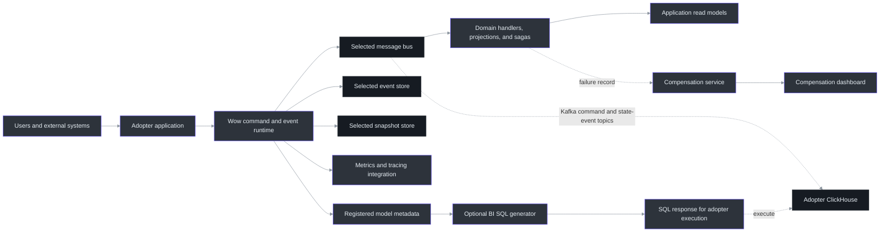
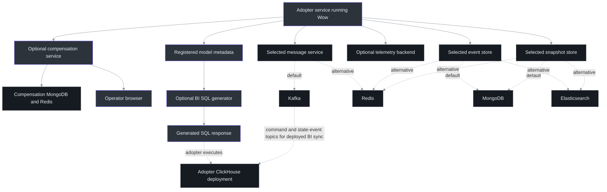
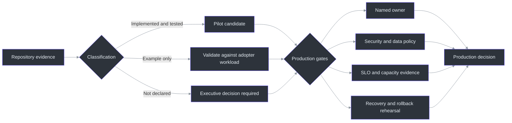

# Executive Guide

## Purpose and evidence baseline

This guide explains what Wow can support, what adopting it requires, and which
business decisions the repository cannot make for an organization.

It is written for engineering executives, platform leaders, architecture
groups, security reviewers, and people responsible for delivery risk.

The evidence baseline is the `main` branch of the Wow repository.

Wow identifies itself as a reactive CQRS and Event Sourcing framework for
modern applications. It is a framework and set of integration modules, not a
complete business product or a managed service.

The current project version is `8.11.5`, the JVM toolchain is 17, and the build
uses Kotlin `2.4.10`.

Sources:

- [README.md:7-9](https://github.com/Ahoo-Wang/Wow/blob/main/README.md#L7-L9)
- [gradle.properties:13-23](https://github.com/Ahoo-Wang/Wow/blob/main/gradle.properties#L13-L23)
- [gradle/libs.versions.toml:1-35](https://github.com/Ahoo-Wang/Wow/blob/main/gradle/libs.versions.toml#L1-L35)

### Reading rules

- “Implemented” means that the repository contains the relevant production
  code or configuration.
- “Tested” means that a relevant automated check is present; it does not mean
  the adopter's production environment has been validated.
- “Optional” means that the integration is selected through a module or
  feature capability rather than being universally active.
- “Example” means that a repository sample demonstrates one deployment choice;
  it is not a service-level promise or a production standard.
- “Not declared” means that the repository does not establish an accountable
  owner, target, policy, or commitment.

## Executive summary

Wow provides a modular foundation for command processing, event persistence,
state reconstruction, projections, sagas, snapshots, observability hooks, and
failure-recovery workflows.

The framework is designed around reactive execution and supports selectable
transport and storage technologies. Adopters still own their domain model,
service boundaries, data policies, production topology, access controls,
capacity model, incident process, and service objectives.

The strongest adoption case is an organization that needs auditable domain
changes, asynchronous workflows, or multiple read models and is prepared to
operate event-driven infrastructure.

The weakest adoption case is a simple CRUD service whose team does not need
event history or asynchronous processing and cannot support the operational
complexity of brokers, stores, projections, and replay.

The repository demonstrates substantial engineering automation: local,
contract, integration, static-analysis, dashboard, compensation, Java example,
and benchmark-smoke workflows are present. These checks increase confidence in
the framework build; they do not establish the adopter's availability,
latency, recovery, or compliance outcomes.

Sources:

- [settings.gradle.kts:23-85](https://github.com/Ahoo-Wang/Wow/blob/main/settings.gradle.kts#L23-L85)
- [build.gradle.kts:50-166](https://github.com/Ahoo-Wang/Wow/blob/main/build.gradle.kts#L50-L166)
- [.github/workflows/integration-test.yml:47-75](https://github.com/Ahoo-Wang/Wow/blob/main/.github/workflows/integration-test.yml#L47-L75)
- [.github/workflows/static-analysis.yml:35-53](https://github.com/Ahoo-Wang/Wow/blob/main/.github/workflows/static-analysis.yml#L35-L53)

## System overview

The following view separates application responsibilities from framework
capabilities and infrastructure selected by the adopter.

```mermaid
flowchart LR
    U["Users and external systems"] --> A["Adopter application"]
    A --> W["Wow command and event runtime"]
    W --> B["Selected message bus"]
    W --> ES["Selected event store"]
    W --> SS["Selected snapshot store"]
    B --> H["Domain handlers, projections, and sagas"]
    H --> RM["Application read models"]
    H -. failure record .-> C["Compensation service"]
    C --> D["Compensation dashboard"]
    W --> O["Metrics and tracing integration"]
    W --> M["Registered model metadata"]
    M --> BI["Optional BI SQL generator"]
    BI --> SQL["SQL response for adopter execution"]
    SQL -. execute .-> CH["Adopter ClickHouse"]
    B -. Kafka command and state-event topics .-> CH
    classDef core fill:#2d333b,stroke:#6d5dfc,color:#e6edf3
    classDef external fill:#161b22,stroke:#30363d,color:#e6edf3
    class U,A,W,H,RM,C,D,O,M,BI,SQL core
    class B,ES,SS,CH external
    linkStyle default stroke:#8b949e
```

<!-- Sources: [settings.gradle.kts:23-66](https://github.com/Ahoo-Wang/Wow/blob/main/settings.gradle.kts#L23-L66), [wow-spring-boot-starter/build.gradle.kts:5-44](https://github.com/Ahoo-Wang/Wow/blob/main/wow-spring-boot-starter/build.gradle.kts#L5-L44), [WowMetrics.kt](https://github.com/Ahoo-Wang/Wow/blob/main/wow-core/src/main/kotlin/me/ahoo/wow/metrics/WowMetrics.kt), [CompensationFilter.kt:58-119](https://github.com/Ahoo-Wang/Wow/blob/main/compensation/wow-compensation-core/src/main/kotlin/me/ahoo/wow/compensation/core/CompensationFilter.kt#L58-L119), [GenerateBIScriptHandlerFunction.kt:87-112](https://github.com/Ahoo-Wang/Wow/blob/main/wow-webflux/src/main/kotlin/me/ahoo/wow/webflux/route/global/GenerateBIScriptHandlerFunction.kt#L87-L112), [ClickHouseCommandRenderer.kt:108-120](https://github.com/Ahoo-Wang/Wow/blob/main/wow-bi/src/main/kotlin/me/ahoo/wow/bi/renderer/ClickHouseCommandRenderer.kt#L108-L120), [ClickHouseStateEventRenderer.kt:119-132](https://github.com/Ahoo-Wang/Wow/blob/main/wow-bi/src/main/kotlin/me/ahoo/wow/bi/renderer/ClickHouseStateEventRenderer.kt#L119-L132) -->

This diagram describes available integration points. It does not claim that all
components are enabled in every application or deployed by Wow itself.

## Capability map

| Capability | Status | Maturity | Dependencies | Adoption boundary |
| --- | --- | --- | --- | --- |
| Command dispatch | Built | Core implementation | Application domain model; selected bus; WebFlux only for HTTP exposure | Domain authorization and business validation remain application concerns |
| Event Sourcing | Built | Core implementation | Event store and event-schema governance | Data growth, retention, and deletion policy are not supplied |
| Snapshots | Built | Configurable core feature | Snapshot store; MongoDB is the default type | Snapshot frequency and store choice need workload validation |
| Projections | Built | Core plus application-defined stores | Event bus and an application-selected read-model store | Wow does not provide a universal projection writer; schema, freshness, and rebuild are adopter-owned |
| Sagas | Built | Core implementation | Event dispatch and application-defined saga behavior | Business compensation semantics must be designed by the application |
| Message buses | Built | Multiple implementations | Kafka by default; Redis, in-memory, or no-op alternatives | Delivery guarantees depend on the selected backend and configuration |
| Storage routing | Built | Configurable core feature | Named event and snapshot stores | Routing errors and migration procedures need governance |
| Web API | Built | Optional integration | WebFlux and the selected route capabilities | Universal authentication and rate limiting are not declared |
| OpenAPI | Built | Optional integration | OpenAPI and WebFlux capabilities | Published contract governance remains adopter-owned |
| Observability | Built | Optional instrumentation | Metrics or OpenTelemetry backend | Dashboards, alerts, targets, and incident ownership are not declared |
| Compensation | Built | Separate service and dashboard | Eligible event-handler paths, compensation storage, operator process | It is not command rollback and does not guarantee business consistency |
| BI script generation | Built | Optional integration | Registered model metadata; Kafka command/state-event topics and ClickHouse only after the adopter executes the generated SQL | Generation returns SQL and uses a no-op deployment inspector by default; execution, data ownership, retention, and analytics governance remain external |
| Testing DSL | Built | Test support | Application test scenarios | Production behavior still requires integration and load validation |
| Spring Boot composition | Built | Feature variants | Selected storage, bus, Web, telemetry, and security adapters | Every enabled backend adds upgrade and operating responsibilities |

Sources:

- [BusProperties.kt:21-45](https://github.com/Ahoo-Wang/Wow/blob/main/wow-spring-boot-starter/src/main/kotlin/me/ahoo/wow/spring/boot/starter/BusProperties.kt#L21-L45)
- [SnapshotProperties.kt:23-45](https://github.com/Ahoo-Wang/Wow/blob/main/wow-spring-boot-starter/src/main/kotlin/me/ahoo/wow/spring/boot/starter/eventsourcing/snapshot/SnapshotProperties.kt#L23-L45)
- [StorageRoutingProperties.kt:19-36](https://github.com/Ahoo-Wang/Wow/blob/main/wow-spring-boot-starter/src/main/kotlin/me/ahoo/wow/spring/boot/starter/eventsourcing/routing/StorageRoutingProperties.kt#L19-L36)
- [BuiltInHttpRoutes.kt:18-75](https://github.com/Ahoo-Wang/Wow/blob/main/wow-openapi/src/main/kotlin/me/ahoo/wow/openapi/contract/BuiltInHttpRoutes.kt#L18-L75)
- [OpenAPIProperties.kt:21-27](https://github.com/Ahoo-Wang/Wow/blob/main/wow-spring-boot-starter/src/main/kotlin/me/ahoo/wow/spring/boot/starter/openapi/OpenAPIProperties.kt#L21-L27)
- [CompensationFilter.kt:58-119](https://github.com/Ahoo-Wang/Wow/blob/main/compensation/wow-compensation-core/src/main/kotlin/me/ahoo/wow/compensation/core/CompensationFilter.kt#L58-L119)
- [BiScriptProperties.kt:55-66](https://github.com/Ahoo-Wang/Wow/blob/main/wow-spring-boot-starter/src/main/kotlin/me/ahoo/wow/spring/boot/starter/bi/BiScriptProperties.kt#L55-L66)
- [GenerateBIScriptHandlerFunction.kt:87-112](https://github.com/Ahoo-Wang/Wow/blob/main/wow-webflux/src/main/kotlin/me/ahoo/wow/webflux/route/global/GenerateBIScriptHandlerFunction.kt#L87-L112)
- [ClickHouseStateEventRenderer.kt:119-132](https://github.com/Ahoo-Wang/Wow/blob/main/wow-bi/src/main/kotlin/me/ahoo/wow/bi/renderer/ClickHouseStateEventRenderer.kt#L119-L132)

## Architecture at a glance

Wow follows a layered module direction: API contracts feed the core runtime;
Spring integration and dedicated infrastructure modules extend the core.

The starter exposes feature capabilities for MongoDB, Redis, mock support,
Kafka, WebFlux, Elasticsearch, OpenTelemetry, OpenAPI, and CoSec.

This modularity limits mandatory coupling, but the deployed system is still a
distributed application when durable brokers and stores are selected.

The adoption architecture should therefore document both the Wow module graph
and the actual runtime topology. They are not interchangeable.

Sources:

- [settings.gradle.kts:23-66](https://github.com/Ahoo-Wang/Wow/blob/main/settings.gradle.kts#L23-L66)
- [wow-spring-boot-starter/build.gradle.kts:5-44](https://github.com/Ahoo-Wang/Wow/blob/main/wow-spring-boot-starter/build.gradle.kts#L5-L44)

## Team topology and collaboration interfaces

The repository does not declare a `CODEOWNERS` file, a team directory, or a
service ownership map. The following responsibilities are therefore an
adoption recommendation, not a statement about the Wow maintainers.

| Component | Owner | Criticality | Bus Factor |
| --- | --- | --- | --- |
| Application domain model | Suggested: product engineering; repository owner not declared | High — owns business correctness | Not declared |
| Framework composition and upgrades | Suggested: platform engineering; repository owner not declared | High — affects every adopter service | Not declared |
| Messaging platform | Suggested: messaging platform or SRE; repository owner not declared | High when an external bus is selected | Not declared |
| Event and snapshot storage | Suggested: data platform or SRE; repository owner not declared | High — contains recovery state | Not declared |
| Projections and search | Suggested: product team with data platform; repository owner not declared | Medium to high by customer journey | Not declared |
| Compensation operations | Suggested: service owner and operations; repository owner not declared | High for eligible recovery flows | Not declared |
| API exposure and access policy | Suggested: service owner and security; repository owner not declared | High — controls powerful routes | Not declared |
| Observability and incident response | Suggested: SRE or observability platform; repository owner not declared | High for production operation | Not declared |
| Data governance | Suggested: data governance and legal; repository owner not declared | High for regulated data | Not declared |
| Wow framework contribution | Wow maintainers through the contribution process; individuals not declared | Medium to high by change | Not declared |

The contribution guide asks contributors to discuss public API or dependency
changes before implementation. The security policy directs vulnerability
reports privately to maintainers. Neither document names an organizational
production owner for adopter services.

Sources:

- [CONTRIBUTING.md:1-10](https://github.com/Ahoo-Wang/Wow/blob/main/CONTRIBUTING.md#L1-L10)
- [CONTRIBUTING.md:50-58](https://github.com/Ahoo-Wang/Wow/blob/main/CONTRIBUTING.md#L50-L58)
- [SECURITY.md:7-21](https://github.com/Ahoo-Wang/Wow/blob/main/SECURITY.md#L7-L21)

## Technology thesis

| Technology or model | Purpose | Alternatives considered in repository | Risk level |
| --- | --- | --- | --- |
| CQRS and Event Sourcing | Preserve business changes and separate write behavior from read views | A current-state-only CRUD alternative is not evaluated in a repository decision record | High — event compatibility and lifecycle are long-lived obligations |
| Reactor-based execution | Compose asynchronous command and event work | Alternatives are not documented | Medium — adopter code and integrations must preserve non-blocking behavior |
| Spring Boot starter | Compose optional capabilities through configuration | Direct module assembly remains possible; no formal trade study is recorded | Medium — enabled features widen upgrade and operating scope |
| Kafka, Redis, in-memory, or no-op buses | Transport commands and events | These four bus types are selectable | High for durable production transport; low for local-only options |
| MongoDB, Redis, Elasticsearch, in-memory, or delay storage | Persist events and snapshots through a selected or routed store; in-memory and delay modes support non-durable/test scenarios | All five `StorageType` values and custom routing are configurable | High for durable stores — data durability and migration depend on the choice |
| Elasticsearch event/snapshot adapter | Persist and query event streams and snapshots, including search over stored state | MongoDB, Redis, and custom application storage remain alternatives | Medium — index lifecycle and rebuild are adopter-owned; this is not a generic projection writer |
| OpenTelemetry and metrics wrappers | Export runtime activity | Optional instrumentation; backend choice is external | Medium — cost and privacy depend on sampling and attributes |
| Compensation service and dashboard | Expose and retry eligible handler failures | Manual business correction remains application-owned | High — unsafe retry can repeat side effects |

### Why the model can create value

An event history can improve auditability and support new projections without
changing the original write model.

Command handling encourages explicit domain intent rather than generic record
mutation.

Snapshots provide a performance mechanism for long-lived aggregates without
discarding the event history.

Failure records and controlled retry actions can make selected asynchronous
handler failures visible to operators.

### What the model costs

Event schemas become long-lived compatibility contracts.

Projection lag and replay introduce operational states that conventional CRUD
systems may not have.

Multiple backends require coordinated capacity planning, upgrades, backup,
restore, and incident response.

The default aggregate deletion path emits a deletion event and marks reconstructed
state as deleted. The shared `EventStore` contract exposes append and load
operations but no general erase operation, so an adopter must not treat the
default delete command as a repository-wide data-erasure mechanism.

Operational recovery requires distinguishing transport retries, handler
retries, event replay, state reconstruction, and business compensation.

Sources:

- [DomainEventStream.kt:31-56](https://github.com/Ahoo-Wang/Wow/blob/main/wow-core/src/main/kotlin/me/ahoo/wow/event/DomainEventStream.kt#L31-L56)
- [Snapshot.kt:19-40](https://github.com/Ahoo-Wang/Wow/blob/main/wow-core/src/main/kotlin/me/ahoo/wow/eventsourcing/snapshot/Snapshot.kt#L19-L40)
- [BusProperties.kt:21-45](https://github.com/Ahoo-Wang/Wow/blob/main/wow-spring-boot-starter/src/main/kotlin/me/ahoo/wow/spring/boot/starter/BusProperties.kt#L21-L45)
- [EventStoreProperties.kt:20-25](https://github.com/Ahoo-Wang/Wow/blob/main/wow-spring-boot-starter/src/main/kotlin/me/ahoo/wow/spring/boot/starter/eventsourcing/store/EventStoreProperties.kt#L20-L25)
- [StorageType.kt:16-30](https://github.com/Ahoo-Wang/Wow/blob/main/wow-spring-boot-starter/src/main/kotlin/me/ahoo/wow/spring/boot/starter/eventsourcing/StorageType.kt#L16-L30)
- [DelayEventStore.kt:26-29](https://github.com/Ahoo-Wang/Wow/blob/main/test/wow-mock/src/main/kotlin/me/ahoo/wow/eventsourcing/mock/DelayEventStore.kt#L26-L29)
- [DelaySnapshotStore.kt:24-27](https://github.com/Ahoo-Wang/Wow/blob/main/test/wow-mock/src/main/kotlin/me/ahoo/wow/eventsourcing/mock/DelaySnapshotStore.kt#L24-L27)
- [StorageRoutingProperties.kt:19-36](https://github.com/Ahoo-Wang/Wow/blob/main/wow-spring-boot-starter/src/main/kotlin/me/ahoo/wow/spring/boot/starter/eventsourcing/routing/StorageRoutingProperties.kt#L19-L36)
- [ElasticsearchEventSourcingAutoConfiguration.kt:77-169](https://github.com/Ahoo-Wang/Wow/blob/main/wow-spring-boot-starter/src/main/kotlin/me/ahoo/wow/spring/boot/starter/elasticsearch/ElasticsearchEventSourcingAutoConfiguration.kt#L77-L169)
- [WowOpenTelemetryAutoConfiguration.kt:30-69](https://github.com/Ahoo-Wang/Wow/blob/main/wow-spring-boot-starter/src/main/kotlin/me/ahoo/wow/spring/boot/starter/opentelemetry/WowOpenTelemetryAutoConfiguration.kt#L30-L69)
- [CompensationFilter.kt:58-119](https://github.com/Ahoo-Wang/Wow/blob/main/compensation/wow-compensation-core/src/main/kotlin/me/ahoo/wow/compensation/core/CompensationFilter.kt#L58-L119)
- [DefaultDeleteAggregateFunction.kt:25-45](https://github.com/Ahoo-Wang/Wow/blob/main/wow-core/src/main/kotlin/me/ahoo/wow/modeling/command/DefaultDeleteAggregateFunction.kt#L25-L45)
- [SimpleStateAggregate.kt:151-169](https://github.com/Ahoo-Wang/Wow/blob/main/wow-core/src/main/kotlin/me/ahoo/wow/modeling/state/SimpleStateAggregate.kt#L151-L169)
- [EventStore.kt:22-122](https://github.com/Ahoo-Wang/Wow/blob/main/wow-core/src/main/kotlin/me/ahoo/wow/eventsourcing/EventStore.kt#L22-L122)

## Dependency map

```mermaid
flowchart TB
    APP["Adopter service running Wow"] --> BUS["Selected message service"]
    APP --> EVENT["Selected event store"]
    APP --> SNAP["Selected snapshot store"]
    APP --> TELEMETRY["Optional telemetry backend"]
    APP --> COMP["Optional compensation service"]
    COMP --> COMPSTORE["Compensation MongoDB and Redis"]
    COMP --> DASH["Operator browser"]
    APP --> META["Registered model metadata"]
    META --> BI["Optional BI SQL generator"]
    BI --> SQL["Generated SQL response"]
    SQL -. adopter executes .-> CLICKHOUSE["Adopter ClickHouse deployment"]
    BUS -. default .-> KAFKA["Kafka"]
    KAFKA -. command and state-event topics for deployed BI sync .-> CLICKHOUSE
    BUS -. alternative .-> REDIS["Redis"]
    EVENT -. default .-> MONGO["MongoDB"]
    SNAP -. default .-> MONGO
    EVENT -. alternative .-> ES["Elasticsearch"]
    SNAP -. alternative .-> ES
    EVENT -. alternative .-> REDIS
    SNAP -. alternative .-> REDIS
    classDef service fill:#2d333b,stroke:#6d5dfc,color:#e6edf3
    classDef optional fill:#161b22,stroke:#30363d,color:#e6edf3
    class APP,COMP,DASH,META,BI,SQL service
    class BUS,EVENT,SNAP,TELEMETRY,COMPSTORE,CLICKHOUSE,KAFKA,REDIS,MONGO,ES optional
    linkStyle default stroke:#8b949e
```

<!-- Sources: [BusProperties.kt:21-45](https://github.com/Ahoo-Wang/Wow/blob/main/wow-spring-boot-starter/src/main/kotlin/me/ahoo/wow/spring/boot/starter/BusProperties.kt#L21-L45), [StorageType.kt:16-30](https://github.com/Ahoo-Wang/Wow/blob/main/wow-spring-boot-starter/src/main/kotlin/me/ahoo/wow/spring/boot/starter/eventsourcing/StorageType.kt#L16-L30), [EventStoreProperties.kt:20-25](https://github.com/Ahoo-Wang/Wow/blob/main/wow-spring-boot-starter/src/main/kotlin/me/ahoo/wow/spring/boot/starter/eventsourcing/store/EventStoreProperties.kt#L20-L25), [SnapshotProperties.kt:23-45](https://github.com/Ahoo-Wang/Wow/blob/main/wow-spring-boot-starter/src/main/kotlin/me/ahoo/wow/spring/boot/starter/eventsourcing/snapshot/SnapshotProperties.kt#L23-L45), [ElasticsearchEventSourcingAutoConfiguration.kt:77-169](https://github.com/Ahoo-Wang/Wow/blob/main/wow-spring-boot-starter/src/main/kotlin/me/ahoo/wow/spring/boot/starter/elasticsearch/ElasticsearchEventSourcingAutoConfiguration.kt#L77-L169), [deploy/compensation/config.yaml:38-52](https://github.com/Ahoo-Wang/Wow/blob/main/deploy/compensation/config.yaml#L38-L52), [GenerateBIScriptHandlerFunction.kt:87-112](https://github.com/Ahoo-Wang/Wow/blob/main/wow-webflux/src/main/kotlin/me/ahoo/wow/webflux/route/global/GenerateBIScriptHandlerFunction.kt#L87-L112), [ClickHouseCommandRenderer.kt:108-120](https://github.com/Ahoo-Wang/Wow/blob/main/wow-bi/src/main/kotlin/me/ahoo/wow/bi/renderer/ClickHouseCommandRenderer.kt#L108-L120), [ClickHouseStateEventRenderer.kt:119-132](https://github.com/Ahoo-Wang/Wow/blob/main/wow-bi/src/main/kotlin/me/ahoo/wow/bi/renderer/ClickHouseStateEventRenderer.kt#L119-L132) -->

| Dependency | Type | Risk if unavailable |
| --- | --- | --- |
| Selected message bus, commonly Kafka or Redis | Service | Command or event delivery through that bus stops or accumulates; exact behavior depends on deployment |
| Selected event store, MongoDB by default | Data service | New event persistence and state reconstruction that needs stored history are unavailable |
| Selected snapshot store, MongoDB by default | Data service | Snapshot-assisted loading is unavailable; application behavior depends on fallback and configuration |
| Elasticsearch | Optional event/snapshot data service | Event/snapshot persistence and queries routed to Elasticsearch are unavailable; it is not a generic application projection writer |
| OpenTelemetry or metrics backend | Optional platform | Framework work can continue, but production visibility may be reduced or lost |
| Compensation MongoDB and Redis in the example service | Service and data services | Failure search, scheduling, or retry operations may be unavailable |
| Kafka command and state-event topics for the BI path | Optional service | Script generation still works, but an executed ClickHouse Kafka Engine cannot ingest synchronized command and state-event data |
| ClickHouse | Optional analytics data service | With the default no-op inspector, SQL generation can still work; deployed BI synchronization and queries are unavailable |

The table describes runtime consequences only where the repository exposes the
integration. Exact failover, buffering, recovery time, and business impact are
not declared and must be validated in the adopter topology.

### Dependency governance questions

1. Which backends are mandatory for the first production use case?
2. Who owns version compatibility across Spring Boot, Kotlin, brokers, stores,
   telemetry, and security integrations?
3. Which module combinations are tested in the adopter's own delivery pipeline?
4. How will event and snapshot data be migrated when a routed store changes?
5. Which optional integrations can be removed to reduce attack surface and cost?
6. What is the rollback path for a framework or schema upgrade?

The centralized catalog records framework dependency versions, and the starter
declares the integrations it composes. The adopter still needs an upgrade and
compatibility policy for its chosen subset.

Sources:

- [gradle/libs.versions.toml:1-67](https://github.com/Ahoo-Wang/Wow/blob/main/gradle/libs.versions.toml#L1-L67)
- [wow-dependencies/build.gradle.kts:14-35](https://github.com/Ahoo-Wang/Wow/blob/main/wow-dependencies/build.gradle.kts#L14-L35)

## Risk assessment

| Risk | Likelihood | Impact | Mitigation | Owner |
| --- | --- | --- | --- | --- |
| Event-schema evolution | Medium | High — incompatible history can block replay or reconstruction | Fund compatibility tests, versioning rules, and replay rehearsal | Application domain owner; not declared by repository |
| Privacy and deletion | Medium where regulated data enters events | High — default deletion is not a general erasure mechanism | Minimize event data and approve a backend-specific retention or erasure strategy | Data governance owner; not declared |
| Access-control gap | High if built-in routes are exposed without local controls | High | Require explicit endpoint, operator authorization, and rate-limit design | Service and security owners; not declared |
| Operational complexity | High when several external backends are selected | High | Limit initial topology, define failure behavior, and assign owners | Platform or SRE owner; not declared |
| Recovery misuse | Medium | High — retries can repeat side effects | Approve a runbook with business-side safety checks | Service and business operations owners; not declared |
| Capacity uncertainty | High before adopter load testing | High at production scale | Benchmark the actual workload and set capacity thresholds | Service and SRE owners; not declared |
| Documentation and version drift | Confirmed in current repository | Medium | Add release-time consistency checks or an explicit historical label | Release owner; not declared |
| Secret handling in example configuration | Confirmed in current repository | High if copied into a deployment | Replace inline values with secret injection and scan manifests | Deployment and security owners; not declared |
| Incomplete operator history | Confirmed in current repository | Medium to high if auditability is required | Implement or integrate an audit trail before making an audit claim | Compensation service owner; not declared |
| Ownership ambiguity | Confirmed as not declared | High during incidents | Name service, data, security, and incident owners locally | Adopting executive sponsor |
| Support-window limit | Medium | Medium | Budget for timely upgrades and dependency validation | Platform owner; not declared |

Sources:

- [AbstractEventStreamJsonSerializer.kt:21-53](https://github.com/Ahoo-Wang/Wow/blob/main/wow-core/src/main/kotlin/me/ahoo/wow/serialization/event/AbstractEventStreamJsonSerializer.kt#L21-L53)
- [DefaultDeleteAggregateFunction.kt:25-45](https://github.com/Ahoo-Wang/Wow/blob/main/wow-core/src/main/kotlin/me/ahoo/wow/modeling/command/DefaultDeleteAggregateFunction.kt#L25-L45)
- [SimpleStateAggregate.kt:151-169](https://github.com/Ahoo-Wang/Wow/blob/main/wow-core/src/main/kotlin/me/ahoo/wow/modeling/state/SimpleStateAggregate.kt#L151-L169)
- [EventStore.kt:22-122](https://github.com/Ahoo-Wang/Wow/blob/main/wow-core/src/main/kotlin/me/ahoo/wow/eventsourcing/EventStore.kt#L22-L122)
- [wow-spring-boot-starter/build.gradle.kts:40-42](https://github.com/Ahoo-Wang/Wow/blob/main/wow-spring-boot-starter/build.gradle.kts#L40-L42)
- [EventCompensateSupporter.kt:33-69](https://github.com/Ahoo-Wang/Wow/blob/main/wow-core/src/main/kotlin/me/ahoo/wow/messaging/compensation/EventCompensateSupporter.kt#L33-L69)
- [FailedHistory.tsx:14-16](https://github.com/Ahoo-Wang/Wow/blob/main/compensation/dashboard/src/features/Failed/FailedHistory.tsx#L14-L16)
- [deploy/compensation/config.yaml:43-52](https://github.com/Ahoo-Wang/Wow/blob/main/deploy/compensation/config.yaml#L43-L52)
- [SECURITY.md:3-5](https://github.com/Ahoo-Wang/Wow/blob/main/SECURITY.md#L3-L5)

## Cost and scaling model

The repository does not publish a production cost model, price estimate,
capacity threshold, or service-level objective.

Executive planning should model the following cost drivers.

| Cost driver | Scaling variable | Control point | Unknown until measured |
| --- | --- | --- | --- |
| Application compute | Command and event throughput, handler duration | Pod size, replica count, concurrency | Workload-specific CPU and memory curve |
| Kafka or Redis bus | Message rate, partitions, retention, replication | Backend topology and bus selection | Broker capacity and recovery time |
| Event store | Events per command, payload size, aggregate lifetime | MongoDB or routed store sizing | Storage growth and query latency |
| Snapshot store | Snapshot frequency and state size | Snapshot strategy and backend | Break-even frequency for rehydration |
| Elasticsearch | Event/snapshot volume, indexing rate, and query pattern | Index lifecycle and shard design | Storage/query cost and rebuild duration |
| Compensation | Failure rate, retry backoff, retained error detail | Scheduler batch and retry policy | Operator workload and backlog clearance time |
| Observability | Spans, metric cardinality, log volume | Sampling and backend retention | Telemetry ingestion and storage cost |
| BI path | Event volume, ClickHouse topology, synchronization design | Script and topology configuration | Analytics ingestion and query cost |
| Engineering | Schema governance, replay tests, incident drills | Delivery and ownership model | Team learning and support effort |

Batching for the MongoDB event store is disabled by default. Enabling it may
change throughput, latency, memory pressure, and failure
behavior, so it requires workload-specific testing.

The example HPA manifests use a minimum of two and maximum of ten replicas with
an 80% average CPU utilization target. They are examples, not a universal
production recommendation.

The README includes a two-minute stress-test sample. Its reported numbers must
not be used as a current version guarantee, an end-to-end SLA, or a sizing
substitute. The linked performance deployment references version `6.11.3` and
specific resource settings, while the current project version is `8.11.5`.

Sources:

- [MongoEventStoreBatchProperties.kt:21-42](https://github.com/Ahoo-Wang/Wow/blob/main/wow-spring-boot-starter/src/main/kotlin/me/ahoo/wow/spring/boot/starter/mongo/MongoEventStoreBatchProperties.kt#L21-L42)
- [README.md:94-109](https://github.com/Ahoo-Wang/Wow/blob/main/README.md#L94-L109)
- [deploy/example/perf/deployment.yaml:33-80](https://github.com/Ahoo-Wang/Wow/blob/main/deploy/example/perf/deployment.yaml#L33-L80)
- [deploy/example/hpa.yaml:1-18](https://github.com/Ahoo-Wang/Wow/blob/main/deploy/example/hpa.yaml#L1-L18)
- [deploy/compensation/hpa.yaml:1-18](https://github.com/Ahoo-Wang/Wow/blob/main/deploy/compensation/hpa.yaml#L1-L18)

## Metrics and observability

Wow can wrap buses, stores, and runtime components with metrics and can create
OpenTelemetry instrumentation for aggregate, projection, snapshot, saga, and
event-processing paths.

Metrics are enabled by default when the relevant configuration and classes are
present. OpenTelemetry integration is also conditionally enabled by default.

The instrumentation includes message and aggregate context attributes. The
repository does not declare production dashboards, alert thresholds, on-call
ownership, error budgets, availability targets, or latency targets.

### Suggested measurement contract

| Metric | Current Value | Target | Source |
| --- | --- | --- | --- |
| Command send and process count, errors, and latency | Instrumentation points exist; production value not declared | Not declared | [WowMetrics.kt](https://github.com/Ahoo-Wang/Wow/blob/main/wow-core/src/main/kotlin/me/ahoo/wow/metrics/WowMetrics.kt) |
| Event append and load latency or failures | Metrics wrappers exist; production value not declared | Not declared | [WowMetrics.kt](https://github.com/Ahoo-Wang/Wow/blob/main/wow-core/src/main/kotlin/me/ahoo/wow/metrics/WowMetrics.kt) |
| Projection freshness and backlog | Production value not declared | Not declared | [WowOpenTelemetryAutoConfiguration.kt:30-69](https://github.com/Ahoo-Wang/Wow/blob/main/wow-spring-boot-starter/src/main/kotlin/me/ahoo/wow/spring/boot/starter/opentelemetry/WowOpenTelemetryAutoConfiguration.kt#L30-L69) |
| Saga failures and backlog | Production value not declared | Not declared | [WowOpenTelemetryAutoConfiguration.kt:30-69](https://github.com/Ahoo-Wang/Wow/blob/main/wow-spring-boot-starter/src/main/kotlin/me/ahoo/wow/spring/boot/starter/opentelemetry/WowOpenTelemetryAutoConfiguration.kt#L30-L69) |
| Snapshot load behavior and state size | Production value not declared | Not declared | [WowMetrics.kt](https://github.com/Ahoo-Wang/Wow/blob/main/wow-core/src/main/kotlin/me/ahoo/wow/metrics/WowMetrics.kt) |
| Compensation records by dashboard category | Categories exist; production value not declared | Not declared | [routes/constants.tsx:18-25](https://github.com/Ahoo-Wang/Wow/blob/main/compensation/dashboard/src/routes/constants.tsx#L18-L25) |
| Compensation backlog age and recovery time | Production value not declared | Not declared | [routes/constants.tsx:18-25](https://github.com/Ahoo-Wang/Wow/blob/main/compensation/dashboard/src/routes/constants.tsx#L18-L25) |
| Event, snapshot, index, and error-record growth | Production value not declared | Not declared | [EventStore.kt:22-122](https://github.com/Ahoo-Wang/Wow/blob/main/wow-core/src/main/kotlin/me/ahoo/wow/eventsourcing/EventStore.kt#L22-L122) |
| Broker and store saturation or availability | Backend-specific monitoring is adopter-owned | Not declared | [BusProperties.kt:21-45](https://github.com/Ahoo-Wang/Wow/blob/main/wow-spring-boot-starter/src/main/kotlin/me/ahoo/wow/spring/boot/starter/BusProperties.kt#L21-L45) |

Sources:

- [ConditionalOnMetricsEnabled.kt:20-28](https://github.com/Ahoo-Wang/Wow/blob/main/wow-spring-boot-starter/src/main/kotlin/me/ahoo/wow/spring/boot/starter/metrics/ConditionalOnMetricsEnabled.kt#L20-L28)
- [MetricsAutoConfiguration.kt:21-30](https://github.com/Ahoo-Wang/Wow/blob/main/wow-spring-boot-starter/src/main/kotlin/me/ahoo/wow/spring/boot/starter/metrics/MetricsAutoConfiguration.kt#L21-L30)
- [ConditionalOnOpenTelemetryEnabled.kt:21-30](https://github.com/Ahoo-Wang/Wow/blob/main/wow-spring-boot-starter/src/main/kotlin/me/ahoo/wow/spring/boot/starter/opentelemetry/ConditionalOnOpenTelemetryEnabled.kt#L21-L30)
- [WowOpenTelemetryAutoConfiguration.kt:30-69](https://github.com/Ahoo-Wang/Wow/blob/main/wow-spring-boot-starter/src/main/kotlin/me/ahoo/wow/spring/boot/starter/opentelemetry/WowOpenTelemetryAutoConfiguration.kt#L30-L69)
- [routes/constants.tsx:18-25](https://github.com/Ahoo-Wang/Wow/blob/main/compensation/dashboard/src/routes/constants.tsx#L18-L25)

## Roadmap alignment and decision gates

The repository does not declare a product roadmap, delivery dates, customer
commitments, deprecation calendar, or future service objectives.

Current modules and tests are evidence of present implementation only. Issues,
examples, and optional capabilities should not be converted into roadmap
commitments without maintainer confirmation.

```mermaid
flowchart LR
    E["Repository evidence"] --> I{"Classification"}
    I -->|"Implemented and tested"| P["Pilot candidate"]
    I -->|"Example only"| V["Validate against adopter workload"]
    I -->|"Not declared"| D["Executive decision required"]
    P --> G{"Production gates"}
    V --> G
    D --> G
    G --> O["Named owner"]
    G --> S["Security and data policy"]
    G --> L["SLO and capacity evidence"]
    G --> R["Recovery and rollback rehearsal"]
    O --> GO["Production decision"]
    S --> GO
    L --> GO
    R --> GO
    classDef evidence fill:#2d333b,stroke:#6d5dfc,color:#e6edf3
    classDef gate fill:#161b22,stroke:#30363d,color:#e6edf3
    class E,I,P,V,D,G,O,S,L,R,GO evidence
    linkStyle default stroke:#8b949e
```

<!-- Sources: [CONTRIBUTING.md:1-10](https://github.com/Ahoo-Wang/Wow/blob/main/CONTRIBUTING.md#L1-L10), [.github/workflows/benchmark-smoke.yml:14-58](https://github.com/Ahoo-Wang/Wow/blob/main/.github/workflows/benchmark-smoke.yml#L14-L58), [SECURITY.md:3-25](https://github.com/Ahoo-Wang/Wow/blob/main/SECURITY.md#L3-L25) -->

### Roadmap fact boundary

| Question | Confirmed in repository | Not declared |
| --- | --- | --- |
| What exists today? | Modules, code, configuration, tests, examples, and release workflow | Production adoption count and operational outcomes |
| What is next? | No repository roadmap document was identified | Planned features, dates, and priorities |
| Who approves priorities? | Contribution discussion is requested for major changes | Product council or named roadmap owner |
| What is supported? | Current stable receives security fixes; older versions are case-by-case | Commercial support terms or response times |
| What is the release channel? | GitHub release or manual workflow can publish packages | Release cadence or upgrade deadline |
| What are the product SLAs? | No production SLA is declared | Availability, latency, recovery, and support targets |

Sources:

- [SECURITY.md:3-5](https://github.com/Ahoo-Wang/Wow/blob/main/SECURITY.md#L3-L5)
- [.github/workflows/package-deploy.yml:14-67](https://github.com/Ahoo-Wang/Wow/blob/main/.github/workflows/package-deploy.yml#L14-L67)

### Adoption workstreams

These are decision workstreams for an adopter, not claims about the Wow
maintainers' roadmap.

| Workstream | Business priority | Status | Dependency or blocker |
| --- | --- | --- | --- |
| Bounded pilot | Validate that event history or asynchronous views justify the added complexity | Recommended next step | Named product outcome and pilot owner are not declared |
| Access and data policy | Prevent unauthorized operations and unsupported privacy claims | Required before production | Authentication, authorization, retention, erasure, and compliance policy are not declared |
| Service objectives and capacity | Convert historical samples into workload-specific operating evidence | Required before production | Current latency, throughput, availability, and capacity targets are not declared |
| Recovery operations | Make retries, replay, restore, and incident escalation safe | Partial repository capability; adopter process missing | Operator roles, audit history, and recovery objectives are not declared |
| Release consistency | Reduce deployment error from version drift | Confirmed remediation need | Deployment image drift and sample credentials remain visible in repository evidence |

## Technical debt and evidence gaps

### Top technical-debt items

| Issue | Business Impact | Effort to Fix | Priority |
| --- | --- | --- | --- |
| Compensation history requires EventStream query support from the configured storage | The dashboard provides paged lifecycle history when the query is supported and reports it as unavailable otherwise; this is not a complete audit-retention policy | Medium: select a query-capable storage and define retention, access, and export controls | P1 when auditability is a launch criterion |
| Example deployment image versions drift from root `8.11.5` | Adopters may test or deploy artifacts that do not match current source | Small to medium: align or label versions and add release checks | P1 |
| Example compensation config contains inline credentials | Copying the example can expose reusable secrets | Small: replace with placeholders or secret references and scan manifests | P0 |
| Compensation deployment requests one replica while its HPA minimum is two | Capacity and cost expectations differ between deployment files | Small: align the example and document intent | P2 |

Sources:

- [gradle.properties:21-23](https://github.com/Ahoo-Wang/Wow/blob/main/gradle.properties#L21-L23)
- [deploy/example/deployment.yaml:26-31](https://github.com/Ahoo-Wang/Wow/blob/main/deploy/example/deployment.yaml#L26-L31)
- [deploy/compensation/deployment.yaml:8-26](https://github.com/Ahoo-Wang/Wow/blob/main/deploy/compensation/deployment.yaml#L8-L26)
- [deploy/example/perf/deployment.yaml:33-40](https://github.com/Ahoo-Wang/Wow/blob/main/deploy/example/perf/deployment.yaml#L33-L40)
- [compensation/dashboard/package.json:1-16](https://github.com/Ahoo-Wang/Wow/blob/main/compensation/dashboard/package.json#L1-L16)
- [ExecutionHistory.tsx:119-383](https://github.com/Ahoo-Wang/Wow/blob/main/compensation/dashboard/src/features/Failed/history/ExecutionHistory.tsx#L119-L383)
- [deploy/compensation/hpa.yaml:8-18](https://github.com/Ahoo-Wang/Wow/blob/main/deploy/compensation/hpa.yaml#L8-L18)
- [deploy/compensation/config.yaml:43-52](https://github.com/Ahoo-Wang/Wow/blob/main/deploy/compensation/config.yaml#L43-L52)

### Material unknowns

- Production service owner and escalation path.
- Maintainer bus factor and succession plan.
- Availability, latency, throughput, recovery, and support targets.
- Production capacity envelope for any workload.
- Data classification, retention, deletion, residency, and backup policy.
- Encryption requirements and key ownership.
- Compliance certifications or regulated-use approval.
- Authentication, authorization, and operator role model for deployed APIs.
- Alert thresholds, dashboard standards, and incident-response ownership.
- Roadmap, delivery dates, deprecation calendar, and customer commitments.
- Production cost model and budget thresholds.
- Disaster-recovery topology and tested recovery-point or recovery-time target.

These unknowns are not necessarily framework defects. They are decisions that
must be supplied by the adopting organization or confirmed with maintainers.

## Recommendations

| Priority | Next-quarter recommendation | Expected impact | Completion evidence |
| --- | --- | --- | --- |
| 1 | Remove or externalize example credentials and align or label example versions | Removes the remaining immediate security and release-consistency traps | Manifest scan passes; release consistency check is automated |
| 2 | Select one bounded pilot, the minimum backend set, and named service, data, security, and incident owners | Tests value while containing cost and coordination risk | Signed pilot charter with owner map and exit criteria |
| 3 | Define endpoint exposure, event-data lifecycle, and application-specific erasure policy | Prevents unsupported access, privacy, and compliance assumptions | Approved route inventory and data-policy review |
| 4 | Establish service objectives from load, outage, replay, restore, and upgrade tests on the adopter topology | Replaces historical sample numbers with usable capacity and recovery evidence | Approved SLOs, capacity thresholds, dashboards, alerts, and rehearsal records |
| 5 | Approve compensation runbooks and an operator audit approach before relying on recovery workflows | Reduces repeated-side-effect and untraceable-operation risk | Authorized runbook, audit evidence, escalation path, and recovery drill |

## Executive adoption checklist

### Value

- [ ] The domain benefits from auditable event history or asynchronous flows.
- [ ] The expected business outcome is measurable.
- [ ] A simpler CRUD architecture was considered.
- [ ] The pilot scope is bounded and reversible.

### Ownership

- [ ] A service owner is named.
- [ ] Messaging and storage owners are named.
- [ ] Security and data-governance owners are named.
- [ ] An incident commander and escalation path are defined.
- [ ] Upgrade and dependency ownership is assigned.

### Reliability

- [ ] Service objectives are written and measurable.
- [ ] Projection lag and compensation backlog targets are defined.
- [ ] Backup, restore, replay, and disaster-recovery tests are scheduled.
- [ ] Capacity evidence uses the adopter's workload.
- [ ] The README stress sample is not used as an SLA.

### Security and privacy

- [ ] Built-in HTTP routes are inventoried and protected.
- [ ] Operator actions are authorized and auditable.
- [ ] Event, header, snapshot, and error data are classified.
- [ ] Retention and deletion behavior are approved.
- [ ] Secrets are externalized from manifests.
- [ ] Compliance claims are supported by organizational evidence.

### Delivery

- [ ] Local, contract, integration, and static checks run in adopter CI.
- [ ] Schema compatibility and replay tests are present.
- [ ] Framework and backend upgrades have rollback plans.
- [ ] Deployment versions are aligned and traceable.
- [ ] Optional modules are explicitly justified.

## Final decision statement

Wow supplies a substantial event-driven application framework with modular
storage, transport, Web, observability, testing, and recovery capabilities.

It does not supply the adopter's operating model. A production decision should
therefore be based on a bounded pilot, workload-specific evidence, named
ownership, explicit data and security policies, and rehearsed recovery paths.

Where this guide says “not declared,” the correct next action is to obtain a
decision or evidence, not to infer a promise from an example or an implementation
detail.
