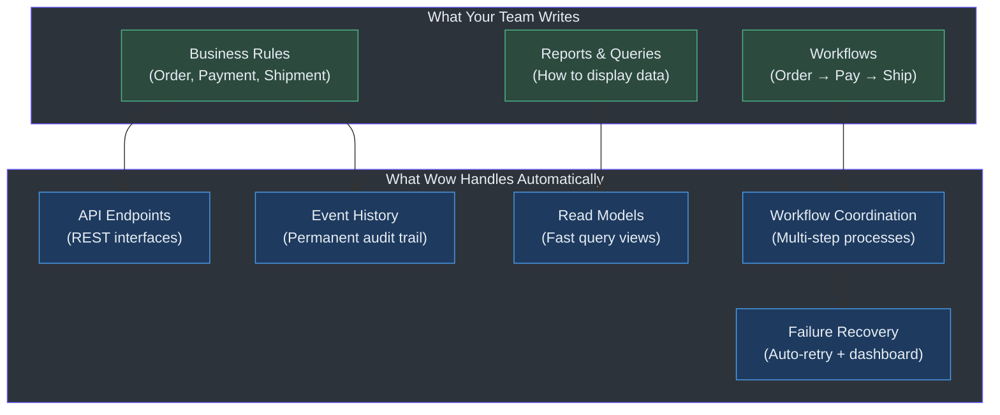
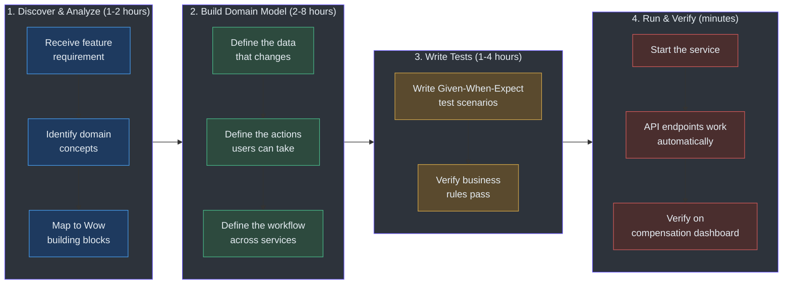
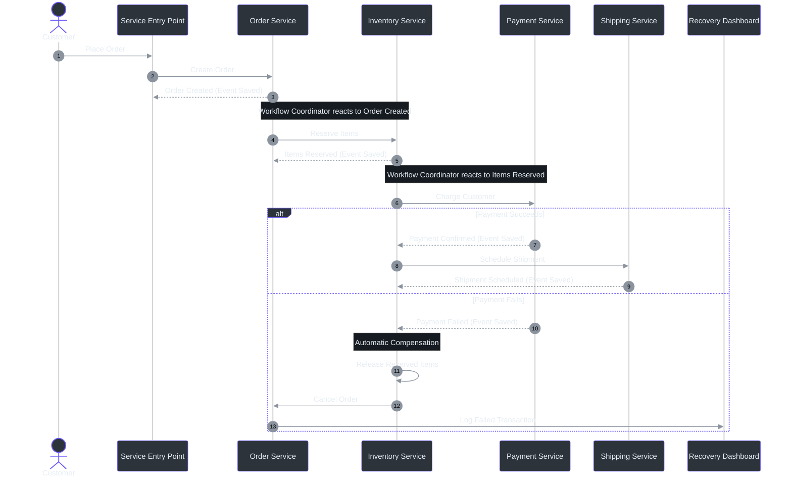
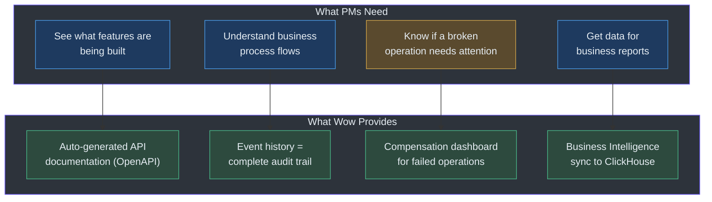
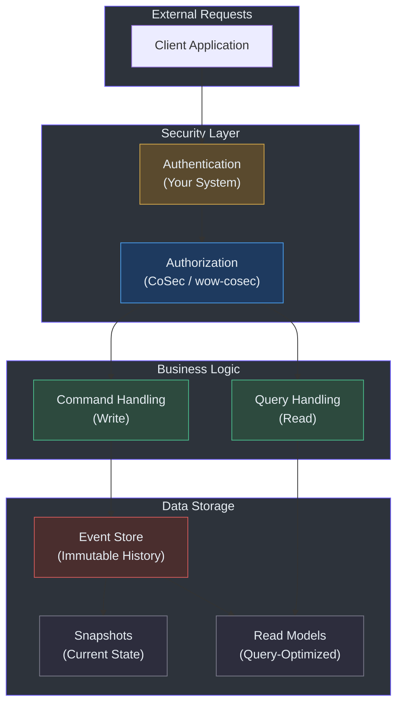

# Product Manager Guide to the Wow Framework

**Audience**: Product Managers, Business Analysts, Project Owners, and any non-engineering stakeholder.

This guide explains what the Wow Framework does in plain language — no jargon, no code, no technical specifications. After reading it, you will understand what your engineering teams can build with Wow, how the development workflow changes compared to traditional approaches, and where Wow fits in your product strategy.

---

## 1. What is Wow? — In Plain Language

Think of Wow as a **blueprint and construction toolkit for building business software**. It handles the heavy lifting of ensuring your data is always correct, traceable, and recoverable, so your development team can focus entirely on your business rules.

Here is what that means in everyday terms:

### The Problem Wow Solves

Imagine you are running an online marketplace. A customer places an order. The system needs to:

- Reserve the items in inventory
- Charge the customer's payment method
- Schedule shipping
- Send a confirmation email

In a traditional system, each step talks directly to a database. If the payment step fails after the inventory is already reserved, your inventory is "stuck." Fixing this requires custom code, manual cleanup, or data patches — each one a source of bugs and customer frustration.

**Wow handles all of this automatically.** Your team writes only the business rules ("when inventory is reserved, charge payment") and Wow manages the rest: tracking what happened, rolling back if something fails, and keeping a permanent record of every decision.

### The Three Core Ideas

| Concept | Plain-Language Analogy | What It Means for Your Product |
|---|---|---|
| **Event Sourcing** | A bank statement records every transaction, not just your final balance. You can always see how you got there. | Every change to your data is saved as a permanent record. You can replay history to audit decisions, debug issues, or rebuild state at any point in time. |
| **CQRS (Command Query Responsibility Segregation)** | A restaurant kitchen has separate counters for taking orders (commands) and picking up food (queries). Each is optimized for its purpose. | The part of the system that makes changes works differently from the part that shows data. This means your dashboards can be lightning fast even under heavy write loads, and each side can scale independently. |
| **Distributed Transactions (Saga)** | A travel agent coordinates your trip: book flight, reserve hotel, rent car. If the hotel is full, the agent cancels the flight and car — not you. | When a business process spans multiple services (inventory, payment, shipping), Wow automatically coordinates the whole workflow and reverses steps if anything fails. No manual cleanup. |

### What Your Team Actually Delivers

With Wow, your development team **writes only the business domain** — the concepts specific to your product (Order, Payment, Customer, Invoice). The framework then automatically:

- Turns those business concepts into working API endpoints (the interfaces other systems call)
- Saves every business decision as a permanent, auditable event
- Keeps read models (dashboards, reports) up to date in near real time
- Coordinates multi-step business processes across services
- Provides a visual dashboard for monitoring and retrying failed operations

<!-- Sources: [settings.gradle.kts:19-63](https://github.com/Ahoo-Wang/Wow/blob/main/settings.gradle.kts#L19-L63) (module structure), [wow-api/src/main/kotlin/me/ahoo/wow/api/Wow.kt:26-45](https://github.com/Ahoo-Wang/Wow/blob/main/wow-api/src/main/kotlin/me/ahoo/wow/api/Wow.kt#L26-L45) (core API contracts), wiki/en/guide/architecture.md (architecture overview), wiki/en/guide/saga.md (distributed transactions) -->

### Who Uses Wow

Wow is built for teams building **business-critical microservices** — applications where data correctness, audit trails, and the ability to recover from failures are non-negotiable. Typical use cases include:

| Industry | Example Product | Why Wow Fits |
|---|---|---|
| **E-Commerce** | Order management, shopping cart, payment processing | Multi-step workflows (order → pay → ship) with automatic compensation on failure |
| **Finance / Banking** | Account transfers, transaction processing | Full audit trail of every state change; point-in-time reconstruction for compliance |
| **Logistics / Supply Chain** | Inventory tracking, shipment orchestration | Cross-service coordination with automatic rollback if a step fails |
| **Insurance** | Claims processing, policy management | Long-running workflows where every decision must be traceable and auditable |
| **SaaS Platforms** | Multi-tenant subscription management | Built-in tenant isolation; authorization framework for role-based access |

These use cases are illustrated by production-validated example projects in the Wow repository: an e-commerce Order & Cart system and a Bank Transfer system.
<!-- Source: [example/example-domain/src/main/kotlin/me/ahoo/wow/example/domain/order/](https://github.com/Ahoo-Wang/Wow/tree/main/example/example-domain/src/main/kotlin/me/ahoo/wow/example/domain/order/) (order domain example), [example/transfer/example-transfer-domain/src/main/java/me/ahoo/wow/example/transfer/domain/](https://github.com/Ahoo-Wang/Wow/tree/main/example/transfer/example-transfer-domain/src/main/java/me/ahoo/wow/example/transfer/domain/) (transfer saga example) -->

---

## 2. User Journey Maps

### Journey A: Developer Building a New Feature End-to-End

This is the most common journey. A product requirement arrives, and a developer builds the feature using Wow's conventions.

<!-- Sources: [wow-test/src/main/kotlin/me/ahoo/wow/test/AggregateSpec.kt:69-108](https://github.com/Ahoo-Wang/Wow/blob/main/test/wow-test/src/main/kotlin/me/ahoo/wow/test/AggregateSpec.kt#L69-L108) (testing DSL), [wow-api/src/main/kotlin/me/ahoo/wow/api/annotation/OnCommand.kt:70-87](https://github.com/Ahoo-Wang/Wow/blob/main/wow-api/src/main/kotlin/me/ahoo/wow/api/annotation/OnCommand.kt#L70-L87) (command handlers), wiki/en/guide/modeling.md (domain modeling workflow), wiki/en/guide/testing.md (Given-When-Expect pattern) -->

**Key insight for PMs**: The testing phase (Phase 3) is integrated into development, not an afterthought. Wow's testing tools let developers verify business rules without setting up databases or infrastructure. This means your acceptance criteria can be directly validated as unit tests, catching bugs before they reach manual QA.

### Journey B: System Handles a Distributed Business Process

This is what happens at runtime when a customer triggers a multi-step operation (for example, placing an order that involves inventory, payment, and shipping).

<!-- Sources: [wow-core/src/main/kotlin/me/ahoo/wow/saga/stateless/StatelessSagaHandler.kt:36-43](https://github.com/Ahoo-Wang/Wow/blob/main/wow-core/src/main/kotlin/me/ahoo/wow/saga/stateless/StatelessSagaHandler.kt#L36-L43) (saga event routing), [compensation/wow-compensation-domain/src/main/kotlin/me/ahoo/wow/compensation/domain/ExecutionFailed.kt:37-138](https://github.com/Ahoo-Wang/Wow/blob/main/compensation/wow-compensation-domain/src/main/kotlin/me/ahoo/wow/compensation/domain/ExecutionFailed.kt#L37-L138) (compensation state machine), wiki/en/guide/saga.md (distributed transaction flow), wiki/en/guide/event-compensation.md (compensation mechanism) -->

**Key insight for PMs**: If any step in this process fails, Wow automatically reverses the steps that already succeeded ("compensation"). Failed operations appear on a visual dashboard where your operations team can inspect and manually retry them if needed. No data gets stuck in an inconsistent state.

### Journey C: PM Reviews Feature Progress Using Wow Capabilities

As a PM, you do not need to understand how the code works. You interact with the team through the capabilities Wow provides:

<!-- Sources: [wow-bi/src/main/kotlin/me/ahoo/wow/bi/](https://github.com/Ahoo-Wang/Wow/tree/main/wow-bi/src/main/kotlin/me/ahoo/wow/bi/) (BI module), [compensation/dashboard/src/](https://github.com/Ahoo-Wang/Wow/tree/main/compensation/dashboard/src/) (React dashboard), wiki/en/guide/architecture.md (auto-generated OpenAPI), wiki/en/guide/bi.md (BI module), wiki/en/guide/event-compensation.md (dashboard) -->

---

## 3. Feature Capability Map

### What Wow Enables

The following table describes each major capability in plain language, the business value it delivers, and where to learn more.

| Capability | Plain-Language Description | Business Value | Learn More |
|---|---|---|---|
| **Permanent Audit Trail** | Every change to your data is saved as an immutable history record. You can replay the entire history to see exactly what happened and when. | Regulatory compliance, customer dispute resolution, forensic debugging of production issues. Answer "why is this order in this state?" instantly. | [Event Sourcing](../deep-dive/architecture/overview.md) |
| **Automatic API Endpoints** | When your team defines a business concept (like an Order), Wow automatically creates the REST API for creating, updating, and querying it. No manual API wiring. | Dramatically faster feature delivery. Consistent API design across all services. API documentation is always up to date. | [Aggregate Modeling](../guide/modeling.md) |
| **Distributed Transaction Coordination** | When a business process spans multiple services (Order → Inventory → Payment → Shipping), Wow coordinates the entire flow and automatically reverses steps if anything fails. | Reliable multi-step processes without custom error-handling code. Operations team can monitor and retry failed processes from a dashboard. | [Saga Transactions](../guide/saga.md) |
| **Automatic Failure Recovery** | If a step in a business process fails (network glitch, downstream service down), Wow retries it automatically with increasing delays between attempts. Failed operations appear on a visual dashboard. | No lost business operations due to transient errors. Operations team gets visibility into failures and can intervene manually if auto-retry is exhausted. | [Event Compensation](../guide/event-compensation.md) |
| **Separate Read and Write Models** | The data structures optimized for making changes differ from those optimized for displaying data. Wow maintains both automatically, keeping them in sync through events. | Fast dashboards and reports even under heavy write loads. Each side can scale independently. Query performance does not degrade write throughput. | [Projection Processors](../guide/projection.md) |
| **Business Intelligence Pipeline** | Wow can stream every business state change directly to data warehouses (like ClickHouse). The BI tool auto-generates the scripts to set this up. | Real-time business dashboards without building custom ETL pipelines. Business analysts get access to complete aggregate state histories for trend analysis. | [Business Intelligence](../guide/bi.md) |
| **Visual Monitoring Dashboard** | A web-based dashboard (built with React / Ant Design) shows every failed business operation, lets your team retry them, modify retry timing, and mark issues as resolved. | Operations visibility without needing to query databases or read logs. Non-engineers can monitor the health of business processes. | [Compensation Dashboard](../guide/event-compensation.md) |
| **Point-in-Time State Reconstruction** | You can ask the system to show you the state of any business object at any point in the past — not just "what is the current state" but "what was the state last Tuesday at 3:14 PM." | Audit and compliance. Customer support can see exactly what a customer saw at a specific moment. Fraud investigation teams can trace state changes over time. | [Event Store](../deep-dive/data/event-store.md) |
| **Built-in Testing Framework** | Developers write tests using plain business scenarios ("Given an empty cart, When I add an item, Expect the cart has one item"). | PMs can review test scenarios as acceptance criteria. Higher test coverage means fewer production bugs. Teams report significantly fewer defects compared to traditional approaches. | [Testing Guide](../guide/testing.md) |
| **Authorization and Access Control** | Wow includes a pluggable authorization framework (`wow-cosec`) that controls who can send which commands and view which data. Multi-tenant isolation is built in. | Security requirements met at the framework level rather than custom per-service implementation. Multi-tenancy support for SaaS products. | [CoSec Documentation](https://github.com/Ahoo-Wang/CoSec) |
| **Observability and Monitoring** | Built-in integration with industry-standard monitoring tools (OpenTelemetry). Every command and event is traced end-to-end. | Performance monitoring. Identify bottlenecks in business processes. SLA tracking for business operations. | [Architecture Overview](../deep-dive/architecture/overview.md) |

### Technology Support Matrix

Wow integrates with your existing infrastructure. Your team can choose the storage, messaging, and search backends that fit your environment:

| Capability | Available Options | Notes |
|---|---|---|
| **Event Storage** (where the audit trail lives) | MongoDB, Redis, MariaDB, PostgreSQL, MySQL | Choose based on your existing infrastructure. All options are production-ready. |
| **Message Transport** (how services communicate) | Apache Kafka | Used for distributing events and commands between services. |
| **Query / Search** (how data is displayed to users) | MongoDB, Elasticsearch | Optimized read models for fast queries. |
| **Snapshot Storage** (performance optimization) | MongoDB, Redis, MariaDB, PostgreSQL, MySQL | Speeds up loading of aggregate state for frequently accessed objects. |
| **Observability** | OpenTelemetry (tracing, metrics, logging) | Integrates with Jaeger, Zipkin, Prometheus, Grafana, and other OpenTelemetry-compatible tools. |
| **ID Generation** | CosId (Snowflake, segment-based) | Globally unique IDs for every business object. No collisions across services. |
| **Data Warehouse** | ClickHouse (via `wow-bi` module) | Auto-generated ETL scripts for business intelligence. |

This matrix reflects the full range of backends supported by Wow's pluggable extension architecture. Each backend is implemented in a separate module so your team can include only what you need.
<!-- Source: [settings.gradle.kts:19-63](https://github.com/Ahoo-Wang/Wow/blob/main/settings.gradle.kts#L19-L63) (all module definitions) -->

---

## 4. Known Limitations

Every technology involves tradeoffs. Here is a candid look at what Wow does and does not handle, so you can make informed decisions about where it fits in your product strategy.

### What Wow Does NOT Do

| Area | Not Included | Why / What to Use Instead |
|---|---|---|
| **User Interface** | Wow has no built-in UI framework or frontend components. (The compensation dashboard is a standalone React app, not a general-purpose UI toolkit.) | Use any frontend framework (React, Vue, Angular) with Wow's auto-generated REST APIs. The compensation dashboard is built with React + Ant Design as one example. |
| **User Authentication** | Wow does not handle user login, passwords, or session management. | Use your existing authentication system (OAuth2, SAML, LDAP). Wow integrates with Spring Security for authorization checks. |
| **File Storage / Blob Storage** | Wow does not store files, images, or documents. It stores business event records, not binary content. | Use cloud object storage (AWS S3, Azure Blob, MinIO) and reference file IDs in Wow aggregates. |
| **Email / SMS / Push Notifications** | Wow does not send notifications. It produces events that a notification service can listen to. | Build a separate notification service that subscribes to Wow events (e.g., "OrderShipped" triggers a "send email to customer" step). |
| **Real-time WebSocket / Streaming to Browsers** | Wow does not push real-time updates to browser clients. It is focused on backend business logic. | Use a WebSocket gateway or Server-Sent Events layer that subscribes to Wow events and forwards them to clients. |
| **Graph Database / Complex Relationship Queries** | Wow does not provide a graph traversal engine for deeply nested relationships. | Use a dedicated graph database or build custom projection queries for relationship-heavy use cases. |
| **Scheduled Jobs / Cron** | Wow's compensation scheduler retries failed operations; it is not a general-purpose job scheduler. | Use a dedicated scheduler (Quartz, Kubernetes CronJobs, cloud scheduler services) for recurring tasks unrelated to compensation. |
| **GDPR Data Erasure** | Since Wow uses event sourcing (immutable event history), you cannot simply delete a row to erase data. | Implement cryptographic erasure: encrypt personally identifiable information with a per-user key and delete the key when a deletion request is received. This makes the encrypted data unreadable. |
| **Legacy System Synchronization** | Wow does not provide bidirectional sync with legacy systems out of the box. | Build anti-corruption layers that translate between your legacy system's data format and Wow's event-driven model. |

### Architectural Tradeoffs

These are not limitations per se, but characteristics of the event-driven approach that affect planning:

| Characteristic | What It Means | Mitigation |
|---|---|---|
| **Eventual Consistency** | After a command is processed, the read models (dashboards, reports) may take a few milliseconds to update. Users might briefly see stale data. | Wow's "wait strategy" lets you choose how long the client waits. For use cases requiring immediate read-after-write, the `PROJECTED` wait mode ensures the read model is updated before responding. |
| **Event Storage Growth** | Every business change is saved forever. Over years, the event store grows large, increasing storage costs. | Wow's snapshot mechanism keeps frequently accessed aggregates fast. Archive older events to cold storage. Storage is cheap relative to the value of audit data. |
| **Learning Curve** | The event-driven mental model is different from traditional CRUD. Developers need to learn to think in events rather than database rows. | The Wow project template provides a working example. The testing framework reduces the risk of incorrectly implemented business rules. Most teams become productive within 2-4 weeks. |
| **Not for Simple CRUD** | For applications where you just need to store and retrieve data with no business logic, Wow is overkill. | Simple CRUD apps are better served by traditional frameworks. Wow is designed for applications with meaningful business rules and multi-step processes. |

---

## 5. Data and Privacy Overview

This section explains what data Wow handles, where it lives, and what you need to know about privacy and compliance.

### What Data Wow Manages

| Data Category | What It Contains | Storage Location | Retention |
|---|---|---|---|
| **Domain Events** | Records of every business decision: "Order #1234 was created by Customer A at 3:14 PM." Includes the full context of what changed and why. | Configured event store (MongoDB, Redis, PostgreSQL, etc.) | Permanent by default; configurable retention policy |
| **Aggregate Snapshots** | Compressed summaries of the current state of each business object, created periodically to speed up loading. | Configured snapshot store (same options as event store) | Replaced on each new snapshot; old snapshots can be pruned |
| **Read Models** | Optimized representations of business data for fast querying. For example, a "Pending Orders" view for the warehouse team. | Elasticsearch or MongoDB | Updated in near real time as events flow through the system |
| **Compensation Records** | Details of every failed business operation: what failed, when, how many retry attempts, and the current status. | Same event store as domain events | Historical record; can be cleared for resolved entries |
| **Command Messages** | The initial request that triggered a business operation. Contains the intent (e.g., "Place Order") and the data submitted. | Passed through the message bus; not persistently stored by default | Transient; logged via observability tooling |

### Privacy and Compliance Considerations

**Multi-Tenancy**: Wow has built-in support for tenant isolation. Each piece of data is tagged with a tenant identifier, ensuring that Customer A's data is never visible to Customer B. This is critical for SaaS products serving multiple organizations.

**Data Residency**: Since you choose where to deploy each storage backend (event store, snapshot store, read model store), you control where data physically resides. Deploy Wow services in the geographic region that meets your compliance requirements.

**Audit Trail for Compliance**: The permanent event history directly supports compliance requirements such as:

- **SOC 2**: Complete record of every data change with timestamps and context
- **PCI DSS**: Traceable payment state transitions
- **HIPAA**: Auditable access and modification of health-related data (with appropriate encryption at rest)
- **GDPR**: See note below on data erasure

**GDPR Right to Erasure**: Because event sourcing creates an immutable history, you cannot simply delete rows from a database to comply with a deletion request. The recommended approach is **cryptographic erasure**: encrypt personally identifiable data with a customer-specific key, and when a deletion request arrives, delete the encryption key. The encrypted data becomes permanently unreadable while preserving the integrity of the event history.

**Data Minimization**: Design your domain events to contain only business-relevant information. Avoid storing personally identifiable information (names, email addresses, IP addresses) in the event store unless it is essential for the business process. Reference customer profiles by ID rather than embedding full personal details in every event.

### Security Architecture

<!-- Sources: [settings.gradle.kts:40](https://github.com/Ahoo-Wang/Wow/blob/main/settings.gradle.kts#L40) (wow-cosec module), [wow-cosec/src/main/kotlin/me/ahoo/wow/cosec/](https://github.com/Ahoo-Wang/Wow/tree/main/wow-cosec/src/main/kotlin/me/ahoo/wow/cosec/) (authorization framework), wiki/en/guide/architecture.md (security layer), wiki/en/guide/saga.md (multi-tenancy) -->

**Key points**: Authentication (proving who you are) is handled by your existing system. Authorization (what you are allowed to do) can use Wow's built-in `wow-cosec` module for fine-grained, policy-based access control at the command and query level.

---

## 6. Frequently Asked Questions

### General

**Q: Is Wow a product or a framework?**

A: Wow is an open-source framework (Apache 2.0 license). It is a set of building blocks your development team uses to create business software. It is not a SaaS product you subscribe to. There are no licensing fees or usage limits.

**Q: What programming language does Wow use?**

A: Wow is written in Kotlin and runs on the Java Virtual Machine (JVM). Your development team needs Kotlin or Java expertise. The primary example applications are in both Kotlin and Java to demonstrate that either language works.

**Q: Can we incrementally adopt Wow, or do we need to rewrite our existing system?**

A: Incremental adoption is the recommended approach. Wow services can coexist with your existing systems. Start with a new bounded context (a self-contained business domain) and let Wow services interact with your existing services through standard REST APIs or event streams. You do not need to rewrite everything at once.

**Q: How does Wow compare to other frameworks like Axon Framework?**

A: Both Wow and Axon are CQRS + Event Sourcing frameworks for the JVM. Key differences: Wow is built on reactive programming (non-blocking I/O), uses compile-time code generation to avoid runtime reflection overhead, provides a built-in compensation dashboard, and integrates deeply with the Co ecosystem (CosId for IDs, CoCache for caching, CoSec for security). Axon has a longer history and larger community. Your engineering team can evaluate both based on your specific requirements.

**Q: Is Wow suitable for small projects, or is it overkill?**

A: Wow is designed for applications with meaningful business rules and multi-step processes. For a simple CRUD application (store and retrieve data with no business logic), Wow adds unnecessary complexity. A good rule of thumb: if your business process has more than two steps that must all succeed or all fail together, Wow's saga and compensation features add real value.

### Development Process

**Q: How long does it take a new developer to become productive with Wow?**

A: Teams typically report 2 to 4 weeks to become productive. The learning curve is in the event-driven mental model, not in the framework itself. The provided project template and example applications accelerate onboarding significantly.

**Q: How do I, as a PM, review what was built?**

A: Several ways:
- **Auto-generated API documentation**: Wow produces up-to-date OpenAPI specs automatically. You can view all available endpoints through Swagger UI or other API documentation tools.
- **Test scenarios as acceptance criteria**: Wow's Given-When-Expect test patterns read like plain business scenarios. Ask your developers to share the test files — they show exactly which business rules are enforced.
- **Compensation dashboard**: Shows all failed business operations and their current status. A clean dashboard means your business processes are healthy.

**Q: How do Wow teams estimate feature work?**

A: Since Wow eliminates a large amount of infrastructure code (API wiring, event persistence, message routing), the bulk of development time goes into:
- Defining the domain model (what concepts exist and how they relate) — the PM's primary collaboration area
- Writing business rules as test scenarios — PMs can review and sign off on these
- Configuring the compensation and retry behavior — PMs should define the business expectations for retry timing

Teams using Wow typically deliver features faster than with traditional frameworks because the infrastructure is handled automatically.

### Operations and Reliability

**Q: What happens when something fails?**

A: Wow has multiple layers of failure handling:

| Layer | Mechanism | Example |
|---|---|---|
| **Immediate Retry** | Retries the failed handler automatically with configurable attempts | Network timeout → retry 3 times |
| **Compensation** | Records the failure as a persistent event and retries with exponential backoff | Downstream service is down → retry every 1 min, 2 min, 4 min, up to max attempts |
| **Manual Intervention** | Failed operations appear on the compensation dashboard for human review | All auto-retries exhausted → operator inspects and manually retries or marks as resolved |

**Q: Can we monitor the health of business processes?**

A: Yes. Wow integrates with OpenTelemetry, which means it works with standard monitoring tools (Grafana, Jaeger, Prometheus, Datadog, etc.). You can create dashboards that show:
- Number of orders created per minute
- Average time from order to shipment
- Count of failed payment transactions
- Compensation retry success rate

The compensation dashboard also provides a dedicated view of failed operations, visible to non-engineering staff.

**Q: How much data will the event store accumulate?**

A: This depends on your business volume. As a rough estimate, each business operation generates one or more event records, each typically 1-5 KB in size. For a system processing 100,000 orders per day with an average of 5 events per order, you would accumulate approximately 500 MB per day or about 180 GB per year. Wow's snapshot mechanism keeps frequently accessed objects fast regardless of total event history size.

**Q: What happens if the database runs out of space?**

A: Event store backends (MongoDB, Redis, PostgreSQL) have their own scaling mechanisms. You can also archive older events to cold storage (object storage, data warehouse) and configure retention policies. The critical insight: events are append-only, so the write path is never slowed by data volume — only the read path for historical queries is affected, and snapshots mitigate that.

---

## 7. How Product Managers Can Contribute

You do not need to write code to be a valuable contributor to a Wow-based project. Here is where your skills make the biggest impact:

### 1. Domain Modeling Sessions

**What it is**: A collaborative session where PMs and developers define the business concepts the system needs to represent.

**Your role**: You own the business domain knowledge. Describe the concepts (Order, Payment, Shipment), their relationships, and the rules that govern them. The developers translate these into Wow aggregates, commands, and events.

**Example agenda for a domain modeling session**:

| Activity | PM Contribution | Developer Action |
|---|---|---|
| Identify the core business objects | "Our system has Orders, Line Items, Products, and Shipments." | Define aggregate roots and their boundaries |
| Define what actions users can take | "A customer can place an order, cancel an order, or modify line items." | Define commands |
| List the business rules | "An order can only be cancelled if it has not shipped. Free shipping applies to orders over $50." | Implement business rule validation |
| Trace the cross-service workflow | "When an order is placed: (1) reserve inventory, (2) charge payment, (3) ship. If payment fails, release the inventory." | Define saga coordination |

### 2. Reviewing Test Scenarios

**What it is**: Wow's testing framework uses plain-language scenarios that describe business behavior.

**Your role**: Review the Given-When-Expect test scenarios your developers write to verify they match your product requirements.

**What to look for**:
- Does each scenario cover a real user action?
- Are the business rules enforced correctly?
- Are edge cases covered (what happens when inventory is insufficient, when payment fails, etc.)?

The test file becomes a living specification of your business rules. If a scenario is missing, ask for it to be added.

### 3. Defining Compensation and Retry Policies

**What it is**: When a business process step fails, Wow retries it. You define how aggressive the retry should be.

**Your role**: Answer the business questions that determine retry configuration:

| Business Question | Retry Configuration | Example |
|---|---|---|
| How long should we keep trying before giving up? | `maxRetries` | Payment authorization: try 5 times over several hours. Inventory reservation: try 3 times over minutes. |
| How fast should retries happen? | `minBackoff` (initial delay, doubles each attempt) | Customer-facing operation: start at 30 seconds. Back-office batch: start at 5 minutes. |
| What errors should we retry? | `recoverable` / `unrecoverable` exceptions | Retry on network timeout, don't retry on "product discontinued." |
| How quickly should an individual retry time out? | `executionTimeout` | Simple operation: 10 seconds. External API call: 60 seconds. |

### 4. Providing Feedback on the Compensation Dashboard

**What it is**: The visual dashboard for monitoring and managing failed operations.

**Your role**: Use the dashboard to understand the operational health of your product and provide feedback on what information is most useful:

- Are the status labels clear to non-engineers?
- What filters or views would help your operations team?
- Do the notification events (which can be sent to WeChat Work or other messaging platforms) provide the right information?

### 5. Defining Business Intelligence Needs

**What it is**: Wow can stream business data to analytics platforms for reporting and dashboards.

**Your role**: Define what business metrics matter, what dashboards you need, and what questions you need to answer:

- What is the daily order volume trend?
- What is the average time from order to shipment?
- Which products have the highest cancellation rate?
- What is the payment failure rate by payment method?

The `wow-bi` module can generate the data pipeline scripts automatically from the business model your team has defined. Your input ensures the right data reaches the right people.

### 6. Participating in the Open Source Community

Wow is an open-source project (Apache 2.0 license) maintained on GitHub. PMs can contribute in non-code ways:

- **Feature requests**: Create GitHub issues describing business scenarios Wow does not yet support
- **Documentation improvements**: Suggest clarifications to the documentation (including this guide) based on your experience onboarding
- **Use case sharing**: Share how your team uses Wow so others can learn from your experience
- **Community participation**: Join discussions about the project's direction and priorities

---

## Summary

The Wow Framework lets your development team focus on what makes your product unique — the business rules — while it handles the infrastructure concerns of data persistence, event routing, API generation, workflow coordination, and failure recovery.

For PMs, the key takeaways are:

1. **Faster feature delivery**: Infrastructure is automatic. Developers build business logic and tests.
2. **Complete audit trail**: Every business decision is permanently recorded. Compliance and debugging are built in.
3. **Automatic failure handling**: Multi-step processes are coordinated and failed steps are retried automatically with a visual dashboard for human oversight.
4. **You play a critical role**: Domain modeling, test scenario review, retry policy definition, and BI requirements are all areas where PM input directly shapes the product.
5. **Open source, no lock-in**: Apache 2.0 license with no fees. Integrates with your existing infrastructure.

---

## Related Pages

| Page | Description |
|---|---|
| [Getting Started Guide](../guide/index.md) | Developer onboarding — project setup, dependencies, build commands |
| [Architecture Overview](../guide/architecture.md) | Deep dive into Wow's layered architecture and module structure |
| [Domain Modeling](../guide/modeling.md) | How to design aggregate roots, commands, and events |
| [Saga Transactions](../guide/saga.md) | Distributed transaction coordination across services |
| [Event Compensation](../guide/event-compensation.md) | Automatic failure recovery and the visual compensation dashboard |
| [Business Intelligence](../guide/bi.md) | Streaming business data to data warehouses for analytics |
| [Testing Guide](../guide/testing.md) | Given-When-Expect testing pattern for business rule validation |
| [Projection Processors](../guide/projection.md) | How read models are built and kept up to date |
| [Configuration Reference](../reference/config/basic.md) | All configuration properties for customizing Wow behavior |
| [Example: Order Domain](../reference/example/order.md) | A working example of an e-commerce order system built with Wow |
| [Example: Bank Transfer](../reference/example/transfer.md) | A working example of a financial transfer system built with Wow |
