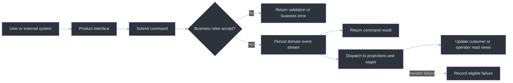
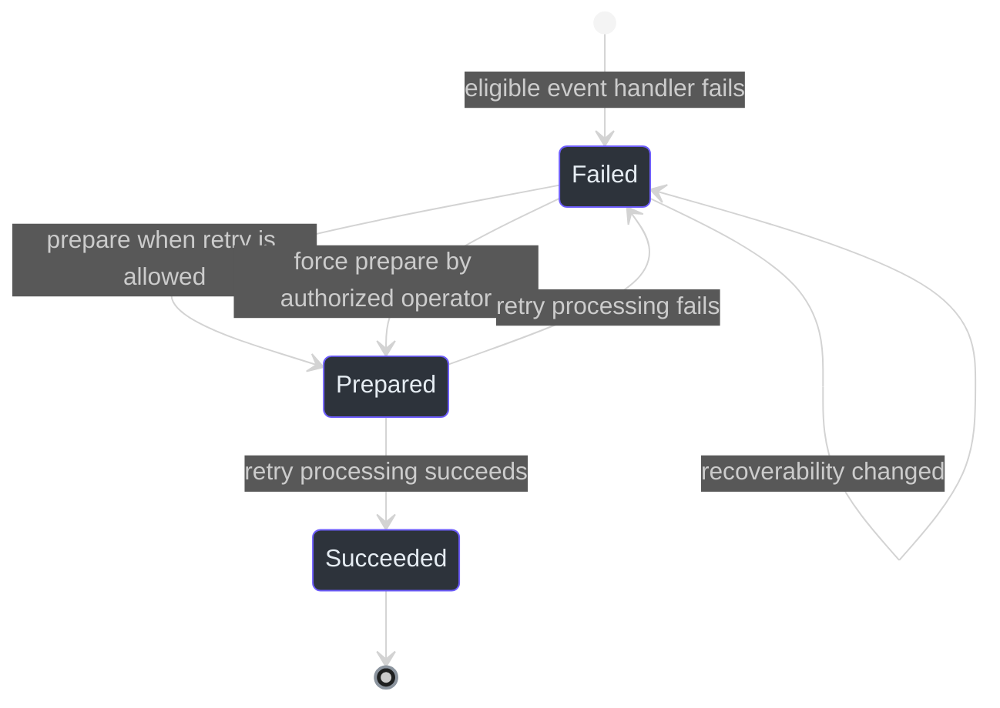
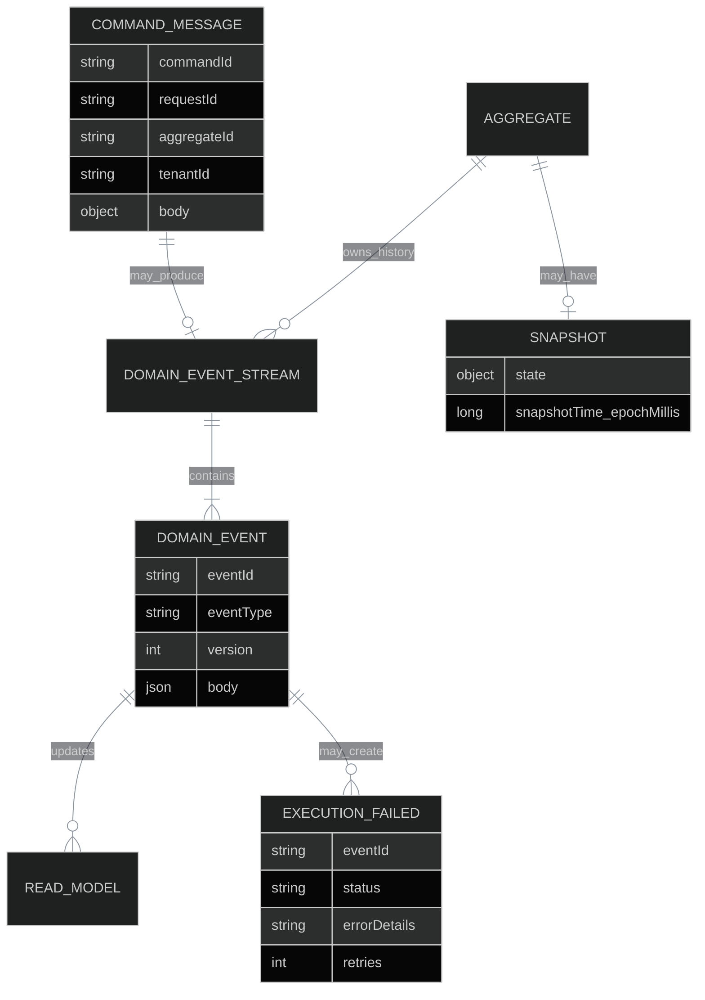

# Product Manager Guide

## Purpose and evidence baseline

This guide explains Wow in product language: what users can do, which product
flows it can support, what data it handles, and which decisions still belong to
the application team.

It is for product managers, delivery leads, business analysts, designers,
support leaders, and engineering partners evaluating a Wow-based product.

The evidence baseline is the `main` branch of the Wow repository.

Wow describes itself as a reactive CQRS and Event Sourcing framework. It is a
toolkit for building applications. It is not a ready-made customer product,
hosted platform, or replacement for product discovery.

The current repository version is `8.10.4`.

Sources:

- [README.md:7-9](https://github.com/Ahoo-Wang/Wow/blob/main/README.md#L7-L9)
- [gradle.properties:21-29](https://github.com/Ahoo-Wang/Wow/blob/main/gradle.properties#L21-L29)

## What problem does Wow help solve?

Many business systems need more than the latest value in a database row.

They may need to know which request changed an order, reconstruct how an
account reached its current state, update several read views, or recover an
asynchronous handler after a temporary failure.

Wow gives engineering teams building blocks for those needs:

- A **command** expresses an action a user or system wants to perform.
- An **aggregate** checks business rules for one consistency boundary.
- A **domain event** records something that happened.
- An **event stream** groups ordered events produced by one command.
- A **snapshot** stores a current state checkpoint for faster loading.
- A **projection** updates a view optimized for reading or searching.
- A **saga** reacts to events and coordinates a longer workflow.
- A **compensation record** makes selected event-handler failures visible and
  retryable.

These concepts can make behavior and history explicit. They also add product
and operational states that must be designed: pending work, delayed views,
failed handlers, retries, replay, and data retention.

Sources:

- [CommandMessage.kt:53-125](https://github.com/Ahoo-Wang/Wow/blob/main/wow-api/src/main/kotlin/me/ahoo/wow/api/command/CommandMessage.kt#L53-L125)
- [DomainEventStream.kt:31-56](https://github.com/Ahoo-Wang/Wow/blob/main/wow-core/src/main/kotlin/me/ahoo/wow/event/DomainEventStream.kt#L31-L56)
- [Snapshot.kt:19-40](https://github.com/Ahoo-Wang/Wow/blob/main/wow-core/src/main/kotlin/me/ahoo/wow/eventsourcing/snapshot/Snapshot.kt#L19-L40)

## Product boundary

Wow can provide framework behavior and technical endpoints.

The adopter still defines:

- The customer and operator experiences.
- Business commands and validation rules.
- Event names, meaning, and compatibility.
- Which read models customers see.
- What “complete,” “pending,” “failed,” and “recovered” mean to users.
- Authentication, authorization, rate limits, and operator roles.
- Service levels, support commitments, and escalation paths.
- Data classification, retention, deletion, and residency policies.
- The product roadmap and delivery dates.

The repository does not declare these application-specific choices.

## Primary user journey

The normal journey starts with an application request. The aggregate validates
the request, accepted changes become events, and downstream handlers update
other views or workflows.

```mermaid
%%{init: {"theme": "dark", "themeVariables": {"primaryColor": "#2d333b", "primaryBorderColor": "#6d5dfc", "primaryTextColor": "#e6edf3", "lineColor": "#8b949e", "secondaryColor": "#161b22", "secondaryBorderColor": "#30363d", "tertiaryColor": "#161b22", "clusterBkg": "#161b22", "clusterBorder": "#30363d"}}}%%
flowchart LR
    U["User or external system"] --> UI["Product interface"]
    UI --> C["Submit command"]
    C --> A{"Business rules accept?"}
    A -->|"No"| E["Return validation or business error"]
    A -->|"Yes"| EV["Persist domain event stream"]
    EV --> ACK["Return command result"]
    EV --> H["Dispatch to projections and sagas"]
    H --> R["Update customer or operator read views"]
    H -. "handler failure" .-> F["Record eligible failure"]
    classDef journey fill:#2d333b,stroke:#6d5dfc,color:#e6edf3
    classDef boundary fill:#161b22,stroke:#30363d,color:#e6edf3
    class U,UI,C,A,E,EV,ACK,H,R,F journey
    linkStyle default stroke:#8b949e
```

<!-- Sources: [CommandMessage.kt:53-125](https://github.com/Ahoo-Wang/Wow/blob/main/wow-api/src/main/kotlin/me/ahoo/wow/api/command/CommandMessage.kt#L53-L125), [DomainEventStream.kt:31-56](https://github.com/Ahoo-Wang/Wow/blob/main/wow-core/src/main/kotlin/me/ahoo/wow/event/DomainEventStream.kt#L31-L56), [CompensationFilter.kt:58-119](https://github.com/Ahoo-Wang/Wow/blob/main/compensation/wow-compensation-core/src/main/kotlin/me/ahoo/wow/compensation/core/CompensationFilter.kt#L58-L119) -->

### Product decisions in this journey

1. Does the product wait for processing or acknowledge acceptance first?
2. Which failures are shown immediately to the user?
3. Can a read view lag behind the accepted command?
4. What wording explains a pending update without implying data loss?
5. Which correlation or request identifier can support staff safely see?
6. Which operations are safe to retry from the customer interface?
7. When should a product workflow require human review?

Wow provides a unified command-submission route. Its separate wait route
receives a `SimpleWaitSignal` notification; it does not submit the command.
The application still decides which interaction pattern is appropriate.

Sources:

- [BuiltInHttpRoutes.kt:18-25](https://github.com/Ahoo-Wang/Wow/blob/main/wow-openapi/src/main/kotlin/me/ahoo/wow/openapi/contract/BuiltInHttpRoutes.kt#L18-L25)
- [CommandWaitRouteContributor.kt:31-65](https://github.com/Ahoo-Wang/Wow/blob/main/wow-openapi/src/main/kotlin/me/ahoo/wow/openapi/contributor/global/CommandWaitRouteContributor.kt#L31-L65)
- [CommandWaitHandlerFunction.kt:32-44](https://github.com/Ahoo-Wang/Wow/blob/main/wow-webflux/src/main/kotlin/me/ahoo/wow/webflux/wait/CommandWaitHandlerFunction.kt#L32-L44)
- [CommandFacadeRouteContributor.kt:30-55](https://github.com/Ahoo-Wang/Wow/blob/main/wow-openapi/src/main/kotlin/me/ahoo/wow/openapi/contributor/global/CommandFacadeRouteContributor.kt#L30-L55)
- [CommandFacadeHandlerFunction.kt:35-52](https://github.com/Ahoo-Wang/Wow/blob/main/wow-webflux/src/main/kotlin/me/ahoo/wow/webflux/route/command/CommandFacadeHandlerFunction.kt#L35-L52)

## Failure-recovery journey

The compensation subsystem records failures from selected event-processing
paths. Operators can inspect records, adjust retry settings, change a supported
function reference, mark recoverability, prepare a retry, or force preparation.

It does not undo the original command. It does not automatically or
unconditionally restore business consistency. A retry repeats eligible event
handling and may cause external side effects if the application is not designed
for safe repetition.

```mermaid
%%{init: {"theme": "dark", "themeVariables": {"primaryColor": "#2d333b", "primaryBorderColor": "#6d5dfc", "primaryTextColor": "#e6edf3", "lineColor": "#8b949e", "secondaryColor": "#161b22", "secondaryBorderColor": "#30363d", "tertiaryColor": "#161b22", "clusterBkg": "#161b22", "clusterBorder": "#30363d"}}}%%
stateDiagram-v2
    [*] --> Failed: eligible event handler fails
    Failed --> Prepared: prepare when retry is allowed
    Failed --> Prepared: force prepare by authorized operator
    Prepared --> Succeeded: retry processing succeeds
    Prepared --> Failed: retry processing fails
    Failed --> Failed: retry settings or function changed
    Failed --> Failed: recoverability changed
    Succeeded --> [*]
    classDef status fill:#2d333b,stroke:#6d5dfc,color:#e6edf3
    class Failed,Prepared,Succeeded status
```

<!-- Sources: [ExecutionFailedState.kt:65-99](https://github.com/Ahoo-Wang/Wow/blob/main/compensation/wow-compensation-domain/src/main/kotlin/me/ahoo/wow/compensation/domain/ExecutionFailedState.kt#L65-L99), [Actions.tsx:32-105](https://github.com/Ahoo-Wang/Wow/blob/main/compensation/dashboard/src/features/Failed/Actions.tsx#L32-L105), [ChangeFunction.tsx:28-123](https://github.com/Ahoo-Wang/Wow/blob/main/compensation/dashboard/src/features/Failed/ChangeFunction.tsx#L28-L123) -->

### Operator journey

1. Open a failure category such as To Retry, Executing, Next Retry,
   NonRetryable, Succeeded, or Unrecoverable.
2. Filter by record, event, aggregate, context, or function information.
3. Inspect error details, event identity, tenant, aggregate, retry policy, and
   recoverability.
4. Decide whether retry is safe for the business side effects involved.
5. If allowed, prepare the record or force preparation through an authorized
   process.
6. Observe whether the retry returns to Failed or reaches Succeeded.
7. Escalate records that cannot be safely recovered automatically.

The dashboard currently exposes these categories and actions. The repository
does not declare an operator role model, approval workflow, audit retention, or
response-time target.

Sources:

- [routes/constants.tsx:18-71](https://github.com/Ahoo-Wang/Wow/blob/main/compensation/dashboard/src/routes/constants.tsx#L18-L71)
- [FailedSearch.tsx:24-95](https://github.com/Ahoo-Wang/Wow/blob/main/compensation/dashboard/src/features/Failed/FailedSearch.tsx#L24-L95)
- [FailedDetails.tsx:29-223](https://github.com/Ahoo-Wang/Wow/blob/main/compensation/dashboard/src/features/Failed/details/FailedDetails.tsx#L29-L223)

## Feature capability map

Here, “Live” means the repository contains the implementation. It does not mean
the feature is enabled, operated, or supported by every adopting application.

| Product need | Wow capability | Status | What users may experience | Limitations |
| --- | --- | --- | --- | --- |
| Express intent | Commands | Live | Submit a named business action | Application defines wording, validation, and permission |
| Preserve history | Domain events and event streams | Live | Support can trace how state changed | Application decides what data may be stored long term |
| Load current state | State reconstruction and snapshots | Live | Current business state can be loaded | Application defines freshness and error experience |
| Build query views | Projections | Live | Task-specific lists and searches can be built | Application must explain update delays where relevant |
| Coordinate workflows | Sagas | Live | Multi-step processes can react to events | Application defines pending, timeout, and cancellation states |
| Route messaging | Kafka, Redis, in-memory, or no-op bus | Live | Usually invisible infrastructure behavior | Guarantees and outage behavior depend on the selected option |
| Route storage | Per-model event and snapshot stores | Live | Different domains can use different backends | Migration and support complexity are adopter-owned |
| Submit over HTTP | Built-in command routes | Live | Product or integration clients can send actions | Endpoints need local protection and client-error design |
| Inspect metadata | Metadata endpoint | Live | Tools can discover registered models | Exposure decision is adopter-owned |
| Generate global IDs | ID endpoint | Live | Clients can request identifier text | Trust boundary and availability need are adopter-owned |
| Operate failures | Compensation service and dashboard | Live | Operators inspect and retry selected failures | History view is incomplete; roles and safe retry policy are not supplied |
| Describe endpoints | OpenAPI integration | Live | Client tooling can read an API description | Version and generated-client governance are adopter-owned |
| Observe runtime | Metrics and OpenTelemetry | Live | Support can correlate processing activity | Dashboards, alerts, and support playbooks are not supplied |
| Generate BI scripts | Optional ClickHouse-oriented SQL generation | Live | Data teams receive SQL generated from registered model metadata; after they execute it, ClickHouse Kafka Engine consumers read command and state-event topics | Generation uses a no-op deployment inspector by default; SQL execution, Kafka, ClickHouse, data movement, and analytics policy are adopter-owned |
| Test domain rules | Aggregate test DSL | Live | Teams can verify business behavior | Product scenarios and edge cases remain application-owned |

Sources:

- [BuiltInHttpRoutes.kt:18-75](https://github.com/Ahoo-Wang/Wow/blob/main/wow-openapi/src/main/kotlin/me/ahoo/wow/openapi/contract/BuiltInHttpRoutes.kt#L18-L75)
- [BusProperties.kt:21-45](https://github.com/Ahoo-Wang/Wow/blob/main/wow-spring-boot-starter/src/main/kotlin/me/ahoo/wow/spring/boot/starter/BusProperties.kt#L21-L45)
- [StorageRoutingProperties.kt:19-36](https://github.com/Ahoo-Wang/Wow/blob/main/wow-spring-boot-starter/src/main/kotlin/me/ahoo/wow/spring/boot/starter/eventsourcing/routing/StorageRoutingProperties.kt#L19-L36)
- [WowOpenTelemetryAutoConfiguration.kt:30-69](https://github.com/Ahoo-Wang/Wow/blob/main/wow-spring-boot-starter/src/main/kotlin/me/ahoo/wow/spring/boot/starter/opentelemetry/WowOpenTelemetryAutoConfiguration.kt#L30-L69)
- [CompensationFilter.kt:58-119](https://github.com/Ahoo-Wang/Wow/blob/main/compensation/wow-compensation-core/src/main/kotlin/me/ahoo/wow/compensation/core/CompensationFilter.kt#L58-L119)
- [OpenAPIProperties.kt:21-27](https://github.com/Ahoo-Wang/Wow/blob/main/wow-spring-boot-starter/src/main/kotlin/me/ahoo/wow/spring/boot/starter/openapi/OpenAPIProperties.kt#L21-L27)
- [BiScriptProperties.kt:30-52](https://github.com/Ahoo-Wang/Wow/blob/main/wow-spring-boot-starter/src/main/kotlin/me/ahoo/wow/spring/boot/starter/bi/BiScriptProperties.kt#L30-L52)
- [BiScriptProperties.kt:55-66](https://github.com/Ahoo-Wang/Wow/blob/main/wow-spring-boot-starter/src/main/kotlin/me/ahoo/wow/spring/boot/starter/bi/BiScriptProperties.kt#L55-L66)
- [GenerateBIScriptHandlerFunction.kt:87-112](https://github.com/Ahoo-Wang/Wow/blob/main/wow-webflux/src/main/kotlin/me/ahoo/wow/webflux/route/global/GenerateBIScriptHandlerFunction.kt#L87-L112)
- [ClickHouseCommandRenderer.kt:108-120](https://github.com/Ahoo-Wang/Wow/blob/main/wow-bi/src/main/kotlin/me/ahoo/wow/bi/renderer/ClickHouseCommandRenderer.kt#L108-L120)
- [ClickHouseStateEventRenderer.kt:119-132](https://github.com/Ahoo-Wang/Wow/blob/main/wow-bi/src/main/kotlin/me/ahoo/wow/bi/renderer/ClickHouseStateEventRenderer.kt#L119-L132)
- [AggregateSpec.kt:69-109](https://github.com/Ahoo-Wang/Wow/blob/main/test/wow-test/src/main/kotlin/me/ahoo/wow/test/AggregateSpec.kt#L69-L109)

## Product data model

The diagram shows the framework records that can connect a request to stored
events, current state, read models, and a failure record.

```mermaid
%%{init: {"theme": "dark", "themeVariables": {"primaryColor": "#2d333b", "primaryBorderColor": "#6d5dfc", "primaryTextColor": "#e6edf3", "lineColor": "#8b949e", "secondaryColor": "#161b22", "secondaryBorderColor": "#30363d", "tertiaryColor": "#161b22", "clusterBkg": "#161b22", "clusterBorder": "#30363d"}}}%%
erDiagram
    COMMAND_MESSAGE ||--o| DOMAIN_EVENT_STREAM : may_produce
    DOMAIN_EVENT_STREAM ||--|{ DOMAIN_EVENT : contains
    AGGREGATE ||--o{ DOMAIN_EVENT_STREAM : owns_history
    AGGREGATE ||--o| SNAPSHOT : may_have
    DOMAIN_EVENT ||--o{ READ_MODEL : updates
    DOMAIN_EVENT ||--o{ EXECUTION_FAILED : may_create
    COMMAND_MESSAGE {
        string commandId
        string requestId
        string aggregateId
        string tenantId
        object body
    }
    DOMAIN_EVENT {
        string eventId
        string eventType
        int version
        json body
    }
    SNAPSHOT {
        object state
        long snapshotTime_epochMillis
    }
    EXECUTION_FAILED {
        string eventId
        string status
        string errorDetails
        int retries
    }
```

<!-- Sources: [SimpleCommandMessage.kt:46-60](https://github.com/Ahoo-Wang/Wow/blob/main/wow-core/src/main/kotlin/me/ahoo/wow/command/SimpleCommandMessage.kt#L46-L60), [DomainEventStream.kt:31-42](https://github.com/Ahoo-Wang/Wow/blob/main/wow-core/src/main/kotlin/me/ahoo/wow/event/DomainEventStream.kt#L31-L42), [DomainEventStream.kt:100-115](https://github.com/Ahoo-Wang/Wow/blob/main/wow-core/src/main/kotlin/me/ahoo/wow/event/DomainEventStream.kt#L100-L115), [EventStreamRecord.kt:35-122](https://github.com/Ahoo-Wang/Wow/blob/main/wow-core/src/main/kotlin/me/ahoo/wow/serialization/event/EventStreamRecord.kt#L35-L122), [Snapshot.kt:19-40](https://github.com/Ahoo-Wang/Wow/blob/main/wow-core/src/main/kotlin/me/ahoo/wow/eventsourcing/snapshot/Snapshot.kt#L19-L40), [IExecutionFailedState.kt:28-44](https://github.com/Ahoo-Wang/Wow/blob/main/compensation/wow-compensation-api/src/main/kotlin/me/ahoo/wow/compensation/api/IExecutionFailedState.kt#L28-L44) -->

A rejected or void command can produce no event stream. When a stream exists,
its command ID identifies exactly one non-empty stream.

### Data inventory

| Data | Examples of fields in code | Why it exists | Product and privacy question |
| --- | --- | --- | --- |
| Command message | Body, aggregate ID, tenant ID, request ID, command ID, headers, create time | Carries user or system intent | Does body or metadata contain personal data? |
| Domain event | Event body, event ID, type, version, aggregate context, timestamp | Records an accepted business change | How long may immutable history be retained? |
| Event stream | Command/request identity, tenant, owner, space, ordered events | Connects one command to resulting changes | Who may inspect full history? |
| Snapshot | Current state and snapshot time | Speeds state loading | Does the snapshot duplicate sensitive event data? |
| Read model | Application-defined fields | Supports product queries and search | What freshness and deletion behavior apply? |
| Failure record | Error message, stack trace, binding errors, event identity, retry status | Supports diagnosis and retry | Could technical errors reveal personal or secret data? |
| Request metadata | User-Agent and remote IP can be appended to headers | Supports correlation and context | Is notice, consent, minimization, or masking required? |
| Trace and metrics attributes | Message, request, trace, and aggregate metadata | Supports operational visibility | Which identifiers are safe to export? |

Sources:

- [MessageSerializer.kt:26-65](https://github.com/Ahoo-Wang/Wow/blob/main/wow-core/src/main/kotlin/me/ahoo/wow/serialization/MessageSerializer.kt#L26-L65)
- [AbstractEventStreamJsonSerializer.kt:21-53](https://github.com/Ahoo-Wang/Wow/blob/main/wow-core/src/main/kotlin/me/ahoo/wow/serialization/event/AbstractEventStreamJsonSerializer.kt#L21-L53)
- [IExecutionFailedState.kt:28-44](https://github.com/Ahoo-Wang/Wow/blob/main/compensation/wow-compensation-api/src/main/kotlin/me/ahoo/wow/compensation/api/IExecutionFailedState.kt#L28-L44)
- [WowInstrumenter.kt:26-35](https://github.com/Ahoo-Wang/Wow/blob/main/wow-opentelemetry/src/main/kotlin/me/ahoo/wow/opentelemetry/WowInstrumenter.kt#L26-L35)

## Configuration and feature switches

Configuration controls technical behavior. Product managers should understand
which user-visible states can change when operators change these values.

| Configuration | Repository default | Product effect | Who can change it |
| --- | --- | --- | --- |
| `wow.enabled` | `true` | Enables the Wow runtime integration | Deployment operator |
| Shutdown timeout | 60 seconds | Allows in-flight work time to stop; no recovery target is implied | Deployment operator |
| Shutdown quiet period | 1 second | Adds a quiet interval during shutdown | Deployment operator |
| Bus type | Kafka | Selects the default command/event transport | Platform or deployment operator |
| Local-first bus | `true` | Prefers local handling before external bus where supported | Platform or deployment operator |
| Event store | MongoDB; alternatives are Redis, Elasticsearch, in-memory, or delay | Selects event persistence; in-memory and delay modes are non-durable/test-oriented | Platform or deployment operator |
| Snapshots | Enabled | Allows stored state checkpoints | Platform or deployment operator |
| Snapshot store | MongoDB; alternatives are Redis, Elasticsearch, in-memory, or delay | Selects snapshot persistence; in-memory and delay modes are non-durable/test-oriented | Platform or deployment operator |
| Prepare support | Enabled | Enables aggregate preparation support | Application or deployment operator |
| OpenAPI | Enabled | Makes API description support available | Application or deployment operator |
| WebFlux integration | Enabled | Makes HTTP integration available; universal authentication and rate limits are not supplied | Application or deployment operator |
| Global WebFlux error handling | Enabled | Uses shared framework error handling | Application or deployment operator |
| WebFlux batch concurrency | 1 | Processes batch items with configured concurrency | Deployment operator |
| Compensation | Enabled | Makes compensation integration available; safe retry policy is separate | Application or deployment operator |
| Compensation max retries | 10 | Limits automatic retry attempts | Compensation service operator |
| Compensation min backoff | 180 seconds | Delays retries | Compensation service operator |
| Compensation execution timeout | 120 seconds | Bounds an attempt | Compensation service operator |
| Compensation scheduler batch | 100 | Limits records considered in one scheduler batch | Compensation service operator |
| Compensation scheduler period | 60 seconds | Sets scheduler cadence; no recovery SLA is implied | Compensation service operator |
| Metrics | Enabled when supported | Produces runtime measurements | Platform or deployment operator |
| OpenTelemetry | Conditionally enabled | Produces trace instrumentation when dependencies exist | Platform or deployment operator |
| BI script | Enabled | Generates SQL from registered model metadata and returns it to the caller; it does not execute the SQL | Application or deployment operator |
| BI deployment inspector | No-op | Does not contact ClickHouse during generation unless changed to the ClickHouse inspector | Data platform or deployment operator |
| BI topology | Cluster | Selects default ClickHouse topology | Data platform or deployment operator |
| MongoDB event-store batching | Disabled | Changes the write trade-off if enabled | Platform or deployment operator |

Sources:

- [WowProperties.kt:23-35](https://github.com/Ahoo-Wang/Wow/blob/main/wow-spring-boot-starter/src/main/kotlin/me/ahoo/wow/spring/boot/starter/WowProperties.kt#L23-L35)
- [BusProperties.kt:21-45](https://github.com/Ahoo-Wang/Wow/blob/main/wow-spring-boot-starter/src/main/kotlin/me/ahoo/wow/spring/boot/starter/BusProperties.kt#L21-L45)
- [EventStoreProperties.kt:20-25](https://github.com/Ahoo-Wang/Wow/blob/main/wow-spring-boot-starter/src/main/kotlin/me/ahoo/wow/spring/boot/starter/eventsourcing/store/EventStoreProperties.kt#L20-L25)
- [StorageType.kt:16-30](https://github.com/Ahoo-Wang/Wow/blob/main/wow-spring-boot-starter/src/main/kotlin/me/ahoo/wow/spring/boot/starter/eventsourcing/StorageType.kt#L16-L30)
- [DelayEventStore.kt:26-29](https://github.com/Ahoo-Wang/Wow/blob/main/test/wow-mock/src/main/kotlin/me/ahoo/wow/eventsourcing/mock/DelayEventStore.kt#L26-L29)
- [DelaySnapshotStore.kt:24-27](https://github.com/Ahoo-Wang/Wow/blob/main/test/wow-mock/src/main/kotlin/me/ahoo/wow/eventsourcing/mock/DelaySnapshotStore.kt#L24-L27)
- [ElasticsearchEventSourcingAutoConfiguration.kt:77-169](https://github.com/Ahoo-Wang/Wow/blob/main/wow-spring-boot-starter/src/main/kotlin/me/ahoo/wow/spring/boot/starter/elasticsearch/ElasticsearchEventSourcingAutoConfiguration.kt#L77-L169)
- [SnapshotProperties.kt:23-45](https://github.com/Ahoo-Wang/Wow/blob/main/wow-spring-boot-starter/src/main/kotlin/me/ahoo/wow/spring/boot/starter/eventsourcing/snapshot/SnapshotProperties.kt#L23-L45)
- [PrepareProperties.kt:21-42](https://github.com/Ahoo-Wang/Wow/blob/main/wow-spring-boot-starter/src/main/kotlin/me/ahoo/wow/spring/boot/starter/prepare/PrepareProperties.kt#L21-L42)
- [OpenAPIProperties.kt:21-27](https://github.com/Ahoo-Wang/Wow/blob/main/wow-spring-boot-starter/src/main/kotlin/me/ahoo/wow/spring/boot/starter/openapi/OpenAPIProperties.kt#L21-L27)
- [WebFluxProperties.kt:22-44](https://github.com/Ahoo-Wang/Wow/blob/main/wow-spring-boot-starter/src/main/kotlin/me/ahoo/wow/spring/boot/starter/webflux/WebFluxProperties.kt#L22-L44)
- [CompensationProperties.kt:21-27](https://github.com/Ahoo-Wang/Wow/blob/main/wow-spring-boot-starter/src/main/kotlin/me/ahoo/wow/spring/boot/starter/compensation/CompensationProperties.kt#L21-L27)
- [Retry.kt:57-99](https://github.com/Ahoo-Wang/Wow/blob/main/wow-api/src/main/kotlin/me/ahoo/wow/api/annotation/Retry.kt#L57-L99)
- [server CompensationProperties.kt:21-33](https://github.com/Ahoo-Wang/Wow/blob/main/compensation/wow-compensation-server/src/main/kotlin/me/ahoo/wow/compensation/server/configuration/CompensationProperties.kt#L21-L33)
- [SchedulerProperties.kt:22-37](https://github.com/Ahoo-Wang/Wow/blob/main/compensation/wow-compensation-server/src/main/kotlin/me/ahoo/wow/compensation/server/scheduler/SchedulerProperties.kt#L22-L37)
- [BiScriptProperties.kt:30-52](https://github.com/Ahoo-Wang/Wow/blob/main/wow-spring-boot-starter/src/main/kotlin/me/ahoo/wow/spring/boot/starter/bi/BiScriptProperties.kt#L30-L52)
- [BiScriptProperties.kt:55-66](https://github.com/Ahoo-Wang/Wow/blob/main/wow-spring-boot-starter/src/main/kotlin/me/ahoo/wow/spring/boot/starter/bi/BiScriptProperties.kt#L55-L66)
- [BiScriptProperties.kt:110-165](https://github.com/Ahoo-Wang/Wow/blob/main/wow-spring-boot-starter/src/main/kotlin/me/ahoo/wow/spring/boot/starter/bi/BiScriptProperties.kt#L110-L165)
- [GenerateBIScriptHandlerFunction.kt:87-112](https://github.com/Ahoo-Wang/Wow/blob/main/wow-webflux/src/main/kotlin/me/ahoo/wow/webflux/route/global/GenerateBIScriptHandlerFunction.kt#L87-L112)
- [MongoEventStoreBatchProperties.kt:21-42](https://github.com/Ahoo-Wang/Wow/blob/main/wow-spring-boot-starter/src/main/kotlin/me/ahoo/wow/spring/boot/starter/mongo/MongoEventStoreBatchProperties.kt#L21-L42)
- [ConditionalOnMetricsEnabled.kt:20-28](https://github.com/Ahoo-Wang/Wow/blob/main/wow-spring-boot-starter/src/main/kotlin/me/ahoo/wow/spring/boot/starter/metrics/ConditionalOnMetricsEnabled.kt#L20-L28)
- [ConditionalOnOpenTelemetryEnabled.kt:21-30](https://github.com/Ahoo-Wang/Wow/blob/main/wow-spring-boot-starter/src/main/kotlin/me/ahoo/wow/spring/boot/starter/opentelemetry/ConditionalOnOpenTelemetryEnabled.kt#L21-L30)

## Built-in API surface

The route set provides framework operations. Exact aggregate-specific paths are
derived from registered models and route contributors.

| Capability | Endpoint/Method | Authentication | Rate Limits |
| --- | --- | --- | --- |
| Receive a wait-completion signal; this does not submit a command | `POST /wow/command/wait` | Not declared; CoSec integration is optional | Not declared |
| Submit a command through the unified facade | `POST /wow/command/send` | Not declared; CoSec integration is optional | Not declared |
| Read Wow model metadata | `GET /wow/metadata` | Not declared; CoSec integration is optional | Not declared |
| Generate a global identifier | `GET /wow/id/global` | Not declared; CoSec integration is optional | Not declared |
| Generate and return BI SQL or a JSON result | `POST /wow/bi/script` | Not declared; CoSec integration is optional | Not declared |
| Send a typed aggregate command | Aggregate command route | Not declared; application permission is required | Not declared |
| Query aggregate state | State query route | Not declared; application privacy rules are required | Not declared |
| Query or regenerate snapshots | Snapshot routes | Not declared; restrict as an operator capability | Not declared |
| Count, list, page, load, compensate, or resend events | Event routes | Not declared; restrict as an operator capability | Not declared |

The repository does not declare one universal authentication policy, operator
role model, public exposure policy, rate limit, or API service level. CoSec is
an optional feature capability that can be active when its classes are present;
that does not make every deployment protected automatically.

Sources:

- [BuiltInHttpRoutes.kt:18-75](https://github.com/Ahoo-Wang/Wow/blob/main/wow-openapi/src/main/kotlin/me/ahoo/wow/openapi/contract/BuiltInHttpRoutes.kt#L18-L75)
- [CommandWaitRouteContributor.kt:40-60](https://github.com/Ahoo-Wang/Wow/blob/main/wow-openapi/src/main/kotlin/me/ahoo/wow/openapi/contributor/global/CommandWaitRouteContributor.kt#L40-L60)
- [CommandWaitHandlerFunction.kt:32-44](https://github.com/Ahoo-Wang/Wow/blob/main/wow-webflux/src/main/kotlin/me/ahoo/wow/webflux/wait/CommandWaitHandlerFunction.kt#L32-L44)
- [CommandFacadeRouteContributor.kt:35-52](https://github.com/Ahoo-Wang/Wow/blob/main/wow-openapi/src/main/kotlin/me/ahoo/wow/openapi/contributor/global/CommandFacadeRouteContributor.kt#L35-L52)
- [CommandFacadeHandlerFunction.kt:35-52](https://github.com/Ahoo-Wang/Wow/blob/main/wow-webflux/src/main/kotlin/me/ahoo/wow/webflux/route/command/CommandFacadeHandlerFunction.kt#L35-L52)
- [GenerateBIScriptRouteContributor.kt:37-100](https://github.com/Ahoo-Wang/Wow/blob/main/wow-openapi/src/main/kotlin/me/ahoo/wow/openapi/contributor/global/GenerateBIScriptRouteContributor.kt#L37-L100)
- [GenerateBIScriptHandlerFunction.kt:87-112](https://github.com/Ahoo-Wang/Wow/blob/main/wow-webflux/src/main/kotlin/me/ahoo/wow/webflux/route/global/GenerateBIScriptHandlerFunction.kt#L87-L112)
- [EventRouteContributor.kt:56-207](https://github.com/Ahoo-Wang/Wow/blob/main/wow-openapi/src/main/kotlin/me/ahoo/wow/openapi/contributor/aggregate/event/EventRouteContributor.kt#L56-L207)
- [wow-spring-boot-starter/build.gradle.kts:40-42](https://github.com/Ahoo-Wang/Wow/blob/main/wow-spring-boot-starter/build.gradle.kts#L40-L42)
- [CoSecAutoConfiguration.kt:27-45](https://github.com/Ahoo-Wang/Wow/blob/main/wow-spring-boot-starter/src/main/kotlin/me/ahoo/wow/spring/boot/starter/cosec/CoSecAutoConfiguration.kt#L27-L45)

## Performance and service-level boundary

The repository includes a short README stress-test sample and a benchmark-smoke
workflow. Neither is a current product SLA.

The README sample ran for two minutes and reports send and processed rates and
latencies for two example commands. The linked performance deployment uses a
specific resource profile and image version `6.11.3`, while the current root
version is `8.10.4`.

Use the sample to discover what to test, not to promise customer outcomes.

| Operation | Expected Latency | Throughput Limit | Current SLA |
| --- | --- | --- | --- |
| Command submission | Not declared; historical example numbers are not a promise | Not declared | Not declared |
| Command processing | Not declared; depends on domain work and selected backends | Not declared | Not declared |
| Read-view update | Not declared; no freshness target is supplied | Not declared | Not declared |
| Event persistence and state loading | Not declared; depends on the selected store and workload | Not declared | Not declared |
| Compensation retry | Scheduler defaults exist, but no recovery-time expectation is declared | Scheduler batch defaults to 100; production limit not declared | Not declared |
| Dashboard operation | Not declared | Not declared | Not declared |
| Autoscaling | Not applicable as a fixed latency; example HPA uses an 80% CPU target | Example range is 2–10 replicas; production limit not declared | Not declared |

Sources:

- [README.md:94-109](https://github.com/Ahoo-Wang/Wow/blob/main/README.md#L94-L109)
- [deploy/example/perf/deployment.yaml:33-80](https://github.com/Ahoo-Wang/Wow/blob/main/deploy/example/perf/deployment.yaml#L33-L80)
- [.github/workflows/benchmark-smoke.yml:14-58](https://github.com/Ahoo-Wang/Wow/blob/main/.github/workflows/benchmark-smoke.yml#L14-L58)
- [deploy/example/hpa.yaml:1-18](https://github.com/Ahoo-Wang/Wow/blob/main/deploy/example/hpa.yaml#L1-L18)

### Product performance questions

- How long may a customer wait for command acceptance?
- How long may a read view lag after acceptance?
- How should the interface show pending processing?
- When should an operation time out in the client?
- What happens when the bus or event store is unavailable?
- How old may a compensation backlog become before escalation?
- Which product flows require synchronous confirmation?
- Which flows can complete asynchronously with notification?

These answers are application requirements, not defaults supplied by Wow.

## Known limitations and cautions

| Limitation | User Impact | Workaround | Planned Fix |
| --- | --- | --- | --- |
| Compensation covers eligible event-handler paths, not universal rollback | A retry cannot be presented as undoing the original business action | Require a business safety decision before retry | Not declared |
| Dashboard history requires EventStream query support from the configured storage | Operators receive paged lifecycle records when supported and an explicit unavailable state otherwise; retention and export remain adopter responsibilities | Use a query-capable storage and an approved audit process | Storage-specific |
| Example image versions differ from root `8.10.4` | Example behavior may not match current source | Build reviewed artifacts from the selected release | Not declared |
| Example compensation configuration includes inline credentials | Copying the example can expose reusable secrets | Replace values with the adopter's secret mechanism | Not declared |
| Default aggregate deletion is not a general event-erasure mechanism | A delete action may not satisfy data-erasure obligations | Minimize regulated event data and design a store-specific lifecycle process | Not declared |
| No repository-wide SLA, capacity envelope, or data policy | Product commitments cannot be derived from framework defaults | Define and validate them for the adopter service | Not declared |

### Compensation is controlled retry, not universal rollback

The filter records failures for domain event, stateless saga, projection, and
snapshot dispatch paths. Event compensation support accepts event and state
event function kinds. This is narrower than every command, workflow, or
external side effect.

Sources:

- [CompensationFilter.kt:58-119](https://github.com/Ahoo-Wang/Wow/blob/main/compensation/wow-compensation-core/src/main/kotlin/me/ahoo/wow/compensation/core/CompensationFilter.kt#L58-L119)
- [EventCompensateSupporter.kt:33-69](https://github.com/Ahoo-Wang/Wow/blob/main/wow-core/src/main/kotlin/me/ahoo/wow/messaging/compensation/EventCompensateSupporter.kt#L33-L69)

### Operator history depends on storage capability

The compensation dashboard queries paged EventStream lifecycle records only
when an operator expands the history section. It exposes loading, retry,
pagination, and an explicit unavailable state when the configured storage does
not provide EventStream queries. Product and operations teams must still define
retention, access, and export requirements before treating it as an audit trail.

Sources:

- [ExecutionHistory.tsx:119-383](https://github.com/Ahoo-Wang/Wow/blob/main/compensation/dashboard/src/features/Failed/history/ExecutionHistory.tsx#L119-L383)
- [executionFailedEventStreamClient.ts:17-33](https://github.com/Ahoo-Wang/Wow/blob/main/compensation/dashboard/src/services/executionFailedEventStreamClient.ts#L17-L33)

### Examples are not production commitments

Deployment images in examples do not match the current root version. A sample
configuration also contains inline demo credentials. Product launch criteria
must use reviewed application manifests, not copy examples unchanged.

Sources:

- [gradle.properties:21-23](https://github.com/Ahoo-Wang/Wow/blob/main/gradle.properties#L21-L23)
- [deploy/example/deployment.yaml:26-31](https://github.com/Ahoo-Wang/Wow/blob/main/deploy/example/deployment.yaml#L26-L31)
- [deploy/compensation/deployment.yaml:21-26](https://github.com/Ahoo-Wang/Wow/blob/main/deploy/compensation/deployment.yaml#L21-L26)
- [deploy/compensation/config.yaml:43-52](https://github.com/Ahoo-Wang/Wow/blob/main/deploy/compensation/config.yaml#L43-L52)

### Default aggregate deletion is not a general event-erasure mechanism

The default delete command emits a deletion event, and state reconstruction
uses that event to toggle a deleted flag. The shared `EventStore` contract
provides append and load operations but no general erase operation. This does
not prove that every adopter backend can never support erasure; it means the
framework's default delete behavior is insufficient evidence for an erasure
claim. Products with erasure obligations need a separately reviewed,
store-specific data strategy.

Sources:

- [DefaultDeleteAggregateFunction.kt:25-45](https://github.com/Ahoo-Wang/Wow/blob/main/wow-core/src/main/kotlin/me/ahoo/wow/modeling/command/DefaultDeleteAggregateFunction.kt#L25-L45)
- [SimpleStateAggregate.kt:151-169](https://github.com/Ahoo-Wang/Wow/blob/main/wow-core/src/main/kotlin/me/ahoo/wow/modeling/state/SimpleStateAggregate.kt#L151-L169)
- [EventStore.kt:22-122](https://github.com/Ahoo-Wang/Wow/blob/main/wow-core/src/main/kotlin/me/ahoo/wow/eventsourcing/EventStore.kt#L22-L122)

## Privacy, security, and data policy

Wow can persist event bodies, event metadata, aggregate identifiers, tenant
identifiers, command and request identifiers, and headers.

WebFlux integration registers User-Agent and remote IP header appenders by
default when their enablement properties are absent; each appender can be
disabled through configuration. Command headers can propagate to event streams,
and serialized messages include headers.

Failure records can contain error messages, stack traces, and binding errors.
Those fields may reveal user data, secrets, or internal implementation details
depending on the application.

The repository does not declare retention periods, data residency, encryption
policy, compliance certifications, or a general right-to-erasure mechanism.

| Data Type | Storage Location | Retention | Compliance |
| --- | --- | --- | --- |
| Command body, identifiers, and headers | In-flight message path and selected bus; exact durable handling is application-specific | Not declared | Not declared |
| Event body and event-stream metadata | Selected event store; MongoDB is the default store type | Not declared | Not declared |
| Snapshot state | Selected snapshot store; MongoDB is the default store type | Not declared | Not declared |
| Read-model data | Application-selected projection store; Wow does not select or write to one universal projection backend | Not declared | Not declared |
| Compensation error details and retry state | Compensation service stores selected by its deployment; example uses MongoDB and Redis | Not declared | Not declared |
| User-Agent and remote IP command headers | Command headers and potentially propagated event metadata when default appenders remain enabled | Not declared | Not declared |
| Trace and metric attributes | Adopter-selected observability backend | Not declared | Not declared |
| Generated BI SQL | Returned to the HTTP caller as SQL or JSON; the repository does not persist or execute the response | Not declared | Not declared |
| BI-synchronized command and state-event data | ClickHouse only after the adopter executes the generated SQL; the created Kafka Engine consumers ingest matching topics | Not declared | Not declared |

Sources:

- [CommandRequestRemoteIpHeaderAppender.kt:21-50](https://github.com/Ahoo-Wang/Wow/blob/main/wow-webflux/src/main/kotlin/me/ahoo/wow/webflux/route/command/appender/CommandRequestRemoteIpHeaderAppender.kt#L21-L50)
- [CommandRequestUserAgentHeaderAppender.kt:21-26](https://github.com/Ahoo-Wang/Wow/blob/main/wow-webflux/src/main/kotlin/me/ahoo/wow/webflux/route/command/appender/CommandRequestUserAgentHeaderAppender.kt#L21-L26)
- [WebFluxAutoConfiguration.kt:141-158](https://github.com/Ahoo-Wang/Wow/blob/main/wow-spring-boot-starter/src/main/kotlin/me/ahoo/wow/spring/boot/starter/webflux/WebFluxAutoConfiguration.kt#L141-L158)
- [CommandRequestHeaderPropagator.kt:19-80](https://github.com/Ahoo-Wang/Wow/blob/main/wow-core/src/main/kotlin/me/ahoo/wow/messaging/propagation/CommandRequestHeaderPropagator.kt#L19-L80)
- [DomainEventStreamFactory.kt:77-119](https://github.com/Ahoo-Wang/Wow/blob/main/wow-core/src/main/kotlin/me/ahoo/wow/event/DomainEventStreamFactory.kt#L77-L119)
- [IExecutionFailedState.kt:28-44](https://github.com/Ahoo-Wang/Wow/blob/main/compensation/wow-compensation-api/src/main/kotlin/me/ahoo/wow/compensation/api/IExecutionFailedState.kt#L28-L44)
- [EventStoreProperties.kt:20-25](https://github.com/Ahoo-Wang/Wow/blob/main/wow-spring-boot-starter/src/main/kotlin/me/ahoo/wow/spring/boot/starter/eventsourcing/store/EventStoreProperties.kt#L20-L25)
- [SnapshotProperties.kt:23-45](https://github.com/Ahoo-Wang/Wow/blob/main/wow-spring-boot-starter/src/main/kotlin/me/ahoo/wow/spring/boot/starter/eventsourcing/snapshot/SnapshotProperties.kt#L23-L45)
- [deploy/compensation/config.yaml:38-52](https://github.com/Ahoo-Wang/Wow/blob/main/deploy/compensation/config.yaml#L38-L52)
- [BiScriptProperties.kt:69-165](https://github.com/Ahoo-Wang/Wow/blob/main/wow-spring-boot-starter/src/main/kotlin/me/ahoo/wow/spring/boot/starter/bi/BiScriptProperties.kt#L69-L165)
- [GenerateBIScriptHandlerFunction.kt:87-112](https://github.com/Ahoo-Wang/Wow/blob/main/wow-webflux/src/main/kotlin/me/ahoo/wow/webflux/route/global/GenerateBIScriptHandlerFunction.kt#L87-L112)
- [ClickHouseCommandRenderer.kt:108-120](https://github.com/Ahoo-Wang/Wow/blob/main/wow-bi/src/main/kotlin/me/ahoo/wow/bi/renderer/ClickHouseCommandRenderer.kt#L108-L120)
- [ClickHouseStateEventRenderer.kt:119-132](https://github.com/Ahoo-Wang/Wow/blob/main/wow-bi/src/main/kotlin/me/ahoo/wow/bi/renderer/ClickHouseStateEventRenderer.kt#L119-L132)
- [wow-spring-boot-starter/build.gradle.kts:5-44](https://github.com/Ahoo-Wang/Wow/blob/main/wow-spring-boot-starter/build.gradle.kts#L5-L44)

### Privacy readiness checklist

- [ ] Classify command bodies, event bodies, headers, snapshots, projections,
  traces, and failure details.
- [ ] Document why IP and User-Agent collection is needed or disable it where
  appropriate.
- [ ] Define event, snapshot, projection, compensation, and telemetry retention.
- [ ] Define access rules for event query, resend, compensate, and snapshot
  regeneration operations.
- [ ] Review tenant context separately from authentication and authorization.
- [ ] Redact secrets and personal data from exceptions and binding errors.
- [ ] Design a lawful erasure process before storing regulated personal data in
  immutable events.
- [ ] Verify encryption, key ownership, backup, and residency in every selected
  backend.
- [ ] Make only evidence-backed compliance claims.

## Product launch checklist

### Experience

- [ ] Every command has success, rejection, pending, timeout, and retry copy.
- [ ] The UI explains possible read-model delay where users can notice it.
- [ ] Duplicate submission and refresh behavior are designed.
- [ ] Support can correlate a customer report without exposing unsafe data.
- [ ] Operator workflows distinguish safe retry from business correction.

### Data

- [ ] Event names and meanings are reviewed as durable product contracts.
- [ ] Sensitive fields are minimized.
- [ ] Retention, deletion, backup, and restore policies are approved.
- [ ] Projection rebuild behavior is tested.
- [ ] Analytics data movement is reviewed.

### Operations

- [ ] Availability, latency, freshness, and recovery objectives are defined.
- [ ] Alerts and escalation paths have named owners.
- [ ] Load tests use the real product workflow and production-like topology.
- [ ] Broker/store outages and recovery are rehearsed.
- [ ] Compensation backlog and operator actions are observable.

### Security

- [ ] Every built-in route has an exposure decision.
- [ ] Authentication, authorization, and rate limits are implemented where
  required.
- [ ] Force retry, resend, compensate, and regeneration operations are tightly
  controlled.
- [ ] Sample credentials are not used in deployed environments.
- [ ] Security review covers all selected optional integrations.

## Glossary

| Term | Plain-language meaning |
| --- | --- |
| Aggregate | One business consistency boundary that checks rules and changes state |
| Aggregate ID | The identifier used to address that boundary |
| Command | A request to perform a named business action |
| Command ID | Identifier for one command message |
| Request ID | Identifier that can connect related processing |
| Domain event | A record that a meaningful business change happened |
| Event stream | Ordered events produced by one command for one aggregate |
| Event Sourcing | Building current state from stored domain events |
| Snapshot | A saved state checkpoint used to speed loading |
| Projection | A handler that builds a view for reading or searching |
| Read model | Data shaped for a customer, operator, or reporting query |
| Saga | A component that reacts to events across a longer workflow |
| Compensation | In this project, controlled retry support for selected event handlers |
| Replay | Processing stored events again to rebuild or repair derived state |
| Resend | Publishing an event again through a supported operation |
| Recoverable | A failure marked as eligible for the recovery workflow |
| Tenant ID | Context used in aggregate and event metadata; not by itself an access-control guarantee |
| OpenAPI | A machine-readable description of HTTP operations |
| OpenTelemetry | Instrumentation standard used to export trace information |
| SLO | A measurable internal service objective; none is supplied universally by Wow |
| SLA | A service commitment; none is declared by the repository |

## Frequently asked questions

### 1. Is Wow an end-user product?

No. It is a framework and module set used by engineering teams to build
applications.

### 2. Does every Wow product need Kafka, MongoDB, Redis, and Elasticsearch?

No. The starter exposes optional capabilities and selectable bus/store types.
Elasticsearch is an event/snapshot storage and query adapter, not a universal
application projection writer. The right subset depends on the use case.

### 3. Does a successful command mean every screen is already updated?

Not necessarily. Projections and sagas can process events asynchronously. The
product must define and communicate freshness expectations.

### 4. Can Wow show how a business state changed?

The event stream stores ordered events and related metadata. What is safe and
useful to show depends on application permissions and data policy.

### 5. Does the compensation dashboard reverse a bad command?

No. It manages selected event-handler failures and retries. It is not universal
command rollback or guaranteed business reconciliation.

### 6. Can every failure be retried?

No. Recoverability, retry limits, supported function kinds, and business side
effects constrain safe retry.

### 7. Is there a complete operator audit history in the dashboard?

Do not assume so. The dashboard provides paged EventStream lifecycle records
when the configured storage supports the query, but the repository does not
declare an organizational retention, access, or export policy.

### 8. What are the default retry values?

The backend defaults are ten retries, a minimum backoff of 180 seconds, and an
execution timeout of 120 seconds. The dashboard presents and submits both
timing values in seconds, with contract tests covering their unit and int32
bounds.

### 9. Does Wow guarantee a throughput or latency number?

No. The README contains a historical two-minute sample, not a current SLA or a
guarantee for another workload.

### 10. Is autoscaling included?

The repository contains example Kubernetes HPA manifests. Production scaling
and capacity remain deployment decisions.

### 11. Does a tenant ID guarantee tenant isolation?

No. Tenant metadata provides context and routing information. Authentication,
authorization, storage isolation, and query controls still need explicit design.

### 12. Does deleting an aggregate erase its event history?

Do not assume so. The default delete behavior emits an event and marks rebuilt
state as deleted, while the shared event-store contract has no general erase
operation. Any store-specific erasure process needs separate design and proof.

### 13. Does Wow define data retention or residency?

No repository-wide retention period or residency policy is declared.

### 14. Are built-in HTTP endpoints automatically safe for public exposure?

No. The adopter must decide exposure, authentication, authorization, network
controls, and rate limits. CoSec integration is optional.

### 15. Can product teams generate API descriptions?

OpenAPI support is available and enabled by default in its configuration, but
contract publication and client compatibility still need governance.

### 16. What should a product team measure first?

Measure command acceptance and processing latency, read-view freshness,
failure and compensation backlog age, error rates, and event/store growth for
the actual customer journey.

### 17. Who owns the Wow-based service?

The repository does not name an owner for an adopter's service. The adopting
organization must assign product, engineering, operations, security, and data
ownership.

### 18. What is on the Wow roadmap?

No roadmap or delivery-date commitment is declared in the repository. Confirm
future plans with maintainers before using them in product commitments.

### 19. Does Wow provide a compliance certification?

No repository-wide compliance certification is declared. Compliance depends on
the application, deployment, policies, and organizational controls.

### 20. When is Wow a poor fit?

It may be a poor fit when the product only needs simple record updates, event
history has little value, or the organization cannot operate the additional
messaging, storage, replay, and recovery responsibilities.

## Product decision summary

Wow can make business intent, history, asynchronous views, and selected
recovery actions explicit. Those capabilities are most valuable when the
product genuinely needs them.

They also create visible product states and durable data obligations. Product
plans should include pending and failure experiences, freshness expectations,
operator safety, data lifecycle, and workload-specific service objectives.

Treat repository examples as starting points. Treat only implemented code,
tests, and configuration as evidence of current capability. Treat ownership,
SLA, retention, compliance, and roadmap as unknown until an accountable party
declares them.
