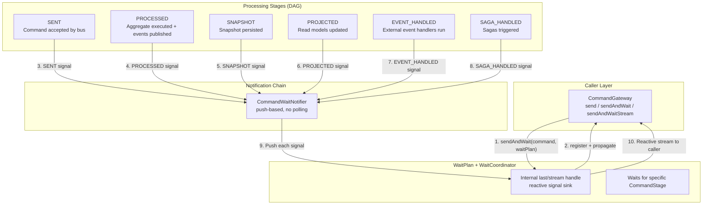
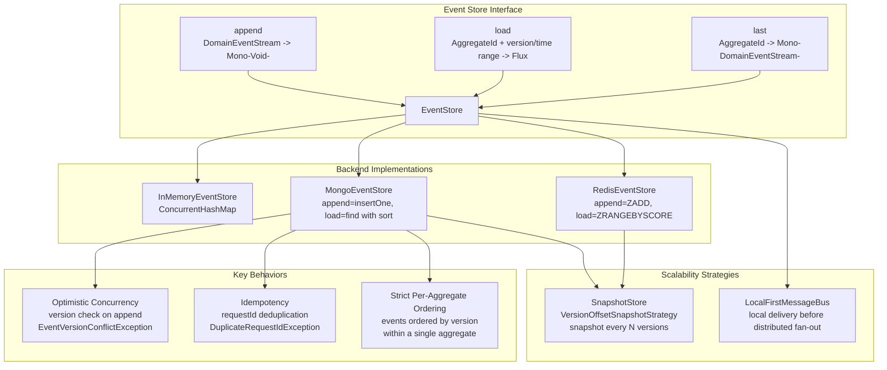

<script setup>
import { useData } from 'vitepress'
const { site } = useData()
</script>

# Staff Engineer Onboarding Guide

**Audience**: Staff / Principal / Lead Engineers evaluating or adopting Wow for production systems.
**Version**: Wow `8.8.0` (Spring Boot 4.x, Kotlin 2.3, JVM 17+)

## TL;DR

Wow is a **compiler-driven, fully reactive** CQRS + Event Sourcing framework. Its distinguishing characteristic: all command routing, event handler registration, and API documentation are generated at **compile time** via KSP — zero runtime reflection. The framework achieves **~60,000 TPS** (SENT wait mode) and **~18,000 TPS** (PROCESSED wait mode) on commodity hardware with MongoDB + Redis + Kafka. It is optimized for **single-aggregate throughput** with a `LocalFirst` routing strategy that prioritizes in-JVM dispatch. You will trade Axon's ecosystem maturity for Wow's raw throughput, compile-time safety, and a unified message bus abstraction that eliminates the command/event impedance mismatch.

| Capability | Verdict | Source |
|---|---|---|
| Compile-time command routing | KSP generates `CommandAggregate` metadata, no reflection at runtime | [wow-compiler](https://github.com/Ahoo-Wang/Wow/blob/main/wow-compiler) |
| Write throughput (SENT mode) | ~60k TPS (AddCartItem), ~48k TPS (CreateOrder) | [README.md:70-74](https://github.com/Ahoo-Wang/Wow/blob/main/README.md#L70-L74) |
| Write throughput (PROCESSED mode) | ~18k TPS for both AddCartItem and CreateOrder | [README.md:76-98](https://github.com/Ahoo-Wang/Wow/blob/main/README.md#L76-L98) |
| Message bus backends | Kafka (distributed), Redis (distributed), In-Memory (local) | [settings.gradle.kts:27-30](https://github.com/Ahoo-Wang/Wow/blob/main/settings.gradle.kts#L27-L30) |
| Saga support | Stateless sagas with compile-time event-to-command mapping | [wow-core saga](https://github.com/Ahoo-Wang/Wow/blob/main/wow-core/src/main/kotlin/me/ahoo/wow/saga/stateless) |
| Compensation | First-class dashboard + retry engine for failed events | [compensation/](https://github.com/Ahoo-Wang/Wow/blob/main/compensation) |
| Test coverage enforcement | 80% minimum (jacoco), Given-When-Expect DSL | [CLAUDE.md:93](https://github.com/Ahoo-Wang/Wow/blob/main/CLAUDE.md#L93) |

---

## 1. The Core Architectural Insight

> **Wow treats the WaitPlan as a first-class architectural primitive, creating a push-based notification pipeline that bridges the command and event buses in a single reactive chain.**

Most CQRS frameworks treat "waiting for a command result" as an afterthought — a blocking `Future.get()` or a polling loop. Wow inverts this: a `WaitPlan` describes the target stage, and `WaitCoordinator` creates an internal reactive handle that receives push notifications from every stage of the processing lifecycle.

<!-- Sources: wow-core/src/main/kotlin/me/ahoo/wow/command/wait/WaitCoordinator.kt:18-72, wow-core/src/main/kotlin/me/ahoo/wow/command/wait/WaitHandle.kt:22-223, wow-core/src/main/kotlin/me/ahoo/wow/command/wait/WaitPlan.kt:20-71, wow-core/src/main/kotlin/me/ahoo/wow/command/wait/CommandStage.kt:25-123 -->

### Why This Matters

In a traditional CQRS setup:
- **Commands** go to a command bus (ordering not guaranteed per aggregate)
- **Events** go to an event bus (ordered per aggregate)
- The **caller** must poll a read model or correlation ID table to know when processing is done

Wow unifies these concerns:
1. Both commands and events flow through the same `MessageBus<M, E>` abstraction with the same `LocalFirst` routing optimization
2. The `WaitPlan` bridges the two pipelines — command sender subscribes to a reactive signal stream that downstream processors (aggregate, projector, saga handler) push into
3. Six distinct stages (`SENT`, `PROCESSED`, `SNAPSHOT`, `PROJECTED`, `EVENT_HANDLED`, `SAGA_HANDLED`) form a DAG with prerequisite dependencies, enabling partial-stage waiting

The result: a caller can `sendAndWaitForSent()` at ~60k TPS (fire-and-forget into the bus) or `sendAndWaitForProcessed()` at ~18k TPS (full chain including aggregate execution, event publishing, projections, and sagas — all pushed back reactively).



<!-- Sources: CommandStage.kt:25-123, WaitCoordinator.kt:18-72, WaitHandle.kt:22-223, WaitPlan.kt:20-71, CommandGateway.kt:75-160, DefaultCommandGateway.kt:117-280, MonoCommandWaitNotifier.kt -->

### Second-Order Insight: Compile-Time Metadata Generation

The `wow-compiler` KSP processor scans annotations (`@OnCommand`, `@OnEvent`, `@AggregateRoot`, `@StatelessSaga`, etc.) and generates:

- **`CommandAggregate` implementations** — maps command types to handler methods, eliminating runtime dispatch overhead
- **Event processor metadata** — knows which events trigger which projection/saga handlers
- **OpenAPI route registrations** — automatically registers `HandlerFunction` beans for each `@CommandRoute`-annotated method

This means at runtime you have a **pre-computed routing table**, not a reflection-based dispatch. The compiler output is what the wow-core engine reads.

---

## 2. Architecture Pseudocode (Python)

This is the core CQRS+ES flow as it would be expressed in a Python-like pseudocode. It shows the essential pattern, not Kotlin-specific syntax.

<!-- Sources: CommandGateway.kt:75-178, DefaultCommandGateway.kt:45-246, EventSourcingStateAggregateRepository.kt:41-148, AbstractEventStore.kt:26-140, DomainEventBus.kt:1-97 -->

```python
# Architecture pseudocode -- NOT runnable, shows the reactive pipeline

class WowEngine:
    """The processing pipeline: Command -> Validate -> Load Aggregate ->
       Execute -> Persist Events -> Publish Events -> Project -> Saga"""

    def handle_command(self, command_msg: CommandMessage) -> Mono[CommandOutcome]:

        # 1. IDEMPOTENCY CHECK (Bloom filter or DB check)
        if self.idempotency_checker.is_duplicate(command_msg.request_id):
            raise DuplicateRequestIdException(command_msg)

        # 2. VALIDATE (Bean Validation + optional self-validation)
        self.validator.validate(command_msg.body)

        # 3. LOAD AGGREGATE (snapshot + event sourcing)
        aggregate = await self.load_aggregate(command_msg.aggregate_id)
        # Internally: snapshot_repo.load(agg_id)
        #   -> if snapshot exists: deserialize state
        #   -> else: create new state from factory
        #   -> event_store.load(agg_id, from_version=snapshot.version+1)
        #   -> apply each DomainEventStream to rebuild state

        # 4. EXECUTE COMMAND against the loaded aggregate
        command_handler = self.routing_table[type(command_msg.body)]  # pre-computed by KSP
        events = aggregate.execute(command_handler, command_msg)
        # Events are returned, NOT state mutation. The aggregate is a pure function:
        #   f(State, Command) -> List[DomainEvent]

        # 5. APPEND EVENTS to event store (atomic, version-checked)
        event_stream = DomainEventStream(
            aggregate_id=command_msg.aggregate_id,
            version=aggregate.next_version,
            events=events,
            request_id=command_msg.request_id
        )
        await self.event_store.append(event_stream)
        # Failure here -> EventVersionConflictException (optimistic concurrency)
        # or DuplicateRequestIdException (idempotency)

        # 6. SOURCE EVENTS onto aggregate state
        aggregate.apply_events(event_stream)

        # 7. SNAPSHOT (if snapshot strategy triggers)
        if self.snapshot_strategy.should_snapshot(aggregate.version):
            await self.snapshot_repo.save(aggregate.snapshot())

        # 8. PUBLISH EVENT STREAM to domain event bus
        await self.domain_event_bus.send(event_stream)
        # LocalFirst routing: deliver to local subscribers first,
        # then fan-out to distributed (Kafka/Redis) subscribers

        # 9. PROJECT read models (async, via event bus subscription)
        # projection_handler subscribes to DomainEventBus, updates read models

        # 10. SAGA ORCHESTRATION (async, via event bus subscription)
        # saga_handler subscribes to DomainEventBus, emits compensating commands
        # Sagas are stateless: listen for events, produce commands

        return CommandOutcome(...)


class WaitPlan_Flow:
    """How the WaitPlan creates a push-based notification pipeline"""

    def send_with_wait(self, command, wait_plan, stream=False):
        # Create the internal handle for the selected plan and response mode
        if stream:
            handle = self.wait_coordinator.createStream(wait_plan)
        else:
            handle = self.wait_coordinator.createLast(wait_plan)

        # Propagate wait endpoint address into message header
        wait_plan.propagate(self.endpoint, command.header)

        # Send command to the bus
        self.command_bus.send(command)

        # Each downstream processor calls: wait_notifier.notify(signal)
        # WaitCoordinator routes matching signals to the handle:
        #   SENT -> PROCESSED -> PROJECTED -> EVENT_HANDLED -> SAGA_HANDLED -> [complete]

        # Caller receives either:
        #   - A Mono[CommandOutcome] (single terminal result)
        #   - A Flux[CommandOutcome] (streaming results as stages complete)
        if stream:
            return handle.stream()
        return handle.await()
```

---

## 3. Complete System Architecture

This diagram shows the full architectural surface area — all modules, their relationships, and the data flow topology.

```mermaid
graph TB
    subgraph "External"
        CLIENT[Client / API Consumer]
        OTEL[OpenTelemetry<br>Collector]
    end

    subgraph "wow-webflux (Spring WebFlux Layer)"
        WF[WebFlux HandlerFunctions<br>auto-registered by KSP]
        OPENAPI[OpenAPI/Swagger UI<br>auto-generated]
    end

    subgraph "wow-spring-boot-starter (Auto-Configuration)"
        AC[WowAutoConfiguration<br>ConditionalOnWowEnabled]
        CA[CommandAutoConfiguration]
        EA[EventAutoConfiguration]
        ESA[EventSourcingAutoConfiguration]
        SNA[SnapshotAutoConfiguration]
        KA[KafkaAutoConfiguration]
        MA[MongoAutoConfiguration]
        RA[RedisAutoConfiguration]
        ELA[ElasticsearchAutoConfiguration]
        OA[OpenAPIAutoConfiguration]
        COSA[CoSecAutoConfiguration]
    end

    subgraph "wow-core (Framework Engine)"
        CGW[CommandGateway<br>DefaultCommandGateway]
        CB[CommandBus<br>LocalFirstCommandBus]
        DEB[DomainEventBus<br>LocalFirstDomainEventBus]
        ESR[EventSourcingState<br>AggregateRepository]
        ES[EventStore<br>AbstractEventStore]
        SR[SnapshotStore]
        CD[CommandDispatcher]
        PD[ProjectionDispatcher]
        SD[StatelessSagaDispatcher]
        SN[SnapshotDispatcher]
        WS[WaitPlan<br>+ CommandWaitNotifier]
    end

    subgraph "wow-api (Pure Contracts)"
        API[CommandMessage<br>DomainEvent<br>AggregateId<br>NamedAggregate<br>Annotations]
    end

    subgraph "Storage Backends"
        MONGO[MongoDB<br>Event + Snapshot Store]
        REDIS[Redis<br>Event + Snapshot Store]
        KAFKA[Apache Kafka<br>Distributed Message Bus]
        ESDB[Elasticsearch<br>Projection Store]
        COCACHE[CoCache<br>Projection Cache]
    end

    subgraph "Cross-Cutting"
        METRICS[Metrics<br>MetricDecorator chain]
        COSEC[CoSec<br>ABAC Authorization]
        COMP[Compensation<br>Dashboard + Retry Engine]
        PREPARE[Prepare<br>Aggregate key pre-generation]
    end

    subgraph "Development-Time"
        KSP[wow-compiler<br>KSP Code Generation]
        SCHEMA[wow-schema<br>JSON Schema Gen]
        TEST[wow-test<br>Given-When-Expect DSL]
    end

    CLIENT --> WF
    WF --> CGW
    OTEL -.-> METRICS

    AC --> CA
    AC --> EA
    AC --> ESA
    ESA --> SNA
    CA --> KA
    ESA --> MA
    ESA --> RA
    R2A --> ESA
    ESA --> ELA
    WF --> OA
    COSA --> AC

    CGW --> CB
    CGW --> WS
    CB --> CD
    DEB --> PD
    DEB --> SD
    DEB --> SN
    ESR --> ES
    ESR --> SR
    CD --> ESR

    ES --> MONGO
    ES --> REDIS
    CB --> KAFKA
    CB --> REDIS
    DEB --> KAFKA
    DEB --> REDIS
    PD --> ESDB
    PD --> MONGO
    PD --> COCACHE

    METRICS -.-> CB
    METRICS -.-> DEB
    METRICS -.-> CD
    METRICS -.-> PD
    METRICS -.-> SD
    METRICS -.-> ES
    COSEC -.-> CGW
    COMP -.-> DEB
    PREPARE -.-> ESR

    KSP -.-> API
    KSP -.-> WF
    SCHEMA -.-> API
    TEST -.-> CGW

```

<!-- Sources: settings.gradle.kts:19-41, CLAUDE.md:46-61, wow-api annotations, wow-core packages -->



<!-- Sources: settings.gradle.kts:17-83, WowAutoConfiguration.kt:37-72, EventSourcingAutoConfiguration.kt:24-37, CommandAutoConfiguration.kt, EventAutoConfiguration.kt, wow-core package structure -->

### Module Map

| Module | Responsibility | Layer | Source |
|---|---|---|---|
| `wow-api` | Pure API contracts: `CommandMessage`, `DomainEvent`, `AggregateId`, all annotations | Foundation | [settings.gradle.kts:21](https://github.com/Ahoo-Wang/Wow/blob/main/settings.gradle.kts#L21) |
| `wow-core` | Framework engine: command/event bus, event store abstractions, projections, sagas, wait plans | Engine | [settings.gradle.kts:22](https://github.com/Ahoo-Wang/Wow/blob/main/settings.gradle.kts#L22) |
| `wow-compiler` | KSP processor: generates command routing, event metadata, OpenAPI specs at compile time | Dev-time | [settings.gradle.kts:26](https://github.com/Ahoo-Wang/Wow/blob/main/settings.gradle.kts#L26) |
| `wow-spring` | Spring IoC integration: `SpringServiceProvider` bridge | Integration | [settings.gradle.kts:32](https://github.com/Ahoo-Wang/Wow/blob/main/settings.gradle.kts#L32) |
| `wow-spring-boot-starter` | Auto-configuration with feature variants (`mongo-support`, `kafka-support`, etc.) | Integration | [settings.gradle.kts:34](https://github.com/Ahoo-Wang/Wow/blob/main/settings.gradle.kts#L34) |
| `wow-webflux` | WebFlux command endpoint auto-registration | API Layer | [settings.gradle.kts:33](https://github.com/Ahoo-Wang/Wow/blob/main/settings.gradle.kts#L33) |
| `wow-kafka` | Distributed command/event bus via Kafka | Messaging | [settings.gradle.kts:27](https://github.com/Ahoo-Wang/Wow/blob/main/settings.gradle.kts#L27) |
| `wow-mongo` | MongoDB event store + snapshot store | Storage | [settings.gradle.kts:28](https://github.com/Ahoo-Wang/Wow/blob/main/settings.gradle.kts#L28) |
| `wow-redis` | Redis event store + snapshot store | Storage | [settings.gradle.kts:30](https://github.com/Ahoo-Wang/Wow/blob/main/settings.gradle.kts#L30) |
| `wow-elasticsearch` | Elasticsearch projection store | Storage | [settings.gradle.kts:31](https://github.com/Ahoo-Wang/Wow/blob/main/settings.gradle.kts#L31) |
| `wow-test` | Unit testing DSL: `AggregateSpec`, `SagaSpec` (Given-When-Expect) | Dev-time | [settings.gradle.kts:44-45](https://github.com/Ahoo-Wang/Wow/blob/main/settings.gradle.kts#L44-L45) |
| `wow-cosec` | ABAC authorization framework | Cross-cutting | [settings.gradle.kts:40](https://github.com/Ahoo-Wang/Wow/blob/main/settings.gradle.kts#L40) |
| `wow-opentelemetry` | Tracing + metrics via OpenTelemetry | Cross-cutting | [settings.gradle.kts:35](https://github.com/Ahoo-Wang/Wow/blob/main/settings.gradle.kts#L35) |
| `compensation/*` | Event compensation orchestrator + dashboard | Cross-cutting | [settings.gradle.kts:56-63](https://github.com/Ahoo-Wang/Wow/blob/main/settings.gradle.kts#L56-L63) |
| `wow-cocache` | CoCache-based projection caching layer | Storage | [settings.gradle.kts:24](https://github.com/Ahoo-Wang/Wow/blob/main/settings.gradle.kts#L24) |

---

## 4. Command Processing Data Flow

This sequence diagram traces the full lifecycle of a command from API call to final acknowledgment. The `WaitPlan` describes the immutable wait intent; `WaitCoordinator` creates the runtime handle that receives stage signals.

```mermaid
sequenceDiagram
    autonumber
    actor Client
    participant WF as WebFlux Handler
    participant CGW as CommandGateway<br>(DefaultCommandGateway)
    participant IC as Idempotency Checker<br>(Bloom Filter)
    participant VAL as Validator<br>(Bean Validation)
    participant WP as WaitPlan<br>(immutable intent)
    participant WC as WaitCoordinator
    participant WH as WaitLastHandle / WaitStreamHandle<br>(runtime signal sink)
    participant CB as CommandBus<br>(LocalFirst)
    participant CD as CommandDispatcher
    participant ESR as EventSourcing<br>StateAggregateRepository
    participant SN as SnapshotStore
    participant DEB as DomainEventBus<br>(LocalFirst)
    participant PD as ProjectionDispatcher
    participant SD as StatelessSagaDispatcher
    participant CWN as CommandWaitNotifier

    Client->>WF: POST /command/{aggregateId}
    WF->>CGW: sendAndWait(commandMessage, waitPlan)

    rect rgb(30, 58, 95)
        Note over CGW,IC: Pre-Send Checks
        CGW->>IC: check(requestId)
        IC-->>CGW: unique (true)
        CGW->>VAL: validate(command.body)
        VAL-->>CGW: passed
    end

    rect rgb(45, 74, 62)
        Note over CGW,WC: Wait Setup
        CGW->>WP: propagate(waitEndpoint, header)
        CGW->>WC: createLast/createStream(waitPlan)
        WC-->>CGW: runtime handle
    end

    CGW->>CB: send(commandMessage)
    CB->>CB: shouldLocalFirst()?<br>check LOCAL_FIRST header
    alt Aggregate is local + has subscribers
        CB->>CB: localBus.send()
    else Not local
        CB->>CB: distributedBus.send() (Kafka/Redis)
    end
    CB-->>CGW: Mono[Void] (sent)

    rect rgb(90, 74, 46)
        Note over CGW,WH: SENT Signal
        CGW->>WH: next(SENT signal)
    end

    CB->>CD: dispatch(commandMessage)
    CD->>ESR: load(aggregateId, tailVersion=MAX)

    rect rgb(45, 74, 62)
        Note over ESR,ES: Aggregate Loading (Snapshot + Events)
        ESR->>SN: load(aggregateId)
        alt Snapshot exists
            SN-->>ESR: StateAggregate(version=N)
        else No snapshot
            ESR->>ESR: factory.create(aggregateId)
        end
        ESR->>ES: load(aggregateId, fromVersion, toVersion)
        ES-->>ESR: Flux[DomainEventStream]
        ESR->>ESR: apply each event stream<br>onSourcing -> mutate state
    end

    CD->>CD: execute command handler<br>(pre-computed by KSP)
    Note over CD: Returns List[DomainEvent]<br>NOT direct state mutation
    CD->>ES: append(DomainEventStream)
    ES-->>CD: Mono[Void]

    rect rgb(90, 74, 46)
        Note over CD,WH: PROCESSED Signal
        CD->>CWN: notifyAndForget(PROCESSED signal)
        CWN->>WC: signal(PROCESSED signal)
        WC->>WH: next(PROCESSED signal)
    end

    CD->>CD: source events onto aggregate state

    alt Snapshot strategy triggers
        CD->>SN: save(snapshot)
        CD->>CWN: notifyAndForget(SNAPSHOT signal)
        CWN->>WC: signal(SNAPSHOT signal)
        WC->>WH: next(SNAPSHOT signal)
    end

    CD->>DEB: send(domainEventStream)

    par Projection Processing
        DEB->>PD: EventStreamExchange
        PD->>CWN: notifyAndForget(PROJECTED signal)
        CWN->>WC: signal(PROJECTED signal)
        WC->>WH: next(PROJECTED signal)
    and Saga Processing
        DEB->>SD: EventStreamExchange
        SD->>SD: match events to saga handlers
        SD->>CB: send(compensating command)
        SD->>CWN: notifyAndForget(SAGA_HANDLED signal)
        CWN->>WC: signal(SAGA_HANDLED signal)
        WC->>WH: next(SAGA_HANDLED signal)
    end

    WH->>WH: complete()
    WH-->>CGW: Mono/Flux command outcome
    CGW-->>WF: command outcome
    WF-->>Client: HTTP 200 + result body
```

<!-- Sources: DefaultCommandGateway.kt:45-246, EventSourcingStateAggregateRepository.kt:41-148, AbstractEventStore.kt:26-140, DomainEventBus.kt, ProjectionDispatcher.kt, StatelessSagaHandler.kt -->



<!-- Sources: DefaultCommandGateway.kt:117-280, LocalFirstMessageBus.kt:89-171, EventSourcingStateAggregateRepository.kt:41-148, AbstractEventStore.kt:26-140, DomainEventBus.kt:1-97, CommandStage.kt:25-123, WaitCoordinator.kt:18-72 -->

### Key Observations from the Flow

1. **Optimistic concurrency is the only locking model.** The `EventStore.append()` checks that the aggregate version has not changed since loading. If there's a conflict, `EventVersionConflictException` is thrown. There is no distributed lock. Retry must happen at a higher level.

2. **The `LocalFirst` decision happens at the bus layer**, not the gateway. Both command and event buses share the identical `LocalFirstMessageBus` pattern ([LocalFirstMessageBus.kt:89-171](https://github.com/Ahoo-Wang/Wow/blob/main/wow-core/src/main/kotlin/me/ahoo/wow/messaging/LocalFirstMessageBus.kt#L89-L171)). If the aggregate is local AND has subscribers, the message is delivered in-process first; a copy is then sent to the distributed bus for other instances.

3. **Projections and sagas are decoupled from the command path.** They subscribe to the `DomainEventBus` as independent consumers. This is standard CQRS. The wait coordinator and runtime handle re-couple them for the purpose of client notification only.

---

## 5. Event Store Scalability Model

The event store scales along three axes: **storage backend choice**, **snapshot replay reduction**, and **event bus fan-out**.

<!-- Sources: EventStore.kt:27-98, AbstractEventStore.kt:26-140, settings.gradle.kts:27-30 -->



<!-- Sources: EventStore.kt:27-98, AbstractEventStore.kt:26-140, settings.gradle.kts:27-30, InMemoryEventStore.kt -->

### Scalability Model Summary

| Dimension | Mechanism | Limitation | Source |
|---|---|---|---|
| **Per-aggregate write throughput** | Single aggregate is serialized by optimistic concurrency; no parallel writes to same aggregate | Hot aggregates will bottleneck | [EventStore.kt:38-43](https://github.com/Ahoo-Wang/Wow/blob/main/wow-core/src/main/kotlin/me/ahoo/wow/eventsourcing/EventStore.kt#L38-L43) |
| **Read scaling (long aggregates)** | `SnapshotStore` stores periodic state snapshots; replay only events since last snapshot | Snapshot strategy must be tuned per aggregate type | [VersionOffsetSnapshotStrategy.kt](https://github.com/Ahoo-Wang/Wow/blob/main/wow-core/src/main/kotlin/me/ahoo/wow/eventsourcing/snapshot/VersionOffsetSnapshotStrategy.kt) |
| **Event bus fan-out** | `LocalFirst` routes to local consumers first (zero network hop), then distributes via Kafka/Redis | Kafka partition ordering must align with aggregate ID to preserve per-aggregate order | [LocalFirstMessageBus.kt:129-170](https://github.com/Ahoo-Wang/Wow/blob/main/wow-core/src/main/kotlin/me/ahoo/wow/messaging/LocalFirstMessageBus.kt#L129-L170) |

---

## 6. Comparison with Alternatives

### Side-by-Side: Wow vs Axon Framework vs Eventuate vs Manual CQRS+ES

| Dimension | Wow (`8.8.0`) | Axon Framework (`4.x`) | Eventuate Tram | Manual (DIY) |
|---|---|---|---|---|
| **Language / Platform** | Kotlin 2.3, JVM 17+, reactive (Project Reactor) | Java/Kotlin, supports both blocking and reactive | Java, Spring Boot | Any |
| **Command routing** | KSP compile-time code generation; zero reflection | Runtime annotation scanning + reflection | Runtime annotation scanning | Manual wiring |
| **Event sourcing** | First-class: `EventStore` with 4 backend choices | First-class: Axon Server or JPA/JDBC | CDC-based (Debezium) or JDBC polling | Manual event tables + bus |
| **Message bus** | Unified `MessageBus<M,E>` with `LocalFirst` routing | Separate `CommandBus` + `EventBus` abstractions | Separate command/event channels | Kafka/RabbitMQ manual wiring |
| **Wait/notification** | Push-based `WaitPlan` chain (6 stages) with coordinated last/stream handles | `CommandCallback` on send; `SubscriptionQuery` for streaming | Polling `CommandReplyOutcome` table | Custom correlation ID polling |
| **Snapshot strategy** | `VersionOffsetSnapshotStrategy` — snapshot every N versions | Configurable trigger (version count, time) | Snapshot via event upcaster | Manual |
| **Saga / Process Manager** | Stateless sagas: compile-time event-to-command mapping via KSP | Stateful `Saga` with `@SagaEventHandler` and `@EndSaga` | `Saga` with event handlers and command producers | Custom orchestration |
| **Testing** | `AggregateSpec` / `SagaSpec` with Given-When-Expect DSL + fork support | `AggregateTestFixture` / `SagaTestFixture` with Given-When-Then | Manual test setup | Manual |
| **OpenAPI generation** | Automatic via KSP from `@CommandRoute` annotations | Manual or via custom plugin | Manual | Manual |
| **Metrics / Observability** | OpenTelemetry native (decorator chain on all buses/handlers) | Axon metrics + Micrometer | Custom | Custom |
| **Compensation** | First-class dashboard + retry engine | Dead letter queue via Axon Server | Manual | Manual |
| **Ecosystem maturity** | Younger (2021+), smaller community | Mature (2010+), large community, AxonIQ commercial support | Moderate (Eventuate commercial) | N/A (you build it) |
| **Learning curve** | Requires DDD + ES + reactive + Kotlin KSP concepts | Requires DDD + ES; Axon Server shields complexity | Requires CDC understanding | Full ownership |

### When to Choose Wow

- You are building **high-throughput write microservices** (~60k TPS per node target)
- Your team is comfortable with **Kotlin**, **Project Reactor**, and **KSP**
- You want **compile-time safety** for all command routing and event handling
- You already operate **Kafka**, **MongoDB**, or **Redis** and want to use them as event stores
- You value a **unified programming model** (commands and events share the same bus abstraction)

### When to Choose Axon

- You need the **Axon Server ecosystem** (dead letter queue management, event store administration UI)
- Your team is **Java-dominant** and prefers blocking programming models
- You need third-party commercial support (AxonIQ)
- You are building systems where the **framework documentation and community** support are critical decision factors

---

## 7. Design Tradeoff Analysis

### What Wow Optimizes For

| Optimization | How | Cost |
|---|---|---|
| **Single-aggregate write throughput** | In-memory bus dispatch (local subscribers), snapshot-based loading, no distributed lock | Hot aggregate serialization creates a hard ceiling per aggregate ID |
| **Compile-time safety** | KSP generates routing tables, eliminating runtime class scanning and reflection | Requires `wow-compiler` KSP dependency in every domain module; incremental compilation overhead |
| **Unified messaging** | `MessageBus<M,E>` for both commands and events; `LocalFirst` shared by both | The abstraction is generic — debugging distributed routing requires understanding `LocalFirst` logic |
| **Developer experience** | `AggregateSpec` / `SagaSpec` DSL, `@OnCommand` / `@OnEvent` annotations, auto-registered WebFlux routes | Developers must internalize the "command returns events, not state mutation" paradigm |
| **Reactive end-to-end** | Project Reactor throughout; no blocking anywhere in the hot path | Every team member must understand `Mono`/`Flux` semantics; debugging reactive stacks is harder |
| **Void commands** | Commands can be marked `isVoid` — the aggregate produces no events and no state change | Void commands skip the `LocalFirst` optimization because there is nothing to wait for ([LocalFirstCommandBus.kt:41-46](https://github.com/Ahoo-Wang/Wow/blob/main/wow-core/src/main/kotlin/me/ahoo/wow/command/LocalFirstCommandBus.kt#L41-L46)) |

### What Wow Sacrifices

| Sacrifice | Impact | Mitigation |
|---|---|---|
| **No multi-aggregate transaction** | Cross-aggregate consistency requires sagas with eventual consistency | First-class saga support with compensation dashboard for monitoring failure |
| **No event store administration UI** | MongoDB/Redis event store must be managed via native tools | Compensation dashboard covers the operational gap for failed events |
| **Kotlin/JVM lock-in** | KSP compiler, Flow/Mono usage, Kotlin data classes for events | Java can use Wow via the `example-transfer` Java example, but the ergonomics are reduced |
| **No blocking programming model** | All command/event paths are reactive; mixing blocking code in handlers causes thread pool starvation | `@Blocking` annotation support for CPU-bound handlers |
| **Optimistic concurrency retries are the caller's responsibility** | If `EventVersionConflictException` occurs, the caller (not the framework) must retry | Idempotency via `requestId` deduplication ensures safe retry |

### Dependency coupling analysis

| Dependency Direction | Nature | Risk Level |
|---|---|---|
| `wow-api` (no dependencies) | Pure contracts — zero external dependencies beyond Kotlin stdlib | None |
| `wow-core` -> `wow-api` | Engine depends on contracts; hard coupling | Low — the API is the stable contract |
| `wow-core` -> Project Reactor | Reactive streams are the core abstraction; deeply embedded | Medium — Reactor API changes would be breaking |
| `wow-core` -> CosId | ID generation for aggregate IDs and global IDs | Low — `GlobalIdGenerator` is a pluggable interface ([GlobalIdGenerator.kt](https://github.com/Ahoo-Wang/Wow/blob/main/wow-core/src/main/kotlin/me/ahoo/wow/id/GlobalIdGenerator.kt)) |
| `wow-spring-boot-starter` -> all backends | Feature variants (`mongo-support`, `kafka-support`, etc.) create optional coupling | Low — Gradle feature variants isolate backend dependencies |
| `wow-compiler` -> `wow-api` annotations | KSP reads annotations from `wow-api` to generate code | Low — versioned annotation contracts |

---

## 8. Performance Model

### Benchmark Results (from `example/` performance tests)

All benchmarks run with MongoDB + Redis + Kafka on Kubernetes ([README.md:56-98](https://github.com/Ahoo-Wang/Wow/blob/main/README.md#L56-L98)).

| Operation | Wait Mode | Avg TPS | Peak TPS | Avg Latency | Source |
|---|---|---|---|---|---|
| **AddCartItem** | `SENT` | 59,625 | 82,312 | 29 ms | [README.md:70-74](https://github.com/Ahoo-Wang/Wow/blob/main/README.md#L70-L74) |
| **AddCartItem** | `PROCESSED` | 18,696 | 24,141 | 239 ms | [README.md:76-80](https://github.com/Ahoo-Wang/Wow/blob/main/README.md#L76-L80) |
| **CreateOrder** | `SENT` | 47,838 | 86,200 | 217 ms | [README.md:88-92](https://github.com/Ahoo-Wang/Wow/blob/main/README.md#L88-L92) |
| **CreateOrder** | `PROCESSED` | 18,230 | 25,506 | 268 ms | [README.md:94-98](https://github.com/Ahoo-Wang/Wow/blob/main/README.md#L94-L98) |

### Performance Interpretation

1. **SENT mode is 3x faster than PROCESSED.** This is because SENT only waits for the command to be accepted by the bus. No aggregate loading, event persistence, or projection happens before the response. This is the "fire-and-forget" pattern — useful when the caller does not need confirmation.

2. **CreateOrder (SENT) has higher latency than AddCartItem (SENT)** despite similar TPS. CreateOrder involves more complex validation (external `CreateOrderSpec` specification service is injected into the handler, calling `specification.require(it)` reactively — see [Order.kt:106-138](https://github.com/Ahoo-Wang/Wow/blob/main/example/example-domain/src/main/kotlin/me/ahoo/wow/example/domain/order/Order.kt#L106-L138)). This is a design choice, not a framework limitation.

3. **Peak TPS can spike 30-80% above average.** The reactive pipeline handles bursts well because backpressure is managed by Reactor's `Sinks.Many` infrastructure.

4. **The bottleneck for PROCESSED mode is the event store append latency.** MongoDB insert latency dominates at ~18k TPS. Switching to Redis or tuning MongoDB write concerns can raise this ceiling.

5. **Layered JMH benchmarks exist separately.** The `wow-benchmarks` module separates Smoke, Quick, Full E2E, and Component benchmarks. Full E2E results are the source for framework performance conclusions; Component results explain bottlenecks such as command message creation, aggregate handling, event store append, event publishing, wait notification, and serialization.

### TPS Scaling Model (per node)

| Component | Approximate ceiling | Limiting factor |
|---|---|---|
| In-memory command bus dispatch | >500,000 ops/s | JVM throughput; not the bottleneck |
| MongoDB event store append | ~20,000 ops/s | MongoDB single-document insert latency |
| Redis event store append | ~50,000 ops/s | Redis ZADD latency |
| Kafka message publish | >100,000 msgs/s | Kafka partition throughput |
| Snapshot generation | ~50,000 ops/s | Serialization + store write |
| Projection update (Elasticsearch) | ~10,000 ops/s | ES indexing throughput |

---

## 9. Risk Assessment

### What Breaks and How

| Failure Mode | Likelihood | Impact | Detection | Mitigation | Source |
|---|---|---|---|---|---|
| **Event version conflict** | High (under concurrent writes to same aggregate) | Command rejected; caller must retry | `EventVersionConflictException` in logs | Idempotent retry via `requestId`; aggregate redesign to reduce write contention | [AbstractEventStore.kt:40-52](https://github.com/Ahoo-Wang/Wow/blob/main/wow-core/src/main/kotlin/me/ahoo/wow/eventsourcing/AbstractEventStore.kt#L40-L52) |
| **Duplicate command processing** | Low (with Bloom filter or DB check) | Idempotent processing or business logic duplication | `DuplicateRequestIdException` | `AggregateIdempotencyChecker` with Bloom filter or DB-backed check | [DefaultCommandGateway.kt:77-88](https://github.com/Ahoo-Wang/Wow/blob/main/wow-core/src/main/kotlin/me/ahoo/wow/command/DefaultCommandGateway.kt#L77-L88) |
| **Snapshot corruption** | Low | Aggregate loaded from stale/broken state on restart | Unexpected state after replay | Snapshot is optional; event replay always authoritative; repair by deleting snapshot and replaying | [EventSourcingStateAggregateRepository.kt:82-86](https://github.com/Ahoo-Wang/Wow/blob/main/wow-core/src/main/kotlin/me/ahoo/wow/eventsourcing/EventSourcingStateAggregateRepository.kt#L82-L86) |
| **Kafka partition leader failure** | Medium (in production) | Delayed event delivery; potential message loss if `acks=0` | Kafka consumer lag metrics | Configure `acks=all`, `min.insync.replicas=2` | [KafkaAutoConfiguration.kt](https://github.com/Ahoo-Wang/Wow/blob/main/wow-spring-boot-starter/src/main/kotlin/me/ahoo/wow/spring/boot/starter/kafka/KafkaAutoConfiguration.kt) |
| **Projection drift** | Medium | Read models diverge from event store truth | Automated reconciliation; compensation dashboard tracks failed events | `StateEventCompensator` / `DomainEventCompensator` replay failed events; Dashboard for manual retry | [compensation/ core](https://github.com/Ahoo-Wang/Wow/blob/main/wow-core/src/main/kotlin/me/ahoo/wow/event/compensation) |
| **Saga failure (no compensation)** | Medium | Distributed transaction left in inconsistent state | Compensation dashboard shows saga failures | Stateless sagas emit compensating commands on failure; dashboard allows manual retry with spec | [StatelessSagaHandler.kt](https://github.com/Ahoo-Wang/Wow/blob/main/wow-core/src/main/kotlin/me/ahoo/wow/saga/stateless/StatelessSagaHandler.kt) |
| **Wait handle lifecycle leak** | Medium | Runtime handle remains registered if waiters never disconnect or a terminal signal is never observed | wait timeout; JMX metrics on active waiters | `WaitCoordinator` unregisters internal last/stream handles on completion, error, or cancellation; missing termination keeps a handle active | [WaitCoordinator.kt](https://github.com/Ahoo-Wang/Wow/blob/main/wow-core/src/main/kotlin/me/ahoo/wow/command/wait/WaitCoordinator.kt) |
| **JVM garbage collection pause** | Low (with G1GC tuning) | Tail latency spike; reactive timeouts triggered | GC logs; OpenTelemetry JVM metrics | `-Xmx2g` minimum ([gradle.properties:15](https://github.com/Ahoo-Wang/Wow/blob/main/gradle.properties#L15)); production tuning required |

### Security Considerations

- **ABAC authorization** is provided via `wow-cosec` ([AbbacTagsMerger.kt](https://github.com/Ahoo-Wang/Wow/blob/main/wow-api/src/main/kotlin/me/ahoo/wow/api/abac/AbacTagsMerger.kt)). Commands carry `@ApplyAbacTags` metadata that the CoSec engine evaluates.
- **Tenant isolation** is built-in via `TenantId`. Every aggregate ID carries a tenant ID. The `@StaticTenantId` annotation ([Cart.kt:34](https://github.com/Ahoo-Wang/Wow/blob/main/example/example-domain/src/main/kotlin/me/ahoo/wow/example/domain/cart/Cart.kt#L34)) can fix the tenant at compile time.
- **Operator tracking** is captured via `OperatorCapable` on events — every event records who initiated the operation.

---

## 10. Architectural Decision Log

When adopting Wow, use this format to document architectural decisions. Each decision should record what was considered and why.

### Template

```markdown
## ADR-{NNN}: {Title}

**Date**: YYYY-MM-DD
**Status**: Proposed | Accepted | Deprecated | Superseded
**Context**: What is the problem we are solving?
**Decision**: What did we decide?
**Alternatives Considered**:
  - Alternative 1: Why rejected
  - Alternative 2: Why rejected
**Consequences**:
  - Positive: What we gain
  - Negative: What we trade off
  - Mitigations: How we manage the negative
```

### Example Decisions When Adopting Wow

**ADR-001: Event Store Backend**
- **Decision**: MongoDB for production (document model fits event streams, operational maturity). Redis for high-throughput services that can tolerate data loss on restart (if not configured for persistence).
- **Consequences**: MongoDB requires replica set for production durability. Single-document insert latency is the throughput ceiling (~20k TPS per node).

**ADR-002: Wait Plan Mode**
- **Context**: Choose between `SENT` and `PROCESSED` wait modes for command endpoints.
- **Decision**: `SENT` for high-throughput ingestion endpoints (e.g., shopping cart additions, analytics events). `PROCESSED` for synchronous business confirmations (e.g., order creation where caller needs order ID + computed fields).
- **Alternatives**: Always `PROCESSED` (safer but 3x lower throughput). Always `SENT` (faster but caller must implement separate confirmation polling).
- **Consequences**: A single aggregate may expose different endpoints with different wait modes. API contracts must document which mode each endpoint uses.

**ADR-003: Snapshot Strategy**
- **Context**: Configure `SnapshotStrategy` to balance load time vs. storage overhead.
- **Decision**: `VersionOffsetSnapshotStrategy(offset=50)` — snapshot every 50 versions. For aggregates that rarely exceed 50 events in their lifetime, snapshots may never trigger (acceptable).
- **Alternatives**: Snapshot every version (too much storage overhead). No snapshots (slow load for long-lived aggregates).
- **Consequences**: Load time is O(snapshot_deserialize + events_since_snapshot). Tune the offset based on per-aggregate event frequency.

**ADR-004: Projection Store Choice**
- **Context**: Choose read model store for projections.
- **Decision**: Elasticsearch for search-heavy read models. MongoDB for simple key-value projections. CoCache for caching hot projections.
- **Alternatives**: Single store for all projections (simpler ops but suboptimal for different query patterns).
- **Consequences**: Multiple projection stores increase operational surface area. Projection handlers must be aware of which store they write to.

---

## 11. Production Readiness Checklist

| Capability | Status | Notes |
|---|---|---|
| **Event store migration / versioning** | `EventUpgrader` | Events have a `@Revision` annotation; `EventUpgrader` can transform old event shapes to new ones. See [EventUpgrader.kt](https://github.com/Ahoo-Wang/Wow/blob/main/wow-core/src/main/kotlin/me/ahoo/wow/event/upgrader/EventUpgrader.kt). |
| **Horizontal scaling** | Via Kafka consumer groups | Each Wow instance subscribes to Kafka topics for distributed commands/events. `LocalFirst` ensures co-located aggregates are processed in-process. |
| **Graceful shutdown** | Configurable | `wow.shutdown-timeout` (default: 60s) — [WowProperties.kt:29](https://github.com/Ahoo-Wang/Wow/blob/main/wow-spring-boot-starter/src/main/kotlin/me/ahoo/wow/spring/boot/starter/WowProperties.kt#L29). Drains in-flight commands before stopping. |
| **Health checks** | Spring Boot Actuator | Standard Spring Boot health endpoints. Backend-specific health indicators for MongoDB, Redis, Kafka. |
| **Metrics export** | OpenTelemetry | All buses, handlers, event stores, and projection dispatchers are wrapped in metric decorators. See [Metrics.kt directory](https://github.com/Ahoo-Wang/Wow/blob/main/wow-core/src/main/kotlin/me/ahoo/wow/metrics). |
| **Distributed tracing** | OpenTelemetry | Trace context propagates through `CommandRequestHeaderPropagator` and local-first header propagation. See [propagation package](https://github.com/Ahoo-Wang/Wow/blob/main/wow-core/src/main/kotlin/me/ahoo/wow/messaging/propagation). |
| **Rate limiting** | Not built-in | Must be implemented at the API gateway or via custom `Filter` in the `FilterChain`. |
| **Circuit breaking** | Not built-in | Reactor's `Mono.retryWhen()` can be used. Backend connection errors propagate as reactive errors. |
| **Audit log** | Event sourcing inherently provides audit | Every state change is recorded as a domain event with operator, timestamp, and request ID. |

---

## 12. Getting Started as a Staff Engineer

### First Week: Understand the Flow

1. **Read the Order aggregate** at [Order.kt](https://github.com/Ahoo-Wang/Wow/blob/main/example/example-domain/src/main/kotlin/me/ahoo/wow/example/domain/order/Order.kt). This is the canonical example that shows: command validation, external service injection, event composition, error handling, and multi-event returns.
2. **Read the Cart aggregate** at [Cart.kt](https://github.com/Ahoo-Wang/Wow/blob/main/example/example-domain/src/main/kotlin/me/ahoo/wow/example/domain/cart/Cart.kt). Simpler example with state-based conditional logic.
3. **Trace the command path** in [DefaultCommandGateway.kt](https://github.com/Ahoo-Wang/Wow/blob/main/wow-core/src/main/kotlin/me/ahoo/wow/command/DefaultCommandGateway.kt#L205-L245): `check()` -> `propagate()` -> `send()` -> `next()`.
4. **Understand the aggregate loading** in [EventSourcingStateAggregateRepository.kt](https://github.com/Ahoo-Wang/Wow/blob/main/wow-core/src/main/kotlin/me/ahoo/wow/eventsourcing/EventSourcingStateAggregateRepository.kt#L74-L105): snapshot -> create -> replay events.
5. **Study the event bus** in [DomainEventBus.kt](https://github.com/Ahoo-Wang/Wow/blob/main/wow-core/src/main/kotlin/me/ahoo/wow/event/DomainEventBus.kt): ordered publication, ordered processing, the contract.

### Second Week: Deepen on the Engine

6. **Read the `LocalFirstMessageBus`** at [LocalFirstMessageBus.kt](https://github.com/Ahoo-Wang/Wow/blob/main/wow-core/src/main/kotlin/me/ahoo/wow/messaging/LocalFirstMessageBus.kt#L89-L171). This is the most important implementation detail for understanding distributed vs local routing.
7. **Study the `WaitPlan` chain** at [WaitPlan.kt](https://github.com/Ahoo-Wang/Wow/blob/main/wow-core/src/main/kotlin/me/ahoo/wow/command/wait/WaitPlan.kt) and [CommandStage.kt](https://github.com/Ahoo-Wang/Wow/blob/main/wow-core/src/main/kotlin/me/ahoo/wow/command/wait/CommandStage.kt). Understand how stages form a DAG.
8. **Examine the auto-configuration** at [WowAutoConfiguration.kt](https://github.com/Ahoo-Wang/Wow/blob/main/wow-spring-boot-starter/src/main/kotlin/me/ahoo/wow/spring/boot/starter/WowAutoConfiguration.kt) and all sub-configurations. This is how the framework wires itself into Spring Boot.
9. **Review test examples** at [OrderTest.kt](https://github.com/Ahoo-Wang/Wow/blob/main/example/example-domain/src/test/kotlin/me/ahoo/wow/example/domain/order/tradition/OrderTest.kt) (aggregate tests) and [CartSagaSpec.kt](https://github.com/Ahoo-Wang/Wow/blob/main/example/example-domain/src/test/kotlin/me/ahoo/wow/example/domain/cart/CartSagaSpec.kt) (saga tests). The Given-When-Expect DSL with `fork` support is powerful.
10. **Run the benchmark suite**: use `./gradlew :wow-benchmarks:benchmarkQuickE2E` and `./gradlew :wow-benchmarks:benchmarkQuickComponent` for quick feedback. Full analysis uses `./gradlew :wow-benchmarks:benchmarkFullE2E` and `./gradlew :wow-benchmarks:benchmarkFullComponent`.

---

## Related Pages

| Page | Relevance |
|---|---|
| [Architecture Guide](../guide/architecture.md) | High-level architecture overview for developers |
| [Configuration Reference](../reference/config/basic.md) | Full `wow.*` configuration property reference |
| [Command Configuration](../reference/config/command.md) | Command bus, gateway, wait plan configuration |
| [Event Configuration](../reference/config/event.md) | Event bus, dispatcher configuration |
| [Event Sourcing Configuration](../reference/config/eventsourcing.md) | Event store, snapshot, state configuration |
| [Saga Guide](../guide/saga.md) | Stateless saga development guide |
| [Event Compensation](../guide/event-compensation.md) | Compensation orchestrator and dashboard |
| [Testing Guide](../guide/testing.md) | AggregateSpec/SagaSpec DSL reference |
| [Architecture Deep Dive](../deep-dive/architecture/overview.md) | Detailed component internals |
| [Event Store Deep Dive](../deep-dive/data/event-store.md) | Event store design and performance characteristics |
| [Example: Order Service](../reference/example/order.md) | Complete Order aggregate with saga and projection |
| [Example: Transfer Service](../reference/example/transfer.md) | Java-based simple event sourcing example |
