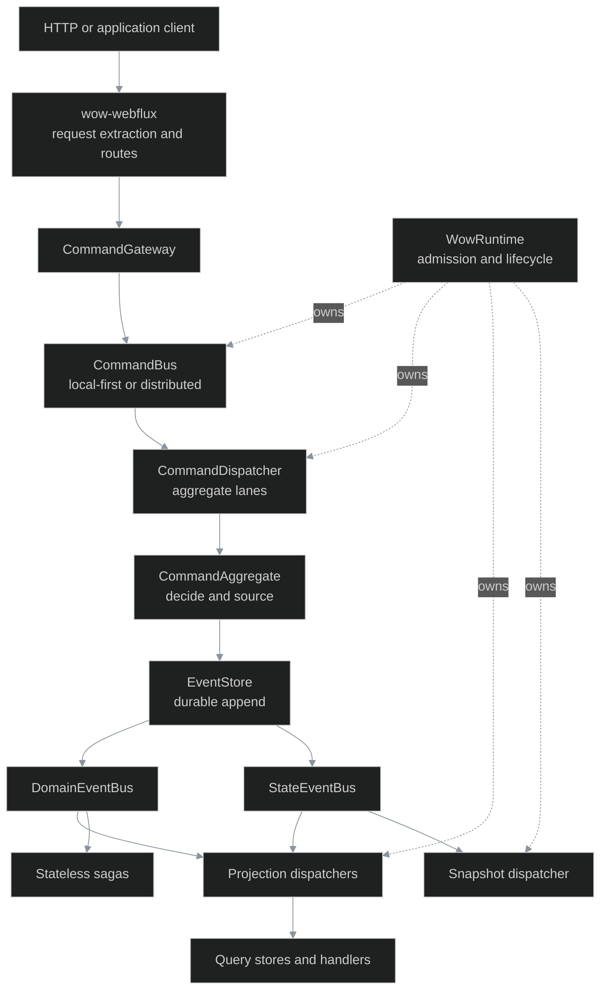
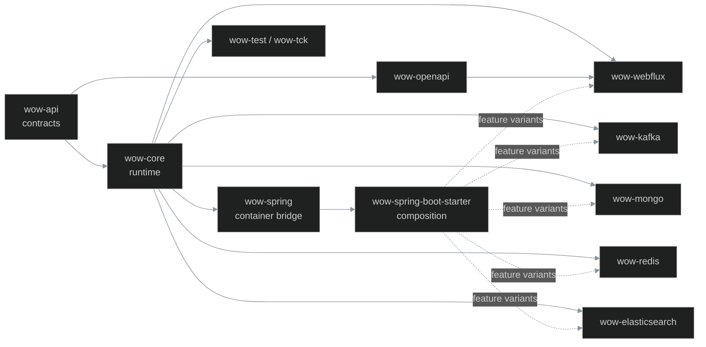
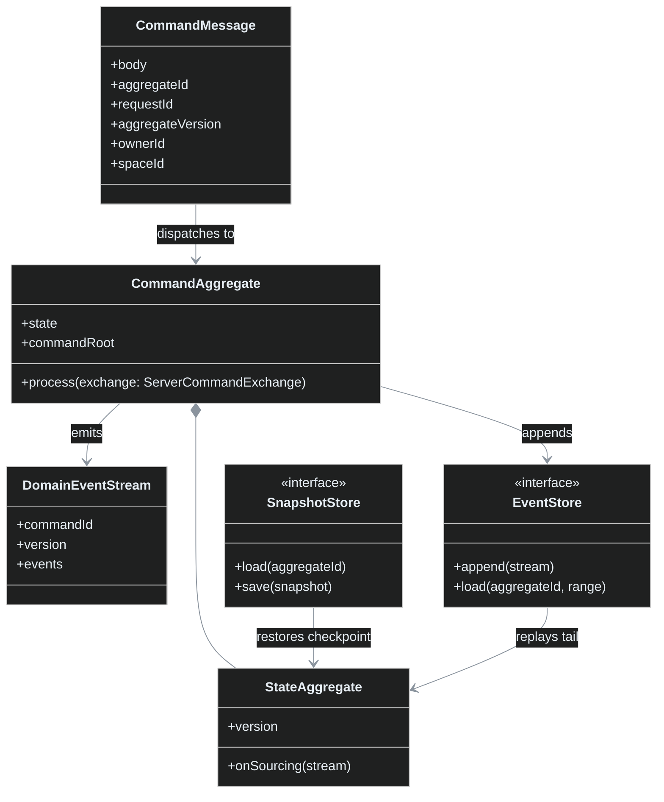
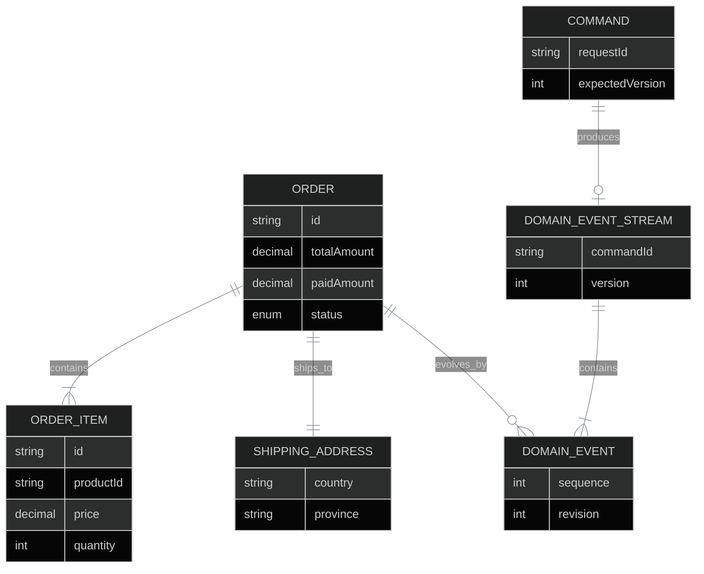
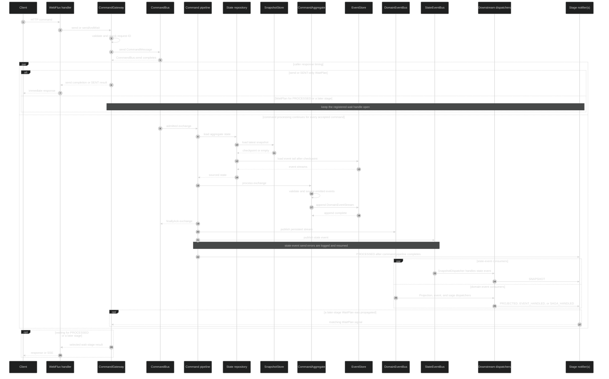
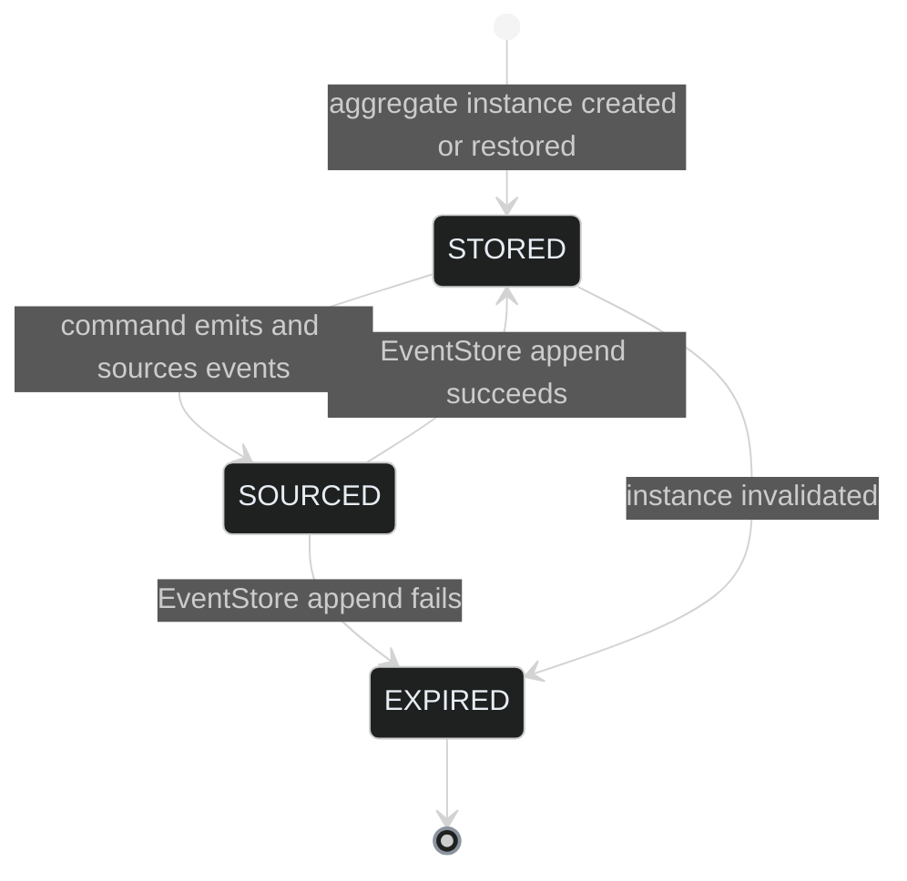
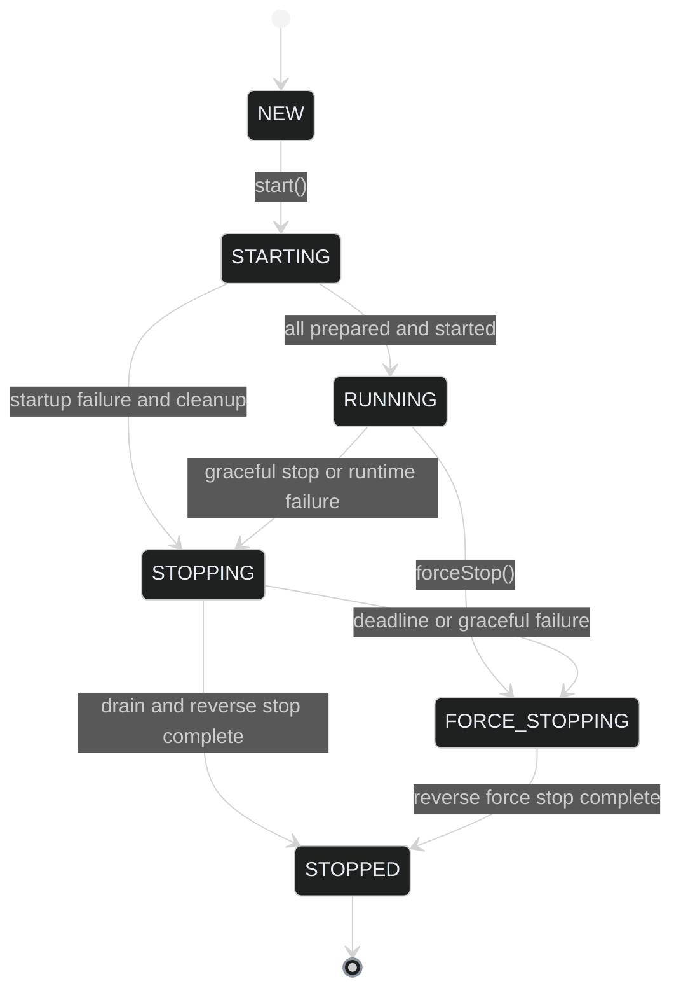
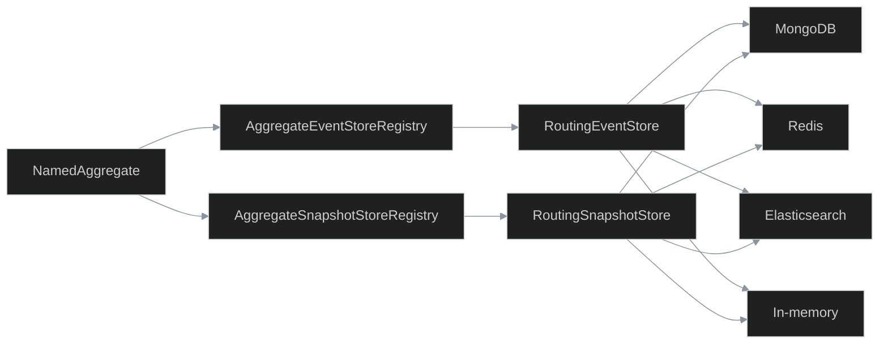
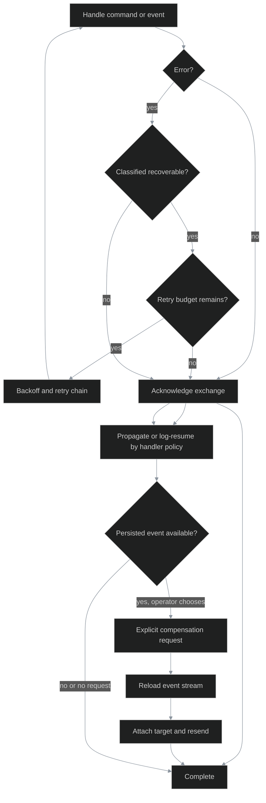
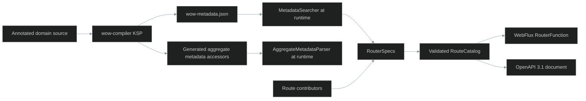

# Staff Engineer Guide

This guide is for engineers who must change Wow without weakening its boundaries.
It describes the repository at `main`, not an aspirational architecture.
Every concrete claim links to the code that establishes it.
When the repository does not establish a property, this guide marks it as **unknown**.

## Executive summary

Wow is a reactive CQRS and event-sourcing framework organized around aggregate-scoped command execution.
The API module defines envelopes and contracts.
The core module owns command dispatch, event sourcing, message processing, projections, sagas, snapshots, and runtime lifecycle.
Spring modules adapt those mechanisms to dependency injection and application lifecycle.
Infrastructure modules implement storage and transport contracts.
WebFlux and OpenAPI share a runtime route catalog, while KSP produces metadata inputs at compile time.
The most important consistency boundary is the append of a `DomainEventStream` to `EventStore`.
Publication and downstream processing happen after that append.
They are not one distributed transaction.
Per-aggregate ordering is explicit; global ordering is not promised.
Retries are selective, acknowledgements are explicit, and compensation is replay, not rollback.

`WowRuntime` is the sole lifecycle owner for registered runtime components.

It starts once, closes admission before draining, and uses a bounded shutdown deadline.
Security adapters propagate identity-related headers and query tags.
They do not prove authentication at the service boundary.
The framework includes local, contract, integration, coverage, and JMH test layers.
Those layers do not establish a production SLA or a universal throughput ceiling.

## The single core insight

> Wow turns a command into an immutable, versioned event stream inside one aggregate lane, persists that stream, and only then fans it out to independently owned consumers.
Everything else protects or extends that sequence.
The command envelope carries aggregate identity, ownership, tenant, request identity, and expected version.
The aggregate root decides which event payloads to emit.
The state aggregate sources those events.
The event store performs the durable append.
The event and state-event buses drive projections, sagas, and snapshots afterward.

`WowRuntime` controls whether these processors may accept work.

The following Python-like pseudocode is explanatory.
It deliberately makes the non-transactional fan-out visible.

```python
async def execute(command):
    lane = lane_for(command.aggregate_id)
    async with lane.serialized():
        state = await snapshots.load(command.aggregate_id) or new_state()
        async for stream in events.load_from(state.next_version):
            state.source(stream)

        emitted = await aggregate.decide(command, state)
        state.source(emitted)

        # The durable command consistency boundary.
        await events.append(emitted)

        # Downstream effects are separate reactive operations.
        await domain_event_bus.send(emitted)
        await state_event_bus.send_best_effort(emitted.with_state(state))
```

The real implementation sources the in-memory state before appending and marks the command aggregate expired if persistence fails.
The append contract detects version conflicts and duplicate request IDs.
The domain-event send is a filter after aggregate processing.
The state-event send is later still and resumes after logging a send error.
Sources: [command envelope](https://github.com/Ahoo-Wang/Wow/blob/main/wow-api/src/main/kotlin/me/ahoo/wow/api/command/CommandMessage.kt#L53-L125), [aggregate execution](https://github.com/Ahoo-Wang/Wow/blob/main/wow-core/src/main/kotlin/me/ahoo/wow/modeling/command/SimpleCommandAggregate.kt#L81-L132), [event-store contract](https://github.com/Ahoo-Wang/Wow/blob/main/wow-core/src/main/kotlin/me/ahoo/wow/eventsourcing/EventStore.kt#L27-L109), [post-append publication](https://github.com/Ahoo-Wang/Wow/blob/main/wow-core/src/main/kotlin/me/ahoo/wow/modeling/command/dispatcher/SendDomainEventStreamFilter.kt#L25-L46), [best-effort state event](https://github.com/Ahoo-Wang/Wow/blob/main/wow-core/src/main/kotlin/me/ahoo/wow/eventsourcing/state/SendStateEventFilter.kt#L29-L76).

## System architecture

The architecture is layered by responsibility, not by deployment topology.
Applications may combine modules in one process or place distributed buses and stores between processes.
The repository does not define one mandatory production topology.


```mermaid
%%{init: {'theme': 'dark', 'themeVariables': {'primaryColor': '#2d333b', 'primaryBorderColor': '#6d5dfc', 'primaryTextColor': '#e6edf3', 'lineColor': '#8b949e', 'clusterBkg': '#161b22', 'clusterBorder': '#30363d'}}}%%
flowchart TB
    Client["HTTP or application client"]
    Web["wow-webflux\nrequest extraction and routes"]
    Gateway["CommandGateway"]
    Bus["CommandBus\nlocal-first or distributed"]
    Dispatcher["CommandDispatcher\naggregate lanes"]
    Aggregate["CommandAggregate\ndecide and source"]
    EventStore["EventStore\ndurable append"]
    DomainBus["DomainEventBus"]
    StateBus["StateEventBus"]
    Projection["Projection dispatchers"]
    Saga["Stateless sagas"]
    Snapshot["Snapshot dispatcher"]
    Query["Query stores and handlers"]
    Runtime["WowRuntime\nadmission and lifecycle"]

    Client --> Web --> Gateway --> Bus --> Dispatcher --> Aggregate --> EventStore
    EventStore --> DomainBus
    DomainBus --> Projection
    DomainBus --> Saga
    EventStore --> StateBus
    StateBus --> Projection
    StateBus --> Snapshot
    Projection --> Query
    Runtime -. owns .-> Bus
    Runtime -. owns .-> Dispatcher
    Runtime -. owns .-> Projection
    Runtime -. owns .-> Snapshot
```

<!-- Sources: [CommandHandler](https://github.com/Ahoo-Wang/Wow/blob/main/wow-webflux/src/main/kotlin/me/ahoo/wow/webflux/route/command/CommandHandler.kt#L35-L63), [CommandDispatcher](https://github.com/Ahoo-Wang/Wow/blob/main/wow-core/src/main/kotlin/me/ahoo/wow/modeling/command/dispatcher/CommandDispatcher.kt#L37-L83), [event filters](https://github.com/Ahoo-Wang/Wow/blob/main/wow-core/src/main/kotlin/me/ahoo/wow/modeling/command/dispatcher/SendDomainEventStreamFilter.kt#L25-L46), [projection dispatcher](https://github.com/Ahoo-Wang/Wow/blob/main/wow-core/src/main/kotlin/me/ahoo/wow/projection/ProjectionDispatcher.kt#L23-L55), [runtime ownership](https://github.com/Ahoo-Wang/Wow/blob/main/wow-core/src/main/kotlin/me/ahoo/wow/runtime/RuntimeComponent.kt#L18-L62) -->

### Ownership table

| Area | Owner | Delegates to | Boundary evidence |
|---|---|---|---|
| Public command, event, naming, and modeling contracts | `wow-api` | Nothing below core | [minimal API dependencies](https://github.com/Ahoo-Wang/Wow/blob/main/wow-api/build.gradle.kts#L1-L5) |
| Command and event runtime | `wow-core` | Store and bus interfaces | [core dependencies](https://github.com/Ahoo-Wang/Wow/blob/main/wow-core/build.gradle.kts#L3-L17) |
| Spring integration | `wow-spring` | Core services and Spring container | [module dependencies](https://github.com/Ahoo-Wang/Wow/blob/main/wow-spring/build.gradle.kts#L1-L5) |
| Optional Spring Boot composition | `wow-spring-boot-starter` | Feature variants | [capabilities](https://github.com/Ahoo-Wang/Wow/blob/main/wow-spring-boot-starter/build.gradle.kts#L5-L44) |
| HTTP entry and route materialization | `wow-webflux` | `RouterSpecs` and handlers | [module dependencies](https://github.com/Ahoo-Wang/Wow/blob/main/wow-webflux/build.gradle.kts#L1-L10) |
| Route contracts and OpenAPI rendering | `wow-openapi` | Metadata, contributors, schema context | [RouterSpecs](https://github.com/Ahoo-Wang/Wow/blob/main/wow-openapi/src/main/kotlin/me/ahoo/wow/openapi/RouterSpecs.kt#L37-L160) |
| Kafka transport | `wow-kafka` | Reactor Kafka | [module boundary](https://github.com/Ahoo-Wang/Wow/blob/main/wow-kafka/build.gradle.kts#L1-L5) |
| MongoDB persistence | `wow-mongo` | Mongo driver | [module boundary](https://github.com/Ahoo-Wang/Wow/blob/main/wow-mongo/build.gradle.kts#L1-L5) |
| Redis persistence | `wow-redis` | Lettuce and Redis scripting | [module boundary](https://github.com/Ahoo-Wang/Wow/blob/main/wow-redis/build.gradle.kts#L1-L5) |
| Elasticsearch persistence and querying | `wow-elasticsearch` | Elasticsearch client | [module boundary](https://github.com/Ahoo-Wang/Wow/blob/main/wow-elasticsearch/build.gradle.kts#L1-L8) |
| CoSec integration | `wow-cosec` | WebFlux request context | [adapter dependency](https://github.com/Ahoo-Wang/Wow/blob/main/wow-cosec/build.gradle.kts#L1-L4) |
| Domain test DSL | `test/wow-test` | Core and JUnit | [test module](https://github.com/Ahoo-Wang/Wow/blob/main/test/wow-test/build.gradle.kts#L1-L12) |
| Backend contracts | `test/wow-tck` | Store and dispatcher interfaces | [TCK module](https://github.com/Ahoo-Wang/Wow/blob/main/test/wow-tck/build.gradle.kts#L1-L20) |

### Dependency direction

Infrastructure is replaceable because core depends on interfaces.
The starter composes optional capabilities without moving persistence or transport behavior into core.


```mermaid
%%{init: {'theme': 'dark', 'themeVariables': {'primaryColor': '#2d333b', 'primaryBorderColor': '#6d5dfc', 'primaryTextColor': '#e6edf3', 'lineColor': '#8b949e', 'clusterBkg': '#161b22', 'clusterBorder': '#30363d'}}}%%
flowchart LR
    API["wow-api\ncontracts"]
    Core["wow-core\nruntime"]
    Spring["wow-spring\ncontainer bridge"]
    Starter["wow-spring-boot-starter\ncomposition"]
    WebFlux["wow-webflux"]
    OpenAPI["wow-openapi"]
    Kafka["wow-kafka"]
    Mongo["wow-mongo"]
    Redis["wow-redis"]
    ES["wow-elasticsearch"]
    Test["wow-test / wow-tck"]

    API --> Core --> Spring --> Starter
    API --> OpenAPI
    Core --> WebFlux
    OpenAPI --> WebFlux
    Core --> Kafka
    Core --> Mongo
    Core --> Redis
    Core --> ES
    Core --> Test
    Starter -. feature variants .-> WebFlux
    Starter -. feature variants .-> Kafka
    Starter -. feature variants .-> Mongo
    Starter -. feature variants .-> Redis
    Starter -. feature variants .-> ES
```

<!-- Sources: [settings modules](https://github.com/Ahoo-Wang/Wow/blob/main/settings.gradle.kts#L23-L85), [starter capabilities](https://github.com/Ahoo-Wang/Wow/blob/main/wow-spring-boot-starter/build.gradle.kts#L5-L80), [core dependencies](https://github.com/Ahoo-Wang/Wow/blob/main/wow-core/build.gradle.kts#L3-L17) -->

## Load-bearing contracts

### `CommandMessage`

`CommandMessage` is the runtime envelope around a business command body.

It carries `aggregateId`, owner and space context, command ID, request ID, and copy semantics.
It also carries expected version and flags governing aggregate creation, voiding, and creation allowance.
These fields are framework control data, not domain state.
Source: [CommandMessage](https://github.com/Ahoo-Wang/Wow/blob/main/wow-api/src/main/kotlin/me/ahoo/wow/api/command/CommandMessage.kt#L53-L125).

### `DomainEvent`

`DomainEvent` wraps a business event payload with aggregate identity, sequence, revision, and stream position.

The business event can remain a plain Kotlin class or object.
The example `OrderCreated` is a data class with business fields only.
Sources: [DomainEvent](https://github.com/Ahoo-Wang/Wow/blob/main/wow-api/src/main/kotlin/me/ahoo/wow/api/event/DomainEvent.kt#L47-L89), [OrderCreated](https://github.com/Ahoo-Wang/Wow/blob/main/example/example-api/src/main/kotlin/me/ahoo/wow/example/api/order/CreateOrder.kt#L60-L65).

### `DomainEventStream`

One event stream represents the events produced by one command execution.
Its contract says the command ID has a one-to-one relation with the stream.
The concrete stream is non-empty and derives aggregate and version metadata from its first event.
Source: [DomainEventStream](https://github.com/Ahoo-Wang/Wow/blob/main/wow-core/src/main/kotlin/me/ahoo/wow/event/DomainEventStream.kt#L31-L115).

### `EventStore`

`EventStore` owns append, request lookup, version lookup, and stream loading contracts.

The append contract names version conflict, duplicate aggregate ID, and duplicate request ID outcomes.
It does not define a transaction spanning event publication or projection updates.
Source: [EventStore](https://github.com/Ahoo-Wang/Wow/blob/main/wow-core/src/main/kotlin/me/ahoo/wow/eventsourcing/EventStore.kt#L27-L109).

### `SnapshotStore`

`SnapshotStore` loads and saves state checkpoints.

Its save rule is monotonic: a lower version must not replace a higher version atomically.
The interface has no delete or retention operation.
Source: [SnapshotStore](https://github.com/Ahoo-Wang/Wow/blob/main/wow-core/src/main/kotlin/me/ahoo/wow/eventsourcing/snapshot/SnapshotStore.kt#L24-L71).

### `MessageBus`

`MessageBus` separates sending from receiving.

Receiver readiness is part of the contract and lifecycle belongs to `WowRuntime`.
Local `sendIfSubscribed` is conservative until processing admission succeeds.
Source: [MessageBus](https://github.com/Ahoo-Wang/Wow/blob/main/wow-core/src/main/kotlin/me/ahoo/wow/messaging/MessageBus.kt#L31-L107).

### `RuntimeComponent`

Construction must be inert.

`prepare`, `start`, `quiesce`, graceful stop, and force stop are distinct phases.

The contract deliberately avoids `AutoCloseable` so arbitrary callers cannot own shutdown.
Source: [RuntimeComponent](https://github.com/Ahoo-Wang/Wow/blob/main/wow-core/src/main/kotlin/me/ahoo/wow/runtime/RuntimeComponent.kt#L18-L62).

## Domain model and invariants

The framework separates payload classes, framework envelopes, command behavior, and event-sourced state.
That separation supports event-sourced design, but the framework does not prevent a command handler from mutating the state object directly.
Enforce the convention in the domain model: keep state setters private and have command handlers return events that sourcing handlers apply.
Source: [command-root construction](https://github.com/Ahoo-Wang/Wow/blob/main/wow-core/src/main/kotlin/me/ahoo/wow/modeling/command/SimpleCommandAggregateFactory.kt#L42-L55), [encapsulated cart state](https://github.com/Ahoo-Wang/Wow/blob/main/example/example-domain/src/main/kotlin/me/ahoo/wow/example/domain/cart/CartState.kt#L24-L46).


```mermaid
%%{init: {'theme': 'dark', 'themeVariables': {'primaryColor': '#2d333b', 'primaryBorderColor': '#6d5dfc', 'primaryTextColor': '#e6edf3', 'lineColor': '#8b949e', 'clusterBkg': '#161b22', 'clusterBorder': '#30363d'}}}%%
classDiagram
    class CommandMessage {
      +body
      +aggregateId
      +requestId
      +aggregateVersion
      +ownerId
      +spaceId
    }
    class CommandAggregate {
      +state
      +commandRoot
      +process(exchange: ServerCommandExchange)
    }
    class StateAggregate {
      +version
      +onSourcing(stream)
    }
    class DomainEventStream {
      +commandId
      +version
      +events
    }
    class EventStore {
      <<interface>>
      +append(stream)
      +load(aggregateId, range)
    }
    class SnapshotStore {
      <<interface>>
      +load(aggregateId)
      +save(snapshot)
    }

    CommandMessage --> CommandAggregate : dispatches to
    CommandAggregate *-- StateAggregate
    CommandAggregate --> DomainEventStream : emits
    CommandAggregate --> EventStore : appends
    SnapshotStore --> StateAggregate : restores checkpoint
    EventStore --> StateAggregate : replays tail
```

<!-- Sources: [CommandMessage aggregateVersion](https://github.com/Ahoo-Wang/Wow/blob/main/wow-api/src/main/kotlin/me/ahoo/wow/api/command/CommandMessage.kt#L83-L96), [AggregateProcessor process](https://github.com/Ahoo-Wang/Wow/blob/main/wow-core/src/main/kotlin/me/ahoo/wow/modeling/command/AggregateProcessor.kt#L32-L49), [CommandAggregate](https://github.com/Ahoo-Wang/Wow/blob/main/wow-core/src/main/kotlin/me/ahoo/wow/modeling/command/CommandAggregate.kt#L25-L84), [StateAggregate](https://github.com/Ahoo-Wang/Wow/blob/main/wow-core/src/main/kotlin/me/ahoo/wow/modeling/state/StateAggregate.kt#L25-L31), [repository replay](https://github.com/Ahoo-Wang/Wow/blob/main/wow-core/src/main/kotlin/me/ahoo/wow/eventsourcing/EventSourcingStateAggregateRepository.kt#L74-L104) -->

### Framework invariants

| Entity | Invariant | Enforced By | Consequence | Source |
|---|---|---|---|---|
| `CommandMessage` | Commands are routed by named aggregate and aggregate ID | `CommandMessage.aggregateId` | Identity is part of every command envelope. | [Source](https://github.com/Ahoo-Wang/Wow/blob/main/wow-api/src/main/kotlin/me/ahoo/wow/api/command/CommandMessage.kt#L53-L125) |
| `CommandAggregate` | Expected version must match when supplied | `SimpleCommandAggregate` | A stale writer fails before domain invocation. | [Source](https://github.com/Ahoo-Wang/Wow/blob/main/wow-core/src/main/kotlin/me/ahoo/wow/modeling/command/SimpleCommandAggregate.kt#L81-L97) |
| `CommandAggregate` | A supplied owner or space must match initialized aggregate state | `SimpleCommandAggregate` | A non-blank mismatching value is rejected before command handling; blank values skip this comparison. This is a consistency check, not complete authorization. | [Source](https://github.com/Ahoo-Wang/Wow/blob/main/wow-core/src/main/kotlin/me/ahoo/wow/modeling/command/SimpleCommandAggregate.kt#L98-L105) |
| `CommandAggregate` | Deleted aggregates reject ordinary commands | `SimpleCommandAggregate` | Deletion is a domain-access guard. | [Source](https://github.com/Ahoo-Wang/Wow/blob/main/wow-core/src/main/kotlin/me/ahoo/wow/modeling/command/SimpleCommandAggregate.kt#L114-L117) |
| `StateAggregate` | State is sourced before persistence | `SimpleCommandAggregate` | In-memory state reflects emitted events during processing. | [Source](https://github.com/Ahoo-Wang/Wow/blob/main/wow-core/src/main/kotlin/me/ahoo/wow/modeling/command/SimpleCommandAggregate.kt#L123-L130) |
| `CommandAggregate` | Persistence failure expires the aggregate instance | `SimpleCommandAggregate` error hook | A failed in-memory instance is not reused as authoritative state. | [Source](https://github.com/Ahoo-Wang/Wow/blob/main/wow-core/src/main/kotlin/me/ahoo/wow/modeling/command/SimpleCommandAggregate.kt#L123-L130) |
| `Snapshot` | Snapshot versions do not move backward | `SnapshotStore` | Concurrent older saves cannot replace newer state. | [Source](https://github.com/Ahoo-Wang/Wow/blob/main/wow-core/src/main/kotlin/me/ahoo/wow/eventsourcing/snapshot/SnapshotStore.kt#L60-L71) |
| Aggregate group | One lane processes a group sequentially | `AggregateDispatcher` | Ordering is per group, not global. | [Source](https://github.com/Ahoo-Wang/Wow/blob/main/wow-core/src/main/kotlin/me/ahoo/wow/messaging/dispatcher/AggregateDispatcher.kt#L380-L393) |

### Example order aggregate

The example `Order` demonstrates the intended split.

`Order` receives commands and returns events.

`OrderState` applies events and owns mutable state with private setters.

`CreateOrder` validates input and `OrderCreated` is an immutable event payload.

Payment emits one or two ordered events depending on the amount.
The state transition rules are explicit: address changes only while created, shipping only while paid, and receipt only while shipped.
Sources: [Order handlers](https://github.com/Ahoo-Wang/Wow/blob/main/example/example-domain/src/main/kotlin/me/ahoo/wow/example/domain/order/Order.kt#L105-L197), [OrderState](https://github.com/Ahoo-Wang/Wow/blob/main/example/example-domain/src/main/kotlin/me/ahoo/wow/example/domain/order/OrderState.kt#L40-L108), [CreateOrder](https://github.com/Ahoo-Wang/Wow/blob/main/example/example-api/src/main/kotlin/me/ahoo/wow/example/api/order/CreateOrder.kt#L31-L65).


```mermaid
%%{init: {'theme': 'dark', 'themeVariables': {'primaryColor': '#2d333b', 'primaryBorderColor': '#6d5dfc', 'primaryTextColor': '#e6edf3', 'lineColor': '#8b949e', 'clusterBkg': '#161b22', 'clusterBorder': '#30363d'}}}%%
erDiagram
    ORDER ||--|{ ORDER_ITEM : contains
    ORDER ||--|| SHIPPING_ADDRESS : ships_to
    ORDER ||--o{ DOMAIN_EVENT : evolves_by
    COMMAND ||--o| DOMAIN_EVENT_STREAM : produces
    DOMAIN_EVENT_STREAM ||--|{ DOMAIN_EVENT : contains
    ORDER {
      string id
      decimal totalAmount
      decimal paidAmount
      enum status
    }
    ORDER_ITEM {
      string id
      string productId
      decimal price
      int quantity
    }
    SHIPPING_ADDRESS {
      string country
      string province
    }
    COMMAND {
      string requestId
      int expectedVersion
    }
    DOMAIN_EVENT_STREAM {
      string commandId
      int version
    }
    DOMAIN_EVENT {
      int sequence
      int revision
    }
```

<!-- Sources: [Order state fields](https://github.com/Ahoo-Wang/Wow/blob/main/example/example-domain/src/main/kotlin/me/ahoo/wow/example/domain/order/OrderState.kt#L40-L67), [create payload and event](https://github.com/Ahoo-Wang/Wow/blob/main/example/example-api/src/main/kotlin/me/ahoo/wow/example/api/order/CreateOrder.kt#L36-L65), [event stream](https://github.com/Ahoo-Wang/Wow/blob/main/wow-core/src/main/kotlin/me/ahoo/wow/event/DomainEventStream.kt#L31-L115) -->

## Command lifecycle

### Entry

`CommandHandlerFunction` extracts body, path variables, and headers, then delegates to `CommandHandler`.

`CommandHandler` builds the command message and selects SSE or ordinary wait behavior.

Sources: [HTTP handler function](https://github.com/Ahoo-Wang/Wow/blob/main/wow-webflux/src/main/kotlin/me/ahoo/wow/webflux/route/command/CommandHandlerFunction.kt#L43-L66), [command handler](https://github.com/Ahoo-Wang/Wow/blob/main/wow-webflux/src/main/kotlin/me/ahoo/wow/webflux/route/command/CommandHandler.kt#L35-L63).

### Gateway

`DefaultCommandGateway` validates the message and checks request identity before sending.

Waiting uses a handle with an absolute timeout rather than extending the deadline at every stage.
Sources: [validation and request check](https://github.com/Ahoo-Wang/Wow/blob/main/wow-core/src/main/kotlin/me/ahoo/wow/command/DefaultCommandGateway.kt#L79-L143), [wait deadline](https://github.com/Ahoo-Wang/Wow/blob/main/wow-core/src/main/kotlin/me/ahoo/wow/command/DefaultCommandGateway.kt#L238-L301).

### Dispatch

`CommandDispatcher` receives local commands and resolves aggregate metadata.

It creates an aggregate-specific dispatcher and scheduler.
The dispatcher groups work so one aggregate lane remains sequential.
Sources: [dispatcher creation](https://github.com/Ahoo-Wang/Wow/blob/main/wow-core/src/main/kotlin/me/ahoo/wow/modeling/command/dispatcher/CommandDispatcher.kt#L37-L83), [aggregate dispatcher](https://github.com/Ahoo-Wang/Wow/blob/main/wow-core/src/main/kotlin/me/ahoo/wow/modeling/command/dispatcher/AggregateCommandDispatcher.kt#L51-L86).

### Load and decide

The repository loads a snapshot or creates a fresh state aggregate.
It then replays event streams from the next expected version.
The command aggregate checks version and deletion state before invoking the handler. For an initialized aggregate, it also compares owner or space when the corresponding message value is non-blank.
Sources: [snapshot plus replay](https://github.com/Ahoo-Wang/Wow/blob/main/wow-core/src/main/kotlin/me/ahoo/wow/eventsourcing/EventSourcingStateAggregateRepository.kt#L74-L104), [preconditions](https://github.com/Ahoo-Wang/Wow/blob/main/wow-core/src/main/kotlin/me/ahoo/wow/modeling/command/SimpleCommandAggregate.kt#L81-L117).

### Persist and publish

The aggregate sources emitted events and appends the stream.
Only after aggregate processing completes does the domain-event filter send the stream.
The state-event filter follows the domain-event filter.
Its send failure is logged and resumed.
Sources: [append](https://github.com/Ahoo-Wang/Wow/blob/main/wow-core/src/main/kotlin/me/ahoo/wow/modeling/command/SimpleCommandAggregate.kt#L123-L130), [domain send](https://github.com/Ahoo-Wang/Wow/blob/main/wow-core/src/main/kotlin/me/ahoo/wow/modeling/command/dispatcher/SendDomainEventStreamFilter.kt#L25-L46), [state send](https://github.com/Ahoo-Wang/Wow/blob/main/wow-core/src/main/kotlin/me/ahoo/wow/eventsourcing/state/SendStateEventFilter.kt#L29-L76).


```mermaid
%%{init: {'theme': 'dark', 'themeVariables': {'primaryColor': '#2d333b', 'primaryBorderColor': '#6d5dfc', 'primaryTextColor': '#e6edf3', 'lineColor': '#8b949e', 'clusterBkg': '#161b22', 'clusterBorder': '#30363d'}}}%%
sequenceDiagram
    autonumber
    participant C as Client
    participant W as WebFlux handler
    participant G as CommandGateway
    participant B as CommandBus
    participant D as Command pipeline
    participant R as State repository
    participant S as SnapshotStore
    participant A as CommandAggregate
    participant E as EventStore
    participant DE as DomainEventBus
    participant SE as StateEventBus
    participant X as Downstream dispatchers
    participant N as Stage notifier(s)

    C->>W: HTTP command
    W->>G: send or sendAndWait
    G->>G: validate and check request ID
    G->>B: send CommandMessage
    B-->>G: CommandBus.send completes
    par caller response timing
        alt send or SENT-only WaitPlan
            G-->>W: send completion or SENT result
            W-->>C: immediate response
        else WaitPlan for PROCESSED or a later stage
            Note over G,N: keep the registered wait handle open
        end
    and command processing continues for every accepted command
        B->>D: admitted exchange
        D->>R: load aggregate state
        R->>S: load latest snapshot
        S-->>R: checkpoint or empty
        R->>E: load event tail after checkpoint
        E-->>R: event streams
        R-->>D: sourced state
        D->>A: process exchange
        A->>A: validate and source emitted events
        A->>E: append DomainEventStream
        E-->>A: append complete
        D-->>B: finallyAck exchange
        D->>DE: publish persisted stream
        D->>SE: publish state event
        Note over D,SE: state-event send errors are logged and resumed
        D->>N: PROCESSED after command pipeline completes
        par state-event consumers
            SE->>X: SnapshotDispatcher handles state event
            X->>N: SNAPSHOT
        and domain-event consumers
            DE->>X: Projection, event, and saga dispatchers
            X->>N: PROJECTED, EVENT_HANDLED, or SAGA_HANDLED
        end
        opt a later-stage WaitPlan was propagated
            N-->>G: matching WaitPlan signal
        end
    end
    opt waiting for PROCESSED or a later stage
        G-->>W: selected wait-stage result
        W-->>C: response or SSE
    end
```

<!-- Sources: [gateway send and SENT path](https://github.com/Ahoo-Wang/Wow/blob/main/wow-core/src/main/kotlin/me/ahoo/wow/command/DefaultCommandGateway.kt#L129-L187), [WaitPlan paths](https://github.com/Ahoo-Wang/Wow/blob/main/wow-core/src/main/kotlin/me/ahoo/wow/command/DefaultCommandGateway.kt#L201-L266), [repository](https://github.com/Ahoo-Wang/Wow/blob/main/wow-core/src/main/kotlin/me/ahoo/wow/eventsourcing/EventSourcingStateAggregateRepository.kt#L74-L104), [aggregate](https://github.com/Ahoo-Wang/Wow/blob/main/wow-core/src/main/kotlin/me/ahoo/wow/modeling/command/SimpleCommandAggregate.kt#L81-L132), [ack ordering](https://github.com/Ahoo-Wang/Wow/blob/main/wow-core/src/main/kotlin/me/ahoo/wow/modeling/command/dispatcher/AggregateProcessorFilter.kt#L26-L49), [stage notifiers](https://github.com/Ahoo-Wang/Wow/blob/main/wow-core/src/main/kotlin/me/ahoo/wow/command/wait/NotifierFilters.kt#L49-L118), [domain-event publication](https://github.com/Ahoo-Wang/Wow/blob/main/wow-core/src/main/kotlin/me/ahoo/wow/modeling/command/dispatcher/SendDomainEventStreamFilter.kt#L25-L46), [state-event publication](https://github.com/Ahoo-Wang/Wow/blob/main/wow-core/src/main/kotlin/me/ahoo/wow/eventsourcing/state/SendStateEventFilter.kt#L29-L76) -->

### Command aggregate state


```mermaid
%%{init: {'theme': 'dark', 'themeVariables': {'primaryColor': '#2d333b', 'primaryBorderColor': '#6d5dfc', 'primaryTextColor': '#e6edf3', 'lineColor': '#8b949e', 'clusterBkg': '#161b22', 'clusterBorder': '#30363d'}}}%%
stateDiagram-v2
    [*] --> STORED: aggregate instance created or restored
    STORED --> SOURCED: command emits and sources events
    SOURCED --> STORED: EventStore append succeeds
    SOURCED --> EXPIRED: EventStore append fails
    STORED --> EXPIRED: instance invalidated
    EXPIRED --> [*]
```

<!-- Sources: [CommandAggregate states](https://github.com/Ahoo-Wang/Wow/blob/main/wow-core/src/main/kotlin/me/ahoo/wow/modeling/command/CommandAggregate.kt#L65-L84), [SimpleCommandAggregate transition](https://github.com/Ahoo-Wang/Wow/blob/main/wow-core/src/main/kotlin/me/ahoo/wow/modeling/command/SimpleCommandAggregate.kt#L123-L132) -->

## Event, projection, saga, and snapshot lifecycles

### Domain-event dispatch

The domain dispatcher owns both domain-event and state-event child dispatchers.
Function kind selects the relevant child.
Within one stream, events are handled with `concatMap`.
Normal event processor return values are discarded after completion.
Sources: [composite dispatcher](https://github.com/Ahoo-Wang/Wow/blob/main/wow-core/src/main/kotlin/me/ahoo/wow/event/dispatcher/CompositeEventDispatcher.kt#L111-L170), [per-stream handling](https://github.com/Ahoo-Wang/Wow/blob/main/wow-core/src/main/kotlin/me/ahoo/wow/event/dispatcher/AbstractAggregateEventDispatcher.kt#L83-L110), [function return discarded](https://github.com/Ahoo-Wang/Wow/blob/main/wow-core/src/main/kotlin/me/ahoo/wow/event/dispatcher/DomainEventFunctionFilter.kt#L41-L70).

### Projections

`ProjectionDispatcher` subscribes to both domain-event and state-event buses.

It uses the event function filter, so a projection's publisher represents completion, not new domain events.
Sources: [ProjectionDispatcher](https://github.com/Ahoo-Wang/Wow/blob/main/wow-core/src/main/kotlin/me/ahoo/wow/projection/ProjectionDispatcher.kt#L23-L55), [ProjectionFunctionFilter](https://github.com/Ahoo-Wang/Wow/blob/main/wow-core/src/main/kotlin/me/ahoo/wow/projection/ProjectionFunctionFilter.kt#L20-L30).

### Stateless sagas

A stateless saga is the special path that converts handler results into commands.
Generated request IDs derive from the source event ID and result index.
Tenant, space, and upstream headers propagate to the new command.
This is command choreography.
It is not a distributed transaction and it does not automatically undo prior side effects.
Source: [StatelessSagaFunction](https://github.com/Ahoo-Wang/Wow/blob/main/wow-core/src/main/kotlin/me/ahoo/wow/saga/stateless/StatelessSagaFunction.kt#L42-L105).

### Snapshots

Snapshots are derived checkpoints consumed from state events.

`VersionOffsetSnapshotStrategy` defaults to an offset of five versions.

It compares the stored snapshot version and saves a newer `SimpleSnapshot` when required.
Snapshot saving is outside the event-store append transaction.
Sources: [strategy contract](https://github.com/Ahoo-Wang/Wow/blob/main/wow-core/src/main/kotlin/me/ahoo/wow/eventsourcing/snapshot/SnapshotStrategy.kt#L20-L51), [version-offset strategy](https://github.com/Ahoo-Wang/Wow/blob/main/wow-core/src/main/kotlin/me/ahoo/wow/eventsourcing/snapshot/VersionOffsetSnapshotStrategy.kt#L24-L63), [snapshot filter](https://github.com/Ahoo-Wang/Wow/blob/main/wow-core/src/main/kotlin/me/ahoo/wow/eventsourcing/snapshot/dispatcher/SnapshotFunctionFilter.kt#L27-L35).

### Lifecycle comparison

| Artifact | Created by | Durable boundary | Consumer | Failure interpretation |
|---|---|---|---|---|
| Command message | Gateway or bus client | Bus-specific | Command dispatcher | Validation or transport failure |
| Domain event stream | Command aggregate | `EventStore.append` | Domain-event bus | Version, duplicate, or store failure |
| Domain event delivery | Post-append filter | Bus-specific | Event processor, projection, saga | Retry, handler policy, then acknowledgement |
| State event | Post-domain-event filter | Bus-specific | Projection and snapshot dispatchers | Immediate send error is logged and resumed |
| Snapshot | Snapshot strategy | `SnapshotStore.save` | Aggregate repository | Derived checkpoint may lag event store |
| Saga command | Stateless saga result mapper | Command bus and later event append | Another aggregate | No implicit rollback of the source event |

Sources: [send filters](https://github.com/Ahoo-Wang/Wow/blob/main/wow-core/src/main/kotlin/me/ahoo/wow/modeling/command/dispatcher/SendDomainEventStreamFilter.kt#L25-L46), [retry filter](https://github.com/Ahoo-Wang/Wow/blob/main/wow-core/src/main/kotlin/me/ahoo/wow/messaging/handler/RetryableFilter.kt#L28-L65), [ack semantics](https://github.com/Ahoo-Wang/Wow/blob/main/wow-core/src/main/kotlin/me/ahoo/wow/messaging/handler/ExchangeAck.kt#L20-L60), [saga mapping](https://github.com/Ahoo-Wang/Wow/blob/main/wow-core/src/main/kotlin/me/ahoo/wow/saga/stateless/StatelessSagaFunction.kt#L57-L105).

## Runtime lifecycle

`WowRuntime` is a one-shot lifecycle coordinator.

Its states are `NEW`, `STARTING`, `RUNNING`, `STOPPING`, `FORCE_STOPPING`, and `STOPPED`.
Preparation is a barrier before component start.
Unexpected component failure closes admission and initiates shutdown.
Graceful shutdown has one owner and one global deadline.
The sequence closes global admission, quiesces components, drains work, and stops components in reverse order.
Timeout or graceful-stop failure escalates to force stop.
Startup cleanup is a lifecycle rollback only.
It is not rollback of domain events or external side effects.
Sources: [states and topology](https://github.com/Ahoo-Wang/Wow/blob/main/wow-core/src/main/kotlin/me/ahoo/wow/runtime/WowRuntime.kt#L93-L145), [start and startup cleanup](https://github.com/Ahoo-Wang/Wow/blob/main/wow-core/src/main/kotlin/me/ahoo/wow/runtime/WowRuntime.kt#L188-L256), [shutdown ownership](https://github.com/Ahoo-Wang/Wow/blob/main/wow-core/src/main/kotlin/me/ahoo/wow/runtime/WowRuntime.kt#L412-L470), [shutdown sequence](https://github.com/Ahoo-Wang/Wow/blob/main/wow-core/src/main/kotlin/me/ahoo/wow/runtime/WowRuntime.kt#L473-L547).


```mermaid
%%{init: {'theme': 'dark', 'themeVariables': {'primaryColor': '#2d333b', 'primaryBorderColor': '#6d5dfc', 'primaryTextColor': '#e6edf3', 'lineColor': '#8b949e', 'clusterBkg': '#161b22', 'clusterBorder': '#30363d'}}}%%
stateDiagram-v2
    [*] --> NEW
    NEW --> STARTING: start()
    STARTING --> RUNNING: all prepared and started
    STARTING --> STOPPING: startup failure and cleanup
    RUNNING --> STOPPING: graceful stop or runtime failure
    RUNNING --> FORCE_STOPPING: forceStop()
    STOPPING --> FORCE_STOPPING: deadline or graceful failure
    STOPPING --> STOPPED: drain and reverse stop complete
    FORCE_STOPPING --> STOPPED: reverse force stop complete
    STOPPED --> [*]
```

<!-- Sources: [WowRuntime state machine](https://github.com/Ahoo-Wang/Wow/blob/main/wow-core/src/main/kotlin/me/ahoo/wow/runtime/WowRuntime.kt#L93-L108), [start](https://github.com/Ahoo-Wang/Wow/blob/main/wow-core/src/main/kotlin/me/ahoo/wow/runtime/WowRuntime.kt#L188-L256), [stop](https://github.com/Ahoo-Wang/Wow/blob/main/wow-core/src/main/kotlin/me/ahoo/wow/runtime/WowRuntime.kt#L328-L409) -->

### Component ordering

Components are registered in ordered, identity-distinct slots.
Prepare and start run in registration order.
Graceful and force stop run in reverse order.
The first failure is retained while later cleanup still runs.
Source: [RuntimeComponentGroup](https://github.com/Ahoo-Wang/Wow/blob/main/wow-core/src/main/kotlin/me/ahoo/wow/runtime/internal/RuntimeComponentGroup.kt#L25-L121).

### Spring bridge

The Spring lifecycle bridge starts Wow early enough for ingress to see a ready runtime.
It stops after ingress drains and closes the application context on unexpected runtime termination.
Default shutdown timeout is 60 seconds and quiet period is one second.
Sources: [WowRuntimeLifecycle](https://github.com/Ahoo-Wang/Wow/blob/main/wow-spring/src/main/kotlin/me/ahoo/wow/spring/WowRuntimeLifecycle.kt#L27-L51), [WowProperties](https://github.com/Ahoo-Wang/Wow/blob/main/wow-spring-boot-starter/src/main/kotlin/me/ahoo/wow/spring/boot/starter/WowProperties.kt#L23-L35).

## Storage architecture

Storage is selected per aggregate through registries and routing decorators.
The router itself owns lifecycle and delegates each operation to the selected backend.
An aggregate-specific mapping wins over the default store.
Sources: [RoutingEventStore](https://github.com/Ahoo-Wang/Wow/blob/main/wow-core/src/main/kotlin/me/ahoo/wow/eventsourcing/RoutingEventStore.kt#L21-L66), [event registry](https://github.com/Ahoo-Wang/Wow/blob/main/wow-core/src/main/kotlin/me/ahoo/wow/eventsourcing/AggregateEventStoreRegistry.kt#L20-L32), [snapshot router](https://github.com/Ahoo-Wang/Wow/blob/main/wow-core/src/main/kotlin/me/ahoo/wow/eventsourcing/snapshot/RoutingSnapshotStore.kt#L20-L43), [snapshot registry](https://github.com/Ahoo-Wang/Wow/blob/main/wow-core/src/main/kotlin/me/ahoo/wow/eventsourcing/snapshot/AggregateSnapshotStoreRegistry.kt#L20-L32).


```mermaid
%%{init: {'theme': 'dark', 'themeVariables': {'primaryColor': '#2d333b', 'primaryBorderColor': '#6d5dfc', 'primaryTextColor': '#e6edf3', 'lineColor': '#8b949e', 'clusterBkg': '#161b22', 'clusterBorder': '#30363d'}}}%%
flowchart LR
    Aggregate["NamedAggregate"]
    EventRegistry["AggregateEventStoreRegistry"]
    SnapshotRegistry["AggregateSnapshotStoreRegistry"]
    EventRouter["RoutingEventStore"]
    SnapshotRouter["RoutingSnapshotStore"]
    Mongo["MongoDB"]
    Redis["Redis"]
    ES["Elasticsearch"]
    Memory["In-memory"]

    Aggregate --> EventRegistry --> EventRouter
    Aggregate --> SnapshotRegistry --> SnapshotRouter
    EventRouter --> Mongo
    EventRouter --> Redis
    EventRouter --> ES
    EventRouter --> Memory
    SnapshotRouter --> Mongo
    SnapshotRouter --> Redis
    SnapshotRouter --> ES
    SnapshotRouter --> Memory
```

<!-- Sources: [event routing](https://github.com/Ahoo-Wang/Wow/blob/main/wow-core/src/main/kotlin/me/ahoo/wow/eventsourcing/RoutingEventStore.kt#L21-L66), [snapshot routing](https://github.com/Ahoo-Wang/Wow/blob/main/wow-core/src/main/kotlin/me/ahoo/wow/eventsourcing/snapshot/RoutingSnapshotStore.kt#L20-L43), [storage types](https://github.com/Ahoo-Wang/Wow/blob/main/wow-spring-boot-starter/src/main/kotlin/me/ahoo/wow/spring/boot/starter/eventsourcing/StorageType.kt#L16-L29) -->

### Backend comparison

| Backend | Event store | Snapshot store | Important boundary | Source |
|---|---|---|---|---|
| In-memory | Yes | Yes | Development and test semantics; durability is process-local | [InMemoryEventStore](https://github.com/Ahoo-Wang/Wow/blob/main/wow-core/src/main/kotlin/me/ahoo/wow/eventsourcing/InMemoryEventStore.kt#L31-L75), [InMemorySnapshotStore](https://github.com/Ahoo-Wang/Wow/blob/main/wow-core/src/main/kotlin/me/ahoo/wow/eventsourcing/snapshot/InMemorySnapshotStore.kt#L28-L80) |
| MongoDB | Yes | Yes | Sorted event loading; direct or optional batched append | [MongoEventStore](https://github.com/Ahoo-Wang/Wow/blob/main/wow-mongo/src/main/kotlin/me/ahoo/wow/mongo/MongoEventStore.kt#L36-L97), [MongoSnapshotStore](https://github.com/Ahoo-Wang/Wow/blob/main/wow-mongo/src/main/kotlin/me/ahoo/wow/mongo/MongoSnapshotStore.kt#L32-L80) |
| Redis | Yes | Yes | Lua append checks conflicts; event-time loading is unsupported | [RedisEventStore](https://github.com/Ahoo-Wang/Wow/blob/main/wow-redis/src/main/kotlin/me/ahoo/wow/redis/eventsourcing/RedisEventStore.kt#L41-L106), [RedisSnapshotStore](https://github.com/Ahoo-Wang/Wow/blob/main/wow-redis/src/main/kotlin/me/ahoo/wow/redis/eventsourcing/RedisSnapshotStore.kt#L29-L57) |
| Elasticsearch | Yes | Yes | Refresh and optional batching affect visibility and latency | [ElasticsearchEventStore](https://github.com/Ahoo-Wang/Wow/blob/main/wow-elasticsearch/src/main/kotlin/me/ahoo/wow/elasticsearch/eventsourcing/ElasticsearchEventStore.kt#L37-L81), [ElasticsearchSnapshotStore](https://github.com/Ahoo-Wang/Wow/blob/main/wow-elasticsearch/src/main/kotlin/me/ahoo/wow/elasticsearch/eventsourcing/ElasticsearchSnapshotStore.kt#L25-L80) |

### Batching

MongoDB and Elasticsearch batching is opt-in.
The default options disable batching because partial batches add up to `maxDelay` latency.
Default option values include a maximum batch size of 128, pending capacity of 4096, one lane, and one millisecond delay.
These are configuration defaults, not measured optimal values for every workload.
Sources: [Mongo event options](https://github.com/Ahoo-Wang/Wow/blob/main/wow-mongo/src/main/kotlin/me/ahoo/wow/mongo/MongoEventStoreBatchOptions.kt#L18-L50), [Elasticsearch event options](https://github.com/Ahoo-Wang/Wow/blob/main/wow-elasticsearch/src/main/kotlin/me/ahoo/wow/elasticsearch/eventsourcing/ElasticsearchEventStoreBatchOptions.kt#L18-L50).
Pending queues are bounded and can reject admission with a typed overload error.
That is intentional backpressure, not silent buffering.
Source: [Mongo batch appender](https://github.com/Ahoo-Wang/Wow/blob/main/wow-mongo/src/main/kotlin/me/ahoo/wow/mongo/BatchMongoEventStreamAppender.kt#L58-L94).

## Messaging architecture

### Per-aggregate ordering

`AggregateDispatcher` maps a message to a group key.

Each group uses `publishOn` followed by `concatMap` for sequential handling.
Different groups can run in parallel.
The default lane count is `64 * available processors`, with a system-property override.
This is not a global ordering guarantee.
Sources: [group processing](https://github.com/Ahoo-Wang/Wow/blob/main/wow-core/src/main/kotlin/me/ahoo/wow/messaging/dispatcher/AggregateDispatcher.kt#L380-L393), [parallelism](https://github.com/Ahoo-Wang/Wow/blob/main/wow-core/src/main/kotlin/me/ahoo/wow/messaging/dispatcher/MessageParallelism.kt#L25-L43).

### Local-first behavior

Local-first sends a local delivery copy and a distributed copy.
The distributed copy is marked locally handled only after local admission succeeds.
If local delivery errors, the distributed path remains eligible.
Filtered distributed copies are acknowledged.
This is an admission-aware optimization.
It is not proof of cluster-wide exactly-once processing.
Source: [LocalFirstMessageBus](https://github.com/Ahoo-Wang/Wow/blob/main/wow-core/src/main/kotlin/me/ahoo/wow/messaging/LocalFirstMessageBus.kt#L142-L199).

### Kafka

Kafka send completes from the sender result.
Receive uses a consumer group, retries the receive stream, and decodes records sequentially.
The Kafka key is the aggregate ID string.
The topic converter supplies aggregate and function routing context.
Sources: [send and receive](https://github.com/Ahoo-Wang/Wow/blob/main/wow-kafka/src/main/kotlin/me/ahoo/wow/kafka/AbstractKafkaBus.kt#L92-L113), [subscription](https://github.com/Ahoo-Wang/Wow/blob/main/wow-kafka/src/main/kotlin/me/ahoo/wow/kafka/AbstractKafkaBus.kt#L188-L211), [key and serialization](https://github.com/Ahoo-Wang/Wow/blob/main/wow-kafka/src/main/kotlin/me/ahoo/wow/kafka/AbstractKafkaBus.kt#L295-L309).
Default Kafka receiver policy uses prefetch one, maximum deferred acknowledgement one, three retry attempts, and a ten-second retry delay.
These values are configuration defaults, not throughput guarantees.
Source: [KafkaReceiverPolicy](https://github.com/Ahoo-Wang/Wow/blob/main/wow-kafka/src/main/kotlin/me/ahoo/wow/kafka/KafkaReceiverPolicy.kt#L18-L36).

### Acknowledgement semantics

`finallyAck` acknowledges after success.

On error it acknowledges first and then rethrows the error.
Therefore exhausted handler failure does not by itself imply broker redelivery.
Retry and compensation policy must be understood before relying on replay behavior.
Source: [ExchangeAck](https://github.com/Ahoo-Wang/Wow/blob/main/wow-core/src/main/kotlin/me/ahoo/wow/messaging/handler/ExchangeAck.kt#L20-L60).

## Failure handling

The default retry filter retries at most three times with two-second backoff.
It retries only exceptions classified as recoverable.
It is ordered before aggregate, event-function, and snapshot processing filters.
The default event-processor error handler logs and resumes after the chain policy completes.
Sources: [RetryableFilter](https://github.com/Ahoo-Wang/Wow/blob/main/wow-core/src/main/kotlin/me/ahoo/wow/messaging/handler/RetryableFilter.kt#L28-L65), [event auto-configuration](https://github.com/Ahoo-Wang/Wow/blob/main/wow-spring-boot-starter/src/main/kotlin/me/ahoo/wow/spring/boot/starter/event/EventDispatcherAutoConfiguration.kt#L60-L85).
Compensation reloads persisted events, marks them with a compensation target, and resends them.
State-event compensation reconstructs state through event sourcing before resending.
Neither path reverses the original event-store append.
Sources: [domain compensation](https://github.com/Ahoo-Wang/Wow/blob/main/wow-core/src/main/kotlin/me/ahoo/wow/event/compensation/DomainEventCompensator.kt#L43-L100), [state compensation](https://github.com/Ahoo-Wang/Wow/blob/main/wow-core/src/main/kotlin/me/ahoo/wow/event/compensation/StateEventCompensator.kt#L50-L130).


```mermaid
%%{init: {'theme': 'dark', 'themeVariables': {'primaryColor': '#2d333b', 'primaryBorderColor': '#6d5dfc', 'primaryTextColor': '#e6edf3', 'lineColor': '#8b949e', 'clusterBkg': '#161b22', 'clusterBorder': '#30363d'}}}%%
flowchart TD
    Start["Handle command or event"]
    Error{"Error?"}
    Recoverable{"Classified recoverable?"}
    Retry{"Retry budget remains?"}
    Again["Backoff and retry chain"]
    Ack["Acknowledge exchange"]
    Rethrow["Propagate or log-resume by handler policy"]
    Persisted{"Persisted event available?"}
    Compensate["Explicit compensation request"]
    Reload["Reload event stream"]
    Resend["Attach target and resend"]
    Done["Complete"]

    Start --> Error
    Error -- no --> Ack --> Done
    Error -- yes --> Recoverable
    Recoverable -- yes --> Retry
    Retry -- yes --> Again --> Start
    Retry -- no --> Ack --> Rethrow
    Recoverable -- no --> Ack --> Rethrow
    Rethrow --> Persisted
    Persisted -- yes, operator chooses --> Compensate --> Reload --> Resend --> Done
    Persisted -- no or no request --> Done
```

<!-- Sources: [retry classification](https://github.com/Ahoo-Wang/Wow/blob/main/wow-core/src/main/kotlin/me/ahoo/wow/messaging/handler/RetryableFilter.kt#L28-L65), [ack on error](https://github.com/Ahoo-Wang/Wow/blob/main/wow-core/src/main/kotlin/me/ahoo/wow/messaging/handler/ExchangeAck.kt#L32-L60), [compensation replay](https://github.com/Ahoo-Wang/Wow/blob/main/wow-core/src/main/kotlin/me/ahoo/wow/event/compensation/DomainEventCompensator.kt#L61-L100) -->

### Failure-mode table

| Failure | Immediate behavior | Durable truth | Staff-engineer action |
|---|---|---|---|
| Expected-version mismatch | Reject before handler invocation | Existing event stream | Treat as optimistic concurrency conflict |
| Duplicate request ID | Event-store contract rejects duplicate | First accepted stream | Keep request IDs stable across client retry |
| Event-store append failure | Aggregate becomes expired | Backend decides whether append committed | Reload before reusing state; inspect backend result |
| Domain-event send failure | Command stream may already be durable | Event store remains source of truth | Use retry or explicit compensation based on classification |
| State-event send failure | Error is logged and resumed | Event stream remains durable | Monitor lag and use state-event compensation when required |
| Projection handler failure | Retry selective, then ack/error policy | Projection may lag | Make handler idempotent and define replay runbook |
| Saga command failure | Source event remains committed | No automatic rollback | Model compensating business commands explicitly |
| Runtime startup failure | Started components are cleaned up | No domain rollback implied | Inspect first failure and cleanup failure |
| Graceful shutdown timeout | Escalate to force stop | In-flight outcome may be uncertain | Reconcile by request ID and event-store state |

Sources: [append errors](https://github.com/Ahoo-Wang/Wow/blob/main/wow-core/src/main/kotlin/me/ahoo/wow/eventsourcing/EventStore.kt#L27-L54), [aggregate expiration](https://github.com/Ahoo-Wang/Wow/blob/main/wow-core/src/main/kotlin/me/ahoo/wow/modeling/command/SimpleCommandAggregate.kt#L123-L132), [runtime shutdown](https://github.com/Ahoo-Wang/Wow/blob/main/wow-core/src/main/kotlin/me/ahoo/wow/runtime/WowRuntime.kt#L412-L547).

## Metadata, generated code, routes, and OpenAPI

These are related pipelines, not one generation step.

### Compile-time KSP metadata

`MetadataSymbolProcessor` scans bounded contexts and aggregate roots.

It merges the result and writes the metadata resource as JSON.

`AggregatesMetadataResolver` separately generates Kotlin accessors that call `aggregateMetadata<Command, State>()`, which invokes the runtime aggregate metadata parser.

These are two runtime inputs, not one discovery chain: `MetadataSearcher` loads the JSON resource, while generated accessors invoke `AggregateMetadataParser` through `aggregateMetadata()`.
Sources: [metadata resource generation](https://github.com/Ahoo-Wang/Wow/blob/main/wow-compiler/src/main/kotlin/me/ahoo/wow/compiler/metadata/MetadataSymbolProcessor.kt#L39-L106), [aggregate accessor generation](https://github.com/Ahoo-Wang/Wow/blob/main/wow-compiler/src/main/kotlin/me/ahoo/wow/compiler/aggregate/metadata/AggregatesMetadataResolver.kt#L38-L61), [resource search](https://github.com/Ahoo-Wang/Wow/blob/main/wow-core/src/main/kotlin/me/ahoo/wow/configuration/MetadataSearcher.kt#L33-L58), [runtime parser](https://github.com/Ahoo-Wang/Wow/blob/main/wow-core/src/main/kotlin/me/ahoo/wow/modeling/annotation/AggregateMetadataParser.kt#L49-L59).

### Runtime route catalog

`RouterSpecs` orders route contributors.

It reads runtime `MetadataSearcher` entries, filters disabled aggregate routes, and builds a validated `RouteCatalog`.
The catalog rejects duplicate route keys and path-variable mismatches.
Sources: [route collection](https://github.com/Ahoo-Wang/Wow/blob/main/wow-openapi/src/main/kotlin/me/ahoo/wow/openapi/RouterSpecs.kt#L137-L160), [catalog validation](https://github.com/Ahoo-Wang/Wow/blob/main/wow-openapi/src/main/kotlin/me/ahoo/wow/openapi/catalog/RouteCatalog.kt#L20-L79).

### Runtime WebFlux materialization

`RouterFunctionBuilder` iterates the route catalog.

It materializes each contract into a predicate and handler function.
Spring Boot creates this router from `RouterSpecs` and the handler registrar.
Sources: [RouterFunctionBuilder](https://github.com/Ahoo-Wang/Wow/blob/main/wow-webflux/src/main/kotlin/me/ahoo/wow/webflux/route/RouterFunctionBuilder.kt#L25-L41), [WebFlux auto-configuration](https://github.com/Ahoo-Wang/Wow/blob/main/wow-spring-boot-starter/src/main/kotlin/me/ahoo/wow/spring/boot/starter/webflux/WebFluxAutoConfiguration.kt#L300-L325).

### Runtime OpenAPI rendering

The same catalog is rendered into OpenAPI 3.1 paths and components.
Springdoc customization merges that generated catalog into the application `OpenAPI` object.
Sources: [OpenAPI rendering](https://github.com/Ahoo-Wang/Wow/blob/main/wow-openapi/src/main/kotlin/me/ahoo/wow/openapi/RouterSpecs.kt#L80-L121), [OpenAPI auto-configuration](https://github.com/Ahoo-Wang/Wow/blob/main/wow-spring-boot-starter/src/main/kotlin/me/ahoo/wow/spring/boot/starter/openapi/OpenAPIAutoConfiguration.kt#L39-L75).


```mermaid
%%{init: {'theme': 'dark', 'themeVariables': {'primaryColor': '#2d333b', 'primaryBorderColor': '#6d5dfc', 'primaryTextColor': '#e6edf3', 'lineColor': '#8b949e', 'clusterBkg': '#161b22', 'clusterBorder': '#30363d'}}}%%
flowchart LR
    Source["Annotated domain source"]
    KSP["wow-compiler KSP"]
    JSON["wow-metadata.json"]
    Accessor["Generated aggregate metadata accessors"]
    Searcher["MetadataSearcher at runtime"]
    Parser["AggregateMetadataParser at runtime"]
    Contributors["Route contributors"]
    Specs["RouterSpecs"]
    Catalog["Validated RouteCatalog"]
    Web["WebFlux RouterFunction"]
    OA["OpenAPI 3.1 document"]

    Source --> KSP
    KSP --> JSON --> Searcher
    KSP --> Accessor --> Parser
    Searcher --> Specs
    Contributors --> Specs
    Specs --> Catalog
    Catalog --> Web
    Catalog --> OA
```

<!-- Sources: [KSP resource processor](https://github.com/Ahoo-Wang/Wow/blob/main/wow-compiler/src/main/kotlin/me/ahoo/wow/compiler/metadata/MetadataSymbolProcessor.kt#L61-L106), [generated accessors](https://github.com/Ahoo-Wang/Wow/blob/main/wow-compiler/src/main/kotlin/me/ahoo/wow/compiler/aggregate/metadata/AggregatesMetadataResolver.kt#L38-L61), [resource searcher](https://github.com/Ahoo-Wang/Wow/blob/main/wow-core/src/main/kotlin/me/ahoo/wow/configuration/MetadataSearcher.kt#L33-L58), [runtime parser](https://github.com/Ahoo-Wang/Wow/blob/main/wow-core/src/main/kotlin/me/ahoo/wow/modeling/annotation/AggregateMetadataParser.kt#L49-L59), [RouterSpecs collection](https://github.com/Ahoo-Wang/Wow/blob/main/wow-openapi/src/main/kotlin/me/ahoo/wow/openapi/RouterSpecs.kt#L124-L160) -->

### Reflection boundary

Do not describe Wow as a zero-reflection framework.
Core declares Kotlin reflection as an API dependency.
Metadata parser documentation explicitly includes reflective analysis.
The test DSL also reflects generic type arguments.
KSP removes some discovery and registration boilerplate, but it does not prove zero runtime reflection.
Sources: [core reflection dependency](https://github.com/Ahoo-Wang/Wow/blob/main/wow-core/build.gradle.kts#L3-L17), [metadata parser contract](https://github.com/Ahoo-Wang/Wow/blob/main/wow-core/src/main/kotlin/me/ahoo/wow/metadata/Metadata.kt#L23-L26), [AggregateSpec reflection](https://github.com/Ahoo-Wang/Wow/blob/main/test/wow-test/src/main/kotlin/me/ahoo/wow/test/AggregateSpec.kt#L69-L86).

## Security and trust boundaries

### Request context

WebFlux extracts tenant, owner, space, aggregate ID, and local-first hints from paths and headers.
Extraction is not authentication.
The deployment must decide which headers are accepted from an untrusted client and which are overwritten by a trusted edge.
Source: [AggregateRequest](https://github.com/Ahoo-Wang/Wow/blob/main/wow-webflux/src/main/kotlin/me/ahoo/wow/webflux/route/command/AggregateRequest.kt#L34-L96).

### CoSec adapter

The CoSec extractor copies request ID and space ID headers into the command builder.
Other CoSec adapters propagate app and device IDs.
The module boundary depends on WebFlux and does not itself establish an authenticator.
Sources: [builder extractor](https://github.com/Ahoo-Wang/Wow/blob/main/wow-cosec/src/main/kotlin/me/ahoo/wow/cosec/extractor/CoSecCommandBuilderExtractor.kt#L23-L40), [message propagation](https://github.com/Ahoo-Wang/Wow/blob/main/wow-cosec/src/main/kotlin/me/ahoo/wow/cosec/propagation/CoSecMessagePropagator.kt#L20-L46), [module dependency](https://github.com/Ahoo-Wang/Wow/blob/main/wow-cosec/build.gradle.kts#L1-L4).

### Aggregate authorization preconditions

For initialized aggregates, command processing checks owner and space equality only when the corresponding message value is non-blank.
Read-side owner preconditions can reject access to an owner aggregate.
Route metadata controls whether owner paths are never, always, or aggregate-ID based.
Sources: [command checks](https://github.com/Ahoo-Wang/Wow/blob/main/wow-core/src/main/kotlin/me/ahoo/wow/modeling/command/SimpleCommandAggregate.kt#L91-L105), [owner precondition](https://github.com/Ahoo-Wang/Wow/blob/main/wow-webflux/src/main/kotlin/me/ahoo/wow/webflux/route/state/OwnerAggregatePrecondition.kt#L22-L34), [route ownership](https://github.com/Ahoo-Wang/Wow/blob/main/wow-api/src/main/kotlin/me/ahoo/wow/api/annotation/AggregateRoute.kt#L57-L90).

These conditional checks protect aggregate context when it is supplied; they do not authenticate the caller or replace endpoint authorization.

### Query ABAC

`AbacQueryFilter` converts principal tags into query conditions.

Principal tag resolution is abstract and must be supplied by an integration.
An empty tag set resolves to `Condition.all()`.
Therefore the presence of this filter alone does not prove an authenticated or restricted query.
Source: [AbacQueryFilter](https://github.com/Ahoo-Wang/Wow/blob/main/wow-query/src/main/kotlin/me/ahoo/wow/query/snapshot/filter/AbacQueryFilter.kt#L33-L130).

### Security checklist

- Terminate external authentication before trusting Wow identity headers.
- Strip client-supplied internal headers at the edge.
- Bind tenant, owner, and space to the authenticated principal.
- Provide a concrete principal-tag resolver for ABAC.
- Test the empty-tag behavior explicitly.
- Treat the local-first header as an internal routing hint.
- Verify compensation endpoints have operator authorization.
- Verify metadata and BI-script endpoints match exposure policy.
- Audit generated OpenAPI before publishing it externally.
- Keep store credentials and signing material outside the repository.

The code establishes the extraction and filtering points above.
The concrete production identity provider, edge policy, and secret store are **unknown** from this repository.

## Performance model

### Structural hot path

The write path includes request decoding, validation, request-ID checks, bus admission, lane scheduling, snapshot load, tail replay, domain invocation, event serialization, store append, publication, and optional wait coordination.
The dominant cost depends on workload and deployment.
The repository does not prove one universal bottleneck.

### Explicit bounds and knobs

| Knob | Code default | What it bounds | What it does not prove |
|---|---:|---|---|
| Dispatcher lanes | `64 * processors` | In-process grouping parallelism | Optimal CPU or store concurrency |
| Kafka prefetch | `1` | Receiver demand | End-to-end throughput |
| Kafka deferred ack | `1` | Outstanding deferred acknowledgement | Delivery guarantee |
| Kafka retries | `3`, `10s` delay | Receive-stream retry policy | Handler replay after final ack |
| Batch max size | `128` | One optional storage batch | Best batch size for a workload |
| Batch max pending | `4096` | Pending queue capacity | Safe memory or latency at saturation |
| Batch lanes | `1` | Coordinator lane count | Universal optimal ordering strategy |
| Batch max delay | `1ms` | Partial-batch wait | End-to-end latency |
| Runtime timeout | `60s` | Default shutdown deadline | Business-operation deadline |

Sources: [message parallelism](https://github.com/Ahoo-Wang/Wow/blob/main/wow-core/src/main/kotlin/me/ahoo/wow/messaging/dispatcher/MessageParallelism.kt#L25-L43), [Kafka receiver policy](https://github.com/Ahoo-Wang/Wow/blob/main/wow-kafka/src/main/kotlin/me/ahoo/wow/kafka/KafkaReceiverPolicy.kt#L18-L36), [Mongo batch options](https://github.com/Ahoo-Wang/Wow/blob/main/wow-mongo/src/main/kotlin/me/ahoo/wow/mongo/MongoEventStoreBatchOptions.kt#L18-L50), [runtime defaults](https://github.com/Ahoo-Wang/Wow/blob/main/wow-spring-boot-starter/src/main/kotlin/me/ahoo/wow/spring/boot/starter/WowProperties.kt#L23-L35).

### Benchmark evidence

The benchmark module includes component, end-to-end, WebFlux, MongoDB, Redis, and Elasticsearch fixtures.
It uses JMH and depends on example, test, mock, and infrastructure modules.
Sources: [benchmark dependencies](https://github.com/Ahoo-Wang/Wow/blob/main/wow-benchmarks/build.gradle.kts#L1-L21), [JMH version](https://github.com/Ahoo-Wang/Wow/blob/main/gradle/libs.versions.toml#L3-L33).
The simulated-I/O benchmark studies I/O latency and scheduler handoff.
The batch E2E benchmark normalizes measurements per command.
The concurrency benchmark says repeated-key ordering belongs to functional tests rather than its throughput measurement.
Sources: [simulated I/O benchmark](https://github.com/Ahoo-Wang/Wow/blob/main/wow-benchmarks/src/jmh/kotlin/me/ahoo/wow/benchmark/e2e/SimulatedIoCommandWriteBenchmark.kt#L36-L43), [batch E2E benchmark](https://github.com/Ahoo-Wang/Wow/blob/main/wow-benchmarks/src/jmh/kotlin/me/ahoo/wow/benchmark/e2e/BatchCommandWriteE2EBenchmark.kt#L34-L35), [coordinator benchmark scope](https://github.com/Ahoo-Wang/Wow/blob/main/wow-benchmarks/src/jmh/kotlin/me/ahoo/wow/benchmark/infrastructure/mongo/MongoBatchCoordinatorConcurrencyBenchmark.kt#L44-L44).

### README stress sample

The README reports one two-minute stress test of the example application.
It lists measured average and peak TPS for particular operations and wait plans.
Those numbers are a historical sample under the linked deployment setup.
They are not an SLA, a capacity plan, or a component performance ceiling.
Source: [README sample](https://github.com/Ahoo-Wang/Wow/blob/main/README.md#L94-L109).

### Performance decision rule

Use a reproducible workload.
Pin the code revision and environment.
Measure store, broker, CPU, allocation, and scheduler behavior together.
Separate component screening from end-to-end confirmation.
Retest ordering and overload behavior when changing concurrency.
Do not change a default from one quick benchmark.
Do not transfer EventStore results to SnapshotStore without measurement.
Production capacity and tail-latency targets are **unknown** until a deployment-specific experiment supplies them.

## Testing strategy

### Layers

| Layer | Purpose | Evidence |
|---|---|---|
| Domain spec | Given/when/expect behavior | [AggregateSpec](https://github.com/Ahoo-Wang/Wow/blob/main/test/wow-test/src/main/kotlin/me/ahoo/wow/test/AggregateSpec.kt#L24-L39) |
| Saga spec | Isolated emitted-command expectations | [SagaSpec](https://github.com/Ahoo-Wang/Wow/blob/main/test/wow-test/src/main/kotlin/me/ahoo/wow/test/SagaSpec.kt#L24-L33) |
| Event-store TCK | Append, load, conflict, duplicate, concurrency | [EventStoreSpec](https://github.com/Ahoo-Wang/Wow/blob/main/test/wow-tck/src/main/kotlin/me/ahoo/wow/tck/eventsourcing/EventStoreSpec.kt#L41-L176) |
| Snapshot-store TCK | Load, monotonic save, concurrency | [SnapshotStoreSpec](https://github.com/Ahoo-Wang/Wow/blob/main/test/wow-tck/src/main/kotlin/me/ahoo/wow/tck/eventsourcing/snapshot/SnapshotStoreSpec.kt#L39-L212) |
| Backend contract implementations | Run TCK against real adapters | [Mongo event test](https://github.com/Ahoo-Wang/Wow/blob/main/wow-mongo/src/integrationTest/kotlin/me/ahoo/wow/mongo/MongoEventStoreTest.kt#L38-L38), [Redis event test](https://github.com/Ahoo-Wang/Wow/blob/main/wow-redis/src/integrationTest/kotlin/me/ahoo/wow/redis/eventsourcing/RedisEventStoreTest.kt#L32-L32), [Elasticsearch event test](https://github.com/Ahoo-Wang/Wow/blob/main/wow-elasticsearch/src/integrationTest/kotlin/me/ahoo/wow/elasticsearch/eventsourcing/ElasticsearchEventStoreTest.kt#L34-L34) |
| Integration CI | Services plus aggregate integration tasks | [workflow](https://github.com/Ahoo-Wang/Wow/blob/main/.github/workflows/integration-test.yml#L47-L77) |
| Static analysis | Detekt | [workflow](https://github.com/Ahoo-Wang/Wow/blob/main/.github/workflows/static-analysis.yml#L35-L53) |
| Coverage | Jacoco is enabled for library projects; thresholds are configured by individual modules where required | [root Jacoco wiring](https://github.com/Ahoo-Wang/Wow/blob/main/build.gradle.kts#L175-L198), [example 80% rule](https://github.com/Ahoo-Wang/Wow/blob/main/example/example-domain/build.gradle.kts#L12-L20) |
| Benchmark | JMH regression and diagnosis | [benchmark module](https://github.com/Ahoo-Wang/Wow/blob/main/wow-benchmarks/build.gradle.kts#L1-L21) |

### Domain test style

The DSL exposes dynamic JUnit tests around Given, When, and Expect phases.
Generic command aggregate type discovery in `AggregateSpec` uses reflection.
Example domain modules can enforce an 80 percent Jacoco floor.
Sources: [AggregateSpec factory](https://github.com/Ahoo-Wang/Wow/blob/main/test/wow-test/src/main/kotlin/me/ahoo/wow/test/AggregateSpec.kt#L69-L107), [example coverage](https://github.com/Ahoo-Wang/Wow/blob/main/example/example-domain/build.gradle.kts#L12-L20).

### Change-to-test map

| Change | Minimum focused verification | Broader gate |
|---|---|---|
| Command validation or handler | Aggregate spec for success and rejection | Domain module `check` |
| Event sourcing rule | Replay from full history and snapshot tail | Store TCK plus integration test |
| Event-store adapter | Conflict, duplicate request, ordering, concurrency | Adapter module `check` and integration workflow |
| Snapshot adapter | Monotonic concurrent save | Snapshot TCK and adapter `check` |
| Dispatcher concurrency | Same-key order, cross-key parallelism, quiesce | Core tests and benchmark diagnosis |
| Runtime lifecycle | Prepare barrier, reverse cleanup, timeout, cancellation | `:wow-core:test` |
| Route contributor | Catalog validation and route snapshot | OpenAPI and WebFlux tests |
| Metadata KSP | Generated resource and accessor golden output | Compiler module `check` |
| Security filter | Authenticated, unauthenticated, empty-tag, forged-header cases | WebFlux integration test |
| Performance default | Multiple-fork component and E2E comparison | Deployment-representative load test |

Green tests establish only their fixtures and assertions.
They do not prove real-provider cancellation, production authorization, migration safety, or a deployment SLA unless those conditions are in the test.

## Architecture decisions

The repository does not contain a cited ADR that records the historical alternatives or original motivation for these mechanisms.
`Not declared` is therefore deliberate: each rationale below is a present-day architectural interpretation of the cited behavior, not proof of historical design intent.

| Decision | Alternatives Considered | Rationale | Source |
|---|---|---|---|
| Separate business payloads from framework envelopes | Not declared | Current envelopes keep routing, identity, ownership, and version controls outside the business payload; this is an interpretation of the present contract. | [CommandMessage](https://github.com/Ahoo-Wang/Wow/blob/main/wow-api/src/main/kotlin/me/ahoo/wow/api/command/CommandMessage.kt#L53-L125) |
| Persist before publishing domain events | Not declared | Current filter order makes the event-store append complete before downstream publication, leaving consumers able to lag or replay. | [send filter order](https://github.com/Ahoo-Wang/Wow/blob/main/wow-core/src/main/kotlin/me/ahoo/wow/modeling/command/dispatcher/SendDomainEventStreamFilter.kt#L25-L46) |
| Treat snapshots as derived checkpoints | Not declared | The current strategy saves sourced state after event processing and does not replace event history. | [snapshot strategy](https://github.com/Ahoo-Wang/Wow/blob/main/wow-core/src/main/kotlin/me/ahoo/wow/eventsourcing/snapshot/VersionOffsetSnapshotStrategy.kt#L49-L63) |
| Serialize work by aggregate-derived group | Not declared | Current grouped `concatMap` processing protects same-group order while allowing different groups to progress independently. | [AggregateDispatcher](https://github.com/Ahoo-Wang/Wow/blob/main/wow-core/src/main/kotlin/me/ahoo/wow/messaging/dispatcher/AggregateDispatcher.kt#L380-L393) |
| Use admission-aware local-first delivery | Not declared | The implementation attempts local delivery while retaining a marked distributed copy, trading broker avoidance for more complex copy and acknowledgement semantics. | [LocalFirstMessageBus](https://github.com/Ahoo-Wang/Wow/blob/main/wow-core/src/main/kotlin/me/ahoo/wow/messaging/LocalFirstMessageBus.kt#L142-L199) |
| Give one runtime exclusive lifecycle ownership | Not declared | The current contract separates prepare, start, quiesce, graceful stop, and force stop so readiness and cleanup have one coordinator. | [RuntimeComponent](https://github.com/Ahoo-Wang/Wow/blob/main/wow-core/src/main/kotlin/me/ahoo/wow/runtime/RuntimeComponent.kt#L18-L62) |
| Route stores per aggregate | Not declared | Current registries allow aggregate-specific storage selection while preserving a default backend. | [store registries](https://github.com/Ahoo-Wang/Wow/blob/main/wow-core/src/main/kotlin/me/ahoo/wow/eventsourcing/AggregateEventStoreRegistry.kt#L20-L32) |
| Compose adapters through starter capabilities | Not declared | Feature variants keep infrastructure modules selectable, while variant resolution becomes part of release compatibility. | [starter capabilities](https://github.com/Ahoo-Wang/Wow/blob/main/wow-spring-boot-starter/build.gradle.kts#L5-L44) |
| Share one validated route catalog | Not declared | The current catalog is consumed by both route and OpenAPI materialization, reducing contract drift between those outputs. | [RouterSpecs](https://github.com/Ahoo-Wang/Wow/blob/main/wow-openapi/src/main/kotlin/me/ahoo/wow/openapi/RouterSpecs.kt#L115-L160) |
| Make compensation an explicit replay operation | Not declared | The current compensator reloads persisted events and resends them toward a target; it does not reverse the original append. | [DomainEventCompensator](https://github.com/Ahoo-Wang/Wow/blob/main/wow-core/src/main/kotlin/me/ahoo/wow/event/compensation/DomainEventCompensator.kt#L61-L100) |

## Dependency rationale

The catalog pins Kotlin 2.4.10, KSP 2.3.10, Spring Boot 4.1.0, JUnit 6.1.2, Testcontainers 2.0.5, and JMH 1.37.
Source: [version catalog](https://github.com/Ahoo-Wang/Wow/blob/main/gradle/libs.versions.toml#L3-L33).

No cited ADR or migration record identifies what these dependencies replaced.
The `What It Replaced` column therefore remains `Not declared` instead of inventing history.

| Dependency | Purpose | What It Replaced | Source |
|---|---|---|---|
| Kotlin and KSP | Kotlin implements the framework and KSP generates metadata resources and typed accessors at compile time. | Not declared | [version catalog](https://github.com/Ahoo-Wang/Wow/blob/main/gradle/libs.versions.toml#L3-L33), [compiler dependencies](https://github.com/Ahoo-Wang/Wow/blob/main/wow-compiler/build.gradle.kts#L1-L17) |
| Spring Boot | Supplies auto-configuration, lifecycle integration, WebFlux composition, and feature variants. | Not declared | [starter features](https://github.com/Ahoo-Wang/Wow/blob/main/wow-spring-boot-starter/build.gradle.kts#L1-L44) |
| Reactor | Provides the non-blocking publisher model used by command, event, retry, ordering, and drain paths. | Not declared | [core dependencies](https://github.com/Ahoo-Wang/Wow/blob/main/wow-core/build.gradle.kts#L3-L17) |
| Jackson | Serializes command, event, state, and metadata representations. | Not declared | [core dependencies](https://github.com/Ahoo-Wang/Wow/blob/main/wow-core/build.gradle.kts#L3-L17), [message serializer](https://github.com/Ahoo-Wang/Wow/blob/main/wow-core/src/main/kotlin/me/ahoo/wow/serialization/MessageSerializer.kt#L26-L65) |
| Reactor Kafka | Implements the distributed Kafka message-bus adapter. | Not declared | [Kafka module](https://github.com/Ahoo-Wang/Wow/blob/main/wow-kafka/build.gradle.kts#L1-L6) |
| MongoDB reactive driver | Implements MongoDB event, snapshot, and query persistence. | Not declared | [MongoDB module](https://github.com/Ahoo-Wang/Wow/blob/main/wow-mongo/build.gradle.kts#L1-L6) |
| Spring Data Redis and Lettuce | Implement Redis event and snapshot persistence plus Redis transport integration. | Not declared | [Redis module](https://github.com/Ahoo-Wang/Wow/blob/main/wow-redis/build.gradle.kts#L1-L6) |
| Spring Data Elasticsearch | Implements Elasticsearch event, snapshot, and query adapters. | Not declared | [Elasticsearch module](https://github.com/Ahoo-Wang/Wow/blob/main/wow-elasticsearch/build.gradle.kts#L1-L8) |
| Swagger/OpenAPI libraries | Model and render the runtime route catalog as an OpenAPI contract. | Not declared | [OpenAPI module](https://github.com/Ahoo-Wang/Wow/blob/main/wow-openapi/build.gradle.kts#L1-L14) |
| JUnit and Testcontainers | Provide dynamic domain tests, backend TCK fixtures, and external-service integration tests. | Not declared | [TCK dependencies](https://github.com/Ahoo-Wang/Wow/blob/main/test/wow-tck/build.gradle.kts#L1-L21) |

## Known technical debt

The repository does not label these gaps as debt in a cited ADR or issue.
The qualitative risk levels are review priorities derived from current impact, not maintainer commitments.

| Issue | Risk Level | Affected Files | Source |
|---|---|---|---|
| Redis cannot implement the public event-time loading capability, so time-range replay is unavailable on that backend. | Medium | `EventStore.kt`, `RedisEventStore.kt` | [contract](https://github.com/Ahoo-Wang/Wow/blob/main/wow-core/src/main/kotlin/me/ahoo/wow/eventsourcing/EventStore.kt#L84-L97), [Redis implementation](https://github.com/Ahoo-Wang/Wow/blob/main/wow-redis/src/main/kotlin/me/ahoo/wow/redis/eventsourcing/RedisEventStore.kt#L101-L106) |
| Snapshot deletion and retention are absent from the public store contract, leaving lifecycle policy to backend operations or an additional application contract. | Medium | `SnapshotStore.kt`, selected snapshot backend and deployment policy | [SnapshotStore](https://github.com/Ahoo-Wang/Wow/blob/main/wow-core/src/main/kotlin/me/ahoo/wow/eventsourcing/snapshot/SnapshotStore.kt#L24-L71) |

### Explicit framework boundaries and intentional constraints

These behaviors are code-confirmed boundaries.
They should not be called technical debt without an ADR, issue, or maintainer decision that establishes remediation intent.

| Constraint | Engineering implication | Source |
|---|---|---|
| State-event send errors are logged and resumed at the immediate filter boundary. | Snapshot and state-event consumers may lag; concrete bus durability and replay policy must close the operational gap. | [SendStateEventFilter](https://github.com/Ahoo-Wang/Wow/blob/main/wow-core/src/main/kotlin/me/ahoo/wow/eventsourcing/state/SendStateEventFilter.kt#L54-L76) |
| Authentication and principal-tag resolution are integration-owned. | Header extraction and ABAC hooks alone do not establish authenticated or restricted access. | [CoSec extraction](https://github.com/Ahoo-Wang/Wow/blob/main/wow-cosec/src/main/kotlin/me/ahoo/wow/cosec/extractor/CoSecCommandBuilderExtractor.kt#L23-L40), [ABAC empty tags](https://github.com/Ahoo-Wang/Wow/blob/main/wow-query/src/main/kotlin/me/ahoo/wow/query/snapshot/filter/AbacQueryFilter.kt#L91-L130) |
| Ordinary event-processor return values have no publication semantics. | Use stateless saga mapping when event results must become commands. | [event function filter](https://github.com/Ahoo-Wang/Wow/blob/main/wow-core/src/main/kotlin/me/ahoo/wow/event/dispatcher/DomainEventFunctionFilter.kt#L41-L70), [saga mapper](https://github.com/Ahoo-Wang/Wow/blob/main/wow-core/src/main/kotlin/me/ahoo/wow/saga/stateless/StatelessSagaFunction.kt#L57-L105) |
| `WowRuntime` and its Spring bridge are one-shot. | Embedding code must replace the runtime rather than restart a stopped instance. | [one-shot start](https://github.com/Ahoo-Wang/Wow/blob/main/wow-core/src/main/kotlin/me/ahoo/wow/runtime/WowRuntime.kt#L188-L217), [Spring lifecycle states](https://github.com/Ahoo-Wang/Wow/blob/main/wow-spring/src/main/kotlin/me/ahoo/wow/spring/WowRuntimeLifecycle.kt#L45-L51) |
| KSP does not remove runtime aggregate reflection. | AOT, startup, or reflection-reduction work must measure the actual parser and invocation path. | [generated accessor](https://github.com/Ahoo-Wang/Wow/blob/main/wow-compiler/src/main/kotlin/me/ahoo/wow/compiler/aggregate/metadata/AggregatesMetadataResolver.kt#L48-L59), [runtime parser](https://github.com/Ahoo-Wang/Wow/blob/main/wow-core/src/main/kotlin/me/ahoo/wow/modeling/annotation/AggregateMetadataParser.kt#L54-L102) |

## Unknowns that require deployment evidence

- The production authentication provider is unknown.
- The trusted proxy and header sanitation policy are unknown.
- The production event-store and snapshot-store selection per aggregate are unknown.
- The broker replication and retention policy are unknown.
- The disaster-recovery RPO and RTO are unknown.
- The projection replay runbook is unknown.
- The compensation endpoint authorization policy is unknown.
- The acceptable state-event lag is unknown.
- The production command latency SLO is unknown.
- The safe maximum concurrency for any deployment is unknown.
- The capacity ceiling of each storage backend is unknown.
- The migration policy for event payload schema changes is not established by the cited contracts.
- The retention policy for event streams and snapshots is unknown.
- The operational response to a partially completed force stop is unknown.
- Whether clients preserve request IDs across network retries is unknown.

These are not framework defects by themselves.
They are inputs a production design must supply.

## Staff engineer change protocol

### Before design

1. Name the aggregate, bounded context, and module that owns the behavior.
2. Identify the durable truth: event store, snapshot, projection, or external system.
3. Trace the envelope fields and metadata used for routing.
4. Identify the runtime component that owns admission and shutdown.
5. State whether the change affects one aggregate lane or cross-aggregate coordination.
6. List the exact retry, acknowledgement, and compensation behavior.
7. Identify trusted and untrusted headers.
8. Decide whether KSP output, runtime route catalog, or both change.
9. Define backward compatibility for persisted events and public routes.
10. Write the failure-mode test before implementation when behavior changes.

### During implementation

1. Keep public contracts in `wow-api`.
2. Keep runtime behavior in `wow-core`.
3. Keep Spring wiring in `wow-spring*`.
4. Keep transport and storage details in adapter modules.
5. Preserve non-blocking Reactor paths.
6. Preserve per-aggregate ordering.
7. Do not widen acknowledgement semantics accidentally.
8. Do not hide send failures without an explicit replay path.
9. Do not hand-edit generated outputs as the primary fix.
10. Keep route and OpenAPI materialization driven by the same catalog.

### Before merge

1. Run the narrowest module test first.
2. Run the relevant store or dispatcher TCK.
3. Run static analysis for touched Kotlin.
4. Render and compare generated OpenAPI when routes change.
5. Inspect generated metadata when annotations change.
6. Test startup, graceful stop, and force stop when lifecycle changes.
7. Test same-key ordering and cross-key parallelism when concurrency changes.
8. Test recoverable and unrecoverable errors separately.
9. Verify compensation is idempotent for affected processors.
10. Record remaining unknown deployment assumptions.

## Recommended reading order

1. Start with [`CommandMessage`](https://github.com/Ahoo-Wang/Wow/blob/main/wow-api/src/main/kotlin/me/ahoo/wow/api/command/CommandMessage.kt#L53-L125) to understand the control envelope.
2. Read [`DomainEvent`](https://github.com/Ahoo-Wang/Wow/blob/main/wow-api/src/main/kotlin/me/ahoo/wow/api/event/DomainEvent.kt#L47-L89) and separate payload from metadata.
3. Read [`DomainEventStream`](https://github.com/Ahoo-Wang/Wow/blob/main/wow-core/src/main/kotlin/me/ahoo/wow/event/DomainEventStream.kt#L31-L115) for the command-to-stream relation.
4. Read [`SimpleCommandAggregate`](https://github.com/Ahoo-Wang/Wow/blob/main/wow-core/src/main/kotlin/me/ahoo/wow/modeling/command/SimpleCommandAggregate.kt#L81-L132) for the consistency boundary.
5. Read [`EventStore`](https://github.com/Ahoo-Wang/Wow/blob/main/wow-core/src/main/kotlin/me/ahoo/wow/eventsourcing/EventStore.kt#L27-L109) for persistence contracts.
6. Read [`EventSourcingStateAggregateRepository`](https://github.com/Ahoo-Wang/Wow/blob/main/wow-core/src/main/kotlin/me/ahoo/wow/eventsourcing/EventSourcingStateAggregateRepository.kt#L74-L104) for snapshot-plus-tail replay.
7. Read the two [publication filters](https://github.com/Ahoo-Wang/Wow/blob/main/wow-core/src/main/kotlin/me/ahoo/wow/eventsourcing/state/SendStateEventFilter.kt#L29-L76) for post-append boundaries.
8. Read [`AggregateDispatcher`](https://github.com/Ahoo-Wang/Wow/blob/main/wow-core/src/main/kotlin/me/ahoo/wow/messaging/dispatcher/AggregateDispatcher.kt#L380-L393) for ordering.
9. Read [`LocalFirstMessageBus`](https://github.com/Ahoo-Wang/Wow/blob/main/wow-core/src/main/kotlin/me/ahoo/wow/messaging/LocalFirstMessageBus.kt#L142-L199) for admission-aware delivery.
10. Read [`ExchangeAck`](https://github.com/Ahoo-Wang/Wow/blob/main/wow-core/src/main/kotlin/me/ahoo/wow/messaging/handler/ExchangeAck.kt#L20-L60) before changing failure policy.
11. Read [`RetryableFilter`](https://github.com/Ahoo-Wang/Wow/blob/main/wow-core/src/main/kotlin/me/ahoo/wow/messaging/handler/RetryableFilter.kt#L28-L65) for retry classification.
12. Read [`DomainEventCompensator`](https://github.com/Ahoo-Wang/Wow/blob/main/wow-core/src/main/kotlin/me/ahoo/wow/event/compensation/DomainEventCompensator.kt#L43-L100) for replay semantics.
13. Read [`StatelessSagaFunction`](https://github.com/Ahoo-Wang/Wow/blob/main/wow-core/src/main/kotlin/me/ahoo/wow/saga/stateless/StatelessSagaFunction.kt#L42-L105) for cross-aggregate choreography.
14. Read [`VersionOffsetSnapshotStrategy`](https://github.com/Ahoo-Wang/Wow/blob/main/wow-core/src/main/kotlin/me/ahoo/wow/eventsourcing/snapshot/VersionOffsetSnapshotStrategy.kt#L24-L63) for snapshot timing.
15. Read [`RuntimeComponent`](https://github.com/Ahoo-Wang/Wow/blob/main/wow-core/src/main/kotlin/me/ahoo/wow/runtime/RuntimeComponent.kt#L18-L62) before lifecycle code.
16. Read [`WowRuntime`](https://github.com/Ahoo-Wang/Wow/blob/main/wow-core/src/main/kotlin/me/ahoo/wow/runtime/WowRuntime.kt#L188-L256) for startup ownership.
17. Continue through [shutdown ownership](https://github.com/Ahoo-Wang/Wow/blob/main/wow-core/src/main/kotlin/me/ahoo/wow/runtime/WowRuntime.kt#L412-L547).
18. Read [`RuntimeComponentGroup`](https://github.com/Ahoo-Wang/Wow/blob/main/wow-core/src/main/kotlin/me/ahoo/wow/runtime/internal/RuntimeComponentGroup.kt#L25-L121) for ordering and cleanup.
19. Read [`MetadataSymbolProcessor`](https://github.com/Ahoo-Wang/Wow/blob/main/wow-compiler/src/main/kotlin/me/ahoo/wow/compiler/metadata/MetadataSymbolProcessor.kt#L39-L106) for compile-time metadata.
20. Read [`RouterSpecs`](https://github.com/Ahoo-Wang/Wow/blob/main/wow-openapi/src/main/kotlin/me/ahoo/wow/openapi/RouterSpecs.kt#L37-L160) for runtime route and OpenAPI assembly.
21. Read [`RouterFunctionBuilder`](https://github.com/Ahoo-Wang/Wow/blob/main/wow-webflux/src/main/kotlin/me/ahoo/wow/webflux/route/RouterFunctionBuilder.kt#L25-L41) for HTTP materialization.
22. Read the [order example](https://github.com/Ahoo-Wang/Wow/blob/main/example/example-domain/src/main/kotlin/me/ahoo/wow/example/domain/order/Order.kt#L55-L197) only after the framework boundaries are clear.

## Review heuristics

Reject a change that treats a snapshot as the source of truth.
Reject a change that publishes before the event-store append without a new, explicit consistency model.
Reject a change that introduces blocking I/O in command, event, projection, saga, or store reactive paths.
Reject a claim of exactly-once processing without broker, acknowledgement, handler idempotency, and replay evidence.
Reject a claim of automatic rollback when the code only provides retry or compensation replay.
Reject a claim of zero reflection while reflective dependencies and parsers remain.
Reject a performance default change backed only by the README sample or one quick JMH run.
Reject an authorization claim based only on header extraction.
Require an explicit migration path for persisted event schema changes.
Require lifecycle tests for new runtime components.
Require overload tests for new queues or batch coordinators.
Require route-catalog and OpenAPI checks for route metadata changes.

## Glossary

**Aggregate lane** — the sequential processing group derived from an aggregate identifier.
**Command envelope** — `CommandMessage` plus routing, identity, ownership, and version control data.
**Domain event payload** — the application-defined immutable object describing a fact.
**Domain event stream** — the non-empty ordered events emitted by one command execution.
**Event sourcing** — rebuilding state by applying persisted event streams after an optional snapshot.
**State event** — a domain event stream decorated with the sourced aggregate state.
**Snapshot** — a derived state checkpoint used to reduce replay work.
**Projection** — an event consumer that updates a read-oriented model.
**Stateless saga** — an event function whose results are converted into new commands.
**Compensation** — explicit replay of persisted domain or reconstructed state events toward a target function.
**Local-first** — attempt local admission while retaining a distributed delivery path.
**Quiesce** — stop accepting new work while allowing admitted work to drain.
**Force stop** — best-effort shutdown after graceful completion is no longer possible.
**Route catalog** — validated runtime contracts shared by WebFlux route and OpenAPI materialization.
**Generated metadata** — KSP produces a JSON resource loaded by `MetadataSearcher` and separate accessors that invoke the runtime aggregate metadata parser.

## Final mental model

Start with one aggregate and one command.
Follow its envelope to one serialized lane.
Rebuild state from snapshot plus event tail.
Let the aggregate emit events rather than mutate storage.
Append one event stream as the durable command result.
Treat every later bus, projection, saga, and snapshot effect as a separately owned asynchronous boundary.
Let `WowRuntime` decide when those owners can accept and finish work.
Use retries for classified transient failures.
Use explicit compensation replay for persisted events that require downstream reprocessing.
Use evidence, not labels, for security, delivery, and performance guarantees.
