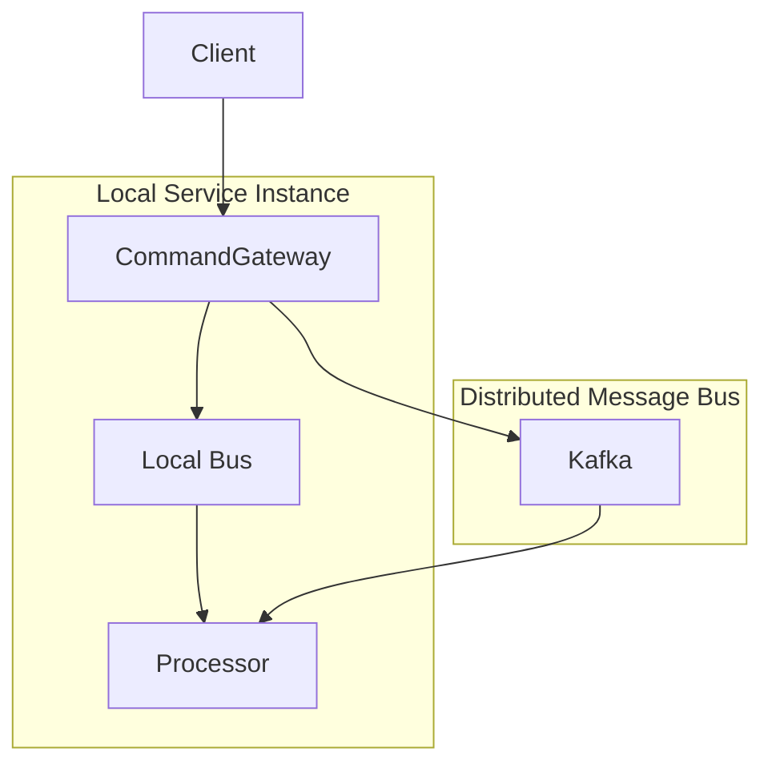

# Basic Configuration

This document covers the fundamental configuration options for the Wow framework.

## WowProperties

- Configuration class: [WowProperties](https://github.com/Ahoo-Wang/Wow/blob/main/wow-spring-boot-starter/src/main/kotlin/me/ahoo/wow/spring/boot/starter/WowProperties.kt)
- Prefix: `wow`

| Name | Data Type | Description | Default Value |
|------|-----------|-------------|---------------|
| `enabled` | Boolean | Enable/disable the Wow framework | `true` |
| `context-name` | String | Bounded context name for the service | `${spring.application.name}` |
| `shutdown-timeout` | Duration | Graceful shutdown timeout | `60s` |

**YAML Configuration Example**

```yaml
wow:
  enabled: true
  context-name: order-service
  shutdown-timeout: 120s
```

## BusProperties

`BusProperties` is the common configuration for `CommandBus`, `EventBus`, and `StateEventBus`.

- Configuration class: [BusProperties](https://github.com/Ahoo-Wang/Wow/blob/main/wow-spring-boot-starter/src/main/kotlin/me/ahoo/wow/spring/boot/starter/BusProperties.kt)

| Name | Data Type | Description | Default Value |
|------|-----------|-------------|---------------|
| `type` | BusType | Message bus implementation type | `kafka` |
| `local-first` | LocalFirstProperties | LocalFirst mode configuration | |

### BusType

```kotlin
enum class BusType {
    KAFKA,      // Apache Kafka (recommended for production)
    REDIS,      // Redis Streams
    IN_MEMORY,  // In-memory (for testing)
    NO_OP;      // No-op (for special cases)
}
```

### LocalFirstProperties

| Name | Data Type | Description | Default Value |
|------|-----------|-------------|---------------|
| `enabled` | Boolean | Enable LocalFirst mode | `true` |

**YAML Configuration Example**

```yaml
wow:
  command:
    bus:
      type: kafka
      local-first:
        enabled: true
  event:
    bus:
      type: kafka
      local-first:
        enabled: true
```

## LocalFirst Mode

LocalFirst mode optimizes command and event processing by prioritizing local message consumption over distributed message bus:



### Benefits

1. **Reduced Latency**: Local message processing avoids network round trips
2. **Better Resource Utilization**: Maximizes local processing before distributed
3. **Fault Tolerance**: Failed local messages are retried via distributed bus

### Configuration

```yaml
wow:
  command:
    bus:
      type: kafka
      local-first:
        enabled: true  # Default is true
  event:
    bus:
      type: kafka
      local-first:
        enabled: true
```

## Environment-Specific Configuration

### Development Environment

```yaml
wow:
  command:
    bus:
      type: in_memory
  event:
    bus:
      type: in_memory
  eventsourcing:
    store:
      storage: in_memory
    snapshot:
      storage: in_memory
```

### Production Environment

```yaml
wow:
  command:
    bus:
      type: kafka
      local-first:
        enabled: true
  event:
    bus:
      type: kafka
      local-first:
        enabled: true
  eventsourcing:
    store:
      storage: mongo
    snapshot:
      enabled: true
      strategy: version_offset
      version-offset: 10
      storage: mongo
```

## Complete Configuration Example

```yaml
spring:
  application:
    name: order-service

wow:
  enabled: true
  context-name: order-service
  shutdown-timeout: 120s

  command:
    bus:
      type: kafka
      local-first:
        enabled: true

  event:
    bus:
      type: kafka
      local-first:
        enabled: true

  eventsourcing:
    store:
      storage: mongo
    snapshot:
      enabled: true
      strategy: version_offset
      version-offset: 10
      storage: mongo
    state:
      bus:
        type: kafka
        local-first:
          enabled: true

  kafka:
    bootstrap-servers:
      - kafka-0:9092
      - kafka-1:9092
      - kafka-2:9092
    topic-prefix: 'wow.'

  mongo:
    enabled: true
    auto-init-schema: true

  openapi:
    enabled: true

  webflux:
    enabled: true
    global-error:
      enabled: true
```
