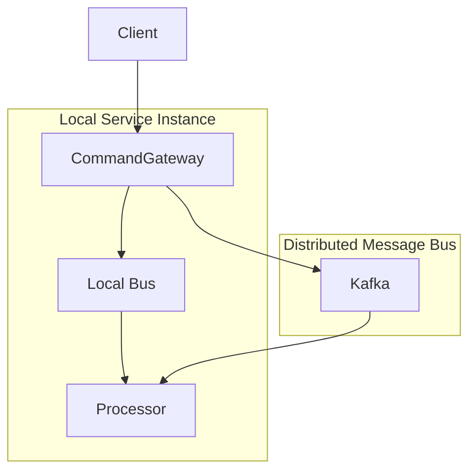

# Core Configuration

## WowProperties

- Configuration class: [WowProperties](https://github.com/Ahoo-Wang/Wow/blob/main/wow-spring-boot-starter/src/main/kotlin/me/ahoo/wow/spring/boot/starter/WowProperties.kt)
- Prefix: `wow`

| Name | Data Type | Description | Default Value |
|------|-----------|-------------|---------------|
| `enabled` | Boolean | Enable/disable the Wow framework | `true` |
| `context-name` | String | Bounded context name for the service | `${spring.application.name}` |
| `shutdown-timeout` | Duration | Graceful shutdown timeout | `60s` |

```yaml
wow:
  enabled: true
  context-name: order-service
  shutdown-timeout: 120s
```

## DispatcherProperties

Command, domain event, projection, and stateless saga dispatchers can independently configure
their ordering stripe count and Scheduler workers per named aggregate type:

| Full Property | Data Type | Description | Default Value |
|------|-----------|-------------|---------------|
| `wow.command.dispatcher.stripe-count` | Int | Command ordering stripes | `64 × CPU` |
| `wow.command.dispatcher.scheduler-pool-size` | Int | Workers per command aggregate type | `CPU` |
| `wow.event.dispatcher.stripe-count` | Int | Domain event ordering stripes | `64 × CPU` |
| `wow.event.dispatcher.scheduler-pool-size` | Int | Workers per event aggregate type | `CPU` |
| `wow.projection.dispatcher.stripe-count` | Int | Projection ordering stripes | `64 × CPU` |
| `wow.projection.dispatcher.scheduler-pool-size` | Int | Workers per projection aggregate type | `CPU` |
| `wow.saga.stateless.dispatcher.stripe-count` | Int | Stateless saga ordering stripes | `64 × CPU` |
| `wow.saga.stateless.dispatcher.scheduler-pool-size` | Int | Workers per stateless saga aggregate type | `CPU` |

Every value must be greater than `0`. `scheduler-pool-size` is a per-named-aggregate pool size,
not a role-wide thread cap. When absent, the JVM system properties `wow.parallelism` and
`reactor.schedulers.defaultPoolSize` remain compatible fallbacks. See the
[configuration guide](../../guide/configuration.md#dispatcher-tuning) for examples and tuning boundaries.

## BusProperties

`BusProperties` is the shared configuration for `CommandBus`, `EventBus`, and `StateEventBus`.

- Configuration class: [BusProperties](https://github.com/Ahoo-Wang/Wow/blob/main/wow-spring-boot-starter/src/main/kotlin/me/ahoo/wow/spring/boot/starter/BusProperties.kt)

| Name | Data Type | Description | Default Value |
|------|-----------|-------------|---------------|
| `type` | BusType | Message bus implementation type | `kafka` |
| `local-first` | LocalFirstProperties | LocalFirst mode configuration | |

### BusType

```kotlin
enum class BusType {
    KAFKA,      // Apache Kafka (recommended for production)
    REDIS,      // Redis Streams
    IN_MEMORY,  // In-memory (for testing)
    NO_OP;      // No-op (for special cases)
}
```

### LocalFirst Mode

LocalFirst mode optimizes command and event processing by prioritizing local message consumption over distributed message bus:



#### Benefits

1. **Reduced Latency**: Local message processing avoids network round trips
2. **Better Resource Utilization**: Maximizes local processing before distributed
3. **Fault Tolerance**: Failed local messages are retried via distributed bus

| Name | Data Type | Description | Default Value |
|------|-----------|-------------|---------------|
| `local-first.enabled` | Boolean | Enable LocalFirst mode | `true` |

## Command Bus

- Configuration class: [CommandProperties](https://github.com/Ahoo-Wang/Wow/blob/main/wow-spring-boot-starter/src/main/kotlin/me/ahoo/wow/spring/boot/starter/command/CommandProperties.kt)
- Prefix: `wow.command.`

| Name | Data Type | Description | Default Value |
|------|-----------|-------------|---------------|
| `bus` | `BusProperties` | Command bus configuration | |
| `idempotency` | `IdempotencyProperties` | Command idempotency | |

```yaml
wow:
  command:
    bus:
      type: kafka
      local-first:
        enabled: true
    idempotency:
      enabled: true
      bloom-filter:
        expected-insertions: 1000000
        ttl: PT60S
        fpp: 0.00001
```

### IdempotencyProperties

- Configuration class: [IdempotencyProperties](https://github.com/Ahoo-Wang/Wow/blob/main/wow-spring-boot-starter/src/main/kotlin/me/ahoo/wow/spring/boot/starter/command/CommandProperties.kt)

| Name | Data Type | Description | Default Value |
|------|-----------|-------------|---------------|
| `enabled` | `boolean` | Whether to enable | `true` |
| `bloom-filter` | `BloomFilter` | BloomFilter | |

#### BloomFilter

| Name | Data Type | Description | Default Value |
|------|-----------|-------------|---------------|
| `ttl` | `Duration` | Time to live | `Duration.ofMinutes(1)` |
| `expected-insertions` | `Long` | Expected number of insertions | `1000_000` |
| `fpp` | `Double` | False positive probability | `0.00001` |

## Event Bus

- Configuration class: [EventProperties](https://github.com/Ahoo-Wang/Wow/blob/main/wow-spring-boot-starter/src/main/kotlin/me/ahoo/wow/spring/boot/starter/event/EventProperties.kt)
- Prefix: `wow.event.`

| Name | Data Type | Description | Default Value |
|------|-----------|-------------|---------------|
| `bus` | `BusProperties` | Event bus configuration | |

```yaml
wow:
  event:
    bus:
      type: kafka
      local-first:
        enabled: true
```

## Event Sourcing

### EventStoreProperties

- Configuration class: [EventStoreProperties](https://github.com/Ahoo-Wang/Wow/blob/main/wow-spring-boot-starter/src/main/kotlin/me/ahoo/wow/spring/boot/starter/eventsourcing/store/EventStoreProperties.kt)
- Prefix: `wow.eventsourcing.store`

| Name | Data Type | Description | Default Value |
|------|-----------|-------------|---------------|
| `storage` | `EventStoreStorage` | Event store storage backend | `mongo` |

```yaml
wow:
  eventsourcing:
    store:
      storage: mongo
```

#### EventStoreStorage

```kotlin
enum class EventStoreStorage {
    MONGO,
    REDIS,
    IN_MEMORY,
    DELAY
    ;
}
```

### SnapshotProperties

- Configuration class: [SnapshotProperties](https://github.com/Ahoo-Wang/Wow/blob/main/wow-spring-boot-starter/src/main/kotlin/me/ahoo/wow/spring/boot/starter/eventsourcing/snapshot/SnapshotProperties.kt)
- Prefix: `wow.eventsourcing.snapshot`

| Name | Data Type | Description | Default Value |
|------|-----------|-------------|---------------|
| `enabled` | `Boolean` | Whether to enable snapshots | `true` |
| `strategy` | `Strategy` | Snapshot strategy | `all` |
| `version-offset` | `Int` | Version offset threshold | `5` |
| `storage` | `SnapshotStorage` | Snapshot storage backend | `mongo` |

```yaml
wow:
  eventsourcing:
    snapshot:
      enabled: true
      strategy: version_offset
      version-offset: 10
      storage: mongo
```

#### Strategy

```kotlin
enum class Strategy {
    ALL,
    VERSION_OFFSET,
    ;
}
```

#### SnapshotStorage

```kotlin
enum class SnapshotStorage {
    MONGO,
    REDIS,
    ELASTICSEARCH,
    IN_MEMORY,
    DELAY
    ;
}
```

## State Event Bus

- Configuration class: [StateProperties](https://github.com/Ahoo-Wang/Wow/blob/main/wow-spring-boot-starter/src/main/kotlin/me/ahoo/wow/spring/boot/starter/eventsourcing/state/StateProperties.kt)
- Prefix: `wow.eventsourcing.state`

| Name | Data Type | Description | Default Value |
|------|-----------|-------------|---------------|
| `bus` | `BusProperties` | State event bus configuration | |

```yaml
wow:
  eventsourcing:
    state:
      bus:
        type: kafka
        local-first:
          enabled: true
```

## Prepare Key

- Prefix: `wow.prepare`

| Name | Data Type | Description | Default Value |
|------|-----------|-------------|---------------|
| `enabled` | Boolean | Enable PrepareKey functionality | `true` |
| `storage` | PrepareStorage | Storage backend for PrepareKey | `MONGO` |
| `base-packages` | List\<String\> | Base packages to scan for PrepareKey definitions | `[]` |

### PrepareStorage Values

| Value | Description |
|-------|-------------|
| `MONGO` | MongoDB (recommended) |
| `REDIS` | Redis |

```yaml
wow:
  prepare:
    enabled: true
    storage: mongo
    base-packages:
      - com.example.domain
```

## Environment-Specific Configuration

### Development Environment

```yaml
wow:
  command:
    bus:
      type: in_memory
  event:
    bus:
      type: in_memory
  eventsourcing:
    store:
      storage: in_memory
    snapshot:
      storage: in_memory
```

### Production Environment

```yaml
wow:
  command:
    bus:
      type: kafka
      local-first:
        enabled: true
  event:
    bus:
      type: kafka
      local-first:
        enabled: true
  eventsourcing:
    store:
      storage: mongo
    snapshot:
      enabled: true
      strategy: version_offset
      version-offset: 10
      storage: mongo
```

## Complete Configuration Example

```yaml
spring:
  application:
    name: order-service

wow:
  enabled: true
  context-name: order-service
  shutdown-timeout: 120s

  command:
    bus:
      type: kafka
      local-first:
        enabled: true

  event:
    bus:
      type: kafka
      local-first:
        enabled: true

  eventsourcing:
    store:
      storage: mongo
    snapshot:
      enabled: true
      strategy: version_offset
      version-offset: 10
      storage: mongo
    state:
      bus:
        type: kafka
        local-first:
          enabled: true

  kafka:
    bootstrap-servers:
      - kafka-0:9092
      - kafka-1:9092
      - kafka-2:9092
    topic-prefix: 'wow.'

  mongo:
    enabled: true
    auto-init-schema: true

  openapi:
    enabled: true

  webflux:
    enabled: true
    global-error:
      enabled: true
```
