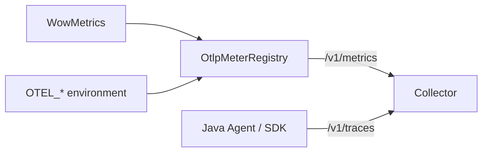

# Observability Configuration

This page separates Wow instrumentation switches from exporter configuration. Wow creates semantic metrics and spans;
Spring Boot, Micrometer, the OpenTelemetry SDK/Agent, and the selected backend determine where they go.

## OpenAPI

| Property | Type | Default | Effect |
|---|---|---|---|
| `wow.openapi.enabled` | Boolean | `true` | Register runtime Wow OpenAPI routes and schemas |

```yaml
wow:
  openapi:
    enabled: true
```

The compiler produces command metadata, but `OpenAPIAutoConfiguration` assembles the document from runtime
registrations. Treat the resulting specification as a deployed runtime artifact. A locally generated document does
not prove the intended image, route security, or gateway policy is live.

## OpenTelemetry

| Property | Type | Default | Effect |
|---|---|---|---|
| `wow.opentelemetry.enabled` | Boolean | `true` | Register Wow tracing filters and supported bean decorators |

```yaml
wow:
  opentelemetry:
    enabled: true
```

The condition also requires `me.ahoo.wow.opentelemetry.WowInstrumenter` on the classpath. `false` disables only Wow
instrumentation; it does not stop the Java Agent, SDK exporters, HTTP client spans, or other libraries. The module
uses `GlobalOpenTelemetry`, which must be initialized before Wow instrumenters are created.

## Metrics

| Property | Type | Default | Effect |
|---|---|---|---|
| `wow.metrics.enabled` | Boolean | `true` | Record Wow semantic and batch metrics into the application registry |

```yaml
wow:
  metrics:
    enabled: true
```

When enabled and a `MeterRegistry` exists, auto-configuration creates an instance-scoped `WowMetrics` and decorates
the runtime. When disabled or when no registry exists, it uses `WowMetrics.NONE`. This switch is independent of
`wow.opentelemetry.enabled`; traces and metrics may be enabled separately.

## Business Intelligence Scripts

`wow.bi.script.enabled` controls the `/wow/bi/script` operational route, its OpenAPI operation, and BI inspector
auto-configuration. The complete `wow.bi.script.*` tree and its production ownership rules are documented in
[BI Deployment and Recovery](/guide/bi-operations). Disabling the route does not stop existing ClickHouse consumers
or change BI data.

## Integration Setup

First decide which evidence is required:

| Evidence | Component that must confirm it |
|---|---|
| Meter exists in-process | Actuator metrics endpoint or registry inspection |
| Prometheus export | Successful target scrape and stored series |
| OTLP metric export | Collector/backend receipt after an export step |
| Wow trace export | Collector/backend receipt with Wow instrumentation scope and attributes |
| Production readiness | Deployment revision, live traffic, alert route, and backend reconciliation |

### Enabling Metrics Export (Prometheus)

Add Actuator and the Prometheus registry:

```kotlin
implementation("org.springframework.boot:spring-boot-starter-actuator")
runtimeOnly("io.micrometer:micrometer-registry-prometheus")
```

Expose only the endpoints allowed by the deployment policy:

```yaml
management:
  endpoints:
    web:
      exposure:
        include:
          - health
          - prometheus
  metrics:
    tags:
      application: ${spring.application.name}
```

Prometheus scrapes `/actuator/prometheus`. Micrometer's logical `wow.operation` timer is exported using Prometheus
naming, for example `wow_operation_seconds_count` and `wow_operation_seconds_sum`; `wow.stream.messages` becomes a
counter series such as `wow_stream_messages_total`. Validate labels and values against real traffic, not only endpoint
HTTP status.

Temporarily exposing `metrics` can help diagnose the in-process registry:

```yaml
management:
  endpoints:
    web:
      exposure:
        include: [health, metrics]
```

Query `/actuator/metrics/wow.operation`, then remove or restrict the diagnostic endpoint. This check proves
collection only; the Prometheus target page and query result prove scrape/export.

### Exporting Metrics via OTLP (OpenTelemetry Collector)

Wow metrics remain Micrometer metrics. With the current Spring Boot 4.1.1 baseline, add Boot's OpenTelemetry runtime
support and Micrometer's OTLP registry:

```kotlin
implementation("org.springframework.boot:spring-boot-starter-actuator")
runtimeOnly("org.springframework.boot:spring-boot-opentelemetry")
runtimeOnly("io.micrometer:micrometer-registry-otlp")
```

The tested default environment path is:

```bash
export OTEL_SERVICE_NAME=order-service
export OTEL_EXPORTER_OTLP_ENDPOINT=http://otel-collector:4318
export OTEL_EXPORTER_OTLP_HEADERS="authorization=Bearer token" # Optional.
```

The OTLP metrics registry sends HTTP protobuf to `/v1/metrics`; use
`OTEL_EXPORTER_OTLP_METRICS_ENDPOINT` when the metric endpoint must differ from the shared endpoint. Do not enable a
second Micrometer bridge unless duplication is intentional.



The repository smoke test starts a real Boot context, exports `wow.operation`, and decodes the OTLP request. Repeat
the equivalent check in the target environment and retain Collector/backend receipt as release evidence.

### Enabling Distributed Tracing (OpenTelemetry)

Request the starter feature capability:

```kotlin
implementation("me.ahoo.wow:wow-spring-boot-starter") {
    capabilities {
        requireCapability("me.ahoo.wow:opentelemetry-support")
    }
}
```

The shortest production runtime is normally the OpenTelemetry Java Agent:

```bash
export JAVA_TOOL_OPTIONS="-javaagent:/opt/otel/opentelemetry-javaagent.jar"
export OTEL_SERVICE_NAME=order-service
export OTEL_EXPORTER_OTLP_ENDPOINT=http://otel-collector:4318
java -jar your-app.jar
```

For OTLP/HTTP the general endpoint normally yields `/v1/traces`; configure signal-specific protocol/endpoints when
using OTLP/gRPC or separate collectors. Verify a trace that includes a Wow instrumentation scope, expected aggregate
or message attributes, a store span, and a downstream processing span. A startup log or local span test does not
prove Collector receipt or production admission.

See [Observability](/guide/advanced/observability) for the stage/span map and
[Metrics](/guide/advanced/metrics) for the meter catalogue.

<!-- Sources: ConditionalOnOpenTelemetryEnabled.kt, ConditionalOnMetricsEnabled.kt, MetricsAutoConfiguration.kt,
OtlpMetricsExportSmokeTest.kt, OpenAPIAutoConfiguration.kt, BiScriptProperties.kt -->
