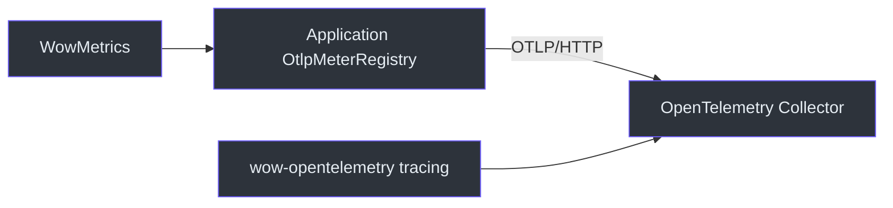

# Observability Configuration

## OpenAPI

| Property | Type | Default | Description |
|----------|------|---------|-------------|
| `wow.openapi.enabled` | Boolean | `true` | Enable OpenAPI spec generation |

```yaml
wow:
  openapi:
    enabled: true
```

When enabled, Wow builds the OpenAPI specification at **runtime** from the command and event
models registered in the bounded context (`RouterSpecs` bean built in `OpenAPIAutoConfiguration`).
The `wow-compiler` module contributes command routing metadata at compile time, but the spec
itself — including routes, schemas, and the bundled Swagger UI — is assembled when the
application context starts.

## OpenTelemetry

| Property | Type | Default | Description |
|----------|------|---------|-------------|
| `wow.opentelemetry.enabled` | Boolean | `true` | Enable OpenTelemetry tracing instrumentation of the command/event pipeline |

```yaml
wow:
  opentelemetry:
    enabled: true
```

Enabled by default (`matchIfMissing = true`) when the `wow-opentelemetry` module and the
`WowInstrumenter` class are on the classpath. Set to `false` to disable distributed tracing
spans across the command bus, event store, projections, and sagas.

## Metrics

| Property | Type | Default | Description |
|----------|------|---------|-------------|
| `wow.metrics.enabled` | Boolean | `true` | Enable Wow-specific Micrometer metrics collection |

```yaml
wow:
  metrics:
    enabled: true
```

Enabled by default (`matchIfMissing = true`). Spring binds the `MeterRegistry` from the current
ApplicationContext to a context-scoped `WowMetrics` bean. That bean drives component decorators,
dispatchers, and `wow.batch.*`. Wow uses `WowMetrics.NONE` when no registry exists or metrics are
explicitly disabled.

Wow does not use Micrometer's global registry. Multiple Spring application contexts can select
their own registries and `wow.metrics.enabled` values without mutating process-wide state.

## Business Intelligence Scripts

The `wow.bi.script.*` property tree (ClickHouse/BI script deployment) is documented on the
[BI Operations](/guide/bi-operations) page.

## Integration Setup

### Enabling Metrics Export (Prometheus)

Wow metrics are written to Spring Boot's application `MeterRegistry`. To expose them via Prometheus, add the
Spring Boot Actuator + Prometheus registry dependencies and expose the endpoint:

```yaml
management:
  endpoint:
    health:
      show-details: always
      probes:
        enabled: true
  endpoints:
    web:
      exposure:
        include:
          - health
          - prometheus    # Micrometer/Prometheus scrape endpoint
          - threaddump
  metrics:
    tags:
      application: ${spring.application.name}   # common tag on all meters

springdoc:
  show-actuator: true   # include actuator endpoints in OpenAPI
```

```kotlin
implementation("org.springframework.boot:spring-boot-starter-actuator")
implementation("io.micrometer:micrometer-registry-prometheus")
```

Scrape the `/actuator/prometheus` endpoint from Prometheus. The Wow-specific Micrometer meter IDs
are `wow.operation`, `wow.stream.*`, and `wow.batch.*`; these dotted IDs are used with the Actuator
`metrics` endpoint. Prometheus applies its naming convention at export time, for example:

| Micrometer meter ID | Prometheus series example |
|---|---|
| `wow.operation` (Timer) | `wow_operation_seconds_count`, `wow_operation_seconds_sum` |
| `wow.stream.messages` (Counter) | `wow_stream_messages_total` |

The Wow series appear alongside standard JVM and other instrumented application meters. Generic
Reactor Core sequence or scheduler meters appear only when the application explicitly configures
`reactor-core-micrometer` instrumentation. See [Metrics](/guide/advanced/metrics) for the full Wow
catalogue and the [Spring Boot metrics documentation](https://docs.spring.io/spring-boot/reference/actuator/metrics.html#actuator.metrics.endpoint)
for the distinction between logical meter IDs and exported names.

### Exporting Metrics via OTLP (OpenTelemetry Collector)

Wow records metrics with Micrometer; `wow-opentelemetry` instruments tracing and does not export
Micrometer meters. To send Wow and standard application metrics to an OpenTelemetry Collector,
add Spring Boot Actuator and Micrometer's OTLP registry to the application:

```kotlin
implementation("org.springframework.boot:spring-boot-starter-actuator")
runtimeOnly("io.micrometer:micrometer-registry-otlp")
```

Configure the OTLP/HTTP metrics endpoint. Wow directly uses Spring Boot's `OtlpMeterRegistry` bean;
Micrometer's global-registry bridge is not required:

```yaml
wow:
  metrics:
    enabled: true

management:
  otlp:
    metrics:
      export:
        enabled: ${OTEL_METRICS_ENABLED:true}
        url: ${OTEL_EXPORTER_OTLP_METRICS_ENDPOINT:http://otel-collector:4318/v1/metrics}
        step: 30s
  opentelemetry:
    resource-attributes:
      service.name: ${spring.application.name}
```


<!-- Sources: wow-core/src/main/kotlin/me/ahoo/wow/metrics/WowMetrics.kt, wow-core/src/main/kotlin/me/ahoo/wow/infra/batch/BatchMetrics.kt, wow-spring-boot-starter/src/main/kotlin/me/ahoo/wow/spring/boot/starter/metrics/MetricsAutoConfiguration.kt -->

Spring Boot auto-configures `OtlpMeterRegistry` when the registry implementation is on the runtime
classpath. Wow injects that application registry directly, so Wow meters still reach OTLP when
`management.metrics.use-global-registry=false`. See the
[Spring Boot OTLP metrics documentation](https://docs.spring.io/spring-boot/reference/actuator/metrics.html#actuator.metrics.export.otlp)
and [Micrometer OTLP registry documentation](https://docs.micrometer.io/micrometer/reference/implementations/otlp.html).

To verify the integration, temporarily add `metrics` to the existing Actuator exposure list:

```yaml
management:
  endpoints:
    web:
      exposure:
        include:
          - health
          - prometheus
          - threaddump
          - metrics       # temporary diagnostic endpoint
```

Generate real traffic, then inspect `/actuator/metrics/wow.operation`,
`/actuator/metrics/wow.batch.write`, or another `wow.*` meter. Verify that the Collector or
downstream backend receives it after the configured `step`. An Actuator result proves collection
only; receipt by the Collector proves export. Batch meters appear only after a batching-enabled
store performs the corresponding operation. Remove or restrict the diagnostic endpoint after
verification.

### Enabling Distributed Tracing (OpenTelemetry)

The recommended way to enable tracing is the OpenTelemetry Java Agent, which bootstraps
`GlobalOpenTelemetry` before the Spring context starts:

```bash
java -javaagent:opentelemetry-javaagent.jar \
     -Dotel.service.name=${spring.application.name} \
     -Dotel.exporter.otlp.endpoint=http://otel-collector:4317 \
     -jar your-app.jar
```

Add `wow-opentelemetry` to your dependencies. You also need `wow-spring-boot-starter` (with the
`opentelemetry-support` capability) — `WowOpenTelemetryAutoConfiguration` lives in the starter,
not the module. The auto-configuration detects the agent's initialized `GlobalOpenTelemetry` and
registers the Wow tracing filters and decorators automatically. Set `wow.opentelemetry.enabled=false` only to disable Wow's spans while
keeping the agent's other instrumentation.

```kotlin
implementation("me.ahoo.wow:wow-opentelemetry")
```

See [Observability](/guide/advanced/observability) for the instrumentation coverage and
[OpenTelemetry Extension](/guide/extensions/opentelemetry) for the instrumenter list.
