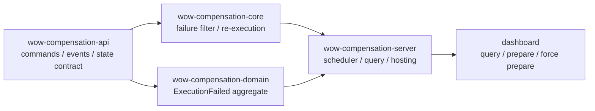
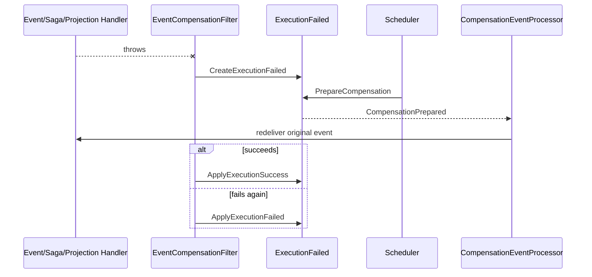

# Event Compensation

[`compensation`](https://github.com/Ahoo-Wang/Wow/tree/main/compensation) is itself a Wow application. A subscriber failure creates an `ExecutionFailed` aggregate; a scheduler or operator prepares a retry; Wow redelivers the original event; and the new result is written back to the same aggregate.

## Module Structure



| Module | Responsibility | Exact source |
| --- | --- | --- |
| `wow-compensation-api` | `ExecutionFailed` commands, events, state, and retry specification | [`api` package](https://github.com/Ahoo-Wang/Wow/tree/main/compensation/wow-compensation-api/src/main/kotlin/me/ahoo/wow/compensation/api) |
| `wow-compensation-core` | Capture failures, create/update records, and redeliver original events | [`CompensationFilter.kt`](https://github.com/Ahoo-Wang/Wow/blob/main/compensation/wow-compensation-core/src/main/kotlin/me/ahoo/wow/compensation/core/CompensationFilter.kt#L47-L126), [`CompensationEventProcessor.kt`](https://github.com/Ahoo-Wang/Wow/blob/main/compensation/wow-compensation-core/src/main/kotlin/me/ahoo/wow/compensation/core/CompensationEventProcessor.kt#L27-L56) |
| `wow-compensation-domain` | `ExecutionFailed` decisions, state machine, and backoff calculation | [`ExecutionFailed.kt`](https://github.com/Ahoo-Wang/Wow/blob/main/compensation/wow-compensation-domain/src/main/kotlin/me/ahoo/wow/compensation/domain/ExecutionFailed.kt#L36-L142), [`ExecutionFailedState.kt`](https://github.com/Ahoo-Wang/Wow/blob/main/compensation/wow-compensation-domain/src/main/kotlin/me/ahoo/wow/compensation/domain/ExecutionFailedState.kt#L35-L99) |
| `wow-compensation-server` | Find due failures and send prepare commands | [`CompensationScheduler.kt`](https://github.com/Ahoo-Wang/Wow/blob/main/compensation/wow-compensation-server/src/main/kotlin/me/ahoo/wow/compensation/server/scheduler/CompensationScheduler.kt#L29-L76), [`SnapshotFindNextRetry.kt`](https://github.com/Ahoo-Wang/Wow/blob/main/compensation/wow-compensation-server/src/main/kotlin/me/ahoo/wow/compensation/server/failed/SnapshotFindNextRetry.kt) |
| `dashboard` | Failure queue, details, retry specification, prepare, and force prepare | [`FailedView.tsx`](https://github.com/Ahoo-Wang/Wow/blob/main/compensation/dashboard/src/features/Failed/FailedView.tsx), [`Actions.tsx`](https://github.com/Ahoo-Wang/Wow/blob/main/compensation/dashboard/src/features/Failed/Actions.tsx#L64-L224) |

## Architecture Overview



### How It Works

1. [`EventCompensationFilter`](https://github.com/Ahoo-Wang/Wow/blob/main/compensation/wow-compensation-core/src/main/kotlin/me/ahoo/wow/compensation/core/CompensationFilter.kt#L68-L126) sits in event processor, Saga, projection, and snapshot flows. When a function throws and retry is not disabled, it records eventId, function, error, execution time, retry specification, and recoverability.
2. The first failure sends `CreateExecutionFailed`. A replay failure already has a compensationId header, so it sends `ApplyExecutionFailed`. A successful replay sends `ApplyExecutionSuccess`.
3. [`SnapshotFindNextRetry`](https://github.com/Ahoo-Wang/Wow/blob/main/compensation/wow-compensation-server/src/main/kotlin/me/ahoo/wow/compensation/server/failed/SnapshotFindNextRetry.kt) selects recoverable/unknown records below the retry threshold and past `nextRetryAt`; PREPARED records must also be timed out.
4. [`CompensationEventProcessor`](https://github.com/Ahoo-Wang/Wow/blob/main/compensation/wow-compensation-core/src/main/kotlin/me/ahoo/wow/compensation/core/CompensationEventProcessor.kt#L36-L56) replays only a local aggregate's exact original event version, with the target function and failure-record ID.

```text
CreateExecutionFailed -> FAILED
Prepare/ForcePrepare  -> PREPARED
ApplyExecutionFailed  -> FAILED
ApplyExecutionSuccess -> SUCCEEDED
```

`RetryState` stores `retries`, `retryAt`, `timeoutAt`, and `nextRetryAt`. [`NextRetryAtCalculator`](https://github.com/Ahoo-Wang/Wow/blob/main/compensation/wow-compensation-domain/src/main/kotlin/me/ahoo/wow/compensation/domain/NextRetryAtCalculator.kt) uses `minBackoff * 2^retries` seconds and rejects negative values or overflow.

### ExecutionFailed Aggregate Commands

| Command | Domain decision | Event/result |
| --- | --- | --- |
| `CreateExecutionFailed` | Validate/materialize retry spec and calculate initial retryState | `ExecutionFailedCreated`, `FAILED` |
| `PrepareCompensation` | Allowed only when `canRetry()` | `CompensationPrepared`, `PREPARED` |
| `ForcePrepareCompensation` | Ignores retry-count threshold, but not success; PREPARED must be timed out | `CompensationPrepared` |
| `ApplyExecutionFailed` | Allowed only in `PREPARED` | `ExecutionFailedApplied`, back to `FAILED` |
| `ApplyExecutionSuccess` | Allowed only in `PREPARED` | `ExecutionSuccessApplied`, `SUCCEEDED` |
| `ApplyRetrySpec` | Values must be non-negative and cannot overflow time calculation | `RetrySpecApplied` |
| `MarkRecoverable` / `ChangeFunction` | New value must differ from current value | `RecoverableMarked` / `FunctionChanged` |

## Features

Verify the domain, compensation filter, and dashboard first:

```shell
./gradlew :wow-compensation-domain:check :wow-compensation-core:check
pnpm --dir compensation/dashboard test
```

Gradle and Vitest should both exit successfully. [`ExecutionFailedSpec`](https://github.com/Ahoo-Wang/Wow/blob/main/compensation/wow-compensation-domain/src/test/kotlin/me/ahoo/wow/compensation/domain/ExecutionFailedSpec.kt#L61-L376) is the main state-machine evidence. [`CompensationFilterTest`](https://github.com/Ahoo-Wang/Wow/blob/main/compensation/wow-compensation-core/src/test/kotlin/me/ahoo/wow/compensation/core/CompensationFilterTest.kt) covers first failure, replay failure, and successful write-back.

The server requires working persistence configuration. Once configured, run:

```shell
./gradlew :wow-compensation-server:run
pnpm --dir compensation/dashboard dev
```

Do not infer command URLs from the context name. The dashboard's current [generated OpenAPI client](https://github.com/Ahoo-Wang/Wow/blob/main/compensation/dashboard/src/generated/compensation/execution_failed/commandClient.ts#L8-L20) defines:

```text
PUT /execution_failed/{id}/prepare_compensation
PUT /execution_failed/{id}/force_prepare_compensation
PUT /execution_failed/{id}/apply_retry_spec
```

For an existing retryable failure:

```shell
curl -X PUT \
  'http://localhost:8080/execution_failed/<execution-id>/prepare_compensation' \
  -H 'Command-Wait-Stage: PROCESSED' \
  -H 'Command-Request-Id: prepare-<execution-id>'
```

Expect `succeeded=true` and `stage=PROCESSED`; after dashboard refresh, status is `PREPARED`. Successful replay changes it to `SUCCEEDED`; another failure returns it to `FAILED` with a new error and next retry time. The actual dashboard call and success/error feedback are in [`Actions.tsx`](https://github.com/Ahoo-Wang/Wow/blob/main/compensation/dashboard/src/features/Failed/Actions.tsx#L72-L119).

Failure behavior must remain visible: ordinary prepare rejects a PREPARED record; applying success/failure to FAILED or SUCCEEDED returns `ExecutionFailed is not prepared.`; ordinary prepare closes at the retry limit, while force prepare still respects success and PREPARED timeout; negative retry values or exponential-backoff overflow fail in the aggregate. Dashboard button state is guidance—the server state machine remains authoritative.

## Console Screenshot


## Detailed Documentation

See the [Event Compensation guide](../../guide/event-compensation) for adoption, storage, scheduling, and notification configuration. Completion means the three checks pass, a handler failure can be traced into the failure aggregate and from `CompensationPrepared` to success or failure, and manual action paths are proven by the generated client.
