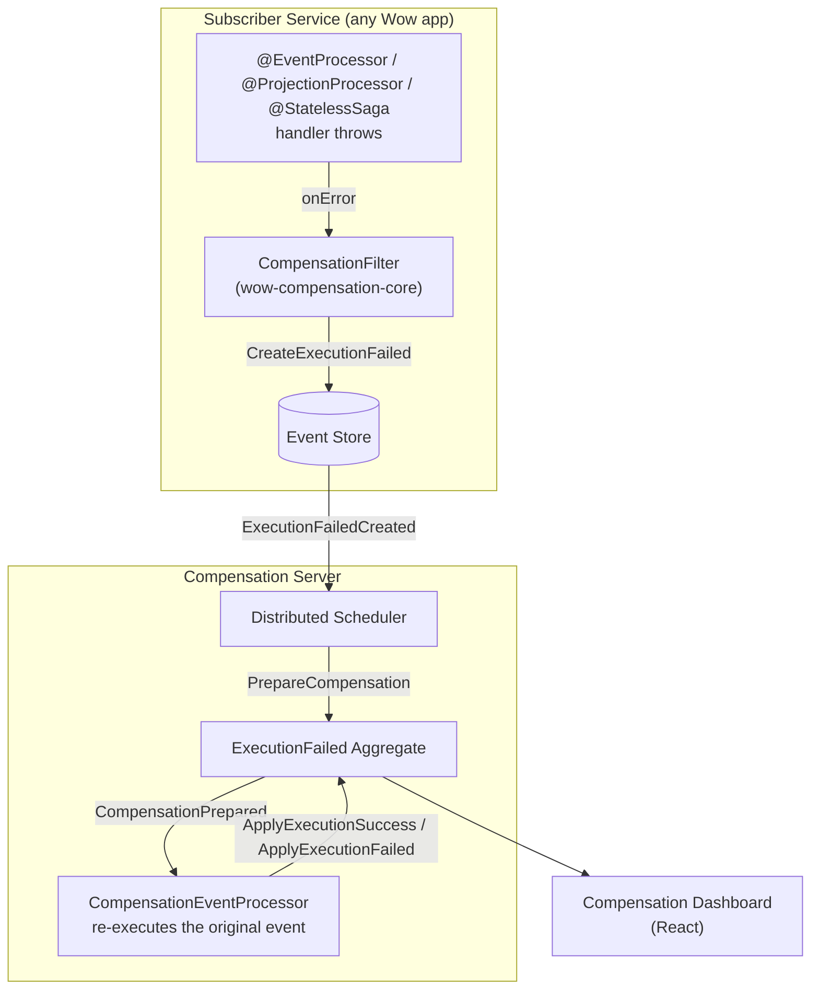

# Event Compensation

_[Event Compensation](https://github.com/Ahoo-Wang/Wow/tree/main/compensation)_ is a real-world application built with the _Wow_ framework, designed to handle and recover from data inconsistencies caused by event processing failures.

## Module Structure

| Module                  | Description                                                                                                                              |
|-------------------------|------------------------------------------------------------------------------------------------------------------------------------------|
| wow-compensation-api    | API layer, defines aggregate commands, domain events, and query view models.                                                             |
| wow-compensation-core   | Core layer, contains the core implementation of the compensation mechanism.                                                              |
| wow-compensation-domain | Domain layer, contains aggregate roots and business constraint implementations.                                                          |
| wow-compensation-server | Host service, the application entry point. Responsible for integrating other modules and providing the application entry.               |
| dashboard               | Frontend console, developed with React + TypeScript + Vite, providing a visual event compensation management interface.                        |

## Architecture Overview

The compensation system is itself a Wow-based application. When any subscriber service's event handler fails, the compensation infrastructure records the failure as an `ExecutionFailed` aggregate and retries it automatically with exponential backoff.

### How It Works

1. **Failure detection**: When a subscriber's event handler throws, the `CompensationFilter` (registered by `wow-compensation-core`) catches the error and sends a `CreateExecutionFailed` command, creating an `ExecutionFailed` aggregate that records the event ID, processor, function, error, and retry spec.

2. **Automatic retry**: The compensation server's distributed scheduler queries pending `ExecutionFailed` aggregates (status=FAILED, nextRetryAt ≤ now) and sends `PrepareCompensation` commands. The `NextRetryAtCalculator` computes the next retry time using exponential backoff (`minBackoff * 2^retries`).

3. **Re-execution**: The `CompensationEventProcessor` handles the `CompensationPrepared` event, re-delivers the original domain event to the target handler, and sends `ApplyExecutionSuccess` or `ApplyExecutionFailed` depending on the outcome.

4. **State machine**: Each `ExecutionFailed` transitions through `FAILED → PREPARED → SUCCEEDED` (or back to `FAILED` for another retry round).

### ExecutionFailed Aggregate Commands

| Command | Trigger | Effect |
|---|---|---|
| `CreateExecutionFailed` | Handler error (automatic) | Creates the failure record with retry spec |
| `PrepareCompensation` | Scheduler tick | Marks the execution for retry, computes next retry time |
| `ForcePrepareCompensation` | Dashboard manual action | Forces immediate retry preparation |
| `ApplyExecutionFailed` | Re-execution failed | Records the new error, schedules next retry |
| `ApplyExecutionSuccess` | Re-execution succeeded | Marks execution as SUCCEEDED |
| `ApplyRetrySpec` | Dashboard configuration change | Updates maxRetries/minBackoff/executionTimeout |

## Features

- **Distributed Automatic Compensation**: Intelligently solves eventual consistency issues
- **Visual Console**: Intuitive monitoring and management of compensation events
- **WeChat Work Notifications**: Timely receive execution failure notifications
- **OpenAPI Interface**: Easy integration and invocation

## Console Screenshot

## Detailed Documentation

For detailed usage instructions on event compensation, please refer to the [Event Compensation Guide](../../guide/event-compensation).
