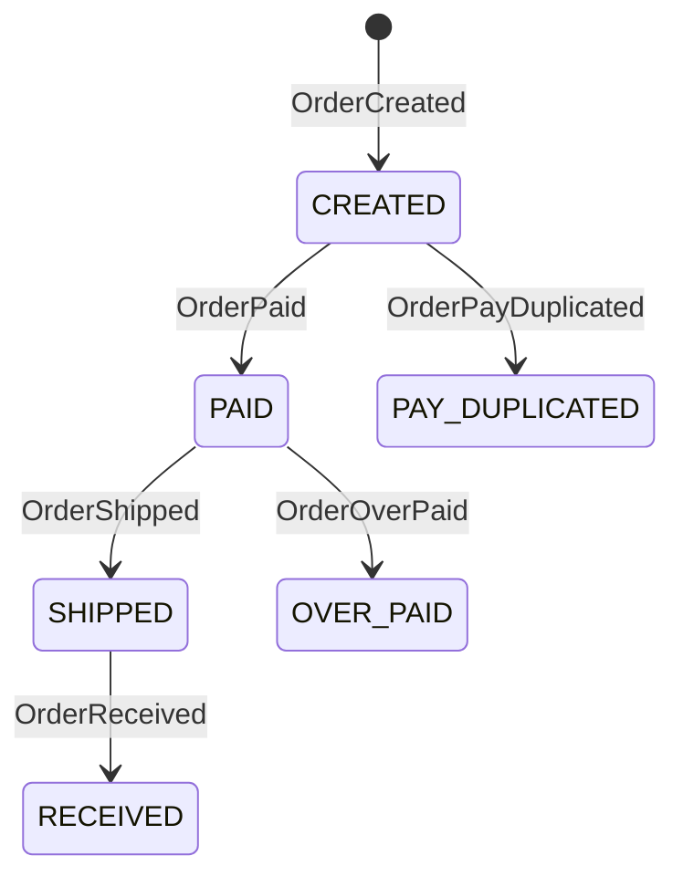

# Order System

The [Order System Example](https://github.com/Ahoo-Wang/Wow/tree/main/example/) is a comprehensive sample project demonstrating the Wow framework's capabilities for building domain-driven microservices. This example showcases aggregate modeling, event sourcing, CQRS patterns, and Saga-based distributed transactions.

## Project Structure

```
example/
├── example-api/                    # API Layer - Commands, Events, Models
│   └── src/main/kotlin/me/ahoo/wow/example/api/order/
│       ├── OrderStatus.kt          # Order status enumeration
│       ├── OrderItem.kt            # Order item model
│       ├── OrderProduct.kt         # Product information
│       ├── OrderPackage.kt         # Order package model
│       ├── CreateOrder.kt          # Create order command
│       ├── PayOrder.kt             # Pay order command
│       ├── ShipOrder.kt            # Ship order command
│       ├── OrderCreated.kt         # Order created event
│       ├── OrderPaid.kt            # Order paid event
│       └── ...
├── example-domain/                 # Domain Layer - Business Logic
│   └── src/main/kotlin/me/ahoo/wow/example/domain/order/
│       ├── Order.kt                # Command aggregate root
│       ├── OrderState.kt           # State aggregate root
│       ├── OrderSaga.kt            # Order Saga
│       ├── CreateOrderSpec.kt      # Business specification
│       └── src/test/kotlin/        # Domain tests
├── example-server/                 # Server Layer - Infrastructure
│   └── src/main/kotlin/me/ahoo/wow/example/server/order/
│       ├── OrderEventProcessor.kt  # Event handlers
│       ├── OrderProjector.kt       # Projection processors
│       ├── OrderRepository.kt      # Repository implementation
│       └── OrderQueryController.kt # Query controllers
```

## Domain Model

### Aggregate Pattern

The Order example uses the **Aggregate Pattern** to separate command handling from state management:

```kotlin
// Command Aggregate Root - Handles commands
@AggregateRoot
@AggregateRoute(resourceName = "sales-order", owner = AggregateRoute.Owner.ALWAYS)
class Order(private val state: OrderState) {

    fun onCommand(createOrder: CreateOrder): OrderCreated {
        // Validate business rules
        require(createOrder.items.isNotEmpty()) {
            "items can not be empty."
        }
        // Return domain events
        return OrderCreated(
            orderId = command.aggregateId.id,
            items = createOrder.items.map { ... },
            address = createOrder.address
        )
    }

    fun onCommand(payOrder: PayOrder): Iterable<*> {
        // Return multiple events for complex workflows
        if (state.status == OrderStatus.CREATED) {
            return listOf(OrderPaid(payOrder.amount))
        }
        return listOf(OrderPayDuplicated(...))
    }
}

// State Aggregate Root - Maintains state
class OrderState(val id: String) : StatusCapable<OrderStatus> {
    var items: List<OrderItem> = listOf()
        private set
    var totalAmount: BigDecimal = BigDecimal.ZERO
        private set
    var status = OrderStatus.CREATED
        private set

    fun onSourcing(orderCreated: OrderCreated) {
        items = orderCreated.items
        totalAmount = orderCreated.items.sumOf { it.totalPrice }
        status = OrderStatus.CREATED
    }

    fun onSourcing(orderPaid: OrderPaid) {
        paidAmount = paidAmount.plus(orderPaid.amount)
        if (orderPaid.paid) {
            status = OrderStatus.PAID
        }
    }
}
```

## Order State Machine



## Commands and Events

### Commands

| Command | Description | Parameters |
|---------|-------------|------------|
| `CreateOrder` | Create a new order | items, address, fromCart |
| `ChangeAddress` | Change shipping address | shippingAddress |
| `PayOrder` | Process payment | paymentId, amount |
| `ShipOrder` | Ship the order | trackingNumber |
| `ReceiptOrder` | Mark order as received | - |

### Events

| Event | Description | Payload |
|-------|-------------|---------|
| `OrderCreated` | Order has been created | orderId, items, address |
| `AddressChanged` | Shipping address changed | shippingAddress |
| `OrderPaid` | Payment received | amount, paid |
| `OrderShipped` | Order has been shipped | trackingNumber |
| `OrderReceived` | Order delivered | - |
| `OrderPayDuplicated` | Duplicate payment attempt | paymentId, errorMsg |
| `OrderOverPaid` | Overpayment detected | paymentId, overPayAmount |

## Saga Pattern

The Order example demonstrates how Sagas coordinate distributed transactions:

```kotlin
@StatelessSaga
class OrderSaga {

    fun onEvent(orderCreated: OrderCreated): Mono<Void> {
        // Remove items from cart after order creation
        if (orderCreated.fromCart) {
            return sendCommand(RemoveCartItem(...))
        }
        return Mono.empty()
    }

    fun onStateEvent(orderPaid: OrderPaid, state: OrderState): Mono<Void> {
        // Trigger shipping workflow after payment
        return sendCommand(ShipOrder(...))
    }
}
```

## Business Specifications

Business specifications encapsulate complex validation rules:

```kotlin
class CreateOrderSpec(
    private val inventoryService: InventoryService
) {

    suspend fun require(item: CreateOrder.Item): OrderItem {
        val product = inventoryService.getProduct(item.productId)
            ?: throw IllegalArgumentException("Product not found: ${item.productId}")
        require(item.quantity <= product.stock) {
            "Insufficient stock for product: ${item.productId}"
        }
        return OrderItem(
            id = GlobalIdGenerator.generateAsString(),
            productId = item.productId,
            price = product.price,
            quantity = item.quantity
        )
    }
}
```

## Projections

Projections maintain optimized read models:

```kotlin
@ProjectionProcessor
class OrderProjector {

    fun onEvent(orderCreated: OrderCreated) {
        // Update read model
        val summary = OrderSummary(
            orderId = orderCreated.orderId,
            customerId = orderCreated.customerId,
            totalAmount = orderCreated.items.sumOf { it.totalPrice },
            status = OrderStatus.CREATED
        )
        orderSummaryRepository.save(summary)
    }

    fun onEvent(orderPaid: OrderPaid) {
        orderSummaryRepository.updateStatus(
            orderId = orderPaid.orderId,
            status = OrderStatus.PAID
        )
    }
}
```

## Running the Example

### 1. Start Infrastructure

```bash
# Start MongoDB
docker run -d --name mongo \
  -p 27017:27017 \
  mongo:6

# Start Kafka
docker run -d --name kafka \
  -p 9092:9092 \
  -e KAFKA_AUTO_CREATE_TOPICS_ENABLE=true \
  confluentinc/cp-kafka:latest
```

### 2. Run the Application

```bash
cd example
./gradlew :example-server:bootRun
```

### 3. Access Swagger UI

Open [http://localhost:8080/swagger-ui.html](http://localhost:8080/swagger-ui.html)

## API Endpoints

The Wow framework automatically generates RESTful APIs for all commands:

| HTTP Method | Endpoint | Command | Description |
|-------------|----------|---------|-------------|
| POST | `/order` | CreateOrder | Create a new order |
| POST | `/{orderId}/address` | ChangeAddress | Change shipping address |
| POST | `/{orderId}/pay` | PayOrder | Pay for order |
| POST | `/{orderId}/ship` | ShipOrder | Ship order |
| POST | `/{orderId}/receipt` | ReceiptOrder | Mark as received |

## Testing

The Order example includes comprehensive unit tests:

```kotlin
class OrderSpec : AggregateSpec<Order, OrderState>({
    on {
        val orderId = generateGlobalId()
        val createOrder = CreateOrder(
            items = listOf(
                CreateOrder.Item(productId = "prod-001", quantity = 2, price = 100)
            ),
            address = ShippingAddress(...),
            fromCart = false
        )

        whenCommand(createOrder) {
            expectNoError()
            expectEventType(OrderCreated::class)
            expectState {
                status.assert().isEqualTo(OrderStatus.CREATED)
                items.assert().hasSize(1)
            }

            fork("Pay Order") {
                val payOrder = PayOrder(orderId, 200)
                whenCommand(payOrder) {
                    expectEventType(OrderPaid::class)
                    expectState {
                        status.assert().isEqualTo(OrderStatus.PAID)
                    }
                }
            }

            fork("Ship Order") {
                val shipOrder = ShipOrder(orderId, "TRACK123")
                whenCommand(shipOrder) {
                    expectErrorType(IllegalStateException::class)
                    expectState {
                        status.assert().isEqualTo(OrderStatus.CREATED)
                    }
                }
            }
        }
    }
})
```

## Key Concepts Demonstrated

1. **Aggregate Pattern**: Separation of command and state aggregates
2. **Event Sourcing**: Full event history for state reconstruction
3. **CQRS**: Separate command and query models
4. **Saga Pattern**: Distributed transaction coordination
5. **Projection**: Read model maintenance
6. **Specification Pattern**: Complex business rule validation
7. **Testing Suite**: Given-When-Expect testing pattern

## Configuration

```yaml
wow:
  context-name: example
  command:
    bus:
      type: kafka
      local-first:
        enabled: true
  event:
    bus:
      type: kafka
      local-first:
        enabled: true
  eventsourcing:
    store:
      storage: mongo
    snapshot:
      enabled: true
      strategy: version_offset
      version-offset: 10
      storage: mongo
  kafka:
    bootstrap-servers: localhost:9092
  mongo:
    enabled: true
    auto-init-schema: true
```

## Related Documentation

- [Aggregate Modeling](./modeling) - Learn about aggregate patterns
- [Event Store](./eventstore) - Understand event sourcing
- [Command Gateway](./command-gateway) - Command processing details
- [Saga](./saga) - Distributed transaction patterns
- [Test Suite](./test-suite) - Testing patterns
