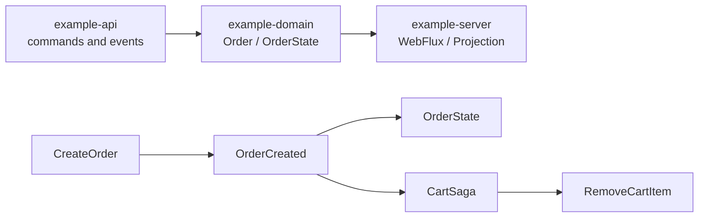
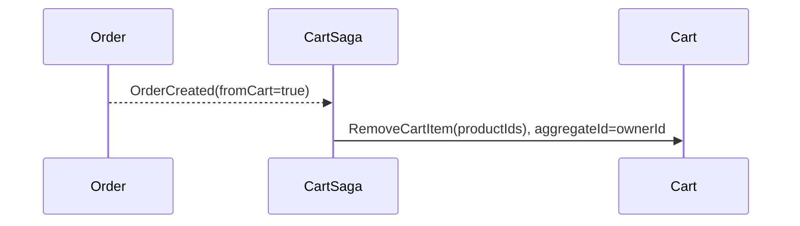

# Kotlin Order and Cart

This page is a traceable reference for the real [`example`](https://github.com/Ahoo-Wang/Wow/tree/main/example), not a second simplified model. Every API contract, domain decision, runtime step, and HTTP result links back to source or tests.

## What You Will Learn


```mermaid
flowchart LR
    API[example-api<br/>commands and events] --> DOMAIN[example-domain<br/>Order / OrderState]
    DOMAIN --> SERVER[example-server<br/>WebFlux / Projection]
    Create[CreateOrder] --> Created[OrderCreated]
    Created --> State[OrderState]
    Created --> CartSaga[CartSaga]
    CartSaga --> Remove[RemoveCartItem]
```

- the `api → domain → server` dependency direction and responsibilities;
- why the command aggregate decides while the state aggregate only sources events;
- how `OrderCreated` drives state, projections, and the cart Saga;
- how to verify HTTP routes from generated OpenAPI instead of bounded-context names;
- evidence for success, validation failure, illegal state, and duplicate payment.

## Module Map

| Module | Responsibility | Exact source |
| --- | --- | --- |
| `example-api` | The `example-service` context, `order`/`cart` aggregates, commands, events, and values | [`ExampleService.kt`](https://github.com/Ahoo-Wang/Wow/blob/main/example/example-api/src/main/kotlin/me/ahoo/wow/example/api/ExampleService.kt#L24-L39), [`CreateOrder.kt`](https://github.com/Ahoo-Wang/Wow/blob/main/example/example-api/src/main/kotlin/me/ahoo/wow/example/api/order/CreateOrder.kt#L25-L65) |
| `example-domain` | Invariants, command handling, sourcing, Sagas, and domain tests | [`Order.kt`](https://github.com/Ahoo-Wang/Wow/blob/main/example/example-domain/src/main/kotlin/me/ahoo/wow/example/domain/order/Order.kt#L49-L197), [`OrderState.kt`](https://github.com/Ahoo-Wang/Wow/blob/main/example/example-domain/src/main/kotlin/me/ahoo/wow/example/domain/order/OrderState.kt#L34-L108) |
| `example-server` | Spring Boot wiring, generated WebFlux routes, projections, and queries | [`ExampleServer.kt`](https://github.com/Ahoo-Wang/Wow/blob/main/example/example-server/src/main/kotlin/me/ahoo/wow/example/server/ExampleServer.kt), [`OrderProjector.kt`](https://github.com/Ahoo-Wang/Wow/blob/main/example/example-server/src/main/kotlin/me/ahoo/wow/example/server/order/OrderProjector.kt) |

## 1. Declare the Context and Aggregates

[`ExampleService`](https://github.com/Ahoo-Wang/Wow/blob/main/example/example-api/src/main/kotlin/me/ahoo/wow/example/api/ExampleService.kt#L24-L39) declares context name `example-service`, alias `example`, and maps order and cart contracts with `packageScopes`. The order implementation adds [`@AggregateRoute(resourceName = "sales-order", spaced = true, owner = ALWAYS)`](https://github.com/Ahoo-Wang/Wow/blob/main/example/example-domain/src/main/kotlin/me/ahoo/wow/example/domain/order/Order.kt#L54-L56).

Both declarations participate in route generation. Neither `example-service` nor `order` alone is enough to infer the URL.

## 2. Separate Intent from Fact

| Command | Domain decision | Event | State change |
| --- | --- | --- | --- |
| `CreateOrder` | Country must be `China`; items must exist; inventory and price specifications must pass | `OrderCreated` | Set items/address/totalAmount and `CREATED` |
| `ChangeAddress` | Allowed only in `CREATED` | `AddressChanged` | Replace address; status unchanged |
| `PayOrder` | Allowed only in `CREATED`; supports partial and excess payment signals | `OrderPaid`, plus `OrderOverPaid` when needed | Add paidAmount; become `PAID` when fully paid |
| `ShipOrder` | Allowed only in `PAID` | `OrderShipped` | `SHIPPED` |
| `ReceiptOrder` | Allowed only in `SHIPPED` | `OrderReceived` | `RECEIVED` |

`CreateOrder` is caller intent; `OrderCreated` is an immutable business fact. Callers never submit the event directly. See the complete [`order` API package](https://github.com/Ahoo-Wang/Wow/tree/main/example/example-api/src/main/kotlin/me/ahoo/wow/example/api/order).

## 3. Keep Business Decisions in the Aggregate

[`Order.onCommand(CreateOrder)`](https://github.com/Ahoo-Wang/Wow/blob/main/example/example-domain/src/main/kotlin/me/ahoo/wow/example/domain/order/Order.kt#L93-L133) runs each item specification, assigns `OrderItem.id`, returns `OrderCreated`, and publishes `totalAmount` in the command result. It never mutates `OrderState` directly.

```text
payable >= amount  -> OrderPaid(amount, fullyPaid)
payable < amount   -> OrderPaid(payable, true), OrderOverPaid(paymentId, excess)
status != CREATED  -> OrderPayDuplicated error event
```

The list order is the publication order. External refund work consumes `OrderOverPaid`; it does not belong inside an aggregate transaction.

## 4. Change State Only Through Events

All mutable properties in [`OrderState`](https://github.com/Ahoo-Wang/Wow/blob/main/example/example-domain/src/main/kotlin/me/ahoo/wow/example/domain/order/OrderState.kt#L34-L108) have private setters. `onSourcing` rebuilds state deterministically:

```text
OrderCreated  -> CREATED, totalAmount = sum(item.totalPrice)
OrderPaid     -> paidAmount += amount; PAID when fully paid
OrderShipped  -> SHIPPED
OrderReceived -> RECEIVED
```

`payable` is derived as `totalAmount - paidAmount`. Sourcing functions do not query a database, call a remote service, or read the clock, so the same event history always yields the same state.

## 5. Connect Aggregates with a Saga

[`CartSaga`](https://github.com/Ahoo-Wang/Wow/blob/main/example/example-domain/src/main/kotlin/me/ahoo/wow/example/domain/cart/CartSaga.kt#L24-L42) emits `RemoveCartItem` only when `OrderCreated.fromCart == true`, using the event owner as the cart aggregate ID:


```mermaid
sequenceDiagram
    participant Order
    participant CartSaga
    participant Cart
    Order-->>CartSaga: OrderCreated(fromCart=true)
    CartSaga->>Cart: RemoveCartItem(productIds), aggregateId=ownerId
```

Saga success proves that the downstream command was sent; it does not make two aggregates an ACID transaction. `@Retry(maxRetries = 5, minBackoff = 60, executionTimeout = 10)` also requires idempotent downstream handling.

## 6. Projections and Event Processors

[`OrderProjector`](https://github.com/Ahoo-Wang/Wow/blob/main/example/example-server/src/main/kotlin/me/ahoo/wow/example/server/order/OrderProjector.kt) shows domain-event and state-event projections. [`OrderEventProcessor`](https://github.com/Ahoo-Wang/Wow/blob/main/example/example-server/src/main/kotlin/me/ahoo/wow/example/server/order/OrderEventProcessor.kt) shows a general subscription. The current handlers mainly log; they demonstrate registration and dispatch, not a production read model.

## 7. Run the Tests

```shell
./gradlew :example-domain:check
```

Gradle should end with `BUILD SUCCESSFUL`. [`OrderSpec`](https://github.com/Ahoo-Wang/Wow/blob/main/example/example-domain/src/test/kotlin/me/ahoo/wow/example/domain/order/OrderSpec.kt#L44-L320) covers create, full/duplicate payment, shipping, receipt, address change, deletion, inventory shortage, and price mismatch. [`OrderTest.should handle over payment`](https://github.com/Ahoo-Wang/Wow/blob/main/example/example-domain/src/test/kotlin/me/ahoo/wow/example/domain/order/tradition/OrderTest.kt#L270-L294) proves the real overpayment branch while the order is still `CREATED`. [`CartSagaSpec`](https://github.com/Ahoo-Wang/Wow/blob/main/example/example-domain/src/test/kotlin/me/ahoo/wow/example/domain/cart/CartSagaSpec.kt#L25-L75) covers both the command and no-command branches.

## 8. Start the Service and Send a Command

The default configuration uses MongoDB. For a local single-process proof, select in-memory storage and disable `PrepareKey`, whose default still requires MongoDB:

```shell
mkdir -p example/example-server/logs
test -e example/example-server/config || \
  ln -s src/main/resources example/example-server/config

SERVER_PORT=8080 \
WOW_EVENTSOURCING_STORE_STORAGE=in_memory \
WOW_EVENTSOURCING_SNAPSHOT_STORAGE=in_memory \
WOW_PREPARE_ENABLED=false \
./gradlew :example-server:run
```

Expect `Netty started on port 8080` and `Started ExampleServerKt`. Current generated OpenAPI maps operation `example.order.create_order` to `POST /tenant/{tenantId}/owner/{ownerId}/sales-order`.

```shell
curl -X POST \
  'http://localhost:8080/tenant/tenant-1/owner/customer-1/sales-order' \
  -H 'Content-Type: application/json' \
  -H 'Wow-Space-Id: store-1' \
  -H 'Command-Aggregate-Id: order-1' \
  -H 'Command-Request-Id: create-order-1' \
  -H 'Command-Wait-Stage: SNAPSHOT' \
  -d '{"items":[{"productId":"product-1","price":10,"quantity":2}],"address":{"country":"China","province":"Shanghai","city":"Shanghai","district":"Pudong","detail":"Road 1"},"fromCart":false}'
```

Expected key result fields:

```json
{
  "succeeded": true,
  "stage": "SNAPSHOT",
  "aggregateId": "order-1",
  "aggregateVersion": 1,
  "result": { "totalAmount": 20 }
}
```

```shell
curl 'http://localhost:8080/tenant/tenant-1/owner/customer-1/sales-order/order-1/state'
```

Expect `status=CREATED`, `totalAmount=20`, `paidAmount=0`, and `payable=20`. In-memory mode loses data when the process exits. Use an isolated MongoDB and the default storage settings to verify restart recovery.

Failure behavior is part of the contract: empty items or a non-China address fail validation; inventory or price failure does not create an aggregate; shipping before `PAID` and receipt before `SHIPPED` fail; payment after deletion returns deleted-aggregate access failure. `OrderSpec` owns these assertions, so controllers do not duplicate them.

::: warning The sample is not a security baseline
Generated routes are technical contracts, not proof of production authentication or authorization. Configure command authorization, tenant/owner/space binding, and fail-closed query tests before deployment.
:::

## Completion Criteria

- trace `CreateOrder` through `OrderCreated`, `OrderState`, projection, and `CartSaga`;
- pass `:example-domain:check`;
- obtain the route from current `/v3/api-docs`, not a context-name guess;
- reach `SNAPSHOT` and read back `CREATED` plus the amounts;
- identify validation, illegal-state, duplicate-payment, and in-memory restart boundaries.
