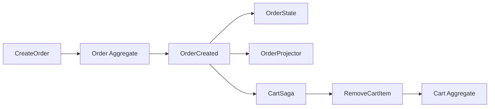

# Kotlin Order and Cart

This walkthrough uses the repository's [`example`](https://github.com/Ahoo-Wang/Wow/tree/main/example) source directly instead of inventing another simplified model. It is for developers who completed Getting Started and are preparing to use Wow for real business behavior.

## What You Will Learn


```mermaid
flowchart LR
    Create[CreateOrder] --> Order[Order Aggregate]
    Order --> Created[OrderCreated]
    Created --> State[OrderState]
    Created --> Projector[OrderProjector]
    Created --> CartSaga[CartSaga]
    CartSaga --> Remove[RemoveCartItem]
    Remove --> Cart[Cart Aggregate]
```

- separate published language, domain decisions, and runtime wiring into `api`, `domain`, and `server`;
- read state and return events from a command aggregate;
- rebuild state deterministically in a state aggregate;
- translate an order event into a cart command with a saga;
- handle read models or external side effects in projections/event processors;
- cover success and rejection with `AggregateSpec` and `SagaSpec`.

## Module Map

| Module | Key source | Responsibility |
| --- | --- | --- |
| `example-api` | [`ExampleService`](https://github.com/Ahoo-Wang/Wow/blob/main/example/example-api/src/main/kotlin/me/ahoo/wow/example/api/ExampleService.kt), [`CreateOrder`](https://github.com/Ahoo-Wang/Wow/blob/main/example/example-api/src/main/kotlin/me/ahoo/wow/example/api/order/CreateOrder.kt) | bounded context, commands, events, and value objects |
| `example-domain` | [`Order`](https://github.com/Ahoo-Wang/Wow/blob/main/example/example-domain/src/main/kotlin/me/ahoo/wow/example/domain/order/Order.kt), [`OrderState`](https://github.com/Ahoo-Wang/Wow/blob/main/example/example-domain/src/main/kotlin/me/ahoo/wow/example/domain/order/OrderState.kt) | invariants, decisions, sourcing, and domain tests |
| `example-server` | [`ExampleServer`](https://github.com/Ahoo-Wang/Wow/blob/main/example/example-server/src/main/kotlin/me/ahoo/wow/example/server/ExampleServer.kt), [`OrderProjector`](https://github.com/Ahoo-Wang/Wow/blob/main/example/example-server/src/main/kotlin/me/ahoo/wow/example/server/order/OrderProjector.kt) | Spring wiring, projection, queries, and runtime configuration |

Keep the dependency direction `api ← domain ← server`. External modules can use command/event contracts without depending on aggregate implementation.

## 1. Declare the Context and Aggregates

`ExampleService` declares the `example-service` context and its `order` and `cart` aggregates. `packageScopes` lets the compiler assign commands and events to the correct aggregate:

```kotlin
@BoundedContext(
    name = "example-service",
    alias = "example",
    aggregates = [
        BoundedContext.Aggregate("order", packageScopes = [CreateOrder::class]),
        BoundedContext.Aggregate("cart", packageScopes = [AddCartItem::class]),
    ],
)
object ExampleService
```

## 2. Separate Intent from Fact

`CreateOrder` is a validated creation command; `OrderCreated` is a business fact that already happened:

```kotlin
@CommandRoute(action = "")
@CreateAggregate
data class CreateOrder(
    val items: List<Item>,
    val address: ShippingAddress,
    val fromCart: Boolean,
) : CommandValidator

data class OrderCreated(
    val orderId: String,
    val items: List<OrderItem>,
    val address: ShippingAddress,
    val fromCart: Boolean,
)
```

Commands use imperative intent; events use past tense. API callers must not submit `OrderCreated` directly.

## 3. Keep Business Decisions in the Aggregate

`Order` reads `OrderState`, validates inventory, pricing, and lifecycle state, then returns events. Creation also uses `CommandResultAccessor` to add `totalAmount` to the command result.

| Command | Precondition | Event/error |
| --- | --- | --- |
| `CreateOrder` | non-empty items; inventory and pricing specifications pass | `OrderCreated` |
| `ChangeAddress` | status is `CREATED` | `AddressChanged` |
| `PayOrder` | order is still payable | `OrderPaid`; overpayment adds `OrderOverPaid` |
| `ShipOrder` | status is `PAID` | `OrderShipped` |
| `ReceiptOrder` | status is `SHIPPED` | `OrderReceived` |

These rules belong in the aggregate, not a controller, projection, or database script.

## 4. Change State Only Through Events

`OrderState` has private setters and applies amount, address, and lifecycle changes through `onSourcing`:

```kotlin
fun onSourcing(orderPaid: OrderPaid) {
    paidAmount = paidAmount.plus(orderPaid.amount)
    if (orderPaid.paid) {
        status = OrderStatus.PAID
    }
}
```

A sourcing function must not query a database, call a remote service, or read the current time. The same event history must always produce the same state.

## 5. Connect Aggregates with a Saga

[`CartSaga`](https://github.com/Ahoo-Wang/Wow/blob/main/example/example-domain/src/main/kotlin/me/ahoo/wow/example/domain/cart/CartSaga.kt) sends `RemoveCartItem` when an order was created from a cart, using the event owner as the cart aggregate ID:

```kotlin
@StatelessSaga
class CartSaga {
    @Retry(maxRetries = 5, minBackoff = 60, executionTimeout = 10)
    fun onOrderCreated(event: DomainEvent<OrderCreated>): CommandBuilder? {
        if (!event.body.fromCart) return null
        return RemoveCartItem(
            event.body.items.map { it.productId }.toSet(),
        ).commandBuilder().aggregateId(event.ownerId)
    }
}
```

Saga completion proves that the source event was handled and a downstream command was sent; it does not turn the flow into an ACID transaction. Retries require `RemoveCartItem` and other side effects to remain idempotent.

## 6. Projections and Event Processors

`OrderProjector` demonstrates `@ProjectionProcessor`, domain-event handlers, and state-event handlers. `OrderEventProcessor` demonstrates a general event subscription. Their sample implementations mostly log data to demonstrate registration and dispatch; they are not production read models.

Use idempotent business keys in real handlers and verify failure paths with [Projection](../../guide/projection.md), [Event Compensation](../../guide/event-compensation.md), and [Observability](../../guide/advanced/observability.md).

## 7. Run the Tests

Start with the domain loop that needs no external infrastructure:

```shell
./gradlew :example-domain:test
./gradlew :example-domain:jacocoTestCoverageVerification
```

[`OrderSpec`](https://github.com/Ahoo-Wang/Wow/blob/main/example/example-domain/src/test/kotlin/me/ahoo/wow/example/domain/order/OrderSpec.kt) covers create, pay, ship, receive, duplicate payment, address change, deletion, and illegal states. [`CartSagaSpec`](https://github.com/Ahoo-Wang/Wow/blob/main/example/example-domain/src/test/kotlin/me/ahoo/wow/example/domain/cart/CartSagaSpec.kt) covers branches that do and do not emit a cart command.

## 8. Start the Service and Send a Command

`example-server` uses MongoDB EventStore/SnapshotStore by default. Provide an isolated local MongoDB and inject its connection through `SPRING_MONGODB_URI`; never reuse example credentials in shared or production environments.

```shell
mkdir -p example/example-server/logs
test -e example/example-server/config || ln -s src/main/resources example/example-server/config
SPRING_MONGODB_URI='<mongodb-uri>' ./gradlew :example-server:run
```

Open [Swagger UI](http://localhost:8080/swagger-ui.html) and find the `sales-order` creation route. The aggregate requires tenant, owner, and space:

```shell
curl -X POST \
  'http://localhost:8080/tenant/tenant-1/owner/customer-1/sales-order' \
  -H 'Content-Type: application/json' \
  -H 'Wow-Space-Id: store-1' \
  -H 'Command-Aggregate-Id: order-1' \
  -H 'Command-Request-Id: create-order-1' \
  -H 'Command-Wait-Stage: SNAPSHOT' \
  -d '{"items":[{"productId":"product-1","price":10,"quantity":2}],"address":{"country":"China","province":"Shanghai","city":"Shanghai","district":"Pudong","detail":"Road 1"},"fromCart":true}'
```

Check `succeeded`, `stage`, `aggregateId`, and `aggregateVersion`, then read state through a snapshot route in Swagger or the sample `/order/{tenantId}/{orderId}` query.

::: warning The sample is not a security baseline
The sample controller and local configuration demonstrate framework capabilities. Before using them in a business system, configure authentication, command authorization, scope binding, and fail-closed query tests from [Data Access Control](../../guide/data-access.md#required-security-closure).
:::

## Completion Criteria

- you can explain the `api`, `domain`, and `server` dependency direction;
- you can trace a command through event, state, projection, and saga;
- `OrderSpec` and `CartSagaSpec` pass;
- a real HTTP command reaches `SNAPSHOT` and state can be read back;
- state remains recoverable from MongoDB after restart;
- duplicate `requestId`, illegal state, and unauthorized requests all have negative evidence.
