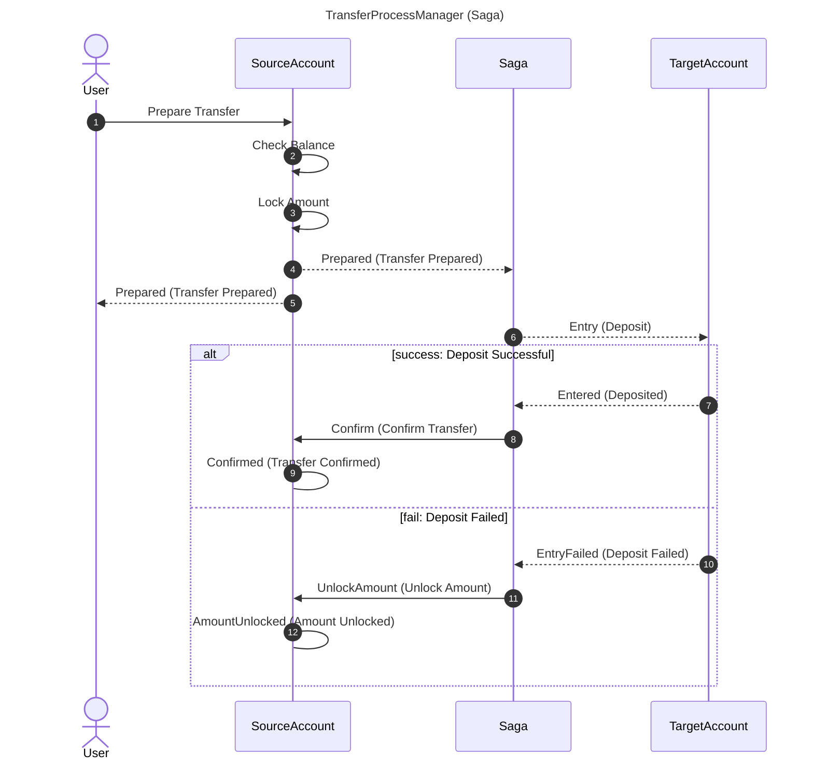
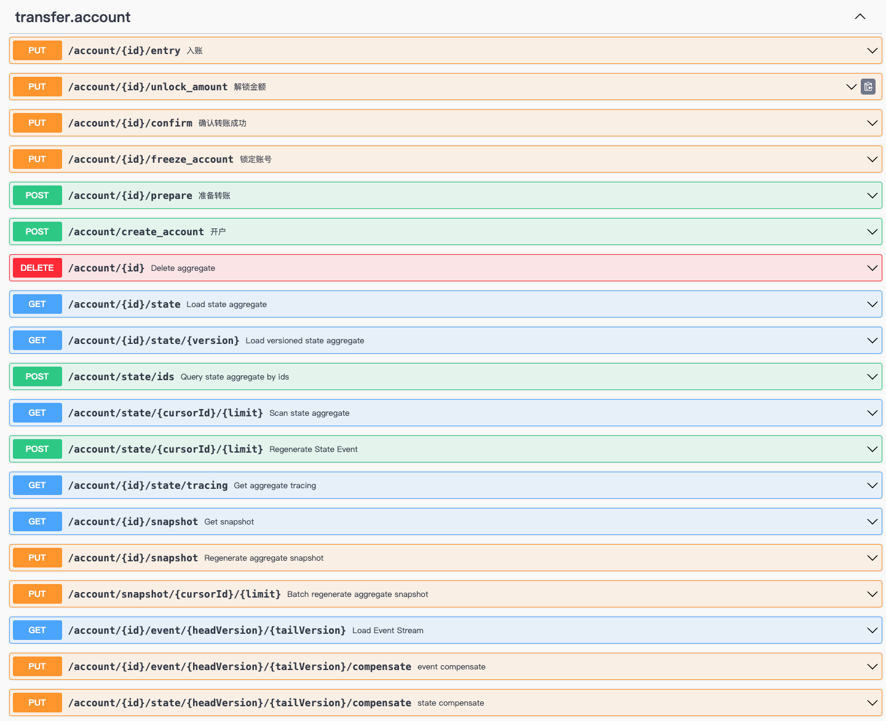
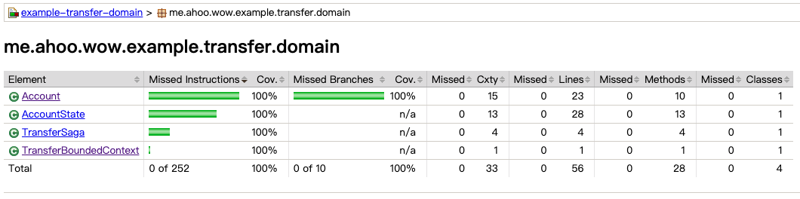

# Bank Account Transfer (JAVA)

The _[Bank Account Transfer Example](https://github.com/Ahoo-Wang/Wow/blob/main/example/transfer/)_ is a classic Domain-Driven Design (DDD) application scenario. Next, we will learn how to use Wow for domain-driven design and service development through a simple bank account transfer case.

## Bank Transfer Process

1. Prepare Transfer: User initiates transfer request, triggering the Prepare step. This step sends a prepare transfer request to the source account.
2. Check Balance: After receiving the prepare transfer request, the source account performs balance checking to ensure sufficient funds for transfer.
3. Lock Amount: If balance is sufficient, the source account locks the transfer amount to prevent interference from other operations.
4. Entry: Next, the transfer process enters the target account and performs the entry operation.
5. Confirm Transfer: If entry succeeds, confirm the transfer; otherwise, execute unlock amount operation.
    1. Success Path: If everything goes smoothly, complete the transfer process.
    2. Failure Path: If entry fails, execute unlock amount operation and handle failure situations.

<center>



</center>


## Run Example

- Run [TransferExampleServer.java](https://github.com/Ahoo-Wang/Wow/blob/main/example/transfer/example-transfer-server/src/main/java/me/ahoo/wow/example/transfer/server/TransferExampleServer.java)
- View Swagger-UI: [http://localhost:8080/swagger-ui.html](http://localhost:8080/swagger-ui.html)
- Execute API tests: [Transfer.http](https://github.com/Ahoo-Wang/Wow/blob/main/example/transfer/Transfer.http)

## Auto-Generated API Endpoints

> After running, access Swagger-UI: [http://localhost:8080/swagger-ui.html](http://localhost:8080/swagger-ui.html).
> This RESTful API endpoint is automatically generated by Wow, no manual writing required.



## Module Division

| Module                   | Description                                                                                  |
|--------------------------|----------------------------------------------------------------------------------------------|
| example-transfer-api     | API layer, defines aggregate commands (Command), domain events (Domain Event), and query view models (Query View Model). This module acts as the "published language" for communication between modules. |
| example-transfer-domain  | Domain layer, contains aggregate root and business constraint implementations. Aggregate root: Entry point for domain model, responsible for coordinating domain object operations. Business constraints: Include validation rules, domain event processing, etc. |
| example-transfer-server  | Host service, application startup point. Responsible for integrating other modules and providing application entry point. Involves configuring dependencies, connecting to databases, starting API services. |

## Domain Modeling

The separation design of state aggregate root (`AccountState`) and command aggregate root (`Account`) ensures that the state aggregate root's state is not modified during command execution.

### State Aggregate Root (`AccountState`) Modeling

```java
public class AccountState implements Identifier {
    private final String id;
    private String name;
    /**
     * 余额
     */
    private long balanceAmount = 0L;
    /**
     * 已锁定金额
     */
    private long lockedAmount = 0L;
    /**
     * 账号已冻结标记
     */
    private boolean frozen = false;

    @JsonCreator
    public AccountState(@JsonProperty("id") String id) {
        this.id = id;
    }

    @NotNull
    @Override
    public String getId() {
        return id;
    }

    public String getName() {
        return name;
    }

    public long getBalanceAmount() {
        return balanceAmount;
    }

    public long getLockedAmount() {
        return lockedAmount;
    }

    public boolean isFrozen() {
        return frozen;
    }

    void onSourcing(AccountCreated accountCreated) {
        this.name = accountCreated.name();
        this.balanceAmount = accountCreated.balance();
    }

    void onSourcing(AmountLocked amountLocked) {
        balanceAmount = balanceAmount - amountLocked.amount();
        lockedAmount = lockedAmount + amountLocked.amount();
    }

    void onSourcing(AmountEntered amountEntered) {
        balanceAmount = balanceAmount + amountEntered.amount();
    }

    void onSourcing(Confirmed confirmed) {
        lockedAmount = lockedAmount - confirmed.amount();
    }

    void onSourcing(AmountUnlocked amountUnlocked) {
        lockedAmount = lockedAmount - amountUnlocked.amount();
        balanceAmount = balanceAmount + amountUnlocked.amount();
    }

    void onSourcing(AccountFrozen accountFrozen) {
        this.frozen = true;
    }

}
```

### Command Aggregate Root (`Account`) Modeling

```java
@StaticTenantId
@AggregateRoot
public class Account {
    private final AccountState state;

    public Account(AccountState state) {
        this.state = state;
    }

    AccountCreated onCommand(CreateAccount createAccount) {
        return new AccountCreated(createAccount.name(), createAccount.balance());
    }

    @OnCommand(returns = {AmountLocked.class, Prepared.class})
    List<?> onCommand(Prepare prepare) {
        checkBalance(prepare.amount());
        return List.of(new AmountLocked(prepare.amount()), new Prepared(prepare.to(), prepare.amount()));
    }

    private void checkBalance(long amount) {
        if (state.isFrozen()) {
            throw new IllegalStateException("账号已冻结无法转账.");
        }
        if (state.getBalanceAmount() < amount) {
            throw new IllegalStateException("账号余额不足.");
        }
    }

    Object onCommand(Entry entry) {
        if (state.isFrozen()) {
            return new EntryFailed(entry.sourceId(), entry.amount());
        }
        return new AmountEntered(entry.sourceId(), entry.amount());
    }

    Confirmed onCommand(Confirm confirm) {
        return new Confirmed(confirm.amount());
    }

    AmountUnlocked onCommand(UnlockAmount unlockAmount) {
        return new AmountUnlocked(unlockAmount.amount());
    }

    AccountFrozen onCommand(FreezeAccount freezeAccount) {
        return new AccountFrozen(freezeAccount.reason());
    }
}
```

### Transfer Process Manager (`TransferSaga`)

The transfer process manager (`TransferSaga`) is responsible for coordinating transfer events and generating corresponding commands.

- `onEvent(Prepared)`: Subscribes to transfer prepared event (`Prepared`) and generates entry command (`Entry`).
- `onEvent(AmountEntered)`: Subscribes to transfer amount entered event (`AmountEntered`) and generates confirm transfer command (`Confirm`).
- `onEvent(EntryFailed)`: Subscribes to transfer entry failed event (`EntryFailed`) and generates unlock amount command (`UnlockAmount`).

```java
@StatelessSaga
public class TransferSaga {

    Entry onEvent(Prepared prepared, AggregateId aggregateId) {
        return new Entry(prepared.to(), aggregateId.getId(), prepared.amount());
    }

    Confirm onEvent(AmountEntered amountEntered) {
        return new Confirm(amountEntered.sourceId(), amountEntered.amount());
    }

    UnlockAmount onEvent(EntryFailed entryFailed) {
        return new UnlockAmount(entryFailed.sourceId(), entryFailed.amount());
    }
}
```

### Unit Testing

With the Wow unit testing suite, you can easily write unit tests for aggregate roots and Sagas. This improves code coverage and ensures code quality.



> Using `AggregateSpec` for aggregate root unit testing can effectively reduce the workload of writing unit tests.

> `Account` Aggregate Root Unit Test

```kotlin
class AccountSpec : AggregateSpec<Account, AccountState>({

   on {
      val createAccount = CreateAccount("name", 100)
      whenCommand(createAccount) {
         expectEventType(AccountCreated::class)
         expectState {
            name.assert().isEqualTo(createAccount.name)
            balanceAmount.assert().isEqualTo(createAccount.balance)
         }
         fork {
            val prepare = Prepare("to", 100)
            whenCommand(prepare) {
               expectEventType(AmountLocked::class, Prepared::class)
               expectState {
                  balanceAmount.assert().isEqualTo(createAccount.balance - prepare.amount)
               }
            }
         }
         fork {
            givenEvent(AccountFrozen("")) {
               whenCommand(Prepare("to", 100)) {
                  expectError<IllegalStateException> {
                     assertThat(this).hasMessage("账号已冻结无法转账.")
                  }
                  expectState {
                     name.assert().isEqualTo(createAccount.name)
                     balanceAmount.assert().isEqualTo(createAccount.balance)
                     isFrozen.assert().isTrue()
                  }
               }
               val entry = Entry(stateRoot.id, "sourceId", 100)
               whenCommand(entry) {
                  expectEventType(EntryFailed::class)
                  expectState {
                     balanceAmount.assert().isEqualTo(100)
                     isFrozen.assert().isTrue()
                  }
               }
            }
         }
         fork {
            val prepare = Prepare("to", createAccount.balance + 1)
            whenCommand(prepare) {
               expectError<IllegalStateException> {
                  this.assert().hasMessage("账号余额不足.")
               }
               expectState {
                  name.assert().isEqualTo(createAccount.name)
                  balanceAmount.assert().isEqualTo(createAccount.balance)
               }
            }
         }
         fork {
            val entry = Entry(stateRoot.id, "sourceId", 100)
            whenCommand(entry) {
               expectEventType(AmountEntered::class)
               expectState {
                  balanceAmount.assert().isEqualTo(200)
               }
            }
         }
      }
   }
})
```

> Using `SagaSpec` for Saga unit testing can effectively reduce the workload of writing unit tests.

> `TransferSaga` Unit Test

```kotlin
class TransferSagaSpec : SagaSpec<TransferSaga>({
   on {
      val prepared = Prepared("to", 1)
      whenEvent(prepared) {
         expectNoError()
         expectCommandType(Entry::class)
         expectCommandBody<Entry> {
            id.assert().isEqualTo(prepared.to)
            amount.assert().isEqualTo(prepared.amount)
         }
      }
   }
   on {
      val amountEntered = AmountEntered("sourceId", 1)
      whenEvent(amountEntered) {
         expectNoError()
         expectCommandType(Confirm::class)
         expectCommandBody<Confirm> {
            id.assert().isEqualTo(amountEntered.sourceId)
            amount.assert().isEqualTo(amountEntered.amount)
         }
      }
   }
   on {
      val entryFailed = EntryFailed("sourceId", 1)
      whenEvent(entryFailed) {
         expectCommandType(UnlockAmount::class)
         expectCommandBody<UnlockAmount> {
            id.assert().isEqualTo(entryFailed.sourceId)
            amount.assert().isEqualTo(entryFailed.amount)
         }
      }
   }
})
```