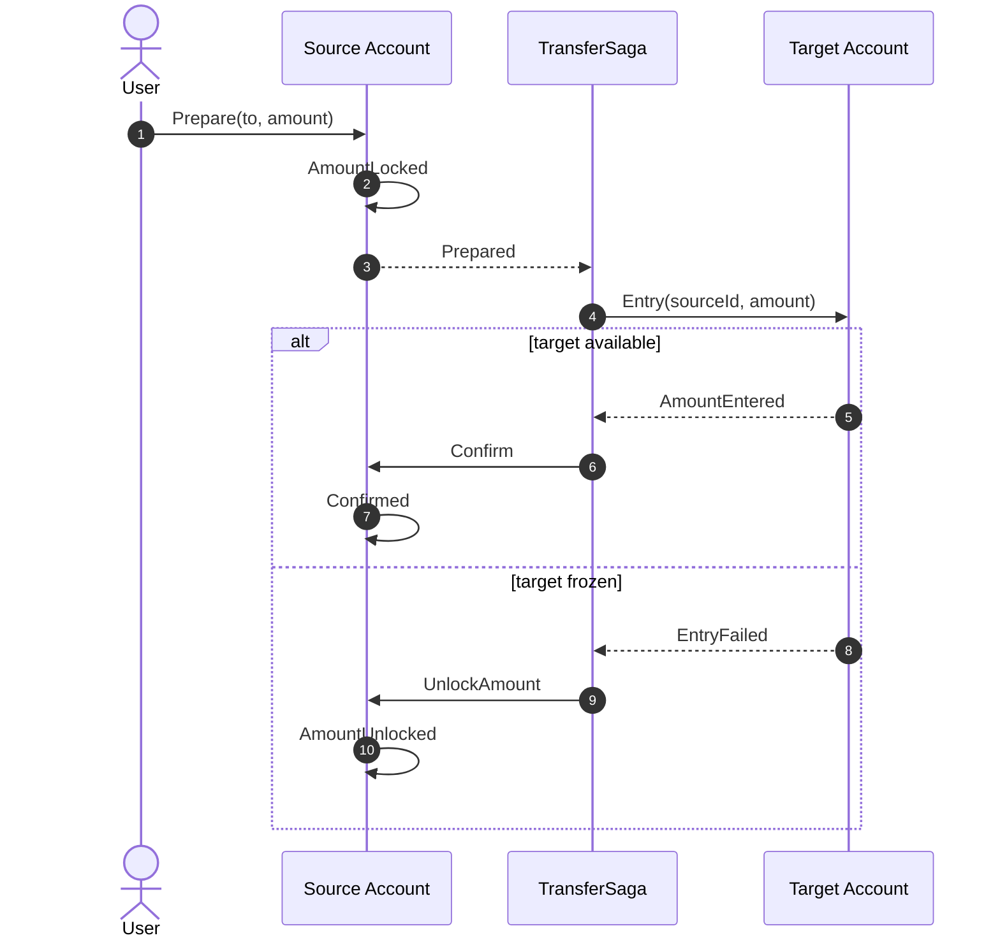
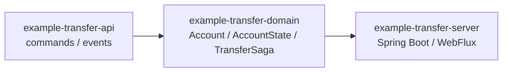

# Bank Account Transfer (JAVA)

[`example/transfer`](https://github.com/Ahoo-Wang/Wow/tree/main/example/transfer) implements the account aggregate in Java and coordinates cross-account transfer with a Wow stateless Saga. This page describes only behavior proven by current source, tests, and runtime OpenAPI.

## Bank Transfer Process


```mermaid
sequenceDiagram
    autonumber
    actor User
    participant Source as Source Account
    participant Saga as TransferSaga
    participant Target as Target Account
    User->>Source: Prepare(to, amount)
    Source->>Source: AmountLocked
    Source-->>Saga: Prepared
    Saga->>Target: Entry(sourceId, amount)
    alt target available
        Target-->>Saga: AmountEntered
        Saga->>Source: Confirm
        Source->>Source: Confirmed
    else target frozen
        Target-->>Saga: EntryFailed
        Saga->>Source: UnlockAmount
        Source->>Source: AmountUnlocked
    end
```

On success, the source available balance decreases, its locked amount returns to zero, and the target balance increases. If the target is frozen, the Saga returns the locked amount to the source. This is event-driven compensation, not a cross-aggregate database transaction.

## Run Example


```mermaid
flowchart LR
    API[example-transfer-api<br/>commands / events] --> DOMAIN[example-transfer-domain<br/>Account / AccountState / TransferSaga]
    DOMAIN --> SERVER[example-transfer-server<br/>Spring Boot / WebFlux]
```

Start with the infrastructure-free domain check:

```shell
./gradlew :example-transfer-domain:check
```

Expect `BUILD SUCCESSFUL`.

The current [`example-transfer-server` application mainClass](https://github.com/Ahoo-Wang/Wow/blob/main/example/transfer/example-transfer-server/build.gradle.kts#L34-L54) names a missing `ExampleServer`, so `./gradlew :example-transfer-server:run` currently fails with `ClassNotFoundException`. This documentation task does not change Gradle. Start the same distribution with the real [`TransferExampleServer`](https://github.com/Ahoo-Wang/Wow/blob/main/example/transfer/example-transfer-server/src/main/java/me/ahoo/wow/example/transfer/server/TransferExampleServer.java#L23-L30):

```shell
mkdir -p example/transfer/example-transfer-server/logs
./gradlew :example-transfer-server:installDist

java \
  -Dserver.port=8080 \
  -Dspring.config.location=file:example/transfer/example-transfer-server/src/main/resources/application.yaml \
  -cp 'example/transfer/example-transfer-server/build/install/example-transfer-server/lib/*' \
  me.ahoo.wow.example.transfer.server.TransferExampleServer
```

Expect `Netty started on port 8080` and `Started TransferExampleServer`. The sample uses in-memory command/event buses, EventStore, and SnapshotStore, so account data disappears when the process exits.

## Auto-Generated API Endpoints

Current runtime `/v3/api-docs` exposes:

| Operation | Method and path | operationId |
| --- | --- | --- |
| Create account | `POST /account/create_account` | `transfer.account.create_account` |
| Prepare transfer | `POST /account/{id}/prepare` | `transfer.account.prepare` |
| Read state | `GET /account/{id}/state` | Generated state route |

These routes also match [`Transfer.http`](https://github.com/Ahoo-Wang/Wow/blob/main/example/transfer/Transfer.http#L1-L77). They are not inferred from the `transfer-service` name.

```shell
curl -X POST http://localhost:8080/account/create_account \
  -H 'Content-Type: application/json' \
  -H 'Command-Wait-Stage: PROCESSED' \
  -H 'Command-Aggregate-Id: sourceId' \
  -H 'Command-Request-Id: source-create-1' \
  -d '{"name":"source","balance":100}'

curl -X POST http://localhost:8080/account/create_account \
  -H 'Content-Type: application/json' \
  -H 'Command-Wait-Stage: PROCESSED' \
  -H 'Command-Aggregate-Id: targetId' \
  -H 'Command-Request-Id: target-create-1' \
  -d '{"name":"target","balance":0}'

curl -X POST http://localhost:8080/account/sourceId/prepare \
  -H 'Content-Type: application/json' \
  -H 'Command-Wait-Stage: PROCESSED' \
  -H 'Command-Request-Id: transfer-1' \
  -d '{"to":"targetId","amount":10}'
```

All three commands should return `succeeded=true` and `stage=PROCESSED`. The transfer result reports source aggregate version `2`. After the Saga completes:

```shell
curl http://localhost:8080/account/sourceId/state
curl http://localhost:8080/account/targetId/state
```

Expect source `balanceAmount=90, lockedAmount=0` and target `balanceAmount=10`.

## Module Division

| Module | Responsibility | Exact source |
| --- | --- | --- |
| `example-transfer-api` | Account commands, events, and published language | [`TransferService.java`](https://github.com/Ahoo-Wang/Wow/blob/main/example/transfer/example-transfer-api/src/main/java/me/ahoo/wow/example/transfer/TransferService.java), [`api` package](https://github.com/Ahoo-Wang/Wow/tree/main/example/transfer/example-transfer-api/src/main/java/me/ahoo/wow/example/transfer/api) |
| `example-transfer-domain` | Account decisions, event sourcing, Saga, and tests | [`Account.java`](https://github.com/Ahoo-Wang/Wow/blob/main/example/transfer/example-transfer-domain/src/main/java/me/ahoo/wow/example/transfer/domain/Account.java#L24-L82), [`TransferSaga.java`](https://github.com/Ahoo-Wang/Wow/blob/main/example/transfer/example-transfer-domain/src/main/java/me/ahoo/wow/example/transfer/domain/TransferSaga.java#L20-L33) |
| `example-transfer-server` | Spring Boot entry point and WebFlux/OpenAPI wiring | [`TransferExampleServer.java`](https://github.com/Ahoo-Wang/Wow/blob/main/example/transfer/example-transfer-server/src/main/java/me/ahoo/wow/example/transfer/server/TransferExampleServer.java#L23-L30), [`application.yaml`](https://github.com/Ahoo-Wang/Wow/blob/main/example/transfer/example-transfer-server/src/main/resources/application.yaml) |

## Domain Modeling

The minimal domain decision is: lock the source first, enter the target second, then confirm or unlock.

| Command | Event | State result |
| --- | --- | --- |
| `CreateAccount` | `AccountCreated` | Initialize name and balanceAmount |
| `Prepare` | `AmountLocked`, `Prepared` | Decrease available balance and increase lockedAmount |
| `Entry` | `AmountEntered` or `EntryFailed` | Increase target balance, or leave target unchanged |
| `Confirm` | `Confirmed` | Decrease source lockedAmount |
| `UnlockAmount` | `AmountUnlocked` | Return lockedAmount to balanceAmount |
| `FreezeAccount` / `UnfreezeAccount` | `AccountFrozen` / `AccountUnfrozen` | Toggle frozen |

### State Aggregate Root (`AccountState`) Modeling

[`AccountState`](https://github.com/Ahoo-Wang/Wow/blob/main/example/transfer/example-transfer-domain/src/main/java/me/ahoo/wow/example/transfer/domain/AccountState.java#L24-L89) changes `balanceAmount`, `lockedAmount`, and `frozen` only in `onSourcing`. `AmountLocked` moves money from available to locked; `Confirmed` removes locked money; `AmountUnlocked` removes locked money and restores available money.

### Command Aggregate Root (`Account`) Modeling

[`Account`](https://github.com/Ahoo-Wang/Wow/blob/main/example/transfer/example-transfer-domain/src/main/java/me/ahoo/wow/example/transfer/domain/Account.java#L24-L82) never mutates state directly. `Prepare` rejects a frozen source or insufficient balance before returning `AmountLocked`, then `Prepared`. `Entry` returns the `ErrorInfo` event `EntryFailed` for a frozen target, selecting the Saga's unlock branch.

### Transfer Process Manager (`TransferSaga`)

[`TransferSaga`](https://github.com/Ahoo-Wang/Wow/blob/main/example/transfer/example-transfer-domain/src/main/java/me/ahoo/wow/example/transfer/domain/TransferSaga.java#L20-L33) has only three mappings:

```text
Prepared      -> Entry(targetId, sourceId, amount)
AmountEntered -> Confirm(sourceId, amount)
EntryFailed   -> UnlockAmount(sourceId, amount)
```

There is no extra process state. The event history and two account states are the audit evidence.

### Unit Testing

[`AccountSpec`](https://github.com/Ahoo-Wang/Wow/blob/main/example/transfer/example-transfer-domain/src/test/kotlin/me/ahoo/wow/example/transfer/domain/AccountSpec.kt#L26-L92) verifies creation, locking, entry, frozen rejection, and insufficient balance. [`TransferSagaSpec`](https://github.com/Ahoo-Wang/Wow/blob/main/example/transfer/example-transfer-domain/src/test/kotlin/me/ahoo/wow/example/transfer/domain/TransferSagaSpec.kt#L25-L57) verifies all three event-to-command mappings.

Failure behavior is part of the contract: `Prepare` throws `IllegalStateException` and preserves balance for a frozen source or insufficient funds; a frozen target emits `EntryFailed`, then unlocks the source; repeated freeze/unfreeze is rejected. HTTP `succeeded=false` and `errorMsg` should match these test assertions.
