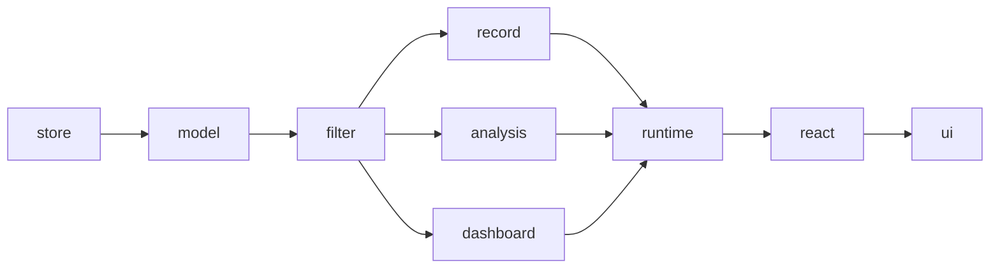

# wow-view-engine reference

::: warning Not released
`@ahoo-wang/wow-view-engine` has not been published to npm and carries no compatibility promise. This page records the entries and contracts as they stand; the [design documents](https://github.com/Ahoo-Wang/Wow/tree/main/typescript/wow-view-engine/docs/design) are the source of truth until the first release. A per-symbol reference and a complete symbol index are added when the package is released.
:::

For what the engine does and a walkthrough of the target usage, read the [View Engine guide](../../../guide/typescript/view-engine.md).

## Entries

| Entry | Exports |
|---|---|
| `@ahoo-wang/wow-view-engine` | Model types, pure kernels (`validate*`, `compile*`, `project*`), runtime, the `ViewStore` port, `MemoryViewStore` |
| `/react` | `useViewEngine`, `useOpenView`, `useViewRuntime`, `useViewList`, `useViewManager`, `useWorkbench`, `useLeaveGuard`, `useFilterEditor`, `useRecordTable`, `useAnalysisEditor`, `useAnalysisResult`, `useDashboard`, `useSaveCommands`, `RecordActionSlots` |
| `/ui` | Workbenches (`DataWorkbench`, `DashboardWorkbench`), embeds (`EmbeddedView`, `EmbeddedDashboard`), view management (`ViewHeader`, `SaveActions`, `ViewManager`, `LeaveDialog`), editing and results (`FilterPanel`, `RecordTable`, `RecordCards`, `RecordPagination`, `AnalysisTable`, `AnalysisChart`, `DashboardGrid`), content panels, and `MessagesProvider` |
| `/styles.css` | The theme. Import it explicitly; no JavaScript entry imports CSS |
| `/themes.css` | Optional presets, selected by `data-fve-preset` |
| `/themes/<name>.css` | One optional preset alone |
| `/shadcn-bridge.css` | Optional: a host's shadcn tokens read into the view's variables, except `input`, `ring`, the status and the chart colours |

The root entry has no React or DOM dependency. `react` and `react-dom` are peer dependencies needed only by `/react` and `/ui`.

## Concepts

| Type | Role | Lives in |
|---|---|---|
| `ViewDefinition` | Fields, kinds, operators, and record and analysis capabilities. Declared or generated, never edited at runtime | Code |
| `ViewConfig` | A `RecordViewConfig`, `AnalysisViewConfig`, or `DashboardViewConfig`. A shared `FilterTree` describes scope and stores intent such as "last 7 days", not compiled values | Data |
| `ViewInstance` | A saved `ViewConfig` plus id, title, scope (`system`, `shared`, or `personal`), and an opaque `revision` | Store |
| `ViewRuntime` | One open view: draft, applied config, result, status, and selection, exposed through `subscribe` and `getSnapshot` | Memory |
| `ViewEngine` | Registry of definitions, the store, and open runtimes; the entry point for open, save, and list commands | Memory |
| `ViewStore` | The persistence port a backend implements | Application |
| `FieldKind` | Operators, validation, compilation to `FilterExpression`, and the editor descriptor of one field type | Registry |

Built-in field kinds: `string`, `number`, `boolean`, `date`, `datetime`, `enum`, `reference`, `array`, `elementMatch`, `search`, and the kinds backed by Wow's metadata filters: `documentId`, `aggregateId`, `tenantId`, `ownerId`, `spaceId`, and `deletion`.

## Persistence {#persistence}

`ViewStore` is the only port a backend must satisfy:

```ts
interface ViewStore {
  list(definitionId: string, signal?: AbortSignal): Promise<ViewInstanceSummary[]>;
  get(id: string, signal?: AbortSignal): Promise<ViewInstance>;
  create(input: Omit<ViewInstance, 'id' | 'revision'>, ctx: WriteContext): Promise<ViewInstance>;
  save(id: string, config: ViewConfig, revision: string, ctx: WriteContext): Promise<ViewInstance>;
  rename(id: string, title: string, revision: string, ctx: WriteContext): Promise<ViewInstance>;
  delete(id: string, revision: string, ctx: WriteContext): Promise<void>;
  getPreferences(definitionId: string, signal?: AbortSignal): Promise<ViewPreferences>;
  setPreferences(definitionId: string, prefs: ViewPreferences, ctx: WriteContext): Promise<ViewPreferences>;
  permissions?(definitionId: string): ViewPermissions;
}
```

| Rule | Behavior |
|---|---|
| Optimistic revision | Writes carry the expected `revision`; a mismatch throws `ViewStoreError` with code `CONFLICT`, and the UI offers reload, overwrite, or save as |
| Idempotent `requestId` | Each logical write gets one `requestId` in `WriteContext`; a retry after a timeout reuses it and the server deduplicates |
| Permissions | `permissions` only drives button availability. Authorization, visibility filtering, and deduplication are server responsibilities |

`MemoryViewStore` is for tests, examples, and query-only use. A Wow-backed `ViewStore` service and its TypeScript adapter are planned as a separate package.

## Layering



Architecture tests enforce the dependency rules: `model` imports nothing; `filter` imports only `model`; `record`, `analysis`, and `dashboard` import only `model` and `filter`; `runtime` never imports `react` or `ui`; `store` imports only `model`; `react` never imports `ui`. Only the non-deprecated `FilterExpression` APIs of `wow-client` are used.

## Extension points

| Axis | Mechanism |
|---|---|
| Field type | Register a `FieldKind`: operators, validation, `compile` to `FilterExpression`, and an editor descriptor that names one of the built-in value inputs |
| Data source | `resolveSource(key)` returns a `wow-client` query client |
| Persistence | Implement `ViewStore` |
| Actions | Pass `global`, `bulk`, and `row` action render functions to a workbench; they are code and are never saved |
| Appearance | CSS variables, presets and the shadcn bridge (see [Theming the View Engine](../../../guide/typescript/view-engine-theming.md)); replace components by composing the `/react` hooks |
| Wording | `defaultMessages` (English) and `zhCN` catalogues, merged through the `messages` prop or `MessagesProvider` |

## Source

[typescript/wow-view-engine](https://github.com/Ahoo-Wang/Wow/tree/main/typescript/wow-view-engine) · [README](https://github.com/Ahoo-Wang/Wow/blob/main/typescript/wow-view-engine/README.md) · [Design documents](https://github.com/Ahoo-Wang/Wow/tree/main/typescript/wow-view-engine/docs/design) · [Storybook](/storybook/?path=/docs/view-engine-首页--docs)
