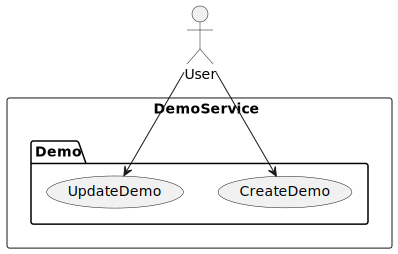

# 最佳实践

## 架构最佳实践

### 推荐技术栈组合

#### 生产环境推荐配置

- **MongoDB**: 作为事件存储（EventStore）、快照存储（SnapshotRepository）
  - **伸缩性**: MongoDB 的自动分片特性极大地降低了系统的伸缩成本
  - **读模型**: 将快照策略设置为 `all`，可以直接将 MongoDB 存储的快照作为读模型使用，无需额外编写投影处理器
  - **等待策略**: 结合 `SNAPSHOT` 等待策略，实现请求的同步等待
  - **适用场景**: 大多数业务场景，除了一些特殊查询需求（如商品搜索引擎）

- **Kafka**: 作为消息引擎，包括 `CommandBus`、`DomainEventBus`、`StateEventBus`
  - **可靠性**: 保证消息的持久化和顺序性
  - **扩展性**: 支持水平扩展和分区
  - **生态系统**: 丰富的生态系统和工具支持

- **Redis**: 作为缓存层和会话存储（可选）
  - **性能**: 高速读写性能
  - **数据结构**: 丰富的数据结构支持复杂缓存场景

#### 开发环境简化配置

- **In-Memory**: 适用于本地开发和单元测试
- **单节点数据库**: 简化部署和维护

#### 聚合边界识别

- **业务不变性**: 聚合内部保持强一致性
- **事务边界**: 聚合修改在单个事务中完成
- **并发控制**: 通过聚合版本控制并发冲突
- **依赖关系**: 聚合间通过领域事件解耦

### 事件建模最佳实践

#### 事件命名规范

```kotlin
// 推荐：过去时 + 具体业务行为
data class OrderCreated(val orderId: String, val items: List<OrderItem>)
data class OrderPaid(val orderId: String, val amount: BigDecimal)
data class OrderShipped(val orderId: String, val trackingNumber: String)

// 避免：模糊命名
data class OrderUpdated(val orderId: String) // ❌ 过于宽泛
data class OrderChange(val orderId: String)  // ❌ 不够具体
```

#### 事件版本控制

```kotlin
@Event(revision = "1.0")
data class OrderCreated(val orderId: String, val items: List<OrderItem>)

@Event(revision = "2.0")
data class OrderCreated(
    val orderId: String,
    val items: List<OrderItem>,
    val customerId: String // 新增字段
)
```

### 投影设计模式

#### 按查询职责分组

```kotlin
// 订单列表投影
@ProjectionProcessor
class OrderListProjection {
    @OnEvent
    fun onOrderCreated(event: OrderCreated) {
        // 更新订单列表查询模型
    }
}

// 订单详情投影
@ProjectionProcessor
class OrderDetailProjection {
    @OnEvent
    fun onOrderPaid(event: OrderPaid) {
        // 更新订单详情查询模型
    }
}
```

#### 异步投影处理

```kotlin
@ProjectionProcessor
class EmailNotificationProjection {

    @OnEvent
    @Blocking // 标记为阻塞操作
    fun onOrderShipped(event: OrderShipped) {
        // 发送邮件通知（IO密集型操作）
        emailService.sendShippingNotification(event.orderId)
    }
}
```

### Saga 模式应用

#### 流程编排 vs 流程编舞

```kotlin
// 推荐：流程编排（Orchestration）
@StatelessSaga
class OrderProcessingSaga {

    @OnEvent
    fun onOrderCreated(event: OrderCreated): ReserveInventory {
        return ReserveInventory(event.orderId, event.items)
    }

    @OnEvent
    fun onInventoryReserved(event: InventoryReserved): ProcessPayment {
        return ProcessPayment(event.orderId, event.totalAmount)
    }
}

// 避免：流程编舞（Choreography）可能导致复杂依赖
// 各服务直接通过事件耦合
```

#### 补偿机制

```kotlin
@StatelessSaga
class OrderCancellationSaga {

    @OnEvent
    @Retry(maxRetries = 3)
    fun onOrderCancelled(event: OrderCancelled): RefundPayment {
        return RefundPayment(event.orderId, event.paymentId)
    }

    @OnEvent
    fun onPaymentRefunded(event: PaymentRefunded): ReleaseInventory {
        return ReleaseInventory(event.orderId)
    }
}
```

## 开发最佳实践

### 测试策略

#### 单元测试覆盖

```kotlin
// 聚合测试：验证业务逻辑
class OrderSpec : AggregateSpec<Order, OrderState> {
    // Given-When-Expect 模式
}

// Saga 测试：验证流程编排
class OrderSagaSpec : SagaSpec<OrderProcessingSaga> {
    // 验证事件-命令映射
}

// 投影测试：验证查询模型更新
class OrderProjectionSpec : ProjectionSpec<OrderProjection> {
    // 验证事件处理结果
}
```

#### 测试覆盖率目标

- **聚合根**: ≥ 85%
- **Saga**: ≥ 80%
- **投影**: ≥ 75%
- **工具类**: ≥ 90%

### 错误处理策略

#### 领域异常设计

```kotlin
// 业务异常
class InsufficientInventoryException(productId: String, requested: Int, available: Int)
    : DomainException("Product $productId: requested $requested, available $available")

// 技术异常
class EventStoreException(message: String, cause: Throwable?)
    : InfrastructureException(message, cause)
```

### 性能优化

#### 快照策略选择

```yaml
wow:
  eventsourcing:
    snapshot:
      strategy: VERSION_OFFSET  # 基于版本偏移
      version-offset: 10        # 每10个版本创建快照
      storage: mongodb
```

#### 查询优化

```kotlin
// 使用投影分离读写
@ProjectionProcessor
class OrderSummaryProjection {

    @OnEvent
    fun onOrderCreated(event: OrderCreated) {
        // 只存储查询需要的字段
        orderSummaryRepository.save(OrderSummary(
            id = event.orderId,
            totalAmount = event.totalAmount,
            status = OrderStatus.CREATED,
            createdAt = event.timestamp
        ))
    }
}
```

## 验证测试覆盖率

```shell
./gradlew domain:jacocoTestCoverageVerification
```

> 查看测试覆盖率报告：`domain/build/reports/jacoco/test/html/index.html`


## CI/CD 流水线


### 测试阶段

> 代码风格检查(Check CodeStyle)

```shell
./gradlew detekt
```

> 领域模型单元测试 (Check Domain)

```shell
./gradlew domain:check
```

> 测试覆盖率验证(Check CodeCoverage)

```shell
./gradlew domain:jacocoTestCoverageVerification
```

### 构建阶段

> 生成部署包 (Build Server)

```shell
./gradlew server:installDist
```

> 发布 Docker 镜像 (Push Image)

### 部署阶段

> 部署到 Kubernetes (Deploy Kubernetes)

### 流水线配置（阿里云效）

```yaml
sources:
  wow_project_template_repo:
    type: codeup
    name: Wow 项目模板代码源
    endpoint: <your-project-repo>
    branch: main
    certificate:
      type: serviceConnection
      serviceConnection: <your-service-connection-id>
stages:
  test:
    name: "测试"
    jobs:
      code_style:
        name: "Check CodeStyle"
        runsOn: public/cn-hongkong
        steps:
          code_style:
            name: "代码风格检查"
            step: "JavaBuild"
            runsOn: public/
            with:
              jdkVersion: "17"
              run: ./gradlew detekt

      test:
        name: "Check Domain"
        runsOn: public/cn-hongkong
        steps:
          test:
            name: "Check Domain"
            step: "GradleUnitTest"
            with:
              jdkVersion: "17"
              run: ./gradlew domain:check
              reportDir: "domain/build/reports/tests/test"
              reportIndex: "index.html"
          coverage:
            name: "Check CodeCoverage"
            step: "JaCoCo"
            with:
              jdkVersion: "17"
              run: ./gradlew domain:jacocoTestCoverageVerification
              reportDir: "domain/build/reports/jacoco/test/html"
  build:
    name: "构建"
    jobs:
      build:
        name: "Build Server And Push Image"
        runsOn: public/cn-hongkong
        steps:
          build:
            name: "Build Server"
            step: "JavaBuild"
            with:
              jdkVersion: "17"
              run: ./gradlew server:installDist
          publish_image:
            name: "Push Image"
            step: "ACRDockerBuild"
            with:
              artifact: "image"
              dockerfilePath: "server/Dockerfile"
              dockerRegistry: "<your-docker-registry—url>"
              dockerTag: ${DATETIME}
              region: "cn-hangzhou"
              serviceConnection: "<your-service-connection-id>"
  deploy:
    name: "部署"
    jobs:
      deploy:
        name: "Deploy"
        runsOn: public/cn-hongkong
        steps:
          deploy:
            name: "Deploy"
            step: "KubectlApply"
            with:
              skipTlsVerify: false
              kubernetesCluster: "<your-kubernetes-id>"
              useReplace: false
              namespace: "dev"
              kubectlVersion: "1.22.9"
              yamlPath: "deploy"
              skipVariableVerify: false
              variables:
                - key: IMAGE
                  value: $[stages.build.build.publish_image.artifacts.image]
                - key: REPLICAS
                  value: 2
                - key: SERVICE_NAME
                  value: demo-service
```

## 设计文档

### 用例图

<center>


</center>