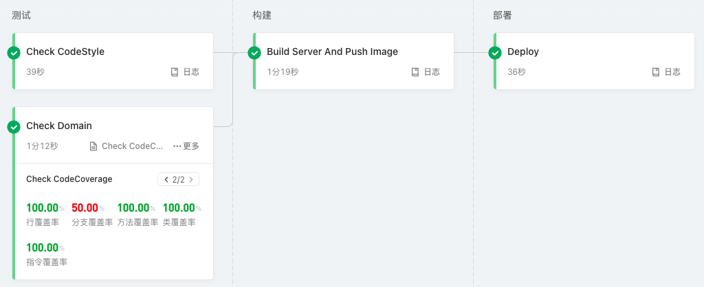

# 最佳实践

## 验证测试覆盖率

```shell
./gradlew domain:jacocoTestCoverageVerification
```

> 查看测试覆盖率报告：`domain/build/reports/jacoco/test/html/index.html`


## CI/CD 流水线



### 测试阶段

> 代码风格检查(Check CodeStyle)

```shell
./gradlew detekt
```

> 领域模型单元测试 (Check Domain)

```shell
./gradlew domain:check
```

> 测试覆盖率验证(Check CodeCoverage)

```shell
./gradlew domain:jacocoTestCoverageVerification
```

### 构建阶段

> 生成部署包 (Build Server)

```shell
./gradlew server:installDist
```

> 发布 Docker 镜像 (Push Image)

### 部署阶段

> 部署到 Kubernetes (Deploy Kubernetes)

### 流水线配置（阿里云效）

```yaml
sources:
  wow_project_template_repo:
    type: codeup
    name: Wow 项目模板代码源
    endpoint: <your-project-repo>
    branch: main
    certificate:
      type: serviceConnection
      serviceConnection: <your-service-connection-id>
stages:
  test:
    name: "测试"
    jobs:
      code_style:
        name: "Check CodeStyle"
        runsOn: public/cn-hongkong
        steps:
          code_style:
            name: "代码风格检查"
            step: "JavaBuild"
            runsOn: public/
            with:
              jdkVersion: "17"
              run: ./gradlew detekt

      test:
        name: "Check Domain"
        runsOn: public/cn-hongkong
        steps:
          test:
            name: "Check Domain"
            step: "GradleUnitTest"
            with:
              jdkVersion: "17"
              run: ./gradlew domain:check
              reportDir: "domain/build/reports/tests/test"
              reportIndex: "index.html"
          coverage:
            name: "Check CodeCoverage"
            step: "JaCoCo"
            with:
              jdkVersion: "17"
              run: ./gradlew domain:jacocoTestCoverageVerification
              reportDir: "domain/build/reports/jacoco/test/html"
  build:
    name: "构建"
    jobs:
      build:
        name: "Build Server And Push Image"
        runsOn: public/cn-hongkong
        steps:
          build:
            name: "Build Server"
            step: "JavaBuild"
            with:
              jdkVersion: "17"
              run: ./gradlew server:installDist
          publish_image:
            name: "Push Image"
            step: "ACRDockerBuild"
            with:
              artifact: "image"
              dockerfilePath: "server/Dockerfile"
              dockerRegistry: "<your-docker-registry—url>"
              dockerTag: ${DATETIME}
              region: "cn-hangzhou"
              serviceConnection: "<your-service-connection-id>"
  deploy:
    name: "部署"
    jobs:
      deploy:
        name: "Deploy"
        runsOn: public/cn-hongkong
        steps:
          deploy:
            name: "Deploy"
            step: "KubectlApply"
            with:
              skipTlsVerify: false
              kubernetesCluster: "<your-kubernetes-id>"
              useReplace: false
              namespace: "dev"
              kubectlVersion: "1.22.9"
              yamlPath: "deploy"
              skipVariableVerify: false
              variables:
                - key: IMAGE
                  value: $[stages.build.build.publish_image.artifacts.image]
                - key: REPLICAS
                  value: 2
                - key: SERVICE_NAME
                  value: demo-service
```

## 设计文档

### 用例图

<center>


</center>