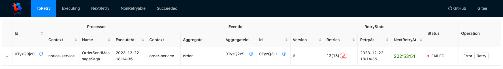
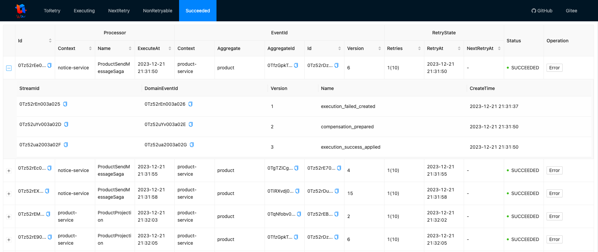
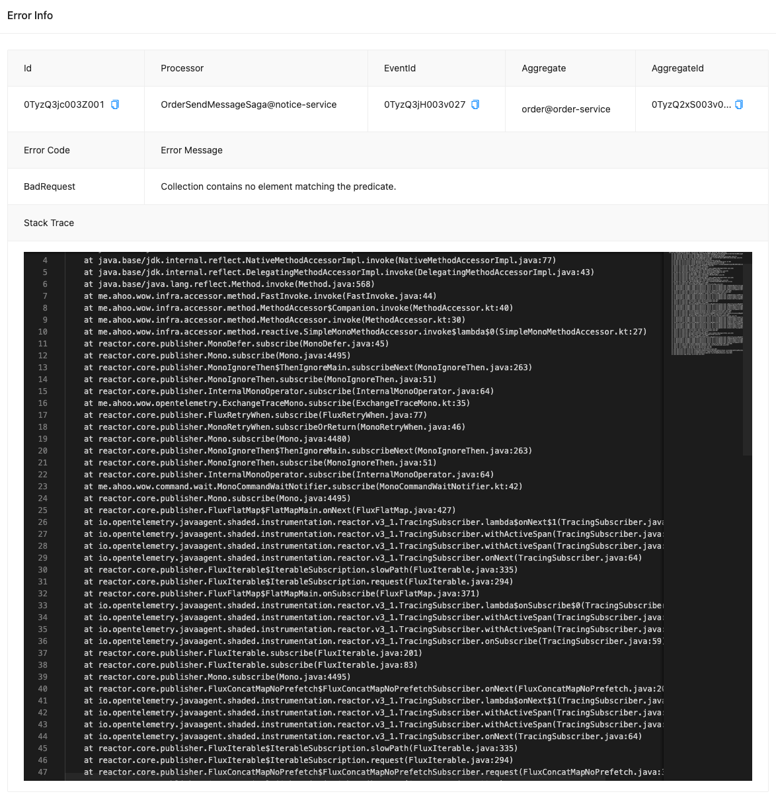
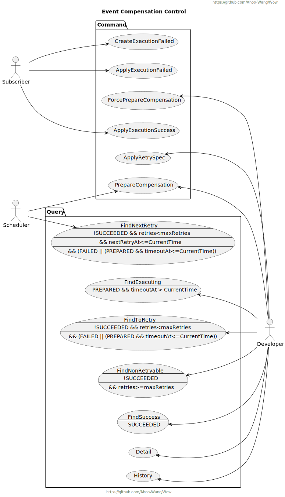

# 事件补偿

> *事件补偿*在事件驱动架构中的作用是处理和恢复因为事件处理失败而导致的数据不一致性或错误状态。
> 当系统中的某个事件处理失败时，_event compensation_ 机制会介入并执行相应的补偿操作，以确保系统状态得以修复并保持一致性。
> 这个机制有助于保障系统的可靠性和稳定性，尤其是在复杂的分布式系统中，其中事件可能在多个组件或服务之间传递。
> 通过 _event compensation_，系统可以更好地处理故障和异常情况，防止错误状态的传播，并最终确保系统能够从失败中恢复并继续正常运行。

事件补偿模块提供了可视化的事件补偿控制台和自动补偿机制，确保系统数据的最终一致性。

## 客户端

> 默认情况下客户端模块已经开启了事件补偿功能，如果需要关闭，可以在配置文件中设置 `wow.compensation.enabled=false`。

<CodeGroup>
  <CodeGroupItem title="Gradle(Kotlin)" active>

```kotlin
testImplementation("me.ahoo.wow:wow-compensation-core:2.12.1")
```

  </CodeGroupItem>
  <CodeGroupItem title="Gradle(Groovy)">

```groovy
testImplementation 'me.ahoo.wow:wow-compensation-core:2.12.1'
```

  </CodeGroupItem>
  <CodeGroupItem title="Maven">

```xml
<dependency>
    <groupId>me.ahoo.wow</groupId>
    <artifactId>wow-compensation-core</artifactId>
    <version>2.12.1</version>
</dependency>
```

  </CodeGroupItem>
</CodeGroup>

### 自定义重试机制

> 另外也可以通过 `@Retry` 注解来自定义补偿机制。

## 控制台

<p align="center" style="text-align:center">
  
</p>

<p align="center" style="text-align:center">
  
</p>

<p align="center" style="text-align:center">
  
</p>

<p align="center" style="text-align:center">
  
</p>

## 用例场景

<p align="center" style="text-align:center">
  
</p>

## 执行时序图

<p align="center" style="text-align:center">
  
</p>

