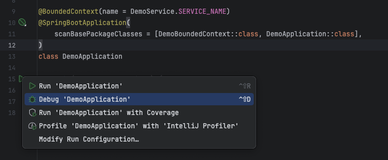
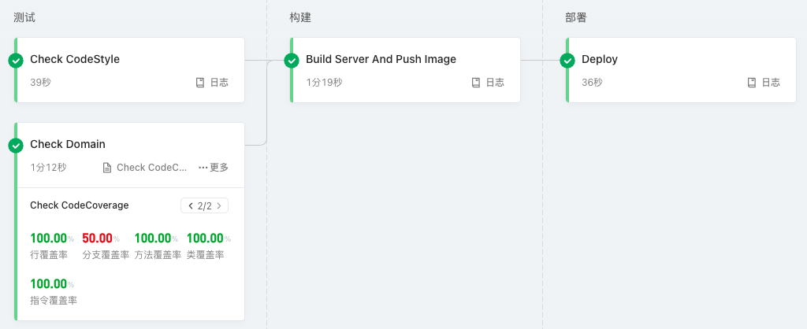
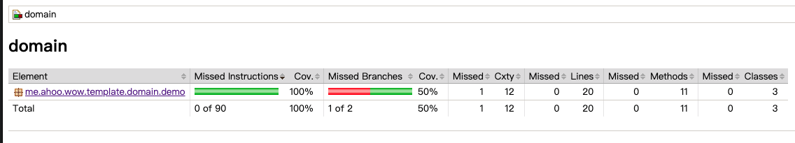

# 快速上手

> 使用 [Wow 项目模板](https://github.com/Ahoo-Wang/wow-project-template) 快速创建基于 _Wow_ 框架的 _DDD_ 项目。

## 安装模板

[IDEA 项目模板指南](https://www.jetbrains.com/help/idea/saving-project-as-template.html)

[IDEA 配置目录指南](https://www.jetbrains.com/help/idea/directories-used-by-the-ide-to-store-settings-caches-plugins-and-logs.html#config-directory)

- _IDEA_ 项目模板目录：`<IDE config home>/projectTemplates`
    - _Windows_: `C:\Users\<USERNAME>\AppData\Roaming\JetBrains\<PRODUCT><VERSION>\projectTemplates\`
    - _Mac OS_:`~/Library/Application\ Support/JetBrains/<PRODUCT><VERSION/projectTemplates/`
    - _Linux_: `~/.config/JetBrains/<PRODUCT><VERSION>/projectTemplates/`
- 将模板压缩包放到 _IDEA_ 项目模板目录下
    - 模板压缩包: [wow-project-template.zip](https://gitee.com/AhooWang/wow-project-template/releases/download/v5.26.0/wow-project-template.zip)

## 创建项目

> [使用模板创建项目](https://www.jetbrains.com/help/idea/saving-project-as-template.html#create-project-from-template)


- 修改 `settings.gradle.kts` 文件，将 `rootProject.name` 修改为项目名称
- 修改 `api/{package}/DemoService`
- 修改 `domain/{package}/DemoBoundedContext`

::: tip
IDEA 基于模版创建项目会将 `gradlew` 脚本被注释，需要重新从模板项目中Copy过来。
> 开启可执行权限：
```shell
chmod +x ./gradlew
```
:::


## 项目模块

| 模块                   | 说明                                                                                                                                |
|----------------------|-----------------------------------------------------------------------------------------------------------------------------------|
| api                  | **API 层**，定义聚合命令（Command）、领域事件（Domain Event）以及查询视图模型（Query View Model）。充当各个模块之间通信的“发布语言”，同时提供详细的 API 文档，助力开发者理解和使用接口。             |
| domain               | **领域层**，包含聚合根和业务约束的实现。聚合根充当领域模型的入口点，负责协调领域对象的操作，确保业务规则的正确执行。业务约束包括领域对象的验证规则、领域事件的处理等。模块内附有详细的领域模型文档，助力团队深入了解业务逻辑。                 |
| server               | **宿主服务**，应用程序的启动点。负责整合其他模块，并提供应用程序的入口。涉及配置依赖项、连接数据库、启动 API 服务等任务。此外，server 模块提供了容器化部署的支持，包括 Docker 构建镜像和 Kubernetes 部署文件，简化了部署过程。 |
| code-coverage-report | **测试覆盖率**，用于生成详细的测试覆盖率报告，以及验证覆盖率是否符合要求。帮助开发团队了解项目测试的全面性和质量。                                                                       |
| dependencies         | **依赖项管理**，这个模块负责管理项目的依赖关系，确保各个模块能够正确地引用和使用所需的外部库和工具。                                                                              |
| bom                  | **项目的 BOM（Bill of Materials）**                                                                                                    |
| libs.versions.toml   | **依赖版本配置文件**，明确了项目中各个库的版本，方便团队协作和保持版本的一致性。                                                                                        |
| deploy               | **Kubernetes 部署文件**，提供了在 Kubernetes 上部署应用程序所需的配置文件，简化了部署过程。                                                                       |
| Dockerfile           | **server Docker 构建镜像**，通过 Dockerfile 文件定义了应用程序的容器化构建步骤，方便部署和扩展。                                                                   |
| document             | **项目文档**，包括 UML 图和上下文映射图，为团队成员提供了对整个项目结构和业务逻辑的清晰理解。                                                                               |

## 安装 _server_ 依赖

1. 使用 _Kafka_ 作为消息引擎：命令总线以及事件总线

::: code-group
```kotlin [Gradle(Kotlin)]
implementation("me.ahoo.wow:wow-kafka")
```
```groovy [Gradle(Groovy)]
implementation 'me.ahoo.wow:wow-kafka'
```
```xml [Maven]
<dependency>
    <groupId>me.ahoo.wow</groupId>
    <artifactId>wow-kafka</artifactId>
    <version>${wow.version}</version>
</dependency>
```
:::

2. 使用 _MongoDB_ 作为事件存储以及快照仓库

::: code-group
```kotlin [Gradle(Kotlin)]
implementation("me.ahoo.wow:wow-mongo")
implementation("org.springframework.boot:spring-boot-starter-data-mongodb-reactive")
```
```groovy [Gradle(Groovy)]
implementation 'me.ahoo.wow:wow-mongo'
implementation 'org.springframework.boot:spring-boot-starter-data-mongodb-reactive'
```
```xml [Maven]
  <dependencies>
    <dependency>
        <groupId>me.ahoo.wow</groupId>
        <artifactId>wow-mongo</artifactId>
        <version>${wow.version}</version>
    </dependency>
    <dependency>
      <groupId>org.springframework.boot</groupId>
      <artifactId>spring-boot-starter-data-mongodb-reactive</artifactId>
    </dependency>
  </dependencies>
```
:::

3. 使用 [CosId](https://github.com/Ahoo-Wang/CosId) 作为全局、聚合根 ID 生成器

::: code-group
```kotlin [Gradle(Kotlin)]
implementation("me.ahoo.cosid:cosid-mongo")
```
```groovy [Gradle(Groovy)]
implementation 'me.ahoo.cosid:cosid-mongo'
```
```xml [Maven]
<dependency>
    <groupId>me.ahoo.cosid</groupId>
    <artifactId>cosid-mongo</artifactId>
    <version>${cosid.version}</version>
</dependency>
```
:::

## 应用配置

```yaml {20,23,29,34}
management:
  endpoint:
    health:
      show-details: always
      probes:
        enabled: true
  endpoints:
    web:
      exposure:
        include:
          - health
          - wow
          - cosid
          - cosidGenerator
          - cosidStringGenerator
springdoc:
  show-actuator: true
spring:
  application:
    name: <your-service-name>
  data:
    mongodb:
      uri: <mongodb-uri>

cosid:
  machine:
    enabled: true
    distributor:
      type: mongo
  generator:
    enabled: true
wow:
  kafka:
    bootstrap-servers: <kafka-bootstrap-servers>
```

## 启动服务



> 访问：[http://localhost:8080/swagger-ui.html](http://localhost:8080/swagger-ui.html)


## 领域建模

::: tip 聚合模式
接下来的案例中，我们将使用[聚合模式](modeling)来建模。
:::

### 命令聚合根

*命令聚合根* 负责接收命令处理函数，执行相应的业务逻辑，并返回领域事件。

```kotlin {2,5}
@Suppress("unused")
@AggregateRoot
class Demo(private val state: DemoState) {

    @OnCommand
    fun onCreate(command: CreateDemo): DemoCreated {
        return DemoCreated(
            data = command.data,
        )
    }

    @OnCommand
    fun onUpdate(command: UpdateDemo): DemoUpdated {
        return DemoUpdated(
            data = command.data
        )
    }
}
```

### 状态聚合根

*状态聚合根* 负责维护聚合状态数据，接收并处理领域事件并变更聚合状态数据。

::: warning 
状态聚合根 `setter` 访问器设置为 `private`，避免命令聚合根直接变更聚合状态数据。
:::

```kotlin {3,5}
class DemoState(override val id: String) : Identifier {
    var data: String? = null
        private set

    @OnSourcing
    fun onCreated(event: DemoCreated) {
        data = event.data
    }

    @OnSourcing
    fun onUpdated(event: DemoUpdated) {
        data = event.data
    }
}
```

## 编写单元测试

为了保证代码质量，我们需要编写单元测试来验证聚合根的行为是否符合预期。

### 测试聚合根

```kotlin
class DemoSpec : AggregateSpec<Demo, DemoState>({
  on {
    val create = CreateDemo(
      data = "data"
    )
    whenCommand(create) {
      expectNoError()
      expectEventType(DemoCreated::class)
      expectState {
        data.assert().isEqualTo(create.data)
      }
      fork {
        val update = UpdateDemo(
          data = "newData"
        )
        whenCommand(update) {
          expectNoError()
          expectEventType(DemoUpdated::class)
          expectState {
            data.assert().isEqualTo(update.data)
          }
        }
      }
    }
  }
})
```

## CI/CD 流水线



### 测试阶段



::: code-group
```shell [代码风格检查]
./gradlew detekt
```
```shell [领域模型单元测试]
./gradlew domain:check
```
```shell [测试覆盖率验证]
./gradlew domain:jacocoTestCoverageVerification
```
:::

### 构建阶段

::: code-group
```shell [生成部署包]
./gradlew server:installDist
```
```shell [发布 Docker 镜像]
docker login --username=<username> --password=<******> <registry>
docker build -t <registry>/<image>:<tag> server
docker push <registry>/<image>:<tag>
```
:::

### 部署阶段

```shell [部署到 Kubernetes]
kubectl apply -f deploy
```

### 流水线配置（阿里云效）

```yaml
sources:
  wow_project_template_repo:
    type: codeup
    name: Wow 项目模板代码源
    endpoint: <your-project-repo>
    branch: main
    certificate:
      type: serviceConnection
      serviceConnection: <your-service-connection-id>
stages:
  test:
    name: "测试"
    jobs:
      code_style:
        name: "Check CodeStyle"
        runsOn: public/cn-hongkong
        steps:
          code_style:
            name: "代码风格检查"
            step: "JavaBuild"
            runsOn: public/
            with:
              jdkVersion: "17"
              run: ./gradlew detekt

      test:
        name: "Check Domain"
        runsOn: public/cn-hongkong
        steps:
          test:
            name: "Check Domain"
            step: "GradleUnitTest"
            with:
              jdkVersion: "17"
              run: ./gradlew domain:check
              reportDir: "domain/build/reports/tests/test"
              reportIndex: "index.html"
          coverage:
            name: "Check CodeCoverage"
            step: "JaCoCo"
            with:
              jdkVersion: "17"
              run: ./gradlew domain:jacocoTestCoverageVerification
              reportDir: "domain/build/reports/jacoco/test/html"
  build:
    name: "构建"
    jobs:
      build:
        name: "Build Server And Push Image"
        runsOn: public/cn-hongkong
        steps:
          build:
            name: "Build Server"
            step: "JavaBuild"
            with:
              jdkVersion: "17"
              run: ./gradlew server:installDist
          publish_image:
            name: "Push Image"
            step: "ACRDockerBuild"
            with:
              artifact: "image"
              dockerfilePath: "server/Dockerfile"
              dockerRegistry: "<your-docker-registry—url>"
              dockerTag: ${DATETIME}
              region: "cn-hangzhou"
              serviceConnection: "<your-service-connection-id>"
  deploy:
    name: "部署"
    jobs:
      deploy:
        name: "Deploy"
        runsOn: public/cn-hongkong
        steps:
          deploy:
            name: "Deploy"
            step: "KubectlApply"
            with:
              skipTlsVerify: false
              kubernetesCluster: "<your-kubernetes-id>"
              useReplace: false
              namespace: "dev"
              kubectlVersion: "1.22.9"
              yamlPath: "deploy"
              skipVariableVerify: false
              variables:
                - key: IMAGE
                  value: $[stages.build.build.publish_image.artifacts.image]
                - key: REPLICAS
                  value: 2
                - key: SERVICE_NAME
                  value: demo-service
```

