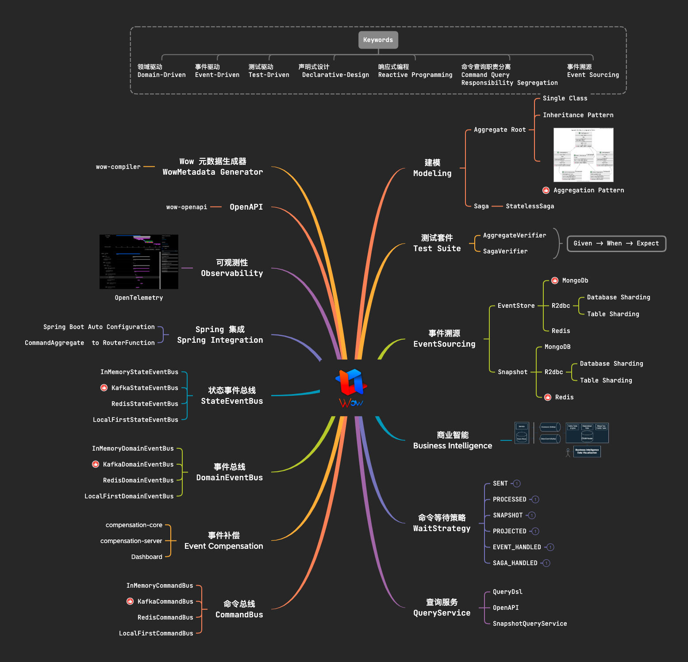

# 介绍

  

> **领域驱动** | **事件驱动** | **测试驱动** | **声明式设计** | **响应式编程** | **命令查询职责分离** | **事件溯源**

_Wow_ 是一个基于领域驱动设计和事件溯源的现代响应式 _CQRS_ 微服务开发框架，历经多年生产环境验证。

旨在帮助开发者构建现代化的、高性能且易于维护的微服务应用程序，充分发挥领域驱动设计和事件溯源等模式优势的同时降低应用的复杂性以及实践成本。

## 背景

## _Wow_ 提供了哪些特性？

在*Wow*框架中，有许多关键特性，包括但不限于：

- 命令网关：CQRS 模式中命令响应通常是一个简单的确认，告知客户端写操作已经成功处理（聚合根处理阶段），此时客户端刷新页面很可能无法获取到数据（投影查询模型到查询数据库尚未完成）。这对于客户端来说是非常不友好的。 
为了解决该问题*Wow*提供了多种命令等待策略，如`PROJECTED`信号可以等待投影完成。
- 事件驱动：提供了事件总线来处理事件的发布和订阅，帮助实现松耦合的组件之间的通信，以及查询模型的投影。
- 聚合根建模：采用聚合根来组织和管理领域模型，帮助开发者更好地划分和管理业务逻辑。
- 事件溯源：通过记录和回放事件来还原和跟踪应用程序状态变化，实现了强大的数据历史记录和审计功能。
- 命令查询职责分离：将读写操作分开，提升了系统性能和灵活性。
- 响应式编程：基于响应式编程模型使系统更适应异步和并发操作，提高整体响应性能。通过异步消息传递，系统组件以非阻塞方式通信，降低系统开销、增强系统弹性，确保高负载和低负载时均能保持即时响应性。
- 分布式事务：利用 *Saga* 编排模式精心管理复杂多服务之间的事务流程，以降低分布式事务的复杂性
- 测试驱动：提供了测试套件，可轻松实现 *80%* 以上的测试覆盖率，助力开发者构建高质量应用。
- _Spring WebFlux_ 集成：自动注册命令路由处理函数，专注于领域模型的开发。
- _Spring Boot_ 集成：与 _Spring Boot_ 完美集成，简化组件装配，加速微服务的开发。
- 可观测性：相较于传统的单一模式，*CQRS* 模式在某些方面可能会增加调试的复杂性。 
这主要是因为 _CQRS_ 引入了对写操作（命令）和读操作（查询）分离的设计，从而可能导致系统变得更加分散和复杂。
为了解决该问题，*Wow* 集成了 *OpenTelemetry* 以实现系统的端到端可观测性，有助于监控和调试。

  

## _Wow_ 是如何工作的？

  

## _Wow_ 适用于哪些场景？

## 