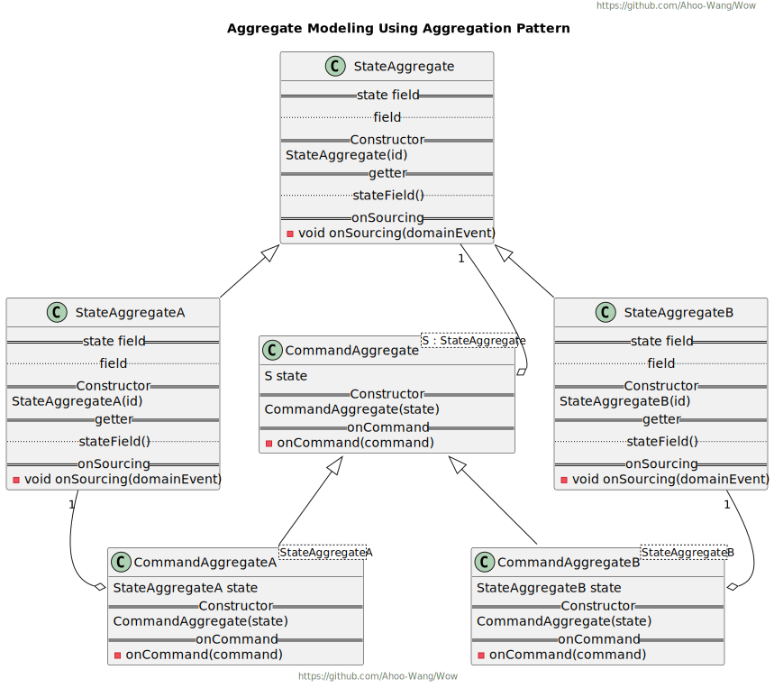
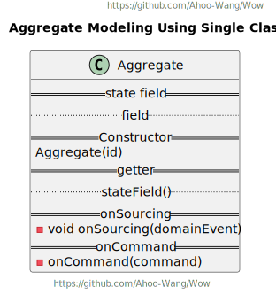
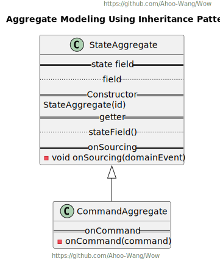

# 聚合建模

## 聚合模式 (推荐)

聚合模式将命令函数、溯源函数(包含聚合状态数据)分别放置在不同的类中，这样做的好处是可以避免命令函数直接变更聚合状态数据的问题(将`setter`访问器设置为`private`)。
同时职责分离也使得聚合根的命令函数更加专注于命令处理，溯源函数更加专注于聚合状态数据的变更。

  

## 单一类模式

单一类模式将命令函数、溯源函数以及聚合状态数据放置在一起，这样做的好处是简单直接。

::: danger 
但是因为所在同一个类中，所以命令函数是可以直接变更聚合状态数据的，这违反了`EventSourcing`的原则。
要求开发人员时刻谨记，命令函数只能返回领域事件并交由溯源函数来变更聚合状态数据。
:::

## 继承模式

继承模式将状态聚合根作为基类，并且将`setter`访问器设置为`private`。以避免命令聚合根在命令函数中修改聚合状态数据。

