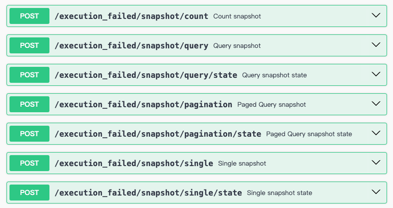

# 查询服务

## Query DSL

`Query DSL` 旨在提供一种简洁而灵活的方式来构建查询条件。

### ConditionDsl

```kotlin
condition {
    "field1" eq "value1"
    "field2" ne "value2"
    "filed3" gt 1
    "field4" lt 1
    "field5" gte 1
    "field6" lte 1
    "field7" like "value7"
    "field8" isIn listOf("value8")
    "field9" notIn listOf("value9")
    "field10" between (1 to 2)
    "field11" all listOf("value11")
    "field12" startsWith "value12"
    "field13" elemMatch {
        "field14" eq "value14"
    }
    "field15".isNull()
    "field16".notNull()
    and {
        "field3" eq "value3"
        "field4" eq "value4"
    }
    or {
        "field3" eq "value3"
        "field4" eq "value4"
    }
}
```

### SortDsl

```kotlin
sort {
    "field1".asc()
    "field2".desc()
}
```

### PaginationDsl

```kotlin
pagination {
    index(1)
    size(1)
}
```

### QueryDsl

```kotlin
query {
    limit(1)
    sort {
        "field1".asc()
    }
    condition {
        "field1" eq "value1"
        "field2" eq "value2"
        and {
            "field3" eq "value3"
        }
        or {
            "field4" eq "value4"
        }
    }
}
```

### PagedQueryDsl

```kotlin
pagedQuery {
    pagination {
        index(1)
        size(10)
    }
    sort {
        "field1".asc()
    }
    condition {
        "field1" eq "value1"
        "field2" ne "value2"
        "filed3" gt 1
        "field4" lt 1
        "field5" gte 1
        "field6" lte 1
        "field7" like "value7"
        "field8" isIn listOf("value8")
        "field9" notIn listOf("value9")
        "field10" between (1 to 2)
        "field11" all listOf("value11")
        "field12" startsWith "value12"
        "field13" elemMatch {
            "field14" eq "value14"
        }
        "field15".isNull()
        "field16".notNull()
        and {
            "field3" eq "value3"
            "field4" eq "value4"
        }
        or {
            "field3" eq "value3"
            "field4" eq "value4"
        }
    }
}
```

## 执行查询

```kotlin
query {
    limit(1)
    sort {
        "field1".asc()
    }
    condition {
        "field1" eq "value1"
        and {
            "field3" eq "value3"
        }
        or {
            "field4" eq "value4"
        }
    }
}.query(queryService)
```

## 执行分页查询

```kotlin
pagedQuery {
    pagination {
        index(1)
        size(10)
    }
    sort {
        "field1".asc()
    }
    condition {
        and {
            "field3" eq "value3"
            "field4" startsWith "value4"
        }
        or {
            "field3" eq "value3"
            "field4" startsWith "value4"
        }
    }
}.query(queryService)
```

## OpenAPI

**Wow** 除了为命令(`Command`)自动生成了 _OpenAPI_ 端点，另外还提供了查询(`Query`) _OpenAPI_ 端点。
这意味着开发人员通常只需专注于编写领域模型，即可完成服务开发，而无需费心处理查询逻辑的实现，极大提升了开发效率。




### 分页查询

::: code-group
```shell [Curl]
  curl -X 'POST' \
  'http://localhost:8080/execution_failed/snapshot/pagination' \
  -H 'accept: application/json' \
  -H 'Content-Type: application/json' \
  -d '{
  "sort": [
    {
      "field": "_id",
      "direction": "DESC"
    }
  ],
  "pagination": {
    "index": 1,
    "size": 10
  },
  "condition": {
    "field": "",
    "operator": "AND",
    "value": "",
    "children": [
      {
        "field": "state.recoverable",
        "operator": "NE",
        "value": "UNRECOVERABLE",
        "children": []
      },
      {
        "field": "state.status",
        "operator": "NE",
        "value": "SUCCEEDED",
        "children": []
      },
      {
        "field": "state.isBelowRetryThreshold",
        "operator": "EQ",
        "value": false,
        "children": []
      }
    ]
  }
}'
```
```json [响应]
{
  "total": 2,
  "list": [
    {
      "contextName": "compensation-service",
      "aggregateName": "execution_failed",
      "aggregateId": "0TyzQ3jc003Z001",
      "tenantId": "(0)",
      "version": 45,
      "eventId": "0U18eEJG004B009",
      "firstOperator": "",
      "operator": "",
      "firstEventTime": 1703082369272,
      "eventTime": 1705050999170,
      "state": {
        "id": "0TyzQ3jc003Z001",
        "eventId": {
          "id": "0TyzQ3jH003v027",
          "aggregateId": {
            "contextName": "order-service",
            "aggregateName": "order",
            "aggregateId": "0TyzQ2xS003v004",
            "tenantId": "0TfcXPA5003V00A"
          },
          "version": 6,
          "initialized": true,
          "isInitialVersion": false
        },
        "processor": {
          "contextName": "notice-service",
          "processorName": "OrderSendMessageSaga"
        },
        "functionKind": "EVENT",
        "error": {
          "errorCode": "BadRequest",
          "errorMsg": "Collection contains no element matching the predicate.",
          "stackTrace": "java.util.NoSuchElementException: Collection contains no element matching the predicate.\n\tat com.linyeah.notice.domains.sendmessage.saga.OrderSendMessageSaga.onOrderPackageReceived(OrderSendMessageSaga.kt:485)\n\tSuppressed: The stacktrace has been enhanced by Reactor, refer to additional information below: \nError has been observed at the following site(s):\n\t*__checkpoint ⇢ Invoke OrderSendMessageSaga.onOrderPackageReceived(OrderPackageReceived) [DomainEventFunctionFilter]\nOriginal Stack Trace:\n\t\tat com.linyeah.notice.domains.sendmessage.saga.OrderSendMessageSaga.onOrderPackageReceived(OrderSendMessageSaga.kt:485)\n\t\tat java.base/jdk.internal.reflect.NativeMethodAccessorImpl.invoke0(Native Method)\n\t\tat java.base/jdk.internal.reflect.NativeMethodAccessorImpl.invoke(NativeMethodAccessorImpl.java:77)\n\t\tat java.base/jdk.internal.reflect.DelegatingMethodAccessorImpl.invoke(DelegatingMethodAccessorImpl.java:43)\n\t\tat java.base/java.lang.reflect.Method.invoke(Method.java:568)\n\t\tat me.ahoo.wow.infra.accessor.method.FastInvoke.invoke(FastInvoke.java:44)\n\t\tat me.ahoo.wow.infra.accessor.method.MethodAccessor$Companion.invoke(MethodAccessor.kt:40)\n\t\tat me.ahoo.wow.infra.accessor.method.MethodAccessor.invoke(MethodAccessor.kt:30)\n\t\tat me.ahoo.wow.infra.accessor.method.reactive.SimpleMonoMethodAccessor.invoke$lambda$0(SimpleMonoMethodAccessor.kt:27)\n\t\tat reactor.core.publisher.MonoDefer.subscribe(MonoDefer.java:45)\n\t\tat reactor.core.publisher.Mono.subscribe(Mono.java:4495)\n\t\tat reactor.core.publisher.MonoIgnoreThen$ThenIgnoreMain.subscribeNext(MonoIgnoreThen.java:263)\n\t\tat reactor.core.publisher.MonoIgnoreThen.subscribe(MonoIgnoreThen.java:51)\n\t\tat reactor.core.publisher.InternalMonoOperator.subscribe(InternalMonoOperator.java:64)\n\t\tat me.ahoo.wow.opentelemetry.ExchangeTraceMono.subscribe(ExchangeTraceMono.kt:35)\n\t\tat reactor.core.publisher.FluxRetryWhen.subscribe(FluxRetryWhen.java:77)\n\t\tat reactor.core.publisher.MonoRetryWhen.subscribeOrReturn(MonoRetryWhen.java:46)\n\t\tat reactor.core.publisher.Mono.subscribe(Mono.java:4480)\n\t\tat reactor.core.publisher.MonoIgnoreThen$ThenIgnoreMain.subscribeNext(MonoIgnoreThen.java:263)\n\t\tat reactor.core.publisher.MonoIgnoreThen.subscribe(MonoIgnoreThen.java:51)\n\t\tat reactor.core.publisher.InternalMonoOperator.subscribe(InternalMonoOperator.java:64)\n\t\tat me.ahoo.wow.command.wait.MonoCommandWaitNotifier.subscribe(MonoCommandWaitNotifier.kt:42)\n\t\tat reactor.core.publisher.Mono.subscribe(Mono.java:4495)\n\t\tat reactor.core.publisher.FluxFlatMap$FlatMapMain.onNext(FluxFlatMap.java:427)\n\t\tat io.opentelemetry.javaagent.shaded.instrumentation.reactor.v3_1.TracingSubscriber.lambda$onNext$1(TracingSubscriber.java:64)\n\t\tat io.opentelemetry.javaagent.shaded.instrumentation.reactor.v3_1.TracingSubscriber.withActiveSpan(TracingSubscriber.java:97)\n\t\tat io.opentelemetry.javaagent.shaded.instrumentation.reactor.v3_1.TracingSubscriber.withActiveSpan(TracingSubscriber.java:91)\n\t\tat io.opentelemetry.javaagent.shaded.instrumentation.reactor.v3_1.TracingSubscriber.onNext(TracingSubscriber.java:64)\n\t\tat reactor.core.publisher.FluxIterable$IterableSubscription.slowPath(FluxIterable.java:335)\n\t\tat reactor.core.publisher.FluxIterable$IterableSubscription.request(FluxIterable.java:294)\n\t\tat reactor.core.publisher.FluxFlatMap$FlatMapMain.onSubscribe(FluxFlatMap.java:371)\n\t\tat io.opentelemetry.javaagent.shaded.instrumentation.reactor.v3_1.TracingSubscriber.lambda$onSubscribe$0(TracingSubscriber.java:59)\n\t\tat io.opentelemetry.javaagent.shaded.instrumentation.reactor.v3_1.TracingSubscriber.withActiveSpan(TracingSubscriber.java:97)\n\t\tat io.opentelemetry.javaagent.shaded.instrumentation.reactor.v3_1.TracingSubscriber.withActiveSpan(TracingSubscriber.java:91)\n\t\tat io.opentelemetry.javaagent.shaded.instrumentation.reactor.v3_1.TracingSubscriber.onSubscribe(TracingSubscriber.java:59)\n\t\tat reactor.core.publisher.FluxIterable.subscribe(FluxIterable.java:201)\n\t\tat reactor.core.publisher.FluxIterable.subscribe(FluxIterable.java:83)\n\t\tat reactor.core.publisher.Mono.subscribe(Mono.java:4495)\n\t\tat reactor.core.publisher.FluxConcatMapNoPrefetch$FluxConcatMapNoPrefetchSubscriber.onNext(FluxConcatMapNoPrefetch.java:206)\n\t\tat io.opentelemetry.javaagent.shaded.instrumentation.reactor.v3_1.TracingSubscriber.lambda$onNext$1(TracingSubscriber.java:64)\n\t\tat io.opentelemetry.javaagent.shaded.instrumentation.reactor.v3_1.TracingSubscriber.withActiveSpan(TracingSubscriber.java:97)\n\t\tat io.opentelemetry.javaagent.shaded.instrumentation.reactor.v3_1.TracingSubscriber.withActiveSpan(TracingSubscriber.java:91)\n\t\tat io.opentelemetry.javaagent.shaded.instrumentation.reactor.v3_1.TracingSubscriber.onNext(TracingSubscriber.java:64)\n\t\tat reactor.core.publisher.FluxIterable$IterableSubscription.slowPath(FluxIterable.java:335)\n\t\tat reactor.core.publisher.FluxIterable$IterableSubscription.request(FluxIterable.java:294)\n\t\tat reactor.core.publisher.FluxConcatMapNoPrefetch$FluxConcatMapNoPrefetchSubscriber.request(FluxConcatMapNoPrefetch.java:336)\n\t\tat reactor.core.publisher.Operators$MultiSubscriptionSubscriber.set(Operators.java:2341)\n\t\tat reactor.core.publisher.FluxOnErrorResume$ResumeSubscriber.onSubscribe(FluxOnErrorResume.java:74)\n\t\tat io.opentelemetry.javaagent.shaded.instrumentation.reactor.v3_1.TracingSubscriber.lambda$onSubscribe$0(TracingSubscriber.java:59)\n\t\tat io.opentelemetry.javaagent.shaded.instrumentation.reactor.v3_1.TracingSubscriber.withActiveSpan(TracingSubscriber.java:97)\n\t\tat io.opentelemetry.javaagent.shaded.instrumentation.reactor.v3_1.TracingSubscriber.withActiveSpan(TracingSubscriber.java:91)\n\t\tat io.opentelemetry.javaagent.shaded.instrumentation.reactor.v3_1.TracingSubscriber.onSubscribe(TracingSubscriber.java:59)\n\t\tat reactor.core.publisher.FluxConcatMapNoPrefetch$FluxConcatMapNoPrefetchSubscriber.onSubscribe(FluxConcatMapNoPrefetch.java:164)\n\t\tat io.opentelemetry.javaagent.shaded.instrumentation.reactor.v3_1.TracingSubscriber.lambda$onSubscribe$0(TracingSubscriber.java:59)\n\t\tat io.opentelemetry.javaagent.shaded.instrumentation.reactor.v3_1.TracingSubscriber.withActiveSpan(TracingSubscriber.java:97)\n\t\tat io.opentelemetry.javaagent.shaded.instrumentation.reactor.v3_1.TracingSubscriber.withActiveSpan(TracingSubscriber.java:91)\n\t\tat io.opentelemetry.javaagent.shaded.instrumentation.reactor.v3_1.TracingSubscriber.onSubscribe(TracingSubscriber.java:59)\n\t\tat reactor.core.publisher.FluxIterable.subscribe(FluxIterable.java:201)\n\t\tat reactor.core.publisher.FluxIterable.subscribe(FluxIterable.java:83)\n\t\tat reactor.core.publisher.Flux.subscribe(Flux.java:8773)\n\t\tat reactor.core.publisher.MonoIgnoreThen$ThenIgnoreMain.subscribeNext(MonoIgnoreThen.java:263)\n\t\tat reactor.core.publisher.MonoIgnoreThen.subscribe(MonoIgnoreThen.java:51)\n\t\tat reactor.core.publisher.Mono.subscribe(Mono.java:4495)\n\t\tat reactor.core.publisher.FluxConcatMapNoPrefetch$FluxConcatMapNoPrefetchSubscriber.onNext(FluxConcatMapNoPrefetch.java:206)\n\t\tat io.opentelemetry.javaagent.shaded.instrumentation.reactor.v3_1.TracingSubscriber.lambda$onNext$1(TracingSubscriber.java:64)\n\t\tat io.opentelemetry.javaagent.shaded.instrumentation.reactor.v3_1.TracingSubscriber.withActiveSpan(TracingSubscriber.java:97)\n\t\tat io.opentelemetry.javaagent.shaded.instrumentation.reactor.v3_1.TracingSubscriber.withActiveSpan(TracingSubscriber.java:91)\n\t\tat io.opentelemetry.javaagent.shaded.instrumentation.reactor.v3_1.TracingSubscriber.onNext(TracingSubscriber.java:64)\n\t\tat reactor.core.publisher.FluxPublishOn$PublishOnSubscriber.runAsync(FluxPublishOn.java:440)\n\t\tat reactor.core.publisher.FluxPublishOn$PublishOnSubscriber.run(FluxPublishOn.java:527)\n\t\tat reactor.core.scheduler.WorkerTask.call(WorkerTask.java:84)\n\t\tat reactor.core.scheduler.WorkerTask.call(WorkerTask.java:37)\n\t\tat java.base/java.util.concurrent.FutureTask.run(FutureTask.java:264)\n\t\tat java.base/java.util.concurrent.ScheduledThreadPoolExecutor$ScheduledFutureTask.run(ScheduledThreadPoolExecutor.java:304)\n\t\tat java.base/java.util.concurrent.ThreadPoolExecutor.runWorker(ThreadPoolExecutor.java:1136)\n\t\tat java.base/java.util.concurrent.ThreadPoolExecutor$Worker.run(ThreadPoolExecutor.java:635)\n\t\tat java.base/java.lang.Thread.run(Thread.java:833)\n",
          "succeeded": false
        },
        "executeAt": 1705050998891,
        "retrySpec": {
          "maxRetries": 10,
          "minBackoff": 180,
          "executionTimeout": 120
        },
        "retryState": {
          "retries": 16,
          "retryAt": 1705050998728,
          "timeoutAt": 1705051118728,
          "nextRetryAt": 1716847478728
        },
        "status": "FAILED",
        "recoverable": "UNKNOWN",
        "isRetryable": false,
        "isBelowRetryThreshold": false
      },
      "snapshotTime": 1705050999195,
      "deleted": false
    },
    {
      "contextName": "compensation-service",
      "aggregateName": "execution_failed",
      "aggregateId": "0TyzPzLb0049001",
      "tenantId": "(0)",
      "version": 29,
      "eventId": "0U18mMQY004B00E",
      "firstOperator": "",
      "operator": "",
      "firstEventTime": 1703082352417,
      "eventTime": 1705052936998,
      "state": {
        "id": "0TyzPzLb0049001",
        "eventId": {
          "id": "0TyzPzL8003v00l",
          "aggregateId": {
            "contextName": "order-service",
            "aggregateName": "order",
            "aggregateId": "0TyzPwpv003v002",
            "tenantId": "0TfcXPA5003V00A"
          },
          "version": 8,
          "initialized": true,
          "isInitialVersion": false
        },
        "processor": {
          "contextName": "notice-service",
          "processorName": "OrderSendMessageSaga"
        },
        "functionKind": "EVENT",
        "error": {
          "errorCode": "BadRequest",
          "errorMsg": "Collection contains no element matching the predicate.",
          "stackTrace": "java.util.NoSuchElementException: Collection contains no element matching the predicate.\n\tat com.linyeah.notice.domains.sendmessage.saga.OrderSendMessageSaga.onOrderPackageReceived(OrderSendMessageSaga.kt:485)\n\tSuppressed: The stacktrace has been enhanced by Reactor, refer to additional information below: \nError has been observed at the following site(s):\n\t*__checkpoint ⇢ Invoke OrderSendMessageSaga.onOrderPackageReceived(OrderPackageReceived) [DomainEventFunctionFilter]\nOriginal Stack Trace:\n\t\tat com.linyeah.notice.domains.sendmessage.saga.OrderSendMessageSaga.onOrderPackageReceived(OrderSendMessageSaga.kt:485)\n\t\tat java.base/jdk.internal.reflect.NativeMethodAccessorImpl.invoke0(Native Method)\n\t\tat java.base/jdk.internal.reflect.NativeMethodAccessorImpl.invoke(NativeMethodAccessorImpl.java:77)\n\t\tat java.base/jdk.internal.reflect.DelegatingMethodAccessorImpl.invoke(DelegatingMethodAccessorImpl.java:43)\n\t\tat java.base/java.lang.reflect.Method.invoke(Method.java:568)\n\t\tat me.ahoo.wow.infra.accessor.method.FastInvoke.invoke(FastInvoke.java:44)\n\t\tat me.ahoo.wow.infra.accessor.method.MethodAccessor$Companion.invoke(MethodAccessor.kt:40)\n\t\tat me.ahoo.wow.infra.accessor.method.MethodAccessor.invoke(MethodAccessor.kt:30)\n\t\tat me.ahoo.wow.infra.accessor.method.reactive.SimpleMonoMethodAccessor.invoke$lambda$0(SimpleMonoMethodAccessor.kt:27)\n\t\tat reactor.core.publisher.MonoDefer.subscribe(MonoDefer.java:45)\n\t\tat reactor.core.publisher.Mono.subscribe(Mono.java:4495)\n\t\tat reactor.core.publisher.MonoIgnoreThen$ThenIgnoreMain.subscribeNext(MonoIgnoreThen.java:263)\n\t\tat reactor.core.publisher.MonoIgnoreThen.subscribe(MonoIgnoreThen.java:51)\n\t\tat reactor.core.publisher.InternalMonoOperator.subscribe(InternalMonoOperator.java:64)\n\t\tat me.ahoo.wow.opentelemetry.ExchangeTraceMono.subscribe(ExchangeTraceMono.kt:35)\n\t\tat reactor.core.publisher.FluxRetryWhen.subscribe(FluxRetryWhen.java:77)\n\t\tat reactor.core.publisher.MonoRetryWhen.subscribeOrReturn(MonoRetryWhen.java:46)\n\t\tat reactor.core.publisher.Mono.subscribe(Mono.java:4480)\n\t\tat reactor.core.publisher.MonoIgnoreThen$ThenIgnoreMain.subscribeNext(MonoIgnoreThen.java:263)\n\t\tat reactor.core.publisher.MonoIgnoreThen.subscribe(MonoIgnoreThen.java:51)\n\t\tat reactor.core.publisher.InternalMonoOperator.subscribe(InternalMonoOperator.java:64)\n\t\tat me.ahoo.wow.command.wait.MonoCommandWaitNotifier.subscribe(MonoCommandWaitNotifier.kt:42)\n\t\tat reactor.core.publisher.Mono.subscribe(Mono.java:4495)\n\t\tat reactor.core.publisher.FluxFlatMap$FlatMapMain.onNext(FluxFlatMap.java:427)\n\t\tat io.opentelemetry.javaagent.shaded.instrumentation.reactor.v3_1.TracingSubscriber.lambda$onNext$1(TracingSubscriber.java:64)\n\t\tat io.opentelemetry.javaagent.shaded.instrumentation.reactor.v3_1.TracingSubscriber.withActiveSpan(TracingSubscriber.java:97)\n\t\tat io.opentelemetry.javaagent.shaded.instrumentation.reactor.v3_1.TracingSubscriber.withActiveSpan(TracingSubscriber.java:91)\n\t\tat io.opentelemetry.javaagent.shaded.instrumentation.reactor.v3_1.TracingSubscriber.onNext(TracingSubscriber.java:64)\n\t\tat reactor.core.publisher.FluxIterable$IterableSubscription.slowPath(FluxIterable.java:335)\n\t\tat reactor.core.publisher.FluxIterable$IterableSubscription.request(FluxIterable.java:294)\n\t\tat reactor.core.publisher.FluxFlatMap$FlatMapMain.onSubscribe(FluxFlatMap.java:371)\n\t\tat io.opentelemetry.javaagent.shaded.instrumentation.reactor.v3_1.TracingSubscriber.lambda$onSubscribe$0(TracingSubscriber.java:59)\n\t\tat io.opentelemetry.javaagent.shaded.instrumentation.reactor.v3_1.TracingSubscriber.withActiveSpan(TracingSubscriber.java:97)\n\t\tat io.opentelemetry.javaagent.shaded.instrumentation.reactor.v3_1.TracingSubscriber.withActiveSpan(TracingSubscriber.java:91)\n\t\tat io.opentelemetry.javaagent.shaded.instrumentation.reactor.v3_1.TracingSubscriber.onSubscribe(TracingSubscriber.java:59)\n\t\tat reactor.core.publisher.FluxIterable.subscribe(FluxIterable.java:201)\n\t\tat reactor.core.publisher.FluxIterable.subscribe(FluxIterable.java:83)\n\t\tat reactor.core.publisher.Mono.subscribe(Mono.java:4495)\n\t\tat reactor.core.publisher.FluxConcatMapNoPrefetch$FluxConcatMapNoPrefetchSubscriber.onNext(FluxConcatMapNoPrefetch.java:206)\n\t\tat io.opentelemetry.javaagent.shaded.instrumentation.reactor.v3_1.TracingSubscriber.lambda$onNext$1(TracingSubscriber.java:64)\n\t\tat io.opentelemetry.javaagent.shaded.instrumentation.reactor.v3_1.TracingSubscriber.withActiveSpan(TracingSubscriber.java:97)\n\t\tat io.opentelemetry.javaagent.shaded.instrumentation.reactor.v3_1.TracingSubscriber.withActiveSpan(TracingSubscriber.java:91)\n\t\tat io.opentelemetry.javaagent.shaded.instrumentation.reactor.v3_1.TracingSubscriber.onNext(TracingSubscriber.java:64)\n\t\tat reactor.core.publisher.FluxIterable$IterableSubscription.slowPath(FluxIterable.java:335)\n\t\tat reactor.core.publisher.FluxIterable$IterableSubscription.request(FluxIterable.java:294)\n\t\tat reactor.core.publisher.FluxConcatMapNoPrefetch$FluxConcatMapNoPrefetchSubscriber.request(FluxConcatMapNoPrefetch.java:336)\n\t\tat reactor.core.publisher.Operators$MultiSubscriptionSubscriber.set(Operators.java:2341)\n\t\tat reactor.core.publisher.FluxOnErrorResume$ResumeSubscriber.onSubscribe(FluxOnErrorResume.java:74)\n\t\tat io.opentelemetry.javaagent.shaded.instrumentation.reactor.v3_1.TracingSubscriber.lambda$onSubscribe$0(TracingSubscriber.java:59)\n\t\tat io.opentelemetry.javaagent.shaded.instrumentation.reactor.v3_1.TracingSubscriber.withActiveSpan(TracingSubscriber.java:97)\n\t\tat io.opentelemetry.javaagent.shaded.instrumentation.reactor.v3_1.TracingSubscriber.withActiveSpan(TracingSubscriber.java:91)\n\t\tat io.opentelemetry.javaagent.shaded.instrumentation.reactor.v3_1.TracingSubscriber.onSubscribe(TracingSubscriber.java:59)\n\t\tat reactor.core.publisher.FluxConcatMapNoPrefetch$FluxConcatMapNoPrefetchSubscriber.onSubscribe(FluxConcatMapNoPrefetch.java:164)\n\t\tat io.opentelemetry.javaagent.shaded.instrumentation.reactor.v3_1.TracingSubscriber.lambda$onSubscribe$0(TracingSubscriber.java:59)\n\t\tat io.opentelemetry.javaagent.shaded.instrumentation.reactor.v3_1.TracingSubscriber.withActiveSpan(TracingSubscriber.java:97)\n\t\tat io.opentelemetry.javaagent.shaded.instrumentation.reactor.v3_1.TracingSubscriber.withActiveSpan(TracingSubscriber.java:91)\n\t\tat io.opentelemetry.javaagent.shaded.instrumentation.reactor.v3_1.TracingSubscriber.onSubscribe(TracingSubscriber.java:59)\n\t\tat reactor.core.publisher.FluxIterable.subscribe(FluxIterable.java:201)\n\t\tat reactor.core.publisher.FluxIterable.subscribe(FluxIterable.java:83)\n\t\tat reactor.core.publisher.Flux.subscribe(Flux.java:8773)\n\t\tat reactor.core.publisher.MonoIgnoreThen$ThenIgnoreMain.subscribeNext(MonoIgnoreThen.java:263)\n\t\tat reactor.core.publisher.MonoIgnoreThen.subscribe(MonoIgnoreThen.java:51)\n\t\tat reactor.core.publisher.Mono.subscribe(Mono.java:4495)\n\t\tat reactor.core.publisher.FluxConcatMapNoPrefetch$FluxConcatMapNoPrefetchSubscriber.onNext(FluxConcatMapNoPrefetch.java:206)\n\t\tat io.opentelemetry.javaagent.shaded.instrumentation.reactor.v3_1.TracingSubscriber.lambda$onNext$1(TracingSubscriber.java:64)\n\t\tat io.opentelemetry.javaagent.shaded.instrumentation.reactor.v3_1.TracingSubscriber.withActiveSpan(TracingSubscriber.java:97)\n\t\tat io.opentelemetry.javaagent.shaded.instrumentation.reactor.v3_1.TracingSubscriber.withActiveSpan(TracingSubscriber.java:91)\n\t\tat io.opentelemetry.javaagent.shaded.instrumentation.reactor.v3_1.TracingSubscriber.onNext(TracingSubscriber.java:64)\n\t\tat reactor.core.publisher.FluxPublishOn$PublishOnSubscriber.runAsync(FluxPublishOn.java:440)\n\t\tat reactor.core.publisher.FluxPublishOn$PublishOnSubscriber.run(FluxPublishOn.java:527)\n\t\tat reactor.core.scheduler.WorkerTask.call(WorkerTask.java:84)\n\t\tat reactor.core.scheduler.WorkerTask.call(WorkerTask.java:37)\n\t\tat java.base/java.util.concurrent.FutureTask.run(FutureTask.java:264)\n\t\tat java.base/java.util.concurrent.ScheduledThreadPoolExecutor$ScheduledFutureTask.run(ScheduledThreadPoolExecutor.java:304)\n\t\tat java.base/java.util.concurrent.ThreadPoolExecutor.runWorker(ThreadPoolExecutor.java:1136)\n\t\tat java.base/java.util.concurrent.ThreadPoolExecutor$Worker.run(ThreadPoolExecutor.java:635)\n\t\tat java.base/java.lang.Thread.run(Thread.java:833)\n",
          "succeeded": false
        },
        "executeAt": 1705052936969,
        "retrySpec": {
          "maxRetries": 10,
          "minBackoff": 180,
          "executionTimeout": 120
        },
        "retryState": {
          "retries": 13,
          "retryAt": 1705052936815,
          "timeoutAt": 1705053056815,
          "nextRetryAt": 1706527496815
        },
        "status": "FAILED",
        "recoverable": "UNKNOWN",
        "isRetryable": false,
        "isBelowRetryThreshold": false
      },
      "snapshotTime": 1705052937019,
      "deleted": false
    }
  ]
}
```
```typescript [Typescript]
Conditions.and(
    [
        Conditions.ne(RECOVERABLE, RecoverableType.UNRECOVERABLE),
        Conditions.eq(IS_RETRYABLE, true),
        Conditions.lte(NEXT_RETRY_AT, currentTime),
        Conditions.or([
            Conditions.eq(STATUS, ExecutionFailedStatus.FAILED),
            Conditions.and([
                Conditions.eq(STATUS, ExecutionFailedStatus.PREPARED),
                Conditions.lte(TIMEOUT_AT, currentTime)
            ])
        ])
    ]
)
```
:::

### 查询

::: code-group
```shell [Curl]
  curl -X 'POST' \
  'http://localhost:8080/execution_failed/snapshot/query' \
  -H 'accept: application/json' \
  -H 'Content-Type: application/json' \
  -d '{
  "sort": [
    {
      "field": "_id",
      "direction": "DESC"
    }
  ],
  "limit": 1,
  "condition": {
    "field": "",
    "operator": "AND",
    "value": "",
    "children": [
      {
        "field": "state.recoverable",
        "operator": "NE",
        "value": "UNRECOVERABLE",
        "children": []
      },
      {
        "field": "state.status",
        "operator": "NE",
        "value": "SUCCEEDED",
        "children": []
      },
      {
        "field": "state.isBelowRetryThreshold",
        "operator": "EQ",
        "value": false,
        "children": []
      }
    ]
  }
}'
```
```json [响应]
[
  {
    "contextName": "compensation-service",
    "aggregateName": "execution_failed",
    "aggregateId": "0TyzQ3jc003Z001",
    "tenantId": "(0)",
    "version": 45,
    "eventId": "0U18eEJG004B009",
    "firstOperator": "",
    "operator": "",
    "firstEventTime": 1703082369272,
    "eventTime": 1705050999170,
    "state": {
      "id": "0TyzQ3jc003Z001",
      "eventId": {
        "id": "0TyzQ3jH003v027",
        "aggregateId": {
          "contextName": "order-service",
          "aggregateName": "order",
          "aggregateId": "0TyzQ2xS003v004",
          "tenantId": "0TfcXPA5003V00A"
        },
        "version": 6,
        "initialized": true,
        "isInitialVersion": false
      },
      "processor": {
        "contextName": "notice-service",
        "processorName": "OrderSendMessageSaga"
      },
      "functionKind": "EVENT",
      "error": {
        "errorCode": "BadRequest",
        "errorMsg": "Collection contains no element matching the predicate.",
        "stackTrace": "java.util.NoSuchElementException: Collection contains no element matching the predicate.\n\tat com.linyeah.notice.domains.sendmessage.saga.OrderSendMessageSaga.onOrderPackageReceived(OrderSendMessageSaga.kt:485)\n\tSuppressed: The stacktrace has been enhanced by Reactor, refer to additional information below: \nError has been observed at the following site(s):\n\t*__checkpoint ⇢ Invoke OrderSendMessageSaga.onOrderPackageReceived(OrderPackageReceived) [DomainEventFunctionFilter]\nOriginal Stack Trace:\n\t\tat com.linyeah.notice.domains.sendmessage.saga.OrderSendMessageSaga.onOrderPackageReceived(OrderSendMessageSaga.kt:485)\n\t\tat java.base/jdk.internal.reflect.NativeMethodAccessorImpl.invoke0(Native Method)\n\t\tat java.base/jdk.internal.reflect.NativeMethodAccessorImpl.invoke(NativeMethodAccessorImpl.java:77)\n\t\tat java.base/jdk.internal.reflect.DelegatingMethodAccessorImpl.invoke(DelegatingMethodAccessorImpl.java:43)\n\t\tat java.base/java.lang.reflect.Method.invoke(Method.java:568)\n\t\tat me.ahoo.wow.infra.accessor.method.FastInvoke.invoke(FastInvoke.java:44)\n\t\tat me.ahoo.wow.infra.accessor.method.MethodAccessor$Companion.invoke(MethodAccessor.kt:40)\n\t\tat me.ahoo.wow.infra.accessor.method.MethodAccessor.invoke(MethodAccessor.kt:30)\n\t\tat me.ahoo.wow.infra.accessor.method.reactive.SimpleMonoMethodAccessor.invoke$lambda$0(SimpleMonoMethodAccessor.kt:27)\n\t\tat reactor.core.publisher.MonoDefer.subscribe(MonoDefer.java:45)\n\t\tat reactor.core.publisher.Mono.subscribe(Mono.java:4495)\n\t\tat reactor.core.publisher.MonoIgnoreThen$ThenIgnoreMain.subscribeNext(MonoIgnoreThen.java:263)\n\t\tat reactor.core.publisher.MonoIgnoreThen.subscribe(MonoIgnoreThen.java:51)\n\t\tat reactor.core.publisher.InternalMonoOperator.subscribe(InternalMonoOperator.java:64)\n\t\tat me.ahoo.wow.opentelemetry.ExchangeTraceMono.subscribe(ExchangeTraceMono.kt:35)\n\t\tat reactor.core.publisher.FluxRetryWhen.subscribe(FluxRetryWhen.java:77)\n\t\tat reactor.core.publisher.MonoRetryWhen.subscribeOrReturn(MonoRetryWhen.java:46)\n\t\tat reactor.core.publisher.Mono.subscribe(Mono.java:4480)\n\t\tat reactor.core.publisher.MonoIgnoreThen$ThenIgnoreMain.subscribeNext(MonoIgnoreThen.java:263)\n\t\tat reactor.core.publisher.MonoIgnoreThen.subscribe(MonoIgnoreThen.java:51)\n\t\tat reactor.core.publisher.InternalMonoOperator.subscribe(InternalMonoOperator.java:64)\n\t\tat me.ahoo.wow.command.wait.MonoCommandWaitNotifier.subscribe(MonoCommandWaitNotifier.kt:42)\n\t\tat reactor.core.publisher.Mono.subscribe(Mono.java:4495)\n\t\tat reactor.core.publisher.FluxFlatMap$FlatMapMain.onNext(FluxFlatMap.java:427)\n\t\tat io.opentelemetry.javaagent.shaded.instrumentation.reactor.v3_1.TracingSubscriber.lambda$onNext$1(TracingSubscriber.java:64)\n\t\tat io.opentelemetry.javaagent.shaded.instrumentation.reactor.v3_1.TracingSubscriber.withActiveSpan(TracingSubscriber.java:97)\n\t\tat io.opentelemetry.javaagent.shaded.instrumentation.reactor.v3_1.TracingSubscriber.withActiveSpan(TracingSubscriber.java:91)\n\t\tat io.opentelemetry.javaagent.shaded.instrumentation.reactor.v3_1.TracingSubscriber.onNext(TracingSubscriber.java:64)\n\t\tat reactor.core.publisher.FluxIterable$IterableSubscription.slowPath(FluxIterable.java:335)\n\t\tat reactor.core.publisher.FluxIterable$IterableSubscription.request(FluxIterable.java:294)\n\t\tat reactor.core.publisher.FluxFlatMap$FlatMapMain.onSubscribe(FluxFlatMap.java:371)\n\t\tat io.opentelemetry.javaagent.shaded.instrumentation.reactor.v3_1.TracingSubscriber.lambda$onSubscribe$0(TracingSubscriber.java:59)\n\t\tat io.opentelemetry.javaagent.shaded.instrumentation.reactor.v3_1.TracingSubscriber.withActiveSpan(TracingSubscriber.java:97)\n\t\tat io.opentelemetry.javaagent.shaded.instrumentation.reactor.v3_1.TracingSubscriber.withActiveSpan(TracingSubscriber.java:91)\n\t\tat io.opentelemetry.javaagent.shaded.instrumentation.reactor.v3_1.TracingSubscriber.onSubscribe(TracingSubscriber.java:59)\n\t\tat reactor.core.publisher.FluxIterable.subscribe(FluxIterable.java:201)\n\t\tat reactor.core.publisher.FluxIterable.subscribe(FluxIterable.java:83)\n\t\tat reactor.core.publisher.Mono.subscribe(Mono.java:4495)\n\t\tat reactor.core.publisher.FluxConcatMapNoPrefetch$FluxConcatMapNoPrefetchSubscriber.onNext(FluxConcatMapNoPrefetch.java:206)\n\t\tat io.opentelemetry.javaagent.shaded.instrumentation.reactor.v3_1.TracingSubscriber.lambda$onNext$1(TracingSubscriber.java:64)\n\t\tat io.opentelemetry.javaagent.shaded.instrumentation.reactor.v3_1.TracingSubscriber.withActiveSpan(TracingSubscriber.java:97)\n\t\tat io.opentelemetry.javaagent.shaded.instrumentation.reactor.v3_1.TracingSubscriber.withActiveSpan(TracingSubscriber.java:91)\n\t\tat io.opentelemetry.javaagent.shaded.instrumentation.reactor.v3_1.TracingSubscriber.onNext(TracingSubscriber.java:64)\n\t\tat reactor.core.publisher.FluxIterable$IterableSubscription.slowPath(FluxIterable.java:335)\n\t\tat reactor.core.publisher.FluxIterable$IterableSubscription.request(FluxIterable.java:294)\n\t\tat reactor.core.publisher.FluxConcatMapNoPrefetch$FluxConcatMapNoPrefetchSubscriber.request(FluxConcatMapNoPrefetch.java:336)\n\t\tat reactor.core.publisher.Operators$MultiSubscriptionSubscriber.set(Operators.java:2341)\n\t\tat reactor.core.publisher.FluxOnErrorResume$ResumeSubscriber.onSubscribe(FluxOnErrorResume.java:74)\n\t\tat io.opentelemetry.javaagent.shaded.instrumentation.reactor.v3_1.TracingSubscriber.lambda$onSubscribe$0(TracingSubscriber.java:59)\n\t\tat io.opentelemetry.javaagent.shaded.instrumentation.reactor.v3_1.TracingSubscriber.withActiveSpan(TracingSubscriber.java:97)\n\t\tat io.opentelemetry.javaagent.shaded.instrumentation.reactor.v3_1.TracingSubscriber.withActiveSpan(TracingSubscriber.java:91)\n\t\tat io.opentelemetry.javaagent.shaded.instrumentation.reactor.v3_1.TracingSubscriber.onSubscribe(TracingSubscriber.java:59)\n\t\tat reactor.core.publisher.FluxConcatMapNoPrefetch$FluxConcatMapNoPrefetchSubscriber.onSubscribe(FluxConcatMapNoPrefetch.java:164)\n\t\tat io.opentelemetry.javaagent.shaded.instrumentation.reactor.v3_1.TracingSubscriber.lambda$onSubscribe$0(TracingSubscriber.java:59)\n\t\tat io.opentelemetry.javaagent.shaded.instrumentation.reactor.v3_1.TracingSubscriber.withActiveSpan(TracingSubscriber.java:97)\n\t\tat io.opentelemetry.javaagent.shaded.instrumentation.reactor.v3_1.TracingSubscriber.withActiveSpan(TracingSubscriber.java:91)\n\t\tat io.opentelemetry.javaagent.shaded.instrumentation.reactor.v3_1.TracingSubscriber.onSubscribe(TracingSubscriber.java:59)\n\t\tat reactor.core.publisher.FluxIterable.subscribe(FluxIterable.java:201)\n\t\tat reactor.core.publisher.FluxIterable.subscribe(FluxIterable.java:83)\n\t\tat reactor.core.publisher.Flux.subscribe(Flux.java:8773)\n\t\tat reactor.core.publisher.MonoIgnoreThen$ThenIgnoreMain.subscribeNext(MonoIgnoreThen.java:263)\n\t\tat reactor.core.publisher.MonoIgnoreThen.subscribe(MonoIgnoreThen.java:51)\n\t\tat reactor.core.publisher.Mono.subscribe(Mono.java:4495)\n\t\tat reactor.core.publisher.FluxConcatMapNoPrefetch$FluxConcatMapNoPrefetchSubscriber.onNext(FluxConcatMapNoPrefetch.java:206)\n\t\tat io.opentelemetry.javaagent.shaded.instrumentation.reactor.v3_1.TracingSubscriber.lambda$onNext$1(TracingSubscriber.java:64)\n\t\tat io.opentelemetry.javaagent.shaded.instrumentation.reactor.v3_1.TracingSubscriber.withActiveSpan(TracingSubscriber.java:97)\n\t\tat io.opentelemetry.javaagent.shaded.instrumentation.reactor.v3_1.TracingSubscriber.withActiveSpan(TracingSubscriber.java:91)\n\t\tat io.opentelemetry.javaagent.shaded.instrumentation.reactor.v3_1.TracingSubscriber.onNext(TracingSubscriber.java:64)\n\t\tat reactor.core.publisher.FluxPublishOn$PublishOnSubscriber.runAsync(FluxPublishOn.java:440)\n\t\tat reactor.core.publisher.FluxPublishOn$PublishOnSubscriber.run(FluxPublishOn.java:527)\n\t\tat reactor.core.scheduler.WorkerTask.call(WorkerTask.java:84)\n\t\tat reactor.core.scheduler.WorkerTask.call(WorkerTask.java:37)\n\t\tat java.base/java.util.concurrent.FutureTask.run(FutureTask.java:264)\n\t\tat java.base/java.util.concurrent.ScheduledThreadPoolExecutor$ScheduledFutureTask.run(ScheduledThreadPoolExecutor.java:304)\n\t\tat java.base/java.util.concurrent.ThreadPoolExecutor.runWorker(ThreadPoolExecutor.java:1136)\n\t\tat java.base/java.util.concurrent.ThreadPoolExecutor$Worker.run(ThreadPoolExecutor.java:635)\n\t\tat java.base/java.lang.Thread.run(Thread.java:833)\n",
        "succeeded": false
      },
      "executeAt": 1705050998891,
      "retrySpec": {
        "maxRetries": 10,
        "minBackoff": 180,
        "executionTimeout": 120
      },
      "retryState": {
        "retries": 16,
        "retryAt": 1705050998728,
        "timeoutAt": 1705051118728,
        "nextRetryAt": 1716847478728
      },
      "status": "FAILED",
      "recoverable": "UNKNOWN",
      "isRetryable": false,
      "isBelowRetryThreshold": false
    },
    "snapshotTime": 1705050999195,
    "deleted": false
  }
]
```
:::

### 计数(`Count`)

::: code-group
```shell [Curl]
  curl -X 'POST' \
  'http://localhost:8080/execution_failed/snapshot/count' \
  -H 'accept: application/json' \
  -H 'Content-Type: application/json' \
  -d '{
    "field": "",
    "operator": "AND",
    "value": "",
    "children": [
      {
        "field": "state.recoverable",
        "operator": "NE",
        "value": "UNRECOVERABLE",
        "children": []
      },
      {
        "field": "state.status",
        "operator": "NE",
        "value": "SUCCEEDED",
        "children": []
      },
      {
        "field": "state.isBelowRetryThreshold",
        "operator": "EQ",
        "value": false,
        "children": []
      }
    ]
  }'
```
```json [响应]
2
```
:::

### 获取单个模型
::: code-group
```shell [Curl]
  curl -X 'POST' \
  'http://localhost:8080/execution_failed/snapshot/single' \
  -H 'accept: application/json' \
  -H 'Content-Type: application/json' \
  -d '{
    "field": "_id",
    "operator": "EQ",
    "value": "0TyzQ3jc003Z001",
    "children": []
  }'
```
```json [响应]
{
  "contextName": "compensation-service",
  "aggregateName": "execution_failed",
  "aggregateId": "0TyzQ3jc003Z001",
  "tenantId": "(0)",
  "version": 45,
  "eventId": "0U18eEJG004B009",
  "firstOperator": "",
  "operator": "",
  "firstEventTime": 1703082369272,
  "eventTime": 1705050999170,
  "state": {
    "id": "0TyzQ3jc003Z001",
    "eventId": {
      "id": "0TyzQ3jH003v027",
      "aggregateId": {
        "contextName": "order-service",
        "aggregateName": "order",
        "aggregateId": "0TyzQ2xS003v004",
        "tenantId": "0TfcXPA5003V00A"
      },
      "version": 6,
      "initialized": true,
      "isInitialVersion": false
    },
    "processor": {
      "contextName": "notice-service",
      "processorName": "OrderSendMessageSaga"
    },
    "functionKind": "EVENT",
    "error": {
      "errorCode": "BadRequest",
      "errorMsg": "Collection contains no element matching the predicate.",
      "stackTrace": "java.util.NoSuchElementException: Collection contains no element matching the predicate.\n\tat com.linyeah.notice.domains.sendmessage.saga.OrderSendMessageSaga.onOrderPackageReceived(OrderSendMessageSaga.kt:485)\n\tSuppressed: The stacktrace has been enhanced by Reactor, refer to additional information below: \nError has been observed at the following site(s):\n\t*__checkpoint ⇢ Invoke OrderSendMessageSaga.onOrderPackageReceived(OrderPackageReceived) [DomainEventFunctionFilter]\nOriginal Stack Trace:\n\t\tat com.linyeah.notice.domains.sendmessage.saga.OrderSendMessageSaga.onOrderPackageReceived(OrderSendMessageSaga.kt:485)\n\t\tat java.base/jdk.internal.reflect.NativeMethodAccessorImpl.invoke0(Native Method)\n\t\tat java.base/jdk.internal.reflect.NativeMethodAccessorImpl.invoke(NativeMethodAccessorImpl.java:77)\n\t\tat java.base/jdk.internal.reflect.DelegatingMethodAccessorImpl.invoke(DelegatingMethodAccessorImpl.java:43)\n\t\tat java.base/java.lang.reflect.Method.invoke(Method.java:568)\n\t\tat me.ahoo.wow.infra.accessor.method.FastInvoke.invoke(FastInvoke.java:44)\n\t\tat me.ahoo.wow.infra.accessor.method.MethodAccessor$Companion.invoke(MethodAccessor.kt:40)\n\t\tat me.ahoo.wow.infra.accessor.method.MethodAccessor.invoke(MethodAccessor.kt:30)\n\t\tat me.ahoo.wow.infra.accessor.method.reactive.SimpleMonoMethodAccessor.invoke$lambda$0(SimpleMonoMethodAccessor.kt:27)\n\t\tat reactor.core.publisher.MonoDefer.subscribe(MonoDefer.java:45)\n\t\tat reactor.core.publisher.Mono.subscribe(Mono.java:4495)\n\t\tat reactor.core.publisher.MonoIgnoreThen$ThenIgnoreMain.subscribeNext(MonoIgnoreThen.java:263)\n\t\tat reactor.core.publisher.MonoIgnoreThen.subscribe(MonoIgnoreThen.java:51)\n\t\tat reactor.core.publisher.InternalMonoOperator.subscribe(InternalMonoOperator.java:64)\n\t\tat me.ahoo.wow.opentelemetry.ExchangeTraceMono.subscribe(ExchangeTraceMono.kt:35)\n\t\tat reactor.core.publisher.FluxRetryWhen.subscribe(FluxRetryWhen.java:77)\n\t\tat reactor.core.publisher.MonoRetryWhen.subscribeOrReturn(MonoRetryWhen.java:46)\n\t\tat reactor.core.publisher.Mono.subscribe(Mono.java:4480)\n\t\tat reactor.core.publisher.MonoIgnoreThen$ThenIgnoreMain.subscribeNext(MonoIgnoreThen.java:263)\n\t\tat reactor.core.publisher.MonoIgnoreThen.subscribe(MonoIgnoreThen.java:51)\n\t\tat reactor.core.publisher.InternalMonoOperator.subscribe(InternalMonoOperator.java:64)\n\t\tat me.ahoo.wow.command.wait.MonoCommandWaitNotifier.subscribe(MonoCommandWaitNotifier.kt:42)\n\t\tat reactor.core.publisher.Mono.subscribe(Mono.java:4495)\n\t\tat reactor.core.publisher.FluxFlatMap$FlatMapMain.onNext(FluxFlatMap.java:427)\n\t\tat io.opentelemetry.javaagent.shaded.instrumentation.reactor.v3_1.TracingSubscriber.lambda$onNext$1(TracingSubscriber.java:64)\n\t\tat io.opentelemetry.javaagent.shaded.instrumentation.reactor.v3_1.TracingSubscriber.withActiveSpan(TracingSubscriber.java:97)\n\t\tat io.opentelemetry.javaagent.shaded.instrumentation.reactor.v3_1.TracingSubscriber.withActiveSpan(TracingSubscriber.java:91)\n\t\tat io.opentelemetry.javaagent.shaded.instrumentation.reactor.v3_1.TracingSubscriber.onNext(TracingSubscriber.java:64)\n\t\tat reactor.core.publisher.FluxIterable$IterableSubscription.slowPath(FluxIterable.java:335)\n\t\tat reactor.core.publisher.FluxIterable$IterableSubscription.request(FluxIterable.java:294)\n\t\tat reactor.core.publisher.FluxFlatMap$FlatMapMain.onSubscribe(FluxFlatMap.java:371)\n\t\tat io.opentelemetry.javaagent.shaded.instrumentation.reactor.v3_1.TracingSubscriber.lambda$onSubscribe$0(TracingSubscriber.java:59)\n\t\tat io.opentelemetry.javaagent.shaded.instrumentation.reactor.v3_1.TracingSubscriber.withActiveSpan(TracingSubscriber.java:97)\n\t\tat io.opentelemetry.javaagent.shaded.instrumentation.reactor.v3_1.TracingSubscriber.withActiveSpan(TracingSubscriber.java:91)\n\t\tat io.opentelemetry.javaagent.shaded.instrumentation.reactor.v3_1.TracingSubscriber.onSubscribe(TracingSubscriber.java:59)\n\t\tat reactor.core.publisher.FluxIterable.subscribe(FluxIterable.java:201)\n\t\tat reactor.core.publisher.FluxIterable.subscribe(FluxIterable.java:83)\n\t\tat reactor.core.publisher.Mono.subscribe(Mono.java:4495)\n\t\tat reactor.core.publisher.FluxConcatMapNoPrefetch$FluxConcatMapNoPrefetchSubscriber.onNext(FluxConcatMapNoPrefetch.java:206)\n\t\tat io.opentelemetry.javaagent.shaded.instrumentation.reactor.v3_1.TracingSubscriber.lambda$onNext$1(TracingSubscriber.java:64)\n\t\tat io.opentelemetry.javaagent.shaded.instrumentation.reactor.v3_1.TracingSubscriber.withActiveSpan(TracingSubscriber.java:97)\n\t\tat io.opentelemetry.javaagent.shaded.instrumentation.reactor.v3_1.TracingSubscriber.withActiveSpan(TracingSubscriber.java:91)\n\t\tat io.opentelemetry.javaagent.shaded.instrumentation.reactor.v3_1.TracingSubscriber.onNext(TracingSubscriber.java:64)\n\t\tat reactor.core.publisher.FluxIterable$IterableSubscription.slowPath(FluxIterable.java:335)\n\t\tat reactor.core.publisher.FluxIterable$IterableSubscription.request(FluxIterable.java:294)\n\t\tat reactor.core.publisher.FluxConcatMapNoPrefetch$FluxConcatMapNoPrefetchSubscriber.request(FluxConcatMapNoPrefetch.java:336)\n\t\tat reactor.core.publisher.Operators$MultiSubscriptionSubscriber.set(Operators.java:2341)\n\t\tat reactor.core.publisher.FluxOnErrorResume$ResumeSubscriber.onSubscribe(FluxOnErrorResume.java:74)\n\t\tat io.opentelemetry.javaagent.shaded.instrumentation.reactor.v3_1.TracingSubscriber.lambda$onSubscribe$0(TracingSubscriber.java:59)\n\t\tat io.opentelemetry.javaagent.shaded.instrumentation.reactor.v3_1.TracingSubscriber.withActiveSpan(TracingSubscriber.java:97)\n\t\tat io.opentelemetry.javaagent.shaded.instrumentation.reactor.v3_1.TracingSubscriber.withActiveSpan(TracingSubscriber.java:91)\n\t\tat io.opentelemetry.javaagent.shaded.instrumentation.reactor.v3_1.TracingSubscriber.onSubscribe(TracingSubscriber.java:59)\n\t\tat reactor.core.publisher.FluxConcatMapNoPrefetch$FluxConcatMapNoPrefetchSubscriber.onSubscribe(FluxConcatMapNoPrefetch.java:164)\n\t\tat io.opentelemetry.javaagent.shaded.instrumentation.reactor.v3_1.TracingSubscriber.lambda$onSubscribe$0(TracingSubscriber.java:59)\n\t\tat io.opentelemetry.javaagent.shaded.instrumentation.reactor.v3_1.TracingSubscriber.withActiveSpan(TracingSubscriber.java:97)\n\t\tat io.opentelemetry.javaagent.shaded.instrumentation.reactor.v3_1.TracingSubscriber.withActiveSpan(TracingSubscriber.java:91)\n\t\tat io.opentelemetry.javaagent.shaded.instrumentation.reactor.v3_1.TracingSubscriber.onSubscribe(TracingSubscriber.java:59)\n\t\tat reactor.core.publisher.FluxIterable.subscribe(FluxIterable.java:201)\n\t\tat reactor.core.publisher.FluxIterable.subscribe(FluxIterable.java:83)\n\t\tat reactor.core.publisher.Flux.subscribe(Flux.java:8773)\n\t\tat reactor.core.publisher.MonoIgnoreThen$ThenIgnoreMain.subscribeNext(MonoIgnoreThen.java:263)\n\t\tat reactor.core.publisher.MonoIgnoreThen.subscribe(MonoIgnoreThen.java:51)\n\t\tat reactor.core.publisher.Mono.subscribe(Mono.java:4495)\n\t\tat reactor.core.publisher.FluxConcatMapNoPrefetch$FluxConcatMapNoPrefetchSubscriber.onNext(FluxConcatMapNoPrefetch.java:206)\n\t\tat io.opentelemetry.javaagent.shaded.instrumentation.reactor.v3_1.TracingSubscriber.lambda$onNext$1(TracingSubscriber.java:64)\n\t\tat io.opentelemetry.javaagent.shaded.instrumentation.reactor.v3_1.TracingSubscriber.withActiveSpan(TracingSubscriber.java:97)\n\t\tat io.opentelemetry.javaagent.shaded.instrumentation.reactor.v3_1.TracingSubscriber.withActiveSpan(TracingSubscriber.java:91)\n\t\tat io.opentelemetry.javaagent.shaded.instrumentation.reactor.v3_1.TracingSubscriber.onNext(TracingSubscriber.java:64)\n\t\tat reactor.core.publisher.FluxPublishOn$PublishOnSubscriber.runAsync(FluxPublishOn.java:440)\n\t\tat reactor.core.publisher.FluxPublishOn$PublishOnSubscriber.run(FluxPublishOn.java:527)\n\t\tat reactor.core.scheduler.WorkerTask.call(WorkerTask.java:84)\n\t\tat reactor.core.scheduler.WorkerTask.call(WorkerTask.java:37)\n\t\tat java.base/java.util.concurrent.FutureTask.run(FutureTask.java:264)\n\t\tat java.base/java.util.concurrent.ScheduledThreadPoolExecutor$ScheduledFutureTask.run(ScheduledThreadPoolExecutor.java:304)\n\t\tat java.base/java.util.concurrent.ThreadPoolExecutor.runWorker(ThreadPoolExecutor.java:1136)\n\t\tat java.base/java.util.concurrent.ThreadPoolExecutor$Worker.run(ThreadPoolExecutor.java:635)\n\t\tat java.base/java.lang.Thread.run(Thread.java:833)\n",
      "succeeded": false
    },
    "executeAt": 1705050998891,
    "retrySpec": {
      "maxRetries": 10,
      "minBackoff": 180,
      "executionTimeout": 120
    },
    "retryState": {
      "retries": 16,
      "retryAt": 1705050998728,
      "timeoutAt": 1705051118728,
      "nextRetryAt": 1716847478728
    },
    "status": "FAILED",
    "recoverable": "UNKNOWN",
    "isRetryable": false,
    "isBelowRetryThreshold": false
  },
  "snapshotTime": 1705050999195,
  "deleted": false
}
```
:::

