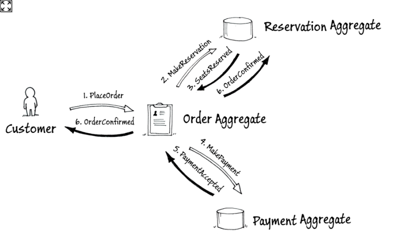
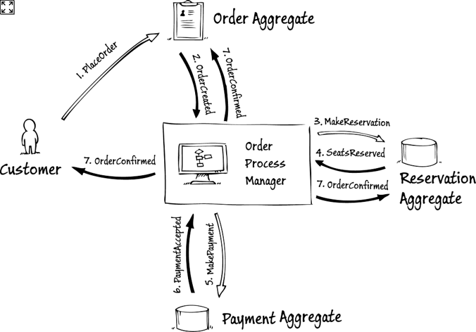
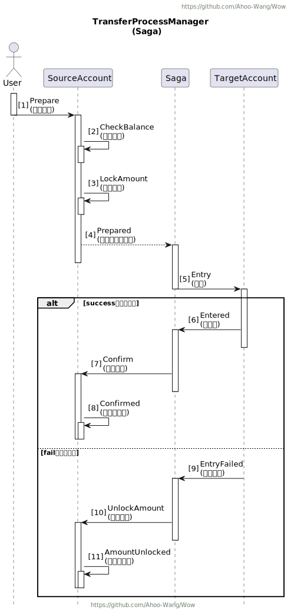

# 分布式事务 (Saga)

_Wow_ 框架提供了基于*流程编排(Orchestration)模式*的无状态的 _Saga_ 实现，可以用于处理分布式事务。

在近三年的实际生产环境验证中，我们发现无状态的 _Saga_ 已经足够满足实际复杂场景的需求。

## Saga 模式

Saga 模式是一种分布式事务协调方法，通过一系列事务步骤来更新每个服务并发布消息或事件。如果某个步骤失败，Saga 将执行补偿事务来抵消之前的事务。

### 流程编舞 (Choreography)

<center>


</center>

> 图片引用自 [A Saga on Sagas](https://learn.microsoft.com/en-us/previous-versions/msp-n-p/jj591569(v=pandp.10))。

流程编舞模式参与方在没有集中控制点的情况下交换事件。
在这种方法中，每个本地事务都会发布领域事件，触发其他服务中的本地事务。

**优点：**
- 适用于需要少量参与方并且不需要复杂协调逻辑的简单工作流。
- 不需要额外的服务实现和维护。
- 消除了单点故障的风险，因为责任分散在各个分布式事务参与方之间。

**缺点：**
- 添加新步骤时，工作流复杂性可能会增加，很难跟踪哪些分布式事务参与方响应特定命令。
- 存在分布式事务参与方之间的循环依赖的风险。
- 集成测试困难，因为必须运行所有服务以模拟事务。

### 流程编排 (Orchestration)

<center>


</center>

> 图片引用自 [A Saga on Sagas](https://learn.microsoft.com/en-us/previous-versions/msp-n-p/jj591569(v=pandp.10))。

流程编排模式相对于编舞需要增加集中的流程管理器告诉分布式事务参与方执行哪些本地事务。
Saga 流程管理器处理所有事务，并根据事件告诉参与方执行哪些操作。

**优点：**
- 适用于涉及许多参与方或随时间添加新参与方的复杂工作流。
- 在对每个参与方的流程和活动流的控制方面具有更大的灵活性。
- 不引入循环依赖，因为流程管理器单方面依赖于Saga参与方。
- 关注点分离，因为参与方不需要知道其他参与方的领域事件与命令。

**缺点：**
- 需要单独维护流程管理器。

Wow 框架使用流程编排模式实现 _Saga_ 模式，

如果想要了解更多关于 _Saga_ 模式的内容，可以参考 [A Saga on Sagas](https://learn.microsoft.com/en-us/previous-versions/msp-n-p/jj591569(v=pandp.10))。

## 约定

_Saga_ 通过订阅事件完成处理逻辑后返回聚合命令。

- 流程管理器（_Saga_）需要添加 `@StatelessSaga` 注解，以便框架能够自动发现。
- 领域事件处理函数需要添加 `@OnEvent` 注解，但该注解不是必须的，默认情况下命名为 `onEvent` 即表明该函数为事件接收函数。
- 领域事件处理函数接受的参数为：具体领域事件 (`Prepared`)、领域事件 (`DomainEvent<Prepared>`)。
- 领域事件处理函数的返回值类型为：`null`、命令体 (`Prepared`)、命令构造器 (`CommandBuilder`)、命令消息 (`CommandMessage<Prepared>`)。
- 领域事件处理函数可以返回`0-N`个聚合命令，该聚合命令将会被发送到命令总线。

## 银行转账案例中的转账流程管理器

<center>


</center>

转账流程管理器（`TransferSaga`）负责协调处理转账的事件，并生成相应的命令。

- `onEvent(Prepared)`: 订阅转账已准备就绪事件（`Prepared`），并生成入账命令(`Entry`)。
- `onEvent(AmountEntered)`: 订阅转账已入账事件（`AmountEntered`），并生成确认转账命令(`Confirm`)。
- `onEvent(EntryFailed)`: 订阅转账入账失败事件（`EntryFailed`），并生成解锁金额命令(`UnlockAmount`)。

```java
@StatelessSaga
public class TransferSaga {

    Entry onEvent(Prepared prepared, AggregateId aggregateId) {
        return new Entry(prepared.to(), aggregateId.getId(), prepared.amount());
    }

    Confirm onEvent(AmountEntered amountEntered) {
        return new Confirm(amountEntered.sourceId(), amountEntered.amount());
    }

    UnlockAmount onEvent(EntryFailed entryFailed) {
        return new UnlockAmount(entryFailed.sourceId(), entryFailed.amount());
    }
}
```

## 单元测试

> 使用 `SagaSpec` 进行 Saga 单元测试，可以有效的减少单元测试的编写工作量。

> `TransferSaga` 单元测试

```kotlin
class TransferSagaSpec : SagaSpec<TransferSaga>({
   on {
      val prepared = Prepared("to", 1)
      whenEvent(prepared) {
         expectNoError()
         expectCommandType(Entry::class)
         expectCommandBody<Entry> {
            id.assert().isEqualTo(prepared.to)
            amount.assert().isEqualTo(prepared.amount)
         }
      }
   }
   on {
      val amountEntered = AmountEntered("sourceId", 1)
      whenEvent(amountEntered) {
         expectNoError()
         expectCommandType(Confirm::class)
         expectCommandBody<Confirm> {
            id.assert().isEqualTo(amountEntered.sourceId)
            amount.assert().isEqualTo(amountEntered.amount)
         }
      }
   }
   on {
      val entryFailed = EntryFailed("sourceId", 1)
      whenEvent(entryFailed) {
         expectCommandType(UnlockAmount::class)
         expectCommandBody<UnlockAmount> {
            id.assert().isEqualTo(entryFailed.sourceId)
            amount.assert().isEqualTo(entryFailed.amount)
         }
      }
   }
})
```
