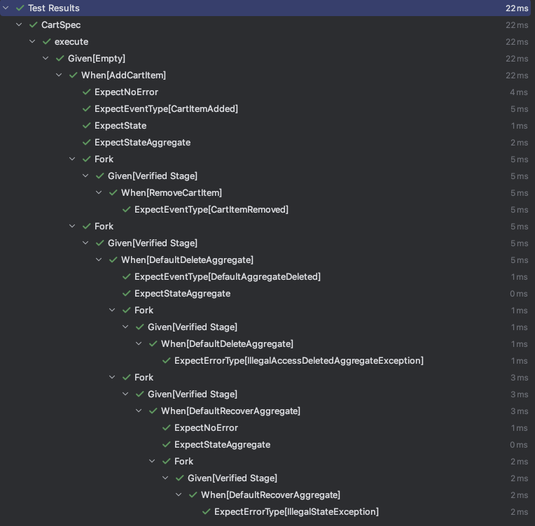

# 测试套件

*单元测试*是确保代码质量且符合预期业务需求的重要手段，但在传统架构中，单元测试往往是一项相当困难的任务，因为你需要考虑数据库连接、事务管理、数据清理等问题。

使用 _Wow_ 框架，你将会发现基于 _Given->When->Expect_ 模式的测试套件，使得单元测试变得异常简单。
你只需关注领域模型是否符合预期，而无需为数据库连接等问题烦恼。

:::tip
在实际应用中，我们将领域模型的单元测试覆盖率下限阈值设置为 **85%**，也是可以轻松实现的。
在没有刻意要求的情况下，开发人员甚至自觉地将覆盖率提升至 **95%**。
因此，每次提交代码都变得轻松自在，因为你确信你的代码经过了充分的测试，并且真正意义上从单元测试中获得了收益。
:::

在研发同级别的项目中，我们的测试团队在系统 _API_ 测试中发现，基于 Wow 框架的项目，其 _BUG_ 数仅为传统架构项目的 **1/3**。

- Given: 先前的领域事件，用于初始化聚合根状态。
- When：当前执行的命令，用于触发聚合根状态变更。
- Expect：期望的结果，用于验证聚合根状态变更是否符合预期。


## 安装

::: code-group
```kotlin [Gradle(Kotlin)]
testImplementation("me.ahoo.wow:wow-test")
```
```groovy [Gradle(Groovy)]
testImplementation 'me.ahoo.wow:wow-test'
```
```xml [Maven]
<dependency>
    <groupId>me.ahoo.wow</groupId>
    <artifactId>wow-test</artifactId>
    <version>${wow.version}</version>
    <scope>test</scope>
</dependency>
```
:::

## 测试聚合根

使用 `AggregateSpec` 进行全面的聚合测试：

```kotlin
class CartSpec : AggregateSpec<Cart, CartState>(
    {
        on {
            val ownerId = generateGlobalId()
            val addCartItem = AddCartItem(
                productId = "productId",
                quantity = 1,
            )
            givenOwnerId(ownerId)
            whenCommand(addCartItem) {
                expectNoError()
                expectEventType(CartItemAdded::class)
                expectState {
                    items.assert().hasSize(1)
                }
                expectStateAggregate {
                    ownerId.assert().isEqualTo(ownerId)
                }
                fork {
                    val removeCartItem = RemoveCartItem(
                        productIds = setOf(addCartItem.productId),
                    )
                    whenCommand(removeCartItem) {
                        expectEventType(CartItemRemoved::class)
                    }
                }
                fork {
                    whenCommand(DefaultDeleteAggregate) {
                        expectEventType(DefaultAggregateDeleted::class)
                        expectStateAggregate {
                            deleted.assert().isTrue()
                        }

                        fork {
                            whenCommand(DefaultDeleteAggregate) {
                                expectErrorType(IllegalAccessDeletedAggregateException::class)
                            }
                        }
                        fork {
                            whenCommand(DefaultRecoverAggregate) {
                                expectNoError()
                                expectStateAggregate {
                                    deleted.assert().isFalse()
                                }
                                fork {
                                    whenCommand(DefaultRecoverAggregate) {
                                        expectErrorType(IllegalStateException::class)
                                    }
                                }
                            }
                        }
                    }
                }
            }
        }
    }
)
```



## 测试 Saga

使用 `SagaSpec` 测试无状态 Saga 行为：

```kotlin
class CartSagaSpec : SagaSpec<CartSaga>({
    on {
        val ownerId = generateGlobalId()
        val orderItem = OrderItem(
            id = generateGlobalId(),
            productId = generateGlobalId(),
            price = BigDecimal.valueOf(10),
            quantity = 10,
        )
        whenEvent(
            event = mockk<OrderCreated> {
                every {
                    items
                } returns listOf(orderItem)
                every {
                    fromCart
                } returns true
            },
            ownerId = ownerId
        ) {
            expectCommandType(RemoveCartItem::class)
            expectCommand<RemoveCartItem> {
                aggregateId.id.assert().isEqualTo(ownerId)
                body.productIds.assert().hasSize(1)
                body.productIds.assert().first().isEqualTo(orderItem.productId)
            }
        }
    }
    on {
        name("NotFromCart")
        val orderItem = OrderItem(
            id = generateGlobalId(),
            productId = generateGlobalId(),
            price = BigDecimal.valueOf(10),
            quantity = 10,
        )
        whenEvent(
            event = mockk<OrderCreated> {
                every {
                    items
                } returns listOf(orderItem)
                every {
                    fromCart
                } returns false
            },
            ownerId = generateGlobalId()
        ) {
            expectNoCommand()
        }
    }
})
```


## 高级场景

对于包含服务注入和错误处理的复杂工作流：

```kotlin
class OrderSpec : AggregateSpec<Order, OrderState>({
    on {
        val ownerId = generateGlobalId()
        val orderItem = CreateOrder.Item(productId = generateGlobalId(), price = BigDecimal.TEN, quantity = 10)

        givenOwnerId(ownerId)

        // 注入模拟服务
        val inventoryService = object : InventoryService {
            override fun getInventory(productId: String) = orderItem.quantity.toMono()
        }
        val pricingService = object : PricingService {
            override fun getProductPrice(productId: String) = orderItem.price.toMono()
        }

        inject { register(DefaultCreateOrderSpec(inventoryService, pricingService)) }

        whenCommand(CreateOrder(listOf(orderItem), shippingAddress, false)) {
            expectNoError()
            expectEventType(OrderCreated::class)
            expectState { status.assert().isEqualTo(OrderStatus.CREATED) }

            fork("Pay Order") {
                val payOrder = PayOrder(generateGlobalId(), orderItem.price * BigDecimal(orderItem.quantity))
                whenCommand(payOrder) {
                    expectEventType(OrderPaid::class)
                    expectState { status.assert().isEqualTo(OrderStatus.PAID) }

                    fork("Ship Order") {
                        whenCommand(ShipOrder(stateAggregate.aggregateId.id)) {
                            expectEventType(OrderShipped::class)
                            expectState { status.assert().isEqualTo(OrderStatus.SHIPPED) }
                        }
                    }

                    fork("Duplicate Payment") {
                        whenCommand(PayOrder(generateGlobalId(), orderItem.price * BigDecimal(orderItem.quantity))) {
                            expectErrorType(DomainEventException::class)
                            expectEventType(OrderPayDuplicated::class)
                        }
                    }
                }
            }

            fork("Invalid Operation") {
                whenCommand(ShipOrder(stateAggregate.aggregateId.id)) {
                    expectErrorType(IllegalStateException::class)
                    expectState { status.assert().isEqualTo(OrderStatus.CREATED) }
                }
            }
        }
    }
})
```

### 引用点和跨场景分支

使用 `ref()` 标记验证点，并使用 `fork(ref, ...)` 从它们分支到不同的测试场景：

```kotlin
class OrderSpec : AggregateSpec<Order, OrderState>({
    on {
        val orderId = generateGlobalId()
        val createOrder = CreateOrder(/*...*/)

        whenCommand(createOrder) {
            expectEventType(OrderCreated::class)
            ref("order-created")  // 标记此验证点
            expectState { status.assert().isEqualTo(OrderStatus.CREATED) }
        }
    }

    // 在单独的场景中从标记点分支
    fork("order-created", "Pay Order") {
        val payOrder = PayOrder(/*...*/)
        whenCommand(payOrder) {
            expectEventType(OrderPaid::class)
            expectState { status.assert().isEqualTo(OrderStatus.PAID) }
        }
    }

    fork("order-created", "Cancel Order") {
        val cancelOrder = CancelOrder(/*...*/)
        whenCommand(cancelOrder) {
            expectEventType(OrderCancelled::class)
            expectState { status.assert().isEqualTo(OrderStatus.CANCELLED) }
        }
    }
})
```

## API 参考

### AggregateSpec

使用 Given/When/Expect 模式测试聚合的规范类：

- `AggregateSpec<C, S>(block: AggregateDsl<S>.() -> Unit)`：接受 DSL 块的构造函数
- `on(block: GivenDsl<S>.() -> Unit)`：定义测试场景
- `fork(ref: String, name: String = "", verifyError: Boolean = false, block: ForkedVerifiedStageDsl<S>.() -> Unit)`：从之前引用的验证点创建分支测试场景

### SagaSpec

测试无状态 Saga 的规范类：

- `SagaSpec<T>(block: StatelessSagaDsl<T>.() -> Unit)`：接受 DSL 块的构造函数
- `on(block: WhenDsl<T>.() -> Unit)`：定义测试场景

### DSL 接口

#### AggregateDsl
- `on(block: GivenDsl<S>.() -> Unit)`：定义完整的测试场景

#### GivenDsl
- `inject(block: ServiceProvider.() -> Unit)`：注入服务或依赖项
- `givenOwnerId(ownerId: String)`：为聚合设置所有者 ID
- `givenEvent(event: Any, block: WhenDsl<S>.() -> Unit)`：使用领域事件初始化
- `givenEvent(events: Array<out Any>, block: WhenDsl<S>.() -> Unit)`：使用多个事件初始化
- `givenState(state: S, version: Int, block: WhenDsl<S>.() -> Unit)`：使用直接状态初始化

#### WhenDsl
- `whenCommand(command: Any, header: Header, ownerId: String, block: ExpectDsl<S>.() -> Unit)`：执行命令

#### ExpectDsl
- `expectNoError()`：断言未发生错误
- `expectErrorType(errorType: KClass<out Throwable>)`：断言特定错误类型
- `expectEventType(eventType: KClass<out Any>)`：断言生成的事件类型
- `expectState(block: S.() -> Unit)`：验证聚合状态
- `expectStateAggregate(block: StateAggregate<S>.() -> Unit)`：验证聚合元数据
- `ref(ref: String)`：标记当前验证点以供后续分支使用
- `fork(name: String = "", verifyError: Boolean = false, block: ForkedVerifiedStageDsl<S>.() -> Unit)`：从当前验证状态创建分支测试场景

##### Fork 函数使用场景

`fork` 函数通过从验证状态创建独立测试分支来测试复杂工作流和边界情况：

- **顺序操作**：测试多步骤流程，如订单创建 → 支付 → 发货
- **错误场景**：验证在无效状态下尝试操作时的行为
- **替代路径**：从同一起点测试不同的命令序列
- **聚合生命周期**：测试删除、恢复和删除后的行为
- **业务规则**：验证跨状态转换的约束和业务逻辑

**引用点与 ref()：**
`ref()` 方法允许标记特定的验证点以供后续分支。使用 `AggregateDsl.fork(ref, ...)` 从任何之前标记的点创建分支，实现跨不同 `on` 块的复杂测试流程。

**最佳实践：**
- 为 fork 使用描述性名称以阐明测试意图
- 使用 `ref()` 标记重要的验证点以进行跨场景分支
- 避免深度嵌套（超过 3 层）- 使用 `ref()` 和 `fork(ref, ...)` 进行复杂分支
- 对相关操作使用 fork，对不相关场景使用单独的 `on` 块

#### StatelessSagaDsl
- `on(block: WhenDsl<T>.() -> Unit)`：定义 Saga 测试场景

#### Saga WhenDsl
- `functionFilter(filter: (MessageFunction<*, *, *>) -> Boolean)`：过滤消息函数
- `functionName(functionName: String)`：按函数名称过滤
- `whenEvent(event: Any, state: Any?, ownerId: String, block: ExpectDsl<T>.() -> Unit)`：使用事件触发 Saga

#### Saga ExpectDsl
- `expectCommandType(commandType: KClass<out Any>)`：断言发送的命令类型
- `expectCommand(block: CommandMessage<*>.() -> Unit)`：验证命令内容
- `expectNoCommand()`：断言未发送命令