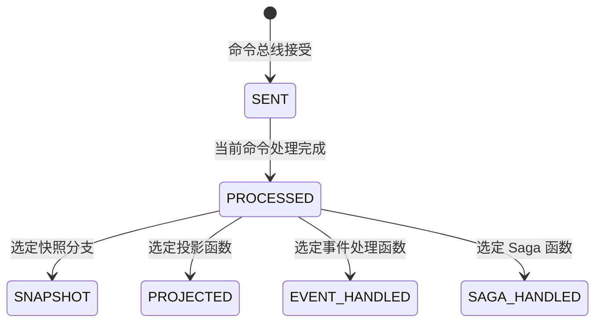

# 接口返回 200，查询却查不到：别再 `sleep(1s)`，理解 Wow 的一致性等待

用户提交订单，接口返回 HTTP 200，详情页立即查询却得到 404。把客户端改成 `sleep(1000)` 可能暂时隐藏问题，却没有回答真正的问题：**响应返回时，系统承诺完成了什么？**

本文的观点是：在异步读写链路中，“成功”必须绑定到业务需要的完成边界，而不是绑定到一个猜测的延迟。

## 先区分四类陈述

- **观点**：固定等待不是完成合同；调用方应等待自己真正消费的结果。
- **Wow 当前行为**：请求携带的等待计划决定命令响应要观察哪个阶段。
- **仓库证据**：当前实现与测试覆盖等待注册、阶段信号、超时清理和示例领域行为。
- **外部研究**：本文不需要外部性能或生产率数据，因此不引用历史 TPS 来证明架构选择。

精确阶段、函数匹配和链式等待以[完成语义](../guide/command/completion.md)为准，幂等边界见[失败与幂等](../guide/command/reliability.md)；本文只讨论怎样选择承诺。

## HTTP 200 只说明这次响应按所选合同结束

在 Wow WebFlux 命令入口中，等待策略从请求提取等待计划，命令网关注册等待句柄后发送命令。于是，同样的 HTTP 状态可能对应不同完成边界：

- `SENT` 适合“系统已接受请求，后台继续处理”；它不能证明聚合已经执行。
- `PROCESSED` 适合“领域决策与当前命令处理链已经完成”；它不能证明查询投影已更新。
- 精确到函数的 `PROJECTED` 只证明匹配投影函数返回的响应式链已经完成；它不能证明查询路径、缓存或副本已经能返回变更，也不能证明其他消费者完成。

`SNAPSHOT`、`EVENT_HANDLED`、`SAGA_HANDLED` 与链式等待有各自边界。不要从名称猜语义，直接查阅[完成语义](../guide/command/completion.md)。

这几个阶段不是一条每次都会走完的直线。聚合处理完成后，快照、投影、事件处理器与 Saga 是可独立等待的分支。

这张图是文章中的心智模型，不是完整 API 参考；完整合同仍在 canonical guide。

## 为什么固定延迟不是合同

`sleep(1s)` 同时有两个缺陷：

1. 目标在 100 ms 完成时，多等的 900 ms 没有增加正确性。
2. 目标在 1 s 后仍未完成时，查询照样过期。

更重要的是，固定延迟无法说明“哪个投影、哪个处理函数、哪条命令”已经完成。精确等待目标把完成条件关联到命令与消费者；超时则给等待设置截止点。

因此，不要先问“等几秒”，而要先问：

| 产品需要 | 应表达的完成边界 | 仍需避免的误解 |
| --- | --- | --- |
| 先接受工作，稍后处理 | `SENT` | 业务规则已经执行 |
| 响应前确认领域决策 | `PROCESSED` | 查询模型已经更新 |
| 打开依赖某个投影的页面 | 精确 `PROJECTED` + 实际查询/读模型可见性检查 | 处理器信号到达就代表查询已可见 |

若产品读取的是聚合溯源状态而不是投影视图，先确认实际读取路径，再选择快照策略或等待阶段。读取路径的权威说明见[数据流](../guide/advanced/data-flow.md#读取路径)。

## 超时表示“未观察到目标”，不是“命令失败”

调用方在 deadline 前没有收到目标信号，只能证明这次等待超时。命令可能尚未处理，也可能已经追加事件、但通知丢失或下游尚未完成。

重试前应保留同一个逻辑 `requestId`，查询命令结果或权威状态，并记录最后观察到的阶段。换一个新 request ID 重新提交，可能把“结果未知”变成重复业务动作。Wow 的幂等性范围和后端责任见[失败与幂等](../guide/command/reliability.md)。

## 当前仓库能证明什么

当前仓库提供三类证据：

- [`CommandStage.kt`](https://github.com/Ahoo-Wang/Wow/blob/main/wow-core/src/main/kotlin/me/ahoo/wow/command/wait/CommandStage.kt) 与等待实现定义并执行阶段关系；
- `wow-core` 的等待测试覆盖注册、信号与超时清理；
- [Kotlin 订单与购物车](../reference/example/order.md)证明命令、事件、状态和 Saga 的领域链路，`./gradlew :example-domain:check` 是对应检查。

证据也有边界：示例中的 `OrderProjector` 主要记录日志，是注册与调度示例，不是生产读模型。因此本文不会把示例测试写成“生产查询一致性已验证”。应用仍需用真实投影存储、故障注入和 HTTP 流程验证自己的等待合同。

## 落地检查表

1. 写下响应后用户马上要做的动作。
2. 找出该动作实际读取的权威状态或投影。
3. 选择能限定所需函数的最弱阶段；用户要读取查询结果时，再单独执行该查询验证可见性。
4. 定义 deadline 与“结果未知”的返回语义。
5. 用同一 request ID 验证超时、重试和重复通知。
6. 在真实 Adapter 上测试延迟、失败与恢复，而不只测试成功路径。

## 结语

“接口成功但查询不到”通常不是一句“最终一致”就能结束的讨论。它要求产品和工程共同定义：哪一个结果、在哪个边界、对哪个调用方算完成。

Wow 提供可声明的等待机制；它不会替应用选择正确承诺。精确 `PROJECTED` 可以限定匹配投影函数返回链已经完成，但实际查询可见性仍是独立的产品验收。明确组合这两项，才是比 `sleep(1s)` 更可靠、也更诚实的设计。

继续阅读：[核心概念](../guide/core-concepts.md)、[完成语义](../guide/command/completion.md)、[应用测试](../guide/application-testing.md)和[故障排查](../guide/troubleshooting.md)。
